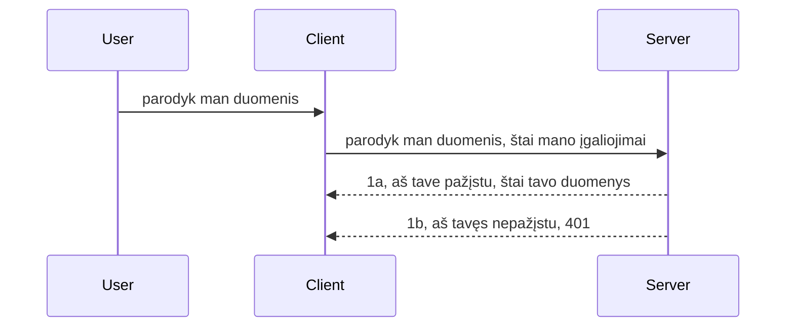

# Paprasta autentifikacija

MCP SDK palaiko OAuth 2.1 naudojimą, kuris, reikia pripažinti, yra gana sudėtingas procesas, apimantis tokius dalykus kaip autentifikavimo serveris, resursų serveris, paskyros duomenų įrašymas, kodo gavimas, kodo keitimas į nešiklio žetoną, kol galiausiai galite gauti savo resursų duomenis. Jei nesate pratę prie OAuth, kuris yra puikus diegti dalykas, geriausia pradėti nuo bazinio autentifikavimo lygio ir palaipsniui kurti vis geresnį saugumą. Todėl egzistuoja šis skyrius, kuris padės jums pasiekti pažangesnį autentifikavimą.

## Autentifikacija, ką turime omenyje?

Autentifikacija yra trumpinys nuo autentifikavimo ir autorizavimo. Idėja yra tokia, kad turime atlikti du dalykus:

- **Autentifikavimas**, tai procesas, kai nustatome, ar leidžiame asmeniui patekti į savo namus, t.y., ar jis turi teisę būti „čia“, tai yra turėti prieigą prie mūsų resursų serverio, kuriame gyvena mūsų MCP serverio funkcijos.
- **Autorizavimas**, tai procesas, kurio metu nustatome, ar vartotojas turėtų turėti prieigą prie konkrečių resursų, kurių jis prašo, pavyzdžiui, šių užsakymų arba šių produktų, arba ar jam leidžiama tik skaityti turinį, bet ne trinti, kaip kitas pavyzdys.

## Kredencialai: kaip nurodome sistemai, kas mes esame

Dauguma žiniatinklio kūrėjų pradeda mąstyti pateikdami serveriui kredencialą, dažniausiai slaptą kodą, kuris sako, ar jiems leidžiama būti čia („Autentifikavimas“). Šis kredencialas dažniausiai yra vartotojo vardo ir slaptažodžio base64 koduota versija arba API raktas, kuris unikalus tam tikram vartotojui.

Tai apima siuntimą per antraštę, pavadintą „Authorization“, tokiu būdu:

```json
{ "Authorization": "secret123" }
```

Tai paprastai vadinama baziniu autentifikavimu. Bendras srauto veikimo principas yra toks:


Dabar, kai suprantame, kaip veikia srautas, kaip tai įgyvendinti? Dauguma žiniatinklio serverių turi sąvoką, vadinamą middleware, tai yra kodo gabalas, kuris vyksta kaip užklausos dalis, gali patikrinti kredencialus ir, jei kredencialai galioja, leidžia užklausai praeiti. Jei užklausa neturi galiojančių kredencialų, gaunate autentifikavimo klaidą. Pažiūrėkime, kaip tai galima įgyvendinti:

**Python**

```python
class AuthMiddleware(BaseHTTPMiddleware):
    async def dispatch(self, request, call_next):

        has_header = request.headers.get("Authorization")
        if not has_header:
            print("-> Missing Authorization header!")
            return Response(status_code=401, content="Unauthorized")

        if not valid_token(has_header):
            print("-> Invalid token!")
            return Response(status_code=403, content="Forbidden")

        print("Valid token, proceeding...")
       
        response = await call_next(request)
        # pridėti bet kokius vartotojo antraštes arba pakeisti atsakymą kažkokiu būdu
        return response


starlette_app.add_middleware(CustomHeaderMiddleware)
```

Čia turime:

- Sukurtą middleware pavadinimu `AuthMiddleware`, kuriame `dispatch` metodas yra kviečiamas žiniatinklio serverio.
- Įtrauktą middleware į žiniatinklio serverį:

    ```python
    starlette_app.add_middleware(AuthMiddleware)
    ```

- Parašytą validacijos logiką, kuri tikrina, ar yra „Authorization“ antraštė, ir ar siunčiamas slaptasis kodas yra galiojantis:

    ```python
    has_header = request.headers.get("Authorization")
    if not has_header:
        print("-> Missing Authorization header!")
        return Response(status_code=401, content="Unauthorized")

    if not valid_token(has_header):
        print("-> Invalid token!")
        return Response(status_code=403, content="Forbidden")
    ```

Jei slaptasis kodas yra pateiktas ir galiojantis, leidžiame užklausai praeiti, kviesdami `call_next` ir grąžindami atsakymą.

    ```python
    response = await call_next(request)
    # pridėti bet kokius kliento antraštes arba kokiu nors būdu pakeisti atsakymą
    return response
    ```

Tai veikia taip: jei žiniatinklio užklausa yra nukreipiama į serverį, middleware bus kviečiamas ir, atsižvelgiant į jo įgyvendinimą, jis arba leis užklausai praeiti, arba grąžins klaidą, rodydamas, kad klientas negali tęsti.

**TypeScript**

Čia mes sukuriame middleware naudojant populiarų Express karkasą ir perimame užklausą prieš jai pasiekiant MCP Serverį. Štai kodas tam:

```typescript
function isValid(secret) {
    return secret === "secret123";
}

app.use((req, res, next) => {
    // 1. Ar yra autorizacijos antraštė?
    if(!req.headers["Authorization"]) {
        res.status(401).send('Unauthorized');
    }
    
    let token = req.headers["Authorization"];

    // 2. Patikrinti galiojimą.
    if(!isValid(token)) {
        res.status(403).send('Forbidden');
    }

   
    console.log('Middleware executed');
    // 3. Perduoda užklausą kitam užklausų apdorojimo veiksmui.
    next();
});
```

Šiame kode mes:

1. Patikriname, ar yra „Authorization“ antraštė, jei ne, siunčiame 401 klaidą.
2. Užtikriname, kad kredencialas/žetonas yra galiojantis, jei ne, siunčiame 403 klaidą.
3. Galiausiai perduodame užklausą toliau ir grąžiname prašomą resursą.

## Pratybos: įgyvendinti autentifikavimą

Panaudokime savo žinias ir pabandykime ją įgyvendinti. Štai planas:

Serveris

- Sukurti žiniatinklio serverį ir MCP instanciją.
- Įgyvendinti serverio middleware.

Klientas

- Siųsti žiniatinklio užklausą su kredencialais per antraštę.

### -1- Sukurkite žiniatinklio serverį ir MCP instanciją

Pirmame žingsnyje turime sukurti žiniatinklio serverio instanciją ir MCP Serverį.

**Python**

Čia sukuriame MCP serverio instanciją, sukonstruojame starlette žiniatinklio programėlę ir talpiname ją su uvicorn.

```python
# kuriamas MCP serveris

app = FastMCP(
    name="MCP Resource Server",
    instructions="Resource Server that validates tokens via Authorization Server introspection",
    host=settings["host"],
    port=settings["port"],
    debug=True
)

# kuriama starlette žiniatinklio programa
starlette_app = app.streamable_http_app()

# programos aptarnavimas per uvicorn
async def run(starlette_app):
    import uvicorn
    config = uvicorn.Config(
            starlette_app,
            host=app.settings.host,
            port=app.settings.port,
            log_level=app.settings.log_level.lower(),
        )
    server = uvicorn.Server(config)
    await server.serve()

run(starlette_app)
```

Šiame kode mes:

- Sukuriame MCP Serverį.
- Sukuriame starlette žiniatinklio programėlę iš MCP Serverio, `app.streamable_http_app()`.
- Talpiname ir aptarnaujame žiniatinklio programėlę naudodami uvicorn `server.serve()`.

**TypeScript**

Čia sukuriame MCP Serverio instanciją.

```typescript
const server = new McpServer({
      name: "example-server",
      version: "1.0.0"
    });

    // ... nustatyti serverio išteklius, įrankius ir užklausas ...
```

Šis MCP Serverio kūrimas turi vykti mūsų POST /mcp maršrutų apibrėžime, tad paimkime aukščiau pateiktą kodą ir perkelkime jį taip:

```typescript
import express from "express";
import { randomUUID } from "node:crypto";
import { McpServer } from "@modelcontextprotocol/sdk/server/mcp.js";
import { StreamableHTTPServerTransport } from "@modelcontextprotocol/sdk/server/streamableHttp.js";
import { isInitializeRequest } from "@modelcontextprotocol/sdk/types.js"

const app = express();
app.use(express.json());

// Žemėlapis, skirtas transportams saugoti pagal sesijos ID
const transports: { [sessionId: string]: StreamableHTTPServerTransport } = {};

// Apdoroti POST užklausas klientas-serveris komunikacijai
app.post('/mcp', async (req, res) => {
  // Patikrinti, ar yra esamas sesijos ID
  const sessionId = req.headers['mcp-session-id'] as string | undefined;
  let transport: StreamableHTTPServerTransport;

  if (sessionId && transports[sessionId]) {
    // Pakartotinai panaudoti esamą transportą
    transport = transports[sessionId];
  } else if (!sessionId && isInitializeRequest(req.body)) {
    // Naujas inicijavimo prašymas
    transport = new StreamableHTTPServerTransport({
      sessionIdGenerator: () => randomUUID(),
      onsessioninitialized: (sessionId) => {
        // Išsaugoti transportą pagal sesijos ID
        transports[sessionId] = transport;
      },
      // DNS peradresavimo apsauga pagal numatytuosius nustatymus išjungta dėl atgalinio suderinamumo. Jei jūs vykdote šį serverį
      // lokaliai, būtinai nustatykite:
      // enableDnsRebindingProtection: true,
      // allowedHosts: ['127.0.0.1'],
    });

    // Išvalyti transportą, kai jis uždaromas
    transport.onclose = () => {
      if (transport.sessionId) {
        delete transports[transport.sessionId];
      }
    };
    const server = new McpServer({
      name: "example-server",
      version: "1.0.0"
    });

    // ... paruošti serverio išteklius, įrankius ir užklausas ...

    // Prisijungti prie MCP serverio
    await server.connect(transport);
  } else {
    // Neteisinga užklausa
    res.status(400).json({
      jsonrpc: '2.0',
      error: {
        code: -32000,
        message: 'Bad Request: No valid session ID provided',
      },
      id: null,
    });
    return;
  }

  // Apdoroti užklausą
  await transport.handleRequest(req, res, req.body);
});

// Pakartotinai naudojamas tvarkytojas GET ir DELETE užklausoms
const handleSessionRequest = async (req: express.Request, res: express.Response) => {
  const sessionId = req.headers['mcp-session-id'] as string | undefined;
  if (!sessionId || !transports[sessionId]) {
    res.status(400).send('Invalid or missing session ID');
    return;
  }
  
  const transport = transports[sessionId];
  await transport.handleRequest(req, res);
};

// Apdoroti GET užklausas serverio-kliento pranešimams per SSE
app.get('/mcp', handleSessionRequest);

// Apdoroti DELETE užklausas sesijos nutraukimui
app.delete('/mcp', handleSessionRequest);

app.listen(3000);
```

Dabar matote, kaip MCP Serverio kūrimas buvo perkeltas į `app.post("/mcp")`.

Judėkime toliau, prie middleware kūrimo, kad galėtume patvirtinti atėjusius kredencialus.

### -2- Įgyvendinti serverio middleware

Dabar pereikime prie middleware dalies. Čia kursime middleware, kuris ieško kredencialo `Authorization` antraštėje ir jį patvirtina. Jei kredencialas priimtinas, užklausa tęsis ir atliks reikalingus veiksmus (pvz., įvardys įrankius, skaitys resursą ar bet ką, ką klientas prašė MCP funkcionalumo).

**Python**

Norėdami sukurti middleware, turime sukurti klasę, kuri paveldi iš `BaseHTTPMiddleware`. Yra du įdomūs dalykai:

- Užklausa `request`, iš kurios skaitome antraštės informaciją.
- `call_next` atgalinis kvietimas, kurį turime iškviesti, jei klientas pateikė mums priimtiną kredencialą.

Pirma, turime apdoroti atvejį, kai trūksta `Authorization` antraštės:

```python
has_header = request.headers.get("Authorization")

# antraštė nerasta, nepavyko su klaida 401, kitu atveju tęsti.
if not has_header:
    print("-> Missing Authorization header!")
    return Response(status_code=401, content="Unauthorized")
```

Čia siunčiame 401 neautorizuoto pranešimą, nes klientas nepraėjo autentifikacijos.

Toliau, jei buvo pateiktas kredencialas, tikriname jo galiojimą taip:

```python
 if not valid_token(has_header):
    print("-> Invalid token!")
    return Response(status_code=403, content="Forbidden")
```

Atkreipkite dėmesį, kaip aukščiau siunčiame 403 uždraustą pranešimą. Pažiūrėkime visą middleware, kuri įgyvendina viską, ką minėjome aukščiau:

```python
class AuthMiddleware(BaseHTTPMiddleware):
    async def dispatch(self, request, call_next):

        has_header = request.headers.get("Authorization")
        if not has_header:
            print("-> Missing Authorization header!")
            return Response(status_code=401, content="Unauthorized")

        if not valid_token(has_header):
            print("-> Invalid token!")
            return Response(status_code=403, content="Forbidden")

        print("Valid token, proceeding...")
        print(f"-> Received {request.method} {request.url}")
        response = await call_next(request)
        response.headers['Custom'] = 'Example'
        return response

```

Puiku, bet o `valid_token` funkcija? Ji pateikta žemiau:

```python
# NENAUDOKITE gamyboje - tobulinkite tai !!
def valid_token(token: str) -> bool:
    # pašalinkite "Bearer " priesagą
    if token.startswith("Bearer "):
        token = token[7:]
        return token == "secret-token"
    return False
```

Žinoma, tai turėtų būti patobulinta.

SVARBU: Jūs NETURĖTUMĖTE laikyti tokių slaptų raktų kode. Idealus variantas - gauti reikšmę iš duomenų šaltinio ar iš IDP (tapatybės paslaugų teikėjo), arba dar geriau, leisti IDP atlikti validaciją.

**TypeScript**

Norėdami įgyvendinti tai su Express, turime kviesti `use` metodą, kurį priima middleware funkcijos.

Turime:

- Sąveikauti su užklausa, kad patikrintume perduotą kredencialą `Authorization` savybėje.
- Patikrinti kredencialą ir jei jis galioja, leisti užklausai tęsti, kad kliento MCP užklausa atliktų tai, ką turėtų (pvz., įvardytų įrankius, perskaitytų resursą ar kitus MCP susijusius veiksmus).

Čia tikriname, ar yra `Authorization` antraštė ir jei jos nėra, sustabdome užklausą:

```typescript
if(!req.headers["authorization"]) {
    res.status(401).send('Unauthorized');
    return;
}
```

Jei antraštė visiškai nepateikta, gaunate 401 klaidą.

Toliau tikriname, ar kredencialas galiojantis, jei ne, dar kartą sustabdome užklausą, bet su šiek tiek kita žinute:

```typescript
if(!isValid(token)) {
    res.status(403).send('Forbidden');
    return;
} 
```

Atkreipkite dėmesį, dabar gaunate 403 klaidą.

Štai visas kodas:

```typescript
app.use((req, res, next) => {
    console.log('Request received:', req.method, req.url, req.headers);
    console.log('Headers:', req.headers["authorization"]);
    if(!req.headers["authorization"]) {
        res.status(401).send('Unauthorized');
        return;
    }
    
    let token = req.headers["authorization"];

    if(!isValid(token)) {
        res.status(403).send('Forbidden');
        return;
    }  

    console.log('Middleware executed');
    next();
});
```

Paruošėme žiniatinklio serverį priimti middleware, kuris tikrina, ar klientas mums siunčia kredencialus. O kas su pačiu klientu?

### -3- Siųsti žiniatinklio užklausą su kredencialais per antraštę

Turime įsitikinti, kad klientas perduoda kredencialą per antraštę. Kadangi naudosime MCP klientą tai daryti, turime sužinoti, kaip tai padaryti.

**Python**

Klientui turime perduoti antraštę su savo kredencialu tokiu būdu:

```python
# NENAUDOKITE fiksuotos reikšmės, bent jau laikykite ją aplinkos kintamajame arba saugesnėje saugykloje
token = "secret-token"

async with streamablehttp_client(
        url = f"http://localhost:{port}/mcp",
        headers = {"Authorization": f"Bearer {token}"}
    ) as (
        read_stream,
        write_stream,
        session_callback,
    ):
        async with ClientSession(
            read_stream,
            write_stream
        ) as session:
            await session.initialize()
      
            # TODO, ką norite atlikti kliente, pvz., išvardinti įrankius, iškviesti įrankius ir pan.
```

Atkreipkite dėmesį, kaip užpildome `headers` savybę tokiu būdu `headers = {"Authorization": f"Bearer {token}"}`.

**TypeScript**

Tai galime išspręsti dviem žingsniais:

1. Užpildyti konfigūracijos objektą savo kredencialu.
2. Perduoti konfigūracijos objektą transportui.

```typescript

// NENAUDOKITE vertės įkoduotos tiesiogiai kaip parodyta čia. Bent jau turėkite ją kaip aplinkos kintamąjį ir naudokite kažką panašaus į dotenv (plėtros režimu).
let token = "secret123"

// apibrėžkite kliento transporto parinkčių objektą
let options: StreamableHTTPClientTransportOptions = {
  sessionId: sessionId,
  requestInit: {
    headers: {
      "Authorization": "secret123"
    }
  }
};

// perduokite parinkčių objektą transportui
async function main() {
   const transport = new StreamableHTTPClientTransport(
      new URL(serverUrl),
      options
   );
```

Čia matote, kaip turėjome sukurti `options` objektą ir įdėti mūsų antraštes į `requestInit` savybę.

SVARBU: Kaip tai pagerinti? Dabartinė įgyvendinimo forma turi tam tikrų trūkumų. Visų pirma, perduoti kredencialą tokiu būdu yra gana rizikinga, nebent bent jau turite HTTPS. Net ir tada kredencialas gali būti pavogtas, todėl jums reikia sistemos, kurios pagalba galėtumėte lengvai atšaukti žetoną ir pridėti papildomus patikrinimus, pvz., iš kur pasaulyje jis kyla, ar užklausa vykdoma pernelyg dažnai (robotų elgesys), trumpai tariant, yra daug problemų.

Reikia paminėti, kad paprastoms API, kur nenorite, kad kas nors naudotų jūsų API be autentifikacijos, tai yra geras pradinis sprendimas.

Vis dėlto pabandykime sustiprinti saugumą naudodami standartizuotą formatą, pvz., JSON Web Token, dar žinomą kaip JWT arba „JOT“ žetonai.

## JSON Web Tokens, JWT

Taigi, stengiamės patobulinti dalykus nuo labai paprastų kredencialų siuntimo. Kokius tiesioginius patobulinimus gauname priimdami JWT?

- **Saugumo patobulinimai.** Su baziniu autentifikavimu jūs siunčiate vartotojo vardą ir slaptažodį kaip base64 koduotą žetoną (arba siunčiate API raktą) vėl ir vėl, kas padidina riziką. Su JWT jūs siunčiate savo vartotojo vardą ir slaptažodį, gaunate žetoną mainais ir jis taip pat yra riboto galiojimo laikotarpiu, t. y. jis baigs galioti. JWT leidžia lengvai naudoti smulkų prieigos valdymą naudojant vaidmenis, aprėptis ir leidimus.
- **Bestatusinis ir mastelio keičiamumas.** JWT yra savarankiški, jie neša visą vartotojo informaciją ir atima poreikį saugoti sesiją serverio pusėje. Žetoną taip pat galima validuoti vietoje.
- **Sąveikumas ir federacija.** JWT yra OpenID Connect centrinė dalis ir naudojama su žinomais tapatybės tiekėjais, tokiais kaip Entra ID, Google Identity ir Auth0. Jie taip pat leidžia naudoti vienkartinę prisijungimo funkciją ir daug daugiau, kas daro juos įmonių klase.
- **Moduliarumas ir lankstumas.** JWT taip pat galima naudoti su API vartais, tokiais kaip Azure API Management, NGINX ir kt. Tai palaiko naudotojų autentifikacijos scenarijus ir serverio-serviso komunikaciją, įskaitant įsikūnijimo ir delegavimo scenarijus.
- **Veikimas ir kešavimas.** JWT galima kešuoti po dešifravimo, tai sumažina poreikį nuolat analizuoti. Tai ypač padeda esant dideliam srautui, nes pagerina pralaidumą ir sumažina apkrovą pasirinktoje infrastruktūroje.
- **Pažangios funkcijos.** Taip pat palaiko introspekciją (galiojimo tikrinimą serveryje) ir žetonų atšaukimą (žetonų padarymą negaliojančiais).

Su šiomis nauda pamėginkime žiūrėti, kaip galime pakelti savo įgyvendinimą į kitą lygį.

## Iš bazinio autentifikavimo į JWT

Taigi, esmės pakeitimai aukštame lygmenyje yra:

- **Išmokti sukurti JWT žetoną** ir paruošti jį siuntimui iš kliento į serverį.
- **Validuoti JWT žetoną**, ir jei galioja, leisti klientui naudotis mūsų resursais.
- **Saugi žetono saugykla**. Kaip laikome šį žetoną.
- **Apsaugoti maršrutus**. Turime apsaugoti maršrutus, mūsų atveju, MCP maršrutus ir konkrečias funkcijas.
- **Pridėti atnaujinimo žetonus**. Užtikrinti, kad sukuriami trumpalaikiai žetonai ir ilgalaikiai atnaujinimo žetonai, kurie gali būti naudojami naujiems žetonams gauti, jei senieji baigė galioti. Taip pat užtikrinti egzistavimą atnaujinimo endpoint'ui ir rotacijos strategiją.

### -1- Sukurkite JWT žetoną

Pradžioje JWT žetonas turi šias dalis:

- **antraštę**, jame nurodomas naudotas algoritmas ir žetono tipas.
- **keliamus duomenis**, claims, tokius kaip sub (vartotojas arba subjektas, kuriam žetonas atstovauja. Autentifikacijos scenarijuje tai paprastai yra vartotojo ID), exp (kai baigs galioti), role (vartotojo vaidmuo)
- **parašą**, pasirašytą slaptu arba privačiu raktu.

Tam reikia sukonstruoti antraštę, keliamus duomenis ir koduotą žetoną.

**Python**

```python

import jwt
import jwt
from jwt.exceptions import ExpiredSignatureError, InvalidTokenError
import datetime

# Slaptažodis, naudojamas JWT pasirašymui
secret_key = 'your-secret-key'

header = {
    "alg": "HS256",
    "typ": "JWT"
}

# vartotojo informacija, jos teiginiai ir galiojimo laikas
payload = {
    "sub": "1234567890",               # Tema (vartotojo ID)
    "name": "User Userson",                # Pasirinktinis teiginys
    "admin": True,                     # Pasirinktinis teiginys
    "iat": datetime.datetime.utcnow(),# Išduota
    "exp": datetime.datetime.utcnow() + datetime.timedelta(hours=1)  # Galiojimo pabaiga
}

# užkoduoti tai
encoded_jwt = jwt.encode(payload, secret_key, algorithm="HS256", headers=header)
```

Aukščiau esančiame kode:

- Apibrėžėme antraštę, naudodami HS256 algoritmą ir tipą JWT.
- Sukonstravome keliamus duomenis, kuriuose yra subjektas arba vartotojo ID, vartotojo vardas, vaidmuo, kada buvo išduotas ir kada baigs galioti, taip įgyvendindami ankstesnę minėtą laike ribotą ypatybę.

**TypeScript**

Čia reikės kelių priklausomybių, kurios padės sukurti JWT žetoną.

Priklausomybės

```sh

npm install jsonwebtoken
npm install --save-dev @types/jsonwebtoken
```

Dabar, kai turime tai vietoje, sukurkime antraštę, keliamus duomenis ir taip sugeneruokime koduotą žetoną.

```typescript
import jwt from 'jsonwebtoken';

const secretKey = 'your-secret-key'; // Naudokite aplinkos kintamuosius gamyboje

// Apibrėžkite duomenų paketą
const payload = {
  sub: '1234567890',
  name: 'User usersson',
  admin: true,
  iat: Math.floor(Date.now() / 1000), // Išleista
  exp: Math.floor(Date.now() / 1000) + 60 * 60 // Galioja 1 valandą
};

// Apibrėžkite antraštę (nebūtina, jsonwebtoken nustato numatytuosius)
const header = {
  alg: 'HS256',
  typ: 'JWT'
};

// Sukurkite žetoną
const token = jwt.sign(payload, secretKey, {
  algorithm: 'HS256',
  header: header
});

console.log('JWT:', token);
```

Šis žetonas:

Pasirašytas naudojant HS256
Galioja 1 valandą
Įtraukia keliamus duomenis, tokius kaip sub, name, admin, iat ir exp.

### -2- Validuoti žetoną

Taip pat turėsime validuoti žetoną, ką turėtume daryti serveryje, kad įsitikintume, ar tai, ką klientas siunčia, yra iš tiesų galiojantis. Turėtume atlikti daug patikrinimų, pradedant struktūros validavimu ir galiojimu. Rekomenduojama pridėti kitus patikrinimus, pvz., ar vartotojas yra mūsų sistemoje ir panašiai.

Norint validuoti žetoną, jį reikia iškoduoti, kad galėtume perskaityti, ir tada pradėti tikrinti galiojimą:

**Python**

```python

# Iššifruokite ir patikrinkite JWT
try:
    decoded = jwt.decode(token, secret_key, algorithms=["HS256"])
    print("✅ Token is valid.")
    print("Decoded claims:")
    for key, value in decoded.items():
        print(f"  {key}: {value}")
except ExpiredSignatureError:
    print("❌ Token has expired.")
except InvalidTokenError as e:
    print(f"❌ Invalid token: {e}")

```

Šiame kode mes kviečiame `jwt.decode`, naudodami žetoną, slaptą raktą ir pasirinktą algoritmą kaip įvestį. Atkreipkite dėmesį, kaip naudojame try-catch konstrukciją, nes nepavykus validuoti rašomas klaidos pranešimas.

**TypeScript**

Čia turime kviesti `jwt.verify`, kad gautume iškoduotą žetono versiją, kurią galime toliau analizuoti. Jei šis kvietimas nepavyksta, reiškia, kad žetono struktūra neteisinga arba jis nebėra galiojantis.

```typescript

try {
  const decoded = jwt.verify(token, secretKey);
  console.log('Decoded Payload:', decoded);
} catch (err) {
  console.error('Token verification failed:', err);
}
```

PASTABA: kaip minėta anksčiau, turėtume atlikti papildomus patikrinimus, kad tikrintume, ar žetonas perteikia vartotoją mūsų sistemoje ir ar vartotojas turi teises, kurias žetonas teigia turintis.
Toliau pažiūrėkime į vaidmenimis pagrįstą prieigos valdymą, dar žinomą kaip RBAC.

## Vaidmenimis pagrįsto prieigos valdymo pridėjimas

Idėja ta, kad norime išreikšti, kad skirtingi vaidmenys turi skirtingas teises. Pavyzdžiui, laikome, kad administratorius gali daryti viską, paprasti vartotojai gali skaityti/rašyti, o svečiai gali tik skaityti. Todėl čia pateikiamos kelios galimos leidimų lygmenys:

- Admin.Write  
- User.Read  
- Guest.Read  

Pažiūrėkime, kaip galime įgyvendinti tokį valdymą su tarpinio sluoksnio programine įranga (middleware). Tarpinio sluoksnio programinę įrangą galima pridėti konkrečiam maršrutui arba visiems maršrutams.

**Python**

```python
from starlette.middleware.base import BaseHTTPMiddleware
from starlette.responses import JSONResponse
import jwt

# NETURĖKITE slaptumo kode, tai skirta tik demonstravimo tikslams. Skaitykite jį iš saugios vietos.
SECRET_KEY = "your-secret-key" # įdėkite tai į aplinkos kintamąjį
REQUIRED_PERMISSION = "User.Read"

class JWTPermissionMiddleware(BaseHTTPMiddleware):
    async def dispatch(self, request, call_next):
        auth_header = request.headers.get("Authorization")
        if not auth_header or not auth_header.startswith("Bearer "):
            return JSONResponse({"error": "Missing or invalid Authorization header"}, status_code=401)

        token = auth_header.split(" ")[1]
        try:
            decoded = jwt.decode(token, SECRET_KEY, algorithms=["HS256"])
        except jwt.ExpiredSignatureError:
            return JSONResponse({"error": "Token expired"}, status_code=401)
        except jwt.InvalidTokenError:
            return JSONResponse({"error": "Invalid token"}, status_code=401)

        permissions = decoded.get("permissions", [])
        if REQUIRED_PERMISSION not in permissions:
            return JSONResponse({"error": "Permission denied"}, status_code=403)

        request.state.user = decoded
        return await call_next(request)


```
  
Yra kelios skirtingos būdo pridėti tarpinio sluoksnio programinę įrangą, kaip parodyta žemiau:

```python

# Alt 1: pridėti tarpinį programinį sluoksnį kuriant starlette programą
middleware = [
    Middleware(JWTPermissionMiddleware)
]

app = Starlette(routes=routes, middleware=middleware)

# Alt 2: pridėti tarpinį programinį sluoksnį po to, kai starlette programa jau yra sukurta
starlette_app.add_middleware(JWTPermissionMiddleware)

# Alt 3: pridėti tarpinį programinį sluoksnį kiekvienam maršrutui
routes = [
    Route(
        "/mcp",
        endpoint=..., # tvarkytojas
        middleware=[Middleware(JWTPermissionMiddleware)]
    )
]
```
  
**TypeScript**

Galime naudoti `app.use` ir tarpinio sluoksnio programinę įrangą, kuri veiks visiems užklausoms.

```typescript
app.use((req, res, next) => {
    console.log('Request received:', req.method, req.url, req.headers);
    console.log('Headers:', req.headers["authorization"]);

    // 1. Patikrinkite, ar siunčiamas autorizacijos antraštė

    if(!req.headers["authorization"]) {
        res.status(401).send('Unauthorized');
        return;
    }
    
    let token = req.headers["authorization"];

    // 2. Patikrinkite, ar žetonas yra galiojantis
    if(!isValid(token)) {
        res.status(403).send('Forbidden');
        return;
    }  

    // 3. Patikrinkite, ar žetono vartotojas egzistuoja mūsų sistemoje
    if(!isExistingUser(token)) {
        res.status(403).send('Forbidden');
        console.log("User does not exist");
        return;
    }
    console.log("User exists");

    // 4. Patvirtinkite, kad žetonas turi tinkamas teises
    if(!hasScopes(token, ["User.Read"])){
        res.status(403).send('Forbidden - insufficient scopes');
    }

    console.log("User has required scopes");

    console.log('Middleware executed');
    next();
});

```
  
Yra daug dalykų, kuriuos galime leisti mūsų tarpinio sluoksnio programinei įrangai daryti IR ką ji TURĖTŲ daryti, būtent:

1. Patikrinti, ar yra autorizacijos antraštė (authorization header).  
2. Patikrinti, ar tokenas yra galiojantis, mes kviečiame `isValid`, kuri yra mūsų parašytas metodas, tikrinantis JWT tokeno vientisumą ir galiojimą.  
3. Patikrinti, ar vartotojas egzistuoja mūsų sistemoje, tai turėtume patikrinti. 

   ```typescript
    // vartotojai duomenų bazėje
   const users = [
     "user1",
     "User usersson",
   ]

   function isExistingUser(token) {
     let decodedToken = verifyToken(token);

     // TODO, patikrinti, ar vartotojas egzistuoja duomenų bazėje
     return users.includes(decodedToken?.name || "");
   }
   ```
  
Aukščiau sukūrėme labai paprastą `users` sąrašą, kuris žinoma turėtų būti duomenų bazėje.

4. Be to, turėtume tikrinti, ar tokenas turi teisingas teises.

   ```typescript
   if(!hasScopes(token, ["User.Read"])){
        res.status(403).send('Forbidden - insufficient scopes');
   }
   ```
  
Šiame aukščiau esančiame kode iš tarpinio sluoksnio programinės įrangos mes tikriname, ar tokenas turi User.Read leidimą, jei ne, grąžiname 403 klaidą. Žemiau pateiktas `hasScopes` pagalbinis metodas.

   ```typescript
   function hasScopes(scope: string, requiredScopes: string[]) {
     let decodedToken = verifyToken(scope);
    return requiredScopes.every(scope => decodedToken?.scopes.includes(scope));
  }  
   ```

Have a think which additional checks you should be doing, but these are the absolute minimum of checks you should be doing.

Using Express as a web framework is a common choice. There are helpers library when you use JWT so you can write less code.

- `express-jwt`, helper library that provides a middleware that helps decode your token.
- `express-jwt-permissions`, this provides a middleware `guard` that helps check if a certain permission is on the token.

Here's what these libraries can look like when used:

```typescript
const express = require('express');
const jwt = require('express-jwt');
const guard = require('express-jwt-permissions')();

const app = express();
const secretKey = 'your-secret-key'; // put this in env variable

// Decode JWT and attach to req.user
app.use(jwt({ secret: secretKey, algorithms: ['HS256'] }));

// Check for User.Read permission
app.use(guard.check('User.Read'));

// multiple permissions
// app.use(guard.check(['User.Read', 'Admin.Access']));

app.get('/protected', (req, res) => {
  res.json({ message: `Welcome ${req.user.name}` });
});

// Error handler
app.use((err, req, res, next) => {
  if (err.code === 'permission_denied') {
    return res.status(403).send('Forbidden');
  }
  next(err);
});

```
  
Dabar matėme, kaip tarpinio sluoksnio programinę įrangą galima naudoti tiek autentifikavimui, tiek autorizacijai, o kaip dėl MCP? Ar tai keičia, kaip mes atliekame autentifikaciją? Sužinokime kitame skyriuje.

### -3- Pridėti RBAC prie MCP

Iki šiol matėte, kaip RBAC galima pridėti per tarpinio sluoksnio programinę įrangą, tačiau MCP atveju nėra lengvo būdo pridėti RBAC kiekvienai MCP funkcijai, tai ką daryti? Tiesiog turime pridėti tokią kodo dalį, kuri tikrina, ar klientas turi teises naudoti konkretų įrankį:

Galite pasirinkti keletą skirtingų būdų, kaip įgyvendinti RBAC kiekvienai funkcijai, čia keletas jų:

- Pridėti patikrinimą kiekvienam įrankiui, ištekliui, užklausai, kur reikia patikrinti leidimo lygį.

   **python**

   ```python
   @tool()
   def delete_product(id: int):
      try:
          check_permissions(role="Admin.Write", request)
      catch:
        pass # klientas nepavyko patvirtinti, iškelkite patvirtinimo klaidą
   ```
  
   **typescript**

   ```typescript
   server.registerTool(
    "delete-product",
    {
      title: Delete a product",
      description: "Deletes a product",
      inputSchema: { id: z.number() }
    },
    async ({ id }) => {
      
      try {
        checkPermissions("Admin.Write", request);
        // daroma, siųsti id į productService ir nuotolinį įrašą
      } catch(Exception e) {
        console.log("Authorization error, you're not allowed");  
      }

      return {
        content: [{ type: "text", text: `Deletected product with id ${id}` }]
      };
    }
   );
   ```


- Naudoti pažengusį serverio požiūrį ir užklausų tvarkykles, kad sumažintumėte vietų, kur reikia atlikti patikrinimą, skaičių.

   **Python**

   ```python
   
   tool_permission = {
      "create_product": ["User.Write", "Admin.Write"],
      "delete_product": ["Admin.Write"]
   }

   def has_permission(user_permissions, required_permissions) -> bool:
      # user_permissions: naudotojo turimų leidimų sąrašas
      # required_permissions: įrankiui reikalingų leidimų sąrašas
      return any(perm in user_permissions for perm in required_permissions)

   @server.call_tool()
   async def handle_call_tool(
     name: str, arguments: dict[str, str] | None
   ) -> list[types.TextContent]:
    # Tarkime, kad request.user.permissions yra naudotojo leidimų sąrašas
     user_permissions = request.user.permissions
     required_permissions = tool_permission.get(name, [])
     if not has_permission(user_permissions, required_permissions):
        # Iškelkite klaidą „Jūs neturite leidimo naudoti įrankį {name}“
        raise Exception(f"You don't have permission to call tool {name}")
     # tęsti ir iškviesti įrankį
     # ...
   ```   
   

   **TypeScript**

   ```typescript
   function hasPermission(userPermissions: string[], requiredPermissions: string[]): boolean {
       if (!Array.isArray(userPermissions) || !Array.isArray(requiredPermissions)) return false;
       // Grąžina true, jei vartotojas turi bent vieną reikiamą leidimą
       
       return requiredPermissions.some(perm => userPermissions.includes(perm));
   }
  
   server.setRequestHandler(CallToolRequestSchema, async (request) => {
      const { params: { name } } = request;
  
      let permissions = request.user.permissions;
  
      if (!hasPermission(permissions, toolPermissions[name])) {
         return new Error(`You don't have permission to call ${name}`);
      }
  
      // tęskite..
   });
   ```
  
   Atkreipkite dėmesį, kad turite užtikrinti, jog jūsų tarpinio sluoksnio programinė įranga priskiria dekoduotą tokeną užklausos user savybei, kad aukščiau esantis kodas būtų paprastas.

### Apibendrinimas

Dabar, kai aptarėme, kaip pridėti RBAC palaikymą apskritai ir konkrečiai MCP, atėjo laikas pabandyti įgyvendinti saugumą savarankiškai, kad įsitikintumėte, kad supratote pateiktas koncepcijas.

## Užduotis 1: Sukurkite MCP serverį ir MCP klientą naudodami pagrindinę autentifikaciją

Čia panaudosite tai, ko išmokote siųsdami prisijungimo duomenis per antraštes.

## Sprendimas 1

[Solution 1](./code/basic/README.md)

## Užduotis 2: Atnaujinkite sprendimą iš Užduoties 1 naudoti JWT

Paimkite pirmą sprendimą, bet šį kartą jį patobulinkime.

Vietoje Basic Auth naudokime JWT.

## Sprendimas 2

[Solution 2](./solution/jwt-solution/README.md)

## Iššūkis

Pridėkite RBAC kiekvienam įrankiui, kaip aprašyta skyriuje "Pridėti RBAC prie MCP".

## Santrauka

Tikimės, kad šioje pamokoje daug ko išmokote, nuo visiško saugumo trūkumo, iki pagrindinio saugumo, iki JWT ir kaip jį galima pridėti prie MCP.

Mes sukūrėme tvirtą pagrindą su individualiais JWT, tačiau augant pereiname prie standartizuoto tapatybės modelio. Pasirinkus IdP, kaip Entra ar Keycloak, galime perleisti tokenų išdavimo, patikrinimo ir gyvavimo valdymą patikimai platformai — taip galime sutelkti dėmesį į programos logiką ir vartotojo patirtį.

Dėl to turime išsamesnį [pažangų skyrių apie Entrą](../../05-AdvancedTopics/mcp-security-entra/README.md)

## Kas toliau

- Toliau: [MCP kompiuterių įrenginių nustatymas](../12-mcp-hosts/README.md)

---

<!-- CO-OP TRANSLATOR DISCLAIMER START -->
**Atsakomybės apribojimas**:
Šis dokumentas buvo išverstas naudojant dirbtinio intelekto vertimo paslaugą [Co-op Translator](https://github.com/Azure/co-op-translator). Nors siekiame tikslumo, atkreipkite dėmesį, kad automatiniai vertimai gali turėti klaidų arba netikslumų. Originalus dokumentas jo gimtąja kalba turėtų būti laikomas autoritetingu šaltiniu. Esant svarbiai informacijai rekomenduojame naudotis profesionalaus žmogaus vertimu. Mes neatsakom už bet kokius nesusipratimus ar neteisingus interpretavimus, kilusius naudojantis šiuo vertimu.
<!-- CO-OP TRANSLATOR DISCLAIMER END -->