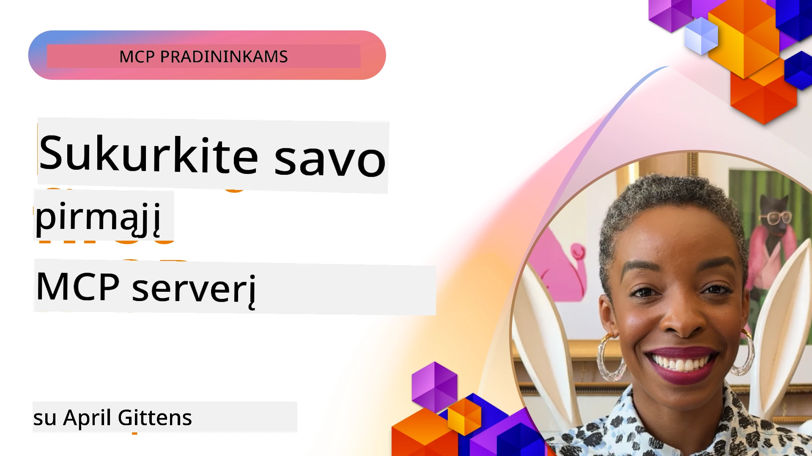

## Pradžia  

_(Spustelėkite aukščiau esantį paveikslėlį norėdami peržiūrėti šios pamokos vaizdo įrašą)_

Ši dalis susideda iš kelių pamokų:

- **1 Jūsų pirmas serveris**, šioje pirmojoje pamokoje išmoksite sukurti savo pirmą serverį ir jį apžiūrėti su inspektoriaus įrankiu, kuris yra vertingas būdas testuoti ir derinti serverį, [į pamoką](01-first-server/README.md)

- **2 Klientas**, šioje pamokoje išmoksite parašyti klientą, kuris gali prisijungti prie jūsų serverio, [į pamoką](02-client/README.md)

- **3 Klientas su LLM**, dar geresnis būdas rašyti klientą yra pridėti LLM, kad jis galėtų „derėtis“ su jūsų serveriu dėl veiksmų, [į pamoką](03-llm-client/README.md)

- **4 Serverio GitHub Copilot Agent režimo naudojimas Visual Studio Code**. Čia nagrinėjame, kaip vykdyti savo MCP serverį Visual Studio Code aplinkoje, [į pamoką](04-vscode/README.md)

- **5 stdio Transporto serveris** stdio transportas yra rekomenduojamas standartas vietinei MCP serverio-kliento komunikacijai, teikiantis saugų subprocess pagrįstą ryšį su įmontuota proceso izoliacija [į pamoką](05-stdio-server/README.md)

- **6 HTTP srautinimas su MCP (Srautuojamas HTTP)**. Sužinokite apie modernų HTTP srautinimo transportą (rekomenduojamą nutolusių MCP serverių naudojimo būdą pagal [MCP specifikaciją 2025-11-25](https://spec.modelcontextprotocol.io/specification/2025-11-25/basic/transports/#streamable-http)), progresų pranešimus ir kaip įgyvendinti mastelio keičiamus, realaus laiko MCP serverius ir klientus naudojant srautuojamą HTTP. [į pamoką](06-http-streaming/README.md)

- **7 Dirbtinio intelekto įrankių rinkinio naudojimas VSCode** jūsų MCP klientų ir serverių vartojimui ir testavimui [į pamoką](07-aitk/README.md)

- **8 Testavimas**. Čia ypatingai sutelksime dėmesį, kaip galime testuoti mūsų serverį ir klientą įvairiais būdais, [į pamoką](08-testing/README.md)

- **9 Diegimas**. Šis skyrius apžvelgs įvairius būdus įdiegti jūsų MCP sprendimus, [į pamoką](09-deployment/README.md)

- **10 Pažangus serverio naudojimas**. Šiame skyriuje aptariamas pažangus serverio naudojimas, [į pamoką](./10-advanced/README.md)

- **11 Autentifikacija**. Šiame skyriuje apžvelgiama, kaip pridėti paprastą autentifikavimą – nuo Basic Auth iki JWT ir RBAC naudojimo. Rekomenduojama pradėti nuo čia, o tada žiūrėti pažangius skyrius 5 skyriuje ir atlikti papildomą saugumo stiprinimą pagal rekomendacijas 2 skyriuje, [į pamoką](./11-simple-auth/README.md)

- **12 MCP šeimininkai**. Konfigūruokite ir naudokite populiarius MCP šeimininkų klientus įskaitant Claude Desktop, Cursor, Cline ir Windsurf. Sužinokite apie transporto tipus ir trikčių šalinimą, [į pamoką](./12-mcp-hosts/README.md)

- **13 MCP inspektorius**. Interaktyviai derinkite ir testuokite savo MCP serverius naudodami MCP Inspektoriaus įrankį. Sužinokite, kaip spręsti problemas įrankių, išteklių ir protokolo žinučių pagalba, [į pamoką](./13-mcp-inspector/README.md)

Modelio konteksto protokolas (MCP) yra atviras protokolas, standartizuojantis, kaip programos teikia kontekstą LLM. Galvokite apie MCP kaip USB-C jungtį AI programoms – jis suteikia standartizuotą būdą prijungti AI modelius prie įvairių duomenų šaltinių ir įrankių.

## Mokymosi tikslai

Baigę šią pamoką galėsite:

- Paruošti MCP kūrimo aplinką C#, Java, Python, TypeScript ir JavaScript kalboms
- Kurti ir diegti pagrindinius MCP serverius su individualiomis funkcijomis (ištekliais, užklausomis ir įrankiais)
- Kurti šeimininkų programas, jungiančias prie MCP serverių
- Testuoti ir derinti MCP įgyvendinimus
- Suprasti dažnas diegimo problemas ir jų sprendimus
- Prijungti MCP įgyvendinimus prie populiarių LLM paslaugų

## MCP aplinkos paruošimas

Prieš pradedant darbą su MCP, svarbu pasiruošti kūrimo aplinką ir suprasti pagrindinį darbo eigą. Ši dalis padės jums atlikti pradines parengiamąsias operacijas, kad MCP darbas vyktų sklandžiai.

### Reikalavimai

Prieš pradedant MCP kūrimą, įsitikinkite, kad turite:

- **Kūrimo aplinką** savo pasirinktoje kalboje (C#, Java, Python, TypeScript arba JavaScript)
- **IDE / redaktorių**: Visual Studio, Visual Studio Code, IntelliJ, Eclipse, PyCharm ar bet kurį modernų kodo redaktorių
- **Paketo tvarkykles**: NuGet, Maven/Gradle, pip arba npm/yarn
- **API raktus**: bet kurios AI paslaugos, kurias planuojate naudoti savo šeimininkų programose

### Oficialūs SDK

Ateinančiuose skyriuose pamatysite sprendimus, sukurtus naudojant Python, TypeScript, Java ir .NET. Čia pateikiami visi oficialiai palaikomi SDK.

MCP teikia oficialius SDK kelioms kalboms (suderintas su [MCP specifikacija 2025-11-25](https://spec.modelcontextprotocol.io/specification/2025-11-25/)):
- [C# SDK](https://github.com/modelcontextprotocol/csharp-sdk) – palaikoma kartu su Microsoft
- [Java SDK](https://github.com/modelcontextprotocol/java-sdk) – palaikoma kartu su Spring AI
- [TypeScript SDK](https://github.com/modelcontextprotocol/typescript-sdk) – oficialus TypeScript įgyvendinimas
- [Python SDK](https://github.com/modelcontextprotocol/python-sdk) – oficialus Python įgyvendinimas (FastMCP)
- [Kotlin SDK](https://github.com/modelcontextprotocol/kotlin-sdk) – oficialus Kotlin įgyvendinimas
- [Swift SDK](https://github.com/modelcontextprotocol/swift-sdk) – palaikoma kartu su Loopwork AI
- [Rust SDK](https://github.com/modelcontextprotocol/rust-sdk) – oficialus Rust įgyvendinimas
- [Go SDK](https://github.com/modelcontextprotocol/go-sdk) – oficialus Go įgyvendinimas

## Svarbiausios išvados

- MCP kūrimo aplinkos paruošimas yra paprastas naudojant kalbai skirtus SDK
- MCP serverių kūrimas reiškia įrankių kūrimą ir registravimą su aiškiomis schemomis
- MCP klientai jungiasi prie serverių ir modelių, kad pasinaudotų išplėstomis galimybėmis
- Testavimas ir derinimas yra būtini patikimam MCP įgyvendinimui
- Diegimo galimybės svyruoja nuo vietinės kūrimo iki debesijos sprendimų

## Praktika

Turime keletą pavyzdžių, kurie papildo pratimus, kuriuos rasite visuose šios dalies skyriuose. Be to, kiekvienas skyrius turi savus pratimus ir užduotis.

- [Java skaičiuoklė](./samples/java/calculator/README.md)
- [.Net skaičiuoklė](../../../03-GettingStarted/samples/csharp)
- [JavaScript skaičiuoklė](./samples/javascript/README.md)
- [TypeScript skaičiuoklė](./samples/typescript/README.md)
- [Python skaičiuoklė](../../../03-GettingStarted/samples/python)

## Papildomi ištekliai

- [Agentų kūrimas naudojant Model Context Protocol Azure platformoje](https://learn.microsoft.com/azure/developer/ai/intro-agents-mcp)
- [Nutolęs MCP su Azure Container Apps (Node.js/TypeScript/JavaScript)](https://learn.microsoft.com/samples/azure-samples/mcp-container-ts/mcp-container-ts/)
- [.NET OpenAI MCP agentas](https://learn.microsoft.com/samples/azure-samples/openai-mcp-agent-dotnet/openai-mcp-agent-dotnet/)

## Kas toliau

Pradėkite nuo pirmos pamokos: [Sukurkite savo pirmą MCP serverį](01-first-server/README.md)

Baigę šį modulį, tęskite: [4 modulis: Praktinis įgyvendinimas](../04-PracticalImplementation/README.md)

---

<!-- CO-OP TRANSLATOR DISCLAIMER START -->
**Atsakomybės apribojimas**:
Šis dokumentas buvo išverstas naudojant dirbtinio intelekto vertimo paslaugą [Co-op Translator](https://github.com/Azure/co-op-translator). Nors stengiamės užtikrinti tikslumą, prašome atkreipti dėmesį, kad automatizuoti vertimai gali turėti klaidų ar netikslumų. Originalus dokumentas gimtąja kalba laikomas autoritetingu šaltiniu. Svarbiai informacijai rekomenduojame kreiptis į profesionalius žmogaus vertėjus. Mes neprisiimame atsakomybės už bet kokius nesusipratimus ar neteisingus aiškinimus, kylančius naudojant šį vertimą.
<!-- CO-OP TRANSLATOR DISCLAIMER END -->