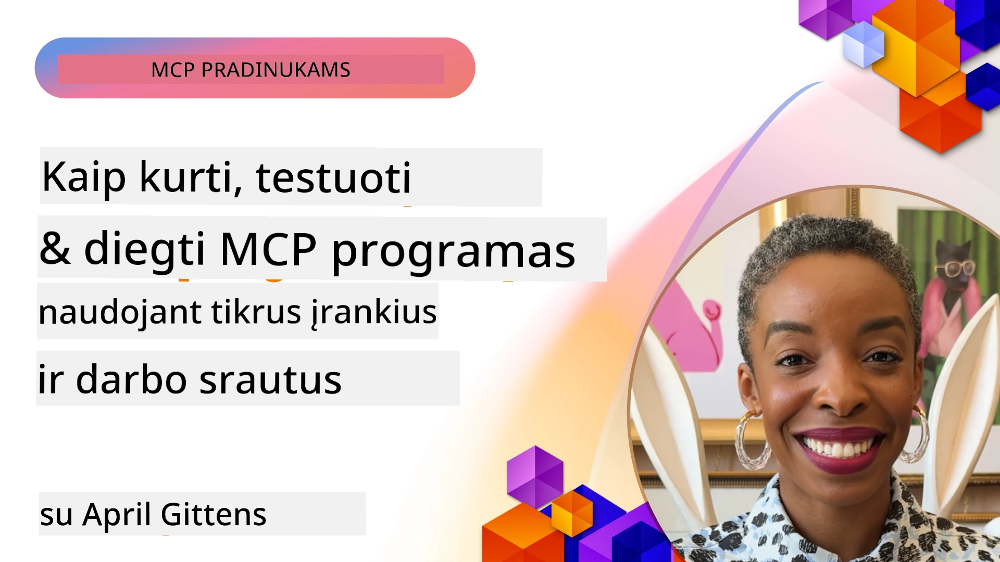
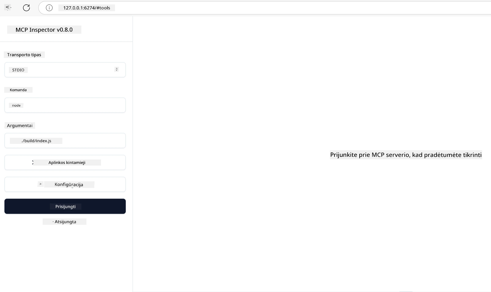

# Praktinė įgyvendinimo dalis

[](https://youtu.be/vCN9-mKBDfQ)

_(Spustelėkite aukščiau esantį paveikslėlį, kad peržiūrėtumėte šios pamokos vaizdo įrašą)_

Praktinis įgyvendinimas yra vieta, kur Model Context Protocol (MCP) galia tampa apčiuopiama. Nors teorijos ir architektūros supratimas apie MCP yra svarbus, tikroji vertė atsiskleidžia, kai šiuos konceptus pritaikote kurdami, testuodami ir diegdami sprendimus, kurie sprendžia realaus pasaulio problemas. Šis skyrius sujungia konceptualias žinias su praktiniu vystymu, vesdamas jus pro MCP pagrindu sukurtų programų gyvavimo ciklą.

Nesvarbu, ar kuriate išmanius asistentus, integruojate dirbtinį intelektą verslo darbo srautuose, ar kuriate specializuotus įrankius duomenų apdorojimui, MCP suteikia lanksčią pagrindą. Jo kalbai nepriklausomas dizainas ir oficialūs SDK populiarioms programavimo kalboms leidžia prieiti platų kūrėjų ratą. Pasinaudodami šiais SDK galite greitai prototipuoti, tobulinti ir pleči į savo sprendimus įvairiose platformose ir aplinkose.

Toliau pateiktose skiltyse rasite praktinių pavyzdžių, pavyzdinį kodą ir diegimo strategijas, kurios demonstruoja, kaip įgyvendinti MCP C#, Java su Spring, TypeScript, JavaScript ir Python kalbomis. Taip pat sužinosite, kaip derinti ir testuoti MCP serverius, valdyti API ir diegti sprendimus debesyje naudojant Azure. Šie praktiniai ištekliai skirti pagreitinti jūsų mokymąsi ir padėti pasitikint kurti tvirtas, gamybinės kokybės MCP programas.

## Apžvalga

Ši pamoka orientuota į praktinius MCP įgyvendinimo aspektus keliomis programavimo kalbomis. Išnagrinėsime, kaip naudoti MCP SDK C#, Java su Spring, TypeScript, JavaScript ir Python kalbomis, kad sukurtumėte tvirtas programas, derintumėte ir testuotumėte MCP serverius bei kurtumėte pakartotinai naudojamus resursus, paraginius šablonus ir įrankius.

## Mokymosi tikslai

Baigę šią pamoką galėsite:

- Įgyvendinti MCP sprendimus naudodami oficialius SDK įvairiomis programavimo kalbomis
- Sistemingai derinti ir testuoti MCP serverius
- Kurti ir naudoti serverio funkcijas (Resursus, Paraginius šablonus ir Įrankius)
- Kurti efektyvias MCP darbo eigas sudėtingiems uždaviniams
- Optimizuoti MCP įgyvendinimus našumui ir patikimumui

## Oficialūs SDK ištekliai

Model Context Protocol siūlo oficialius SDK kelioms kalboms (atitinkančius [MCP specifikaciją 2025-11-25](https://spec.modelcontextprotocol.io/specification/2025-11-25/)):

- [C# SDK](https://github.com/modelcontextprotocol/csharp-sdk)
- [Java su Spring SDK](https://github.com/modelcontextprotocol/java-sdk) **Pastaba:** reikalauja priklausomybės nuo [Project Reactor](https://projectreactor.io). (Žr. [diskusijų temą 246](https://github.com/orgs/modelcontextprotocol/discussions/246).)
- [TypeScript SDK](https://github.com/modelcontextprotocol/typescript-sdk)
- [Python SDK](https://github.com/modelcontextprotocol/python-sdk)
- [Kotlin SDK](https://github.com/modelcontextprotocol/kotlin-sdk)
- [Go SDK](https://github.com/modelcontextprotocol/go-sdk)

## Darbas su MCP SDK

Ši skiltis pateikia praktinius MCP įgyvendinimo pavyzdžius keliomis programavimo kalbomis. Pavyzdinį kodą rasite aplanke `samples`, suskirstytą pagal kalbas.

### Turimi pavyzdžiai

Saugykloje yra [pavyzdinės įgyvendinimo versijos](../../../04-PracticalImplementation/samples) šiomis kalbomis:

- [C#](./samples/csharp/README.md)
- [Java su Spring](./samples/java/containerapp/README.md)
- [TypeScript](./samples/typescript/README.md)
- [JavaScript](./samples/javascript/README.md)
- [Python](./samples/python/README.md)

Kiekvienas pavyzdys demonstruoja pagrindinius MCP konceptus ir įgyvendinimo šablonus tam tikrai kalbai ir ekosistemai.

### Praktiniai vadovai

Papildomi vadovai praktiniam MCP įgyvendinimui:

- [Puslapiavimas ir dideli rezultatų rinkiniai](./pagination/README.md) - Tegul įrankiai, resursai ir dideli duomenų rinkiniai tvarkomi su žymeklio pagrindu veikiančiu puslapiavimu

## Pagrindinės serverio funkcijos

MCP serveriai gali įgyvendinti bet kokį šių funkcijų derinį:

### Resursai

Resursai suteikia kontekstą ir duomenis naudotojui arba DI modeliui:

- Dokumentų saugyklos
- Žinių bazės
- Struktūrizuoti duomenų šaltiniai
- Failų sistemos

### Paraginiai šablonai

Paraginiai šablonai yra šabloninės žinutės ir darbo eigos naudotojams:

- Iš anksto apibrėžti pokalbių šablonai
- Vadovaujami sąveikos modeliai
- Specializuotos dialogo struktūros

### Įrankiai

Įrankiai yra funkcijos, kurias DI modelis gali vykdyti:

- Duomenų apdorojimo įrankiai
- Išorinės API integracijos
- Skaičiavimo galimybės
- Paieškos funkcionalumas

## Pavyzdinės įgyvendinimo versijos: C# įgyvendinimas

Oficiali C# SDK saugykla talpina keletą pavyzdinių versijų, demonstruojančių skirtingus MCP aspektus:

- **Paprastas MCP klientas**: paprastas pavyzdys, kaip sukurti MCP klientą ir kviesti įrankius
- **Paprastas MCP serveris**: minimalus serverio įgyvendinimas su bazine įrankių registracija
- **Išplėstinis MCP serveris**: pilno funkciškumo serveris su įrankių registracija, autentifikacija ir klaidų tvarkymu
- **ASP.NET integracija**: pavyzdžiai, demonstruojantys integraciją su ASP.NET Core
- **Įrankių įgyvendinimo šablonai**: įvairūs šablonai įrankiams įgyvendinti skirtingo sudėtingumo lygyje

MCP C# SDK yra rodymo stadijoje, todėl API gali keistis. Nuolat atnaujinsime šį tinklaraštį pagal SDK evoliuciją.

### Pagrindinės savybės

- [C# MCP Nuget ModelContextProtocol](https://www.nuget.org/packages/ModelContextProtocol)
- Sukurkite savo [pirmą MCP serverį](https://devblogs.microsoft.com/dotnet/build-a-model-context-protocol-mcp-server-in-csharp/).

Pilną C# įgyvendinimo pavyzdžių rinkinį rasite [oficialios C# SDK pavyzdžių saugykloje](https://github.com/modelcontextprotocol/csharp-sdk)

## Pavyzdinė įgyvendinimo versija: Java su Spring

Java su Spring SDK siūlo galingas MCP įgyvendinimo galimybes su įmonių lygmens funkcijomis.

### Pagrindinės savybės

- Spring Framework integracija
- Griežtas tipų saugumas
- Reaktyvus programavimas
- Išsamus klaidų tvarkymas

Pilną Java su Spring įgyvendinimo pavyzdį rasite [Java su Spring pavyzdyje](samples/java/containerapp/README.md) pavyzdžių kataloge.

## Pavyzdinė įgyvendinimo versija: JavaScript

JavaScript SDK suteikia lengvą ir lanksčią prieigą prie MCP įgyvendinimo.

### Pagrindinės savybės

- Palaikymas Node.js ir naršyklėms
- API pagrįsta pažadais (Promise)
- Lengva integracija su Express ir kitais karkasais
- WebSocket palaikymas srautiniam perdavimui

Pilną JavaScript įgyvendinimo pavyzdį rasite [JavaScript pavyzdyje](samples/javascript/README.md) pavyzdžių kataloge.

## Pavyzdinė įgyvendinimo versija: Python

Python SDK siūlo „pythonišką“ MCP įgyvendinimą su puikia integracija į ML karkasus.

### Pagrindinės savybės

- Async/await palaikymas naudojant asyncio
- FastAPI integracija
- Paprasta įrankių registracija
- Vietinė integracija su populiariomis ML bibliotekomis

Pilną Python įgyvendinimo pavyzdį rasite [Python pavyzdyje](samples/python/README.md) pavyzdžių kataloge.

## API valdymas

Azure API Management yra puikus sprendimas, kaip apsaugoti MCP serverius. Idėja – įdėti Azure API Management instanciją prieš jūsų MCP serverį ir leisti jai valdyti funkcijas, kurių paprastai norėtumėte, pavyzdžiui:

- užklausų dažnio ribojimas
- žetonų valdymas
- stebėjimas
- apkrovos balansavimas
- saugumas

### Azure pavyzdys

Štai Azure pavyzdys, kuris tai daro, t.y. [kuria MCP serverį ir saugo jį Azure API Management pagalba](https://github.com/Azure-Samples/remote-mcp-apim-functions-python).

Žr. žemiau paveikslėlį, kaip vyksta autorizacijos srautas:


Pirmiau pateiktame paveikslėlyje vyksta šie veiksmai:

- Autentifikacija/Autorizacija vyksta naudojant Microsoft Entra.
- Azure API Management veikia kaip vartai ir naudoja taisykles valdyti srautą.
- Azure Monitor registruoja visas užklausas tolesnei analizei.

#### Autorizacijos srautas

Žvelkime išsamiau į autorizacijos srautą:


#### MCP autorizacijos specifikacija

Sužinokite daugiau apie [MCP autorizacijos specifikaciją](https://spec.modelcontextprotocol.io/specification/2025-11-25/basic/authorization/)

## Nuotolinio MCP serverio diegimas Azure

Pažiūrėkime, ar galime įdiegti anksčiau minėtą pavyzdį:

1. Klonuokite saugyklą

    ```bash
    git clone https://github.com/Azure-Samples/remote-mcp-apim-functions-python.git
    cd remote-mcp-apim-functions-python
    ```

1. Užregistruokite `Microsoft.App` resursų tiekėją.

   - Jei naudojate Azure CLI, vykdykite `az provider register --namespace Microsoft.App --wait`.
   - Jei naudojate Azure PowerShell, vykdykite `Register-AzResourceProvider -ProviderNamespace Microsoft.App`. Po kurio laiko patikrinkite `(Get-AzResourceProvider -ProviderNamespace Microsoft.App).RegistrationState`, ar registracija baigta.

1. Vykdykite šią [azd](https://aka.ms/azd) komandą, kad paskirstytumėte API valdymo paslaugą, funkcijų programėlę (su kodu) ir visus kitus reikiamus Azure išteklius

    ```shell
    azd up
    ```

    Ši komanda turėtų įdiegti visus debesies išteklius Azure platformoje

### Serverio testavimas su MCP Inspector

1. Atsidarykite **naują terminalo langą**, įdiekite ir paleiskite MCP Inspector

    ```shell
    npx @modelcontextprotocol/inspector
    ```

    Turėtumėte pamatyti sąsają, panašią į:

    

1. Paspauskite CTRL ir spustelėkite, kad atidarytumėte MCP Inspector žiniatinklio programą pagal programos rodytą adresą (pvz. [http://127.0.0.1:6274/#resources](http://127.0.0.1:6274/#resources))
1. Nustatykite transporto tipą į `SSE`
1. Nustatykite URL į jūsų veikiančio API Management SSE galinį tašką, rodytą po `azd up`, ir spustelėkite **Connect**:

    ```shell
    https://<apim-servicename-from-azd-output>.azure-api.net/mcp/sse
    ```

1. **Įrankių sąrašas**. Spustelėkite įrankį ir **Run Tool**.

Jei visi žingsniai buvo atlikti teisingai, turėtumėte būti prijungti prie MCP serverio ir galėję iškviesti įrankį.

## MCP serveriai Azure aplinkai

[Remote-mcp-functions](https://github.com/Azure-Samples/remote-mcp-functions-dotnet): Ši saugykla yra greito paleidimo šablonas kuriant ir diegiant nuotolinius MCP (Model Context Protocol) serverius naudojant Azure Functions su Python, C# .NET ar Node/TypeScript.

Pavyzdžiai suteikia pilną sprendimą, leidžiantį kūrėjams:

- Kurti ir vykdyti lokaliai: kurti ir derinti MCP serverį vietiniame kompiuteryje
- Diegti Azure: lengvai diegti debesyje vienu azd up komandos vykdymu
- Jungtis iš klientų: jungtis prie MCP serverio iš įvairių klientų, įskaitant VS Code Copilot agento režimą ir MCP Inspector įrankį

### Pagrindinės savybės

- Saugumas pagal dizainą: MCP serveris apsaugotas naudojant raktus ir HTTPS
- Autentifikacijos galimybės: palaiko OAuth su integruota autenfikacija ir/ar API Management
- Tinklo izoliacija: leidžia naudoti tinklo izoliaciją su Azure Virtual Networks (VNET)
- Serverless architektūra: pasinaudoja Azure Functions skalai ir įvykiais pagrįstam vykdymui
- Vietinis vystymas: visapusiška vietinio vystymo ir derinimo parama
- Paprastas diegimas: supaprastintas diegimo procesas Azure aplinkoje

Saugykla talpina visus reikalingus konfigūracijos failus, šaltinio kodą ir infrastruktūros aprašus, kad greitai pradėtumėte gamybinio lygio MCP serverio įgyvendinimą.

- [Azure Remote MCP Functions Python](https://github.com/Azure-Samples/remote-mcp-functions-python) - MCP pavyzdys naudojant Azure Functions su Python

- [Azure Remote MCP Functions .NET](https://github.com/Azure-Samples/remote-mcp-functions-dotnet) - MCP pavyzdys naudojant Azure Functions su C# .NET

- [Azure Remote MCP Functions Node/Typescript](https://github.com/Azure-Samples/remote-mcp-functions-typescript) - MCP pavyzdys naudojant Azure Functions su Node/TypeScript.

## Svarbiausios išvados

- MCP SDK teikia kalbai specifinius įrankius tvirtų MCP sprendimų įgyvendinimui
- Derinimo ir testavimo procesas yra labai svarbus patikimoms MCP programoms
- Pakartotinai naudojami paraginiai šablonai užtikrina nuoseklias DI sąveikas
- Gerai suprojektuotos darbo eigos gali koordinuoti sudėtingus uždavinius su keliais įrankiais
- MCP sprendimų įgyvendinimas reikalauja dėmesio saugumui, našumui ir klaidų tvarkymui

## Pratimai

Sukurkite praktišką MCP darbo eigą, sprendžiančią realų jūsų srities problemą:

1. Nustatykite 3–4 įrankius, kurie būtų naudingi sprendžiant šią problemą
2. Sukurkite darbo eigos diagramą, kurioje parodyta, kaip šie įrankiai sąveikauja
3. Įgyvendinkite vieno įrankio bazinę versiją naudodami jums patinkančią kalbą
4. Sukurkite paraginio šablono šabloną, kuris padėtų modeliui efektyviai naudoti jūsų įrankį

## Papildomi ištekliai

---

## Kas toliau

Toliau: [Išplėstiniai Temos](../05-AdvancedTopics/README.md)

---

<!-- CO-OP TRANSLATOR DISCLAIMER START -->
**Atsakomybės apribojimas**:  
Šis dokumentas buvo išverstas naudojant dirbtinio intelekto vertimo paslaugą [Co-op Translator](https://github.com/Azure/co-op-translator). Nors stengiamės užtikrinti tikslumą, prašome atkreipti dėmesį, kad automatizuoti vertimai gali turėti klaidų ar netikslumų. Originalus dokumentas gimtąja kalba turi būti laikomas autoritetingu šaltiniu. Svarbiai informacijai rekomenduojame kreiptis į profesionalius žmogiškus vertėjus. Mes neatsakome už jokius nesusipratimus ar klaidingas interpretacijas, kylančias dėl šio vertimo naudojimo.
<!-- CO-OP TRANSLATOR DISCLAIMER END -->