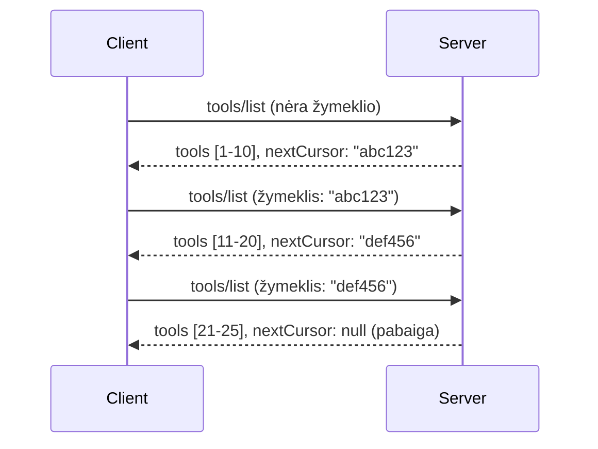

# Puslapiavimas ir dideli duomenų rinkiniai MCP

Kai jūsų MCP serveris tvarko didelius duomenų rinkinius – ar tai būtų tūkstančių failų, duomenų bazių įrašų ar paieškos rezultatų sąrašas – jums reikalingas puslapiavimas, kad efektyviai valdyti atmintį ir suteikti greitą naudotojo patirtį. Šiame vadove aprašoma, kaip įgyvendinti ir naudoti puslapiavimą MCP.

## Kodėl puslapiavimas svarbus

Be puslapiavimo dideli atsakymai gali sukelti:

- **Atminties išeikvojimą** – vienu metu užkraunant milijonus įrašų
- **Lėtą atsakymo laiką** – vartotojai laukia, kol visi duomenys užsikraus
- **Timeout klaidas** – užklausos viršija maksimalią laiką
- **Prastą DI veikimą** – didelėse konteksto apimtyse LLM modeliai sunkiai dirba

MCP naudoja **kursoriaus pagrindu veikiantį puslapiavimą**, kad patikimai ir nuosekliai pereitų per rezultatų rinkinius.

---

## Kaip veikia MCP puslapiavimas

### Kursoriaus sąvoka

**Kursorius** yra neaiški eilutė, žyminti jūsų vietą rezultatų rinkinyje. Galite įsivaizduoti ją kaip žymeklį ilgose knygose.


### Puslapiavimas MCP metoduose

Šie MCP metodai palaiko puslapiavimą:

| Metodas | Grąžina | Kursoriaus palaikymas |
|--------|---------|-----------------------|
| `tools/list` | Įrankių aprašymai | ✅ |
| `resources/list` | Išteklių aprašymai | ✅ |
| `prompts/list` | Užklausų aprašymai | ✅ |
| `resources/templates/list` | Išteklių šablonai | ✅ |

---

## Serverio įgyvendinimas

### Python (FastMCP)

```python
from mcp.server import Server
from mcp.types import Tool, ListToolsResult
import math

app = Server("paginated-server")

# Simuliuoti dideli duomenų rinkiniai
ALL_TOOLS = [
    Tool(name=f"tool_{i}", description=f"Tool number {i}", inputSchema={})
    for i in range(100)
]

PAGE_SIZE = 10

@app.list_tools()
async def list_tools(cursor: str | None = None) -> ListToolsResult:
    """List tools with pagination support."""
    
    # Iššifruoti žymeklį, kad gautumėte pradinį indeksą
    start_index = 0
    if cursor:
        try:
            start_index = int(cursor)
        except ValueError:
            start_index = 0
    
    # Gauti rezultatų puslapį
    end_index = min(start_index + PAGE_SIZE, len(ALL_TOOLS))
    page_tools = ALL_TOOLS[start_index:end_index]
    
    # Apskaičiuoti kitą žymeklį
    next_cursor = None
    if end_index < len(ALL_TOOLS):
        next_cursor = str(end_index)
    
    return ListToolsResult(
        tools=page_tools,
        nextCursor=next_cursor
    )
```

### TypeScript

```typescript
import { Server } from "@modelcontextprotocol/sdk/server/index.js";
import { ListToolsResultSchema } from "@modelcontextprotocol/sdk/types.js";

const server = new Server({
  name: "paginated-server",
  version: "1.0.0"
});

// Simuliuotas didelis duomenų rinkinys
const ALL_TOOLS = Array.from({ length: 100 }, (_, i) => ({
  name: `tool_${i}`,
  description: `Tool number ${i}`,
  inputSchema: { type: "object", properties: {} }
}));

const PAGE_SIZE = 10;

server.setRequestHandler(ListToolsResultSchema, async (request) => {
  // Iššifruoti žymeklį
  let startIndex = 0;
  if (request.params?.cursor) {
    startIndex = parseInt(request.params.cursor, 10) || 0;
  }
  
  // Gauti rezultatų puslapį
  const endIndex = Math.min(startIndex + PAGE_SIZE, ALL_TOOLS.length);
  const pageTools = ALL_TOOLS.slice(startIndex, endIndex);
  
  // Apskaičiuoti kitą žymeklį
  const nextCursor = endIndex < ALL_TOOLS.length ? String(endIndex) : undefined;
  
  return {
    tools: pageTools,
    nextCursor
  };
});
```

### Java (Spring MCP)

```java
@Service
public class PaginatedToolService {
    
    private static final int PAGE_SIZE = 10;
    private final List<Tool> allTools;
    
    public PaginatedToolService() {
        // Inicializuoti didelį duomenų rinkinį
        this.allTools = IntStream.range(0, 100)
            .mapToObj(i -> new Tool("tool_" + i, "Tool number " + i, Map.of()))
            .collect(Collectors.toList());
    }
    
    @McpMethod("tools/list")
    public ListToolsResult listTools(@Param("cursor") String cursor) {
        // Iššifruoti žymeklį
        int startIndex = 0;
        if (cursor != null && !cursor.isEmpty()) {
            try {
                startIndex = Integer.parseInt(cursor);
            } catch (NumberFormatException e) {
                startIndex = 0;
            }
        }
        
        // Gauti rezultatų puslapį
        int endIndex = Math.min(startIndex + PAGE_SIZE, allTools.size());
        List<Tool> pageTools = allTools.subList(startIndex, endIndex);
        
        // Apskaičiuoti kitą žymeklį
        String nextCursor = endIndex < allTools.size() ? String.valueOf(endIndex) : null;
        
        return new ListToolsResult(pageTools, nextCursor);
    }
}
```

---

## Kliento įgyvendinimas

### Python klientas

```python
from mcp import ClientSession

async def get_all_tools(session: ClientSession) -> list:
    """Fetch all tools using pagination."""
    all_tools = []
    cursor = None
    
    while True:
        result = await session.list_tools(cursor=cursor)
        all_tools.extend(result.tools)
        
        if result.nextCursor is None:
            break
        cursor = result.nextCursor
    
    return all_tools

# Naudojimas
async with client_session as session:
    tools = await get_all_tools(session)
    print(f"Found {len(tools)} tools")
```

### TypeScript klientas

```typescript
import { Client } from "@modelcontextprotocol/sdk/client/index.js";

async function getAllTools(client: Client): Promise<Tool[]> {
  const allTools: Tool[] = [];
  let cursor: string | undefined = undefined;
  
  do {
    const result = await client.listTools({ cursor });
    allTools.push(...result.tools);
    cursor = result.nextCursor;
  } while (cursor);
  
  return allTools;
}

// Naudojimas
const tools = await getAllTools(client);
console.log(`Found ${tools.length} tools`);
```

### Tingus užkrovimo modelis

Labai dideliems duomenų rinkiniams puslapius kraukite pagal poreikį:

```python
class PaginatedToolIterator:
    """Lazily iterate through paginated tools."""
    
    def __init__(self, session: ClientSession):
        self.session = session
        self.cursor = None
        self.buffer = []
        self.exhausted = False
    
    async def __anext__(self):
        # Grąžinti iš buferio, jei yra
        if self.buffer:
            return self.buffer.pop(0)
        
        # Patikrinti, ar išnaudojome visas puslapius
        if self.exhausted:
            raise StopAsyncIteration
        
        # Gauti kitą puslapį
        result = await self.session.list_tools(cursor=self.cursor)
        self.buffer = list(result.tools)
        self.cursor = result.nextCursor
        
        if self.cursor is None:
            self.exhausted = True
        
        if not self.buffer:
            raise StopAsyncIteration
        
        return self.buffer.pop(0)
    
    def __aiter__(self):
        return self

# Naudojimas – atminties efektyvu didelėms duomenų bazėms
async for tool in PaginatedToolIterator(session):
    process_tool(tool)
```

---

## Puslapiavimas ištekliams

Ištekliai dažnai turi puslapiuoti katalogus ar didelius duomenų rinkinius:

```python
from mcp.server import Server
from mcp.types import Resource, ListResourcesResult
import os

app = Server("file-server")

@app.list_resources()
async def list_resources(cursor: str | None = None) -> ListResourcesResult:
    """List files in directory with pagination."""
    
    directory = "/data/files"
    all_files = sorted(os.listdir(directory))
    
    # Iššifruoti žymeklį (failo indeksą)
    start_index = int(cursor) if cursor else 0
    page_size = 20
    end_index = min(start_index + page_size, len(all_files))
    
    # Sukurti šio puslapio resursų sąrašą
    resources = []
    for filename in all_files[start_index:end_index]:
        filepath = os.path.join(directory, filename)
        resources.append(Resource(
            uri=f"file://{filepath}",
            name=filename,
            mimeType="application/octet-stream"
        ))
    
    # Apskaičiuoti kitą žymeklį
    next_cursor = str(end_index) if end_index < len(all_files) else None
    
    return ListResourcesResult(
        resources=resources,
        nextCursor=next_cursor
    )
```

---

## Kursoriaus dizaino strategijos

### Strategija 1: Pagal indeksą (paprasta)

```python
# Žymeklis yra tik indeksas
cursor = "50"  # Pradėti nuo 50 elemento
```

**Privalumai:** Paprasta, be būsenos
**Trūkumai:** Rezultatai gali pasislinkti, jei įrašai pridedami ar pašalinami

### Strategija 2: Pagal ID (stabili)

```python
# Žymeklis yra paskutinis matytas ID
cursor = "item_abc123"  # Pradėti po šio elemento
```

**Privalumai:** Stabili net keičiantis įrašams
**Trūkumai:** Reikalauja tvarkingų ID

### Strategija 3: Užkoduota būsena (sudėtinga)

```python
import base64
import json

def encode_cursor(state: dict) -> str:
    return base64.b64encode(json.dumps(state).encode()).decode()

def decode_cursor(cursor: str) -> dict:
    return json.loads(base64.b64decode(cursor).decode())

# Žymeklis turi kelis būsenos laukus
cursor = encode_cursor({
    "offset": 50,
    "filter": "active",
    "sort": "name"
})
```

**Privalumai:** Leidžia koduoti sudėtingą būseną
**Trūkumai:** Sudėtingesnė, kursorius ilgesnis

---

## Geros praktikos

### 1. Rinkitės tinkamą puslapio dydį

```python
# Apsvarstykite duomenų dydį
PAGE_SIZE_SMALL_ITEMS = 100   # Paprasta metaduomenys
PAGE_SIZE_MEDIUM_ITEMS = 20   # Turtingesni objektai
PAGE_SIZE_LARGE_ITEMS = 5     # Sudėtingas turinys
```

### 2. Tvarkykite netinkamus kursorius tolerantiškai

```python
@app.list_tools()
async def list_tools(cursor: str | None = None) -> ListToolsResult:
    try:
        start_index = int(cursor) if cursor else 0
        if start_index < 0 or start_index >= len(ALL_TOOLS):
            start_index = 0  # Atstatyti į pradžią
    except (ValueError, TypeError):
        start_index = 0  # Neteisingas žymeklis, pradėti iš naujo
    # ...
```

### 3. Įtraukite bendrą įrašų skaičių (pasirinktinai)

```python
return ListToolsResult(
    tools=page_tools,
    nextCursor=next_cursor,
    # Kai kurios įgyvendinimo versijos apima bendrą UI pažangos rodiklį
    _meta={"total": len(ALL_TOOLS)}
)
```

### 4. Išbandykite ribines situacijas

```python
async def test_pagination():
    # Tuščias rezultatų rinkinys
    result = await session.list_tools()
    assert result.tools == []
    assert result.nextCursor is None
    
    # Vienas puslapis
    result = await session.list_tools()
    assert len(result.tools) <= PAGE_SIZE
    
    # Neteisingas žymeklis
    result = await session.list_tools(cursor="invalid")
    assert result.tools  # Turėtų grąžinti pirmą puslapį
```

---

## Dažnos klaidos

### ❌ Grąžinti visus rezultatus ir puslapiuoti kliento pusėje

```python
# BLOGAI: Įkelia viską į atmintį
@app.list_tools()
async def list_tools() -> ListToolsResult:
    all_tools = load_all_tools()  # 1 milijonas įrankių!
    return ListToolsResult(tools=all_tools)
```

### ✅ Puslapiuoti duomenų šaltinyje

```python
# GERAI: Įkelia tik tai, kas reikia
@app.list_tools()
async def list_tools(cursor: str | None = None) -> ListToolsResult:
    offset = int(cursor) if cursor else 0
    tools = await db.query_tools(offset=offset, limit=PAGE_SIZE)
    return ListToolsResult(tools=tools, nextCursor=...)
```

---

## Kas toliau

- [Modulis 5.14 - Konteksto inžinerija](../../05-AdvancedTopics/mcp-contextengineering/README.md)
- [Modulis 8 - Geros praktikos](../../08-BestPractices/README.md)
- [3.8 - Testavimas MCP serveryje](../../03-GettingStarted/08-testing/README.md)

---

## Papildomi ištekliai

- [MCP specifikacija - Puslapiavimas](https://spec.modelcontextprotocol.io/specification/2025-11-25/)
- [Kursoriaus pagrindu veikiantis puslapiavimas paaiškintas](https://slack.engineering/evolving-api-pagination-at-slack/)
- [Python SDK puslapiavimo testai](https://github.com/modelcontextprotocol/python-sdk/blob/main/tests/client/test_list_methods_cursor.py)

---

<!-- CO-OP TRANSLATOR DISCLAIMER START -->
**Atsakomybės atsisakymas**:  
Šis dokumentas buvo išverstas naudojant dirbtinio intelekto vertimo paslaugą [Co-op Translator](https://github.com/Azure/co-op-translator). Nors stengiamės užtikrinti tikslumą, prašome atkreipti dėmesį, kad automatizuoti vertimai gali turėti klaidų ar netikslumų. Originalus dokumentas gimtąja kalba turėtų būti laikomas autoritetingu šaltiniu. Kritinei informacijai rekomenduojama naudoti profesionalų žmogaus vertimą. Mes neatsakome už jokius nesusipratimus ar klaidingus aiškinimus, kylančius dėl šio vertimo naudojimo.
<!-- CO-OP TRANSLATOR DISCLAIMER END -->