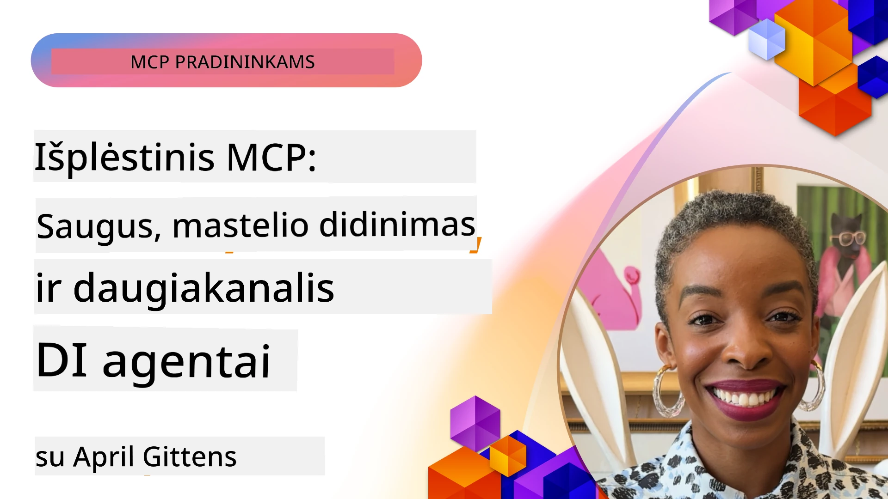

# Išplėstiniai MPC Temos

_(Spustelėkite aukščiau esantį vaizdą, kad pereitumėte prie šios pamokos vaizdo)_ 

Šiame skyriuje aptariamos pažangios Modelio Konteksto Protokolo (MCP) įgyvendinimo temos, įskaitant daugialypį integravimą, mastelio keitimą, saugumo gerąją praktiką ir įmonių integraciją. Šios temos yra itin svarbios, kad būtų sukurtos patvarios ir gamybai paruoštos MCP programos, atitinkančios modernių AI sistemų reikalavimus.

## Apžvalga

Šioje pamokoje nagrinėjami pažangūs Modelio Konteksto Protokolo įgyvendinimo aspektai, daugiausia dėmesio skiriant daugialypiam integravimui, mastelio keitimui, saugumo geriausioms praktikoms ir įmonių integracijai. Šios temos yra būtinos kuriant profesionalias MCP programas, galinčias tvarkyti sudėtingus reikalavimus įmonių aplinkoje.

## Mokymosi tikslai

Pamokos pabaigoje galėsite:

- Įgyvendinti daugialypio režimo galimybes MCP sistemose
- Sukurti mastelio keičiamos MCP architektūras, skirtas didelės paklausos scenarijams
- Taikyti saugumo geriausias praktikas, atitinkančias MCP saugumo principus
- Integruoti MCP su įmonių AI sistemomis ir pagrindais
- Optimizuoti našumą ir patikimumą gamybos aplinkose

## Pamokos ir pavyzdiniai Projektai

| Nuoroda | Pavadinimas | Aprašymas |
|------|-------|-------------|
| [5.1 Integracija su Azure](./mcp-integration/README.md) | Integracija su Azure | Sužinokite, kaip integruoti savo MCP serverį su Azure |
| [5.2 Daugialypis pavyzdys](./mcp-multi-modality/README.md) | MCP daugialypiai pavyzdžiai | Pavyzdžiai garso, vaizdo ir daugialypių atsakymų |
| [5.3 MCP OAuth2 pavyzdys](../../../05-AdvancedTopics/mcp-oauth2-demo) | MCP OAuth2 Demonstracija | Minimalus Spring Boot programėlė rodanti OAuth2 su MCP, tiek kaip Autorizacijos, tiek kaip Išteklių serverį. Demonstruoja saugų žetonų išdavimą, apsaugotus galinius taškus, Azure Container Apps diegimą ir API valdymo integraciją. |
| [5.4 Šakninių kontekstų valdymas](./mcp-root-contexts/README.md) | Šakniniai kontekstai | Sužinokite daugiau apie šakninius kontekstus ir kaip juos įgyvendinti |
| [5.5 Maršrutizavimas](./mcp-routing/README.md) | Maršrutizavimas | Sužinokite įvairius maršrutizavimo tipus |
| [5.6 Bandymas](./mcp-sampling/README.md) | Bandymas | Sužinokite, kaip dirbti su bandymu |
| [5.7 Mastelio didinimas](./mcp-scaling/README.md) | Mastelio didinimas | Sužinokite apie mastelio didinimą |
| [5.8 Saugumas](./mcp-security/README.md) | Saugumas | Apsaugokite savo MCP serverį |
| [5.9 Internetinės paieškos pavyzdys](./web-search-mcp/README.md) | Internetinė MCP paieška | Python MCP serveris ir klientas, integruojantis SerpAPI realaus laiko internetinei, naujienų ir produktų paieškai bei klausimų-atsakymų sistemoms. Demonstruoja įrankių orkestraciją, išorinių API integraciją ir tvirtą klaidų tvarkymą. |
| [5.10 Realaus laiko srautas](./mcp-realtimestreaming/README.md) | Srautinė transliacija | Realaus laiko duomenų srautas tapo būtinu šiandienos duomenų valdymo pasaulyje, kur verslės ir programos reikalauja momentinės prieigos prie informacijos, kad būtų priimti laiku sprendimai.|
| [5.11 Realaus laiko internetinė paieška](./mcp-realtimesearch/README.md) | Internetinė paieška | Kaip MCP transformuoja realaus laiko internetinę paiešką suteikdama standartizuotą požiūrį į konteksto valdymą AI modelių, paieškos sistemų ir programų atžvilgiu.| 
| [5.12 Entra ID autentifikacija Model Context Protocol serveriams](./mcp-security-entra/README.md) | Entra ID autentifikacija | Microsoft Entra ID suteikia patikimą debesyje pagrįstą identiteto ir prieigos valdymo sprendimą, užtikrindamas, kad tik autorizuoti vartotojai ir programos galėtų sąveikauti su jūsų MCP serveriu.|
| [5.13 Azure AI Foundry agentų integracija](./mcp-foundry-agent-integration/README.md) | Azure AI Foundry integracija | Sužinokite, kaip integruoti Model Context Protocol serverius su Azure AI Foundry agentais, leidžiančiais galingą įrankių orkestraciją ir įmonių AI galimybes naudojant standartizuotus išorinių duomenų šaltinių ryšius.|
| [5.14 Kontextų inžinerija](./mcp-contextengineering/README.md) | Kontextų inžinerija | Ateities galimybės kontekstų inžinerijos metodams MCP serveriams, įskaitant konteksto optimizavimą, dinaminį konteksto valdymą ir veiksmingų įkalbinėjimo strategijų kūrimą MCP sistemose.|
| [5.15 MCP pasirinktinis transportas](./mcp-transport/README.md) | Pasirinktinis transportas | Sužinokite, kaip įgyvendinti pasirinktinius transporto mechanizmus specializuotiems MCP komunikacijos scenarijams.|
| [5.16 Protokolo funkcijų gilus analizavimas](./mcp-protocol-features/README.md) | Protokolo funkcijos | Įvaldykite pažangias protokolo funkcijas apimančias progreso pranešimus, užklausų atšaukimą, išteklių šablonus ir klaidų tvarkymo modelius.|

> **Naujiena MCP specifikacijoje 2025-11-25**: Specifikacija dabar apima eksperimentinę paramą **Užduotims** (ilgai trunkančioms operacijoms su progreso stebėjimu), **Įrankių anotacijoms** (metaduomenys apie įrankių elgseną saugumui), **URL režimo iškvietimui** (konkretų URL turinio paklausimas klientams) ir patobulintoms **Šaknims** (darbo vietos konteksto valdymui). Pilną informaciją žr. [MCP Specifikacijos pakeitimų žurnale](https://spec.modelcontextprotocol.io/).

## Papildoma literatūra

Naujausia informacija apie pažangias MCP temas:

- [MCP Dokumentacija](https://modelcontextprotocol.io/)
- [MCP Specifikacija (2025-11-25)](https://spec.modelcontextprotocol.io/specification/2025-11-25/)
- [GitHub Saugykla](https://github.com/modelcontextprotocol)
- [OWASP MCP Top 10](https://microsoft.github.io/mcp-azure-security-guide/mcp/) - Saugumo rizikos ir jų mažinimas
- [MCP Saugumo Viršūnių dirbtuvės (Sherpa)](https://azure-samples.github.io/sherpa/) - Praktiniai saugumo mokymai

## Pagrindinės mintys

- Daugialypės MCP įgyvendinimai plečia AI galimybes už teksto apdorojimo ribų
- Mastelį keisti būtina įmonių diegimuose ir tai galima pasiekti horizontaliu ir vertikaliu mastelio didinimu
- Išsamios saugumo priemonės apsaugo duomenis ir užtikrina tinkamą prieigos kontrolę
- Įmonių integracija su platformomis kaip Azure OpenAI ir Microsoft AI Foundry pagerina MCP galimybes
- Pažangūs MCP įgyvendinimai naudoja optimizuotas architektūras ir atsargų išteklių valdymą

## Užduotis

Sukurkite įmonių lygio MCP įgyvendinimą konkrečiam naudojimo atvejui:

1. Nustatykite daugialypius reikalavimus savo atvejui
2. Apibrėžkite saugumo valdymo priemones jautriems duomenims apsaugoti
3. Sukurkite mastelio keičiamos architektūros, galinčios tvarkyti kintančią apkrovą, dizainą
4. Suplanuokite integracijos taškus su įmonių AI sistemomis
5. Aprašykite galimus našumo trikdžius ir mažinimo strategijas

## Papildomi šaltiniai

- [Azure OpenAI Dokumentacija](https://learn.microsoft.com/en-us/azure/ai-services/openai/)
- [Microsoft AI Foundry Dokumentacija](https://learn.microsoft.com/en-us/ai-services/)

---

## Kas toliau

Išnagrinėkite šio modulio pamokas pradedant nuo: [5.1 MCP Integracija](./mcp-integration/README.md)

Baigę šį modulį, tęskite: [6 modulis: Bendruomenės indėliai](../06-CommunityContributions/README.md)

---

<!-- CO-OP TRANSLATOR DISCLAIMER START -->
**Atsakomybės apribojimas**:
Šis dokumentas buvo išverstas naudojant AI vertimo paslaugą [Co-op Translator](https://github.com/Azure/co-op-translator). Nors siekiame tikslumo, atkreipkite dėmesį, kad automatizuoti vertimai gali turėti klaidų ar netikslumų. Originalus dokumentas jo gimtąja kalba turi būti laikomas autoritetingu šaltiniu. Svarbiai informacijai rekomenduojamas profesionalus žmogaus atliktas vertimas. Mes neatsakome už jokius nesusipratimus ar neteisingus aiškinimus, kylančius dėl šio vertimo naudojimo.
<!-- CO-OP TRANSLATOR DISCLAIMER END -->