# MCP protokolo funkcijų išsamus apžvalga

Šiame vadove nagrinėjamos pažangios MCP protokolo funkcijos, kurios viršija pagrindinį įrankių ir resursų valdymą. Šių funkcijų supratimas padeda kurti stabilesnius, vartotojui draugiškesnius ir gamybai paruoštus MCP serverius.

## Aptariamos funkcijos

1. **Progreso pranešimai** - ilgo vykdymo operacijų progreso ataskaita  
2. **Užklausų atšaukimas** - klientų galimybė atšaukti vykstančias užklausas  
3. **Resursų šablonai** - dinaminiai resursų URI su parametrais  
4. **Serverio gyvavimo ciklo įvykiai** - tinkama inicializacija ir išjungimas  
5. **Registravimo (logging) valdymas** - serverio pusės registravimo konfigūracija  
6. **Klaidų tvarkymo modeliai** - nuoseklūs klaidų atsakymai

---

## 1. Progreso pranešimai

Operacijoms, kurios užtrunka (duomenų apdorojimas, failų atsisiuntimas, API kvietimai), progreso pranešimai leidžia vartotojams gauti informacijos.

### Kaip tai veikia

```mermaid
sequenceDiagram
    participant Client
    participant Server
    
    Client->>Server: tools/call (ilgas veiksmas)
    Server-->>Client: pranešimas: pažanga 10%
    Server-->>Client: pranešimas: pažanga 50%
    Server-->>Client: pranešimas: pažanga 90%
    Server->>Client: rezultatas (baigta)
```


### Python įgyvendinimas

```python
from mcp.server import Server, NotificationOptions
from mcp.types import ProgressNotification
import asyncio

app = Server("progress-server")

@app.tool()
async def process_large_file(file_path: str, ctx) -> str:
    """Process a large file with progress updates."""
    
    # Gauti failo dydį progreso skaičiavimui
    file_size = os.path.getsize(file_path)
    processed = 0
    
    with open(file_path, 'rb') as f:
        while chunk := f.read(8192):
            # Apdoroti dalį
            await process_chunk(chunk)
            processed += len(chunk)
            
            # Siųsti progreso pranešimą
            progress = (processed / file_size) * 100
            await ctx.send_notification(
                ProgressNotification(
                    progressToken=ctx.request_id,
                    progress=progress,
                    total=100,
                    message=f"Processing: {progress:.1f}%"
                )
            )
    
    return f"Processed {file_size} bytes"

@app.tool()
async def batch_operation(items: list[str], ctx) -> str:
    """Process multiple items with progress."""
    
    results = []
    total = len(items)
    
    for i, item in enumerate(items):
        result = await process_item(item)
        results.append(result)
        
        # Pranešti apie progresą po kiekvieno elemento
        await ctx.send_notification(
            ProgressNotification(
                progressToken=ctx.request_id,
                progress=i + 1,
                total=total,
                message=f"Processed {i + 1}/{total}: {item}"
            )
        )
    
    return f"Completed {total} items"
```

### TypeScript įgyvendinimas

```typescript
import { Server } from "@modelcontextprotocol/sdk/server/index.js";

server.setRequestHandler(CallToolSchema, async (request, extra) => {
  const { name, arguments: args } = request.params;
  
  if (name === "process_data") {
    const items = args.items as string[];
    const results = [];
    
    for (let i = 0; i < items.length; i++) {
      const result = await processItem(items[i]);
      results.push(result);
      
      // Siųsti pažangos pranešimą
      await extra.sendNotification({
        method: "notifications/progress",
        params: {
          progressToken: request.id,
          progress: i + 1,
          total: items.length,
          message: `Processing item ${i + 1}/${items.length}`
        }
      });
    }
    
    return { content: [{ type: "text", text: JSON.stringify(results) }] };
  }
});
```

### Kliento apdorojimas (Python)

```python
async def handle_progress(notification):
    """Handle progress notifications from server."""
    params = notification.params
    print(f"Progress: {params.progress}/{params.total} - {params.message}")

# Registruoti tvarkyklę
session.on_notification("notifications/progress", handle_progress)

# Iškvietimo įrankis (progreso atnaujinimai bus gaunami per tvarkyklę)
result = await session.call_tool("process_large_file", {"file_path": "/data/large.csv"})
```

---

## 2. Užklausų atšaukimas

Leiskite klientams atšaukti užklausas, kurios nebereikalingos arba užima per daug laiko.

### Python įgyvendinimas

```python
from mcp.server import Server
from mcp.types import CancelledError
import asyncio

app = Server("cancellable-server")

@app.tool()
async def long_running_search(query: str, ctx) -> str:
    """Search that can be cancelled."""
    
    results = []
    
    try:
        for page in range(100):  # Ieškoti per daugelį puslapių
            # Patikrinti, ar buvo prašyta atšaukimo
            if ctx.is_cancelled:
                raise CancelledError("Search cancelled by user")
            
            # Imituoti puslapio paiešką
            page_results = await search_page(query, page)
            results.extend(page_results)
            
            # Nedidelė pauzė leidžia tikrinti atšaukimus
            await asyncio.sleep(0.1)
            
    except CancelledError:
        # Grąžinti dalinius rezultatus
        return f"Cancelled. Found {len(results)} results before cancellation."
    
    return f"Found {len(results)} total results"

@app.tool()
async def download_file(url: str, ctx) -> str:
    """Download with cancellation support."""
    
    async with aiohttp.ClientSession() as session:
        async with session.get(url) as response:
            total_size = int(response.headers.get('content-length', 0))
            downloaded = 0
            chunks = []
            
            async for chunk in response.content.iter_chunked(8192):
                if ctx.is_cancelled:
                    return f"Download cancelled at {downloaded}/{total_size} bytes"
                
                chunks.append(chunk)
                downloaded += len(chunk)
            
            return f"Downloaded {downloaded} bytes"
```

### Atšaukimo konteksto įgyvendinimas

```python
class CancellableContext:
    """Context object that tracks cancellation state."""
    
    def __init__(self, request_id: str):
        self.request_id = request_id
        self._cancelled = asyncio.Event()
        self._cancel_reason = None
    
    @property
    def is_cancelled(self) -> bool:
        return self._cancelled.is_set()
    
    def cancel(self, reason: str = "Cancelled"):
        self._cancel_reason = reason
        self._cancelled.set()
    
    async def check_cancelled(self):
        """Raise if cancelled, otherwise continue."""
        if self.is_cancelled:
            raise CancelledError(self._cancel_reason)
    
    async def sleep_or_cancel(self, seconds: float):
        """Sleep that can be interrupted by cancellation."""
        try:
            await asyncio.wait_for(
                self._cancelled.wait(),
                timeout=seconds
            )
            raise CancelledError(self._cancel_reason)
        except asyncio.TimeoutError:
            pass  # Normalus laiko limitas, tęsti
```

### Kliento pusės atšaukimas

```python
import asyncio

async def search_with_timeout(session, query, timeout=30):
    """Search with automatic cancellation on timeout."""
    
    task = asyncio.create_task(
        session.call_tool("long_running_search", {"query": query})
    )
    
    try:
        result = await asyncio.wait_for(task, timeout=timeout)
        return result
    except asyncio.TimeoutError:
        # Užklausos atšaukimas
        await session.send_notification({
            "method": "notifications/cancelled",
            "params": {"requestId": task.request_id, "reason": "Timeout"}
        })
        return "Search timed out"
```

---

## 3. Resursų šablonai

Resursų šablonai leidžia dinamiškai kurti URI su parametrais, kas naudinga API ir duomenų bazėms.

### Šablonų apibrėžimas

```python
from mcp.server import Server
from mcp.types import ResourceTemplate

app = Server("template-server")

@app.list_resource_templates()
async def list_templates() -> list[ResourceTemplate]:
    """Return available resource templates."""
    return [
        ResourceTemplate(
            uriTemplate="db://users/{user_id}",
            name="User Profile",
            description="Fetch user profile by ID",
            mimeType="application/json"
        ),
        ResourceTemplate(
            uriTemplate="api://weather/{city}/{date}",
            name="Weather Data",
            description="Historical weather for city and date",
            mimeType="application/json"
        ),
        ResourceTemplate(
            uriTemplate="file://{path}",
            name="File Content",
            description="Read file at given path",
            mimeType="text/plain"
        )
    ]

@app.read_resource()
async def read_resource(uri: str) -> str:
    """Read resource, expanding template parameters."""
    
    # Išanalizuokite URI, kad išgautumėte parametrus
    if uri.startswith("db://users/"):
        user_id = uri.split("/")[-1]
        return await fetch_user(user_id)
    
    elif uri.startswith("api://weather/"):
        parts = uri.replace("api://weather/", "").split("/")
        city, date = parts[0], parts[1]
        return await fetch_weather(city, date)
    
    elif uri.startswith("file://"):
        path = uri.replace("file://", "")
        return await read_file(path)
    
    raise ValueError(f"Unknown resource URI: {uri}")
```

### TypeScript įgyvendinimas

```typescript
server.setRequestHandler(ListResourceTemplatesSchema, async () => {
  return {
    resourceTemplates: [
      {
        uriTemplate: "github://repos/{owner}/{repo}/issues/{issue_number}",
        name: "GitHub Issue",
        description: "Fetch a specific GitHub issue",
        mimeType: "application/json"
      },
      {
        uriTemplate: "db://tables/{table}/rows/{id}",
        name: "Database Row",
        description: "Fetch a row from a database table",
        mimeType: "application/json"
      }
    ]
  };
});

server.setRequestHandler(ReadResourceSchema, async (request) => {
  const uri = request.params.uri;
  
  // Analizuokite GitHub problemos URI
  const githubMatch = uri.match(/^github:\/\/repos\/([^/]+)\/([^/]+)\/issues\/(\d+)$/);
  if (githubMatch) {
    const [_, owner, repo, issueNumber] = githubMatch;
    const issue = await fetchGitHubIssue(owner, repo, parseInt(issueNumber));
    return {
      contents: [{
        uri,
        mimeType: "application/json",
        text: JSON.stringify(issue, null, 2)
      }]
    };
  }
  
  throw new Error(`Unknown resource URI: ${uri}`);
});
```

---

## 4. Serverio gyvavimo ciklo įvykiai

Tinkamas inicializavimas ir išjungimas užtikrina švarų resursų valdymą.

### Python gyvavimo ciklo valdymas

```python
from mcp.server import Server
from contextlib import asynccontextmanager

app = Server("lifecycle-server")

# Bendras būsena
db_connection = None
cache = None

@asynccontextmanager
async def lifespan(server: Server):
    """Manage server lifecycle."""
    global db_connection, cache
    
    # Paleidimas
    print("🚀 Server starting...")
    db_connection = await create_database_connection()
    cache = await create_cache_client()
    print("✅ Resources initialized")
    
    yield  # Serveris veikia čia
    
    # Išjungimas
    print("🛑 Server shutting down...")
    await db_connection.close()
    await cache.close()
    print("✅ Resources cleaned up")

app = Server("lifecycle-server", lifespan=lifespan)

@app.tool()
async def query_database(sql: str) -> str:
    """Use the shared database connection."""
    result = await db_connection.execute(sql)
    return str(result)
```

### TypeScript gyvavimo ciklas

```typescript
import { Server } from "@modelcontextprotocol/sdk/server/index.js";

class ManagedServer {
  private server: Server;
  private dbConnection: DatabaseConnection | null = null;
  
  constructor() {
    this.server = new Server({
      name: "lifecycle-server",
      version: "1.0.0"
    });
    
    this.setupHandlers();
  }
  
  async start() {
    // Inicijuoti išteklius
    console.log("🚀 Server starting...");
    this.dbConnection = await createDatabaseConnection();
    console.log("✅ Database connected");
    
    // Paleisti serverį
    await this.server.connect(transport);
  }
  
  async stop() {
    // Atlaisvinti išteklius
    console.log("🛑 Server shutting down...");
    if (this.dbConnection) {
      await this.dbConnection.close();
    }
    await this.server.close();
    console.log("✅ Cleanup complete");
  }
  
  private setupHandlers() {
    this.server.setRequestHandler(CallToolSchema, async (request) => {
      // Naudokite this.dbConnection saugiai
      // ...
    });
  }
}

// Naudojimas su švelniu uždarymu
const server = new ManagedServer();

process.on('SIGINT', async () => {
  await server.stop();
  process.exit(0);
});

await server.start();
```

---

## 5. Registravimo valdymas

MCP palaiko serverio pusės registravimo lygius, kuriuos klientai gali valdyti.

### Registravimo lygių įgyvendinimas

```python
from mcp.server import Server
from mcp.types import LoggingLevel
import logging

app = Server("logging-server")

# Susieti MCP lygius su Python registravimo lygiais
LEVEL_MAP = {
    LoggingLevel.DEBUG: logging.DEBUG,
    LoggingLevel.INFO: logging.INFO,
    LoggingLevel.WARNING: logging.WARNING,
    LoggingLevel.ERROR: logging.ERROR,
}

logger = logging.getLogger("mcp-server")

@app.set_logging_level()
async def set_logging_level(level: LoggingLevel) -> None:
    """Handle client request to change logging level."""
    python_level = LEVEL_MAP.get(level, logging.INFO)
    logger.setLevel(python_level)
    logger.info(f"Logging level set to {level}")

@app.tool()
async def debug_operation(data: str) -> str:
    """Tool with various logging levels."""
    logger.debug(f"Processing data: {data}")
    
    try:
        result = process(data)
        logger.info(f"Successfully processed: {result}")
        return result
    except Exception as e:
        logger.error(f"Processing failed: {e}")
        raise
```

### Užrašų siuntimas klientui

```python
@app.tool()
async def complex_operation(input: str, ctx) -> str:
    """Operation that logs to client."""
    
    # Siųsti įrašų pranešimą klientui
    await ctx.send_log(
        level="info",
        message=f"Starting complex operation with input: {input}"
    )
    
    # Atlikti darbą...
    result = await do_work(input)
    
    await ctx.send_log(
        level="debug",
        message=f"Operation complete, result size: {len(result)}"
    )
    
    return result
```

---

## 6. Klaidų tvarkymo modeliai

Nuoseklus klaidų tvarkymas pagerina klaidų tyrimą ir vartotojo patirtį.

### MCP klaidų kodai

```python
from mcp.types import McpError, ErrorCode

class ToolError(McpError):
    """Base class for tool errors."""
    pass

class ValidationError(ToolError):
    """Invalid input parameters."""
    def __init__(self, message: str):
        super().__init__(ErrorCode.INVALID_PARAMS, message)

class NotFoundError(ToolError):
    """Requested resource not found."""
    def __init__(self, resource: str):
        super().__init__(ErrorCode.INVALID_REQUEST, f"Not found: {resource}")

class PermissionError(ToolError):
    """Access denied."""
    def __init__(self, action: str):
        super().__init__(ErrorCode.INVALID_REQUEST, f"Permission denied: {action}")

class InternalError(ToolError):
    """Internal server error."""
    def __init__(self, message: str):
        super().__init__(ErrorCode.INTERNAL_ERROR, message)
```

### Strukturizuoti klaidų atsakymai

```python
@app.tool()
async def safe_operation(input: str) -> str:
    """Tool with comprehensive error handling."""
    
    # Patvirtinti įvestį
    if not input:
        raise ValidationError("Input cannot be empty")
    
    if len(input) > 10000:
        raise ValidationError(f"Input too large: {len(input)} chars (max 10000)")
    
    try:
        # Patikrinti leidimus
        if not await check_permission(input):
            raise PermissionError(f"read {input}")
        
        # Vykdyti operaciją
        result = await perform_operation(input)
        
        if result is None:
            raise NotFoundError(input)
        
        return result
        
    except ConnectionError as e:
        raise InternalError(f"Database connection failed: {e}")
    except TimeoutError as e:
        raise InternalError(f"Operation timed out: {e}")
    except Exception as e:
        # Užfiksuoti netikėtas klaidas
        logger.exception(f"Unexpected error in safe_operation")
        raise InternalError(f"Unexpected error: {type(e).__name__}")
```

### Klaidų tvarkymas TypeScript

```typescript
import { McpError, ErrorCode } from "@modelcontextprotocol/sdk/types.js";

function validateInput(data: unknown): asserts data is ValidInput {
  if (typeof data !== "object" || data === null) {
    throw new McpError(
      ErrorCode.InvalidParams,
      "Input must be an object"
    );
  }
  // Daugiau tikrinimų...
}

server.setRequestHandler(CallToolSchema, async (request) => {
  try {
    validateInput(request.params.arguments);
    
    const result = await performOperation(request.params.arguments);
    
    return {
      content: [{ type: "text", text: JSON.stringify(result) }]
    };
    
  } catch (error) {
    if (error instanceof McpError) {
      throw error;  // Jau MCP klaida
    }
    
    // Konvertuoti kitas klaidas
    if (error instanceof NotFoundError) {
      throw new McpError(ErrorCode.InvalidRequest, error.message);
    }
    
    // Nežinoma klaida
    console.error("Unexpected error:", error);
    throw new McpError(
      ErrorCode.InternalError,
      "An unexpected error occurred"
    );
  }
});
```

---

## Eksperimentinės funkcijos (MCP 2025-11-25)

Šios funkcijos specifikacijoje pažymėtos kaip eksperimentinės:

### Užduotys (ilgo vykdymo operacijos)

```python
# Užduotys leidžia sekti ilgai trunkančias operacijas su būsena
@app.task()
async def training_task(model_id: str, data_path: str, ctx) -> str:
    """Long-running ML training task."""
    
    # Pranešti, kad užduotis pradėta
    await ctx.report_status("running", "Initializing training...")
    
    # Mokymo ciklas
    for epoch in range(100):
        await train_epoch(model_id, data_path, epoch)
        await ctx.report_status(
            "running",
            f"Training epoch {epoch + 1}/100",
            progress=epoch + 1,
            total=100
        )
    
    await ctx.report_status("completed", "Training finished")
    return f"Model {model_id} trained successfully"
```

### Įrankių anotacijos

```python
# Anotacijos pateikia metaduomenis apie įrankio elgseną
@app.tool(
    annotations={
        "destructive": False,      # Nekeičia duomenų
        "idempotent": True,        # Saugūs pakartotiniai bandymai
        "timeout_seconds": 30,     # Tikėtinas maksimalus laikas
        "requires_approval": False # Vartotojo patvirtinimas nereikalingas
    }
)
async def safe_query(query: str) -> str:
    """A read-only database query tool."""
    return await execute_read_query(query)
```

---

## Kas toliau

- [Modulis 8 - Geriausios praktikos](../../08-BestPractices/README.md)  
- [5.14 - Konteksto inžinerija](../mcp-contextengineering/README.md)  
- [MCP specifikacijos pakeitimų žurnalas](https://spec.modelcontextprotocol.io/)  

---

## Papildomi ištekliai

- [MCP Specifikacija 2025-11-25](https://spec.modelcontextprotocol.io/specification/2025-11-25/)  
- [JSON-RPC 2.0 klaidų kodai](https://www.jsonrpc.org/specification#error_object)  
- [Python SDK pavyzdžiai](https://github.com/modelcontextprotocol/python-sdk/tree/main/examples)  
- [TypeScript SDK pavyzdžiai](https://github.com/modelcontextprotocol/typescript-sdk/tree/main/examples)

---

<!-- CO-OP TRANSLATOR DISCLAIMER START -->
**Atsakomybės apribojimas**:  
Šis dokumentas buvo išverstas naudojant dirbtinio intelekto vertimo paslaugą [Co-op Translator](https://github.com/Azure/co-op-translator). Nors siekiame tikslumo, atkreipkite dėmesį, kad automatiniai vertimai gali turėti klaidų arba netikslumų. Pradinė dokumento versija gimtąja kalba laikoma autoritetingu šaltiniu. Svarbiai informacijai rekomenduojamas profesionalus žmogiškasis vertimas. Mes neatsakome už jokius nesusipratimus ar neteisingas interpretacijas, kilusias naudojant šį vertimą.
<!-- CO-OP TRANSLATOR DISCLAIMER END -->