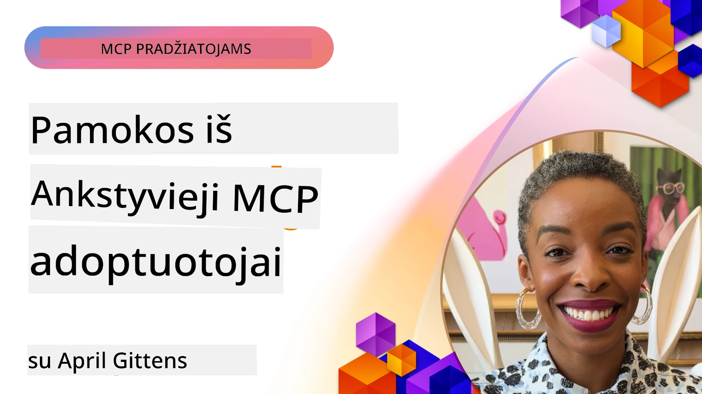

# 🌟 Pamokos iš Ankstyvųjų Naudotojų

[](https://youtu.be/jds7dSmNptE)

_(Spustelėkite aukščiau esantį paveikslėlį, kad peržiūrėtumėte vaizdo įrašą apie šią pamoką)_

## 🎯 Ką apima šis modulis

Šis modulis nagrinėja, kaip tikros organizacijos ir kūrėjai naudoja Modelio Konteksto Protokolą (MCP) spręsti realias problemas ir skatinti inovacijas. Per išsamias atvejų studijas, praktinius projektus ir pavyzdžius sužinosite, kaip MCP užtikrina saugų, mastelį turintį AI integravimą, jungiantį kalbos modelius, įrankius ir verslo duomenis.

### 📚 Pamatykite MCP veikiant

Norite pamatyti, kaip šie principai taikomi produkcijai paruoštuose įrankiuose? Peržiūrėkite mūsų [**10 Microsoft MCP serverių, kurie keičia kūrėjų produktyvumą**](microsoft-mcp-servers.md), kuriuose pristatomi tikri Microsoft MCP serveriai, kuriuos galite naudoti jau šiandien.

## Apžvalga

Ši pamoka nagrinėja, kaip ankstyvieji naudotojai panaudojo Modelio Konteksto Protokolą (MCP) realioms pasaulio problemoms spręsti ir inovacijoms skatinti įvairiose pramonės šakose. Per išsamias atvejų studijas ir praktinius projektus pamatysite, kaip MCP leidžia standartizuotą, saugią ir mastelio keičiamą AI integraciją – jungiant didelius kalbos modelius, įrankius ir verslo duomenis į vieningą sistemą. Įgysite praktinės patirties projektuodami ir kuriant MCP pagrindu veikiančius sprendimus, sužinosite patvirtintus diegimo modelius ir geriausias praktikas MCP diegimui gamybinėse aplinkose. Pamoka taip pat išryškina naujas tendencijas, ateities kryptis ir atviro kodo išteklius, kurie padės jums išlikti MCP technologijos ir jos besivystančios ekosistemos priekyje.

## Mokymosi Tikslai

- Analizuoti realius MCP diegimus skirtingose pramonės šakose
- Projektuoti ir kurti pilnai funkcionuojančias aplicações, pagrįstas MCP
- Tyrinėti naujus trendus ir ateities kryptis MCP technologijoje
- Taikyti geriausias praktikas tikrose kūrimo situacijose

## Realių MCP Diegimų Atvejai

### Atvejo Studija 1: Verslo Klientų Aptarnavimo Automatizavimas

Tarptautinė korporacija įdiegė MCP pagrindu veikiančią sistemą, standartizuojančią AI sąveikas jų klientų aptarnavimo sistemose. Tai leido jiems:

- Sukurti vieningą sąsają keliems LLM tiekėjams
- Išlaikyti nuoseklų užklausų (prompt) valdymą skirtingose skyriuose
- Įgyvendinti tvirtus saugumo ir atitikties kontrolės mechanizmus
- Lengvai keisti AI modelius pagal specifinius poreikius

**Techninis Įdiegimas:**

```python
# Python MCP serverio įgyvendinimas klientų aptarnavimui
import logging
import asyncio
from modelcontextprotocol import create_server, ServerConfig
from modelcontextprotocol.server import MCPServer
from modelcontextprotocol.transports import create_http_transport
from modelcontextprotocol.resources import ResourceDefinition
from modelcontextprotocol.prompts import PromptDefinition
from modelcontextprotocol.tool import ToolDefinition

# Konfigūruoti žurnalo fiksavimą
logging.basicConfig(level=logging.INFO)

async def main():
    # Sukurti serverio konfigūraciją
    config = ServerConfig(
        name="Enterprise Customer Support Server",
        version="1.0.0",
        description="MCP server for handling customer support inquiries"
    )
    
    # Inicializuoti MCP serverį
    server = create_server(config)
    
    # Užregistruoti žinių bazės išteklius
    server.resources.register(
        ResourceDefinition(
            name="customer_kb",
            description="Customer knowledge base documentation"
        ),
        lambda params: get_customer_documentation(params)
    )
    
    # Užregistruoti šablonus su užuominomis
    server.prompts.register(
        PromptDefinition(
            name="support_template",
            description="Templates for customer support responses"
        ),
        lambda params: get_support_templates(params)
    )
    
    # Užregistruoti palaikymo įrankius
    server.tools.register(
        ToolDefinition(
            name="ticketing",
            description="Create and update support tickets"
        ),
        handle_ticketing_operations
    )
    
    # Paleisti serverį su HTTP transportu
    transport = create_http_transport(port=8080)
    await server.run(transport)

if __name__ == "__main__":
    asyncio.run(main())
```

**Rezultatai:** 30% sumažėjusios modelių sąnaudos, 45% pagerėjusi atsakymų nuoseklumas ir sustiprinta atitiktis visame pasauliniame veikime.

### Atvejo Studija 2: Sveikatos Priežiūros Diagnostikos Asistentas

Sveikatos priežiūros įstaiga sukūrė MCP infrastruktūrą, integruodama kelis specializuotus medicinos AI modelius ir užtikrindama jautrios pacientų informacijos apsaugą:

- Sklandus perjungimas tarp bendrųjų ir specializuotų medicinos modelių
- Griežtos privatumo kontrolės ir audito takai
- Integracija su esamomis Elektroninės Sveikatos Įrašų (EHR) sistemomis
- Nuosekli užklausų inžinerija medicinos terminologijai

**Techninis Įdiegimas:**

```csharp
// C# MCP host application implementation in healthcare application
using Microsoft.Extensions.DependencyInjection;
using ModelContextProtocol.SDK.Client;
using ModelContextProtocol.SDK.Security;
using ModelContextProtocol.SDK.Resources;

public class DiagnosticAssistant
{
    private readonly MCPHostClient _mcpClient;
    private readonly PatientContext _patientContext;
    
    public DiagnosticAssistant(PatientContext patientContext)
    {
        _patientContext = patientContext;
        
        // Configure MCP client with healthcare-specific settings
        var clientOptions = new ClientOptions
        {
            Name = "Healthcare Diagnostic Assistant",
            Version = "1.0.0",
            Security = new SecurityOptions
            {
                Encryption = EncryptionLevel.Medical,
                AuditEnabled = true
            }
        };
        
        _mcpClient = new MCPHostClientBuilder()
            .WithOptions(clientOptions)
            .WithTransport(new HttpTransport("https://healthcare-mcp.example.org"))
            .WithAuthentication(new HIPAACompliantAuthProvider())
            .Build();
    }
    
    public async Task<DiagnosticSuggestion> GetDiagnosticAssistance(
        string symptoms, string patientHistory)
    {
        // Create request with appropriate resources and tool access
        var resourceRequest = new ResourceRequest
        {
            Name = "patient_records",
            Parameters = new Dictionary<string, object>
            {
                ["patientId"] = _patientContext.PatientId,
                ["requestingProvider"] = _patientContext.ProviderId
            }
        };
        
        // Request diagnostic assistance using appropriate prompt
        var response = await _mcpClient.SendPromptRequestAsync(
            promptName: "diagnostic_assistance",
            parameters: new Dictionary<string, object>
            {
                ["symptoms"] = symptoms,
                patientHistory = patientHistory,
                relevantGuidelines = _patientContext.GetRelevantGuidelines()
            });
            
        return DiagnosticSuggestion.FromMCPResponse(response);
    }
}
```

**Rezultatai:** Pagerintos diagnostikos rekomendacijos gydytojams, išlaikant pilną HIPAA atitiktį ir žymiai sumažinant konteksto keitimo tarp sistemų dažnumą.

### Atvejo Studija 3: Finansinių Paslaugų Rizikos Analizė

Finansų institucija įdiegė MCP standartizuodama rizikos analizės procesus skirtinguose skyriuose:

- Sukurta vieninga sąsaja kredito rizikos, sukčiavimo aptikimo ir investicijų rizikos modeliams
- Įdiegtos griežtos prieigos valdymo bei modelių versijavimo priemonės
- Užtikrinta visų AI rekomendacijų audituojamumas
- Išlaikytas nuoseklus duomenų formatavimas įvairiose sistemose

**Techninis Įdiegimas:**

```java
// Java MCP serveris finansinės rizikos vertinimui
import org.mcp.server.*;
import org.mcp.security.*;

public class FinancialRiskMCPServer {
    public static void main(String[] args) {
        // Sukurti MCP serverį su finansinės atitikties funkcijomis
        MCPServer server = new MCPServerBuilder()
            .withModelProviders(
                new ModelProvider("risk-assessment-primary", new AzureOpenAIProvider()),
                new ModelProvider("risk-assessment-audit", new LocalLlamaProvider())
            )
            .withPromptTemplateDirectory("./compliance/templates")
            .withAccessControls(new SOCCompliantAccessControl())
            .withDataEncryption(EncryptionStandard.FINANCIAL_GRADE)
            .withVersionControl(true)
            .withAuditLogging(new DatabaseAuditLogger())
            .build();
            
        server.addRequestValidator(new FinancialDataValidator());
        server.addResponseFilter(new PII_RedactionFilter());
        
        server.start(9000);
        
        System.out.println("Financial Risk MCP Server running on port 9000");
    }
}
```

**Rezultatai:** Pagerinta reguliavimo atitiktis, 40% greitesni modelių diegimo ciklai ir pagerintas rizikos vertinimo nuoseklumas skyriuose.

### Atvejo Studija 4: Microsoft Playwright MCP Serveris Naršyklės Automatizavimui

Microsoft sukūrė [Playwright MCP serverį](https://github.com/microsoft/playwright-mcp), leidžiantį saugiai ir standartizuotai automatizuoti naršyklių veiksmus per Modelio Konteksto Protokolą. Šis produkcijai paruoštas serveris leidžia AI agentams ir didelių kalbos modelių sistemoms kontroliuojamai, audituojamai ir išplečiamai sąveikauti su interneto naršyklėmis – leidžiant tokius naudojimo atvejus kaip automatizuotas svetainių testavimas, duomenų išgavimas ir end-to-end darbotvarkės.

> **🎯 Produkcijai Paruoštas Įrankis**
> 
> Ši atvejo studija pristato tikrą MCP serverį, kurį galite naudoti jau šiandien! Sužinokite daugiau apie Playwright MCP Serverį ir kitus 9 produkcijai paruoštus Microsoft MCP serverius mūsų [**Microsoft MCP serverių gide**](microsoft-mcp-servers.md#8--playwright-mcp-server).

**Pagrindinės Savybės:**
- Atveria naršyklės automatizavimo galimybes (navigacija, formų pildymas, ekrano kopijų fiksavimas ir kt.) kaip MCP įrankius
- Įgyvendina griežtą prieigos valdymą ir smėlio dėžę (sandboxing), kad būtų užkirstas kelias neautorizuotoms užduotims
- Teikia detalius audito žurnalus apie visas naršyklės sąveikas
- Palaiko integraciją su Azure OpenAI ir kitais LLM teikėjais agentų valdomai automatizacijai
- Maitina GitHub Copilot Kodo Agentą su naršyklės galimybėmis

**Techninis Įdiegimas:**

```typescript
// TypeScript: Įrašomas Playwright naršyklės automatizavimo įrankis MCP serveryje
import { createServer, ToolDefinition } from 'modelcontextprotocol';
import { launch } from 'playwright';

const server = createServer({
  name: 'Playwright MCP Server',
  version: '1.0.0',
  description: 'MCP server for browser automation using Playwright'
});

// Užregistruokite įrankį naršymui į URL ir ekrano nuotraukos fiksavimui
server.tools.register(
  new ToolDefinition({
    name: 'navigate_and_screenshot',
    description: 'Navigate to a URL and capture a screenshot',
    parameters: {
      url: { type: 'string', description: 'The URL to visit' }
    }
  }),
  async ({ url }) => {
    const browser = await launch();
    const page = await browser.newPage();
    await page.goto(url);
    const screenshot = await page.screenshot();
    await browser.close();
    return { screenshot };
  }
);

// Paleisti MCP serverį
server.listen(8080);
```

**Rezultatai:**

- Užtikrintas saugus, programinis naršyklių automatizavimas AI agentams ir LLM
- Sumažintas rankinis testavimo darbas ir pagerintas testavimo aprėptis žiniatinklio aplikacijoms
- Pateikta pernaudojama, išplečiama sistema naršyklės pagrindu vykdomai įrankių integracijai verslo aplinkoje
- Maitina GitHub Copilot naršyklės galimybes

**Nuorodos:**

- [Playwright MCP Serverio GitHub saugykla](https://github.com/microsoft/playwright-mcp)
- [Microsoft AI ir automatizavimo sprendimai](https://azure.microsoft.com/en-us/products/ai-services/)

### Atvejo Studija 5: Azure MCP – Verslo Lygio Modelio Konteksto Protokolas kaip Paslauga

Azure MCP Serveris ([https://aka.ms/azmcp](https://aka.ms/azmcp)) yra Microsoft valdomas, verslo lygio Modelio Konteksto Protokolo įgyvendinimas, skirtas teikti mastelio keičiamas, saugias ir atitinkančias reikalavimus MCP serverio galimybes kaip debesijos paslaugą. Azure MCP leidžia organizacijoms greitai diegti, valdyti ir integruoti MCP serverius su Azure AI, duomenų ir saugumo paslaugomis, sumažinant operatyvinę naštą ir spartinant AI pritaikymą.

> **🎯 Produkcijai Paruoštas Įrankis**
> 
> Tai tikras MCP serveris, kurį galite naudoti jau šiandien! Sužinokite daugiau apie Azure AI Foundry MCP Serverį mūsų [**Microsoft MCP serverių gide**](microsoft-mcp-servers.md).

- Pilnai valdomas MCP serverio priegloba su įmontuotu masteliavimo, stebėjimo ir saugumo palaikymu
- Natūrali integracija su Azure OpenAI, Azure AI Search ir kitomis Azure paslaugomis
- Verslo lygio autentifikacija ir autorizacija per Microsoft Entra ID
- Palaikymas pasirinktiniams įrankiams, užklausų šablonams ir išteklių jungikliams
- Atitiktis verslo saugumo ir reglamentavimo reikalavimams

**Techninis Įdiegimas:**

```yaml
# Example: Azure MCP server deployment configuration (YAML)
apiVersion: mcp.microsoft.com/v1
kind: McpServer
metadata:
  name: enterprise-mcp-server
spec:
  modelProviders:
    - name: azure-openai
      type: AzureOpenAI
      endpoint: https://<your-openai-resource>.openai.azure.com/
      apiKeySecret: <your-azure-keyvault-secret>
  tools:
    - name: document_search
      type: AzureAISearch
      endpoint: https://<your-search-resource>.search.windows.net/
      apiKeySecret: <your-azure-keyvault-secret>
  authentication:
    type: EntraID
    tenantId: <your-tenant-id>
  monitoring:
    enabled: true
    logAnalyticsWorkspace: <your-log-analytics-id>
```

**Rezultatai:**  
- Sutrumpintas laikas iki vertės gavimo verslo AI projektuose, suteikiant paruoštą naudoti, atitinkantį reikalavimus MCP serverio platformą
- Supaprastinta LLM, įrankių ir verslo duomenų šaltinių integracija
- Pagerintas saugumas, stebimumas ir veiklos efektyvumas MCP darbo krūviams
- Pagerinta kodo kokybė taikant Azure SDK geriausias praktikas ir standartines autentifikacijos schemas

**Nuorodos:**  
- [Azure MCP dokumentacija](https://aka.ms/azmcp)
- [Azure MCP Serverio GitHub saugykla](https://github.com/Azure/azure-mcp)
- [Azure AI paslaugos](https://azure.microsoft.com/en-us/products/ai-services/)
- [Microsoft MCP centras](https://mcp.azure.com)

## Atvejo Studija 6: NLWeb  
MCP (Modelio Konteksto Protokolas) yra naujoviškas protokolas pokalbių robotams ir AI asistentams bendrauti su įrankiais. Kiekviena NLWeb instancija taip pat yra MCP serveris, kuris palaiko vieną pagrindinį metodą – ask, naudojamą klausimams interneto svetainei natūralia kalba užduoti. Grąžinamas atsakymas naudoja schema.org – plačiai naudojamą žodyną interneto duomenims aprašyti. Paprastai tariant, MCP yra NLWeb, kaip HTTP yra HTML. NLWeb sujungia protokolus, Schema.org formatus ir pavyzdinį kodą, kad padėtų svetainėms greitai kurti šias galines sąsajas, naudingas tiek žmonėms per pokalbių vartotojo sąsajas, tiek mašinoms per natūralų agentų tarpusavio bendravimą.

NLWeb sudaro du atskiri komponentai.
- Protokolas, iš pradžių labai paprastas, svetainės sąsajai natūralia kalba ir formatas, panaudojant json ir schema.org grąžinamiems atsakymams. Daugiau informacijos žr. REST API dokumentacijoje.
- Paprasta (1) įgyvendinimo versija, kuri panaudoja esamą žymėjimą svetainėms, kurios gali būti abstrahuotos kaip elementų sąrašai (produktai, receptai, lankytini objektai, apžvalgos ir kt.). Kartu su vartotojo sąsajos valdiklių rinkiniu svetainės gali lengvai suteikti pokalbių vartotojo sąsajas savo turiniui. Daugiau informacijos žr. dokumentacijoje apie pokalbio užklausos gyvenimo ciklą, kaip tai veikia.

**Nuorodos:**  
- [Azure MCP dokumentacija](https://aka.ms/azmcp)
- [NLWeb](https://github.com/microsoft/NlWeb)

### Atvejo Studija 7: Azure AI Foundry MCP Serveris – Įmonių AI Agentų Integracija

Azure AI Foundry MCP serveriai demonstruoja, kaip MCP galima naudoti AI agentų ir darbo srautų organizavimui bei valdymui įmonių aplinkose. Integruojant MCP su Azure AI Foundry, organizacijos gali standartizuoti agentų sąveikas, naudoti Foundry darbo srautų valdymą ir užtikrinti saugius bei mastelio keičiamus diegimus.

> **🎯 Produkcijai Paruoštas Įrankis**
> 
> Tai tikras MCP serveris, kurį galite naudoti jau šiandien! Sužinokite daugiau apie Azure AI Foundry MCP Serverį mūsų [**Microsoft MCP serverių gide**](microsoft-mcp-servers.md#9--azure-ai-foundry-mcp-server).

**Pagrindinės Savybės:**
- Išsamus prieigos taškas į Azure AI ekosistemą, įskaitant modelių katalogus ir diegimų valdymą
- Žinių indeksavimas su Azure AI Search RAG aplikacijoms
- AI modelių našumo ir kokybės užtikrinimo įrankiai
- Integracija su Azure AI Foundry katalogu ir laboratorijomis pažangių tyrimų modeliams
- Agentų valdymo ir vertinimo galimybės gamybinėms situacijoms

**Rezultatai:**
- Greitas AI agentų darbo srautų prototipavimas ir patikimas stebėjimas
- Sklandi integracija su Azure AI paslaugomis pažangiems scenarijams
- Vieninga sąsaja agentų jungtims, diegimui ir monitoriavimui
- Pagerintas saugumas, atitiktis ir veiklos efektyvumas įmonėms
- Spartesnis AI diegimas kartu išlaikant kontrolę sudėtingiems agentų procesams

**Nuorodos:**
- [Azure AI Foundry MCP Serverio GitHub saugykla](https://github.com/azure-ai-foundry/mcp-foundry)
- [Azure AI agentų integracija su MCP (Microsoft Foundry tinklaraštis)](https://devblogs.microsoft.com/foundry/integrating-azure-ai-agents-mcp/)

### Atvejo Studija 8: Foundry MCP Playground – Eksperimentai ir Prototipavimas

Foundry MCP Playground siūlo paruoštą naudojimui aplinką MCP serverių ir Azure AI Foundry integracijų eksperimentavimui. Kūrėjai gali greitai kurti prototipus, testuoti ir vertinti AI modelius bei agentų darbo srautus, naudodami Azure AI Foundry katalogo ir laboratorijų resursus. Playground supaprastina diegimą, suteikia pavyzdinius projektus ir palaiko bendradarbiavimą, leidžiant lengvai tyrinėti geriausias praktikas ir naujas situacijas su minimaliu papildomu darbu. Tai ypač naudinga komandoms, kurios nori patvirtinti idėjas, dalintis eksperimentais ir pagreitinti mokymąsi be sudėtingos infrastruktūros. Sumažindamas įėjimo kliūtis, playground skatina inovacijas ir bendruomenės indėlius MCP ir Azure AI Foundry ekosistemoje.

**Nuorodos:**

- [Foundry MCP Playground GitHub saugykla](https://github.com/azure-ai-foundry/foundry-mcp-playground)

### Atvejo Studija 9: Microsoft Learn Docs MCP Serveris – Dokumentacijos pasiekimas su AI pagalba

Microsoft Learn Docs MCP Serveris yra debesyje talpinama paslauga, teikianti AI asistentams realaus laiko prieigą prie oficialios Microsoft dokumentacijos per Modelio Konteksto Protokolą. Šis produkcijai paruoštas serveris jungiasi prie plataus Microsoft Learn ekosistemos ir leidžia semantiškai ieškoti visose oficialiose Microsoft šaltiniuose.

> **🎯 Produkcijai Paruoštas Įrankis**
> 
> Tai tikras MCP serveris, kurį galite naudoti jau šiandien! Sužinokite daugiau apie Microsoft Learn Docs MCP Serverį mūsų [**Microsoft MCP serverių gide**](microsoft-mcp-servers.md#1--microsoft-learn-docs-mcp-server).

**Pagrindinės Savybės:**
- Realiojo laiko prieiga prie oficialios Microsoft dokumentacijos, Azure dokumentų ir Microsoft 365 dokumentacijos
- Pažangios semantinio paieškos galimybės, suprantančios kontekstą ir ketinimus
- Visada atnaujinta informacija, kai publikuojamas Microsoft Learn turinys
- Išsami aprėptis apima Microsoft Learn, Azure dokumentaciją ir Microsoft 365 šaltinius
- Grąžina iki 10 aukštos kokybės turinio dalių su straipsnių pavadinimais ir nuorodomis

**Kodėl tai svarbu:**
- Sprendžia „pasenusių AI žinių“ problemą Microsoft technologijų srityje
- Užtikrina AI asistentams prieigą prie naujausių .NET, C#, Azure ir Microsoft 365 funkcijų
- Teikia autoritetingą pirmosios šalies informaciją tiksliam kodo generavimui
- Esminis įrankis kūrėjams, dirbantiems su sparčiai besivystančiomis Microsoft technologijomis

**Rezultatai:**
- Žymiai pagerinta AI sugeneruoto kodo tikslumas Microsoft technologijose
- Sumažintas laikas, praleidžiamas ieškant aktualios dokumentacijos ir geriausių praktikų
- Pagerintas kūrėjų produktyvumas dėl kontekstą suprantančios dokumentacijos paieškos
- Sklandi integracija su kūrimo procesais nepaliekant IDE

**Nuorodos:**
- [Microsoft Learn Docs MCP Serverio GitHub saugykla](https://github.com/MicrosoftDocs/mcp)
- [Microsoft Learn dokumentacija](https://learn.microsoft.com/)

## Praktiniai Projektai

### Projektas 1: Sukurkite Daugia-Tiekėjų MCP Serverį

**Tikslas:** Sukurti MCP serverį, kuris galėtų nukreipti užklausas keliems AI modelių tiekėjams pagal tam tikrus kriterijus.

**Reikalavimai:**

- Palaikyti bent tris skirtingus modelių tiekėjus (pvz., OpenAI, Anthropic, vietinius modelius)
- Įgyvendinti maršrutizavimo mechanizmą, pagrįstą užklausos metaduomenimis
- Sukurti konfigūravimo sistemą tiekėjų kredencialiams valdyti
- Įdiegti kešavimą našumo ir sąnaudų optimizavimui
- Sukurti paprastą stebėjimo skydelį naudojimui

**Įgyvendinimo Etapai:**

1. Įdiegti pagrindinę MCP serverio infrastruktūrą
2. Įgyvendinti tiekėjų adapterius kiekvienai AI modeliavimo paslaugai
3. Sukurti maršrutizavimo logiką pagal užklausos atributus
4. Įdiegti kešavimo mechanizmus dažnoms užklausoms
5. Parengti stebėjimo skydelį
6. Testuoti su įvairiais užklausų modeliais

**Technologijos:** Pasirinkite Python (.NET/Java/Python pagal pageidavimą), Redis kešavimui ir paprastą web karkasą skydeliui sukurti.

### Projektas 2: Verslo Užklausų Valdymo Sistema
**Tikslas:** Sukurti MCP pagrindu veikiančią sistemą, skirtą šablonų valdymui, versijavimui ir diegimui organizacijoje.

**Reikalavimai:**

- Sukurti centralizuotą šablonų saugyklą
- Įdiegti versijavimo ir patvirtinimo darbo eigas
- Sukurti galimybes testuoti šablonus su pavyzdiniais įvestimis
- Vystyti vaidmenimis pagrįstą prieigos kontrolę
- Sukurti API šablonų gavimui ir diegimui

**Įgyvendinimo žingsniai:**

1. Sukurti duomenų bazės schemą šablonų saugojimui
2. Sukurti pagrindinį API šablonų CRUD operacijoms
3. Įgyvendinti versijavimo sistemą
4. Sukurti patvirtinimo darbo eigą
5. Vystyti testavimo sistemą
6. Sukurti paprastą žiniatinklio sąsają valdymui
7. Integruoti su MCP serveriu

**Technologijos:** Jūsų pasirinktas backend karkasas, SQL arba NoSQL duomenų bazė bei frontendo karkasas valdymo sąsajai.

### Projektas 3: MCP pagrindu veikianti turinio kūrimo platforma

**Tikslas:** Sukurti turinio kūrimo platformą, kuri pasitelkia MCP, siekiant užtikrinti nuoseklius rezultatus skirtingų turinio tipų generavimui.

**Reikalavimai:**

- Palaikyti kelis turinio formatus (tinklaraščio straipsniai, socialinių tinklų turinys, rinkodaros tekstas)
- Įgyvendinti šablonų pagrindu veikiantį generavimą su individualizavimo galimybėmis
- Sukurti turinio peržiūros ir grįžtamojo ryšio sistemą
- Stebėti turinio veiklos rodiklius
- Palaikyti turinio versijavimą ir iteracijas

**Įgyvendinimo žingsniai:**

1. Įdiegti MCP kliento infrastruktūrą
2. Sukurti šablonus skirtingiems turinio tipams
3. Sukurti turinio generavimo procesą
4. Įgyvendinti peržiūros sistemą
5. Vystyti veiklos rodiklių stebėjimo sistemą
6. Sukurti vartotojo sąsają šablonų valdymui ir turinio generavimui

**Technologijos:** Jūsų pasirinkta programavimo kalba, žiniatinklio karkasas ir duomenų bazės sistema.

## MCP technologijos ateities kryptys

### Kylančios tendencijos

1. **Daugiakomponentis MCP**
   - MCP plėtra siekiant standartizuoti sąveiką su vaizdų, garso ir video modeliais
   - Kryžminio modalumo samprotavimo galimybių vystymas
   - Standartizuoti užklausų formatai skirtingoms modalumams

2. **Federuota MCP infrastruktūra**
   - Išskirstytos MCP tinklai, galintys dalintis resursais tarp organizacijų
   - Standartizuoti protokolai saugiam modelių dalijimuisi
   - Privatumą saugančios skaičiavimo technologijos

3. **MCP turgavietės**
   - Ekosistemos MCP šablonų ir papildinių dalijimuisi bei monetizavimui
   - Kokybės užtikrinimo ir sertifikavimo procesai
   - Integracija su modelių turgavietėmis

4. **MCP periferinėje skaičiavimo infrastruktūroje**
   - MCP standartų pritaikymas ribotų išteklių periferinėms įrenginiams
   - Optimizuoti protokolai mažo pralaidumo aplinkoms
   - Specializuotos MCP realizacijos IoT ekosistemoms

5. **Reguliaciniai pagrindai**
   - MCP plėtiniai, skirti reguliavimo atitikčiai užtikrinti
   - Standartizuotos audito sekos ir paaiškinamumo sąsajos
   - Integracija su kylančiais AI valdymo principais

### Microsoft MCP sprendimai

Microsoft ir Azure sukūrė keletą atvirojo kodo saugyklų, kurios padeda programuotojams MCP įgyvendinti įvairiose situacijose:

#### Microsoft organizacija

1. [playwright-mcp](https://github.com/microsoft/playwright-mcp) – Playwright MCP serveris naršyklės automatizavimui ir testavimui
2. [files-mcp-server](https://github.com/microsoft/files-mcp-server) – OneDrive MCP serverio realizacija vietiniam testavimui ir bendruomenės indėliui
3. [NLWeb](https://github.com/microsoft/NlWeb) – NLWeb yra atvirų protokolų ir susijusių atvirojo kodo įrankių rinkinys. Jo pagrindinis tikslas – sukurti AI tinklo pagrindų sluoksnį

#### Azure-Samples organizacija

1. [mcp](https://github.com/Azure-Samples/mcp) – Nuorodos į pavyzdžius, įrankius ir resursus MCP serverių kūrimui ir integracijai Azure keliomis kalbomis
2. [mcp-auth-servers](https://github.com/Azure-Samples/mcp-auth-servers) – Pavyzdiniai MCP serveriai su dabartiniu Model Context Protocol autentifikavimo specifiškumu
3. [remote-mcp-functions](https://github.com/Azure-Samples/remote-mcp-functions) – Pradinis puslapis nutolusių MCP serverių implementacijoms Azure Functions su nuorodomis kalbų specifiniams saugykloms
4. [remote-mcp-functions-python](https://github.com/Azure-Samples/remote-mcp-functions-python) – Greito starto šablonas kuriant ir diegiant nuotolinius MCP serverius su Azure Functions ir Python
5. [remote-mcp-functions-dotnet](https://github.com/Azure-Samples/remote-mcp-functions-dotnet) – Greito starto šablonas kuriant ir diegiant nuotolinius MCP serverius su Azure Functions ir .NET/C#
6. [remote-mcp-functions-typescript](https://github.com/Azure-Samples/remote-mcp-functions-typescript) – Greito starto šablonas kuriant ir diegiant nuotolinius MCP serverius su Azure Functions ir TypeScript
7. [remote-mcp-apim-functions-python](https://github.com/Azure-Samples/remote-mcp-apim-functions-python) – Azure API valdymas kaip AI vartai į nuotolinius MCP serverius naudojant Python
8. [AI-Gateway](https://github.com/Azure-Samples/AI-Gateway) – APIM ❤️ AI eksperimentai su MCP galimybėmis, integracija su Azure OpenAI ir AI Foundry

Šios saugyklos siūlo įvairias realizacijas, šablonus ir resursus dirbant su Model Context Protocol skirtingomis programavimo kalbomis bei Azure paslaugomis. Jos apima panaudojimo atvejus nuo bazinių serverių realizacijų iki autentifikavimo, debesijos diegimo ir įmonių integracijos scenarijų.

#### MCP resursų katalogas

[MCP resursų katalogas](https://github.com/microsoft/mcp/tree/main/Resources) oficialioje Microsoft MCP saugykloje suteikia kruopščiai atrinktą pavyzdinių resursų, užklausų šablonų ir įrankių aprašų kolekciją MCP serveriams. Šis katalogas yra sukurtas siekiant padėti programuotojams greitai pradėti darbą su MCP, siūlant pakartotinai naudojamus elementus ir geriausių praktikų pavyzdžius:

- **Užklausų šablonai:** Paruošti naudoti šablonai dažniems AI uždaviniams ir scenarijoms, kuriuos galima pritaikyti savo MCP serverių realizacijoms.
- **Įrankių aprašai:** Pavyzdinės įrankių schemos ir meta duomenys integracijos ir kvietimo standartizavimui skirtinguose MCP serveriuose.
- **Išteklių pavyzdžiai:** Pavyzdiniai išteklių aprašai duomenų šaltinių, API ir išorinių paslaugų prijungimui MCP aplinkoje.
- **Referencinės realizacijos:** Praktiniai pavyzdžiai, rodantys, kaip tvarkyti ir organizuoti išteklius, užklausas ir įrankius realiuose MCP projektuose.

Šie resursai pagreitina vystymą, skatina standartizaciją ir padeda užtikrinti geriausias praktikas kuriant ir diegiant MCP pagrindu veikiančius sprendimus.

#### MCP resursų katalogas

- [MCP resursai (pavyzdiniai užklausimai, įrankiai ir išteklių aprašai)](https://github.com/microsoft/mcp/tree/main/Resources)

### Tyrimų galimybės

- Efektyvūs užklausų optimizavimo būdai MCP sistemose
- Saugumo modeliai daugnuomenei MCP diegimui
- Veiklos lyginamoji analizė skirtingose MCP realizacijose
- Formalaus tikrinimo metodai MCP serveriams

## Išvada

Model Context Protocol (MCP) sparčiai formuoja ateitį, kurioje AI integracija yra standartizuota, saugi ir tarpusavyje suderinama pramonės šakose. Per šio modulio atvejų analizę ir praktinius projektus matėte, kaip ankstyvųjų pritaikymo pavyzdžių kūrėjai, tarp jų Microsoft ir Azure, pasitelkia MCP spręsdami realias problemas, spartindami AI diegimą ir užtikrindami atitiktį, saugumą bei mastelį. MCP modulinė architektūra leidžia organizacijoms vieningoje, audituojamoje aplinkoje prijungti didelius kalbos modelius, įrankius ir įmonių duomenis. MCP toliau vystantis, svarbu aktyviai dalyvauti bendruomenėje, tirti atvirojo kodo išteklius ir taikyti geriausias praktikas, siekiant kurti patikimus, ateičiai pasiruošusius AI sprendimus.

## Papildomi ištekliai

- [MCP Foundry GitHub saugykla](https://github.com/azure-ai-foundry/mcp-foundry)
- [Foundry MCP žaidimų aikštelė](https://github.com/azure-ai-foundry/foundry-mcp-playground)
- [Azure AI agentų integracija su MCP (Microsoft Foundry tinklaraštis)](https://devblogs.microsoft.com/foundry/integrating-azure-ai-agents-mcp/)
- [MCP GitHub saugykla (Microsoft)](https://github.com/microsoft/mcp)
- [MCP resursų katalogas (pavyzdiniai užklausimai, įrankiai ir išteklių aprašai)](https://github.com/microsoft/mcp/tree/main/Resources)
- [MCP bendruomenė ir dokumentacija](https://modelcontextprotocol.io/introduction)
- [MCP specifikacija (2025-11-25)](https://spec.modelcontextprotocol.io/specification/2025-11-25/)
- [Azure MCP dokumentacija](https://aka.ms/azmcp)
- [OWASP MCP Top 10](https://microsoft.github.io/mcp-azure-security-guide/mcp/) – Saugumo geriausios praktikos
- [Playwright MCP serverio GitHub saugykla](https://github.com/microsoft/playwright-mcp)
- [Files MCP serveris (OneDrive)](https://github.com/microsoft/files-mcp-server)
- [Azure-Samples MCP](https://github.com/Azure-Samples/mcp)
- [MCP Autentifikavimo serveriai (Azure-Samples)](https://github.com/Azure-Samples/mcp-auth-servers)
- [Remote MCP Functions (Azure-Samples)](https://github.com/Azure-Samples/remote-mcp-functions)
- [Remote MCP Functions Python (Azure-Samples)](https://github.com/Azure-Samples/remote-mcp-functions-python)
- [Remote MCP Functions .NET (Azure-Samples)](https://github.com/Azure-Samples/remote-mcp-functions-dotnet)
- [Remote MCP Functions TypeScript (Azure-Samples)](https://github.com/Azure-Samples/remote-mcp-functions-typescript)
- [Remote MCP APIM Functions Python (Azure-Samples)](https://github.com/Azure-Samples/remote-mcp-apim-functions-python)
- [AI-Gateway (Azure-Samples)](https://github.com/Azure-Samples/AI-Gateway)
- [Microsoft AI ir automatizavimo sprendimai](https://azure.microsoft.com/en-us/products/ai-services/)

## Pratimai

1. Išanalizuokite vieną iš atvejų studijų ir pasiūlykite alternatyvų įgyvendinimo požiūrį.
2. Pasirinkite vieną iš projektų idėjų ir sukurkite išsamią techninę specifikaciją.
3. Ištirkite sektorių, neaptartą atvejų studijose, ir apibrėžkite, kaip MCP galėtų spręsti jo specifines problemas.
4. Ištirkite vieną iš ateities krypčių ir sukurkite naujo MCP plėtinio koncepciją, ją palaikantį.

## Kas toliau

Tęskite pažinimą: [Microsoft MCP serveriai](./microsoft-mcp-servers.md)

Sekite į: [8 modulis: Geriausios praktikos](../08-BestPractices/README.md)

---

<!-- CO-OP TRANSLATOR DISCLAIMER START -->
**Atsakomybės apribojimas**:
Šis dokumentas buvo išverstas naudojant dirbtinio intelekto vertimo paslaugą [Co-op Translator](https://github.com/Azure/co-op-translator). Nors stengiamės užtikrinti tikslumą, prašome atkreipti dėmesį, kad automatizuoti vertimai gali turėti klaidų ar netikslumų. Originalus dokumentas jo gimtąja kalba turi būti laikomas autoritetingu šaltiniu. Dėl svarbios informacijos rekomenduojama naudoti profesionalų žmogišką vertimą. Mes neprisiimame atsakomybės už bet kokius nesusipratimus ar neteisingus aiškinimus, kylančius naudojantis šiuo vertimu.
<!-- CO-OP TRANSLATOR DISCLAIMER END -->