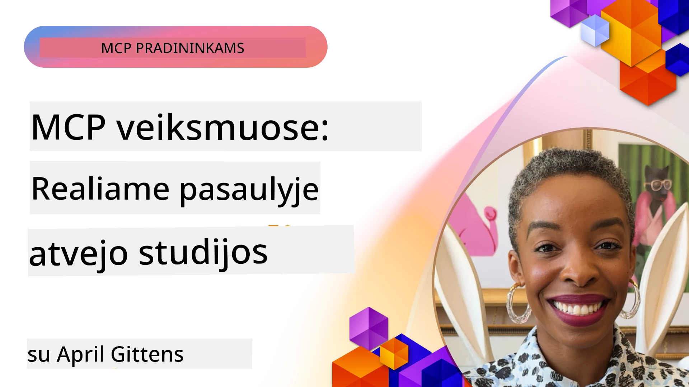

# MCP veiksme: realaus pasaulio atvejų analizė

_(Spustelėkite aukščiau esantį paveikslėlį, kad peržiūrėtumėte šios pamokos vaizdo įrašą)_

Modelio konteksto protokolas (MCP) keičia tai, kaip dirbtinio intelekto programos sąveikauja su duomenimis, įrankiais ir paslaugomis. Ši skiltis pristato realaus pasaulio atvejų analizę, demonstruojančią MCP praktinį pritaikymą įvairiose įmonių situacijose.

## Apžvalga

Šioje skiltyje pateikiami konkretūs MCP įgyvendinimo pavyzdžiai, parodantys, kaip organizacijos naudoja šį protokolą spręsdamos sudėtingas verslo užduotis. Analizuodami šias atvejų studijas, įgisite įžvalgų apie MCP universalumą, mastelį ir praktinę naudą realaus pasaulio aplinkoje.

## Pagrindiniai mokymosi tikslai

Analizuodami šias atvejų studijas, jūs:

- Suprasite, kaip MCP galima taikyti konkrečioms verslo problemoms spręsti
- Sužinosite apie skirtingus integracijos modelius ir architektūrinius požiūrius
- Atpažinsite geriausias praktikas MCP diegimui įmonių aplinkoje
- Įgisite įžvalgų apie iššūkius ir sprendimus, susiduriančius realiose diegimo situacijose
- Nustatysite galimybes taikyti panašius modelius savo projektuose

## Išskirtinės atvejų studijos

### 1. [„Azure AI Travel Agents“ – kontrolinis pavyzdys](./travelagentsample.md)

Ši atvejų studija nagrinėja Microsoft išsamų kontrolinį sprendimą, kuris demonstruoja, kaip sukurti daugiaagentinę, dirbtiniu intelektu pagrįstą kelionių planavimo programą naudojant MCP, Azure OpenAI ir Azure AI Search. Projekte pristatoma:

- Daugiaagentinė orkestracija per MCP
- Įmonių duomenų integracija su Azure AI Search
- Saugios, mastelį keičiančios architektūros naudojimas su Azure paslaugomis
- Plėtojami įrankiai su daugiakartinio naudojimo MCP komponentais
- Pokalbių naudotojo patirtis, kurią palaiko Azure OpenAI

Architektūros ir įgyvendinimo detalės suteikia vertingų įžvalgų apie sudėtingų daugiaagentinių sistemų kūrimą naudojant MCP kaip koordinavimo sluoksnį.

### 2. [„Azure DevOps“ elementų atnaujinimas iš YouTube duomenų](./UpdateADOItemsFromYT.md)

Ši atvejų studija demonstruoja MCP praktinį taikymą darbo srautų procesų automatizavimui. Joje parodyta, kaip MCP įrankiai gali būti naudojami:

- Išgauti duomenis iš internetinių platformų (YouTube)
- Atnaujinti darbo elementus Azure DevOps sistemose
- Kurti pakartojamus automatizavimo darbo srautus
- Integruoti duomenis tarp skirtingų sistemų

Šis pavyzdys iliustruoja, kaip net santykinai paprasti MCP diegimai gali suteikti ženklių efektyvumo pranašumų automatizuojant rutininius darbus ir gerinant duomenų nuoseklumą tarp sistemų.

### 3. [Dokumentacijos realaus laiko gavimas su MCP](./docs-mcp/README.md)

Ši atvejų studija nukreipia, kaip prijungti Python konsolės klientą prie Modelio konteksto protokolo (MCP) serverio, kad būtų galima gauti ir registruoti realaus laiko, kontekstą atitinkančią Microsoft dokumentaciją. Išmoksite:

- Prisijungti prie MCP serverio naudojant Python klientą ir oficialų MCP SDK
- Naudoti srautinio HTTP kliento mechanizmus efektyviam duomenų gavimui realiu laiku
- Iškvietinėti dokumentacijos įrankius serveryje ir atsakymus tiesiogiai registruoti konsolėje
- Integruoti naujausią Microsoft dokumentaciją į savo darbo eigą neišeinant iš terminalo

Skyrius apima praktinį užduotį, minimalų veikiančio kodo pavyzdį ir nuorodas į papildomus išteklius gilesniam mokymuisi. Peržiūrėkite visą žingsnis po žingsnio aprašymą ir kodą susietame skyriuje, kad suprastumėte, kaip MCP gali pakeisti dokumentacijos prieigą ir kūrėjų produktyvumą konsolės aplinkose.

### 4. [Interaktyvi studijų plano generatoriaus žiniatinklio programa su MCP](./docs-mcp/README.md)

Ši atvejų studija parodo, kaip sukurti interaktyvią žiniatinklio programą naudojant Chainlit ir Modelio konteksto protokolą (MCP) individualizuotiems studijų planams generuoti bet kuriai temai. Vartotojai gali nurodyti temą (pvz., „AI-900 sertifikatas“) ir studijų trukmę (pvz., 8 savaitės), o programa pateiks savaitinį rekomenduojamos medžiagos suskirstymą. Chainlit suteikia pokalbių sąsają, dėl kurios patirtis tampa įtraukianči ir adaptuojama.

- Pokalbių žiniatinklio programa, veikianti Chainlit pagrindu
- Vartotojo iniciatyva valdomi užklausimai temai ir trukmei
- Savaitinis turinio rekomendacijų pateikimas naudojant MCP
- Realaus laiko adaptuojami atsakymai pokalbių sąsajoje

Projektas iliustruoja, kaip galima sujungti pokalbių AI ir MCP, kad būtų sukurti dinamiški, vartotojo valdomi švietimo įrankiai šiuolaikinėje žiniatinklio aplinkoje.

### 5. [Dokumentacija redaktoriuje su MCP serveriu VS Code](./docs-mcp/README.md)

Ši atvejų studija demonstruoja, kaip galite Microsoft Learn dokumentaciją įkelti tiesiai į savo VS Code aplinką naudodami MCP serverį – nebebus reikalo perjungti naršyklės langų! Išmoksite:

- Iškart ieškoti ir skaityti dokumentus VS Code viduje naudojant MCP skydelį arba komandų paletę
- Nuorodoms į dokumentaciją nurodyti ir įterpti jas tiesiai į „README“ arba mokymo rinkmenos markdown failus
- Naudoti GitHub Copilot ir MCP kartu sklandžiam, dirbtinio intelekto pagrindu veikiančiam dokumentacijos ir kodo darbo srautui
- Tikrinti ir tobulinti savo dokumentaciją su realaus laiko atsiliepimais ir Microsoft patikimumu
- Integruoti MCP su GitHub darbo srautais nuolatinės dokumentacijos validacijai

Įgyvendinimas apima:

- Pavyzdinę `.vscode/mcp.json` konfigūraciją patogiam nustatymui
- Ekrano nuotraukomis pagrįstus vadovus apie darbo redaktoriuje patirtį
- Patarimus, kaip derinti Copilot ir MCP maksimaliai produktyvumui

Šis scenarijus puikiai tinka kursų autoriams, dokumentacijos rašytojams ir programuotojams, kurie nori likti susikaupę redaktoriuje dirbdami su dokumentacija, Copilot ir tikrinimo įrankiais – visa tai veikia MCP pagrindu.

### 6. [APIM MCP serverio kūrimas](./apimsample.md)

Ši atvejų studija pateikia žingsnis po žingsnio vadovą, kaip sukurti MCP serverį naudojant Azure API valdymą (APIM). Aptariama:

- MCP serverio nustatymas Azure API valdyme
- API operacijų atskleidimas kaip MCP įrankių
- Taisyklių konfigūravimas dėl greičio ribojimo ir saugumo
- MCP serverio testavimas naudojant Visual Studio Code ir GitHub Copilot

Šis pavyzdys iliustruoja, kaip panaudoti Azure galimybes kuriant tvirtą MCP serverį, kurį galima naudoti įvairiose programose, gerinant DI sistemų integraciją su įmonių API.

### 7. [GitHub MCP registras – pagreitinant agentišką integraciją](https://github.com/mcp)

Ši atvejų studija nagrinėja, kaip 2025 metų rugsėjį paleistas GitHub MCP registras sprendžia kritinę DI ekosistemos problemą: išskaidytą Modelio konteksto protokolo (MCP) serverių paiešką ir diegimą.

#### Apžvalga
**MCP registras** sprendžia augančią problemą, susijusią su išsisklaidžiusiais MCP serveriais tarp saugyklų ir registrų, dėl ko integracija buvo lėta ir klaidų linkusi. Šie serveriai leidžia DI agentams sąveikauti su išorinėmis sistemomis, kaip API, duomenų bazėmis ir dokumentacijos šaltiniais.

#### Problemos aprašymas
Kūrėjai, kurdami agentiškus darbo srautus, susidūrė su iššūkiais:
- **Prasta MCP serverių radimo galimybė** skirtingose platformose
- **Dublikatiniai diegimo klausimai** forumuose ir dokumentacijoje
- **Saugumo rizikos** iš nepatikrintų ir nepatikimų šaltinių
- **Trūksta standartizacijos** serverių kokybei ir suderinamumui

#### Sprendimo architektūra
GitHub MCP registras zentralizuoja patikimus MCP serverius su svarbiomis savybėmis:
- **Vieno spustelėjimo diegimas** per VS Code sklandžiam nustatymui
- **Signalo triukšme rūšiavimas** pagal žvaigždutes, aktyvumą ir bendruomenės patvirtinimus
- **Tiesioginė integracija** su GitHub Copilot ir kitais MCP suderinamais įrankiais
- **Atviras dalyvavimo modelis** leidžiantis bendruomenei ir įmonių partneriams prisidėti

#### Verslo poveikis
Registras užtikrino matomus patobulinimus:
- **Greitesnis įsijungimas** kūrėjams, naudojantiems tokias priemones kaip Microsoft Learn MCP serveris, kuris transliuoja oficialią dokumentaciją tiesiai agentams
- **Didėjanti produktyvumas** per specializuotus serverius, pvz., `github-mcp-server`, leidžiančius natūraliu kalbos komandų valdymą GitHub (PR kūrimas, CI perkartojimas, kodo nuskaitymas)
- **Sustiprintas ekosistemos pasitikėjimas** dėl kuruojamų sąrašų ir skaidrių konfigūracijos standartų

#### Strateginė vertė
Agentų gyvavimo ciklo valdymo ir atkuriamų darbo srautų specialistams MCP registras suteikia:
- **Modulinį agentų diegimą** su standartizuotomis sudedamosiomis dalimis
- **Registru pagrįstas vertinimo grandines** nuosekliam testavimui ir validavimui
- **Įrankių tarpusavio suderinamumą** leidžiantį sklandžiai integruotis tarp skirtingų DI platformų

Ši atvejų studija parodo, kad MCP registras yra ne tik katalogas, bet ir pagrindinė platforma mastelio, realaus pasaulio modelių integracijai ir agentiškų sistemų diegimui.

## Išvada

Šios septynios išsamios atvejų studijos demonstruoja nepaprastą Modelio konteksto protokolo (MCP) universalumą ir praktinį pritaikymą skirtingose realaus pasaulio situacijose. Nuo sudėtingų daugiaagentinių kelionių planavimo sistemų ir įmonių API valdymo iki supaprastintų dokumentacijos darbo srautų ir revoliucinio GitHub MCP registro – šie pavyzdžiai parodo, kaip MCP suteikia standartizuotą, mastelį keičiančią galimybę sujungti DI sistemas su joms reikalingais įrankiais, duomenimis ir paslaugomis, teikiančiomis išskirtinę vertę.

Atvejų studijos apima kelis MCP diegimo aspektus:
- **Įmonių integracija**: Azure API valdymas ir Azure DevOps automatizavimas
- **Daugiaagentinė orkestracija**: kelionių planavimas su koordinuotais AI agentais
- **Kūrėjų produktyvumas**: VS Code integracija ir dokumentacijos realaus laiko prieiga
- **Ekosistemos kūrimas**: GitHub MCP registras kaip pagrindinė platforma
- **Švietimo taikymai**: interaktyvūs studijų planų generatoriai ir pokalbių sąsajos

Analizuodami šiuos diegimus, įgisite esminių įžvalgų apie:
- **Architektūrinius modelius** skirtingiems mastams ir naudojimo scenarijams
- **Įgyvendinimo strategijas**, subalansuojančias funkcionalumą ir palaikomumą
- **Saugumo ir mastelio didinimo** aspektus produkciniame naudojime
- **Geriausias praktikas** MCP serverių kūrimui ir klientų integracijai
- **Ekosistemos mąstymą** kuriant susijusias dirbtinio intelekto sprendimų sistemas

Šie pavyzdžiai kartu demonstruoja, kad MCP nėra vien teorinis modelis, bet brandus, gamybai paruoštas protokolas, leidžiantis praktiškai spręsti sudėtingas verslo užduotis. Nesvarbu, ar kuriate paprastus automatizavimo įrankius, ar pažangias daugiaagentines sistemas – čia pateikti modeliai ir požiūriai suteikia tvirtą pagrindą jūsų pačių MCP projektams.

## Papildomi ištekliai

- [Azure AI Travel Agents GitHub saugykla](https://github.com/Azure-Samples/azure-ai-travel-agents)
- [Azure DevOps MCP įrankis](https://github.com/microsoft/azure-devops-mcp)
- [Playwright MCP įrankis](https://github.com/microsoft/playwright-mcp)
- [Microsoft Docs MCP serveris](https://github.com/MicrosoftDocs/mcp)
- [GitHub MCP registras – pagreitinant agentišką integraciją](https://github.com/mcp)
- [MCP bendruomenės pavyzdžiai](https://github.com/microsoft/mcp)

## Kas toliau

- Ankstesnis: [8 modulis: geriausios praktikos](../08-BestPractices/README.md)
- Kitas: [10 modulis: AI darbo srautų supaprastinimas: MCP serverio kūrimas su AI įrankių rinkiniu](../10-StreamliningAIWorkflowsBuildingAnMCPServerWithAIToolkit/README.md)

---

<!-- CO-OP TRANSLATOR DISCLAIMER START -->
**Atsakomybės apribojimas**:  
Šis dokumentas buvo išverstas naudojant dirbtinio intelekto vertimo paslaugą [Co-op Translator](https://github.com/Azure/co-op-translator). Nors stengiamės užtikrinti tikslumą, atkreipkite dėmesį, kad automatizuoti vertimai gali turėti klaidų arba netikslumų. Originalus dokumentas gimtąja kalba turėtų būti laikomas autoritetingu šaltiniu. Svarbiai informacijai rekomenduojamas profesionalus žmogaus vertimas. Mes neatsakome už jokias nesusipratimus ar klaidingas interpretacijas, kilusias dėl šio vertimo naudojimo.
<!-- CO-OP TRANSLATOR DISCLAIMER END -->