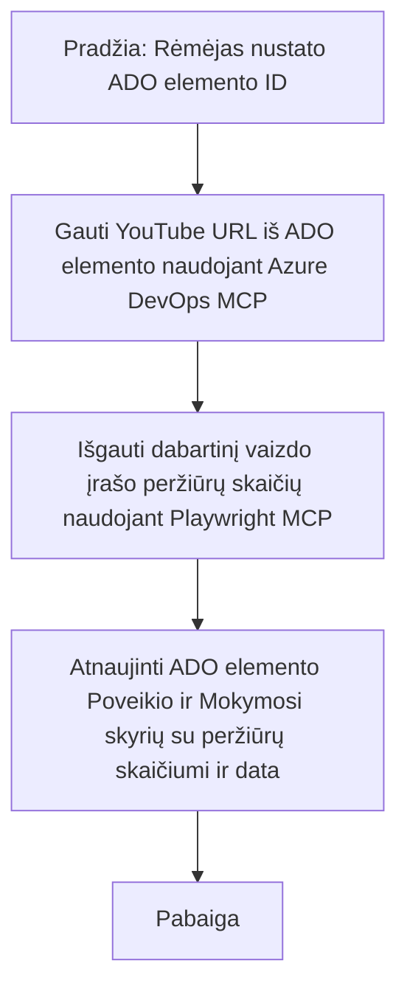

# Atvejo analizė: Azure DevOps elementų atnaujinimas iš „YouTube“ duomenų naudojant MCP

> **Atsakomybės apribojimas:** Yra esamų internetinių įrankių ir ataskaitų, kurie gali automatizuoti Azure DevOps elementų atnaujinimo procesą naudojant duomenis iš platformų, tokių kaip „YouTube“. Šis scenarijus pateikiamas tik kaip pavyzdinis naudojimo atvejis, siekiant iliustruoti, kaip MCP įrankiai gali būti taikomi automatizavimo ir integracijos užduotims.

## Apžvalga

Ši atvejo analizė demonstruoja vieną pavyzdį, kaip Model Context Protocol (MCP) ir jo įrankiai gali būti naudojami Azure DevOps (ADO) darbo elementų atnaujinimo proceso automatizavimui, naudojant informaciją iš internetinių platformų, tokių kaip „YouTube“. Aprašytas scenarijus yra tik viena iš šių įrankių plačių galimybių iliustracijų, kurią galima pritaikyti daugeliui panašių automatizavimo poreikių.

Šiame pavyzdyje Advokatas seka internetines sesijas naudodamas ADO elementus, kurių kiekvienas turi „YouTube“ vaizdo įrašo URL. Pasinaudodamas MCP įrankiais, Advokatas gali nuolat ir automatizuotai atnaujinti ADO elementus su naujausiais vaizdo įrašo rodmenimis, pvz., peržiūrų skaičiumi. Šis metodas gali būti apibendrintas ir pritaikytas kitais atvejais, kai reikia integruoti informaciją iš internetinių šaltinių į ADO ar kitas sistemas.

## Scenarijus

Advokatas yra atsakingas už internetinių sesijų ir bendruomenės įsitraukimų poveikio sekimą. Kiekviena sesija registruojama kaip ADO darbo elementas projekte „DevRel“, o darbo elemente yra laukas „YouTube“ vaizdo įrašo URL. Norėdamas tiksliai ataskaitoje parodyti sesijos pasiekiamumą, Advokatas turi atnaujinti ADO elementą su dabartiniu vaizdo įrašo peržiūrų skaičiumi ir data, kada ši informacija buvo gauta.

## Naudojami įrankiai

- [Azure DevOps MCP](https://github.com/microsoft/azure-devops-mcp): Leidžia programiškai pasiekti ir atnaujinti ADO darbo elementus per MCP.
- [Playwright MCP](https://github.com/microsoft/playwright-mcp): Automatizuoja naršyklės veiksmus, kad būtų galima išgauti tiesioginius duomenis iš tinklalapių, tokių kaip „YouTube“ vaizdo įrašų statistika.

## Žingsnis po žingsnio darbo eiga

1. **Identifikuoti ADO elementą**: Pradėti nuo ADO darbo elemento ID (pvz., 1234) projekte „DevRel“.
2. **Gauti „YouTube“ URL**: Naudoti Azure DevOps MCP įrankį norint pasiimti „YouTube“ URL iš darbo elemento.
3. **Išgauti vaizdo įrašo peržiūras**: Naudoti Playwright MCP įrankį pereiti į „YouTube“ URL ir išgauti dabartinį peržiūrų skaičių.
4. **Atnaujinti ADO elementą**: Įrašyti naujausią peržiūrų skaičių ir gavimo datą į ADO darbo elemento skyrių „Impact and Learnings“, naudojant Azure DevOps MCP įrankį.

## Pavyzdinis užklausos tekstas

```bash
- Work with the ADO Item ID: 1234
- The project is '2025-Awesome'
- Get the YouTube URL for the ADO item
- Use Playwright to get the current views from the YouTube video
- Update the ADO item with the current video views and the updated date of the information
```

## Mermaid diagramų schema


## Techninis įgyvendinimas

- **MCP Orkestravimas**: Darbo eiga yra koordinuojama MCP serverio, kuris valdo Azure DevOps MCP ir Playwright MCP įrankių naudojimą.
- **Automatizavimas**: Procesas gali būti paleidžiamas rankiniu būdu arba suplanuotas veikti reguliariais intervalais, kad ADO elementai būtų nuolat atnaujinami.
- **Išplečiamumas**: Tą patį modelį galima praplėsti, kad būtų atnaujinami ADO elementai su kitomis internetinėmis metrikomis (pvz., patiktukai, komentarai) arba iš kitų platformų.

## Rezultatai ir poveikis

- **Efektyvumas**: Mažina Advokatų rankinį darbą, automatizuodamas vaizdo įrašų metrikų gavimą ir atnaujinimą.
- **Tikslumas**: Užtikrina, kad ADO elementai atspindėtų naujausią duomenų versiją iš internetinių šaltinių.
- **Pakartojamumas**: Suteikia pakartotinai naudojamą darbo eigą panašiems scenarijams, kai reikia naudoti kitus duomenų šaltinius ar metrikas.

## Nuorodos

- [Azure DevOps MCP](https://github.com/microsoft/azure-devops-mcp)
- [Playwright MCP](https://github.com/microsoft/playwright-mcp)
- [Model Context Protocol (MCP)](https://modelcontextprotocol.io/)

## Kas toliau

- Grįžti į: [Atvejų analizių apžvalga](./README.md)
- Kitas: [Realaus laiko dokumentų gavimas su MCP](./docs-mcp/README.md)

---

<!-- CO-OP TRANSLATOR DISCLAIMER START -->
**Atsakomybės atsisakymas**:  
Šis dokumentas buvo išverstas naudojant AI vertimo paslaugą [Co-op Translator](https://github.com/Azure/co-op-translator). Nors siekiame tikslumo, atkreipkite dėmesį, kad automatizuoti vertimai gali turėti klaidų ar netikslumų. Originalus dokumentas jo gimtąja kalba turėtų būti laikomas pagrindiniu šaltiniu. Kritinei informacijai rekomenduojame naudoti profesionalaus žmogaus vertimą. Mes neatsakome už jokius nesusipratimus ar neteisingus aiškinimus, kylančius dėl šio vertimo naudojimo.
<!-- CO-OP TRANSLATOR DISCLAIMER END -->