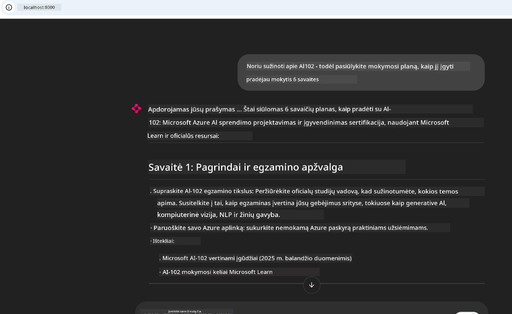
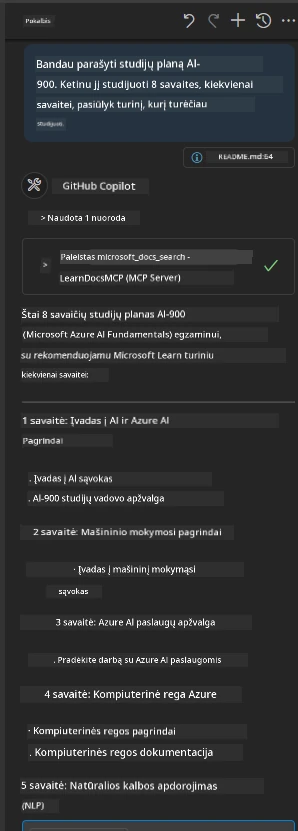

# Atvejo analizė: prisijungimas prie Microsoft Learn Docs MCP serverio iš kliento

Ar kada nors teko šokinėti tarp dokumentacijos svetainių, Stack Overflow ir begalės paieškos variklių skirtukų, tuo pačiu bandant išspręsti problemą savo kode? Galbūt turi antrą monitorių tik dokumentacijai arba nuolatos keiti langus tarp IDE ir naršyklės. Ar negeriau būtų, jei dokumentacija būtų tiesiai tavo darbo eigoje – integruota į tavo programas, IDE ar net tavo pačių sukurtus įrankius? Šioje atvejo analizėje apžvelgsime, kaip tai padaryti prisijungiant tiesiogiai prie Microsoft Learn Docs MCP serverio iš savo kliento programos.

## Apžvalga

Moderni plėtra yra ne tik kodo rašymas – tai tinkamos informacijos radimas tinkamu metu. Dokumentacija yra visur, tačiau retai ten, kur jos labiausiai reikia: tavo įrankiuose ir darbo procesuose. Integravus dokumentacijos gavimą tiesiogiai į programas, galima sutaupyti laiko, sumažinti konteksto keitimą ir padidinti produktyvumą. Šioje dalyje parodysime, kaip prijungti klientą prie Microsoft Learn Docs MCP serverio, kad galėtum prieiti prie realaus laiko, kontekstui pritaikytos dokumentacijos neišeidamas iš savo programos.

Pažingsniui pereisime per ryšio užmezgimo procesą, užklausos siuntimą ir efektyvų srautinio atsakymo apdorojimą. Šis metodas ne tik supaprastina darbo eigą, bet ir atveria duris kurti protingesnius, naudingesnius kūrėjų įrankius.

## Mokymosi tikslai

Kodėl tai darome? Nes geriausios kūrėjo patirtys yra tos, kurios pašalina trintį. Įsivaizduok pasaulį, kuriame tavo kodo redaktorius, pokalbių robotas ar žiniatinklio programa gali akimirksniu atsakyti į dokumentacijos klausimus, naudodami naujausią turinį iš Microsoft Learn. Skaitydamas šį skyrių tu:

- Suprasies MCP serverio-kliento komunikacijos pagrindus dokumentacijai
- Įgyvendinsi konsolinę ar web- programą, jungiamą prie Microsoft Learn Docs MCP serverio
- Naudosi srautinio HTTP kliento technologiją realaus laiko dokumentacijos gavimui
- Fiksuosi ir interpretuosi dokumentacijos atsakymus savo programoje

Sužinosi, kaip šie įgūdžiai padės kurti įrankius, kurie yra ne tik reaktyvūs, bet ir tikrai interaktyvūs bei kontekstui pritaikyti.

## Scenario 1 – realaus laiko dokumentacijos gavimas su MCP

Šiame scenarijuje parodysime, kaip prijungti klientą prie Microsoft Learn Docs MCP serverio, kad galėtum prieiti prie realaus laiko, kontekstui pritaikytos dokumentacijos neišeidamas iš savo programos.

Pradėkime praktikuotis. Tavo užduotis – parašyti programą, kuri prisijungia prie Microsoft Learn Docs MCP serverio, iškviečia `microsoft_docs_search` įrankį ir fiksuoja srautinius atsakymus konsolėje.

### Kodėl šis metodas?
Nes tai pagrindas kurti pažangesnes integracijas – ar tai būtų pokalbių robotas, IDE plėtinys, ar web valdymo skydelis.

Šio scenarijaus kodą ir instrukcijas rasi [`solution`](./solution/README.md) kataloge šiame atvejo analize. Žingsniai parodys, kaip sukurti ryšį:
- Naudoti oficialų MCP SDK ir srautinį HTTP klientą ryšiui
- Kviesti `microsoft_docs_search` įrankį su užklausos parametru dokumentacijai gauti
- Įdiegti tinkamą žurnalo fiksavimą ir klaidų valdymą
- Sukurti interaktyvią konsolės sąsają vartotojams įvesti kelias paieškos užklausas

Šis scenarijus demonstruoja, kaip:
- Prisijungti prie Docs MCP serverio
- Išsiųsti užklausą
- Išanalizuoti ir atspausdinti rezultatus

Štai kaip gali atrodyti sprendimo paleidimas:

```
Prompt> What is Azure Key Vault?
Answer> Azure Key Vault is a cloud service for securely storing and accessing secrets. ...
```

Žemiau pateiktas minimalus pavyzdinis sprendimas. Visas kodas ir detalės yra sprendimo kataloge.

<details>
<summary>Python</summary>

```python
import asyncio
from mcp.client.streamable_http import streamablehttp_client
from mcp import ClientSession

async def main():
    async with streamablehttp_client("https://learn.microsoft.com/api/mcp") as (read_stream, write_stream, _):
        async with ClientSession(read_stream, write_stream) as session:
            await session.initialize()
            result = await session.call_tool("microsoft_docs_search", {"query": "Azure Functions best practices"})
            print(result.content)

if __name__ == "__main__":
    asyncio.run(main())
```

- Dėl pilnos įgyvendinimo ir žurnalo žymėjimo žr. [`scenario1.py`](../../../../09-CaseStudy/docs-mcp/solution/python/scenario1.py).
- Dėl diegimo ir naudojimo instrukcijų žr. [`README.md`](./solution/python/README.md) tą pačią katalogą.
</details>


## Scenario 2 – interaktyvi studijų plano generatoriaus web programa su MCP

Šiame scenarijuje išmoksite, kaip integruoti Docs MCP į web vystymo projektą. Tikslas – leisti vartotojams tiesiogiai iš web sąsajos ieškoti Microsoft Learn dokumentacijos, kad ji būtų akimirksniu prieinama tavo programoje ar svetainėje.

Sužinosi, kaip:
- Sukurti web programą
- Prisijungti prie Docs MCP serverio
- Apdoroti vartotojo įvestį ir pateikti rezultatus

Štai kaip gali atrodyti sprendimo paleidimas:

```
User> I want to learn about AI102 - so suggest the roadmap to get it started from learn for 6 weeks

Assistant> Here’s a detailed 6-week roadmap to start your preparation for the AI-102: Designing and Implementing a Microsoft Azure AI Solution certification, using official Microsoft resources and focusing on exam skills areas:

---
## Week 1: Introduction & Fundamentals
- **Understand the Exam**: Review the [AI-102 exam skills outline](https://learn.microsoft.com/en-us/credentials/certifications/exams/ai-102/).
- **Set up Azure**: Sign up for a free Azure account if you don't have one.
- **Learning Path**: [Introduction to Azure AI services](https://learn.microsoft.com/en-us/training/modules/intro-to-azure-ai/)
- **Focus**: Get familiar with Azure portal, AI capabilities, and necessary tools.

....more weeks of the roadmap...

Let me know if you want module-specific recommendations or need more customized weekly tasks!
```

Žemiau pateiktas minimalus pavyzdinis sprendimas. Visas kodas ir detalės yra sprendimo kataloge.



<details>
<summary>Python (Chainlit)</summary>

Chainlit yra karkasas pokalbių dirbtinio intelekto web programoms kurti. Jis leidžia lengvai sukurti interaktyvius robotus ir asistentus, kurie gali kviesti MCP įrankius ir realiu laiku rodyti rezultatus. Puikiai tinka greitam prototipų kūrimui ir draugiškoms vartotojo sąsajoms.

```python
import chainlit as cl
import requests

MCP_URL = "https://learn.microsoft.com/api/mcp"

@cl.on_message
def handle_message(message):
    query = {"question": message}
    response = requests.post(MCP_URL, json=query)
    if response.ok:
        result = response.json()
        cl.Message(content=result.get("answer", "No answer found.")).send()
    else:
        cl.Message(content="Error: " + response.text).send()
```

- Dėl pilnos įgyvendinimo žr. [`scenario2.py`](../../../../09-CaseStudy/docs-mcp/solution/python/scenario2.py).
- Dėl nustatymo ir paleidimo instrukcijų žr. [`README.md`](./solution/python/README.md).
</details>


## Scenario 3: dokumentacija redaktoriuje su MCP serveriu VS Code

Jei nori Microsoft Learn dokumentaciją gauti tiesiai VS Code (vietoje naršyklės skirtukų keitimo), gali naudoti MCP serverį savo redaktoriuje. Tai leidžia:
- Ieškoti ir skaityti dokumentaciją VS Code nepaliekant kodo kūrimo aplinkos
- Įterpti dokumentacijos nuorodas tiesiogiai README ar kursų failuose
- Derinti GitHub Copilot ir MCP sklandžiam, AI pagrindu veikiančiam dokumentacijos darbo procesui

**Sužinosi, kaip:**
- Įtraukti galiojantį `.vscode/mcp.json` failą į savo darbo srities šaknį (žr. žemiau pateiktą pavyzdį).
- Atidaryti MCP panelę arba naudoti komandų meniu VS Code paieškai ir įrašymui.
- Tiesiogiai nuorodinti dokumentaciją markdown failuose darbo metu.
- Derinti šį procesą su GitHub Copilot dar didesniam produktyvumui.

Pavyzdys, kaip nustatyti MCP serverį VS Code:

```json
{
  "servers": {
    "LearnDocsMCP": {
      "url": "https://learn.microsoft.com/api/mcp"
    }
  }
}
```

</details>

> Detalus žingsnis po žingsnio gidų ir ekrano kopijų rinkinys yra [`README.md`](./solution/scenario3/README.md).



Šis metodas puikiai tinka tiems, kas kuria techninius kursus, rašo dokumentaciją ar vysto kodą su dažnai reikalingomis nuorodomis.

## Svarbiausios išvados

Dokumentacijos integravimas tiesiogiai į tavo įrankius yra ne tik patogumas – tai produktyvumo žaidimo keitėjas. Prisijungęs prie Microsoft Learn Docs MCP serverio iš savo kliento, tu gali:

- Pašalinti konteksto keitimą tarp kodo ir dokumentacijos
- Gauti atnaujintą, kontekstui pritaikytą dokumentaciją realiu laiku
- Kurti protingesnius, interaktyvesnius kūrėjų įrankius

Šie įgūdžiai padės sukurti sprendimus, kurie yra ne tik efektyvūs, bet ir malonūs naudoti.

## Papildomi ištekliai

Gilink savo žinias šiais oficialiais šaltiniais:

- [Microsoft Learn Docs MCP Server (GitHub)](https://github.com/MicrosoftDocs/mcp)
- [Pradžia su Azure MCP Server (mcp-python)](https://learn.microsoft.com/en-us/azure/developer/azure-mcp-server/get-started#create-the-python-app)
- [Kas yra Azure MCP Server?](https://learn.microsoft.com/en-us/azure/developer/azure-mcp-server/)
- [Model Context Protocol (MCP) įvadas](https://modelcontextprotocol.io/introduction)
- [Kaip pridėti papildinius iš MCP serverio (Python)](https://learn.microsoft.com/en-us/semantic-kernel/concepts/plugins/adding-mcp-plugins)

## Kas toliau

- Grįžti į: [Atvejo analizės apžvalga](../README.md)
- Tęsti į: [Modulis 10: AI darbo eigų sklandinimas su AI Toolkit](../../10-StreamliningAIWorkflowsBuildingAnMCPServerWithAIToolkit/README.md)

---

<!-- CO-OP TRANSLATOR DISCLAIMER START -->
**Atsakomybės apribojimas**:  
Šis dokumentas buvo išverstas naudojant dirbtinio intelekto vertimo paslaugą [Co-op Translator](https://github.com/Azure/co-op-translator). Nors stengiamės užtikrinti tikslumą, prašome atkreipti dėmesį, kad automatiniai vertimai gali turėti klaidų arba netikslumų. Originalus dokumentas gimtąja kalba laikomas autoritetingu šaltiniu. Kritinei informacijai rekomenduojama naudoti profesionalų žmogaus vertimą. Mes neatsakome už bet kokius nesusipratimus ar klaidingus interpretavimus, kylančius dėl šio vertimo naudojimo.
<!-- CO-OP TRANSLATOR DISCLAIMER END -->