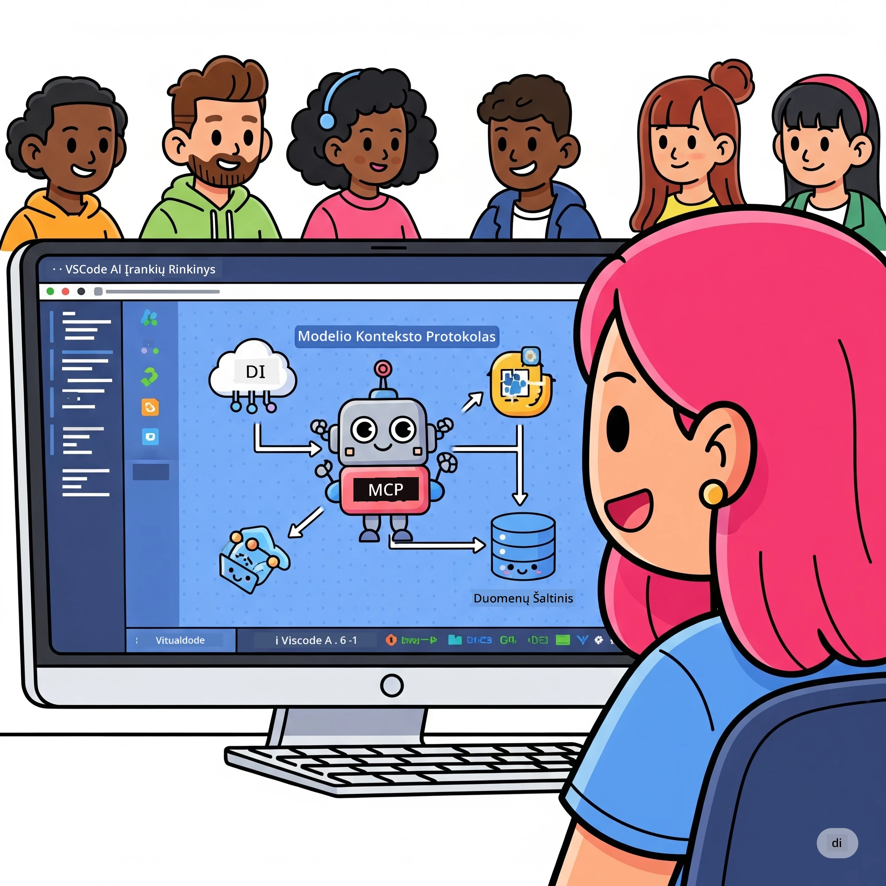
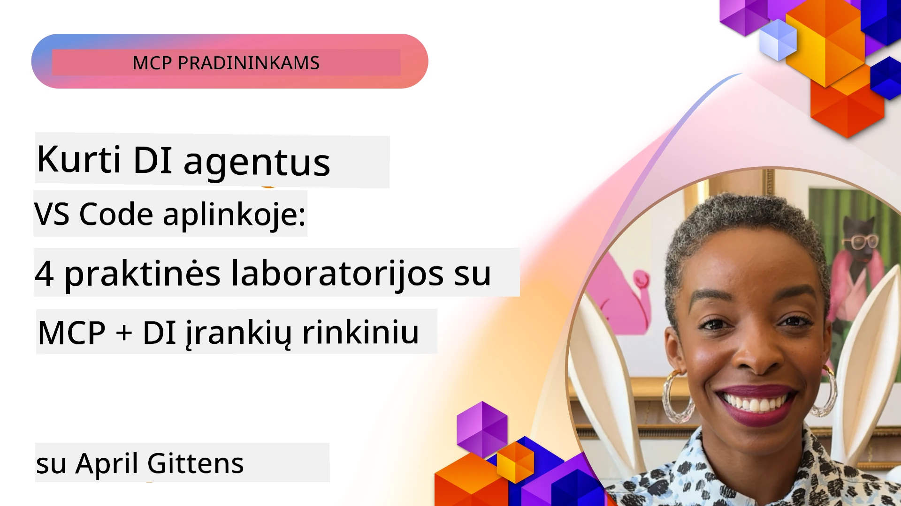

# Supaprastinant DI darbo eigas: kaip sukurti MCP serverį naudojant AI rinkinį

## 🎯 Apžvalga

_(Spustelėkite aukščiau esantį vaizdą norėdami peržiūrėti šios pamokos vaizdo įrašą)_

Sveiki atvykę į **Model Context Protocol (MCP) dirbtuves**! Šios išsamios praktinės dirbtuvės apjungia dvi pažangias technologijas, revoliucionizuojančias DI programų kūrimą:

- **🔗 Model Context Protocol (MCP)**: atviro standarto sprendimas sklandžiam DI įrankių sujungimui
- **🛠️ AI Toolkit for Visual Studio Code (AITK)**: Microsoft galingas DI kūrimo priedas

### 🎓 Ko Išmoksite

Šių dirbtuvių pabaigoje įvaldysite intelektualių programų kūrimą, kurios sujungia DI modelius su realaus pasaulio įrankiais ir paslaugomis. Nuo automatizuotų testų iki individualių API integracijų - įgisite praktinių įgūdžių spręsti sudėtingas verslo užduotis.

## 🏗️ Technologijų Rinkinys

### 🔌 Model Context Protocol (MCP)

MCP yra **„USB-C DI“** – universalus standartas, jungiantis DI modelius su išoriniais įrankiais ir duomenų šaltiniais.

**✨ Pagrindinės Savybės:**

- 🔄 **Standartizuotas sujungimas**: universalus DI įrankių prijungimo sąsajos protokolas
- 🏛️ **Lanksti architektūra**: vietiniai ir nuotoliniai serveriai per stdio/SSE transportą
- 🧰 **Turtinga ekosistema**: įrankiai, užklausos ir resursai viename protokole
- 🔒 **Verslui paruoštas**: integruotas saugumas ir patikimumas

**🎯 Kodėl MCP svarbus:**
Kaip USB-C panaikino laidų chaosą, taip MCP supaprastina DI integracijas. Vienas protokolas – begalinės galimybės.

### 🤖 AI Toolkit for Visual Studio Code (AITK)

Microsoft vėliavinė DI kūrimo plėtinys, paverčiantis VS Code į DI galiūną.

**🚀 Pagrindinės Galimybės:**

- 📦 **Modelių katalogas**: prieiga prie modelių iš Azure AI, GitHub, Hugging Face, Ollama
- ⚡ **Vietinė inferencija**: ONNX optimizuotas CPU/GPU/NPU vykdymas
- 🏗️ **Agentų kūrėjas**: vizualus DI agentų kūrimas su MCP integracija
- 🎭 **Daugiamodalis palaikymas**: tekstas, vaizdas ir struktūruotas išvestis

**💡 Kūrimo privalumai:**

- Modelių diegimas be konfigūracijos
- Vizualinė užklausų inžinerija
- Realaus laiko testavimo aikštelė
- Sklandi MCP serverių integracija

## 📚 Mokymosi kelias

### [🚀 Modulis 1: AI Toolkit pagrindai](./lab1/README.md)

**Trukmė**: 15 minučių

- 🛠️ Įdiegti ir sukonfigūruoti AI Toolkit VS Code aplinkoje
- 🗂️ Ištirti Modelių katalogą (100+ modelių iš GitHub, ONNX, OpenAI, Anthropic, Google)
- 🎮 Įvaldyti Interaktyvią aikštelę modelių testavimui realiu laiku
- 🤖 Sukurti pirmąjį DI agentą su Agentų kūrėju
- 📊 Įvertinti modelių veikimą su įtaisytomis metrikomis (F1, aktualumas, panašumas, nuoseklumas)
- ⚡ Išmokti masinio apdorojimo ir daugiamodalio palaikymo galimybes

**🎯 Mokymosi rezultatas**: Sukurti funkcinį DI agentą su išsamia AITK galimybių supratimu

### [🌐 Modulis 2: MCP ir AI Toolkit pagrindai](./lab2/README.md)

**Trukmė**: 20 minučių

- 🧠 Įsisavinti Model Context Protocol (MCP) architektūrą ir koncepcijas
- 🌐 Ištirti Microsoft MCP serverių ekosistemą
- 🤖 Sukurti naršyklės automatizavimo agentą naudojant Playwright MCP serverį
- 🔧 Integruoti MCP serverius su AI Toolkit Agentų kūrėju
- 📊 Konfigūruoti ir testuoti MCP įrankius savo agentuose
- 🚀 Eksportuoti ir diegti MCP palaikomus agentus gamybinėje aplinkoje

**🎯 Mokymosi rezultatas**: Diegti DI agentą, įkrautą išoriniais įrankiais per MCP

### [🔧 Modulis 3: Pažangus MCP vystymas su AI Toolkit](./lab3/README.md)

**Trukmė**: 20 minučių

- 💻 Kurti pasirinktinius MCP serverius naudojant AI Toolkit
- 🐍 Konfigūruoti ir naudoti naujausią MCP Python SDK (v1.9.3)
- 🔍 Paruošti ir naudoti MCP Inspector derinimui
- 🛠️ Sukurti Oro sąlygų MCP serverį su profesionaliomis derinimo darbo eigomis
- 🧪 Derinti MCP serverius tiek Agentų kūrėjo, tiek Inspector aplinkose

**🎯 Mokymosi rezultatas**: Vystyti ir derinti pasirinktinius MCP serverius su moderniais įrankiais

### [🐙 Modulis 4: Praktinis MCP vystymas – pasirinktinis GitHub klonavimo serveris](./lab4/README.md)

**Trukmė**: 30 minučių

- 🏗️ Kurti realaus pasaulio GitHub klonavimo MCP serverį vystymo darbams
- 🔄 Įgyvendinti išmanų repositorijų klonavimą su patikra ir klaidų valdymu
- 📁 Sukurti išmanų katalogų valdymą ir VS Code integraciją
- 🤖 Naudoti GitHub Copilot agento režimą su pasirinktinais MCP įrankiais
- 🛡️ Taikyti gamybos pasiruošimo patikimumą ir tarpplatforminį suderinamumą

**🎯 Mokymosi rezultatas**: Diegti gamybinio lygio MCP serverį, supaprastinantį tikras vystymo darbo eigas

## 💡 Realūs Panaudojimo Atvejai ir Įtaka

### 🏢 Verslo Naudojimo Scenarijai

#### 🔄 DevOps Automatizavimas

Transformuokite savo vystymo procesą intelektualia automatizacija:

- **Išmanusis repozitorijų valdymas**: DI pagrįsta kodo peržiūra ir sprendimai dėl sujungimų
- **Išmanusis CI/CD**: automatizuotas vamzdyno optimizavimas pagal kodo pakeitimus
- **Klaidų klasifikavimas**: automatinis klaidų identifikavimas ir priskyrimas

#### 🧪 Kokybės užtikrinimo revoliucija

Pakelkite testavimą DI varomomis automatizuotomis sistemomis:

- **Išmanus testų generavimas**: automatiškai kuriamos išsamios testavimo rinkinio versijos
- **Vizualinis regresinis testavimas**: DI pagrįstas UI pokyčių aptikimas
- **Veikimo stebėsena**: proaktyvus problemų nustatymas ir sprendimas

#### 📊 Duomenų srauto intelektas

Kurkite išmanesnes duomenų apdorojimo darbo eigas:

- **Adaptuojami ETL procesai**: automatiškai optimizuojami duomenų transformavimai
- **Anomalijų aptikimas**: realaus laiko duomenų kokybės stebėsena
- **Išmanus maršrutavimas**: protingas duomenų srauto valdymas

#### 🎧 Klientų patirties gerinimas

Sukurkite išskirtinę klientų sąveiką:

- **Konteksto suvokiantis palaikymas**: DI agentai su prieiga prie kliento istorijos
- **Proaktyvus problemų sprendimas**: prognozuojamas klientų aptarnavimas
- **Daugiakanalė integracija**: vieninga DI patirtis per įvairias platformas

## 🛠️ Reikalavimai ir Paruošimas

### 💻 Sistemos Reikalavimai

| Komponentas | Reikalavimas | Pastabos |
|-----------|-------------|-------|
| **Operacinė sistema** | Windows 10+, macOS 10.15+, Linux | Bet kuri šiuolaikinė OS |
| **Visual Studio Code** | Naujausia stabili versija | Būtina AITK |
| **Node.js** | v18.0+ ir npm | MCP serverių vystymui |
| **Python** | 3.10+ | Pasirinktinai Python MCP serveriams |
| **Atmintis** | minimaliai 8GB RAM | Rekomenduojama 16GB lokaliniams modeliams |

### 🔧 Vystymo Aplinka

#### Rekomenduojami VS Code plėtiniai

- **AI Toolkit** (ms-windows-ai-studio.windows-ai-studio)
- **Python** (ms-python.python)
- **Python Debugger** (ms-python.debugpy)
- **GitHub Copilot** (GitHub.copilot) – pasirinktinai, bet naudinga

#### Pasirinktiniai įrankiai

- **uv**: modernus Python paketų tvarkyklė
- **MCP Inspector**: vizualinis MCP serverių derinimo įrankis
- **Playwright**: interneto automatizavimo pavyzdžiams

## 🎖️ Mokymosi Rezultatai ir Sertifikavimo Kelias

### 🏆 Įgūdžių Pokomplektas

Užbaigus šias dirbtuves įvaldysite:

#### 🎯 Pagrindines Kompetencijas

- [ ] **MCP protokolo įvaldymas**: gilus architektūros ir įgyvendinimo modelių supratimas
- [ ] **AITK meistriškumas**: ekspertinis DI rinkinio naudojimas greitam kūrimui
- [ ] **Pasirinktinių serverių kūrimas**: MCP serverių statyba, diegimas ir palaikymas gamyboje
- [ ] **Įrankių integracijos meistriškumas**: sklandi DI sujungimas su esamomis vystymo eigomis
- [ ] **Probleminių sprendimų taikymas**: išmoktas įgūdžių pritaikymas realioms verslo užduotims

#### 🔧 Techniniai Įgūdžiai

- [ ] AI Toolkit konfigūracija VS Code
- [ ] Pasirinktinių MCP serverių kūrimas ir įdiegimas
- [ ] GitHub modelių integracija su MCP architektūra
- [ ] Automatizuotų testavimo darbo eigų kūrimas su Playwright
- [ ] DI agentų diegimas gamyboje
- [ ] MCP serverių derinimas ir optimizavimas

#### 🚀 Pažangios Galimybės

- [ ] Įmonių masto DI integracijų projektavimas
- [ ] Aukščiausių saugumo praktikų taikymas DI programose
- [ ] Skalės MCP serverių architektūrų kūrimas
- [ ] Pasirinktinių įrankių grandinių kūrimas specifinėms sritims
- [ ] Kitų mokymas DI natūraliojo vystymo srityje

## 📖 Papildomi Ištekliai

- [MCP specifikacija (2025-11-25)](https://spec.modelcontextprotocol.io/specification/2025-11-25/)
- [AI Toolkit GitHub saugykla](https://github.com/microsoft/vscode-ai-toolkit)
- [MCP serverių pavyzdžių kolekcija](https://github.com/modelcontextprotocol/servers)
- [Geriausios praktikos gidas](https://modelcontextprotocol.io/docs/best-practices)
- [OWASP MCP Top 10](https://microsoft.github.io/mcp-azure-security-guide/mcp/) – saugumo gerosios praktikos

---

**🚀 Pasiruošę revoliucionizuoti savo DI kūrimo procesą?**

Sukurkime protingų programų ateitį kartu su MCP ir AI Toolkit!

## Kas toliau

Tęskite: [Modulis 11: MCP serverio praktinės dirbtuvės](../11-MCPServerHandsOnLabs/README.md)

---

<!-- CO-OP TRANSLATOR DISCLAIMER START -->
**Atsakomybės apribojimas**:
Šis dokumentas buvo išverstas naudojant dirbtinio intelekto vertimo paslaugą [Co-op Translator](https://github.com/Azure/co-op-translator). Nors siekiame tikslumo, atkreipkite dėmesį, kad automatiniai vertimai gali turėti klaidų arba netikslumų. Originalus dokumentas gimtąja kalba turėtų būti laikomas autoritetingu šaltiniu. Esant svarbiai informacijai, rekomenduojamas profesionalus žmogiškas vertimas. Mes neatsakome už bet kokius nesusipratimus ar klaidingą interpretavimą, kylančius dėl šio vertimo naudojimo.
<!-- CO-OP TRANSLATOR DISCLAIMER END -->