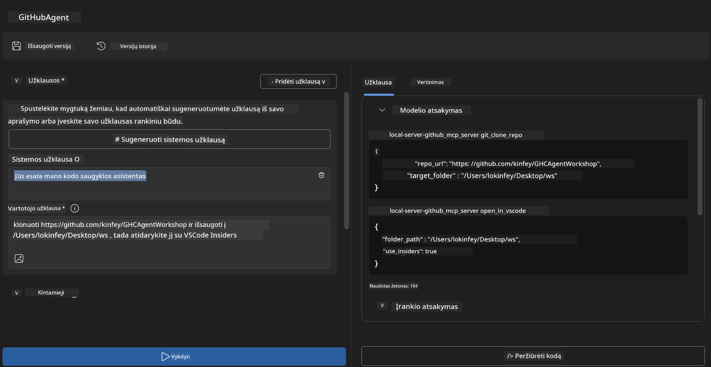
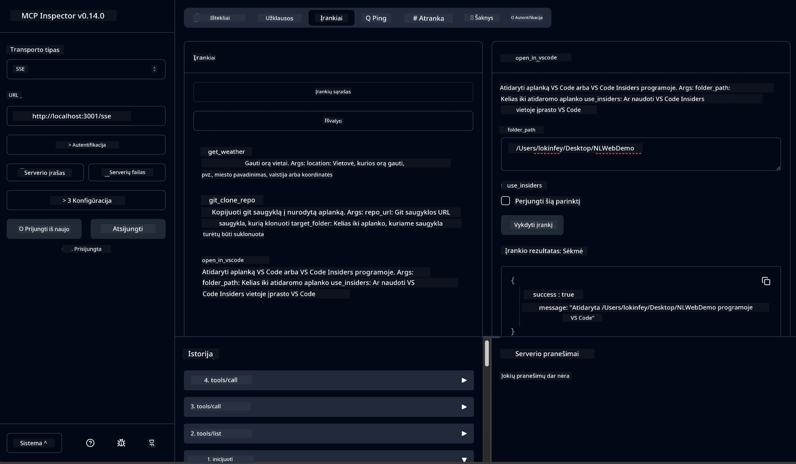

# 🐙 4 modulis: Praktinis MCP kūrimas - Individualus GitHub klono serveris


> **⚡ Greitas pradėjimas:** Sukurkite gamybai paruoštą MCP serverį, kuris automatiškai klonuos GitHub saugyklas ir integruos jas su VS Code vos per 30 minučių!

## 🎯 Mokymosi tikslai

Šio laboratorinio darbo pabaigoje sugebėsite:

- ✅ Sukurti individualų MCP serverį tikroms kūrimo darbo eigoms
- ✅ Įgyvendinti GitHub saugyklų klonavimo funkcionalumą per MCP
- ✅ Integruoti individualius MCP serverius su VS Code ir Agent Builder
- ✅ Naudoti GitHub Copilot Agent režimą su individualiais MCP įrankiais
- ✅ Testuoti ir diegti individualius MCP serverius gamybos aplinkose

## 📋 Reikalavimai

- Įvykdyti laboratorinius darbus 1-3 (MCP pagrindai ir pažangesnis kūrimas)
- GitHub Copilot prenumerata ([galima užsiregistruoti nemokamai](https://github.com/github-copilot/signup))
- VS Code su AI Toolkit ir GitHub Copilot plėtiniais
- Įdiegta ir sukonfigūruota Git komandinės eilutės sąsaja

## 🏗️ Projekto apžvalga

### **Tikro pasaulio kūrimo iššūkis**  
Kaip kūrėjai, dažnai naudojame GitHub, norėdami klonuoti saugyklas ir atidaryti jas VS Code arba VS Code Insiders. Šis rankinis procesas apima:
1. Terminalo/komandinės eilutės atidarymą  
2. Navigavimą į norimą katalogą  
3. `git clone` komandos vykdymą  
4. VS Code atidarymą klonuotame kataloge  

**Mūsų MCP sprendimas tai apjungia į vieną protingą komandą!**

### **Ką sukursite**  
**GitHub klono MCP serverį** (`git_mcp_server`), kuris suteiks:

| Funkcija | Aprašymas | Privalumas |
|---------|-------------|---------|
| 🔄 **Išmanus saugyklos klonavimas** | Klonuoti GitHub saugyklas su patikra | Automatizuotas klaidų tikrinimas |
| 📁 **Išmanus katalogų valdymas** | Patikrina ir saugiai kuria katalogus | Užkerta kelią perrašymui |
| 🚀 **Kryžminė platforma VS Code integracija** | Atidaro projektus VS Code/Insiders | Sklandus darbo eigos perėjimas |
| 🛡️ **Patikima klaidų tvarka** | Tvarko tinklo, leidimų ir kelių problemas | Gamybai paruošta patikimumas |

---

## 📖 Žingsnis po žingsnio įgyvendinimas

### 1 žingsnis: Sukurkite GitHub agentą Agent Builder

1. **Paleiskite Agent Builder** per AI Toolkit plėtinį  
2. **Sukurkite naują agentą** su šia konfigūracija:  
   ```
   Agent Name: GitHubAgent
   ```
  
3. **Inicializuokite individualų MCP serverį:**  
   - Eikite į **Tools** → **Add Tool** → **MCP Server**  
   - Pasirinkite **"Create A new MCP Server"**  
   - Pasirinkite **Python šabloną** didžiausiam lankstumui  
   - **Serverio pavadinimas:** `git_mcp_server`

### 2 žingsnis: Konfigūruokite GitHub Copilot Agent režimą

1. **Atidarykite GitHub Copilot** VS Code (Ctrl/Cmd + Shift + P → "GitHub Copilot: Open")  
2. **Pasirinkite Agent modelį** Copilot sąsajoje  
3. **Pasirinkite Claude 3.7 modelį** geresniam loginio mąstymo palaikymui  
4. **Įjunkite MCP integraciją** įrankių prieigai  

> **💡 Patarimas:** Claude 3.7 geriau supranta kūrimo darbo eigos ir klaidų tvarkymo šablonus.

### 3 žingsnis: Įgyvendinkite pagrindinį MCP serverio funkcionalumą

**Naudokite šį išsamų užklausos šabloną su GitHub Copilot Agent režimu:**  

```
Create two MCP tools with the following comprehensive requirements:

🔧 TOOL A: clone_repository
Requirements:
- Clone any GitHub repository to a specified local folder
- Return the absolute path of the successfully cloned project
- Implement comprehensive validation:
  ✓ Check if target directory already exists (return error if exists)
  ✓ Validate GitHub URL format (https://github.com/user/repo)
  ✓ Verify git command availability (prompt installation if missing)
  ✓ Handle network connectivity issues
  ✓ Provide clear error messages for all failure scenarios

🚀 TOOL B: open_in_vscode
Requirements:
- Open specified folder in VS Code or VS Code Insiders
- Cross-platform compatibility (Windows/Linux/macOS)
- Use direct application launch (not terminal commands)
- Auto-detect available VS Code installations
- Handle cases where VS Code is not installed
- Provide user-friendly error messages

Additional Requirements:
- Follow MCP 1.9.3 best practices
- Include proper type hints and documentation
- Implement logging for debugging purposes
- Add input validation for all parameters
- Include comprehensive error handling
```
  
### 4 žingsnis: Testuokite savo MCP serverį

#### 4a. Testavimas Agent Builder

1. **Paleiskite derinimo konfigūraciją** Agent Builder  
2. **Sukonfigūruokite savo agentą su šiuo sistemos užklausa:**  

```
SYSTEM_PROMPT:
You are my intelligent coding repository assistant. You help developers efficiently clone GitHub repositories and set up their development environment. Always provide clear feedback about operations and handle errors gracefully.
```
  
3. **Testuokite su realiomis naudotojų situacijomis:**  

```
USER_PROMPT EXAMPLES:

Scenario : Basic Clone and Open
"Clone {Your GitHub Repo link such as https://github.com/kinfey/GHCAgentWorkshop
 } and save to {The global path you specify}, then open it with VS Code Insiders"
```
  


**Laukiami rezultatai:**  
- ✅ Sėkmingas klonavimas su kelio patvirtinimu  
- ✅ Automatinis VS Code paleidimas  
- ✅ Aiškios klaidų žinutės negaliojantiems atvejams  
- ✅ Teisingas kampinių atvejų valdymas

#### 4b. Testavimas MCP Inspector



---

**🎉 Sveikinimai!** Sėkmingai sukūrėte praktišką, gamybai paruoštą MCP serverį, kuris sprendžia realius kūrimo darbo eigos iššūkius. Jūsų individualus GitHub klono serveris demonstruoja MCP galią automatizuojant ir gerinant kūrėjų produktyvumą.

### 🏆 Pasiekimai:  
- ✅ **MCP kūrėjas** - sukurtas individualus MCP serveris  
- ✅ **Darbo eigos automatizatorius** - supaprastintos kūrimo procedūros  
- ✅ **Integracijos ekspertas** - sujungti keli kūrimo įrankiai  
- ✅ **Gamybai paruoštas** - sukurti sprendimai diegimui

---

## 🎓 Workshop pabaiga: Jūsų kelionė su Model Context Protocol

**Gerbiamas workshop dalyvi,**

Sveikiname baigus Model Context Protocol keturis modulius! Jūs žengėte ilgą kelią nuo AI Toolkit pagrindų supratimo iki gamybai paruoštų MCP serverių kūrimo, sprendžiančių tikrus kūrimo iššūkius.

### 🚀 Jūsų mokymosi kelias:

**[1 modulis](../lab1/README.md)**: Pradėjote tyrinėti AI Toolkit pagrindus, modelių testavimą ir sukūrėte pirmąjį AI agentą.

**[2 modulis](../lab2/README.md)**: Išmokote MCP architektūrą, integravote Playwright MCP ir sukūrėte pirmąjį naršyklės automatizavimo agentą.

**[3 modulis](../lab3/README.md)**: Pažengėte individualių MCP serverių kūrime su Weather MCP serveriu ir įvaldėte derinimo įrankius.

**[4 modulis](../lab4/README.md)**: Dabar taikote viską, kad sukurtumėte praktišką GitHub saugyklų darbo eigos automatizavimo įrankį.

### 🌟 Ko išmokote:

- ✅ **AI Toolkit ekosistema**: modeliai, agentai ir integravimo modeliai  
- ✅ **MCP architektūra**: klientas-serveris dizainas, transportavimo protokolai, saugumas  
- ✅ **Kūrėjo įrankiai**: nuo Playground iki Inspector ir gamybos diegimo  
- ✅ **Individualus kūrimas**: MCP serverių kūrimas, testavimas ir diegimas  
- ✅ **Praktinės taikymai**: realių darbo eigos problemų sprendimas panaudojant AI

### 🔮 Jūsų kiti žingsniai:

1. **Sukurkite savo MCP serverį**: taikykite įgūdžius savo unikalioms darbo eigoms automatizuoti  
2. **Prisijunkite prie MCP bendruomenės**: dalinkitės savo kūriniais ir mokykitės iš kitų  
3. **Tyrinėkite pažangią integraciją**: jungkite MCP serverius su įmonių sistemomis  
4. **Prisidėkite prie atviro kodo**: padėkite tobulinti MCP įrankius ir dokumentaciją

Prisiminkite, šis workshopas yra tik pradžia. Model Context Protocol ekosistema greitai tobulėja, o jūs dabar esate pasiruošę būti AI paremto kūrimo įrankių priešakyje.

**Dėkojame už jūsų dalyvavimą ir mokymosi atsidavimą!**

Tikimės, kad šis seminaras įkvėpė idėjų, kurios pakeis, kaip kuriate ir naudojatės AI įrankiais savo kūrimo kelionėje.

**Sėkmės programuojant!**

---

## Kas toliau

Sveikiname baigus visus laboratorinius darbus 10 modulyje!  

- Grįžti į: [10 modulio apžvalga](../README.md)  
- Tęsti į: [11 modulis: MCP serverio praktinės laboratorijos](../../11-MCPServerHandsOnLabs/README.md)

---

<!-- CO-OP TRANSLATOR DISCLAIMER START -->
**Atsakomybės atsisakymas**:  
Šis dokumentas buvo išverstas naudojant dirbtinio intelekto vertimo paslaugą [Co-op Translator](https://github.com/Azure/co-op-translator). Nors stengiamės užtikrinti tikslumą, atkreipkite dėmesį, kad automatiniai vertimai gali turėti klaidų ar netikslumų. Originalus dokumentas jo gimtąja kalba laikomas autoritetingu šaltiniu. Svarbiai informacijai rekomenduojama pasitelkti profesionalų žmogišką vertimą. Mes neatsakome už jokius nesusipratimus ar neteisingus interpretavimus, kylančius iš šio vertimo naudojimo.
<!-- CO-OP TRANSLATOR DISCLAIMER END -->