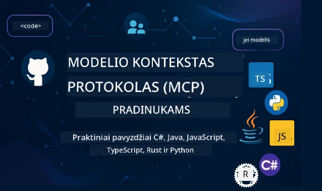

 

[](https://GitHub.com/microsoft/mcp-for-beginners/graphs/contributors)
[](https://GitHub.com/microsoft/mcp-for-beginners/issues)
[](https://GitHub.com/microsoft/mcp-for-beginners/pulls)
[](http://makeapullrequest.com)

[](https://GitHub.com/microsoft/mcp-for-beginners/watchers)
[](https://GitHub.com/microsoft/mcp-for-beginners/fork)
[](https://GitHub.com/microsoft/mcp-for-beginners/stargazers)


[](https://discord.gg/nTYy5BXMWG)

Atlikite šiuos veiksmus, kad pradėtumėte naudotis šiomis ištekliais:
1. **Padarykite sau atšaką (Fork the Repository)**: Spauskite [](https://GitHub.com/microsoft/mcp-for-beginners/fork)
2. **Klonuokite sau saugyklą (Clone the Repository)**:   `git clone https://github.com/microsoft/mcp-for-beginners.git`
3. **Prisijunkite prie** [](https://discord.gg/nTYy5BXMWG)


### 🌐 Daugiakalbė Parama

#### Palaikoma per GitHub Action (Automatizuota ir visada atnaujinta)

<!-- CO-OP TRANSLATOR LANGUAGES TABLE START -->
[Arabų](../ar/README.md) | [Bengalų](../bn/README.md) | [Bulgarių](../bg/README.md) | [Birmos (Myanmar)](../my/README.md) | [Kinų (supaprastinta)](../zh-CN/README.md) | [Kinų (tradicinė, Honkongas)](../zh-HK/README.md) | [Kinų (tradicinė, Makao)](../zh-MO/README.md) | [Kinų (tradicinė, Taivanas)](../zh-TW/README.md) | [Kroatų](../hr/README.md) | [Čekų](../cs/README.md) | [Danų](../da/README.md) | [Olandų](../nl/README.md) | [Estų](../et/README.md) | [Suomių](../fi/README.md) | [Prancūzų](../fr/README.md) | [Vokiečių](../de/README.md) | [Graikų](../el/README.md) | [Hebrajų](../he/README.md) | [Hindi](../hi/README.md) | [Vengrų](../hu/README.md) | [Indoneziečių](../id/README.md) | [Italų](../it/README.md) | [Japonų](../ja/README.md) | [Kannada](../kn/README.md) | [Korėjiečių](../ko/README.md) | [Lietuvių](./README.md) | [Malajiečių](../ms/README.md) | [Malajalių](../ml/README.md) | [Marati](../mr/README.md) | [Nepaliečių](../ne/README.md) | [Nigerijos pidžino](../pcm/README.md) | [Norvegų](../no/README.md) | [Persų (Farsi)](../fa/README.md) | [Lenkų](../pl/README.md) | [Portugalų (Brazilija)](../pt-BR/README.md) | [Portugalų (Portugalija)](../pt-PT/README.md) | [Pandžabų (Gurmukhi)](../pa/README.md) | [Rumunų](../ro/README.md) | [Rusų](../ru/README.md) | [Serbų (kirilica)](../sr/README.md) | [Slovakų](../sk/README.md) | [Slovėnų](../sl/README.md) | [Ispanų](../es/README.md) | [Svarili](../sw/README.md) | [Švedų](../sv/README.md) | [Tagalogų (Filipinų)](../tl/README.md) | [Tamilų](../ta/README.md) | [Telugų](../te/README.md) | [Tajų](../th/README.md) | [Turkų](../tr/README.md) | [Ukrainiečių](../uk/README.md) | [Urdu](../ur/README.md) | [Vietnamiečių](../vi/README.md)

> **Norite klonuoti vietoje?**
>
> Šiame saugykloje yra daugiau nei 50 kalbų vertimų, kas žymiai padidina atsisiuntimo dydį. Norėdami klonuoti be vertimų, naudokite sparse checkout:
>
> **Bash / macOS / Linux:**
> ```bash
> git clone --filter=blob:none --sparse https://github.com/microsoft/mcp-for-beginners.git
> cd mcp-for-beginners
> git sparse-checkout set --no-cone '/*' '!translations' '!translated_images'
> ```
>
> **CMD (Windows):**
> ```cmd
> git clone --filter=blob:none --sparse https://github.com/microsoft/mcp-for-beginners.git
> cd mcp-for-beginners
> git sparse-checkout set --no-cone "/*" "!translations" "!translated_images"
> ```
>
> Tai suteikia jums viską, ko reikia kursui užbaigti, žymiai greičiau atsisiunčiant.
<!-- CO-OP TRANSLATOR LANGUAGES TABLE END -->

# 🚀 Modelio konteksto protokolo (MCP) mokymo programa pradedantiesiems

## **Išmokite MCP su praktiniais kodų pavyzdžiais C#, Java, JavaScript, Rust, Python ir TypeScript kalbomis**

## 🧠 Modelio konteksto protokolo mokymo programos apžvalga
Sveiki atvykę į savo kelionę Modelio konteksto protokolo pasaulyje! Jei kada nors domėjotės, kaip DI (dirbtinio intelekto) programos bendrauja su skirtingais įrankiais ir paslaugomis, jūs netrukus atrasite elegantišką sprendimą, kuris keičia tai, kaip kūrėjai kuria išmaniąsias sistemas.

Įsivaizduokite MCP kaip universalų vertėją DI programoms – taip kaip USB prievadai leidžia prijungti bet kokį įrenginį prie jūsų kompiuterio, MCP leidžia DI modeliams prisijungti prie bet kokio įrankio ar paslaugos standartizuotu būdu. Nesvarbu, ar kuriate savo pirmąjį pokalbių robotą, ar dirbate su sudėtingais DI srautais, MCP supratimas suteiks jums galimybę kurti galingesnes ir lanksčias programas.

Ši mokymo programa sukurta kantriai ir rūpestingai, atsižvelgiant į jūsų mokymosi kelią. Pradėsime nuo paprastų koncepcijų, kurias jūs jau suprantate, ir palaipsniui plėsime jūsų žinias per praktinius užsiėmimus jūsų mėgstama programavimo kalba. Kiekviename žingsnyje rasite aiškius paaiškinimus, praktinius pavyzdžius ir daug skatinimo.

Baigę šią kelionę, turėsite pasitikėjimą kurdami savo MCP serverius, integruodami juos su populiariomis DI platformomis ir suprasdami, kaip ši technologija keičia DI kūrimo ateitį. Pradėkime šią įdomią kelionę kartu!

### Oficialioji dokumentacija ir specifikacijos

Ši mokymo programa suderinta su **MCP specifikacija 2025-11-25** (naujausia stabili versija). MCP specifikacijoje naudojamas datos pagrindu pagrįstas versijavimas (YYYY-MM-DD formatas) užtikrina aiškų protokolo versijos sekimą.

Šie ištekliai taps vertingesni augant jūsų supratimui, tačiau nesijaudinkite, kad turite viską iš karto perskaityti. Pradėkite nuo sričių, kurios jūs labiausiai domina!  
- 📘 [MCP dokumentacija](https://modelcontextprotocol.io/) – tai jūsų pagrindinis šaltinis žingsnis po žingsnio mokymosi vadovams ir vartotojų gidams. Dokumentacija parašyta galvojant apie pradedančiuosius, pateikdama aiškius pavyzdžius, kuriuos galite sekti savo tempu.  
- 📜 [MCP specifikacija](https://modelcontextprotocol.io/specification/2025-11-25) – tai visapusiškas nuorodinis vadovas. Dirbdami su mokymo programa, dažnai čia sugrįšite patikrinti specifinius dalykus ir išnagrinėti pažangias funkcijas.  
- 📜 [MCP specifikacijos versijavimas](https://modelcontextprotocol.io/specification/versioning) – čia rasite informaciją apie protokolo versijų istoriją ir kaip MCP naudoja datos pagrindu pagrįstą versijavimą (YYYY-MM-DD formatas).  
- 🧑‍💻 [MCP GitHub saugykla](https://github.com/modelcontextprotocol) – čia rasite SDK, įrankius ir kodo pavyzdžius keliomis programavimo kalbomis. Tai tarsi lobynas praktinių pavyzdžių ir paruoštų komponentų naudojimui.  
- 🌐 [MCP bendruomenė](https://github.com/orgs/modelcontextprotocol/discussions) – jungkitės su kitais besimokančiais ir patyrusiais kūrėjais diskusijose apie MCP. Tai draugiška bendruomenė, kur klausimai yra laukiami, o žinios laisvai dalijamos.  

## Mokymosi tikslai

Baigę šią mokymo programą, jausitės pasitikintys ir entuziastingi dėl naujų gebėjimų. Štai ką jūs pasieksite:

• **Suprasti MCP pagrindus**: Suprasite, kas yra Modelio konteksto protokolas ir kodėl jis keičia DI programų bendradarbiavimą, naudodami aiškias analogijas ir suprantamus pavyzdžius.

• **Sukurti savo pirmą MCP serverį**: Kuriantį veikiantį MCP serverį savo pasirinkta programavimo kalba, pradėdami nuo paprastų pavyzdžių ir palaipsniui tobulindami įgūdžius.

• **Prisijungti DI modelius prie realių įrankių**: Išmoksite perkelti DI modelius prie tikrų paslaugų, suteikdami savo programoms naujų galingų galimybių.

• **Įdiegti saugumo gerąsias praktikas**: Suprasite, kaip užtikrinti savo MCP įgyvendinimų saugumą, saugodami tiek programas, tiek vartotojus.

• **Diegti pasitikint savimi**: Suprasite, kaip vykdyti MCP projektus nuo kūrimo iki gamybos, naudodami realiame pasaulyje veikiančias diegimo strategijas.

• **Prisijungti prie MCP bendruomenės**: Tapsite augančios kūrėjų bendruomenės nariu, formuojančios DI programų kūrimo ateitį.

## Svarbūs pagrindai

Prieš gilindamiesi į MCP specifiką, įsitikinkime, kad jau jaučiatės patogiai su kai kuriomis pagrindinėmis sąvokomis. Nesijaudinkite, jei nesate šiose srityse ekspertas – paaiškinsime viską, ką turite žinoti!

### Protokolų supratimas (Pagrindas)

Įsivaizduokite protokolą kaip pokalbio taisykles. Kai skambinate draugui, abu žinote, kad reikia pasakyti „labas“ atsakant, kalbėti paeiliui ir pabaigai tarti „viso gero“. Kompiuterinės programos taip pat turi turėti panašias taisykles, kad galėtų efektyviai bendrauti.

MCP yra protokolas – sutartų taisyklių rinkinys, kuris padeda DI modeliams ir programoms produktyviai „kalbėti“ su įrankiais ir paslaugomis. Kaip taisyklingas pokalbis pagerina žmonių bendravimą, taip MCP daro DI programų komunikaciją daug patikimesnę ir galingesnę.

### Klientų ir serverių santykiai (Kaip programos bendradarbiauja)

Jau kasdien naudojate klientų-serverių santykius! Kai naudojate interneto naršyklę (klientą) apsilankymui svetainėje, jungiatės prie interneto serverio, kuris siųs puslapio turinį. Naršyklė žino, kaip užklausti informacijos, o serveris – kaip atsakyti.

MCP turi panašų santykį: DI modeliai yra klientai, kurie prašo informacijos ar veiksmų, o MCP serveriai suteikia šias galimybes. Tai tarsi turėti naudingą padėjėją (serverį), kuriam DI gali pavesti atlikti konkrečias užduotis.

### Kodėl standartizacija svarbi (Kad viskas veiktų kartu)

Įsivaizduokite, kad kiekvienas automobilių gamintojas naudotų skirtingos formos kuro pistoletus – reikėtų skirtingo adapterio kiekvienam automobiliui! Standartizacija reiškia sutarimą dėl bendrų sprendimų, kad viskas veiktų kartu sklandžiai.

MCP užtikrina šią standartizaciją DI programoms. Vietoje to, kad kiekvienas DI modelis reikėtų rašyti individualų kodą darbui su kiekvienu įrankiu, MCP sukuria universalią bendravimo priemonę. Tai leidžia kūrėjams kartą sukurti įrankius ir naudoti juos su daugybe skirtingų DI sistemų.

## 🧭 Jūsų mokymosi kelias – apžvalga

Jūsų MCP kelionė yra kruopščiai struktūruota, kad palaipsniui stiprintumėte savo pasitikėjimą ir įgūdžius. Kiekvienas etapas pristato naujas koncepcijas ir tuo pačiu tvirtina jau išmoktas.

### 🌱 Pagrindų etapas: Pagrindų supratimas (Moduliai 0–2)

Čia prasideda jūsų nuotykis! Supažindinsime jus su MCP koncepcijomis naudojant pažįstamas analogijas ir paprastus pavyzdžius. Suprasite, kas yra MCP, kodėl jis egzistuoja ir kaip jis dera su platesniu DI kūrimo pasauliu.

• **Modulis 0 – Įvadas į MCP**: Pradėsime nagrinėdami, kas yra MCP ir kodėl tai svarbu šiuolaikinėms DI programoms. Pamatysite realaus pasaulio pavyzdžių, kaip MCP veikia, ir suprasite, kaip jis sprendžia dažnas problemas, su kuriomis susiduria kūrėjai.

• **Modulis 1 – Pagrindinių koncepcijų paaiškinimas**: Čia išmoksite svarbiausias MCP sudedamąsias dalis. Naudosime daug analogijų ir vizualinių pavyzdžių, kad šios sąvokos atrodytų natūralios ir suprantamos.

• **Modulis 2 – Saugumas MCP**: Saugumas gali skambėti bauginančiai, bet parodysime, kaip MCP jau turi įmontuotas saugumo funkcijas ir išmokysime geriausių apsaugos praktikų nuo pat pradžių.

### 🔨 Kūrimo etapas: Pirmųjų įgyvendinimų kūrimas (Modulis 3)

Dabar prasideda tikras malonumas! Gaunate praktinės patirties kuriant tikrus MCP serverius ir klientus. Nesijaudinkite – pradėsime paprastai ir vesime jus per kiekvieną žingsnį.
Šiame modulyje yra keli praktiniai vadovai, leidžiantys jums praktikuotis pasirinkta programavimo kalba. Jūs sukursite savo pirmąjį serverį, sukursite klientą, kuris su juo susisieks, ir netgi integruositės su populiariomis kūrimo priemonėmis, tokiomis kaip VS Code.

Kiekviename vadove yra pilni kodo pavyzdžiai, trikčių šalinimo patarimai ir paaiškinimai, kodėl darome tam tikrus dizaino sprendimus. Šios fazės pabaigoje turėsite veikiantį MCP įgyvendinimą, kuriuo galėsite didžiuotis!

### 🚀 Augimo fazė: Pažangios sąvokos ir realaus pasaulio pritaikymas (4–5 moduliai)

Įvaldžius pagrindus, esate pasiruošę tyrinėti sudėtingesnes MCP funkcijas. Aptarsime praktines įgyvendinimo strategijas, trikčių šalinimo metodus ir pažangias temas, tokias kaip daugiaplanis AI integravimas.

Taip pat sužinosite, kaip mastuoti savo MCP įgyvendinimus gamybiniam naudojimui ir integruotis su debesų platformomis, tokiomis kaip Azure. Šie moduliai paruoš jus kurti MCP sprendimus, galinčius atlaikyti realaus pasaulio iššūkius.

### 🌟 Meistrystės fazė: Bendruomenė ir specializacija (6–11 moduliai)

Paskutinė fazė orientuota į prisijungimą prie MCP bendruomenės ir specializaciją dominuojančiose srityse. Sužinosite, kaip prisidėti prie atviro kodo MCP projektų, įgyvendinti pažangius autentifikacijos modelius ir kurti išsamius su duomenų bazėmis integruotus sprendimus.

11 modulis verta ypatingo paminėjimo – tai pilnas 13 laboratorijų praktinis mokymosi kelias, kuris moko kurti gamybai pasiruošusius MCP serverius su PostgreSQL integracija. Tai tarsi baigiamasis projektas, apjungiantis viską, ką išmokote!

### 📚 Pilnas mokymo programos struktūra

| Modulis | Tema | Aprašymas | Nuoroda |
|--------|-------|-------------|------|
| **Moduliai 0-3: Pagrindai** | | | |
| 00 | Įvadas į MCP | Modelio konteksto protokolo apžvalga ir jo svarba AI gretutiniuose procesuose | [Skaityti daugiau](./00-Introduction/README.md) |
| 01 | Pagrindinių sąvokų paaiškinimas | Išsamus pagrindinių MCP sąvokų nagrinėjimas | [Skaityti daugiau](./01-CoreConcepts/README.md) |
| 02 | Saugumas MCP | Saugumo grėsmės ir geriausios praktikos | [Skaityti daugiau](./02-Security/README.md) |
| 03 | Pradžia su MCP | Aplinkos paruošimas, paprasti serveriai/klientai, integracija | [Skaityti daugiau](./03-GettingStarted/README.md) |
| **Modulis 3: Pirmojo serverio ir kliento kūrimas** | | | |
| 3.1 | Pirmasis serveris | Sukurkite savo pirmą MCP serverį | [Vadovas](./03-GettingStarted/01-first-server/README.md) |
| 3.2 | Pirmasis klientas | Sukurkite paprastą MCP klientą | [Vadovas](./03-GettingStarted/02-client/README.md) |
| 3.3 | Klientas su dideliais kalbos modeliais | Integruokite didelius kalbos modelius | [Vadovas](./03-GettingStarted/03-llm-client/README.md) |
| 3.4 | VS Code integracija | Naudokite MCP serverius VS Code aplinkoje | [Vadovas](./03-GettingStarted/04-vscode/README.md) |
| 3.5 | stdio serveris | Sukurkite serverius naudodami stdio transportą | [Vadovas](./03-GettingStarted/05-stdio-server/README.md) |
| 3.6 | HTTP srautinimas | Įgyvendinkite HTTP srautinimą MCP | [Vadovas](./03-GettingStarted/06-http-streaming/README.md) |
| 3.7 | AI įrankių rinkinys | Naudokite AI įrankių rinkinį su MCP | [Vadovas](./03-GettingStarted/07-aitk/README.md) |
| 3.8 | Testavimas | Testuokite MCP serverio įgyvendinimą | [Vadovas](./03-GettingStarted/08-testing/README.md) |
| 3.9 | Diegimas | Diekite MCP serverius į gamybą | [Vadovas](./03-GettingStarted/09-deployment/README.md) |
| 3.10 | Pažangus serverio naudojimas | Naudokite pažangius serverius pažangioms funkcijoms ir geresnei architektūrai | [Vadovas](./03-GettingStarted/10-advanced/README.md) |
| 3.11 | Paprasta autentifikacija | Skyrius, kuriame nuo pradžių pristatomos autentifikacija ir RBAC | [Vadovas](./03-GettingStarted/11-simple-auth/README.md) |
| 3.12 | MCP prieglobos | Konfigūruokite Claude Desktop, Cursor, Cline ir kitus MCP prieglobas | [Vadovas](./03-GettingStarted/12-mcp-hosts/README.md) |
| 3.13 | MCP inspektorius | Derinkite ir testuokite MCP serverius naudodami Inspector įrankį | [Vadovas](./03-GettingStarted/13-mcp-inspector/README.md) |
| **Moduliai 4–5: Praktiniai ir pažangūs** | | | |
| 04 | Praktinis įgyvendinimas | SDK, trikčių šalinimas, testavimas, pakartotinai naudojami šablonai | [Skaityti daugiau](./04-PracticalImplementation/README.md) |
| 4.1 | Puslapiavimas | Tvarkykite dideles rezultatų aibes naudodami žymekliu pagrįstą puslapiavimą | [Vadovas](./04-PracticalImplementation/pagination/README.md) |
| 05 | Pažangios MCP temos | Daugiaplanis AI, mastavimas, verslo panaudojimas | [Skaityti daugiau](./05-AdvancedTopics/README.md) |
| 5.1 | Azure integracija | MCP integracija su Azure | [Vadovas](./05-AdvancedTopics/mcp-integration/README.md) |
| 5.2 | Daugiaplaniškumas | Darbas su įvairiomis modalitetėmis | [Vadovas](./05-AdvancedTopics/mcp-multi-modality/README.md) |
| 5.3 | OAuth2 demonstracija | Įgyvendinkite OAuth2 autentifikaciją | [Vadovas](./05-AdvancedTopics/mcp-oauth2-demo/README.md) |
| 5.4 | Šakninių kontekstų supratimas | Supraskite ir įgyvendinkite šakninius kontekstus | [Vadovas](./05-AdvancedTopics/mcp-root-contexts/README.md) |
| 5.5 | Maršrutizavimas | MCP maršrutizavimo strategijos | [Vadovas](./05-AdvancedTopics/mcp-routing/README.md) |
| 5.6 | Imties paėmimas | Imties paėmimo metodai MCP | [Vadovas](./05-AdvancedTopics/mcp-sampling/README.md) |
| 5.7 | Mastymas | MCP įgyvendinimų mastymas | [Vadovas](./05-AdvancedTopics/mcp-scaling/README.md) |
| 5.8 | Saugumas | Pažangios saugumo rekomendacijos | [Vadovas](./05-AdvancedTopics/mcp-security/README.md) |
| 5.9 | Internetinė paieška | Įgyvendinkite internetinės paieškos galimybes | [Vadovas](./05-AdvancedTopics/web-search-mcp/README.md) |
| 5.10 | Tiesioginis srautinimas | Kurkite tiesioginio srautinimo funkcionalumą | [Vadovas](./05-AdvancedTopics/mcp-realtimestreaming/README.md) |
| 5.11 | Tiesioginė paieška | Įgyvendinkite tiesioginę paiešką | [Vadovas](./05-AdvancedTopics/mcp-realtimesearch/README.md) |
| 5.12 | Entra ID autentifikacija | Autentifikacija su Microsoft Entra ID | [Vadovas](./05-AdvancedTopics/mcp-security-entra/README.md) |
| 5.13 | Foundry integracija | Integracija su Azure AI Foundry | [Vadovas](./05-AdvancedTopics/mcp-foundry-agent-integration/README.md) |
| 5.14 | Kontekstų inžinerija | Efektyvios kontekstų inžinerijos technikos | [Vadovas](./05-AdvancedTopics/mcp-contextengineering/README.md) |
| 5.15 | MCP pasirinktiniai transportai | Pasirinktinių transportų įgyvendinimas | [Vadovas](./05-AdvancedTopics/mcp-transport/README.md) |
| 5.16 | Protokolo funkcijos | Progreso pranešimai, atšaukimas, resursų šablonai | [Vadovas](./05-AdvancedTopics/mcp-protocol-features/README.md) |
| **Moduliai 6–10: Bendruomenė ir geriausios praktikos** | | | |
| 06 | Bendruomenės indėliai | Kaip prisidėti prie MCP ekosistemos | [Vadovas](./06-CommunityContributions/README.md) |
| 07 | Ankstyvosios adaptacijos įžvalgos | Realios įgyvendinimo istorijos | [Vadovas](./07-LessonsfromEarlyAdoption/README.md) |
| 08 | Geriausios MCP praktikos | Veikimas, gedimų tolerancija, atsparumas | [Vadovas](./08-BestPractices/README.md) |
| 09 | MCP atvejų studijos | Praktiniai įgyvendinimo pavyzdžiai | [Vadovas](./09-CaseStudy/README.md) |
| 10 | Praktinis seminaras | MCP serverio kūrimas su AI įrankių rinkiniu | [Laboratorija](./10-StreamliningAIWorkflowsBuildingAnMCPServerWithAIToolkit/README.md) |
| **Modulis 11: MCP serverio praktinės laboratorijos** | | | |
| 11 | MCP serverio duomenų bazės integracija | Išsamus 13 laboratorijų praktinis mokymasis su PostgreSQL integracija | [Laboratorijos](./11-MCPServerHandsOnLabs/README.md) |
| 11.1 | Įvadas | MCP apžvalga su duomenų bazės integracija ir mažmeninės prekybos analitika | [Laboratorija 00](./11-MCPServerHandsOnLabs/00-Introduction/README.md) |
| 11.2 | Pagrindinė architektūra | MCP serverio architektūros, duomenų bazių sluoksnių ir saugumo modelių supratimas | [Laboratorija 01](./11-MCPServerHandsOnLabs/01-Architecture/README.md) |
| 11.3 | Saugumas ir daugiavartotojiškumas | Eilučių lygio saugumas, autentifikacija ir daugiavartotojiškas duomenų prieigos valdymas | [Laboratorija 02](./11-MCPServerHandsOnLabs/02-Security/README.md) |
| 11.4 | Aplinkos paruošimas | Kūrimo aplinkos, Docker, Azure išteklių paruošimas | [Laboratorija 03](./11-MCPServerHandsOnLabs/03-Setup/README.md) |
| 11.5 | Duomenų bazės dizainas | PostgreSQL sąranka, mažmeninės prekybos schemos projektavimas ir pavyzdiniai duomenys | [Laboratorija 04](./11-MCPServerHandsOnLabs/04-Database/README.md) |
| 11.6 | MCP serverio įgyvendinimas | FastMCP serverio kūrimas su duomenų bazės integracija | [Laboratorija 05](./11-MCPServerHandsOnLabs/05-MCP-Server/README.md) |
| 11.7 | Įrankių kūrimas | Duomenų bazių užklausų įrankių ir schemų introspekcijos kūrimas | [Laboratorija 06](./11-MCPServerHandsOnLabs/06-Tools/README.md) |
| 11.8 | Semantinė paieška | Vektorių įterpimo įgyvendinimas su Azure OpenAI ir pgvector | [Laboratorija 07](./11-MCPServerHandsOnLabs/07-Semantic-Search/README.md) |
| 11.9 | Testavimas ir derinimas | Testavimo strategijos, trikčių šalinimo priemonės ir patvirtinimo metodai | [Laboratorija 08](./11-MCPServerHandsOnLabs/08-Testing/README.md) |
| 11.10 | VS Code integracija | VS Code MCP integracijos ir AI pokalbių naudojimo konfigūravimas | [Laboratorija 09](./11-MCPServerHandsOnLabs/09-VS-Code/README.md) |
| 11.11 | Diegimo strategijos | Docker diegimas, Azure Container Apps ir mastymo aspektai | [Laboratorija 10](./11-MCPServerHandsOnLabs/10-Deployment/README.md) |
| 11.12 | Stebėjimas | Application Insights, žurnalo vedimas, našumo stebėjimas | [Laboratorija 11](./11-MCPServerHandsOnLabs/11-Monitoring/README.md) |
| 11.13 | Geriausios praktikos | Našumo optimizavimas, saugumo stiprinimas ir gamybiniai patarimai | [Laboratorija 12](./11-MCPServerHandsOnLabs/12-Best-Practices/README.md) |

### 💻 Pavyzdiniai kodo projektai

Vienas įdomiausių MCP mokymosi aspektų yra jūsų kodo įgūdžių laipsniškas tobulėjimas. Mes sukūrėme kodo pavyzdžius taip, kad jie pradėtųsi paprastai ir augtų sudėtingumu, kai gilėja jūsų supratimas. Štai kaip pristatome sąvokas – naudodami kodą, kuris yra lengvai suprantamas, tačiau parodo tikras MCP principų taikymo kryptis, suprasite ne tik ką šis kodas daro, bet ir kodėl jis taip struktūruotas bei kaip jis dera į didesnes MCP programas.

#### Pagrindiniai MCP skaičiuotuvo pavyzdžiai

| Kalba | Aprašymas | Nuoroda |
|----------|-------------|------|
| C# | MCP serverio pavyzdys | [Žiūrėti kodą](./03-GettingStarted/samples/csharp/README.md) |
| Java | MCP skaičiuotuvas | [Žiūrėti kodą](./03-GettingStarted/samples/java/calculator/README.md) |
| JavaScript | MCP demonstracija | [Žiūrėti kodą](./03-GettingStarted/samples/javascript/README.md) |
| Python | MCP serveris | [Žiūrėti kodą](../../03-GettingStarted/samples/python/mcp_calculator_server.py) |
| TypeScript | MCP pavyzdys | [Žiūrėti kodą](./03-GettingStarted/samples/typescript/README.md) |
| Rust | MCP pavyzdys | [Žiūrėti kodą](./03-GettingStarted/samples/rust/README.md) |

#### Pažangūs MCP įgyvendinimai

| Kalba | Aprašymas | Nuoroda |
|----------|-------------|------|
| C# | Pažangus pavyzdys | [Žiūrėti kodą](./04-PracticalImplementation/samples/csharp/README.md) |
| Java su Spring | Container App pavyzdys | [Žiūrėti kodą](./04-PracticalImplementation/samples/java/containerapp/README.md) |
| JavaScript | Pažangus pavyzdys | [Žiūrėti kodą](./04-PracticalImplementation/samples/javascript/README.md) |
| Python | Kompleksinis įgyvendinimas | [Žiūrėti kodą](./04-PracticalImplementation/samples/python/README.md) |
| TypeScript | Konteinerio pavyzdys | [Žiūrėti kodą](./04-PracticalImplementation/samples/typescript/README.md) |


## 🎯 MCP mokymosi išankstiniai reikalavimai

Kad maksimaliai išnaudotumėte šią mokymo programą, turėtumėte turėti:

- Pagrindines programavimo žinias bent vienoje iš šių kalbų: C#, Java, JavaScript, Python arba TypeScript
- Kliento-serverio modelio ir API supratimą
- Supažindinimą su REST ir HTTP sąvokomis
- (Pasirinktinai) AI/ML koncepcijų pagrindus

- Dalyvavimą mūsų bendruomenės diskusijose dėl pagalbos

## 📚 Studijų vadovas ir ištekliai

Šis saugyklos repo apima kelis išteklius, kurie padės jums efektyviai mokytis ir orientuotis:

### Studijų vadovas
Išsamus [Studijų vadovas](./study_guide.md) yra prieinamas, kad padėtų efektyviai naršyti šiame saugykloje. Ši vizualinė mokymo programa rodo, kaip visos temos susijusios, ir suteikia gairių, kaip efektyviai naudoti pavyzdinius projektus. Tai ypač naudinga, jei esate vizualus mokinys, mėgstantis matyti bendrą vaizdą.

Vadove pateikiama:
- Vizualinė mokymo programa, rodanti visas nagrinėjamas temas
- Išsamus kiekvienos saugyklos dalies išskaidymas
- Gairės, kaip naudoti pavyzdinius projektus
- Rekomenduojamos mokymosi kryptys skirtingiems įgūdžių lygiams
- Papildomi ištekliai, papildantys jūsų mokymosi kelionę

### Pakeitimų žurnalas

Mes palaikome išsamų [Pakeitimų žurnalą](./changelog.md), kuriame fiksuojami visi svarbūs mokymo medžiagos atnaujinimai, kad galėtumėte sekti naujausius patobulinimus ir papildymus.
- Naujos turinio papildymai
- Struktūriniai pakeitimai
- Funkcijų patobulinimai
- Dokumentacijos atnaujinimai

## 🛠️ Kaip efektyviai naudoti šią mokymo programą

Kiekviena pamoka šiame vadove apima:

1. Aiškius MCP koncepcijų paaiškinimus  
2. Veikiančius kodo pavyzdžius keliose programavimo kalbose  
3. Užduotis, skirtas kurti tikras MCP programas  
4. Papildomus išteklius pažengusiems mokiniams

### Mokomės MCP su C# - Pamokų serija
Susipažinkime su Modelio konteksto protokolu (MCP) – pažangia sistema, skirta standartizuoti sąveikas tarp dirbtinio intelekto modelių ir kliento programų. Per šią pradedančiajam skirtą sesiją įvesime jus į MCP ir padėsime sukurti pirmąjį MCP serverį.
#### C#: [https://aka.ms/letslearnmcp-csharp](https://aka.ms/letslearnmcp-csharp)
#### Java: [https://aka.ms/letslearnmcp-java](https://aka.ms/letslearnmcp-java)
#### JavaScript: [https://aka.ms/letslearnmcp-javascript](https://aka.ms/letslearnmcp-javascript)
#### Python: [https://aka.ms/letslearnmcp-python](https://aka.ms/letslearnmcp-python)

## 🎓 Jūsų MCP kelionė prasideda

Sveikiname! Jūs žengėte pirmą žingsnį į įdomią kelionę, kuri praplės jūsų programavimo galimybes ir sujungs jus su pažangiausiomis DI kūrimo technologijomis.

### Ką jau pasiekėte

Perskaitę šį įvadą, jūs jau pradėjote statyti MCP žinių pagrindą. Suprantate, kas yra MCP, kodėl jis svarbus, ir kaip ši mokymo programa padės jums mokytis. Tai reikšmingas pasiekimas ir jūsų ekspertizės šios svarbios technologijos srityje pradžia.

### Priekyje laukianti nuotykis

Žengdami per modulius, prisiminkite, kad kiekvienas ekspertas kažkada buvo pradedantysis. Koncepcijos, kurios dabar gali atrodyti sudėtingos, taps antruoju įgūdžiu, kai jas praktikuosite ir taikysite. Kiekvienas mažas žingsnis veda prie galingų galimybių, kurios tarnaus jums visos karjeros metu.

### Jūsų palaikymo tinklas

Prisijungiate prie mokinių ir ekspertų bendruomenės, kurie aistringai domisi MCP ir noriai padeda kitiems pasisekti. Nesvarbu, ar susiduriate su programavimo iššūkiu, ar norite pasidalinti naujove, bendruomenė čia tam, kad palaikytų jūsų kelionę.

Jei stringate arba turite klausimų apie DI programų kūrimą, prisijunkite prie kitų mokinių ir patyrusių kūrėjų diskusijų apie MCP. Tai palaikanti bendruomenė, kurioje klausimai yra laukiami, o žinios dalijamos laisvai.

[](https://discord.gg/nTYy5BXMWG)

Jei turite produkto atsiliepimų ar klaidų, kurdami apsilankykite:

[](https://aka.ms/foundry/forum)

### Pasiruošę pradėti?

Jūsų MCP nuotykis prasideda dabar! Pradėkite nuo Modulio 0, kad pradėtumėte pirmuosius praktinius MCP bandymus, arba tyrinėkite pavyzdinius projektus, kad pamatytumėte, ką kursite. Prisiminkite – kiekvienas ekspertas pradėjo būtent ten, kur esate dabar, ir kantrybės bei praktikos dėka būsite nustebinti, ką galite pasiekti.

Sveiki atvykę į Modelio konteksto protokolo kūrimo pasaulį. Sukurkime kažką nuostabaus kartu!

## 🤝 Indėlis į mokymosi bendruomenę

Ši mokymo programa stiprėja su jūsų, mokinius atstovaujančių, indėliu! Nesvarbu, ar taisote rašybos klaidą, siūlote aiškesnį paaiškinimą, ar pridedate naują pavyzdį – jūsų indėlis padeda kitiems pradedantiesiems pasisekti.

Dėkojame „Microsoft Valued Professional“ Shivam Goyal [https://www.linkedin.com/in/shivam2003/] už kodo pavyzdžių pateikimą.

Indėlio procesas sukurtas būti draugiškas ir palaikantis. Daugumai indėlių reikalinga Sutartis dėl indėlių (Contributor License Agreement, CLA), tačiau automatizuoti įrankiai padės jums sklandžiai pereiti šį procesą.

## 📜 Atvirojo kodo mokymasis

Visa ši mokymo programa yra prieinama pagal MIT [LICENSE](../../LICENSE), tai reiškia, kad galite ją laisvai naudoti, keisti ir dalintis. Tai remia mūsų misiją padaryti MCP žinias prieinamas kūrėjams visame pasaulyje.
## 🤝 Indėlio gairės

Šis projektas priima indėlius ir pasiūlymus. Daugumai indėlių reikia sutikti su
Sutartimi dėl indėlių (CLA), kuria pareiškiate, kad turite teises ir iš tikrųjų suteikiate mums
teisę naudoti jūsų indėlį. Daugiau informacijos rasite <https://cla.opensource.microsoft.com>.

Kai pateikiate pakeitimų užklausą, CLA bot automatiškai nustatys, ar turite pateikti
CLA ir pažymės PR tinkamai (pvz., būsenos patikrinimu, komentaru). Tiesiog sekite
boto nurodymus. Tai reikės padaryti tik kartą visuose saugyklose, kuriose naudojama mūsų CLA.

Šis projektas priėmė [Microsoft Atvirojo kodo elgesio kodeksą](https://opensource.microsoft.com/codeofconduct/).
Daugiau informacijos rasite [Elgesio kodekso DUK](https://opensource.microsoft.com/codeofconduct/faq/) arba
kreipkitės el. paštu [opencode@microsoft.com](mailto:opencode@microsoft.com) su papildomais klausimais ar pastabomis.

---

*Pasiruošę pradėti savo MCP kelionę? Pradėkite nuo [0 modulio - Įvadas į MCP](./00-Introduction/README.md) ir ženkite pirmuosius žingsnius Modelio konteksto protokolo kūrimo pasaulyje!*


## 🎒 Kiti kursai
Mūsų komanda kuria ir kitus kursus! Peržiūrėkite:

<!-- CO-OP TRANSLATOR OTHER COURSES START -->
### LangChain
[](https://aka.ms/langchain4j-for-beginners)
[](https://aka.ms/langchainjs-for-beginners?WT.mc_id=m365-94501-dwahlin)
[](https://github.com/microsoft/langchain-for-beginners?WT.mc_id=m365-94501-dwahlin)
---

### Azure / Edge / MCP / Agentai
[](https://github.com/microsoft/AZD-for-beginners?WT.mc_id=academic-105485-koreyst)
[](https://github.com/microsoft/edgeai-for-beginners?WT.mc_id=academic-105485-koreyst)
[](https://github.com/microsoft/mcp-for-beginners?WT.mc_id=academic-105485-koreyst)
[](https://github.com/microsoft/ai-agents-for-beginners?WT.mc_id=academic-105485-koreyst)

---
 
### Generatyvinio DI serija
[](https://github.com/microsoft/generative-ai-for-beginners?WT.mc_id=academic-105485-koreyst)
[-9333EA?style=for-the-badge&labelColor=E5E7EB&color=9333EA)](https://github.com/microsoft/Generative-AI-for-beginners-dotnet?WT.mc_id=academic-105485-koreyst)
[-C084FC?style=for-the-badge&labelColor=E5E7EB&color=C084FC)](https://github.com/microsoft/generative-ai-for-beginners-java?WT.mc_id=academic-105485-koreyst)
[-E879F9?style=for-the-badge&labelColor=E5E7EB&color=E879F9)](https://github.com/microsoft/generative-ai-with-javascript?WT.mc_id=academic-105485-koreyst)

---
 
### Pagrindinis mokymasis
[](https://aka.ms/ml-beginners?WT.mc_id=academic-105485-koreyst)
[](https://aka.ms/datascience-beginners?WT.mc_id=academic-105485-koreyst)
[](https://aka.ms/ai-beginners?WT.mc_id=academic-105485-koreyst)
[](https://github.com/microsoft/Security-101?WT.mc_id=academic-96948-sayoung)
[](https://aka.ms/webdev-beginners?WT.mc_id=academic-105485-koreyst)
[](https://aka.ms/iot-beginners?WT.mc_id=academic-105485-koreyst)
[](https://github.com/microsoft/xr-development-for-beginners?WT.mc_id=academic-105485-koreyst)

---
 
### Copilot serija
[](https://aka.ms/GitHubCopilotAI?WT.mc_id=academic-105485-koreyst)
[](https://github.com/microsoft/mastering-github-copilot-for-dotnet-csharp-developers?WT.mc_id=academic-105485-koreyst)
[](https://github.com/microsoft/CopilotAdventures?WT.mc_id=academic-105485-koreyst)
<!-- CO-OP TRANSLATOR OTHER COURSES END -->

---

<!-- CO-OP TRANSLATOR DISCLAIMER START -->
**Atmetimo prievolė**:
Šis dokumentas buvo išverstas naudojant dirbtinio intelekto vertimo paslaugą [Co-op Translator](https://github.com/Azure/co-op-translator). Nors stengiamės užtikrinti tikslumą, atkreipkite dėmesį, kad automatiniai vertimai gali turėti klaidų ar netikslumų. Originalus dokumentas jo gimtąja kalba turi būti laikomas autoritetingu šaltiniu. Svarbios informacijos atveju rekomenduojamas profesionalus žmogiškasis vertimas. Mes neatsakome už jokius nesusipratimus ar neteisingą interpretavimą, kylančius dėl šio vertimo naudojimo.
<!-- CO-OP TRANSLATOR DISCLAIMER END -->