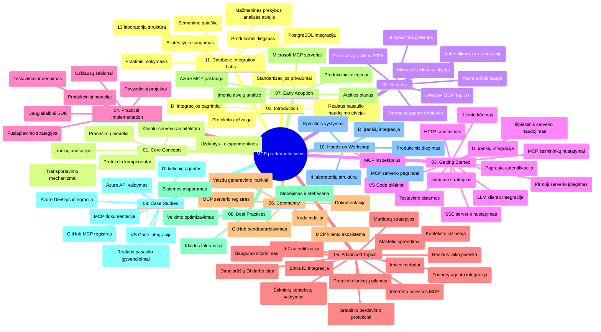

# Modelio konteksto protokolas (MCP) pradedantiesiems – mokymosi vadovas

Šis mokymosi vadovas pateikia „Modelio konteksto protokolo (MCP) pradedantiesiems“ mokymo programos saugyklos struktūros ir turinio apžvalgą. Naudokite šį vadovą, kad efektyviai naršytumėte saugykloje ir maksimaliai išnaudotumėte turimus išteklius.

## Saugyklos apžvalga

Modelio konteksto protokolas (MCP) yra standartizuota sistema AI modelių ir klientų programėlių sąveikai. Iš pradžių sukurtas Anthropic, MCP dabar prižiūri platesnė MCP bendruomenė per oficialią GitHub organizaciją. Ši saugykla siūlo išsamią mokymo programą su praktiniais kodo pavyzdžiais C#, Java, JavaScript, Python ir TypeScript kalbomis, skirtus AI kūrėjams, sistemų architektams ir programinės įrangos inžinieriams.

## Vizualinė mokymo programos žemėlapis

## Saugyklos struktūra

Saugykla suskirstyta į vienuolika pagrindinių skyrių, kuriuose dėmesys skiriamas skirtingiems MCP aspektams:

1. **Įvadas (00-Introduction/)**
   - Modelio konteksto protokolo apžvalga
   - Kodėl standartizacija svarbi AI sistemose
   - Praktiniai naudojimo atvejai ir privalumai

2. **Pagrindinės sąvokos (01-CoreConcepts/)**
   - Klientas-serveris architektūra
   - Pagrindiniai protokolo komponentai
   - Pranešimų siuntimo modeliai MCP

3. **Saugumas (02-Security/)**
   - Grėsmės MCP pagrinduose veikiančiose sistemose
   - Geriausios praktikos saugumui užtikrinti
   - Autentifikavimo ir autorizacijos strategijos
   - **Išsami saugumo dokumentacija**:
     - MCP saugumo geriausios praktikos 2025
     - „Azure Content Safety“ diegimo gidas
     - MCP saugumo valdymas ir metodai
     - MCP geriausios praktikos greita nuoroda
   - **Svarbios saugumo temos**:
     - Komandų įterpimo ir įrankių užnuodijimo atakos
     - Sesijos užgrobimas ir sumaišties tarp asmenų problemos
     - Žetonų praeinamumo pažeidžiamumai
     - Per didelės teisės ir prieigos valdymas
     - Tiekimo grandinės saugumas AI komponentams
     - Microsoft Prompt Shields integracija

4. **Pradžia (03-GettingStarted/)**
   - Aplinkos nustatymas ir konfigūracija
   - Pirmųjų MCP serverių ir klientų kūrimas
   - Integracija su esamomis programomis
   - Turinys:
     - Pirmoji serverio implementacija
     - Klientų kūrimas
     - LLM kliento integracija
     - VS Code integracija
     - Server-Sent Events (SSE) serveris
     - Pažangus serverio naudojimas
     - HTTP srautinimas
     - AI įrankių komplekto integracija
     - Testavimo strategijos
     - Diegimo gairės

5. **Praktinė įgyvendinimas (04-PracticalImplementation/)**
   - SDK naudojimas skirtingose programavimo kalbose
   - Derinimas, testavimas ir patikra
   - Pernaudojamų komandų šablonų ir procesų kūrimas
   - Pavyzdiniai projektai su įgyvendinimo pavyzdžiais

6. **Pažangios temos (05-AdvancedTopics/)**
   - Konteksto inžinerijos metodai
   - Foundry agento integracija
   - Daugialypių AI darbo srautų kūrimas
   - OAuth2 autentifikacijos demonstracijos
   - Realaus laiko paieškos galimybės
   - Realaus laiko srautinimas
   - Root kontekstų implementacija
   - Maršrutų strategijos
   - Mėginių paėmimo metodai
   - Mastelio didinimo sprendimai
   - Saugumo aspektai
   - Entra ID saugumo integracija
   - Interneto paieškos integracija

7. **Bendruomenės indėlis (06-CommunityContributions/)**
   - Kaip prisidėti prie kodo ir dokumentacijos
   - Bendradarbiavimas per GitHub
   - Bendruomenės inicijuojami patobulinimai ir atsiliepimai
   - Įvairių MCP klientų naudojimas (Claude Desktop, Cline, VSCode)
   - Darbas su populiariais MCP serveriais įskaitant vaizdų generavimą

8. **Pamokos iš ankstyvosios adopcijos (07-LessonsfromEarlyAdoption/)**
   - Realūs įgyvendinimai ir sėkmės istorijos
   - MCP pagrindu veikiančių sprendimų kūrimas ir diegimas
   - Tendencijos ir ateities planas
   - **Microsoft MCP serverių gidas**: Išsamus 10 Microsoft MCP produkcijos serverių gidas, įskaitant:
     - Microsoft Learn Docs MCP serveris
     - Azure MCP serveris (15+ specializuotų jungčių)
     - GitHub MCP serveris
     - Azure DevOps MCP serveris
     - MarkItDown MCP serveris
     - SQL Server MCP serveris
     - Playwright MCP serveris
     - Dev Box MCP serveris
     - Azure AI Foundry MCP serveris
     - Microsoft 365 Agents Toolkit MCP serveris

9. **Geriausios praktikos (08-BestPractices/)**
   - Veikimo optimizavimas
   - Atsparių MCP sistemų projektavimas
   - Testavimo ir patvarumo strategijos

10. **Atvejų analizės (09-CaseStudy/)**
    - **Septynios išsamios atvejų analizės**, demonstruojančios MCP lankstumą įvairiuose scenarijuose:
    - **Azure AI kelionių agentai**: Multiplų agentų koordinavimas su Azure OpenAI ir AI paieška
    - **Azure DevOps integracija**: Darbo eigos procesų automatizavimas su YouTube duomenų atnaujinimais
    - **Realaus laiko dokumentų gavimas**: Python konsolės klientas su HTTP srautinimu
    - **Interaktyvus studijų planų generatorius**: Chainlit internetinė aplikacija su pokalbių AI
    - **Dokumentacija redaktoriuje**: VS Code integracija su GitHub Copilot darbo srautais
    - **Azure API valdymas**: Įmonių API integracija su MCP serverių kūrimu
    - **GitHub MCP registras**: Ekosistemos kūrimas ir agentinė integracijos platforma
    - Įgyvendinimo pavyzdžiai apimantys įmonių integraciją, kūrėjų produktyvumą ir ekosistemos plėtrą

11. **Praktinis seminaras (10-StreamliningAIWorkflowsBuildingAnMCPServerWithAIToolkit/)**
    - Išsamus praktinis seminaras derinant MCP su AI įrankių komplektu
    - Protingų programėlių kūrimas, jungiant AI modelius su realaus pasaulio įrankiais
    - Praktiniai moduliai, apimantys pagrindus, custom serverių kūrimą ir produkcijos diegimo strategijas
    - **Laboratorijų struktūra**:
      - Laboratorija 1: MCP serverio pagrindai
      - Laboratorija 2: Pažangus MCP serverio kūrimas
      - Laboratorija 3: AI įrankių komplekto integracija
      - Laboratorija 4: Produkcijos diegimas ir mastelio didinimas
    - Žingsnis po žingsnio laboratorinė mokymosi metodika

12. **MCP serverio duomenų bazės integracijos laboratorijos (11-MCPServerHandsOnLabs/)**
    - **Išsamus 13 laboratorijų mokymosi kelias** MCP produkcijos serverių kūrimui su PostgreSQL integracija
    - **Realus mažmeninės prekybos analitikos įgyvendinimas** naudojant Zava Retail atvejį
    - **Įmonių lygio modeliai** įskaitant eilutės lygio saugumą (RLS), semantinę paiešką ir daugiakliento duomenų prieigą
    - **Pilna laboratorijos struktūra**:
      - **Laboratorijos 00-03: Pagrindai** – Įvadas, architektūra, saugumas, aplinkos nustatymas
      - **Laboratorijos 04-06: MCP serverio kūrimas** – Duomenų bazės dizainas, MCP serverio įgyvendinimas, įrankių kūrimas
      - **Laboratorijos 07-09: Pažangios funkcijos** – Semantinė paieška, testavimas ir derinimas, VS Code integracija
      - **Laboratorijos 10-12: Produkcija ir geriausios praktikos** – Diegimas, stebėsena, optimizavimas
    - **Naudojamos technologijos**: FastMCP karkasas, PostgreSQL, Azure OpenAI, Azure Container Apps, Application Insights
    - **Mokymosi rezultatai**: Produkcijos MCP serveriai, duomenų bazės integracijos modeliai, AI pagrįsta analizė, įmonių saugumas

## Papildomi ištekliai

Saugykloje yra papildomų išteklių:

- **Paveikslėlių aplankas**: Diagramos ir iliustracijos, naudojamos mokymo programoje
- **Vertimai**: Daugiakalbė dokumentacijos palaikymas su automatizuotais vertimais
- **Oficialūs MCP ištekliai**:
  - [MCP dokumentacija](https://modelcontextprotocol.io/)
  - [MCP specifikacija](https://spec.modelcontextprotocol.io/)
  - [MCP GitHub saugykla](https://github.com/modelcontextprotocol)

## Kaip naudotis šia saugykla

1. **Sekantis mokymasis**: Vykdykite skyrius iš eilės (nuo 00 iki 11) struktūruotam mokymuisi.
2. **Kalbai skirtas dėmesys**: Jei domitės konkrečia programavimo kalba, nagrinėkite pavyzdžių katalogus su jūsų pageidaujamos kalbos įgyvendinimais.
3. **Praktinis įgyvendinimas**: Pradėkite nuo skyriaus „Pradžia“, kad pasiruoštumėte aplinką ir sukurtumėte pirmą MCP serverį ir klientą.
4. **Pažangus tyrinėjimas**: Kai būsite susipažinę su pagrindais, gilinkitės į pažangias temas ir plėskite žinias.
5. **Bendruomenės dalyvavimas**: Prisijunkite prie MCP bendruomenės GitHub diskusijų ir Discord kanaluose, kad susisiektumėte su ekspertais ir kolegomis kūrėjais.

## MCP klientai ir įrankiai

Mokymo programa apima įvairius MCP klientus ir įrankius:

1. **Oficialūs klientai**:
   - Visual Studio Code
   - MCP Visual Studio Code viduje
   - Claude Desktop
   - Claude VSCode viduje
   - Claude API

2. **Bendruomenės klientai**:
   - Cline (terminalo pagrindu)
   - Cursor (kodo redaktorius)
   - ChatMCP
   - Windsurf

3. **MCP valdymo įrankiai**:
   - MCP CLI
   - MCP Manager
   - MCP Linker
   - MCP Router

## Populiarūs MCP serveriai

Saugykla pristato įvairius MCP serverius, įskaitant:

1. **Oficialūs Microsoft MCP serveriai**:
   - Microsoft Learn Docs MCP serveris
   - Azure MCP serveris (15+ specializuotų jungčių)
   - GitHub MCP serveris
   - Azure DevOps MCP serveris
   - MarkItDown MCP serveris
   - SQL Server MCP serveris
   - Playwright MCP serveris
   - Dev Box MCP serveris
   - Azure AI Foundry MCP serveris
   - Microsoft 365 Agents Toolkit MCP serveris

2. **Oficialūs referenciniai serveriai**:
   - Filesystem
   - Fetch
   - Memory
   - Sequential Thinking

3. **Vaizdų generavimas**:
   - Azure OpenAI DALL-E 3
   - Stable Diffusion WebUI
   - Replicate

4. **Vystymo įrankiai**:
   - Git MCP
   - Terminal Control
   - Code Assistant

5. **Specializuoti serveriai**:
   - Salesforce
   - Microsoft Teams
   - Jira & Confluence

## Prisidėjimas

Ši saugykla laukianti bendruomenės indėlio. Žr. skiltį Bendruomenės indėlis, kad sužinotumėte, kaip efektyviai prisidėti prie MCP ekosistemos.

----

*Šis mokymosi vadovas paskutinį kartą atnaujintas 2026 m. vasario 5 d., atspindint naujausią MCP specifikaciją 2025-11-25 ir pateikia saugyklos apžvalgą iki šios datos. Saugyklos turinys gali būti atnaujinamas po šios datos.*

---

<!-- CO-OP TRANSLATOR DISCLAIMER START -->
**Atsakomybės apribojimas**:
Šis dokumentas buvo išverstas naudojant dirbtinio intelekto vertimo paslaugą [Co-op Translator](https://github.com/Azure/co-op-translator). Nors siekiame tikslumo, prašome atkreipti dėmesį, kad automatiniai vertimai gali turėti klaidų ar netikslumų. Originalus dokumentas gimtąja kalba turėtų būti laikomas autoritetingu šaltiniu. Svarbiai informacijai rekomenduojamas profesionalus žmogaus vertimas. Mes neatsakome už jokius nesusipratimus ar neteisingus aiškinimus, kylančius dėl šio vertimo naudojimo.
<!-- CO-OP TRANSLATOR DISCLAIMER END -->