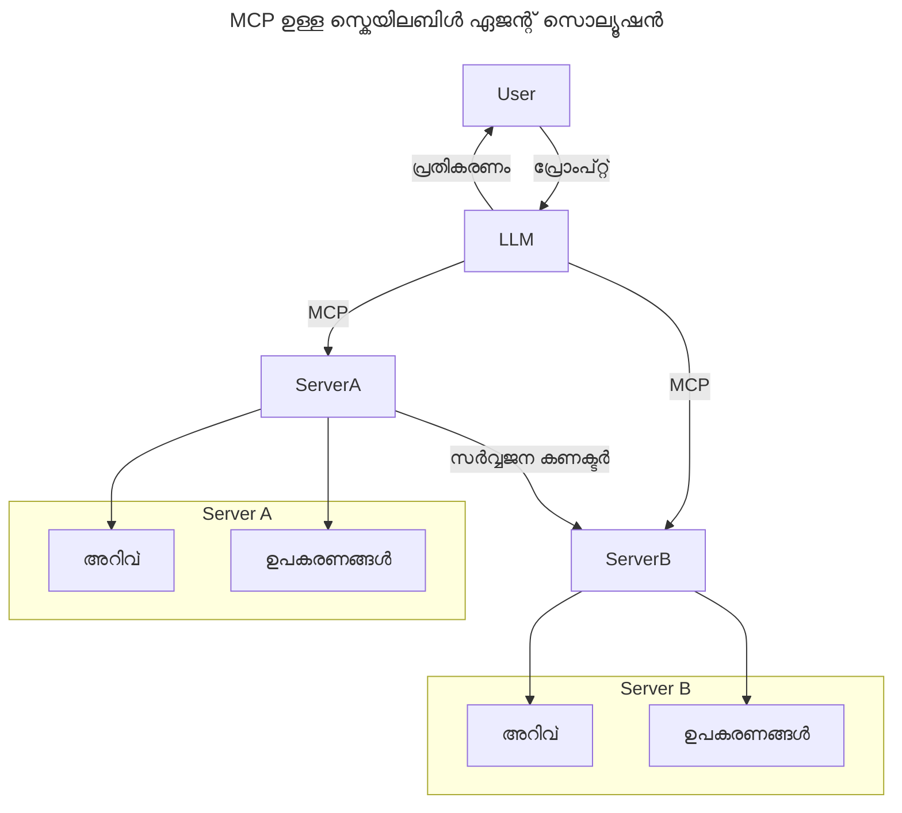
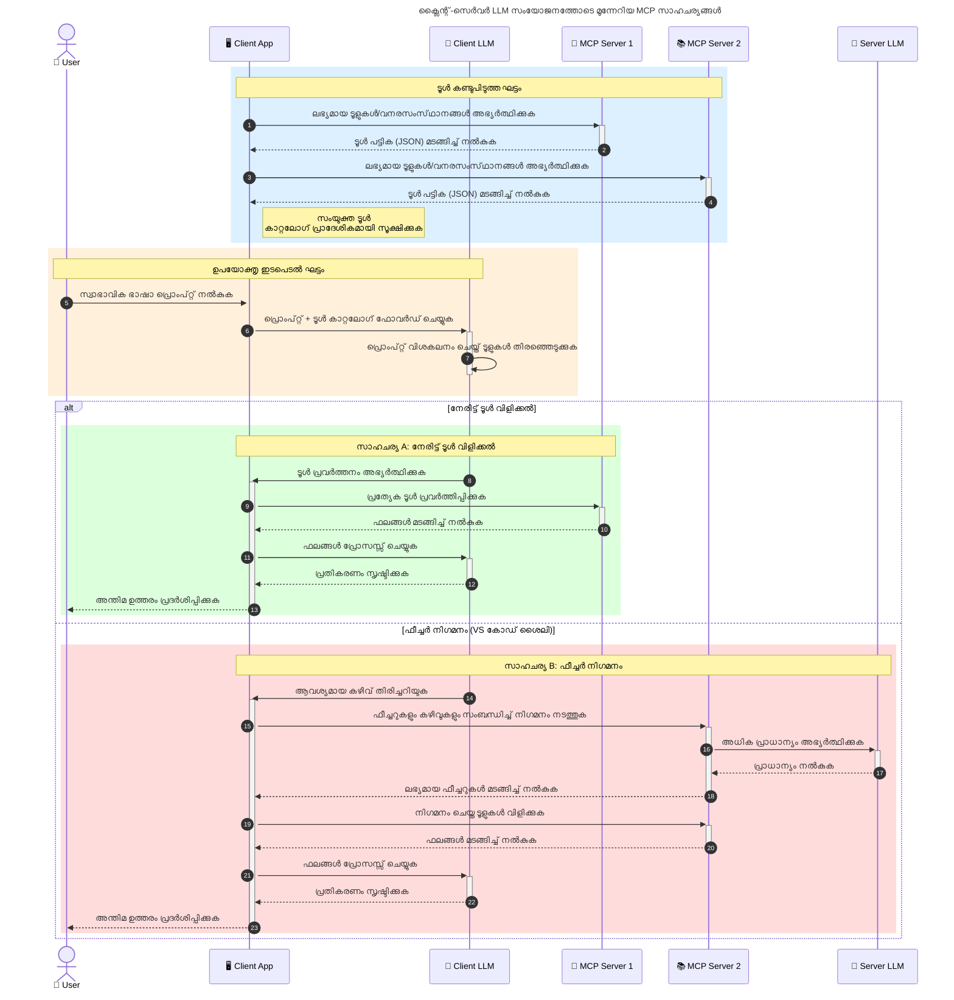

# മോഡൽ കോൺടെക്സ് പ്രോട്ടോക്കോൾ (MCP) പരിചയം: സ്കെയിലബിൾ AI അപ്ലിക്കേഷനുകളിലേക്ക് അതിന്റെ പ്രാധാന്യം

_(ഈ ലെസനിലെ വീഡിയോ കാണാൻ മുകളിലെ ചിത്രം ക്ലിക്ക് ചെയ്യുക)_

ജനറേറ്റീവ് AI അപ്ലിക്കേഷനുകൾ വലിയ മുന്നേറ്റമാണ്, കാരണം അവ സാധാരണ ഭാഷയിൽ പ്രോമ്പ്റ്റുകൾ ഉപയോഗിച്ച് ഉപയോക്താവിനെ ആപ്പ് ഉപയോഗിക്കാൻ അനുവദിക്കുന്നു. എന്നാൽ, ഇത്തരം ആപ്പുകളിൽ കൂടുതൽ സമയം, വിഭവങ്ങൾ നിക്ഷേപിക്കുമ്പോൾ, ഫംഗ്ഷണാലിറ്റികളും വിഭവങ്ങളും എളുപ്പത്തിൽ ചേർക്കാൻ കഴിയണം, ഒന്നിലധികം മോഡലുകൾ ഉപയോഗിക്കുന്നതിനായി നിങ്ങളുടെ ആപ്പ് തയ്യാറാക്കാനാകണം, വിവിധ മോഡൽ സവിശേഷതകളും കൈകാര്യം ചെയ്യാൻ കഴിയണം എന്നതിൽ ഉറപ്പുവരുത്തണമെന്ന് ഉദ്ദേശിക്കുന്നു. ശുപാർശ ചെയ്ത് പറയുമ്പോൾ, Gen AI ആപ്പുകൾ തുടങ്ങാൻ എളുപ്പമാണ്, എന്നാൽ അവ വളർന്ന് കൂടുതൽ സങ്കീർണ്ണമാകുമ്പോൾ, ഒരു ആർക്കിടെക്ചർ നിർവ്വചിക്കേണ്ടതായി വരും, കൂടാതെ നിങ്ങളുടെ ആപ്പുകൾ സ്ഥിരതയോടെയുള്ള രീതിയിൽ നിർമ്മിക്കുന്നതിന് ഒരു സ്റ്റാൻഡേർഡ് ആവശ്യമായിരിക്കും. ഇതാണ് MCP കാര്യങ്ങൾ ക്രമീകരിക്കാൻ, ഒരു സ്റ്റാൻഡേർഡ് നൽകാൻ എത്തുന്നത്.

---

## **🔍 മോഡൽ കോൺടെക്റ്റ് പ്രോട്ടോക്കോൾ (MCP) എന്താണ്?**

**മോഡൽ കോൺടെക്റ്റ് പ്രോട്ടോക്കോൾ (MCP)** ഒരു **ഒപ്പൻ, സ്റ്റాండേർഡൈസ്ഡ് ഇന്റർഫേസ്** ആണ്, ഇത് വലിയ ഭാഷാ മോഡലുകൾ (LLMs) വ്യത്യസ്ത ടൂൾസ്, APIകൾ, ഡാറ്റ സ്രോതസ്സുകളുമായി എളുപ്പത്തിൽ സംവദിക്കാൻ അനുവദിക്കുന്നു. പരിശീലന ഡേറ്റയെ മറികടന്നും AI മോഡലിന്റെ പ്രവർത്തനം മെച്ചപ്പെടുത്താൻ ഇത് ഒരു സുസ്ഥിര ആർക്കിടെക്ചർ നൽകുന്നു, ചതുരുത, സ്കെയിലബിൾ, പ്രതികരണക്ഷമമായ AI സിസ്റ്റങ്ങൾ സൃഷ്ടിക്കാൻ സഹായിക്കുന്നു.

---

## **🎯 AI-യിലെ സ്റ്റാൻഡേർഡൈസേഷന്റെ പ്രാധാന്യം**

ജനറേറ്റീവ് AI ആപ്പുകൾ കൂടുതൽ സങ്കീർണ്ണമാകുമ്പോൾ, **സ്കെയിലിബിലിറ്റി, വികസനസാധ്യത, പരിപാലനക്ഷമത,** കൂടാതെ **വെൻഡർ ലോക്ക്-ഇൻ ഒഴിവാക്കൽ** തുടങ്ങിയ ആവശ്യങ്ങൾ നിറവേറ്റാൻ സ്റ്റാൻഡേർഡുകൾ അത്യാവശ്യമാകുന്നു. MCP താഴെ പറയുന്ന ആവശ്യകതകൾ നിറവേറ്റുന്നു:

- മോഡൽ-ടൂൾ ഇന്റഗ്രേഷനുകൾ ഏകീകൃതമാക്കൽ
- തകർന്നുപോകുന്ന, ഒറ്റത്തവണ സമ്മർദ്ദം ഉള്ള പരിപാദികൾ കുറയ്ക്കൽ
- വ്യത്യസ്ത വെൻഡറുകളിലെ ഒന്നിൽ കൂടുതൽ മോഡലുകൾ ഒരേ സജീവ വാതിൽപ്പടവിൽ പ്രയോഗിക്കാൻ അനുവദിച്ചു

**കുറിപ്പ്:** MCP ഒരു ഓപ്പൺ സ്റ്റാൻഡേർഡ് എന്ന നിലയിൽ തന്നെ നിലനിർത്തുന്നു, എന്നാൽ IEEE, IETF, W3C, ISO തുടങ്ങിയ നിലവിലുള്ള ഏത് സ്റ്റാൻഡേർഡ് സ്ഥാപനത്തിലൂടെയും MCP സ്റ്റാൻഡേർഡ് ആക്കുക എന്ന പ്ലാൻ ഇല്ല.

---

## **📚 പഠന ലക്ഷ്യങ്ങൾ**

ഈ ലേഖനം വായിച്ചതിനു ശേഷം നിങ്ങൾ ചുവടെയായ കാര്യങ്ങൾ അറിയാനാകും:

- **Model Context Protocol (MCP)** എന്താണെന്ന്, അതിന്റെ വെളിപ്പെടുത്തൽ ഉപയോഗങ്ങൾ
- MCP മോഡലുകൾക്കും ടൂൾസിനുമിടയിലെ സംവേദനം എങ്ങനെ സ്റ്റാൻഡേർഡൈസ് ചെയ്യുന്നു എന്ന് മനസിലാക്കുക
- MCP ആർക്കിടെക്ചറിലെ പ്രധാന ഘടകങ്ങൾ തിരിച്ചറിയുക
- എന്റർപ്രൈസും ഡവലപ്പ്മെന്റ് ചുറ്റുപാടുകളും ഉൾപ്പെടെ MCP യുടെ യഥാർഥശ്രമ പ്രവർത്തനങ്ങൾ പരിശോധിക്കുക

---

## **💡 മോഡൽ കോൺടെക്റ്റ് പ്രോട്ടോക്കോൾ (MCP) എന്തുകൊണ്ട് ഗെയിം-ചേഞ്ചറാണ്**

### **🔗 MCP AI സംവേദനത്തിലെ വിഭജനങ്ങൾ പരിഹരിക്കുന്നു**

MCP മുമ്പ് മോഡലുകൾ ടൂൾസുമായി സംയോജിപ്പിക്കുമ്പോൾ താഴെ പറയുന്നവ ആവശ്യമായിരുന്നു:

- ഓരോ ടൂൾ-മോഡൽ ജോഡിക്കും കസ്റ്റം കോഡ് എഴുതൽ
- ഓരോ വെൻഡറിനും വ്യത്യസ്തമായ നോൺ-സ്റ്റാൻഡേർഡ് APIകൾ
- അപ്‌ഡേറ്റുകളാൽ അപകടം കൂടിയ ചുരുങ്ങൽ
- കൂടുതൽ ടൂൾസുകൾ കൂടുമ്പോൾ കുറഞ്ഞ സ്കെയിലിബിലിറ്റി

### **✅ MCP സ്റ്റാൻഡേർഡൈസേഷന്റെ ലാഭങ്ങൾ**

| **ലാഭം**                  | **വിവരണം**                                                                       |
|----------------------------|-----------------------------------------------------------------------------------|
| ഇന്റർഓപ്പറബിലിറ്റി          | LLMs വ്യത്യസ്ത വെൻഡറിലെ ടൂൾസുമായി സുതാര്യമായി പ്രവർത്തിക്കുന്നു                      |
| സ്ഥിരത                      | പ്ലാറ്റ്ഫോമുകളിലും ടൂൾസിലും ഏകസാദൃത പെരുമാറ്റം                                   |
| പുനരുപയോഗയോഗ്യത           | ഒന്നു നിർമ്മിച്ച ടൂൾസുകൾ പല പ്രോജക്റ്റുകളിലും, സിസ്റ്റങ്ങളിലും പ്രയോജനം ചെയ്യാം           |
| വികസനം വേഗത വേഗത്താൽ    | സ്റ്റാൻഡേർഡൈസ്ഡ്, പ്ലഗ്അൻഡ് പ്ലേ ഇന്റർഫേസുകൾ ഉപയോഗിച്ച് ഡെവലപ്പ്മെന്റ് സമയം കുറയ്ക്കൽ|

---

## **🧱 MCP-യുടെ ഉയർന്ന തലത്തിൽ ആർക്കിടെക്ചർ അവലോകനം**

MCP **ക്ലയന്റ്-സർവർ മോഡൽ** പിന്തുടരുന്നു, ഇവിടെ:

- **MCP ഹോസ്റ്റുകൾ** AI മോഡലുകൾ നടത്തുന്നു
- **MCP ക്ലയന്റുകൾ** അഭ്യർത്ഥനകൾ ആരംഭിക്കുന്നു
- **MCP സർവറുകൾ** കോൺടെക്‌സ്‌റ്റ്, ടൂൾസ്, കഴിവുകൾ സേവനം നൽകുന്നു

### **പ്രധാന ഘടകങ്ങൾ:**

- **വിനിയോഗങ്ങൾ** – മോഡലുകൾക്ക് സ്ഥിരതയുള്ള അല്ലെങ്കിൽ ഡൈനാമിക് ഡാറ്റ
- **പ്രോമ്പ്റ്റുകൾ** – മാർഗ്ഗദർശകമായ ജനറേഷനുകൾക്കുള്ള മുൻനിര നൽകിയ പ്രവൃത്തിവഴി
- **ടൂൾസ്** – തിരയൽ, കാൽക്കുലേഷൻ തുടങ്ങിയ നടപ്പിലാക്കാവുന്ന ഫംഗ്ഷനുകൾ
- **സ്ഥാനമാറ്റം** – റികർസീവ് സംവാദങ്ങൾ വഴി ഏജന്റിക് പെരുമാറ്റം
- **ഇലിസിറ്റേഷൻ** – സെർവർ-ആരംഭിച്ച ഉപയോക്തൃ ഇൻപുട്ട് അഭ്യർത്ഥനകൾ
- **റൂട്ട്‌സ്** – സെർവർ ആക്സസ് നിയന്ത്രണത്തിനായുള്ള ഫയൽസിസ്റ്റം പരിധികൾ

### **പ്രോട്ടോക്കോൾ ആർക്കിടെക്ചർ:**

MCP രണ്ട്-നിലാത്ത ആർക്കിടെക്ചറാണ് ഉപയോഗിക്കുന്നത്:
- **ഡാറ്റ ലെയർ**: JSON-RPC 2.0 അടിസ്ഥാനത്തിൽ ലൈഫ്‌സൈക്കിൾ മാനേജ്മെന്റ് ഘടനകളും പ്രിമിറ്റീവുകളും ഉള്ള സംഭാഷണം
- **ട്രാൻസ്പോർട്ട് ലെയർ**: STDIO (പ്രാദേശിക) & Streamable HTTP SSE (ദൂരസ്ഥ) കമ്മ്യൂണിക്കേഷൻ ചാനലുകൾ

---

## MCP സർവറുകൾ എങ്ങനെ പ്രവർത്തിക്കുന്നു

MCP സർവർ താഴെ പറഞ്ഞ രീതിയിൽ പ്രവർത്തിക്കുന്നു:

- **അഭ്യർത്ഥന പ്രക്രിയ**:
    1. ഒരു ഉപയോക്താവോ അവന്റെ ഭാവിയിൽ പ്രവർത്തിക്കുന്ന സോഫ്റ്റ്‌വെയറോ അഭ്യർത്ഥന ആരംഭിക്കുന്നു.
    2. **MCP ക്ലയന്റ്** ആ അഭ്യർത്ഥന **MCP ഹോസ്റ്റിന്** അയയ്ക്കുന്നു, ഇത് AI മോഡൽ റൺടൈം നിയന്ത്രിക്കുന്നു.
    3. **AI മോഡൽ** ഉപയോക്തൃ പ്രോമ്പ്റ്റ് സ്വീകരിച്ച് ബാഹ്യ ടൂളുകളോ ഡാറ്റയോ ലഭിക്കാൻ ഒന്നിലധികം ടൂൾ കോളുകൾ ഉപയോഗിച്ചാകും അഭ്യർത്ഥിക്കുകയോ ചെയ്യുന്നു.
    4. **MCP ഹോസ്റ്റ്** (മോഡൽ നേരിട്ടല്ല), ഉചിതമായ **MCP സർവർ(കൾ)** കമ്പനികളെ ഒരു സ്റ്റാൻഡേർഡ് പ്രോട്ടോക്കോൾ ഉപയോഗിച്ച് ആശയവിനിമയം നടത്തുന്നു.
- **MCP ഹോസ്റ്റ് ഫംഗ്ഷനാലിറ്റി**:
    - **ടൂൾ റെജിസ്ട്രി**: ലഭ്യമായ ടൂൾസും അവയുടെ കഴിവുകളും സൂക്ഷിക്കുന്നു.
    - **ആ്ഘാതം**: ടൂൾ ആക്സസിന് അനുമതികൾ പരിശോദിക്കുന്നു.
    - **അഭ്യർത്ഥന ഹാൻഡിലർ**: മോഡലിൽ നിന്നുള്ള ടൂൾ അഭ്യർത്ഥന പ്രോസസ്സ് ചെയ്യുന്നു.
    - **പ്രതികരണം ഫോർമാറ്റർ**: ടൂളിന്റെ ഔട്ട്പുട്ടുകൾ മോഡൽക്ക് മനസ്സിലാകുന്ന രൂപത്തിൽ ക്രമപ്പെടുത്തുന്നു.
- **MCP സർവർ പ്രവർത്തനം**:
    - **MCP ഹോസ്റ്റ്** ടൂൾ കോളുകൾ ഒന്നിലധികം **MCP സർവറുകൾക്ക്** റൂട്ടുചെയ്യുന്നു, ഓരോതും പ്രത്യേക ഫംഗ്ഷനുകൾ (ജോഡികളായി തിരയൽ, കാൽക്കുലേഷൻ, ഡാറ്റാബേസ് ക്വെറിയുകൾ) പുറപ്പെടുവിക്കുന്നു.
    - **MCP സർവറുകൾ** തങ്ങളുടെ പ്രവർത്തനങ്ങൾ നിർവ്വഹിച്ച് സ്റ്റാൻഡേർഡ് ഫോർമാറ്റിൽ ഫലം MCP ഹോസ്റ്റിലേക്ക് നൽകുന്നു.
    - **MCP ഹോസ്റ്റ്** ഫലങ്ങൾ ഫോർമാറ്റ് ചെയ്ത് AI മോഡലിലേക്ക് അയക്കുന്നു.
- **പ്രതികരണം പൂർത്തീകരണം**:
    - **AI മോഡൽ** ടൂൾ ഔട്ട്പുട്ടുകൾ അവസാന പ്രതികരണത്തിൽ ഉൾപ്പെടുത്തുന്നു.
    - **MCP ഹോസ്റ്റ്** ആ പ്രതികരണം **MCP ക്ലയന്റിന്** തിരികെ അയയ്ക്കുന്നു, ഇത് അവസാന ഉപയോക്താവിനോ വിളിക്കുന്ന സോഫ്റ്റ്‌വെയറിനോ എത്തിക്കുന്നു.

```mermaid
---
title: MCP ആർക്കിടെക്ചർ և ഘടക സംവേദനങ്ങൾ
description: MCP-യിലുളള ഘടകങ്ങളുടെ പ്രവാഹങ്ങൾ കാണിക്കുന്ന ഒരു രേഖാചിത്രം.
---
graph TD
    Client[MCP ക്ലയന്റ്/ആപ്ലിക്കേഷൻ] -->|അഭ്യർത്ഥന അയയ്ക്കുന്നു| H[MCP ഹോസ്റ്റ്]
    H -->|ഇന്വോക്ക് ചെയ്യുന്നു| A[AI മോഡൽ]
    A -->|ടൂൾ കോൾ അഭ്യർത്ഥന| H
    H -->|MCP പ്രോട്ടോക്കോൾ| T1[MCP സർവർ ടൂൾ 01: വെബ് സെർച്ച്]
    H -->|MCP പ്രോട്ടോക്കോൾ| T2[MCP സർവർ ടൂൾ 02: കാൽക്കുലേറ്റർ ടൂൾ]
    H -->|MCP പ്രോട്ടോക്കോൾ| T3[MCP സർവർ ടൂൾ 03: ഡേറ്റാബേസ് ആക്‌സസ് ടൂൾ]
    H -->|MCP പ്രോട്ടോക്കോൾ| T4[MCP സർവർ ടൂൾ 04: ഫയൽ സിസ്റ്റം ടൂൾ]
    H -->|പ്രതികരണം അയയ്ക്കുന്നു| Client

    subgraph "MCP ഹോസ്റ്റ് ഘടകങ്ങൾ"
        H
        G[ടൂൾ രജിസ്റ്ററി]
        I[അവതാരകമായ പരിശോധന]
        J[അഭ്യർത്ഥന ഹാൻഡ്ലർ]
        K[പ്രതികരണം ഫോർമാറ്റർ]
    end

    H <--> G
    H <--> I
    H <--> J
    H <--> K

    style A fill:#f9d5e5,stroke:#333,stroke-width:2px
    style H fill:#eeeeee,stroke:#333,stroke-width:2px
    style Client fill:#d5e8f9,stroke:#333,stroke-width:2px
    style G fill:#fffbe6,stroke:#333,stroke-width:1px
    style I fill:#fffbe6,stroke:#333,stroke-width:1px
    style J fill:#fffbe6,stroke:#333,stroke-width:1px
    style K fill:#fffbe6,stroke:#333,stroke-width:1px
    style T1 fill:#c2f0c2,stroke:#333,stroke-width:1px
    style T2 fill:#c2f0c2,stroke:#333,stroke-width:1px
    style T3 fill:#c2f0c2,stroke:#333,stroke-width:1px
    style T4 fill:#c2f0c2,stroke:#333,stroke-width:1px
```
    

## 👨‍💻 MCP സർവർ എങ്ങനെ നിർമ്മിക്കാം (ഉദാഹരണങ്ങളോടെ)

MCP സർവർ LLM കഴിവുകൾ വികസിപ്പിക്കാൻ ഡാറ്റയും ഫംഗ്ഷനാലിറ്റിയും നൽകുന്നു.

 പരീക്ഷിക്കാൻ തയ്യാറാണോ? വിവിധ ഭാഷകളിൽ/സ്റ്റാക്കുകളിൽ ലളിതമായ MCP സർവർ സൃഷ്ടിക്കുന്നതിന് SDKകൾ/examples:

- **Python SDK**: https://github.com/modelcontextprotocol/python-sdk

- **TypeScript SDK**: https://github.com/modelcontextprotocol/typescript-sdk

- **Java SDK**: https://github.com/modelcontextprotocol/java-sdk

- **C#/.NET SDK**: https://github.com/modelcontextprotocol/csharp-sdk

## 🌍 MCP യുടെ യാഥാർത്ഥ്യ ഉപയോഗ മേഖലകൾ

MCP AI കഴിവുകൾ വികസിപ്പിച്ച് വ്യാപകമായ അപേക്ഷകൾക്ക് സഹായിക്കുന്നു:

| **പ്രയോഗം**                  | **വിവരണം**                                                                          |
|------------------------------|-------------------------------------------------------------------------------------|
| എന്റർപ്രൈസ് ഡാറ്റ ഇന്റഗ്രേഷൻ | LLMs നേ قاعدةബേസുകൾ, CRMs അല്ലെങ്കിൽ ആഭ്യന്തര ടൂൾസുമായി ബന്ധിപ്പിക്കൽ                   |
| ഏജന്റിക് AI സിസ്റ്റങ്ങൾ        | ടൂൾ ആക്സസ്, തീരുമാനമെടുക്കൽ പ്രവൃത്തികളുള്ള സ്വയം പ്രവർത്തിക്കുന്ന ഏജന്റുകൾ സജീവമാക്കൽ          |
| മൾട്ടി-മോഡൽ ആപ്പ്ലിക്കേഷനുകൾ| എഴുത്ത്, ചിത്രം, ശബ്ദ ടൂളുകൾ ഒരേ ഐക്യ AI ആപ്പിൽ കൂട്ടിച്ചേർക്കൽ                            |
| യഥാർത്ഥ-സമയം ഡാറ്റ ഇന്റഗ്രേഷൻ | AI സംവേദനങ്ങൾക്ക് ഇപ്പോഴത്തെ, കൂടുതൽ കൃത്യമായ ഫലങ്ങൾ നൽകുന്ന ലൈവ് ഡാറ്റ ഉപയോഗം            |

### 🧠 MCP = AI സംവേദനങ്ങൾക്ക് സർവ്വത്ര സ്റ്റാൻഡേർഡ്

മോഡൽ കോൺടെക്റ്റ് പ്രോട്ടോക്കോൾ (MCP) AI സംവേദനങ്ങൾക്ക് സർവ്വത്രമായ സ്റ്റാൻഡേർഡ് ആയി പ്രവർത്തിക്കുന്നു, USB-C ഭൗതിക കണക്ഷനുകൾ സ്റ്റാൻഡേർഡ് ആക്കിയ രീതിയിൽ. AIലോകത്ത് MCP ഒരു സुस്ഥിരമായ ഇന്റർഫേസ് നൽകുന്നു, മോഡലുകൾ (ക്ലയന്റുകൾ) ബാഹ്യ ടൂളുകൾക്കും ഡാറ്റ പ്രൊവൈഡേഴ്‌സിനും (സർവറുകൾ) എളുപ്പത്തിൽ സംയോജിപ്പിക്കാൻ. ഓരോ APIയ്ക്കും ഡാറ്റ സ്രോതസ്സിനും വ്യത്യസ്ത കസ്റ്റം പ്രോട്ടോക്കോളുകൾ ആവശ്യമില്ലാതാക്കുന്നു.

MCP-അനുകൂലമായ ഒരു ടൂൾ (MCP സർവർ എന്ന് അഭിമുഖീകരിക്കപ്പെടുന്നു) ഏകീകൃത സ്റ്റാൻഡേർഡ് പിന്തുടരുന്നു. ഈ സർവറുകൾ അവർ നൽകുന്ന ടൂളുകൾ / പ്രവർത്തനങ്ങൾ ലിസ്റ്റ് ചെയ്‌തു, AI ഏജന്റ് ആവശ്യപ്പെടുമ്പോൾ അവ പ്രവർത്തിപ്പിക്കുന്നു. MCP പിന്തുണക്കുന്ന AI ഏജന്റ് പ്ലാറ്റ്ഫോം MCP സർവറുകളിൽ ലഭ്യമായ ടൂളുകൾ കണ്ടെത്താനും ഈ സ്റ്റാൻഡേർഡ് പ്രോട്ടോക്കോൾ വഴി പ്രവർത്തിപ്പിക്കാനും കഴിയും.

### 💡 ജ്ഞാനത്തിലേക്കുള്ള ആക്സസ് സൗകര്യമാകുന്നു

ടൂളുകൾ നൽകുന്നതിന് പുറമേ, MCP ജ്ഞാനത്തിലേക്കുള്ള ആക്സസും സൗകര്യമാക്കുന്നു. നിരവധി ഡാറ്റ സ്രോതസ്സുകളുമായി ലിങ്ക് ചെയ്‌തു LLMകൾക്ക് കോൺടെക്റ്റ് നൽകാൻ ഇത് അപേക്ഷകൾക്ക് സഹായിക്കുന്നു. ഉദാഹരണത്തിന്, ഒരു MCP സർവർ കമ്പനി ഡോക്യുമെന്റ് റെപ്പോസിറ്ററിയായി പ്രവർത്തിക്കാം, ഏജന്റുകൾക്ക് ആവശ്യപ്രകാരം ബന്ധപ്പെട്ട വിവരങ്ങൾ കണ്ടെത്താൻ. മറ്റൊരു സർവർ ഇമെയിൽ അയയ്ക്കൽ, റെക്കോർഡുകൾ അപ്‌ഡേറ്റ് ചെയ്യൽ പോലുള്ള പ്രത്യേക നടപടികൾ കൈകാര്യം ചെയ്യുകയും ചെയ്യാം. ഏജന്റിന്റെ ദൃഷ്ടികോണം അനുസരിച്ച് ഇവ ടൂളുകൾ മാത്രമാണ്—കഴിഞ്ഞ ചില ടൂൾസ് ഡാറ്റ (ജ്ഞാന കോൺടെക്സ്‌റ്) നൽകും, ചിലത് പ്രവർത്തനങ്ങൾ ചെയ്യുന്നു. MCP ഇരു തരത്തെയും സുതാര്യമായി നിയന്ത്രിക്കുന്നു.

ഒരു ഏജന്റ് MCP സേർവറുമായി ചേർന്നാൽ, ആ സർവറിന്റെ ലഭ്യമായ കഴിവുകളും ആക്സസിബിളായ ഡാറ്റയും സ്റ്റാൻഡേർഡ് ഫോർമാറ്റിൽ ആകെ സ്വയം പഠിക്കുന്നു. ഈ സ്റ്റാൻഡേർഡൈസേഷൻ ഡൈനാമിക് ടൂൾ ലഭ്യതക്ക് കാരണമാകും. ഉദാഹരണത്തിന്, ഏജന്റിന്റെ സിസ്റ്റത്തിൽ ഒരു പുതിയ MCP സർവർ ചേർക്കുമ്പോൾ, അതിന്റെ ഫംഗ്ഷനുകൾ ഉടനടി ഉപയോഗിക്കാൻ കഴിയുകയും ഏജന്റിന്റെ നിർദ്ദേശങ്ങൾ കൂടുതൽ കസ്റ്റമൈസേഷനുകൾ ആവശ്യമില്ലാതാകുകയും ചെയ്യും.

ഈ ലളിതവൽക്കരണം താഴെ ചിത്രത്തിലുള്ള ഫ്ലോയ്‌ട്ട് അനുസരിച്ച്, സർവർസുകൾ ടൂൾസും ജ്ഞാനവും നൽകുന്നു, സിസ്റ്റങ്ങൾ തമ്മിലുള്ള സുതാര്യ സംവേദനം ഉറപ്പാക്കുന്നു.

### 👉 ഉദാഹരണം: സ്കെയിലബിൾ ഏജന്റ് സൊല്യൂഷൻ

Universal Connector MCP സർവറുകൾ തമ്മിൽ സംവേദനവും കഴിവുകൾ പങ്കിടലും സാധ്യമാക്കുന്നു, ServerA-നു ServerB-യുടെ ടൂൾസും ജ്ഞാനവും ഉപയോഗിക്കാനാകും. ഇത് ടൂളുകളും ഡാറ്റയും സർവറുകൾക്കിടയ്ക്ക് ഫെഡറേറ്റ് ചെയ്ത് സ്കെയിലബിൾ, മോഡ്യൂലാർ ഏജന്റ് ആർക്കിടെക്ചറുകൾക്കെ പിന്തുണ നൽകുന്നു. MCP ടൂൾ സാന്ദ്രനീകരണം സ്റ്റാൻഡേർഡ് ആകയാൽ, ഏജന്റുകൾ സർവറുകൾക്കിടയിൽ അഭ്യർത്ഥനകൾ കണ്ടെത്താനും റൂട്ടുചെയ്യാനും കഴിയും, ഹാർഡ്കോഡ് ഇന്റഗ്രേഷനുകൾ ആവശ്യമില്ലാതെ.

ടൂൾ, ജ്ഞാൻ ഫെഡറേഷൻ: ടൂൾസും ഡാറ്റയും സർവറുകൾക്കിടയിൽ ആക്സസ് ചെയ്യാവുന്നതും കൂടുതൽ സ്കെയിലബിൾ മോഡ്യൂളാർ ഏജന്റിക് ആർക്കിടെക്ചർ അനുവദിക്കുമ്പോൾ.

### 🔄 ക്ലയന്റ്-സൈഡ് LLM ഇന്റഗ്രേഷൻഉം ഉള്‍പ്പെടുന്ന ആഡ്‌വാൻസ്ഡ് MCP രംഗങ്ങള്‍

പ്രാഥമിക MCP ആർക്കിടെക്ചറിനപ്പുറം, ക്ലയന്റ്-സർവർ ഇരുവർക്കും LLM ഉണ്ടായിരിക്കുന്നത് പോലെയുള്ള മുന്നേറ്റ രംഗങ്ങൾ ഉണ്ട്, കൂടുതൽ പ്രഗഠമായ സംവേദനങ്ങൾ സാധ്യമാകുന്നു. താഴെയുള്ള രൂപരേഖയിൽ, **ക്ലയന്റ് ആപ്പ്** LLM ഉപയോഗിക്കുന്ന MCP ടൂളുകൾ പലതും ഉള്ള IDE ആയിരിക്കാം:

## 🔐 MCP-യുടെ പ്രായോഗിക ലാഭങ്ങൾ

MCP ഉപയോഗിച്ചുള്ള പ്രായോഗിക ലാഭങ്ങൾ:

- **പുതുമ**: മോഡലുകൾ അവരുടെ പരിശീലന ഡേറ്റയെ മറികടന്ന് പുതിയ വിവരങ്ങൾ ആക്സസ് ചെയ്യുന്നു
- **കഴിവ് വർദ്ധനവ്**: മോഡലിൽ പരിശീലനം ഇല്ലാത്ത ടാസ്ക്കുകൾക്കായി പ്രത്യേക ടൂളുകൾ പ്രയോജനപ്പെടുത്തുന്നു
- **ഹല്യൂസിനേഷൻ കുറവ്**: ബാഹ്യ ഡാറ്റ സ്രോതസ്സ് വാസ്തവവും ഉറപ്പുകളായും സഹായിക്കുന്നു
- **സ്വകാര്യത**: സെൻസിറ്റീവ് ഡാറ്റ പ്രോമ്പ്റ്റുകളിൽ ഉൾപ്പെടുത്താതെ സുരക്ഷിതമായ പരിസരങ്ങളിൽ സൂക്ഷിക്കുന്നു

## 📌 പ്രധാനപ്പെട്ട കാര്യങ്ങൾ

MCP ഉപയോഗത്തിനുള്ള പ്രധാന എടുത്തുകാട്ടലുകൾ:

- **MCP** AI മോഡലുകളും ടൂളുകളും ഡാറ്റയും എങ്ങനെ സംവദിക്കും എന്ന് സ്റ്റാൻഡേർഡ് ആക്കുന്നു
- വികസനം, സ്ഥിരത, ഇന്റർഓപ്പറബിലിറ്റി പ്രോത്സാഹിപ്പിക്കുന്നു
- MCP ഡെവലപ്പ്മെന്റ് സമയം കുറയ്ക്കുകയും വിശ്വാസ്യത മെച്ചപ്പെടുത്തുകയും മോഡൽ കഴിവുകൾ വിപുലീകരിക്കുകയും ചെയ്യുന്നു
- ക്ലയന്റ്-സർവർ ആർക്കിടെക്ചർ ഫ്ലെക്സിബിൾ, വിപുലീകരിച്ച AI അപ്ലിക്കേഷനുകൾക്ക് വഴി തുറക്കുന്നു

## 🧠 അഭ്യാസം

നിങ്ങൾ രൂപീകരിക്കാൻ ആഗ്രഹിക്കുന്ന AI അപ്ലിക്കേഷനെ കുറിച്ച് ചിന്തിക്കുക.

- ഏത് **ബാഹ്യ ടൂൾസ് അല്ലെങ്കിൽ ഡാറ്റ** അതിന്റെ കഴിവുകൾ വർദ്ധിപ്പിക്കാനാകും?
- MCP ഇന്റഗ്രേഷൻ എങ്ങനെ **ലളിതവും വിശ്വാസാർഹവുമായ** ആക്കാൻ സഹായിക്കാം?

## അധിക വിഭവങ്ങൾ

- [MCP GitHub Repository](https://github.com/modelcontextprotocol)

## അടുത്തത്

അടുത്തത്: [അധ്യായം 1: കോർ ആശയങ്ങൾ](../01-CoreConcepts/README.md)

---

<!-- CO-OP TRANSLATOR DISCLAIMER START -->
**അസ്വീകാര കുറിപ്പ്**:
ഈ രേഖ AI വശേന പ്രവർത്തിക്കുന്ന തർജ്ജമ സേവനം [Co-op Translator](https://github.com/Azure/co-op-translator) ഉപയോഗിച്ച് തർജ്ജമ ചെയ്‌തതാണ്. നമ്മൾ ശരിശുദ്ധതയ്ക്കായി പരിശ്രമിക്കുന്നെങ്കിലും, യന്ത്രം പ്രവർത്തിപ്പിച്ച തർജ്ജമയിൽ പിഴവുകൾ അല്ലെങ്കിൽ ദുര്‍ബലതകൾ ഉണ്ടാകാമെന്നു ദയവായി ശ്രദ്ധിക്കുക. തദ്ദേശീയ ഭാഷയിൽ ഉള്ള ഒറിജിനൽ രേഖ ആണ് ഔദ്യോഗികമായ ഉറവിടം. നിർണായകമായ വിവരങ്ങൾക്ക്, പ്രൊഫഷണൽ മനുഷ്യ തർജ്ജമ ശുപാർശ ചെയ്യപ്പെടുന്നു. ഈ തർജ്ജമ ഉപയോഗിച്ചതിനു മൂലം പിറക്കാവുന്ന തെറ്റിദ്ധാരണകൾക്കും തെറ്റുവിവർക്കലുകൾക്കും ഞങ്ങൾ ഉത്തരവാദിത്വം വഹിക്കുന്നില്ല.
<!-- CO-OP TRANSLATOR DISCLAIMER END -->