<!--
CO_OP_TRANSLATOR_METADATA:
{
  "original_hash": "9678e0c6945b8e0c23586869b0e26783",
  "translation_date": "2025-12-11T09:46:39+00:00",
  "source_file": "00-Introduction/README.md",
  "language_code": "ml"
}
-->
# മോഡൽ കോൺടെക്സ്റ്റ് പ്രോട്ടോക്കോൾ (MCP) പരിചയം: സ്കെയിലബിൾ AI ആപ്ലിക്കേഷനുകൾക്ക് ഇത് എന്തുകൊണ്ട് പ്രധാനമാണ്

[](https://youtu.be/agBbdiOPLQA)

_(ഈ പാഠത്തിന്റെ വീഡിയോ കാണാൻ മുകളിൽ ചിത്രത്തിൽ ക്ലിക്ക് ചെയ്യുക)_

ജനറേറ്റീവ് AI ആപ്ലിക്കേഷനുകൾ വലിയ മുന്നേറ്റമാണ്, കാരണം അവ സാധാരണ ഭാഷാ പ്രോംപ്റ്റുകൾ ഉപയോഗിച്ച് ഉപയോക്താവിന് ആപ്പുമായി ഇടപഴകാൻ അനുവദിക്കുന്നു. എങ്കിലും, ഇത്തരം ആപ്പുകളിൽ കൂടുതൽ സമയം, വിഭവങ്ങൾ നിക്ഷേപിക്കുമ്പോൾ, ഫംഗ്ഷണാലിറ്റികളും വിഭവങ്ങളും എളുപ്പത്തിൽ സംയോജിപ്പിക്കാൻ കഴിയണം, ആപ്പ് ഒരേ സമയം ഒന്നിലധികം മോഡലുകൾ കൈകാര്യം ചെയ്യാൻ കഴിയണം, വിവിധ മോഡൽ സങ്കീർണതകൾ കൈകാര്യം ചെയ്യണം. സംക്ഷേപത്തിൽ, ജനറേറ്റീവ് AI ആപ്പുകൾ ആരംഭിക്കാൻ എളുപ്പമാണ്, പക്ഷേ അവ വളരുകയും കൂടുതൽ സങ്കീർണമാകുകയും ചെയ്യുമ്പോൾ, ഒരു ആർക്കിടെക്ചർ നിർവചിക്കേണ്ടതുണ്ടാകും, കൂടാതെ നിങ്ങളുടെ ആപ്പുകൾ സ്ഥിരതയുള്ള രീതിയിൽ നിർമ്മിക്കപ്പെടാൻ ഒരു സ്റ്റാൻഡേർഡ് ആശ്രയിക്കേണ്ടതുണ്ടാകും. ഇതാണ് MCP കാര്യങ്ങൾ ക്രമീകരിച്ച് ഒരു സ്റ്റാൻഡേർഡ് നൽകുന്നത്.

---

## **🔍 മോഡൽ കോൺടെക്സ്റ്റ് പ്രോട്ടോക്കോൾ (MCP) എന്താണ്?**

**മോഡൽ കോൺടെക്സ്റ്റ് പ്രോട്ടോക്കോൾ (MCP)** ഒരു **തുറന്ന, സ്റ്റാൻഡേർഡൈസ്ഡ് ഇന്റർഫേസ്** ആണ്, ഇത് വലിയ ഭാഷാ മോഡലുകൾ (LLMs) ബാഹ്യ ടൂളുകൾ, APIകൾ, ഡാറ്റാ സ്രോതസുകൾ എന്നിവയുമായി സുതാര്യമായി ഇടപഴകാൻ അനുവദിക്കുന്നു. ഇത് AI മോഡലുകളുടെ പ്രവർത്തനക്ഷമത അവരുടെ പരിശീലന ഡാറ്റയ്ക്ക് പുറത്തേക്ക് മെച്ചപ്പെടുത്താൻ സ്ഥിരതയുള്ള ആർക്കിടെക്ചർ നൽകുന്നു, കൂടുതൽ ബുദ്ധിമുട്ടുള്ള, സ്കെയിലബിൾ, പ്രതികരണശീലമുള്ള AI സിസ്റ്റങ്ങൾ സൃഷ്ടിക്കാൻ സഹായിക്കുന്നു.

---

## **🎯 AI-യിൽ സ്റ്റാൻഡേർഡൈസേഷൻ എന്തുകൊണ്ട് പ്രധാനമാണ്**

ജനറേറ്റീവ് AI ആപ്ലിക്കേഷനുകൾ കൂടുതൽ സങ്കീർണമാകുമ്പോൾ, **സ്കെയിലബിലിറ്റി, വിപുലീകരണക്ഷമത, പരിപാലനക്ഷമത,** കൂടാതെ **വെൻഡർ ലോക്ക്-ഇൻ ഒഴിവാക്കൽ** ഉറപ്പാക്കുന്ന സ്റ്റാൻഡേർഡുകൾ സ്വീകരിക്കുന്നത് അനിവാര്യമാണ്. MCP ഈ ആവശ്യങ്ങൾ പരിഹരിക്കുന്നു:

- മോഡൽ-ടൂൾ സംയോജനങ്ങൾ ഏകീകൃതമാക്കുന്നു
- തകർന്നുപോകുന്ന, ഒറ്റത്തവണ കസ്റ്റം പരിഹാരങ്ങൾ കുറയ്ക്കുന്നു
- വ്യത്യസ്ത വെൻഡറുകളിൽ നിന്നുള്ള ഒന്നിലധികം മോഡലുകൾ ഒരേ ഇക്കോസിസ്റ്റത്തിൽ നിലനിൽക്കാൻ അനുവദിക്കുന്നു

**കുറിപ്പ്:** MCP ഒരു തുറന്ന സ്റ്റാൻഡേർഡ് ആണെന്ന് സ്വയം പ്രഖ്യാപിച്ചിട്ടുണ്ടെങ്കിലും, IEEE, IETF, W3C, ISO, അല്ലെങ്കിൽ മറ്റ് സ്റ്റാൻഡേർഡ് ബോഡികൾ വഴി MCP സ്റ്റാൻഡേർഡൈസ് ചെയ്യാനുള്ള പദ്ധതികൾ ഇല്ല.

---

## **📚 പഠന ലക്ഷ്യങ്ങൾ**

ഈ ലേഖനം വായിച്ച ശേഷം, നിങ്ങൾക്ക് കഴിയും:

- **മോഡൽ കോൺടെക്സ്റ്റ് പ്രോട്ടോക്കോൾ (MCP)** നിർവചിക്കുക, അതിന്റെ ഉപയോഗങ്ങൾ മനസിലാക്കുക
- MCP മോഡൽ-ടൂൾ ആശയവിനിമയം എങ്ങനെ സ്റ്റാൻഡേർഡൈസ് ചെയ്യുന്നു എന്ന് മനസിലാക്കുക
- MCP ആർക്കിടെക്ചറിന്റെ പ്രധാന ഘടകങ്ങൾ തിരിച്ചറിയുക
- എന്റർപ്രൈസ്, ഡെവലപ്പ്മെന്റ് സാഹചര്യങ്ങളിൽ MCP യുടെ യഥാർത്ഥ പ്രയോഗങ്ങൾ പരിശോധിക്കുക

---

## **💡 മോഡൽ കോൺടെക്സ്റ്റ് പ്രോട്ടോക്കോൾ (MCP) ഗെയിം-ചേഞ്ചർ ആകുന്നത് എന്തുകൊണ്ട്**

### **🔗 MCP AI ഇടപെടലുകളിൽ വിഭജനം പരിഹരിക്കുന്നു**

MCP മുൻപ്, മോഡലുകളെ ടൂളുകളുമായി സംയോജിപ്പിക്കാൻ ആവശ്യമായത്:

- ഓരോ ടൂൾ-മോഡൽ ജോഡിക്കും കസ്റ്റം കോഡ്
- ഓരോ വെൻഡറിനും വ്യത്യസ്തമായ സ്റ്റാൻഡേർഡ് അല്ലാത്ത APIകൾ
- അപ്ഡേറ്റുകൾ മൂലം ഇടയ്ക്കിടെ തകരാറുകൾ
- കൂടുതൽ ടൂളുകൾ ഉപയോഗിക്കുമ്പോൾ മോശം സ്കെയിലബിലിറ്റി

### **✅ MCP സ്റ്റാൻഡേർഡൈസേഷന്റെ ഗുണങ്ങൾ**

| **ഗുണം**                 | **വിവരണം**                                                                   |
|--------------------------|-------------------------------------------------------------------------------|
| ഇന്റർഓപ്പറബിലിറ്റി       | LLMകൾ വ്യത്യസ്ത വെൻഡറുകളുടെ ടൂളുകളുമായി സുതാര്യമായി പ്രവർത്തിക്കുന്നു          |
| സ്ഥിരത                    | പ്ലാറ്റ്ഫോമുകളിലും ടൂളുകളിലും ഏകീകൃത പെരുമാറ്റം                                |
| പുനരുപയോഗക്ഷമത          | ഒരിക്കൽ നിർമ്മിച്ച ടൂളുകൾ വിവിധ പ്രോജക്റ്റുകളിലും സിസ്റ്റങ്ങളിലുമായി ഉപയോഗിക്കാം  |
| വികസന വേഗത വർദ്ധിപ്പിക്കൽ | സ്റ്റാൻഡേർഡൈസ്ഡ്, പ്ലഗ്-ആൻഡ്-പ്ലേ ഇന്റർഫേസുകൾ ഉപയോഗിച്ച് ഡെവലപ്പ്മെന്റ് സമയം കുറയ്ക്കുന്നു |

---

## **🧱 ഉയർന്ന തലത്തിലുള്ള MCP ആർക്കിടെക്ചർ അവലോകനം**

MCP ഒരു **ക്ലയന്റ്-സർവർ മോഡൽ** പിന്തുടരുന്നു, ഇവിടെ:

- **MCP ഹോസ്റ്റുകൾ** AI മോഡലുകൾ ഓടിക്കുന്നു
- **MCP ക്ലയന്റുകൾ** അഭ്യർത്ഥനകൾ ആരംഭിക്കുന്നു
- **MCP സർവറുകൾ** കോൺടെക്സ്റ്റ്, ടൂളുകൾ, കഴിവുകൾ നൽകുന്നു

### **പ്രധാന ഘടകങ്ങൾ:**

- **റിസോഴ്‌സുകൾ** – മോഡലുകൾക്കുള്ള സ്റ്റാറ്റിക് അല്ലെങ്കിൽ ഡൈനാമിക് ഡാറ്റ  
- **പ്രോംപ്റ്റുകൾ** – മാർഗ്ഗനിർദ്ദേശം നൽകുന്ന മുൻനിശ്ചിത പ്രവൃത്തിപദ്ധതികൾ  
- **ടൂളുകൾ** – തിരയൽ, കണക്കുകൂട്ടൽ പോലുള്ള പ്രവർത്തനക്ഷമ ഫംഗ്ഷനുകൾ  
- **സാമ്പ്ലിംഗ്** – പുനരാവർത്തന ഇടപെടലുകൾ വഴി ഏജന്റിക് പെരുമാറ്റം

---

## MCP സർവറുകൾ എങ്ങനെ പ്രവർത്തിക്കുന്നു

MCP സർവറുകൾ താഴെപ്പറയുന്ന രീതിയിൽ പ്രവർത്തിക്കുന്നു:

- **അഭ്യർത്ഥന പ്രവാഹം**:
    1. ഒരു അഭ്യർത്ഥന അവസാന ഉപയോക്താവോ അവരുടെ പകരക്കാരനായ സോഫ്റ്റ്‌വെയറോ ആരംഭിക്കുന്നു.
    2. **MCP ക്ലയന്റ്** അഭ്യർത്ഥന **MCP ഹോസ്റ്റ്**-ലേക്ക് അയയ്ക്കുന്നു, ഇത് AI മോഡൽ റൺടൈം നിയന്ത്രിക്കുന്നു.
    3. **AI മോഡൽ** ഉപയോക്തൃ പ്രോംപ്റ്റ് സ്വീകരിച്ച്, ഒരു അല്ലെങ്കിൽ കൂടുതൽ ടൂൾ കോൾസ് വഴി ബാഹ്യ ടൂളുകൾ അല്ലെങ്കിൽ ഡാറ്റ ആവശ്യപ്പെടാം.
    4. **MCP ഹോസ്റ്റ്**, മോഡലല്ലാതെ, സ്റ്റാൻഡേർഡൈസ്ഡ് പ്രോട്ടോക്കോൾ ഉപയോഗിച്ച് അനുയോജ്യമായ **MCP സർവറുകളുമായി** ആശയവിനിമയം നടത്തുന്നു.
- **MCP ഹോസ്റ്റ് പ്രവർത്തനങ്ങൾ**:
    - **ടൂൾ രജിസ്ട്രി**: ലഭ്യമായ ടൂളുകളും അവയുടെ കഴിവുകളും സൂക്ഷിക്കുന്നു.
    - **ഓതന്റിക്കേഷൻ**: ടൂൾ ആക്സസിനുള്ള അനുമതികൾ പരിശോധിക്കുന്നു.
    - **അഭ്യർത്ഥന കൈകാര്യം ചെയ്യൽ**: മോഡലിൽ നിന്നുള്ള ടൂൾ അഭ്യർത്ഥനകൾ പ്രോസസ്സ് ചെയ്യുന്നു.
    - **പ്രതികരണ ഫോർമാറ്റർ**: മോഡൽ മനസിലാക്കുന്ന ഫോർമാറ്റിൽ ടൂൾ ഔട്ട്പുട്ടുകൾ ഘടിപ്പിക്കുന്നു.
- **MCP സർവർ നിർവഹണം**:
    - **MCP ഹോസ്റ്റ്** ടൂൾ കോൾസ് ഒരു അല്ലെങ്കിൽ കൂടുതൽ **MCP സർവറുകളിലേക്ക്** റൂട്ടുചെയ്യുന്നു, ഓരോ സർവറും പ്രത്യേക ഫംഗ്ഷനുകൾ (ഉദാ: തിരയൽ, കണക്കുകൂട്ടൽ, ഡാറ്റാബേസ് ക്വെറികൾ) പ്രദാനം ചെയ്യുന്നു.
    - **MCP സർവറുകൾ** അവരുടെ പ്രവർത്തനങ്ങൾ നിർവഹിച്ച് ഫലങ്ങൾ സ്ഥിരതയുള്ള ഫോർമാറ്റിൽ **MCP ഹോസ്റ്റിലേക്ക്** തിരികെ നൽകുന്നു.
    - **MCP ഹോസ്റ്റ്** ഫലങ്ങൾ ഫോർമാറ്റ് ചെയ്ത് **AI മോഡലിലേക്ക്** അയയ്ക്കുന്നു.
- **പ്രതികരണ പൂർത്തീകരണം**:
    - **AI മോഡൽ** ടൂൾ ഔട്ട്പുട്ടുകൾ അന്തിമ പ്രതികരണത്തിൽ ഉൾപ്പെടുത്തുന്നു.
    - **MCP ഹോസ്റ്റ്** ഈ പ്രതികരണം **MCP ക്ലയന്റിലേക്ക്** അയയ്ക്കുന്നു, അത് അവസാന ഉപയോക്താവിനോ വിളിക്കുന്ന സോഫ്റ്റ്‌വെയറിനോ നൽകുന്നു.

```mermaid
---
title: MCP ആർക്കിടെക്ചർ மற்றும் ഘടക ഇടപെടലുകൾ
description: MCP-യിലെ ഘടകങ്ങളുടെ പ്രവാഹങ്ങൾ കാണിക്കുന്ന ഒരു ഡയഗ്രാം.
---
graph TD
    Client[MCP ക്ലയന്റ്/അപ്ലിക്കേഷൻ] -->|അഭ്യർത്ഥന അയയ്ക്കുന്നു| H[MCP ഹോസ്റ്റ്]
    H -->|ആഹ്വാനം ചെയ്യുന്നു| A[AI മോഡൽ]
    A -->|ടൂൾ കോൾ അഭ്യർത്ഥന| H
    H -->|MCP പ്രോട്ടോക്കോൾ| T1[MCP സെർവർ ടൂൾ 01: വെബ് സെർച്ച്]
    H -->|MCP പ്രോട്ടോക്കോൾ| T2[MCP സെർവർ ടൂൾ 02: കാൽക്കുലേറ്റർ ടൂൾ]
    H -->|MCP പ്രോട്ടോക്കോൾ| T3[MCP സെർവർ ടൂൾ 03: ഡാറ്റാബേസ് ആക്സസ് ടൂൾ]
    H -->|MCP പ്രോട്ടോക്കോൾ| T4[MCP സെർവർ ടൂൾ 04: ഫയൽ സിസ്റ്റം ടൂൾ]
    H -->|പ്രതികരണം അയയ്ക്കുന്നു| Client

    subgraph "MCP ഹോസ്റ്റ് ഘടകങ്ങൾ"
        H
        G[ടൂൾ രജിസ്ട്രി]
        I[പ്രാമാണീകരണം]
        J[അഭ്യർത്ഥന കൈകാര്യം ചെയ്യുന്നു]
        K[പ്രതികരണം ഫോർമാറ്റർ]
    end

    H <--> G
    H <--> I
    H <--> J
    H <--> K

    style A fill:#f9d5e5,stroke:#333,stroke-width:2px
    style H fill:#eeeeee,stroke:#333,stroke-width:2px
    style Client fill:#d5e8f9,stroke:#333,stroke-width:2px
    style G fill:#fffbe6,stroke:#333,stroke-width:1px
    style I fill:#fffbe6,stroke:#333,stroke-width:1px
    style J fill:#fffbe6,stroke:#333,stroke-width:1px
    style K fill:#fffbe6,stroke:#333,stroke-width:1px
    style T1 fill:#c2f0c2,stroke:#333,stroke-width:1px
    style T2 fill:#c2f0c2,stroke:#333,stroke-width:1px
    style T3 fill:#c2f0c2,stroke:#333,stroke-width:1px
    style T4 fill:#c2f0c2,stroke:#333,stroke-width:1px
```
    


## 👨‍💻 MCP സർവർ എങ്ങനെ നിർമ്മിക്കാം (ഉദാഹരണങ്ങളോടെ)

MCP സർവറുകൾ LLM കഴിവുകൾ വിപുലീകരിക്കാൻ ഡാറ്റയും പ്രവർത്തനങ്ങളും നൽകുന്നു.

പരീക്ഷിക്കാൻ തയ്യാറാണോ? വിവിധ ഭാഷകളിലും സ്റ്റാക്കുകളിലും ലളിതമായ MCP സർവറുകൾ സൃഷ്ടിക്കുന്നതിനുള്ള SDKകൾ ഉദാഹരണങ്ങളോടുകൂടി ഇവിടെ:

- **Python SDK**: https://github.com/modelcontextprotocol/python-sdk

- **TypeScript SDK**: https://github.com/modelcontextprotocol/typescript-sdk

- **Java SDK**: https://github.com/modelcontextprotocol/java-sdk

- **C#/.NET SDK**: https://github.com/modelcontextprotocol/csharp-sdk


## 🌍 MCP യുടെ യഥാർത്ഥ പ്രയോഗങ്ങൾ

MCP AI കഴിവുകൾ വിപുലീകരിച്ച് വ്യാപകമായ ആപ്ലിക്കേഷനുകൾക്ക് സഹായിക്കുന്നു:

| **ആപ്ലിക്കേഷൻ**             | **വിവരണം**                                                                   |
|-----------------------------|-------------------------------------------------------------------------------|
| എന്റർപ്രൈസ് ഡാറ്റ ഇന്റഗ്രേഷൻ | LLMകൾ ഡാറ്റാബേസുകൾ, CRMകൾ, അല്ലെങ്കിൽ ആന്തരിക ടൂളുകളുമായി ബന്ധിപ്പിക്കുന്നു    |
| ഏജന്റിക് AI സിസ്റ്റങ്ങൾ       | ടൂൾ ആക്സസ്, തീരുമാനമെടുക്കൽ പ്രവൃത്തിപദ്ധതികൾ ഉള്ള സ്വയംഭരണ ഏജന്റുകൾ സജ്ജമാക്കുന്നു |
| മൾട്ടി-മോഡൽ ആപ്ലിക്കേഷനുകൾ | ടെക്സ്റ്റ്, ചിത്രം, ഓഡിയോ ടൂളുകൾ ഒരേ ഐക്യപ്പെട്ട AI ആപ്പിൽ സംയോജിപ്പിക്കുന്നു         |
| റിയൽ-ടൈം ഡാറ്റ ഇന്റഗ്രേഷൻ  | AI ഇടപെടലുകളിൽ സജീവ ഡാറ്റ ഉൾപ്പെടുത്തുന്നു, കൂടുതൽ കൃത്യവും നിലവാരമുള്ള ഔട്ട്പുട്ടുകൾ ലഭിക്കുന്നു |


### 🧠 MCP = AI ഇടപെടലുകൾക്കുള്ള സർവത്ര സ്റ്റാൻഡേർഡ്

മോഡൽ കോൺടെക്സ്റ്റ് പ്രോട്ടോക്കോൾ (MCP) AI ഇടപെടലുകൾക്കുള്ള സർവത്ര സ്റ്റാൻഡേർഡായി പ്രവർത്തിക്കുന്നു, USB-C ഫിസിക്കൽ കണക്ഷനുകൾക്ക് സ്റ്റാൻഡേർഡ് നൽകിയത് പോലെ. AI ലോകത്ത് MCP സ്ഥിരതയുള്ള ഇന്റർഫേസ് നൽകുന്നു, മോഡലുകൾ (ക്ലയന്റുകൾ) ബാഹ്യ ടൂളുകളുമായി, ഡാറ്റാ പ്രൊവൈഡർമാരുമായി (സർവറുകൾ) സുതാര്യമായി സംയോജിപ്പിക്കാൻ അനുവദിക്കുന്നു. ഇതുവഴി ഓരോ APIയുടെയും ഡാറ്റാ സ്രോതസിന്റെയും വ്യത്യസ്ത, കസ്റ്റം പ്രോട്ടോക്കോളുകൾ ആവശ്യമില്ലാതാക്കുന്നു.

MCP അനുസരിച്ച്, MCP-സമർത്ഥമായ ടൂൾ (MCP സർവർ എന്ന് വിളിക്കുന്നു) ഏകീകൃത സ്റ്റാൻഡേർഡ് പിന്തുടരുന്നു. ഈ സർവറുകൾ അവരുടെ ടൂളുകളും പ്രവർത്തനങ്ങളും പട്ടികപ്പെടുത്തുകയും AI ഏജന്റിന്റെ അഭ്യർത്ഥനയിൽ ആ പ്രവർത്തനങ്ങൾ നിർവഹിക്കുകയും ചെയ്യുന്നു. MCP പിന്തുണയുള്ള AI ഏജന്റ് പ്ലാറ്റ്ഫോമുകൾ സർവറുകളിൽ നിന്നുള്ള ലഭ്യമായ ടൂളുകൾ കണ്ടെത്താനും ഈ സ്റ്റാൻഡേർഡ് പ്രോട്ടോക്കോൾ വഴി അവയെ വിളിക്കാനും കഴിയും.

### 💡 അറിവിലേക്ക് പ്രവേശനം സുലഭമാക്കുന്നു

ടൂളുകൾ നൽകുന്നതിന് പുറമേ, MCP അറിവിലേക്ക് പ്രവേശനവും സുലഭമാക്കുന്നു. ഇത് ആപ്ലിക്കേഷനുകൾക്ക് വലിയ ഭാഷാ മോഡലുകൾക്ക് (LLMs) വിവിധ ഡാറ്റാ സ്രോതസുകളുമായി ബന്ധിപ്പിച്ച് കോൺടെക്സ്റ്റ് നൽകാൻ സഹായിക്കുന്നു. ഉദാഹരണത്തിന്, ഒരു MCP സർവർ ഒരു കമ്പനിയുടെ ഡോക്യുമെന്റ് സംഭരണശാല പ്രതിനിധീകരിക്കാം, ഏജന്റുകൾ ആവശ്യാനുസരണം ബന്ധപ്പെട്ട വിവരങ്ങൾ തിരയാൻ. മറ്റൊരു സർവർ ഇമെയിൽ അയക്കൽ, രേഖകൾ അപ്ഡേറ്റ് ചെയ്യൽ പോലുള്ള പ്രത്യേക പ്രവർത്തനങ്ങൾ കൈകാര്യം ചെയ്യാം. ഏജന്റിന്റെ കാഴ്ചപ്പാടിൽ, ഇവ ടൂളുകളാണ്—ചില ടൂളുകൾ ഡാറ്റ (അറിവ് കോൺടെക്സ്റ്റ്) നൽകുന്നു, മറ്റുള്ളവ പ്രവർത്തനങ്ങൾ നിർവഹിക്കുന്നു. MCP ഇരുവരും കാര്യക്ഷമമായി കൈകാര്യം ചെയ്യുന്നു.

ഒരു ഏജന്റ് MCP സർവറുമായി ബന്ധപ്പെടുമ്പോൾ, സർവറിന്റെ ലഭ്യമായ കഴിവുകളും ആക്സസ് ചെയ്യാവുന്ന ഡാറ്റയും സ്റ്റാൻഡേർഡ് ഫോർമാറ്റിൽ സ്വയം പഠിക്കുന്നു. ഈ സ്റ്റാൻഡേർഡൈസേഷൻ ഡൈനാമിക് ടൂൾ ലഭ്യതയ്ക്ക് വഴിയൊരുക്കുന്നു. ഉദാഹരണത്തിന്, ഏജന്റിന്റെ സിസ്റ്റത്തിലേക്ക് പുതിയ MCP സർവർ ചേർക്കുമ്പോൾ, അതിന്റെ ഫംഗ്ഷനുകൾ ഉടൻ ഉപയോഗിക്കാം, ഏജന്റിന്റെ നിർദ്ദേശങ്ങൾ കൂടുതൽ കസ്റ്റമൈസ് ചെയ്യേണ്ടതില്ല.

ഈ ലളിതമായ സംയോജനം താഴെ കാണുന്ന ചിത്രത്തിൽ പ്രതിഫലിക്കുന്നു, സർവറുകൾ ടൂളുകളും അറിവും നൽകുന്നു, സിസ്റ്റങ്ങൾക്കിടയിൽ സുതാര്യമായ സഹകരണത്തിന് ഉറപ്പ് നൽകുന്നു.

### 👉 ഉദാഹരണം: സ്കെയിലബിൾ ഏജന്റ് പരിഹാരം

```mermaid
---
title: MCP ഉപയോഗിച്ചുള്ള സ്കെയിലബിൾ ഏജന്റ് സൊല്യൂഷൻ
description: ഒരു ഉപയോക്താവ് എങ്ങനെ LLM-നുമായി ഇടപഴകുന്നു, അത് പല MCP സെർവറുകളുമായി ബന്ധിപ്പിക്കുന്നു, ഓരോ സെർവറും അറിവും ഉപകരണങ്ങളും നൽകുന്നു, സ്കെയിലബിൾ AI സിസ്റ്റം ആർക്കിടെക്ചർ സൃഷ്ടിക്കുന്നു എന്നത് കാണിക്കുന്ന ഒരു ഡയഗ്രാം
---
graph TD
    User -->|പ്രോംപ്റ്റ്| LLM
    LLM -->|പ്രതികരണം| User
    LLM -->|MCP| ServerA
    LLM -->|MCP| ServerB
    ServerA -->|സർവകലാശാല കണക്ടർ| ServerB
    ServerA --> KnowledgeA
    ServerA --> ToolsA
    ServerB --> KnowledgeB
    ServerB --> ToolsB

    subgraph Server A
        KnowledgeA[അറിവ്]
        ToolsA[ഉപകരണങ്ങൾ]
    end

    subgraph Server B
        KnowledgeB[അറിവ്]
        ToolsB[ഉപകരണങ്ങൾ]
    end
```യൂണിവേഴ്സൽ കണക്ടർ MCP സർവറുകൾ തമ്മിൽ ആശയവിനിമയം നടത്താനും കഴിവുകൾ പങ്കുവെക്കാനും അനുവദിക്കുന്നു, ServerA ServerB-ക്ക് ജോലികൾ ഏൽപ്പിക്കാനും അതിന്റെ ടൂളുകളും അറിവും ആക്സസ് ചെയ്യാനും കഴിയും. ഇത് സർവറുകൾക്കിടയിൽ ടൂളുകളും ഡാറ്റയും ഫെഡറേറ്റ് ചെയ്യുന്നു, സ്കെയിലബിൾ, മോടുലാർ ഏജന്റ് ആർക്കിടെക്ചറുകൾക്ക് പിന്തുണ നൽകുന്നു. MCP ടൂൾ എക്സ്പോഷൻ സ്റ്റാൻഡേർഡൈസ് ചെയ്യുന്നതിനാൽ, ഏജന്റുകൾ ഹാർഡ്‌കോഡഡ് സംയോജനങ്ങൾ ഇല്ലാതെ ഡൈനാമിക് ആയി ടൂളുകൾ കണ്ടെത്തുകയും അഭ്യർത്ഥനകൾ റൂട്ടുചെയ്യുകയും ചെയ്യുന്നു.

ടൂൾ, അറിവ് ഫെഡറേഷൻ: ടൂളുകളും ഡാറ്റയും സർവറുകൾക്കിടയിൽ ആക്സസ് ചെയ്യാവുന്നതാണ്, കൂടുതൽ സ്കെയിലബിൾ, മോടുലാർ ഏജന്റിക് ആർക്കിടെക്ചറുകൾക്ക് സഹായം.

### 🔄 ക്ലയന്റ്-സൈഡ് LLM സംയോജനത്തോടെ ഉയർന്ന MCP സീനാരിയോകൾ

അടിസ്ഥാന MCP ആർക്കിടെക്ചറിന് പുറമേ, ക്ലയന്റിലും സർവറിലും LLMകൾ ഉള്ള ഉയർന്ന സങ്കീർണതയുള്ള ഇടപെടലുകൾ ഉള്ള സീനാരിയോകളുണ്ട്. താഴെ കാണുന്ന ചിത്രത്തിൽ, **ക്ലയന്റ് ആപ്പ്** LLM ഉപയോഗിക്കുന്ന നിരവധി MCP ടൂളുകൾ ഉള്ള IDE ആകാം:

```mermaid
---
title: ക്ലയന്റ്-സെർവർ LLM ഇന്റഗ്രേഷനോടുള്ള അഡ്വാൻസ്ഡ് MCP സീനാരിയോകൾ
description: ഉപയോക്താവ്, ക്ലയന്റ് ആപ്ലിക്കേഷൻ, ക്ലയന്റ് LLM, ബഹുഭൂരിപക്ഷ MCP സെർവറുകൾ, സെർവർ LLM എന്നിവയുടെ വിശദമായ ഇടപെടൽ പ്രവാഹം കാണിക്കുന്ന ഒരു സീക്വൻസ് ഡയഗ്രാം, ടൂൾ കണ്ടെത്തൽ, ഉപയോക്തൃ ഇടപെടൽ, നേരിട്ട് ടൂൾ കോൾ ചെയ്യൽ, ഫീച്ചർ നിഗോഷിയേഷൻ ഘട്ടങ്ങൾ എന്നിവ വിശദീകരിക്കുന്നു
---
sequenceDiagram
    autonumber
    actor User as 👤 ഉപയോക്താവ്
    participant ClientApp as 🖥️ ക്ലയന്റ് ആപ്പ്
    participant ClientLLM as 🧠 ക്ലയന്റ് LLM
    participant Server1 as 🔧 MCP സെർവർ 1
    participant Server2 as 📚 MCP സെർവർ 2
    participant ServerLLM as 🤖 സെർവർ LLM
    
    %% Discovery Phase
    rect rgb(220, 240, 255)
        Note over ClientApp, Server2: ടൂൾ കണ്ടെത്തൽ ഘട്ടം
        ClientApp->>+Server1: ലഭ്യമായ ടൂളുകൾ/സ്രോതസുകൾ അഭ്യർത്ഥിക്കുക
        Server1-->>-ClientApp: ടൂൾ ലിസ്റ്റ് (JSON) മടക്കുക
        ClientApp->>+Server2: ലഭ്യമായ ടൂളുകൾ/സ്രോതസുകൾ അഭ്യർത്ഥിക്കുക
        Server2-->>-ClientApp: ടൂൾ ലിസ്റ്റ് (JSON) മടക്കുക
        Note right of ClientApp: സംയുക്ത ടൂൾ<br/>കാറ്റലോഗ് പ്രാദേശികമായി സൂക്ഷിക്കുക
    end
    
    %% User Interaction
    rect rgb(255, 240, 220)
        Note over User, ClientLLM: ഉപയോക്തൃ ഇടപെടൽ ഘട്ടം
        User->>+ClientApp: സ്വാഭാവിക ഭാഷ പ്രോംപ്റ്റ് നൽകുക
        ClientApp->>+ClientLLM: പ്രോംപ്റ്റും ടൂൾ കാറ്റലോഗും മുന്നോട്ട് അയയ്ക്കുക
        ClientLLM->>-ClientLLM: പ്രോംപ്റ്റ് വിശകലനം ചെയ്ത് ടൂളുകൾ തിരഞ്ഞെടുക്കുക
    end
    
    %% Scenario A: Direct Tool Calling
    alt Direct Tool Calling
        rect rgb(220, 255, 220)
            Note over ClientApp, Server1: സീനാരിയോ A: നേരിട്ട് ടൂൾ കോൾ ചെയ്യൽ
            ClientLLM->>+ClientApp: ടൂൾ പ്രവർത്തനം അഭ്യർത്ഥിക്കുക
            ClientApp->>+Server1: പ്രത്യേക ടൂൾ പ്രവർത്തിപ്പിക്കുക
            Server1-->>-ClientApp: ഫലങ്ങൾ മടക്കുക
            ClientApp->>+ClientLLM: ഫലങ്ങൾ പ്രോസസ്സ് ചെയ്യുക
            ClientLLM-->>-ClientApp: പ്രതികരണം സൃഷ്ടിക്കുക
            ClientApp-->>-User: അന്തിമ ഉത്തരം പ്രദർശിപ്പിക്കുക
        end
    
    %% Scenario B: Feature Negotiation (VS Code style)
    else Feature Negotiation (VS Code style)
        rect rgb(255, 220, 220)
            Note over ClientApp, ServerLLM: സീനാരിയോ B: ഫീച്ചർ നിഗോഷിയേഷൻ
            ClientLLM->>+ClientApp: ആവശ്യമായ കഴിവുകൾ തിരിച്ചറിയുക
            ClientApp->>+Server2: ഫീച്ചറുകൾ/കഴിവുകൾ നിഗോഷിയേറ്റ് ചെയ്യുക
            Server2->>+ServerLLM: അധിക സാന്ദർഭം അഭ്യർത്ഥിക്കുക
            ServerLLM-->>-Server2: സാന്ദർഭം നൽകുക
            Server2-->>-ClientApp: ലഭ്യമായ ഫീച്ചറുകൾ മടക്കുക
            ClientApp->>+Server2: നിഗോഷിയേറ്റ് ചെയ്ത ടൂളുകൾ കോൾ ചെയ്യുക
            Server2-->>-ClientApp: ഫലങ്ങൾ മടക്കുക
            ClientApp->>+ClientLLM: ഫലങ്ങൾ പ്രോസസ്സ് ചെയ്യുക
            ClientLLM-->>-ClientApp: പ്രതികരണം സൃഷ്ടിക്കുക
            ClientApp-->>-User: അന്തിമ ഉത്തരം പ്രദർശിപ്പിക്കുക
        end
    end
```
## 🔐 MCP യുടെ പ്രായോഗിക ഗുണങ്ങൾ

MCP ഉപയോഗിക്കുന്നതിന്റെ പ്രായോഗിക ഗുണങ്ങൾ:

- **പുതിയതായ വിവരം**: മോഡലുകൾ അവരുടെ പരിശീലന ഡാറ്റയ്ക്ക് പുറത്തുള്ള പുതുക്കിയ വിവരങ്ങൾ ആക്സസ് ചെയ്യാം
- **കഴിവ് വിപുലീകരണം**: മോഡലുകൾ പരിശീലനം ലഭിക്കാത്ത പ്രത്യേക ടൂളുകൾ ഉപയോഗിക്കാം
- **ഹല്യൂസിനേഷനുകൾ കുറയ്ക്കൽ**: ബാഹ്യ ഡാറ്റാ സ്രോതസുകൾ വാസ്തവപരമായ അടിസ്ഥാനം നൽകുന്നു
- **സ്വകാര്യത**: സങ്കീർണ ഡാറ്റ പ്രോംപ്റ്റുകളിൽ ഉൾപ്പെടുത്താതെ സുരക്ഷിത പരിസരങ്ങളിൽ സൂക്ഷിക്കാം

## 📌 പ്രധാനപ്പെട്ട കാര്യങ്ങൾ

MCP ഉപയോഗിക്കുന്നതിന്റെ പ്രധാനപ്പെട്ട കാര്യങ്ങൾ:

- **MCP** AI മോഡലുകൾ ടൂളുകളുമായി, ഡാറ്റയുമായി എങ്ങനെ ഇടപഴകുന്നു എന്ന് സ്റ്റാൻഡേർഡൈസ് ചെയ്യുന്നു
- വിപുലീകരണക്ഷമത, സ്ഥിരത, ഇന്റർഓപ്പറബിലിറ്റി പ്രോത്സാഹിപ്പിക്കുന്നു
- MCP വികസന സമയം കുറയ്ക്കാനും വിശ്വാസ്യത മെച്ചപ്പെടുത്താനും മോഡൽ കഴിവുകൾ വിപുലീകരിക്കാനും സഹായിക്കുന്നു
- ക്ലയന്റ്-സർവർ ആർക്കിടെക്ചർ ഫ്ലെക്സിബിൾ, വിപുലീകരണക്ഷമ AI ആപ്ലിക്കേഷനുകൾക്ക് വഴിയൊരുക്കുന്നു

## 🧠 അഭ്യാസം

നിങ്ങൾ നിർമ്മിക്കാൻ ആഗ്രഹിക്കുന്ന AI ആപ്ലിക്കേഷൻ ഒരു കാര്യം ചിന്തിക്കുക.

- ഏത് **ബാഹ്യ ടൂളുകൾ അല്ലെങ്കിൽ ഡാറ്റ** അതിന്റെ കഴിവുകൾ മെച്ചപ്പെടുത്താൻ സഹായിക്കും?
- MCP സംയോജനം എങ്ങനെ **സുലഭവും വിശ്വാസയോഗ്യവുമാക്കും**?

## അധിക വിഭവങ്ങൾ

- [MCP GitHub റിപോസിറ്ററി](https://github.com/modelcontextprotocol)


## അടുത്തത്

അടുത്തത്: [അധ്യായം 1: കോർ ആശയങ്ങൾ](../01-CoreConcepts/README.md)

---

<!-- CO-OP TRANSLATOR DISCLAIMER START -->
**അസൂയാ**:  
ഈ രേഖ AI വിവർത്തന സേവനം [Co-op Translator](https://github.com/Azure/co-op-translator) ഉപയോഗിച്ച് വിവർത്തനം ചെയ്തതാണ്. നാം കൃത്യതയ്ക്ക് ശ്രമിച്ചെങ്കിലും, സ്വയം പ്രവർത്തിക്കുന്ന വിവർത്തനങ്ങളിൽ പിശകുകൾ അല്ലെങ്കിൽ തെറ്റുകൾ ഉണ്ടാകാമെന്ന് ദയവായി ശ്രദ്ധിക്കുക. അതിന്റെ മാതൃഭാഷയിലുള്ള യഥാർത്ഥ രേഖ അധികാരപരമായ ഉറവിടമായി കണക്കാക്കണം. നിർണായക വിവരങ്ങൾക്ക്, പ്രൊഫഷണൽ മനുഷ്യ വിവർത്തനം ശുപാർശ ചെയ്യപ്പെടുന്നു. ഈ വിവർത്തനം ഉപയോഗിക്കുന്നതിൽ നിന്നുണ്ടാകുന്ന ഏതെങ്കിലും തെറ്റിദ്ധാരണകൾക്കോ തെറ്റായ വ്യാഖ്യാനങ്ങൾക്കോ ഞങ്ങൾ ഉത്തരവാദികളല്ല.
<!-- CO-OP TRANSLATOR DISCLAIMER END -->