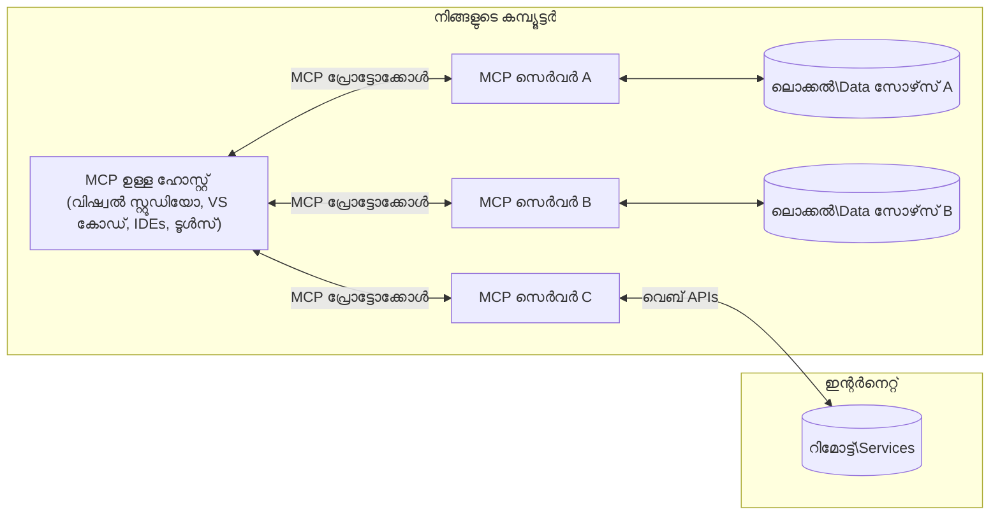

# MCP കോർ ആശയങ്ങൾ: എഐ ഇന്റഗ്രേഷനായി മോഡൽ കോൺടെക്‌സ്‌റ്റ് പ്രോട്ടോക്കോൾ മാസ്റ്ററിംഗ്

[](https://youtu.be/earDzWGtE84)

_(ഈ പാഠത്തിന്റെ വീഡിയോ കാണാൻ മുകളിൽ ചിത്രത്തിൽ ക്ലിക്ക് ചെയ്യുക)_

[Model Context Protocol (MCP)](https://github.com/modelcontextprotocol) ഒരു ശക്തമായ, സ്റ്റാൻഡേർഡൈസ്ഡ് ഫ്രെയിംവർക്കാണ്, ഇത് വലിയ ഭാഷാ മോഡലുകൾ (LLMs) എന്നതും പുറം ആപ്ലിക്കേഷനുകളും ഡാറ്റാ സ്രോതസ്സുകളും തമ്മിലുള്ള ആശയവിനിമയം മെച്ചപ്പെടുത്തുന്നു.  
ഈ ഗൈഡ് MCPയുടെ കോർ ആശയങ്ങൾ നിങ്ങളെ പരിചയപ്പെടുത്തും. അതിന്റെ ക്ലയന്റ്-സെർവർ ആർക്കിടെക്ചർ, അനിവാര്യ ഘടകങ്ങൾ, ആശയവിനിമയം, നടപ്പിലാക്കൽ മികച്ച പ്രവർത്തനങ്ങൾ എന്നിവ നിങ്ങൾക്ക് അറിയാം.

- **സൂക്ഷ്മ ഉപഭോക്തൃ അംഗീകാരം**: എല്ലാ ഡാറ്റാ ആക്സസ്, ഓപ്പറേഷനുകൾ എന്നിവ നിർവഹിക്കുന്നതിന് ഉപഭോക്തൃ അംഗീകാരമുള്ളിരിക്കണം. ഉപഭോക്താക്കൾക്ക് ഡ്രട്ടി വിവരവും പ്രവര്‍ത്തനങ്ങളും വ്യക്തമാക്കി granular അനുമതികൾ നിയന്ത്രണം ലഭിക്കണം.

- **ഡാറ്റാ പ്രൈവസിയുടെ സംരക്ഷണം**: ഉപഭോക്താവിന്റെ ഡാറ്റ വ്യക്തമായ അംഗീകാരം കൂടാതെ പുറത്തുവിടുകയോ കൈമാറുകയോ ചെയ്യരുത്, കൂടാതെ ശക്തമായ ആക്സസ് നിയന്ത്രണങ്ങൾ മുഴുവൻ ഇടപെടൽ ജീവിതചക്രത്തിലും പാലിക്കണം. അനധികൃത ഡാറ്റ സംവഹണം തടയണം, കഠിനമായ സ്വകാര്യതാ അതിര്‍വരമ്പുകൾ പാലിക്കണം.

- **ടൂൾ എക്സിക്യൂഷൻ സുരക്ഷ**: ഓരോ ടൂൾ ഉപയോഗത്തിനും ഉപഭോക്തൃ അംഗീകാരമുള്ളിരിക്കണം, ടൂളിന്റെ പ്രവർത്തനം, പാരാമീറ്ററുകൾ, സാധ്യതാ പ്രഭാവം എന്നത് വ്യക്തമായി മനസ്സിലാക്കണം. ദുരുപയോഗം, അപകടകരമായ, ദോഷകരമായ ടൂൾ പ്രവർത്തനം തടയുന്ന സുരക്ഷാ അതിര്‍വരമ്പുകൾ ഉറപ്പ് വരുത്തണം.

- **ട്രാൻസ്പോർട്ട് ലെയർ സുരക്ഷ**: സമ്പൂർണ്ണ ആശയവിനിമയ ചാനലുകൾ യോജിച്ചതായ എൻക്രിപ്ഷൻ  അഥവാ സാന്ദ്രീകരണ രീതി ഉപയോഗിക്കണം. റിമോട്ട് കണക്ഷനുകൾ സുരക്ഷിത ട്രാൻസ്പോർട്ട് പ്രോട്ടോകോളും ക്രെഡൻഷ്യൽ മാനേജ്മെൻ്റും നടപ്പിലാക്കണം.

#### നടപ്പിലാക്കൽ മാർഗ്ഗനിർദ്ദേശങ്ങൾ:

- **അനുമതി മാനേജ്മെന്റ്**: ഉപയോക്താക്കളെ ഏത് സെർവറുകൾ, ഉപകരണങ്ങൾ, വിഭവങ്ങൾ ആക്സസ്സ് ചെയ്യാൻ ഇടയുള്ളതായി സൂക്ഷ്മമായ അനുമതി സംവിധാനം നടപ്പിലാക്കുക
- **അഥന്റിക്കേഷൻ & ഓതറൈസേഷൻ**: OAuth, API കീകൾ പോലുള്ള സുരക്ഷിത പ്രമാണവിഷയം ഉപയോഗിച്ച് ശരിയായ ടോക്കൺ മാനേജ്മെൻറ് ആൻഡ് കാലഹരണവും   
- **ഇൻപുട്ട് വാലിഡേഷൻ**: നിർവചിച്ച സ്കീമകൾ അനുസരിച്ച് എല്ലാ പാരാമീറ്ററുകളും ഡാറ്റ ഇൻപുട്ടുകളും സ്ഥിരീകരിക്കുക, ഇൻജക്ഷൻ ആക്രമണങ്ങൾ തടയാൻ
- **ഓഡിറ്റ് ലോഗിംഗ്**: സുരക്ഷ നിരീക്ഷണത്തിനും അനുഗമനത്തിനും എല്ലാ പ്രവർത്തനങ്ങൾക്കുമായി സമഗ്രമായ ലോഗുകൾ നിലനിർത്തുക

## അവലോകനം

ഈ പാഠം മോഡൽ കോൺടെക്‌സ്‌റ്റ് പ്രോട്ടോക്കോൾ (MCP) ന്യൂനഗതിയുള്ള ആർക്കിടെക്ചറും ഘടകങ്ങളും പരിശോധിക്കുന്നു. MCP ഇടപെടലുകൾ പ്രവർത്തിപ്പിക്കുന്ന ക്ലയന്റ്-സെർവർ ആർക്കിടെക്ചർ, പ്രധാന ഭാഗങ്ങൾ, ആശയവിനിമയം എന്നിവ നിങ്ങൾക് പഠിക്കാം.

## പ്രധാന പഠന ലക്‌ഷ്യങ്ങൾ

ഈ പാഠം അവസാനിച്ചപ്പോൾ, നിങ്ങൾക്ക്:

- MCP ക്ലയന്റ്-സെർവർ ആർക്കിടെക്ചർ മനസ്സിലാകും.
- ഹോസ്റ്റുകൾ, ക്ലയന്റുകൾ, സെർവർകൾ എന്നിങ്ങനെ റോൾസ്, ഉത്തരവാദിത്തങ്ങൾ തിരിച്ചറിയാം.
- MCPയെ ഒരു নমനീയമായ സംയോജന ലെയർ ആക്കുന്ന പ്രധാന സവിശേഷതകൾ വിശകലനം ചെയ്യാം.
- MCP ഇക്കോസിസ്റ്റത്തിലുണ്ടാകുന്ന വിവരപ്രവാഹം പഠിക്കും.
- .NET, ജാവ, പൈത്തൺ, ജാവാസ്ക്രിപ്റ്റ് കോഡ് ഉദാഹരണങ്ങളിലൂടെ പ്രായോഗിക അറിവ് നേടും.

## MCP ആർക്കിടെക്ചർ: കൂടുതൽ വിശദമായി

MCP ഇക്കോസിസ്റ്റം ക്ലയന്റ്-സെർവർ മോഡലിൽ അധിഷ്ഠിതമാണ്. ഈ മോഡുലാർ ഘടന എഐ ആപ്ലിക്കേഷനുകൾ ടൂളുകൾ, ഡാറ്റാബേസുകൾ, APIകൾ, കോൺടെക്‌സ്‌ച്വൽ വിഭവങ്ങൾ എന്നിവയുമായി കാര്യക്ഷമമായി ബന്ധപ്പെടാൻ സഹായിക്കുന്നു. ഈ ആർക്കിടെക്ചർ പ്രധാന ഘടകങ്ങളിൽ വിഭജിക്കാം.

അടിസ്ഥാനമായി MCP ഒരു ക്ലയന്റ്-സെർവർ ആർക്കിടെക്ചറാണ്, ഹോസ്റ്റ് ആപ്ലിക്കേഷൻ പല സെർവറുകളെ കണക്ട് ചെയ്യാം:


- **MCP ഹോസ്റ്റുകൾ**: VSCode, Claude Desktop, IDEകൾ അല്ലെങ്കിൽ MCP വഴി ഡാറ്റ ആക്സസ് ചെയ്യാൻ ആഗ്രഹിക്കുന്ന AI ടൂളുകൾ പോലുള്ള പ്രോഗ്രാമുകൾ
- **MCP ക്ലയന്റുകൾ**: സെർവറുകളുമായി 1:1 ബന്ധങ്ങൾ പാലിക്കുന്ന പ്രോട്ടോക്കോൾ ക്ലയന്റുകൾ
- **MCP സെർവർകൾ**: സ്റ്റാൻഡേർഡായ മോഡൽ കോൺടെക്‌സ്‌റ്റ് പ്രോട്ടോക്കോൾ വഴിയാണ് ഏതെങ്കിലും പ്രത്യേക ശേഷികൾ പുറത്തുവിടുന്ന ലഘുലഭമായ പ്രോഗ്രാമുകൾ
- **പ്രാദേശിക ഡാറ്റാ സ്രോതസ്സുകൾ**: നിങ്ങളുടെ കമ്പ്യൂട്ടറിന്റെ ഫയലുകൾ, ഡാറ്റാബേസുകൾ, MCP സെർവർ സുരക്ഷിതമായി ആക്സസ് ചെയ്യാവുന്ന സേവനങ്ങൾ
- **റിമോട്ട് സേവനങ്ങൾ**: ഇന്റർനെറ്റിൽ ലഭ്യമായ പുറം സിസ്റ്റങ്ങൾ, MCP സെർവർ APIകൾ വഴി കണക്ട് ചെയ്യുന്നു.

MCP പ്രോട്ടോക്കോൾ തിയതി ആധാരമായ പതിപ്പുകൾ ഉപയോഗിച്ച് വികാസമാർഗ്ഗത്തിലുണ്ട് (YYYY-MM-DD ഫോർമാറ്റ്). ഇപ്പോഴത്തെ പ്രോട്ടോക്കോൾ പതിപ്പ് **2025-11-25** ആണ്. [പ്രോട്ടോക്കോൾ കൃത്യമായ നിർവചനങ്ങൾ](https://modelcontextprotocol.io/specification/2025-11-25/) അവസാന അപ്‌ഡേറ്റുകൾ കാണാം.

### 1. ഹോസ്റ്റുകൾ

Model Context Protocol (MCP)ൽ, **ഹോസ്റ്റുകൾ** ആണ് ഉപയോക്താക്കൾ പ്രോട്ടോക്കോളുമായി ഇടപെടുന്ന പ്രാഥമിക ഇന്റർഫേസ്സ് സേവിക്കുന്ന AI ആപ്ലിക്കേഷനുകൾ. ഹോസ്റ്റുകൾ MCP സെർവർ പലതുമായ ബന്ധങ്ങൾ മാനേജ്ചെയ്യാൻ ഓരോ സെർവറിനും പ്രത്യേക MCP ക്ലയന്റുകൾ സൃഷ്ടിച്ച് സംയോജിപ്പിക്കുന്നു. ഹോസ്റ്റുകളുടെ ഉദാഹരണങ്ങൾ:

- **AI ആപ്ലിക്കേഷനുകൾ**: Claude Desktop, Visual Studio Code, Claude Code  
- **ഡെവലപ്പ്മെന്റ് പരിതസ്ഥിതികൾ**: MCP ഇന്റഗ്രേഷൻ ഉള്ള IDEകൾ, കോഡ് എഡിറ്ററുകൾ   
- **പ്രത്യേക ആപ്ലിക്കേഷനുകൾ**: ലക്ഷ്യത്തോടുള്ള AI ഏജന്റുകളും ടൂളുകളും

**ഹോസ്റ്റുകൾ** ആപ്പ് ആണ് എഐ മോഡലുകളുമായി ഇടപെടൽ ക്രമീകരിക്കുന്നത്. അവർ:

- **AI മോഡലുകളുടെ ഏകോപനം**: LLMs പ്രവർത്തിപ്പിക്കുക അല്ലെങ്കിൽ ഉത്തരം സൃഷ്ടിക്കാനും AI വർക്ക്ഫ്ലോകൾ ഏകോപിപ്പിക്കാനും
- **ക്ലയന്റ് കണക്ഷനുകൾ മാനേജ് ചെയ്യുക**: MCP സെർവർ ഓരോ ബന്ധത്തിനും ഒരു MCP ക്ലയന്റ് സൃഷ്ടിക്കുക, പരിപാലിക്കുക
- **ഉപയോക്തൃ ഇന്റർഫേസ് നിയന്ത്രിക്കുക**: സംഭാഷണ സംവിധാനം, ഉപയോക്തൃ ഇടപെടലുകൾ, ഉത്തരം കാണിക്കൽ എന്നിവ കൈകാര്യം ചെയ്യുക  
- **സുരക്ഷ നിർവ്വഹണം**: അനുമതികൾ, സുരക്ഷാ നിയന്ത്രണങ്ങൾ, തിരിച്ചറിയൽ നിയന്ത്രണങ്ങൾ കൃത്യമായി പാലിക്കുക
- **ഉപയോക്തൃ അംഗീകാരം കൈകാര്യം ചെയ്യുക**: ഡാറ്റ പങ്കുവെക്കലിനും ടൂൾ പ്രവർത്തനത്തിനുമായി ഉപയോക്തൃ അംഗീകാരം മാനേജ്ജ് ചെയ്യുക

### 2. ക്ലയന്റുകൾ

**ക്ലയന്റുകൾ** ഹೋസ്റ്റുകളും MCP സെർവർകളും തമ്മിലുള്ള ഒരു-ഓൺ-വൺ എന്നും ബന്ധം നിലനിർത്താൻ അനിവാര്യ ഘടകങ്ങളാണ്. ഓരോ MCP ക്ലയന്റും ഹോസ്റ്റ് വഴി പ്രത്യേക MCP സെർവറുമായി ബന്ധപ്പെടുന്നതിന് സൃഷ്ടിക്കപ്പെടുന്നു, ഇത് ഓർഗനൈസ്ഡ്, സുരക്ഷിത ആശയവിനിമയം ഉറപ്പാക്കുന്നു. പല ക്ലയന്റുകൾ ഹോസ്റ്റുകൾക്ക് ഒരേസമയം പല സെർവറുകളുമായി കണക്ട് ചെയ്യാൻ കഴിയും.

**ക്ലയന്റുകൾ** ഹോസ്റ്റ് ആപ്ലിക്കേഷനിലെ കണക്ടർ ഘടകങ്ങൾ ആണ്. അവർ:

- **പ്രോട്ടോക്കോൾ ആശയവിനിമയം**: JSON-RPC 2.0 അപേക്ഷകൾ സെർവറുകളിലേക്ക് അയയ്ക്കുക, പ്രോംപ്റ്റുകളും നിർദ്ദേശങ്ങളും ഉൾപ്പെടെ
- **ശേഷി ചർച്ചകൾ**: സെഷൻ തുടങ്ങുമ്പോൾ സെർവറുകളുമായി പിന്തുണയ്ക്കുന്ന സവിശേഷതകളും പതിപ്പുകളും ചർച്ച ചെയ്യുക
- **ടൂൾ പ്രവർത്തനം**: മോഡലുകളിൽ നിന്നുള്ള ടൂൾ പ്രവർത്തന അഭ്യർത്ഥനകൾ കൈകാര്യം ചെയ്ത് പ്രതികരണങ്ങൾ നേര്ക്കുക
- **റിയൽ-ടൈം അപ്ഡേറ്റുകൾ**: സെർവർ അറിയിപ്പുകളും റിയൽ-ടൈം അപ്ഡേറ്റുകളും കൈകാര്യം ചെയ്യുക
- **പ്രതികരണം പ്രോസസ്സ് ചെയ്യൽ**: സെർവർ പ്രതികരണങ്ങൾ ഉപയോക്താക്കൾക്ക് കാണിക്കുന്നതിനു സംസ്‌കരിക്കുകയും ഫോർമാറ്റ് ചെയ്യുകയും ചെയ്യുക

### 3. സെർവർകൾ

**സെർവർകൾ** MCP ക്ലയന്റുകൾക്ക് കോൺടെക്‌സ്റ്റ്, ടൂളുകൾ, ശേഷികൾ നൽകുന്ന പ്രോഗ്രാമുകളാണ്. അവ ഹോസ്റ്റിന്റെ യന്ത്രത്തിൽ തന്നെ (ലോകൽ) അല്ലെങ്കിൽ പുറത്തുള്ള പ്ലാറ്റ്ഫോമുകളിൽ (റിമോട്ട്) പ്രവർത്തിച്ചേക്കാം, ക്ലയന്റ് അഭ്യർത്ഥനകൾ കൈകാര്യം ചെയ്ത് ഘടനാപരമായ പ്രതികരണങ്ങൾ നൽകുന്നതിന് ഉത്തരവാദികളാണ്. സെർവർ MCP സ്റ്റാൻഡേർഡായ മോഡൽ കോൺടെക്‌സ്‌റ്റ് പ്രോട്ടോക്കോൾ വഴി പ്രത്യേക പ്രവർത്തനങ്ങൾ പുറത്തുകളയുന്നു.

**സെർവർകൾ** കോൺടെക്‌സ്‌റ്റ്, ശേഷികൾ നൽകുന്ന സേവനങ്ങളാണ്. അവർ:

- **സവിശേഷതാ രജിസ്ട്രേഷൻ**: ലഭ്യമായ പ്രിമിറ്റിവുകൾ (വിഭവങ്ങൾ, പ്രോംപ്റ്റുകൾ, ടൂളുകൾ) ക്ലയന്റുകൾക്ക് രജിസ്റ്റർ ചെയ്ത് പുറത്തുവരുത്തുക  
- **അഭ്യർത്ഥന കൈകാര്യംചെയ്യൽ**: ടൂൾ കോളുകൾ, വിഭവ അഭ്യർത്ഥനകൾ, പ്രോംപ്റ്റ് അഭ്യർത്ഥനകൾ സ്വീകരിക്കയും പ്രവർത്തിപ്പിക്കയും ചെയ്യുക  
- **കോൺടെക്‌സ്റ്റ് നൽകൽ**: മോഡൽ പ്രതികരണങ്ങൾ മെച്ചപ്പെടുത്താൻ കോൺടെക്‌സ്റ്റൽ വിവരങ്ങളും ഡാറ്റയും നൽകുക  
- **സ്ഥിതി മാനേജ്മെന്റ്**: സെഷൻ സംസ്ഥാനവും ആവശ്യമെങ്കിൽ നിലകൊള്ളുന്ന ഇടപെടലുകളും കൈകാര്യം ചെയ്യുക  
- **റിയൽ-ടൈം അറിയിപ്പുകൾ**: ശേഷികൾ മാറിയവയും അപ്ഡേറ്റുകളും ക്ലയന്റുകളിലേക്ക് അറിയിക്കുക

പ്രത്യേക ഫംഗ്ഷണാലിറ്റി നൽകി മോഡൽ ശേഷികൾ വിപുലീകരിക്കാൻ ആരും MCP സെർവർ വികസിപ്പിക്കാം, കൂടാതെ ഇത് പ്രാദേശികയും റിമോട്ടുമായ വിന്യസനങ്ങൾ പിന്തുണക്കുന്നു.

### 4. സെർവർ പ്രിമിറ്റിവുകൾ

Model Context Protocol (MCP)ൽ, സെർവർുകൾ ക്ലയന്റുകൾക്ക് സമ്പന്ന ഇടപെടലുകൾ സാധ്യമാക്കുന്ന മൂന്നു അടിസ്ഥാന **പ്രിമിറ്റിവുകൾ** നൽകുന്നു. ഈ പ്രിമിറ്റിവുകൾ പ്രോട്ടോക്കോളിലൂടെയുള്ള കോൺടെക്‌സ്‌ച്വൽ വിവരങ്ങളും പ്രവർത്തനങ്ങളും നിർവചിക്കുന്നു.

MCP സെർവർ താഴെ പറയുന്ന മൂന്നു പ്രാഥമിക പ്രിമിറ്റിവുകളിൽ ഏതെങ്കിലും സംയോജനം പുറത്തുവിടാവുന്നതാണ്:

#### വിഭവങ്ങൾ (Resources)

**വിഭവങ്ങൾ** AI ആപ്ലിക്കേഷനുകൾക്ക് കോൺടെക്‌സ്‌ച്വൽ വിവരങ്ങൾ നൽകുന്ന ഡാറ്റാ സ്രോതസ്സുകളാണ്. അവ മോഡലിന് ബു‌ദ്ധിമുട്ട് മെച്ചപ്പെടുത്താൻ നടപടി എടുത്തെടുക്കാൻ സ്റ്റാറ്റിക് അല്ലെങ്കിൽ ഡൈനാമിക് ഉള്ളടക്കം നൽകുന്നു:

- **കോൺടെക്‌ച്വൽ ഡാറ്റ**: AI മോഡൽ ഉപഭോഗത്തിന് ഘടനാപരമായ വിവരം  
- **നോളജ് ബേസുകൾ**: രേഖാ സംഭരണങ്ങൾ, ലേഖനങ്ങൾ, മാനुअലുകൾ, ഗവേഷണ പേപ്പറുകൾ  
- **പ്രാദേശിക ഡാറ്റാ സ്രോതസ്സുകൾ**: ഫയലുകൾ, ഡാറ്റാബേസുകൾ, പ്രാദേശിക സിസ്റ്റം വിവരങ്ങൾ  
- **പുറം ഡാറ്റ**: API പ്രതികരണങ്ങൾ, വെബ് സേവനങ്ങൾ, റിമോട്ട് സിസ്റ്റം ഡാറ്റ  
- **ഡൈനാമിക് ഉള്ളടക്കം**: പുറം സാഹചര്യങ്ങൾ അനുസരിച്ചു അപ്ഡേറ്റ് ചെയ്യുന്ന നേരിയ ഡാറ്റ

വിഭവങ്ങൾ URIകൾ ഉപയോഗിച്ച് തിരിച്ചറിയപ്പെടുന്നു, `resources/list` വഴി കണ്ടെത്താനും `resources/read` മുഖാന്തിരം ലഭിക്കാനും കഴിയും:

```text
file://documents/project-spec.md
database://production/users/schema
api://weather/current
```

#### പ്രോംപ്റ്റുകൾ (Prompts)

**പ്രോംപ്റ്റുകൾ** ഭാഷാ മോഡലുകളുമായി ഇടപെടലുകൾ സുതാര്യമാക്കുന്ന പുനരുപയോഗയോഗ്യമായ ടെംപ്ലേറ്റുകൾ ആണ്. അവ സ്റ്റാൻഡേർഡൈസ്ഡ് ഇടപെടൽ മാതൃകകളും ടെംപ്ലേറ്റായ വർക്ക്ഫ്ലോകൾ നൽകുന്നു:

- **ടെംപ്ലേറ്റു അടിസ്ഥാന ഇന്ററാക്ഷനുകൾ**: മുൻകൂട്ടി ഘടിപ്പിച്ച സന്ദേശങ്ങളും സംഭാഷണം തുടങ്ങുന്നതിനുള്ള സന്ദേശങ്ങളും  
- **വർക്ക്ഫ്ലോ ടെംപ്ലേറ്റുകൾ**: സാധാരണ કાર્યങ്ങൾക്കും ഇടപെടലുകൾക്കും സ്റ്റാൻഡേർഡ് തുടർച്ചകൾ  
- **ചുരുക്കം ഉദാഹരണങ്ങളുള്ള ടെംപ്ലേറ്റുകൾ**: മോഡലിനു തന്നല് നൽകിയ നിർദ്ദേശങ്ങൾ  
- **സിസ്റ്റം പ്രോംപ്റ്റുകൾ**: മോഡൽ പെരുമാറൽ, കോൺടെക്‌സ്റ്റ് നിർവചിക്കുന്ന അടിസ്ഥാന പ്രോംപ്റ്റുകൾ  
- **ഡൈനാമിക് ടെംപ്ലേറ്റുകൾ**: പ്രത്യേക കോൺടെക്‌സ്റ്റുകൾക്കനുസരിച്ച് മാറ്റം വരുത്താനുള്ള പാരാമറ്ററായ പ്രോംപ്റ്റുകൾ

പ്രോംപ്റ്റുകൾ വേരിയബിൾ പാരാമറ്റർ സമർപ്പണം പിന്തുണയ്ക്കുന്നു, അവ `prompts/list` വഴി കണ്ടെത്താനും `prompts/get` വഴി കിട്ടാനുമാകും:

```markdown
Generate a {{task_type}} for {{product}} targeting {{audience}} with the following requirements: {{requirements}}
```

#### ടൂളുകൾ (Tools)

**ടൂളുകൾ** AI മോഡലുകൾ നിർദ്ദേശിച്ചുള്ള പ്രത്യേക പ്രവർത്തനങ്ങൾ നടത്താൻ കഴിയും പ്രവർത്തനങ്ങളും ഫംഗ്ഷനുകളും ആണ്. അവ MCP ഇക്കോസിസ്റ്റത്തിന്റെ "ക്രിയാപദങ്ങൾ" ആണ്, മോഡലുകൾക്ക് പുറം സിസ്റ്റങ്ങളുമായി ഇടപെടാൻ അനുവദിക്കുന്നു:

- **നടത്താവുന്ന ഫംഗ്ഷനുകൾ**: പ്രത്യേക പാരാമീറ്ററുകൾ ഉപയോഗിച്ച് മോഡലുകൾക്ക് വിളിക്കാൻ കഴിയുന്ന വ്യത്യസ്ത പ്രവർത്തനങ്ങൾ  
- **പുറം സിസ്റ്റം ഇന്റഗ്രേഷൻ**: API കോളുകളും ഡാറ്റാബേസ് ക്വെറികളും ഫയൽ ഓപ്പറേഷനുകളും കണക്കുകൂട്ടലുകളും  
- **തനതായ ഐഡന്റിറ്റി**: ഓരോ ടൂൾക്കും വ്യത്യസ്ത നാമം, വിവരണം, പാരാമീറ്റർ സ്കീമ
- **ഘടനാപരമായ ഇൻപുട്ട്/ഔട്ട്പുട്ട്**: ടൂളുകൾ പരിശോധിച്ച പാരാമീറ്ററുകൾ സ്വീകരിക്കുകയും ഘടനാപരമായ, ടൈപ്പ് ചെയ്ത പ്രതികരണങ്ങൾ നൽകുകയും ചെയ്യുന്നു  
- **പ്രവർത്തന ശേഷികൾ**: മോഡലുകൾക്ക് യഥാർത്ഥ ലോകം പ്രവർത്തനങ്ങൾ നടത്താനും ജീവിച്ചിരുന്നു ഡാറ്റ കണ്ടെത്താനും സഹായിക്കുന്നു

ടൂളുകൾ JSON Schema ഉപയോഗിച്ച് നിർവചിക്കപ്പെടുന്നു, പാരാമീറ്റർ പരിശോധനയ്ക്കും, `tools/list` വഴി കണ്ടെത്താനും `tools/call` വഴി പ്രവർത്തിപ്പിക്കാനും കഴിയും. ടൂളുകൾ മികച്ച UI പ്രദർശനത്തിനായി **ഐക്കണുകൾ** അധിക മെറ്റാഡേറ്റയായി ഉൾപ്പെടുത്താം.

**ടൂൾ അനൊട്ടേഷനുകൾ**: `readOnlyHint`, `destructiveHint` പോലുള്ള പെരുമാറ്റ സൂചനകൾ ടൂൾ ഫംഗ്ഷൻ വായിക്കാൻ പറ്റുമോ അല്ലെങ്കില്‍ നാശകരമാണോ എന്നം വ്യക്തമായി പറഞ്ഞുകൊള്ളുന്നു, ക്ലയന്റുകൾക്ക് ടൂൾ പ്രവർത്തനം സമഗ്രമായി കാണാനും തീരുമാനിക്കാനും സഹായിക്കുന്നു.

ഉദാഹരണ ടൂൾ നിർവചനമുന്നടങ്ങുന്നു:

```typescript
server.tool(
  "search_products", 
  {
    query: z.string().describe("Search query for products"),
    category: z.string().optional().describe("Product category filter"),
    max_results: z.number().default(10).describe("Maximum results to return")
  }, 
  async (params) => {
    // തിരയൽ നിർവഹിച്ച് ഘടനാപരമായ ഫലങ്ങൾ തിരികെ നൽകുക
    return await productService.search(params);
  }
);
```

## ക്ലയന്റ് പ്രിമിറ്റിവുകൾ

Model Context Protocol (MCP)ൽ, **ക്ലയന്റുകൾ** ഹോസ്റ്റ് ആപ്ലിക്കേഷനിൽ സെർവർ ആവശ്യപ്പെടുന്ന അധിക കഴിവുകൾ ലഭ്യമാക്കുന്ന പ്രിംമിറ്റിവുകൾ പുറത്തുവിടാൻ കഴിയും. ഈ ക്ലയന്റ്-സൈഡ് പ്രിമിറ്റിവുകൾ കൂടുതൽ സമ്പന്നവും ഇന്ററാക്ടീവ് ആയും സെർവർ നടപ്പാക്കലുകൾക്ക് സഹായിക്കും, എഐ മോഡൽ കഴിവുകളും ഉപഭോക്തൃ ഇടപെടലുകളും ക്ലയന്റുകൾക്ക് ലഭ്യമാക്കും.

### സാമ്പ്ലിംഗ് (Sampling)

**സാമ്പ്ലിംഗ്** സെർവർകൾക്ക് ക്ലയന്റ് ഏഐ ആപ്ലിക്കേഷനിൽ നിന്നുള്ള ഭാഷാ മോഡൽ പൂർത്തീകരണങ്ങൾ അഭ്യർത്ഥിക്കാൻ അനുവദിക്കുന്നു. ഈ പ്രിമിറ്റിവ് സെർവർകൾക്ക് അവരുടെ സ്വന്തം മോഡൽ ഏർപ്പെടുത്താതെ LLM കഴിവുകൾ ഉപയോഗിക്കാൻ സഹായിക്കുന്നു:

- **മോഡൽ-സ്വതന്ത്ര പ്രവേശനം**: LLM SDK ഉൾപ്പെടുത്താതെയോ മോഡൽ ആക്സസ് മാനേജ്ചെയ്യാതെയോ സെർവറുകൾ പൂർത്തീകരണങ്ങൾ അഭ്യർത്ഥിക്കാം  
- **സെർവർ-ആരംഭിത AI**: സെർവർ സ്വന്തമായും ക്ലയന്റ് മോഡൽ ഉപയോഗിച്ച് ഉള്ളടക്കം സൃഷ്ടിക്കാം  
- ** പുനരാവൃത LLM ഇടപെടലുകൾ**: സർവറുകൾക്ക് പ്രക്രിയയ്ക്കായി AI സഹായം ആവശ്യമായ സങ്കീർണ സാഹചര്യങ്ങൾ പിന്തുണയ്‌ക്കുന്നു  
- **ഡൈനാമിക് ഉള്ളടക്കം സൃഷ്ടിക്കൽ**: ഹോസ്റ്റ് മോഡൽ ഉപയോഗിച്ച് കോൺടെക്‌സ്റ്റൽ പ്രതികരണങ്ങൾ സൃഷ്ടിക്കാം  
- **ടൂൾ കോളിംഗ് പിന്തുണ**: സെർവർ `tools` മുറ്റങ്ങളും `toolChoice` പാരാമീറ്ററുകളും ഉൾപ്പെടുത്തി ക്ലയന്റ് മോഡൽ sampling സമയത്ത് ടൂളുകൾ വിളിക്കാൻ അനുവദിക്കുന്നു

സാമ്പ്ലിംഗ് `sampling/complete` മാർഗ്ഗം വഴി തുടങ്ങുന്നു, സെർവർ പൂർത്തീകരണ അഭ്യർത്ഥനകൾ ക്ലയന്റിന് അയയ്ക്കുന്നു.

### റൂട്ടുകൾ (Roots)

**റൂട്ടുകൾ** ക്ലയന്റുകൾക്ക് ഫയൽസിസ്റ്റത്തിന്റെ അതിരുകൾ സെർവർക്ക് നൽകാനുള്ള സ്റ്റാൻഡേർഡ് മാർഗമാണ്, ഇത് സെർവർക്ക് ഏത് ഡയറക്റ്ററികളും ഫയലുകളും ആക്സസ്സ് ചെയ്യാനാണുള്ളത് എന്നുള്ളത് മനസ്സിലാക്കാൻ സഹായിക്കുന്നു:

- **ഫയൽസിസ്റ്റം അതിരുകൾ**: സെർവർക്ക് ഫയൽസിസ്റ്റത്തിൽ പ്രവർത്തിക്കാൻ ഉള്ള പരിധി വ്യക്തമാക്കുക  
- **ആക്സസ് നിയന്ത്രണം**: സെർവർക്ക് അവശ്യമുള്ള ഡയറക്റ്ററികളും ഫയലുകളും ആക്സസ് ചെയ്യാനുള്ള അനുവാദം മനസ്സിലാക്കാൻ സഹായിക്കുക  
- **ഡൈനാമിക് അപ്ഡേറ്റുകൾ**: റൂട്ടുകളുടെ പട്ടിക മാറുമ്പോൾ ക്ലയന്റുകൾ സെർവർക്ക് അറിയിപ്പ് നൽകും  
- **URI അടിസ്ഥാന തിരിച്ചറിവ്**: റൂട്ടുകൾ `file://` URI ഉപയോഗിച്ച് തിരിച്ചറിഞ്ഞിരിക്കുന്നു

റൂട്ടുകൾ `roots/list` വഴി കണ്ടെത്തുന്നു, റൂട്ടുകൾ വ്യത്യാസപ്പെട്ടാൽ ക്ലയന്റ് `notifications/roots/list_changed` അയയ്ക്കുന്നു.

### എലിസിറ്റേഷൻ (Elicitation)

**എലിസിറ്റേഷൻ** സെർവർക്ക് ഉപയോക്താക്കളുടെ നിന്നുള്ള അധിക വിവരങ്ങൾ അല്ലെങ്കിൽ സ്ഥിരീകരണങ്ങൾ ക്ലയന്റ് ഇന്റർഫേസ് വഴി അഭ്യർത്ഥിക്കാനാകുന്നു:

- **ഉപയോക്തൃ ഇൻപുട്ട് അഭ്യർത്ഥനകൾ**: ടൂൾ പ്രവർത്തനത്തിനായി ആവശ്യമായ അധിക വിവരങ്ങൾ സെർവർ അഭ്യർത്ഥിക്കും
- **സ്ഥിരീകരണ ഡയലോഗുകൾ**: സംവേദനപരമായ അല്ലെങ്കിൽ പ്രതികരണങ്ങൾ ഉണ്ടാക്കുന്ന ഓപ്പറേഷനുകൾക്ക് ഉപയോക്തൃ അംഗീകാരം ചോദിക്കുക  
- **ഇന്ററാക്ടീവ് വർക്ക്ഫ്ലോകൾ**: ഘട്ടംഘട്ടം ഉപയോക്തൃ ഇടപെടലുകൾ സൃഷ്ടിക്കാൻ അനുവദിക്കുക  
- **ഡൈനാമിക് പാരാമീറ്റർ ശേഖരണം**: ടൂൾ പ്രവർത്തനകാലത്ത് നഷ്ടപ്പെട്ട അല്ലെങ്കിൽ ഓപ്ഷണൽ പാരാമീറ്ററുകൾ ശേഖരിക്കുക

എലിസിറ്റേഷൻ അഭ്യർത്ഥനകൾ `elicitation/request` വഴി ക്ലയന്റിന്റെ UI വഴിയഴി ഉപയോക്തൃ ഇൻപുട്ട് ശേഖരിക്കാൻ അയയ്ക്കുന്നു.

**URL മോഡ് എലിസിറ്റേഷന്‍**: സെർവർ URL അടിസ്ഥാന ഉപയോക്തൃ ഇടപെടൽ അഭ്യർത്ഥിക്കാൻ കഴിയും, ഇതിലൂടെ ഉപയോക്താക്കളെ ഓണിലൈനിലുള്ള വെബ് പേജുകളിലേക്ക് കൊണ്ടുപോകാം (ഓതന്റിക്കേഷൻ, സ്ഥിരീകരണം, ഡാറ്റ നൽകൽ ക്കായി).

### ലോഗിംഗ് (Logging)

**ലോഗിംഗ്** സെർവർകൾക്ക് ഡീബഗ്ഗിങ്, നിരീക്ഷണം, പ്രവർത്തന ദൃശ്യതക്കായി ഘടനാപരമായ ലോഗ് സന്ദേശങ്ങൾ ക്ലയന്റുകൾക്ക് അയയ്ക്കാൻ കഴിയും:

- **ഡീബഗ്ഗിങ് പിന്തുണ**: പ്രശ്നപരമായ പ്രവർത്തനങ്ങൾ കണ്ടെത്താനായി വിശദമായ ഘടനാപരമായ ലോഗുകൾ നൽകുക  
- **ഓപ്പറേഷൻ നിരീക്ഷണം**: സ്ഥിതി അപ്ഡേറ്റുകളും പ്രകടന മെറ്റ്രിക്സുകളും ക്ലയന്റുകൾക്ക് അയയ്ക്കുക  
- **പിഴവ് റിപ്പോർട്ടിംഗ്**: പിഴവുകളുടെ വിശദമായ പ്രാർത്ഥനയും ഡയഗ്നോസ്റ്റിക് വിവരങ്ങളും നൽകുക  
- **ഓഡിറ്റ് ട്രെയിൽസ്**: സെർവർ പ്രവർത്തനങ്ങളും തീരുമാനങ്ങളും സംഗ്രഹിക്കുന്ന സമഗ്ര ലോഗുകളുണ്ടാക്കുക

## MCP-യിൽ വിവരപ്രവാഹം

Model Context Protocol (MCP) ഹോസ്റ്റുകൾ, ക്ലയന്റുകൾ, സെർവർകൾ, മോഡലുകൾ എന്നിവ തമ്മിലുള്ള ഘടനാപരമായ വിവരപ്രവാഹം നിർവ്വചിക്കുന്നു. ഈ പ്രവാഹം മനസ്സിലാക്കുന്നത് ഉപയോക്തൃ അഭ്യർത്ഥനകൾ എങ്ങനെ പ്രോസസ്സ് ചെയ്യപ്പെടുന്നു, എങ്ങനെ പുറം ടൂളുകളും ഡാറ്റയും മോഡൽ പ്രതികരണങ്ങളിലേക്ക് സംയോജിപ്പിക്കപ്പെടുന്നു എന്നതെളിവാക്കും.

- **ഹോസ്റ്റ് കണക്ഷൻ ആരംഭിക്കുന്നു**  
  ഒരു IDE അല്ലെങ്കിൽ ചാറ്റ് ഇന്റർഫേസ് പോലുള്ള ഹോസ്റ്റ് ആപ്ലിക്കേഷൻ MCP സെർവറുമായി കണക്ഷൻ സ്ഥാപിക്കുന്നു, സാധാരണയായി STDIO, WebSocket, അല്ലെങ്കിൽ മറ്റ് പിന്തുണയുള്ള ട്രാൻസ്പോർട്ട് ഉപയോഗിച്ച്.

- **ശേഷി ചർച്ചകൾ**  
  ഹോസ്റ്റിൽ (അഥവാ അത് ഉൾക്കൊള്ളുന്ന ക്ലയന്റ്) സെർവർ തമ്മിൽ പിന്തുണയ്‌ക്കുന്ന സവിശേഷതകൾ, ടൂളുകൾ, വിഭവങ്ങൾ, പ്രോട്ടോക്കോൾ പതിപ്പുകൾ എന്നിവ കൈമാറുന്നു. ഇരുവിധവും സെഷനിൽ ലഭ്യമായ ശേഷികൾ മനസ്സിലാക്കും.

- **ഉപഭോക്തൃ അഭ്യർത്ഥന**  
  ഉപഭോക്താവ് ഹോസ്റ്റുമായി (ഉദാ: പ്രോംപ്റ്റ് അല്ലെങ്കിൽ കമാൻഡ് നൽകുന്നു) ഇടപെടുന്നു. ഹോസ്റ്റ് ഈ ഇൻപുട്ട് ശേഖരിച്ചു ക്ലയന്റിൽ കൈമാറുന്നു.

- **വിഭവം അല്ലെങ്കിൽ ടൂൾ ഉപയോഗം**  
  - മോഡലിന്റെ ഗ്രഹണശേഷി വളർത്താൻ ഫയലുകൾ, ഡാറ്റാബേസിൽ ഉള്ള രേഖകൾ, നോളജ് ബേസ് ലേഖനങ്ങൾ തുടങ്ങിയ സേവനങ്ങൾ സെർവർ നിന്ന് ക്ലയന്റ് അഭ്യർത്ഥിച്ചേക്കാം  
  - മോഡൽ ടൂൾ ആവശ്യമാണ് എന്ന് നിർണയിച്ചാൽ (ഉദാ: ഡാറ്റ നിക്ഷേപം, കണക്കു ക ఏലാക്കൽ, API വിളി), ക്ലയന്റ് ടൂൾ പ്രവർത്തന അഭ്യർത്ഥന സെർവറിലേക്ക് അയയ്ക്കും, ടൂൾ നാമവും പാരാമീറ്ററുകളും വ്യക്തമാക്കും

- **സെർവർ പ്രവർത്തനം**  

  സെർവർ റിസോഴ്സ് അല്ലെങ്കിൽ ടൂൾ അഭ്യർത്ഥന സ്വീകരിച്ച്, ആവശ്യമായ ഓപ്പറേഷനുകൾ (ഫങ്ഷൻ 실행ചെയ്യൽ, ഡാറ്റാബേസ് ക്വറിയിംഗ്, ഫയൽ റിട്രീവ് ചെയ്‌തൽ എന്നിവ) നിർവഹിച്ച്, പ്രാഥമിക ഫോർമാറ്റിൽ ഫലങ്ങൾ ക്ലയന്റിന് തിരിച്ച് നൽകുന്നു.

- **പ്രതികരണ തയാറാക്കൽ**  
  ക്ലയന്റ് സെർവറിന്റെ പ്രതികരണങ്ങൾ (റിസോഴ്സ് ഡാറ്റ, ടൂൾ ഔട്ട്പുട്ടുകൾ മുതലായവ) മോഡൽ ഇടപെടലിൽ സംയോജിപ്പിക്കുന്നു. മോഡൽ ഈ വിവരങ്ങൾ ഉപയോഗിച്ച് സമഗ്രവും സാന്ദർഭികമായ അനുയോജ്യമായ പ്രതികരണം സൃഷ്ടിക്കുന്നു.

- **ഫലം പ്രദർശനം**  
  ഹോസ്റ്റ് ക്ലയന്റിൽ നിന്നുള്ള അവസാന ഫലം സ്വീകരിച്ച് ഉപയോക്താവிற்கு അവതരിപ്പിക്കുന്നു, സാധാരണയായി മോഡലിന്റെ സൃഷ്ടിച്ച എഴുത്തും ടൂൾęsപ്രവർത്തനങ്ങൾക്കും റിസോഴ്സ് അന്വേഷിക്കുന്നതിന്റെ ഫലവും ഉൾപ്പെടുത്തി.

ഈ പ്രവാഹം MCP മോഡലുകളെ പുറം ടൂളുകളുമായി සහ ഡാറ്റാ സ്രോതസുകളുമായി മിതമായും ഉപയോക്തൃബദ്ധമായും ബന്ധിപ്പിച്ച് മുന്നേറിയ, ഇന്ററാക്ടീവ്, സാന്ദർഭിക A I അപ്ലിക്കേഷനുകൾക്ക് പിന്തുണ നൽകുന്നു.

## പ്രോട്ടോകോൾ ആർക്കിടെക്ചർ & ലെയറുകൾ

MCP പൂർണ്ണമായ ആശയവിനിമയ ഫ്രെയിംവർക്ക് നൽകുന്നതിനായി ചേർന്ന് പ്രവർത്തിക്കുന്ന രണ്ടുതരം വ്യത്യസ്ത ആർക്കിടെക്ചറൽ ലെയറുകൾ ഉൾക്കൊള്ളുന്നു:

### ഡാറ്റ ലെയർ

**ഡാറ്റ ലെയർ** MCP പ്രോട്ടോകോൾയുടെ മേശയായി **JSON-RPC 2.0** പ്രോട്ടോക്കോൾ ഉപയോഗിച്ച് നടപ്പിലാക്കുന്നു. ഈ ലെയർ സന്ദേശ ഘടന, അർത്ഥം, ഇടപെടൽ മാതൃകകൾ നിർവ്വചിക്കുന്നു:

#### മുഖ്യ ഘടകങ്ങൾ:

- **JSON-RPC 2.0 പ്രോട്ടോക്കോൾ**: എല്ലാ ആശയവിനിമയവും മാനദണ്ഡരൂപമായ JSON-RPC 2.0 സന്ദേശ ഫോർമാറ്റിൽ നടത്തുന്നു, മെത്തഡ് കോളുകൾ, പ്രതികരണങ്ങൾ, അറിയിപ്പുകൾ എന്നിവയ്ക്കായി
- **ജീവചരിത്ര മാനേജ്മെന്റ്**: ക്ലയന്റുകളും സർവറുകളുമായി ബന്ധം ആരംഭിക്കൽ, ശേഷിപ്പും സെഷൻ അവസാനിപ്പിക്കൽ കൈകാര്യം ചെയ്യുന്നു
- **സർവർ പ്രിമിറ്റിവുകൾ**: ടൂളുകൾ, റിസോഴ്സുകൾ, പ്രോംപ്റ്റുകൾ വഴി കോർ പ്രവർത്തനക്ഷമത നൽകാൻ സർവർമാർക്ക് സാധിക്കും
- **ക്ലയന്റ് പ്രിമിറ്റിവുകൾ**: LLM-ൽ നിന്നുള്ള സാമ്പ്ലിംഗ് ആവശ്യപ്പെടുക, ഉപയോക്തൃ ഇന്പുട്ട് ചോദ്യിക്കുക, ലോഗ് സന്ദേശങ്ങൾ അയയ്ക്കുക എന്നിവക്ക് സർവർമാർക്ക് സാധിക്കും
- ** റിയൽ-ടൈം അറിയിപ്പുകൾ**: പോളിംഗ് ആവശ്യമില്ലാതെ ഡൈനാമിക് അപ്‌ഡേറ്റുകൾക്കായി അസിങ്ക്രണസ് അറിയിപ്പുകൾ നൽകുന്നു

#### പ്രധാന സവിശേഷതകൾ:

- **പ്രോട്ടോക്കോൾ പതിപ്പ് സമ്മതീകരണം**: YYYY-MM-DD രൂപത്തിലുള്ള തീയതി അധിഷ്ഠിത പതിപ്പ് സൂചിക ഉപയോഗിച്ച് പൊരുത്തം ഉറപ്പാക്കുന്നു
- **ശേഷി കണ്ടെത്തൽ**: പ്രാരംഭകാലത്ത് ക്ലയന്റുകളും സർവറുകളും പിന്തുണയുള്ള ഫീച്ചറുകൾ പകർന്നു നൽകുന്നു
- **സ്റ്റെറ്റ്ഫുൾ സെഷനുകൾ**: സാന്ദർഭികത തുടർച്ചയ്ക്കായി ഒന്നിലധികം ഇടപെടലുകളുടെ സ്ഥിതി പരിപാലിക്കുന്നു

### ട്രാൻസ്പോർട്ട് ലെയർ

**ട്രാൻസ്പോർട്ട് ലെയർ** MCP പങ്കാളികളുടെ ഇടയിലെ ആശയവിനിമയ ചാനലുകൾ, സന്ദേശ ഫ്രെയിമിംഗ്, അടയാളപ്പെടുത്തൽ എന്നിവ കൈകാര്യം ചെയ്യുന്നു:

#### പിന്തുണയുള്ള ട്രാൻസ്പോർട്ട് മെഡഥഡുകൾ:

1. **STDIO ട്രാൻസ്പോർട്ട്**:  
   - നേരിട്ടുള്ള പ്രോസസ്സ് ആശയവിനിമയത്തിന് സ്റ്റാൻഡേർഡ് ഇൻപുട്ട്/ഔട്ട്‌പുട്ട് സ്ട്രീമുകൾ ഉപയോഗിക്കുന്നു  
   - നെറ്റ്‌വർക്ക് ഓവറ്ഹെഡ് ഇല്ലാത്ത ഒരേ കമ്പ്യൂട്ടറിലെ പ്രാദേശിക പ്രോസസ്സുകൾക്ക് ഉത്തമം  
   - പ്രാദേശിക MCP സർവർ നടപ്പിലാക്കലുകൾക്കായി സാധാരണ ഉപയോഗിക്കുന്നു

2. **സ്റ്റ്രീമബിൾ HTTP ട്രാൻസ്പോർട്ട്**:  
   - ക്ലയന്റ്-ൽ നിന്ന് സർവറിലേയ്ക്ക് HTTP POST ഉപയോഗിക്കുന്നു  
   - ഓപ്ഷണൽ സർവർ-സെന്റ് ഇവന്റ്സ് (SSE) സർവർ-ക്ലയന്റ് സ്‌ട്രിമിംഗിനായി  
   - നെറ്റ്‌വർക്കുകൾക്കിടയിൽ ദൂരസ്ഥ സർവർ ആശയവിനിമയം സാധ്യമാക്കുന്നു  
   - മാനദണ്ഡ HTTP ഓതന്റിക്കേഷൻ (ബിയറർ ടോക്കണുകൾ, API കീകൾ, കസ്റ്റം ഹെഡറുകൾ) പിന്തുണ  
   - സുരക്ഷിത ടോക്കൻ അടിസ്ഥാന ഓതന്റിക്കേഷനായി MCP ഓAuth ശുപാർശ ചെയ്യുന്നു

#### ട്രാൻസ്പോർട്ട് ആബ്സ്ട്രാക്ഷൻ:

ഡാറ്റ ലെയറിൽ നിന്നുള്ള ആശയവിനിമയ വിശദാംശങ്ങൾ ട്രാൻസ്പോർട്ട് ലെയർ ഒളിപ്പിക്കുന്നു, അതുവഴി സകല ട്രാൻസ്പോർട്ട് മാർഗ്ഗങ്ങളിലുമായി ഒരേ JSON-RPC 2.0 സന്ദേശ ഫോർമാറ്റ് ഉപയോഗിക്കാം. ഈ ആബ്സ്ട്രാക്ഷൻ ഉപയോക്തൃപ്രയോഗങ്ങൾ പ്രാദേശികവും ദൂരസ്ഥവുമായ സർവർമാർക്ക് ഇടയിലെ മാറ്റം സൗകര്യമാക്കുന്നു.

### സുരക്ഷാ പരിഗണനകൾ

MCP നടപ്പാക്കലുകൾ എല്ലാ പ്രോട്ടോക്കോൾ പ്രവർത്തനങ്ങളിലും സുരക്ഷിതവും വിശ്വസനീയവുമായ ഇടപെടലുകൾ ഉറപ്പാക്കാൻ നിരവധി പ്രധാന സുരക്ഷാ സിദ്ധാന്തങ്ങൾ പാലിക്കേണ്ടതാണ്:

- **ഉപയോക്തൃ സമ്മതി & നിയന്ത്രണം**: ഡാറ്റയുടെ പ്രവേശനത്തിനും പ്രവർത്തനങ്ങൾക്ക് മുമ്പ് ഉപയോക്താക്കൾ വ്യക്തമായ സമ്മതി നൽകേണ്ടതാണ്. ഏത് ഡാറ്റ പങ്കുവെക്കപ്പെടുമെന്ന്, ഏത് പ്രവർത്തനങ്ങൾ അനുവദിച്ചിരിക്കുന്നുവെന്ന് വ്യക്തമായ നിയന്ത്രണം ഉപയോക്താക്കൾക്ക് നൽകണമെന്നും പ്രവർത്തനങ്ങൾ അവലോകനം ചെയ്യാനും അംഗീകരിക്കാനും ലളിതമായ ഇന്റർഫേസുകൾ വേണമെന്നും.
  
- **ഡാറ്റാ സ്വകാര്യത**: വ്യക്തിഗത ഡാറ്റ വ്യക്തമായ സമ്മതത്തോടെ മാത്രമേ പ്രദർശിപ്പിക്കുകയുള്ളൂവെന്ന് ഉറപ്പാക്കുകയും, അനുയോജ്യമായ ആക്സസ് നിയന്ത്രണങ്ങളാൽ ഡാറ്റ സംരക്ഷിക്കപ്പെടുകയും വേണം. അനധികൃത ഡാറ്റ സംപ്രേഷണം തടയാനും മുഴുവൻ ഇടപെടലുകൾക്കിടയിൽ സ്വകാര്യത നിലനിറുത്താനും MCP നടപ്പാക്കലുകൾ ശ്രദ്ധിക്കണം.

- **ടൂൾ സുരക്ഷ**: ഏത് ടൂളും വിളിക്കുന്നതിന് മുമ്പായി വ്യക്തമായ ഉപയോക്തൃ സമ്മതി വേണം. ഓരോ ടൂളിന്റെ പ്രവർത്തനം ഉപയോക്താക്കൾക്ക് വ്യക്തമായി മനസ്സിലാകണം, അനവശ്യമായ അല്ലെങ്കിൽ അപകടകാരിയായ ടൂൾ പ്രവർത്തനം തടയാൻ കൃത്യമായ സുരക്ഷാക്രമങ്ങൾ നടപ്പാക്കണം.

ഈ സുരക്ഷാ സിദ്ധാന്തങ്ങൾ പാലിച്ചുകൊണ്ട് MCP എല്ലാ പ്രോട്ടോക്കോൾ ഇടപെടലുകളും സമയത്ത് ഉപയോക്തൃ വിശ്വാസം, സ്വകാര്യത, സുരക്ഷ ഉറപ്പാക്കുന്നു, കൂടാതെ ശക്തമായ AI ഇന്റഗ്രേഷനുകൾ സാധ്യമാക്കുന്നു.

## കോഡ് ഉദാഹരണങ്ങൾ: പ്രധാന ഘടകങ്ങൾ

താഴെ ചില ധാരാളം ജനപ്രിയ പ്രോഗ്രാമിംഗ് ഭാഷകളിൽ MCP സർവർ ഘടകങ്ങളും ടൂളുകളും എങ്ങനെ നടപ്പിലാക്കാമെന്ന് കാണിക്കുന്ന കോഡ് ഉദാഹരണങ്ങൾ നൽകിയിരിക്കുന്നു.

### .NET ഉദാഹരണം: ടൂളുകളുമായി ലളിത MCP സർവർ സൃഷ്ടിക്കൽ

ഇവിടെ ഒരു ലളിത MCP സർവർ ടൂളുകൾ ഡിഫൈൻ ചെയ്ത് രജിസ്റ്റർ ചെയ്യുന്നത്, അഭ്യർത്ഥന കൈകാര്യം ചെയ്യുന്നത്, മodel Context Protocol ഉപയോഗിച്ച് സർവർ കണക്ട് ചെയ്യുന്നത് എന്നിവയുടെ പ്രായോഗിക .NET കോഡ് ഉദാഹരണം നൽകുന്നു.

```csharp
using System;
using System.Threading.Tasks;
using ModelContextProtocol.Server;
using ModelContextProtocol.Server.Transport;
using ModelContextProtocol.Server.Tools;

public class WeatherServer
{
    public static async Task Main(string[] args)
    {
        // Create an MCP server
        var server = new McpServer(
            name: "Weather MCP Server",
            version: "1.0.0"
        );
        
        // Register our custom weather tool
        server.AddTool<string, WeatherData>("weatherTool", 
            description: "Gets current weather for a location",
            execute: async (location) => {
                // Call weather API (simplified)
                var weatherData = await GetWeatherDataAsync(location);
                return weatherData;
            });
        
        // Connect the server using stdio transport
        var transport = new StdioServerTransport();
        await server.ConnectAsync(transport);
        
        Console.WriteLine("Weather MCP Server started");
        
        // Keep the server running until process is terminated
        await Task.Delay(-1);
    }
    
    private static async Task<WeatherData> GetWeatherDataAsync(string location)
    {
        // This would normally call a weather API
        // Simplified for demonstration
        await Task.Delay(100); // Simulate API call
        return new WeatherData { 
            Temperature = 72.5,
            Conditions = "Sunny",
            Location = location
        };
    }
}

public class WeatherData
{
    public double Temperature { get; set; }
    public string Conditions { get; set; }
    public string Location { get; set; }
}
```

### ജാവ ഉദാഹരണം: MCP സർവർ ഘടകങ്ങൾ

.NET ഉദാഹരണത്തോട് സമാനമായ MCP സർവർയും ടൂൾ രജിസ്റ്റർ ചെയ്യലും ജാവയിൽ നടപ്പിലാക്കിയ ഉദാഹരണമാണ് ഇത്.

```java
import io.modelcontextprotocol.server.McpServer;
import io.modelcontextprotocol.server.McpToolDefinition;
import io.modelcontextprotocol.server.transport.StdioServerTransport;
import io.modelcontextprotocol.server.tool.ToolExecutionContext;
import io.modelcontextprotocol.server.tool.ToolResponse;

public class WeatherMcpServer {
    public static void main(String[] args) throws Exception {
        // ഒരു MCP സർവർ സൃഷ്ടിക്കുക
        McpServer server = McpServer.builder()
            .name("Weather MCP Server")
            .version("1.0.0")
            .build();
            
        // ഒരു കാലാവസ്ഥാ ഉപകരണം രജിസ്റ്റർ ചെയ്യുക
        server.registerTool(McpToolDefinition.builder("weatherTool")
            .description("Gets current weather for a location")
            .parameter("location", String.class)
            .execute((ToolExecutionContext ctx) -> {
                String location = ctx.getParameter("location", String.class);
                
                // കാലാവസ്ഥാ ഡാറ്റ ലഭിക്കുക (സരളമാക്കിയ)
                WeatherData data = getWeatherData(location);
                
                // ഫോർമാറ്റുചെയ്ത പ്രതികരണം തിരിച്ചുകൊടുക്കുക
                return ToolResponse.content(
                    String.format("Temperature: %.1f°F, Conditions: %s, Location: %s", 
                    data.getTemperature(), 
                    data.getConditions(), 
                    data.getLocation())
                );
            })
            .build());
        
        // stdio ട്രാൻസ്പോർട്ട് ഉപയോഗിച്ച് സർവർ കണക്ട് ചെയ്യുക
        try (StdioServerTransport transport = new StdioServerTransport()) {
            server.connect(transport);
            System.out.println("Weather MCP Server started");
            // പ്രക്രിയ അവസാനിക്കുമെന്ന് വരെ സർവർ പ്രവർത്തനക്ഷമമാക്കുക
            Thread.currentThread().join();
        }
    }
    
    private static WeatherData getWeatherData(String location) {
        // യാഥാർത്ഥ്യത്തിൽ ഒരു കാലാവസ്ഥ API വിളിക്കും
        // ഉദാഹരണത്തിനായി സരളമാക്കിയതാണ്
        return new WeatherData(72.5, "Sunny", location);
    }
}

class WeatherData {
    private double temperature;
    private String conditions;
    private String location;
    
    public WeatherData(double temperature, String conditions, String location) {
        this.temperature = temperature;
        this.conditions = conditions;
        this.location = location;
    }
    
    public double getTemperature() {
        return temperature;
    }
    
    public String getConditions() {
        return conditions;
    }
    
    public String getLocation() {
        return location;
    }
}
```

### പൈത്തൺ ഉദാഹരണം: MCP സർവർ നിർമ്മാണം

ഈ ഉദാഹരണത്തിൽ fastmcp ഉപയോഗിക്കുന്നുണ്ട്, ആദ്യം ഇൻസ്റ്റാൾ ചെയ്തിട്ടുണ്ടെന്ന് ഉറപ്പാക്കുക:

```python
pip install fastmcp
```
കോഡ് സാമ്പിൾ:

```python
#!/usr/bin/env python3
import asyncio
from fastmcp import FastMCP
from fastmcp.transports.stdio import serve_stdio

# ഫാസ്റ്റ്‌എംസിപി സർവർ നിർമ്മിക്കുക
mcp = FastMCP(
    name="Weather MCP Server",
    version="1.0.0"
)

@mcp.tool()
def get_weather(location: str) -> dict:
    """Gets current weather for a location."""
    return {
        "temperature": 72.5,
        "conditions": "Sunny",
        "location": location
    }

# ക്ലാസ് ഉപയോഗിക്കുന്ന എതിരുവഴി
class WeatherTools:
    @mcp.tool()
    def forecast(self, location: str, days: int = 1) -> dict:
        """Gets weather forecast for a location for the specified number of days."""
        return {
            "location": location,
            "forecast": [
                {"day": i+1, "temperature": 70 + i, "conditions": "Partly Cloudy"}
                for i in range(days)
            ]
        }

# ക്ലാസ് ടൂളുകൾ രജിസ്റ്റർ ചെയ്യുക
weather_tools = WeatherTools()

# സർവർ തുടങ്ങിയിരിക്കുന്നു
if __name__ == "__main__":
    asyncio.run(serve_stdio(mcp))
```

### ജാവാസ്ക്രിപ്റ്റ് ഉദാഹരണം: MCP സർവർ സൃഷ്ടിക്കൽ

ജാവാസ്ക്രിപ്റ്റിൽ MCP സർവർ സൃഷ്ടിക്കുകയും രണ്ട് കാലാവസ്ഥ-സംബദ്ധമായ ടൂൾസുകൾ രജിസ്റ്റർ ചെയ്യുകയും ചെയ്യുന്ന ഉദാഹരണം.

```javascript
// ഔദ്യോഗിക മോഡൽ കോൺടെക്സ്റ്റ് പ്രോട്ടോക്കോൾ SDK ഉപയോഗിക്കുന്നു
import { McpServer } from "@modelcontextprotocol/sdk/server/mcp.js";
import { StdioServerTransport } from "@modelcontextprotocol/sdk/server/stdio.js";
import { z } from "zod"; // പാരാമീറ്റർ സാധുത പരിശോധനയ്ക്ക്

// ഒരു MCP സെർവർ സൃഷ്ടിക്കുക
const server = new McpServer({
  name: "Weather MCP Server",
  version: "1.0.0"
});

// ഒരു കാലാവസ്ഥ ടൂൾ നിർവചിക്കുക
server.tool(
  "weatherTool",
  {
    location: z.string().describe("The location to get weather for")
  },
  async ({ location }) => {
    // ഇത് സാധാരണയായി ഒരു കാലാവസ്ഥ API വിളിക്കും
    // പ്രകടനത്തിനായി ലളിതമാക്കിയത്
    const weatherData = await getWeatherData(location);
    
    return {
      content: [
        { 
          type: "text", 
          text: `Temperature: ${weatherData.temperature}°F, Conditions: ${weatherData.conditions}, Location: ${weatherData.location}` 
        }
      ]
    };
  }
);

// ഒരു ഫോറ്കാസ്റ്റ് ടൂൾ നിർവചിക്കുക
server.tool(
  "forecastTool",
  {
    location: z.string(),
    days: z.number().default(3).describe("Number of days for forecast")
  },
  async ({ location, days }) => {
    // ഇത് സാധാരണയായി ഒരു കാലാവസ്ഥ API വിളിക്കും
    // പ്രകടനത്തിനായി ലളിതമാക്കിയത്
    const forecast = await getForecastData(location, days);
    
    return {
      content: [
        { 
          type: "text", 
          text: `${days}-day forecast for ${location}: ${JSON.stringify(forecast)}` 
        }
      ]
    };
  }
);

// സഹായക ഫംഗ്ഷനുകൾ
async function getWeatherData(location) {
  // API വിളി അനുകരിക്കുക
  return {
    temperature: 72.5,
    conditions: "Sunny",
    location: location
  };
}

async function getForecastData(location, days) {
  // API വിളി അനുകരിക്കുക
  return Array.from({ length: days }, (_, i) => ({
    day: i + 1,
    temperature: 70 + Math.floor(Math.random() * 10),
    conditions: i % 2 === 0 ? "Sunny" : "Partly Cloudy"
  }));
}

// stdio ട്രാൻസ്‌പോർട്ട് ഉപയോഗിച്ച് സെർവറുമായി ബന്ധിപ്പിക്കുക
const transport = new StdioServerTransport();
server.connect(transport).catch(console.error);

console.log("Weather MCP Server started");
```
  
ഈ ജാവാസ്ക്രിപ്റ്റ് ഉദാഹരണം MCP ക്ലയന്റ് സൃഷ്ടിക്കുന്നതും, ഒരു പ്രോംപ്റ്റ് അയയ്ക്കുകയും, ടൂൾ കോളുകളടക്കം ചെയ്യുന്ന പ്രതികരണം പ്രോസസ്സ് ചെയ്യുകയും ചെയ്യുന്ന ഘടകങ്ങൾ കാണിക്കുന്നു.

## സുരക്ഷയും അധികാരവും

MCP പ്രോട്ടോക്കോൾ മുഴുവൻ സുരക്ഷയും അധികാര നിയന്ത്രണവും കൈകാര്യം ചെയ്യുന്നതിനുള്ള ഒട്ടേറെ ഉൾകഴിവുകൾക്കും സംവിധാനങ്ങൾക്കും പിന്തുണ നൽകുന്നു:

1. **ടൂൾ അനുവാദ നിയന്ത്രണം**:  
   സെഷനിൽ ഒരു മോഡൽ ഉപയോഗിക്കാൻ സാധ്യമായ ടൂളുകൾ ക്ലയന്റ് നിർദ്ദേശിക്കാം. ഇതുവഴി വ്യക്തമായി അംഗീകരിച്ച ടൂളുകൾക്ക് മാത്രമേ ആക്‌സസ് ലഭ്യമാകൂ, അന്യായമായ അല്ലെങ്കിൽ അപകടകാരിയായ പ്രവർത്തനങ്ങൾ കുറയ്‌ക്കാം. ഉപയോക്തൃ ഇഷ്ടങ്ങൾ, സ്ഥാപന-നയങ്ങൾ, ഇടപെടൽ സാന്ദർഭം എന്നിവയുടെ അടിസ്ഥാനത്തിൽ അനുമതികൾ ഡൈനാമിക് ആയി ക്രമീകരിക്കാം.

2. **ഓതന്റിക്കേഷൻ**:  
   ടൂളുകൾ, റിസോഴ്സുകൾ, സ്പെഷ്യൽ ഓപ്പറേഷനുകൾ എന്നിവയ്ക്ക് ആക്‌സസ് നൽകുന്നതിന് മുമ്പ് സർവർ ഓതന്റിക്കേഷൻ ആവശ്യമായിരിക്കും. API കീകൾ, OAuth ടോക്കണുകൾ, മറ്റ് ഷീമുകൾ എന്നിവ ഉൾപ്പെട്ടേക്കാം. ശരിയായ ഓതന്റിക്കേഷൻ മാത്രം ആടി ക്ലയന്റുകൾക്കും ഉപയോഗത്തിനും അനുവാദം നൽകുന്നു.

3. **വാലിഡേഷൻ**:  
   എല്ലാ ടൂൾ കോളുകൾക്കും പാരാമീറ്റർ വാലിഡേഷൻ നിർബന്ധമാണ്. ഓരോ ടൂൾയും തന്റെ പാരാമീറ്ററുകൾക്കുള്ള പ്രതീക്ഷിക്കുന്ന ടൈപ്പുകൾ, ഫോർമാറ്റുകൾ, നിയമങ്ങൾ നിർവ്വചിക്കുന്നു, സർവർ ആ ആവശ്യകതകൾ പ്രകാരം ആവശ്യങ്ങൾ പരിശോധിക്കുന്നു. ഇതുവഴി തെറ്റായ അല്ലെങ്കിൽ ദുർവ്യവഹാരപരമായ ഇൻപുട്ട് തടയുന്നു, ഓപ്പറേഷനുകളുടെ സമഗ്രത നിലനിർപ്പിക്കുന്നു.

4. **റേറ്റ് ലിമിറ്റിംഗ്**:  
   ദുഷ്പ്രയോഗം തടയാനും സർവർ വിഭവങ്ങൾ ന്യായമായ ഉപയോഗത്തിന് ഉറപ്പാക്കാനും MCP സർവർ ടൂൾ കോളിനും റിസോഴ്സ് ആക്‌സസ്സിനും റേറ്റ് ലിമിറ്റ് പ്രയോഗിക്കാം. യൂസർ, സെഷൻ, ഗ്ലോബൽ തലത്തിൽ ഇതു ക്രമീകരിക്കാം, സർവർ തകർച്ച ആക്രമണങ്ങൾ (DoS) അല്ലെങ്കിൽ അതിവ്യയങ്ങൾ തടയാൻ സഹായിക്കുന്നു.

ഈ സംവിധാനങ്ങൾ എം.ഐറിയുടെ ശക്തമായ കോർ അടിസ്ഥാനമായി ഭാഷാ മോഡലുകളെ പുറം ടൂളുകളുമായി, ഡാറ്റാ സ്രോതസുകളുമായ ഏകീകൃതമാക്കുക, ഉപയോക്താക്കൾക്കും ഡെവലപ്പർമാർക്കും ആക്‌സസ് നിയന്ത്രണവും ഉപയോഗ നിയന്ത്രണവും സൂക്ഷ്മമായി നൽകുക എന്നതിനായി MCP ഒരുക്കുന്നു.

## പ്രോട്ടോക്കോൾ സന്ദേശങ്ങൾ & ആശയവിനിമയ പ്രവാഹം

MCP ആശയവിനിമയം ശരിയായവുമായ, വിശ്വസനീയവും ഉറപ്പുള്ളവുമായ ഇടപെടലുകൾക്ക് **JSON-RPC 2.0** സന്ദേശ ഫോർമാറ്റിൽ നടപ്പിലാക്കുന്നു. പ്രോട്ടോക്കോൾ വിവിധ പ്രവർത്തനങ്ങളിലായി പ്രത്യേക സന്ദേശ മാതൃകകൾ നിർവ്വചിച്ചിരിക്കുന്നു:

### മുഖ്യ സന്ദേശ തരം:

#### **അന്ഇണിഷ്യലൈസേഷൻ സന്ദേശങ്ങൾ**
- **`initialize` അഭ്യർ‍ത്ഥന**: ബന്ധം സ്ഥാപിച്ച്, പ്രോട്ടോക്കോൾ പതിപ്പും ശേഷിയും മിതവിവരം ചർച്ച ചെയ്യുന്നു  
- **`initialize` പ്രതികരണം**: പിന്തുണയുള്ള ഫീച്ചറുകളും സർവർ വിവരങ്ങളും സ്ഥിരീകരിക്കുന്നു  
- **`notifications/initialized`**: ആരംഭം പൂർത്തിയായിരിക്കുന്നു, സെഷൻ തയ്യാറാണ് എന്ന് സൂചിപ്പിക്കുന്നു

#### **അറിവറിവ് സന്ദേശങ്ങൾ**
- **`tools/list` അഭ്യർത്ഥന**: ലഭ്യമായ ടൂളുകൾ കണ്ടെത്തുന്നു  
- **`resources/list` അഭ്യർത്ഥന**: ലഭ്യമായ റിസോഴ്സുകൾ (ഡാറ്റാ സ്രോതസுகள்) പട്ടിക    
- **`prompts/list` അഭ്യർത്ഥന**: ലഭ്യമായ പ്രോംപ്റ്റ് ടെംപ്ലേറ്റുകൾ നേടുന്നു

#### **പ്രവർത്തന സന്ദേശങ്ങൾ**  
- **`tools/call` അഭ്യർത്ഥന**: നൽകിയ പാരാമീറ്ററുകളോടെ നിർദ്ദിഷ്ട ടൂൾ നടപ്പിലാക്കുന്നു  
- **`resources/read` അഭ്യർത്ഥന**: പ്രത്യേക റിസോഴ്സിൽ നിന്നുള്ള ഉള്ളടക്കം പകർന്നു നൽകുന്നു  
- **`prompts/get` അഭ്യർത്ഥന**: ഓപ്ഷണൽ പാരാമീറ്ററുകളോടു ചേർന്ന് പ്രോംപ്റ്റ് ടെംപ്ലേറ്റെടുക്കുന്നു

#### **ക്ലയന്റ്-സൈഡ് സന്ദേശങ്ങൾ**
- **`sampling/complete` അഭ്യർത്ഥന**: ക്ലയന്റിൽ നിന്നും LLM സമ്പ്ളിംഗ് അവസാനിപ്പിക്കാൻ സർവർ ആവശ്യപ്പെടുന്നു  
- **`elicitation/request`**: ഉപയോക്തൃ ഇന്പുട്ട് തേടാൻ ക്ലയന്റ് വഴി സർവർ അഭ്യർത്ഥിക്കുന്നു  
- **ലോഗിംഗ് സന്ദേശങ്ങൾ**: ക്ലയന്റിലേക്ക് ഘടനയുളള ലോഗ് സന്ദേശങ്ങൾ അയയ്ക്കുന്നു

#### **അറിയിപ്പ് സന്ദേശങ്ങൾ**
- **`notifications/tools/list_changed`**: ടൂളുകളിൽ മാറ്റം വന്നതായി ക്ലയന്റിന് സർവർ അറിയിക്കുന്നു  
- **`notifications/resources/list_changed`**: റിസോഴ്സുകളിൽ മാറ്റം വന്നതായി ക്ലയന്റിന് അറിയിക്കുന്നു  
- **`notifications/prompts/list_changed`**: പ്രോംപ്റ്റുകളിൽ өзгерം വന്നതായി ക്ലയന്റിന് അറിയിപ്പ്

### സന്ദേശ ഘടന:

എല്ലാ MCP സന്ദേശങ്ങളിലും JSON-RPC 2.0 ഫോർമാറ്റ് പാലിക്കുന്നു:
- **അഭ്യർത്ഥന സന്ദേശങ്ങൾ**: `id`, `method`, ഓപ്ഷണൽ `params` ഉൾക്കൊള്ളുന്നു
- **പ്രതികരണ സന്ദേശങ്ങൾ**: `id` ഉണ്ട്, `result` അല്ലെങ്കിൽ `error` ഉം ഉൾക്കൊള്ളുന്നു  
- **അറിയിപ്പ് സന്ദേശങ്ങൾ**: `method` ഉം ഓപ്ഷണൽ `params` ഉം ഉൾക്കൊള്ളുന്നു (id ഇല്ല, പ്രതികരണം പ്രതീക്ഷിക്കപ്പെടുന്നില്ല)

ഈ ഘടിത ആശയവിനിമയം ശക്തമായ, മാനം റെക്കോഡാക്കാവുന്ന, വിപുലീകരണശേഷിയുള്ള ഇടപെടലുകൾക്ക് സഹായകൻ ആയി പ്രവർത്തിക്കുന്നു, റിയൽ-ടൈം അപ്‌ഡേറ്റുകൾ, ടൂൾ ശൃംഖല, കൃത്യമായ പിഴവു കൈകാര്യം എന്നിവക്ക് ഉത്തമം.

### ടാസ്കുകൾ (പ്രയോഗപരമായ)

**ടാസ്‌കുകൾ** MCP അഭ്യർത്ഥനകൾക്ക് സ്ഥിരതയുള്ള എക്സിക്യൂഷൻ റാപ്പർ ഒരുക്കുന്ന പരീക്ഷണ ഘടകമാണ്, ഫലം പിന്‍വലിക്കുന്നതും നില നിരീക്ഷിക്കുന്നതും വൈകിപ്പിക്കുന്നതും സാധ്യമാക്കുന്നു:

- **ദീർഘകാല ഓപ്പറേഷനുകൾ**: വിലകയറ്റം കണക്കുകൂട്ടലുകൾ, വർക്ക്‌ഫ്ലോ ഓട്ടോമേഷൻ, ബാച്ച് പ്രോസസിംഗ് ട്രാക്ക് ചെയ്യുന്നു  
- **ഒഴിവു ഫലങ്ങൾ**: ടാസ്‌ക് സ്ഥിതി പരിശോധിച്ച് ഫലം ലഭിക്കുമ്പോൾ കൈക്കൊള്ളുന്നു  
- **നില നിരീക്ഷണം**: നിർവ്വചിച്ച ജീവനിലവാരം വഴി മുന്നേറ്റം  
- **മൾട്ടി-സ്റ്റെപ് ഓപ്പറേഷനുകൾ**: ഒട്ടേറെ ഇടപെടലുകൾ വ്യാപിച്ചുള്ള സങ്കീർണ്ണ ജോലികൾക്ക് പിന്തുണ

നേടാൻ കഴിയാത്ത ഓപ്പറേഷനുകൾക്ക് MCP മരണാനന്തര അജ്ഞാത എക്സിക്യൂഷൻ മാതൃകകൾ വഴി ടാസ്‌കുകൾ ഒരുക്കുന്നു.

## പ്രധാനങ്ങൾ

- **ആർക്കിടെക്ചർ**: MCP ക്ലയന്റ്-സർവർ ആർക്കിടെക്ചർ ഉപയോഗിക്കുന്നു, ഹോസ്റ്റുകൾ നിരവധി ക്ലയന്റുകൾ സർവറുകളിലേക്ക് കൈകാര്യം ചെയ്യുന്നു  
- **പങ്കാളികൾ**: ഹോസ്റ്റുകൾ (AI അപ്ലിക്കേഷനുകൾ), ക്ലയന്റുകൾ (പ്രോട്ടോക്കോൾ കണക്ടറുകൾ), സർവറുകൾ (ശേഷി ദാതാക്കൾ) ഉൾപ്പെട്ടിരിക്കുന്നു  
- **ട്രാൻസ്പോർട്ട് മാർഗ്ഗങ്ങൾ**: STDIO (പ്രാദേശികം), സ്റ്റ്രീമബിൾ HTTP ഓപ്ഷണൽ SSE-യോടൊപ്പം (ദൂരസ്ഥം)  
- **കോർ പ്രിമിറ്റിവുകൾ**: ടൂളുകൾ (പ്രവർത്തന ഫംഗ്ഷനുകൾ), റിസോഴ്സുകൾ (ഡാറ്റാ സ്രോതസുകൾ), പ്രോംപ്റ്റുകൾ (ടെംപ്ലേറ്റുകൾ) സർവറുകൾ പുറത്തുവിടുന്നു  
- **ക്ലയന്റ് പ്രിമിറ്റിവുകൾ**: സാമ്പ്ലിങ് (ടൂൾ കോളിംഗ് പിന്തുണയോടെ LLM കംപ്ലീഷൻസ്), elicitation (URL മോഡുൾ ഉൾപ്പെടെയുള്ള ഉപയോക്തൃ ഇന്പുട്ട്), റൂട്ട് (ഫയൽസിസ്റ്റം പരിധികൾ), ലോഗിംഗ് എന്നിവയ്‌ക്ക് സർവർ ആവശ്യപ്പെടുന്നു  
- **പരീക്ഷണ സവിശേഷതകൾ**: ടാസ്‌കുകൾ ദീർഘകാല ഓപ്പറേഷനുകൾക്കുള്ള സ്ഥിരം റാപ്പറുകളായി  
- **പ്രോട്ടോക്കോൾ അടിസ്ഥാനം**: JSON-RPC 2.0 അടിസ്ഥാനമാക്കി തീയതി അനുസരിച്ചുള്ള പതിപ്പുകൾ (നിലവിലെത്: 2025-11-25)  
- **റിയൽ-ടൈം ശേഷികൾ**: ഡൈനാമിക് അപ്‌ഡേറ്റുകളും റിയൽ-ടൈം താളമിടലുകളും പിന്തുണ  
- **സുരക്ഷാ മുന്‍തൂക്കം**: വ്യക്തമായ ഉപയോക്തൃ സമ്മതി, ഡാറ്റാ സ്വകാര്യത സംരക്ഷണം, സുരക്ഷിത ട്രാൻസ്പോർട്ട് മുഖ്യ ആവശ്യകതകൾ

## അഭ്യാസം

നിങ്ങളുടെ മേഖലയിലെ സഹായകമായ ഒരു ലളിത MCP ടൂൾ രൂപകൽപ്പനയാക്കുക. നിർവ്വചിക്കുക:  
1. ടൂൾയുടെ പേര് എന്താകണം  
2. സ്വീകരിക്കേണ്ട പാരാമീറ്ററുകൾ  
3. തിരിച്ചുകൊടുക്കേണ്ട ഔട്ട്പുട്ട്  
4. ഉപയോക്തൃ പ്രശ്നങ്ങൾ പരിഹരിക്കാൻ മോഡൽ ഈ ടൂൾ എങ്ങനെ ഉപയോഗിക്കാം

---

## അടുത്തത്

അടുത്തത്: [അദ്ധ്യായം 2: സുരക്ഷ](../02-Security/README.md)

---

<!-- CO-OP TRANSLATOR DISCLAIMER START -->
**അസാധൂകരണം**:  
ഈ ഡോക്യുമെന്റ് AI പരിഭാഷ സേവനമായ [Co-op Translator](https://github.com/Azure/co-op-translator) ഉപയോഗിച്ച് പരിഭാഷപ്പെടുത്തിയതാണ്. ശുദ്ധതയ്ക്ക് നാം ശ്രമിച്ചിട്ടുളളതെങ്കിലും, സ്വയമേവ ഈ പരിഭാഷകൾ പിശകുകൾ അല്ലെങ്കിൽ തെറ്റായ വിവരങ്ങൾ ഉൾക്കൊള്ളാമെന്ന് ദയവായി ശ്രദ്ധിക്കുക. സ്വന്തം ഭാഷയിലെ മദ്ധ്യസ്ഥമായ ഡോക്യുമെന്റ് ഔദ്യോഗികവും വിശ്വാസനീയവുമായ ഉറവിടമണിക്കാൻ വേണ്ടതാണ്. നിർണായകമായ വിവരങ്ങൾക്ക്, പ്രൊഫഷണൽ മനുഷ്യ പരിഭാഷ ഉപദേശിക്കപ്പെടുന്നു. ഈ പരിഭാഷ ഉപയോഗിച്ചതിൽ നിന്നും ഉണ്ടാകുന്ന തെറ്റിദ്ധാരണകൾക്കും തെറ്റായ വ്യാഖ്യാനും നാം ഉത്തരവാദിത്വം ഏറ്റെടുക്കില്ല.
<!-- CO-OP TRANSLATOR DISCLAIMER END -->