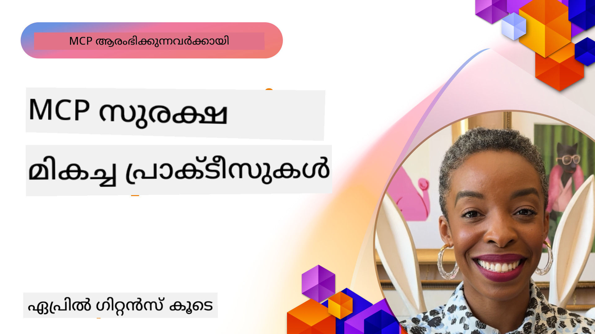

<!--
CO_OP_TRANSLATOR_METADATA:
{
  "original_hash": "1c767a35642f753127dc08545c25a290",
  "translation_date": "2025-12-11T11:22:04+00:00",
  "source_file": "02-Security/README.md",
  "language_code": "ml"
}
-->
# MCP സുരക്ഷ: AI സിസ്റ്റങ്ങൾക്കായുള്ള സമഗ്ര സംരക്ഷണം

_(ഈ പാഠത്തിന്റെ വീഡിയോ കാണാൻ മുകളിൽ ചിത്രത്തിൽ ക്ലിക്ക് ചെയ്യുക)_

സുരക്ഷ AI സിസ്റ്റം രൂപകൽപ്പനയുടെ അടിസ്ഥാനമാണ്, അതുകൊണ്ടുതന്നെ ഞങ്ങൾ അതിനെ നമ്മുടെ രണ്ടാം വിഭാഗമായി മുൻഗണന നൽകുന്നു. ഇത് Microsoft-ന്റെ [Secure Future Initiative](https://www.microsoft.com/security/blog/2025/04/17/microsofts-secure-by-design-journey-one-year-of-success/) ൽ നിന്നുള്ള **Secure by Design** സിദ്ധാന്തവുമായി പൊരുത്തപ്പെടുന്നു.

Model Context Protocol (MCP) AI-നിർഭരിച്ച ആപ്ലിക്കേഷനുകൾക്ക് ശക്തമായ പുതിയ കഴിവുകൾ നൽകുന്നു, എന്നാൽ പരമ്പരാഗത സോഫ്റ്റ്‌വെയർ അപകടങ്ങളിൽനിന്ന് മുകളിൽ പോകുന്ന പ്രത്യേക സുരക്ഷാ വെല്ലുവിളികളും പരിചയപ്പെടുത്തുന്നു. MCP സിസ്റ്റങ്ങൾ സ്ഥാപിതമായ സുരക്ഷാ പ്രശ്നങ്ങൾ (സുരക്ഷിത കോഡിംഗ്, കുറഞ്ഞ അധികാരം, സപ്ലൈ ചെയിൻ സുരക്ഷ) കൂടാതെ പ്രോംപ്റ്റ് ഇൻജക്ഷൻ, ടൂൾ വിഷം, സെഷൻ ഹൈജാക്കിംഗ്, കൺഫ്യൂസ്ഡ് ഡെപ്യൂട്ടി ആക്രമണങ്ങൾ, ടോക്കൺ പാസ്സ്ത്രൂ ദുർബലതകൾ, ഡൈനാമിക് കഴിവ് മാറ്റം എന്നിവ ഉൾപ്പെടുന്ന പുതിയ AI-നിർഭരിച്ച ഭീഷണികൾ നേരിടുന്നു.

ഈ പാഠം MCP നടപ്പാക്കലുകളിൽ ഏറ്റവും പ്രധാനപ്പെട്ട സുരക്ഷാ അപകടങ്ങൾ പരിശോധിക്കുന്നു—പ്രാമാണീകരണം, അധികാരം, അധിക അനുമതികൾ, പരോക്ഷ പ്രോംപ്റ്റ് ഇൻജക്ഷൻ, സെഷൻ സുരക്ഷ, കൺഫ്യൂസ്ഡ് ഡെപ്യൂട്ടി പ്രശ്നങ്ങൾ, ടോക്കൺ മാനേജ്മെന്റ്, സപ്ലൈ ചെയിൻ ദുർബലതകൾ എന്നിവ ഉൾപ്പെടുന്നു. ഈ അപകടങ്ങൾ കുറയ്ക്കാൻ പ്രായോഗിക നിയന്ത്രണങ്ങളും മികച്ച രീതികളും നിങ്ങൾക്ക് പഠിക്കാം, കൂടാതെ Microsoft Prompt Shields, Azure Content Safety, GitHub Advanced Security പോലുള്ള Microsoft പരിഹാരങ്ങൾ ഉപയോഗിച്ച് നിങ്ങളുടെ MCP വിന്യാസം ശക്തിപ്പെടുത്താം.

## പഠന ലക്ഷ്യങ്ങൾ

ഈ പാഠം അവസാനിക്കുന്നതിന് മുമ്പ്, നിങ്ങൾക്ക് കഴിയും:

- **MCP-നിർഭരിച്ച ഭീഷണികൾ തിരിച്ചറിയുക**: പ്രോംപ്റ്റ് ഇൻജക്ഷൻ, ടൂൾ വിഷം, അധിക അനുമതികൾ, സെഷൻ ഹൈജാക്കിംഗ്, കൺഫ്യൂസ്ഡ് ഡെപ്യൂട്ടി പ്രശ്നങ്ങൾ, ടോക്കൺ പാസ്സ്ത്രൂ ദുർബലതകൾ, സപ്ലൈ ചെയിൻ അപകടങ്ങൾ എന്നിവ ഉൾപ്പെടെ MCP സിസ്റ്റങ്ങളിലെ പ്രത്യേക സുരക്ഷാ അപകടങ്ങൾ തിരിച്ചറിയുക
- **സുരക്ഷാ നിയന്ത്രണങ്ങൾ പ്രയോഗിക്കുക**: ശക്തമായ പ്രാമാണീകരണം, കുറഞ്ഞ അധികാരം, സുരക്ഷിത ടോക്കൺ മാനേജ്മെന്റ്, സെഷൻ സുരക്ഷാ നിയന്ത്രണങ്ങൾ, സപ്ലൈ ചെയിൻ പരിശോധന എന്നിവ ഉൾപ്പെടെ ഫലപ്രദമായ പരിഹാരങ്ങൾ നടപ്പിലാക്കുക
- **Microsoft സുരക്ഷാ പരിഹാരങ്ങൾ ഉപയോഗിക്കുക**: MCP വർക്ക്‌ലോഡ് സംരക്ഷണത്തിനായി Microsoft Prompt Shields, Azure Content Safety, GitHub Advanced Security മനസ്സിലാക്കി വിന്യസിക്കുക
- **ടൂൾ സുരക്ഷ സ്ഥിരീകരിക്കുക**: ടൂൾ മെറ്റാഡേറ്റാ പരിശോധനയുടെ പ്രാധാന്യം തിരിച്ചറിയുക, ഡൈനാമിക് മാറ്റങ്ങൾ നിരീക്ഷിക്കുക, പരോക്ഷ പ്രോംപ്റ്റ് ഇൻജക്ഷൻ ആക്രമണങ്ങളിൽ നിന്ന് പ്രതിരോധിക്കുക
- **മികച്ച രീതികൾ സംയോജിപ്പിക്കുക**: സ്ഥാപിതമായ സുരക്ഷാ അടിസ്ഥാനങ്ങൾ (സുരക്ഷിത കോഡിംഗ്, സെർവർ ഹാർഡനിംഗ്, സീറോ ട്രസ്റ്റ്) MCP-നിർഭരിച്ച നിയന്ത്രണങ്ങളുമായി സംയോജിപ്പിച്ച് സമഗ്ര സംരക്ഷണം ഉറപ്പാക്കുക

# MCP സുരക്ഷാ ആർക്കിടെക്ചർ & നിയന്ത്രണങ്ങൾ

ആധുനിക MCP നടപ്പാക്കലുകൾ പരമ്പരാഗത സോഫ്റ്റ്‌വെയർ സുരക്ഷയും AI-നിർഭരിച്ച ഭീഷണികളും പരിഹരിക്കുന്ന പാളിപ്പടിയുള്ള സുരക്ഷാ സമീപനങ്ങൾ ആവശ്യമാണ്. വേഗത്തിൽ വികസിക്കുന്ന MCP സ്പെസിഫിക്കേഷൻ അതിന്റെ സുരക്ഷാ നിയന്ത്രണങ്ങൾ മെച്ചപ്പെടുത്തുന്നു, എന്റർപ്രൈസ് സുരക്ഷാ ആർക്കിടെക്ചറുകളുമായി മികച്ച സംയോജനം സാധ്യമാക്കുന്നു, കൂടാതെ സ്ഥാപിതമായ മികച്ച രീതികൾ പിന്തുടരുന്നു.

[Microsoft Digital Defense Report](https://aka.ms/mddr) ൽ നിന്നുള്ള ഗവേഷണം കാണിക്കുന്നു **റിപ്പോർട്ട് ചെയ്ത 98% ലംഘനങ്ങൾ ശക്തമായ സുരക്ഷാ ശുചിത്വം പാലിച്ചാൽ തടയാനാകും**. ഏറ്റവും ഫലപ്രദമായ സംരക്ഷണ തന്ത്രം അടിസ്ഥാന സുരക്ഷാ പ്രാക്ടീസുകളും MCP-നിർഭരിച്ച നിയന്ത്രണങ്ങളും സംയോജിപ്പിക്കുന്നതാണ്—സ്ഥാപിതമായ സുരക്ഷാ നടപടികൾ മൊത്തം സുരക്ഷാ അപകടം കുറയ്ക്കുന്നതിൽ ഏറ്റവും പ്രഭാവശാലിയാണ്.

## നിലവിലെ സുരക്ഷാ സ്ഥിതി

> **കുറിപ്പ്:** ഈ വിവരങ്ങൾ MCP സുരക്ഷാ മാനദണ്ഡങ്ങൾ **2025 ഓഗസ്റ്റ് 18** ന്റെ നിലയിൽ പ്രതിഫലിപ്പിക്കുന്നു. MCP പ്രോട്ടോക്കോൾ വേഗത്തിൽ വികസിക്കുന്നു, ഭാവിയിലെ നടപ്പാക്കലുകൾ പുതിയ പ്രാമാണീകരണ മാതൃകകളും മെച്ചപ്പെട്ട നിയന്ത്രണങ്ങളും പരിചയപ്പെടുത്താം. ഏറ്റവും പുതിയ മാർഗ്ഗനിർദ്ദേശങ്ങൾക്ക് നിലവിലെ [MCP Specification](https://spec.modelcontextprotocol.io/), [MCP GitHub repository](https://github.com/modelcontextprotocol), [സുരക്ഷാ മികച്ച രീതികൾ ഡോക്യുമെന്റേഷൻ](https://modelcontextprotocol.io/specification/2025-06-18/basic/security_best_practices) സന്ദർശിക്കുക.

### MCP പ്രാമാണീകരണത്തിന്റെ വികാസം

MCP സ്പെസിഫിക്കേഷൻ പ്രാമാണീകരണത്തിലും അധികാരത്തിലും വലിയ പുരോഗതി കൈവരിച്ചു:

- **ആദ്യകാല സമീപനം**: പ്രാരംഭ സ്പെസിഫിക്കേഷനുകൾ ഡെവലപ്പർമാർക്ക് കസ്റ്റം പ്രാമാണീകരണ സെർവറുകൾ നടപ്പിലാക്കേണ്ടതുണ്ടായിരുന്നു, MCP സെർവറുകൾ OAuth 2.0 Authorization Server ആയി പ്രവർത്തിച്ച് ഉപയോക്തൃ പ്രാമാണീകരണം നേരിട്ട് കൈകാര്യം ചെയ്യുന്നു
- **നിലവിലെ സ്റ്റാൻഡേർഡ് (2025-06-18)**: MCP സെർവറുകൾ Microsoft Entra ID പോലുള്ള ബാഹ്യ ഐഡന്റിറ്റി പ്രൊവൈഡർമാർക്ക് പ്രാമാണീകരണം ഡെലിഗേറ്റ് ചെയ്യാൻ അനുവദിക്കുന്നു, സുരക്ഷാ നില മെച്ചപ്പെടുത്തുകയും നടപ്പാക്കൽ സങ്കീർണ്ണത കുറയ്ക്കുകയും ചെയ്യുന്നു
- **ട്രാൻസ്പോർട്ട് ലെയർ സുരക്ഷ**: പ്രാദേശിക (STDIO)യും ദൂരസ്ഥ (Streamable HTTP) കണക്ഷനുകൾക്കും ശരിയായ പ്രാമാണീകരണ മാതൃകകളോടെ സുരക്ഷിത ട്രാൻസ്പോർട്ട് സംവിധാനങ്ങൾക്ക് മെച്ചപ്പെട്ട പിന്തുണ

## പ്രാമാണീകരണവും അധികാരവും സുരക്ഷ

### നിലവിലെ സുരക്ഷാ വെല്ലുവിളികൾ

ആധുനിക MCP നടപ്പാക്കലുകൾക്ക് നിരവധി പ്രാമാണീകരണവും അധികാരവും വെല്ലുവിളികൾ നേരിടുന്നു:

### അപകടങ്ങളും ഭീഷണികളും

- **തെറ്റായ അധികാര ലജിക്**: MCP സെർവറുകളിൽ തെറ്റായ അധികാര നടപ്പാക്കൽ സങ്കീർണ്ണമായ ഡാറ്റ വെളിപ്പെടുത്തുകയും തെറ്റായ ആക്സസ് നിയന്ത്രണങ്ങൾ പ്രയോഗിക്കുകയും ചെയ്യാം
- **OAuth ടോക്കൺ കവർച്ച**: പ്രാദേശിക MCP സെർവർ ടോക്കൺ മോഷണം ആക്രമികൾക്ക് സെർവറുകളായി വേഷം മാറി ഡൗൺസ്ട്രീം സേവനങ്ങൾ ആക്സസ് ചെയ്യാൻ അനുവദിക്കുന്നു
- **ടോക്കൺ പാസ്സ്ത്രൂ ദുർബലതകൾ**: തെറ്റായ ടോക്കൺ കൈകാര്യം സുരക്ഷാ നിയന്ത്രണങ്ങൾ മറികടക്കാനും ഉത്തരവാദിത്വം നഷ്ടപ്പെടാനും കാരണമാകുന്നു
- **അധിക അനുമതികൾ**: അധിക അധികാരമുള്ള MCP സെർവർകൾ കുറഞ്ഞ അധികാര സിദ്ധാന്തം ലംഘിക്കുകയും ആക്രമണ സാധ്യതകൾ വർദ്ധിപ്പിക്കുകയും ചെയ്യുന്നു

#### ടോക്കൺ പാസ്സ്ത്രൂ: ഒരു ഗുരുതരമായ വിരുദ്ധ മാതൃക

നിലവിലെ MCP അധികാര സ്പെസിഫിക്കേഷനിൽ **ടോക്കൺ പാസ്സ്ത്രൂ കർശനമായി നിരോധിച്ചിരിക്കുന്നു** അതിന്റെ ഗുരുതരമായ സുരക്ഷാ പ്രത്യാഘാതങ്ങൾ കാരണം:

##### സുരക്ഷാ നിയന്ത്രണങ്ങൾ മറികടക്കൽ
- MCP സെർവറുകളും ഡൗൺസ്ട്രീം API-കളും (റേറ്റ് ലിമിറ്റിംഗ്, അഭ്യർത്ഥന പരിശോധന, ട്രാഫിക് നിരീക്ഷണം) പോലുള്ള നിർണായക സുരക്ഷാ നിയന്ത്രണങ്ങൾ നടപ്പിലാക്കുന്നു, അവ ശരിയായ ടോക്കൺ പരിശോധനയിൽ ആശ്രയിച്ചിരിക്കുന്നു
- ക്ലയന്റ്-ടു-API ടോക്കൺ നേരിട്ട് ഉപയോഗിക്കുന്നത് ഈ നിർണായക സംരക്ഷണങ്ങൾ മറികടക്കുന്നു, സുരക്ഷാ ആർക്കിടെക്ചർ തകർക്കുന്നു

##### ഉത്തരവാദിത്വവും ഓഡിറ്റ് വെല്ലുവിളികളും  
- MCP സെർവർകൾക്ക് അപ്സ്ട്രീം ടോക്കൺ ഉപയോഗിക്കുന്ന ക്ലയന്റുകൾ തമ്മിൽ വ്യത്യാസം കാണാനാകില്ല, ഓഡിറ്റ് ട്രെയിലുകൾ തകരാറിലാകും
- ഡൗൺസ്ട്രീം റിസോഴ്‌സ് സെർവർ ലോഗുകൾ തെറ്റായ അഭ്യർത്ഥന ഉറവിടങ്ങൾ കാണിക്കുന്നു, യഥാർത്ഥ MCP സെർവർ ഇടനിലക്കാരെ മറയ്ക്കുന്നു
- സംഭവ പരിശോധനയും അനുസരണ ഓഡിറ്റും വളരെ പ്രയാസകരമാകും

##### ഡാറ്റ എക്സ്ഫില്ട്രേഷൻ അപകടങ്ങൾ
- പരിശോധനയില്ലാത്ത ടോക്കൺ അവകാശങ്ങൾ മോഷ്ടിച്ച ആക്രമികൾക്ക് MCP സെർവറുകൾ പ്രോക്സി ആയി ഉപയോഗിച്ച് ഡാറ്റ എക്സ്ഫില്ട്രേറ്റ് ചെയ്യാൻ അനുവദിക്കുന്നു
- വിശ്വാസ പരിധി ലംഘനങ്ങൾ അനധികൃത ആക്സസ് മാതൃകകൾക്ക് വഴി തുറക്കുന്നു

##### ബഹുസേവന ആക്രമണ മാർഗ്ഗങ്ങൾ
- കവർച്ചയുള്ള ടോക്കണുകൾ പല സേവനങ്ങളും സ്വീകരിക്കുമ്പോൾ ബന്ധിപ്പിച്ച സിസ്റ്റങ്ങൾക്കിടയിൽ ലാറ്ററൽ മൂവ്മെന്റ് സാധ്യമാകും
- ടോക്കൺ ഉറവിടങ്ങൾ സ്ഥിരീകരിക്കാൻ കഴിയാത്തപ്പോൾ സേവനങ്ങൾ തമ്മിലുള്ള വിശ്വാസം ലംഘിക്കപ്പെടാം

### സുരക്ഷാ നിയന്ത്രണങ്ങളും പരിഹാരങ്ങളും

**ഗുരുതരമായ സുരക്ഷാ ആവശ്യകതകൾ:**

> **ആവശ്യമാണ്**: MCP സെർവർകൾ **MCP സെർവറിന് വ്യക്തമായി നൽകിയിട്ടില്ലാത്ത ടോക്കണുകൾ സ്വീകരിക്കരുത്**

#### പ്രാമാണീകരണവും അധികാര നിയന്ത്രണങ്ങളും

- **കഠിനമായ അധികാര അവലോകനം**: MCP സെർവർ അധികാര ലജിക് സമഗ്രമായി ഓഡിറ്റ് ചെയ്ത് മാത്രമേ ഉദ്ദേശിച്ച ഉപയോക്താക്കളും ക്ലയന്റുകളും സങ്കീർണ്ണ ഡാറ്റ ആക്സസ് ചെയ്യാൻ കഴിയൂ എന്ന് ഉറപ്പാക്കുക
  - **നടപ്പാക്കൽ മാർഗ്ഗനിർദ്ദേശം**: [Azure API Management as Authentication Gateway for MCP Servers](https://techcommunity.microsoft.com/blog/integrationsonazureblog/azure-api-management-your-auth-gateway-for-mcp-servers/4402690)
  - **ഐഡന്റിറ്റി സംയോജനം**: [Microsoft Entra ID ഉപയോഗിച്ച് MCP സെർവർ പ്രാമാണീകരണം](https://den.dev/blog/mcp-server-auth-entra-id-session/)

- **സുരക്ഷിത ടോക്കൺ മാനേജ്മെന്റ്**: [Microsoft-ന്റെ ടോക്കൺ പരിശോധനയും ലൈഫ്‌സൈക്കിൾ മികച്ച രീതികളും](https://learn.microsoft.com/en-us/entra/identity-platform/access-tokens) നടപ്പിലാക്കുക
  - ടോക്കൺ ഓഡിയൻസ് അവകാശങ്ങൾ MCP സെർവർ ഐഡന്റിറ്റിയുമായി പൊരുത്തപ്പെടുന്നത് പരിശോധിക്കുക
  - ശരിയായ ടോക്കൺ റൊട്ടേഷൻ, കാലഹരണ നയം നടപ്പിലാക്കുക
  - ടോക്കൺ റിപ്ലേ ആക്രമണങ്ങളും അനധികൃത ഉപയോഗവും തടയുക

- **സംരക്ഷിത ടോക്കൺ സംഭരണം**: വിശ്രമത്തിലും ട്രാൻസിറ്റിലും എൻക്രിപ്ഷൻ ഉപയോഗിച്ച് ടോക്കൺ സംഭരണം സുരക്ഷിതമാക്കുക
  - **മികച്ച രീതികൾ**: [Secure Token Storage and Encryption Guidelines](https://youtu.be/uRdX37EcCwg?si=6fSChs1G4glwXRy2)

#### ആക്സസ് നിയന്ത്രണ നടപ്പാക്കൽ

- **കുറഞ്ഞ അധികാര സിദ്ധാന്തം**: MCP സെർവർകൾക്ക് ആവശ്യമായ കുറഞ്ഞ അനുമതികൾ മാത്രം നൽകുക
  - അനുമതി അവലോകനവും അപ്ഡേറ്റുകളും സ്ഥിരമായി നടത്തുക, അധികാര വർദ്ധന തടയുക
  - **Microsoft ഡോക്യുമെന്റേഷൻ**: [Secure Least-Privileged Access](https://learn.microsoft.com/entra/identity-platform/secure-least-privileged-access)

- **റോൾ അടിസ്ഥാന ആക്സസ് നിയന്ത്രണം (RBAC)**: സൂക്ഷ്മമായ റോളുകൾ നിയോഗിക്കുക
  - റോളുകൾ പ്രത്യേക റിസോഴ്‌സുകൾക്കും പ്രവർത്തനങ്ങൾക്കും കർശനമായി പരിധി നിശ്ചയിക്കുക
  - വ്യാപകമായ അല്ലെങ്കിൽ അനാവശ്യ അനുമതികൾ ഒഴിവാക്കുക, ആക്രമണ സാധ്യതകൾ കുറയ്ക്കുക

- **തുടർച്ചയായ അനുമതി നിരീക്ഷണം**: ആക്സസ് ഓഡിറ്റിംഗ്, നിരീക്ഷണം തുടർച്ചയായി നടപ്പിലാക്കുക
  - അനുമതി ഉപയോഗ മാതൃകകൾ അനോമലികൾക്കായി നിരീക്ഷിക്കുക
  - അധികം അല്ലെങ്കിൽ ഉപയോഗിക്കാത്ത അധികാരങ്ങൾ ഉടൻ പരിഹരിക്കുക

## AI-നിർഭരിച്ച സുരക്ഷാ ഭീഷണികൾ

### പ്രോംപ്റ്റ് ഇൻജക്ഷൻ & ടൂൾ മാനിപ്പുലേഷൻ ആക്രമണങ്ങൾ

ആധുനിക MCP നടപ്പാക്കലുകൾ പരമ്പരാഗത സുരക്ഷാ നടപടികൾ പൂർണ്ണമായി പരിഹരിക്കാനാകാത്ത സങ്കീർണ്ണ AI-നിർഭരിച്ച ആക്രമണ മാർഗ്ഗങ്ങൾ നേരിടുന്നു:

#### **പരോക്ഷ പ്രോംപ്റ്റ് ഇൻജക്ഷൻ (ക്രോസ്-ഡൊമെയ്ൻ പ്രോംപ്റ്റ് ഇൻജക്ഷൻ)**

**പരോക്ഷ പ്രോംപ്റ്റ് ഇൻജക്ഷൻ** MCP-സജ്ജമായ AI സിസ്റ്റങ്ങളിൽ ഏറ്റവും ഗുരുതരമായ ദുർബലതകളിലൊന്നാണ്. ആക്രമികൾ ദുഷ്ട നിർദ്ദേശങ്ങൾ ബാഹ്യ ഉള്ളടക്കത്തിൽ—ഡോക്യുമെന്റുകൾ, വെബ് പേജുകൾ, ഇമെയിലുകൾ, ഡാറ്റാ സ്രോതസ്സുകൾ—ചേർത്ത് AI സിസ്റ്റങ്ങൾ അവയെ സാധുവായ കമാൻഡുകളായി പ്രോസസ് ചെയ്യുന്നു.

**ആക്രമണ സാഹചര്യങ്ങൾ:**
- **ഡോക്യുമെന്റ് അടിസ്ഥാന ഇൻജക്ഷൻ**: പ്രോസസ് ചെയ്ത ഡോക്യുമെന്റുകളിൽ മറഞ്ഞിരിക്കുന്ന ദുഷ്ട നിർദ്ദേശങ്ങൾ AI-നെ അനിഷ്ട പ്രവർത്തനങ്ങൾ നടത്താൻ പ്രേരിപ്പിക്കുന്നു
- **വെബ് ഉള്ളടക്ക ദുരുപയോഗം**: സ്ക്രാപ്പ് ചെയ്തപ്പോൾ AI പെരുമാറ്റം മാനിപ്പുലേറ്റ് ചെയ്യുന്ന പ്രോംപ്റ്റുകൾ ഉൾക്കൊള്ളുന്ന കവർച്ചയുള്ള വെബ് പേജുകൾ
- **ഇമെയിൽ അടിസ്ഥാന ആക്രമണങ്ങൾ**: ഇമെയിലുകളിൽ ദുഷ്ട പ്രോംപ്റ്റുകൾ AI അസിസ്റ്റന്റുകൾക്ക് വിവരങ്ങൾ ചോർത്തുകയോ അനധികൃത പ്രവർത്തനങ്ങൾ നടത്തുകയോ ചെയ്യാൻ കാരണമാകുന്നു
- **ഡാറ്റാ സ്രോതസ്സുകളുടെ മലിനീകരണം**: MCP സിസ്റ്റങ്ങൾക്ക് ദുഷ്ട ഉള്ളടക്കം നൽകുന്ന കവർച്ചയുള്ള ഡാറ്റാബേസുകൾ അല്ലെങ്കിൽ API-കൾ

**യഥാർത്ഥ ലോക പ്രത്യാഘാതം**: ഈ ആക്രമണങ്ങൾ ഡാറ്റ എക്സ്ഫില്ട്രേഷൻ, സ്വകാര്യത ലംഘനം, ഹാനികരമായ ഉള്ളടക്കം സൃഷ്ടിക്കൽ, ഉപയോക്തൃ ഇടപെടലുകളുടെ മാനിപ്പുലേഷൻ എന്നിവക്ക് കാരണമാകാം. വിശദമായ വിശകലനത്തിന് [Prompt Injection in MCP (Simon Willison)](https://simonwillison.net/2025/Apr/9/mcp-prompt-injection/) കാണുക.

#### **ടൂൾ വിഷം ആക്രമണങ്ങൾ**

**ടൂൾ വിഷം** MCP ടൂളുകൾ നിർവചിക്കുന്ന മെറ്റാഡേറ്റയെ ലക്ഷ്യമിടുന്നു, LLM-കൾ ടൂൾ വിവരണങ്ങളും പാരാമീറ്റർ നിർവചനങ്ങളും എങ്ങനെ വ്യാഖ്യാനിക്കുന്നുവെന്ന് ദുരുപയോഗം ചെയ്യുന്നു.

**ആക്രമണ രീതി:**
- **മെറ്റാഡേറ്റാ മാനിപ്പുലേഷൻ**: ആക്രമികൾ ടൂൾ വിവരണങ്ങളിൽ, പാരാമീറ്റർ നിർവചനങ്ങളിൽ, ഉപയോഗ ഉദാഹരണങ്ങളിൽ ദുഷ്ട നിർദ്ദേശങ്ങൾ ചേർക്കുന്നു
- **അദൃശ്യ നിർദ്ദേശങ്ങൾ**: ടൂൾ മെറ്റാഡേറ്റയിൽ മറഞ്ഞിരിക്കുന്ന പ്രോംപ്റ്റുകൾ AI മോഡലുകൾ പ്രോസസ് ചെയ്യുന്നു, മനുഷ്യ ഉപയോക്താക്കൾക്ക് കാണാനാകില്ല
- **ഡൈനാമിക് ടൂൾ മാറ്റം ("റഗ് പുൾസ്")**: ഉപയോക്താക്കൾ അംഗീകരിച്ച ടൂളുകൾ പിന്നീട് അനുമതി ഇല്ലാതെ ദുഷ്ട പ്രവർത്തനങ്ങൾ നടത്താൻ മാറ്റപ്പെടുന്നു
- **പാരാമീറ്റർ ഇൻജക്ഷൻ**: മോഡൽ പെരുമാറ്റത്തെ സ്വാധീനിക്കുന്ന ടൂൾ പാരാമീറ്റർ സ്കീമകളിൽ ദുഷ്ട ഉള്ളടക്കം ചേർക്കുന്നു

**ഹോസ്റ്റഡ് സെർവർ അപകടങ്ങൾ**: ദൂര MCP സെർവർകൾക്ക് ഉപയോക്തൃ അംഗീകാരം കഴിഞ്ഞ് ടൂൾ നിർവചനങ്ങൾ അപ്ഡേറ്റ് ചെയ്യാൻ കഴിയും, മുൻപ് സുരക്ഷിതമായ ടൂളുകൾ ദുഷ്ടമായി മാറുന്ന സാഹചര്യങ്ങൾ സൃഷ്ടിക്കുന്നു. സമഗ്ര വിശകലനത്തിന് [Tool Poisoning Attacks (Invariant Labs)](https://invariantlabs.ai/blog/mcp-security-notification-tool-poisoning-attacks) കാണുക.

#### **കൂടുതൽ AI ആക്രമണ മാർഗ്ഗങ്ങൾ**

- **ക്രോസ്-ഡൊമെയ്
- **അധികാര പരിശോധന**: അധികാരം നടപ്പിലാക്കുന്ന MCP സെർവറുകൾ എല്ലാ ഇൻബൗണ്ട് അഭ്യർത്ഥനകളും പരിശോധിക്കണം, ഓതന്റിക്കേഷനായി സെഷനുകളിൽ ആശ്രയിക്കരുത്  
- **സുരക്ഷിത സെഷൻ സൃഷ്ടി**: ക്രിപ്‌റ്റോഗ്രാഫിക് സുരക്ഷിതവും നിർണായകമല്ലാത്ത സെഷൻ ഐഡികൾ സുരക്ഷിത റാൻഡം നമ്പർ ജനറേറ്ററുകൾ ഉപയോഗിച്ച് സൃഷ്ടിക്കുക  
- **ഉപയോക്തൃ-നിർദ്ദിഷ്ട ബന്ധം**: സെഷൻ ഐഡികളെ `<user_id>:<session_id>` പോലുള്ള ഫോർമാറ്റുകൾ ഉപയോഗിച്ച് ഉപയോക്തൃ-നിർദ്ദിഷ്ട വിവരങ്ങളുമായി ബന്ധിപ്പിച്ച് ക്രോസ്-ഉപയോക്തൃ സെഷൻ ദുരുപയോഗം തടയുക  
- **സെഷൻ ജീവിതചക്രം മാനേജ്മെന്റ്**: ദുര്‍ബലതാ വിൻഡോകൾ പരിമിതപ്പെടുത്താൻ ശരിയായ കാലഹരണവും റൊട്ടേഷനും അസാധുവാക്കലും നടപ്പിലാക്കുക  
- **ട്രാൻസ്പോർട്ട് സുരക്ഷ**: സെഷൻ ഐഡി ഇടപെടൽ തടയാൻ എല്ലാ ആശയവിനിമയത്തിനും നിർബന്ധമായും HTTPS ഉപയോഗിക്കുക  

### കൺഫ്യൂസ്ഡ് ഡെപ്യൂട്ടി പ്രശ്നം

**കൺഫ്യൂസ്ഡ് ഡെപ്യൂട്ടി പ്രശ്നം** MCP സെർവറുകൾ ക്ലയന്റുകളും മൂന്നാംകക്ഷി സേവനങ്ങളും തമ്മിൽ ഓതന്റിക്കേഷൻ പ്രോക്സികളായി പ്രവർത്തിക്കുമ്പോൾ സംഭവിക്കുന്നു, ഇത് സ്റ്റാറ്റിക് ക്ലയന്റ് ഐഡി ദുരുപയോഗത്തിലൂടെ അധികാര ബൈപാസ് സാധ്യതകൾ സൃഷ്ടിക്കുന്നു.

#### **ആക്രമണ രീതി & അപകടങ്ങൾ**

- **കുക്കി അടിസ്ഥാനമുള്ള സമ്മത ബൈപാസ്**: മുൻ ഉപയോക്തൃ ഓതന്റിക്കേഷൻ സമ്മത കുക്കികൾ സൃഷ്ടിക്കുന്നു, ആക്രമികൾ ക്രാഫ്റ്റ് ചെയ്ത റീഡയറക്ട് URI-കളോടെ ദുഷ്പ്രവർത്തന അധികാര അഭ്യർത്ഥനകൾ വഴി അവ ഉപയോഗിക്കുന്നു  
- **അധികാര കോഡ് മോഷണം**: നിലവിലുള്ള സമ്മത കുക്കികൾ അധികാര സെർവറുകൾക്ക് സമ്മത സ്ക്രീനുകൾ ഒഴിവാക്കി കോഡുകൾ ആക്രമി നിയന്ത്രിത എന്റ്പോയിന്റുകളിലേക്ക് റീഡയറക്ട് ചെയ്യാൻ കാരണമാകാം  
- **അനധികൃത API ആക്‌സസ്**: മോഷ്ടിച്ച അധികാര കോഡുകൾ ടോക്കൺ എക്സ്ചേഞ്ചും ഉപയോക്തൃ നകൽ ചെയ്യലും അനുവദിക്കുന്നു, വ്യക്തമായ അംഗീകാരം ഇല്ലാതെ  

#### **പരിഹാര തന്ത്രങ്ങൾ**

**നിർബന്ധിത നിയന്ത്രണങ്ങൾ:**  
- **സ്പഷ്ട സമ്മത ആവശ്യകതകൾ**: സ്റ്റാറ്റിക് ക്ലയന്റ് ഐഡികൾ ഉപയോഗിക്കുന്ന MCP പ്രോക്സി സെർവറുകൾ ഓരോ ഡൈനാമിക് രജിസ്റ്റർ ചെയ്ത ക്ലയന്റിനും ഉപയോക്തൃ സമ്മതം നേടണം  
- **OAuth 2.1 സുരക്ഷ നടപ്പാക്കൽ**: എല്ലാ അധികാര അഭ്യർത്ഥനകൾക്കും PKCE ഉൾപ്പെടെ നിലവിലെ OAuth സുരക്ഷാ മികച്ച രീതികൾ പാലിക്കുക  
- **ക്ലയന്റ് കർശന പരിശോധന**: റീഡയറക്ട് URI-കളും ക്ലയന്റ് ഐഡന്റിഫയർസും കർശനമായി പരിശോധിച്ച് ദുരുപയോഗം തടയുക  

### ടോക്കൺ പാസ്ത്രൂ വൾണറബിലിറ്റികൾ  

**ടോക്കൺ പാസ്ത്രൂ** MCP സെർവറുകൾ ക്ലയന്റ് ടോക്കണുകൾ ശരിയായ പരിശോധന കൂടാതെ സ്വീകരിച്ച് ഡൗൺസ്ട്രീം API-കളിലേക്ക് ഫോർവേഡ് ചെയ്യുന്നത് പ്രത്യക്ഷമായ ഒരു ആന്റി-പാറ്റേൺ ആണ്, ഇത് MCP അധികാര നിർദ്ദേശങ്ങൾ ലംഘിക്കുന്നു.

#### **സുരക്ഷാ പ്രത്യാഘാതങ്ങൾ**

- **നിയന്ത്രണം മറികടക്കൽ**: നേരിട്ട് ക്ലയന്റ്-ടു-API ടോക്കൺ ഉപയോഗം പ്രധാന റേറ്റ് ലിമിറ്റിംഗ്, പരിശോധന, നിരീക്ഷണ നിയന്ത്രണങ്ങൾ മറികടക്കുന്നു  
- **ഓഡിറ്റ് ട്രെയിൽ തകരാർ**: അപ്പ്സ്ട്രീം നൽകിയ ടോക്കണുകൾ ക്ലയന്റ് തിരിച്ചറിയൽ അസാധ്യമായി മാറ്റി, സംഭവ അന്വേഷണം തടയുന്നു  
- **പ്രോക്സി അടിസ്ഥാന ഡാറ്റ എക്സ്ഫില്ട്രേഷൻ**: അസാധുവായ ടോക്കണുകൾ ദുഷ്പ്രവർത്തകർക്ക് സെർവറുകൾ പ്രോക്സികളായി ഉപയോഗിക്കാൻ അനുവദിക്കുന്നു  
- **ട്രസ്റ്റ് ബൗണ്ടറി ലംഘനങ്ങൾ**: ടോക്കൺ ഉറവിടങ്ങൾ സ്ഥിരീകരിക്കാൻ കഴിയാത്തപ്പോൾ ഡൗൺസ്ട്രീം സേവനങ്ങളുടെ വിശ്വാസം ലംഘിക്കപ്പെടാം  
- **മൾട്ടി-സർവീസ് ആക്രമണ വ്യാപനം**: പല സേവനങ്ങളിലും സ്വീകരിച്ച തകർന്ന ടോക്കണുകൾ ലാറ്ററൽ മൂവ്മെന്റ് അനുവദിക്കുന്നു  

#### **ആവശ്യമായ സുരക്ഷാ നിയന്ത്രണങ്ങൾ**

**അപരിവർത്തന ആവശ്യകതകൾ:**  
- **ടോക്കൺ പരിശോധന**: MCP സെർവറുകൾ MCP സെർവറിനായി വ്യക്തമായി നൽകിയിട്ടില്ലാത്ത ടോക്കണുകൾ സ്വീകരിക്കരുത്  
- **ഓഡിയൻസ് പരിശോധന**: ടോക്കൺ ഓഡിയൻസ് അവകാശങ്ങൾ MCP സെർവറിന്റെ ഐഡന്റിറ്റിയുമായി പൊരുത്തപ്പെടുന്നുണ്ടെന്ന് എല്ലായ്പ്പോഴും പരിശോധിക്കുക  
- **ശരിയായ ടോക്കൺ ജീവിതചക്രം**: സുരക്ഷിത റൊട്ടേഷൻ പ്രാക്ടീസുകളോടെ ചെറുകാലം ആക്സസ് ടോക്കണുകൾ നടപ്പിലാക്കുക  

## AI സിസ്റ്റങ്ങൾക്കുള്ള സപ്ലൈ ചെയിൻ സുരക്ഷ

സപ്ലൈ ചെയിൻ സുരക്ഷ പരമ്പരാഗത സോഫ്റ്റ്‌വെയർ ആശ്രിതത്വങ്ങളെക്കാൾ വ്യാപിച്ച് മുഴുവൻ AI പരിസ്ഥിതിയെയും ഉൾക്കൊള്ളുന്നു. ആധുനിക MCP നടപ്പാക്കലുകൾ എല്ലാ AI-സംബന്ധിത ഘടകങ്ങളും കർശനമായി പരിശോധിക്കുകയും നിരീക്ഷിക്കുകയും വേണം, ഓരോ ഘടകവും സിസ്റ്റം സമഗ്രതയ്ക്ക് അപകടസാധ്യതകൾ സൃഷ്ടിക്കുന്നു.

### വിപുലീകരിച്ച AI സപ്ലൈ ചെയിൻ ഘടകങ്ങൾ

**പരമ്പരാഗത സോഫ്റ്റ്‌വെയർ ആശ്രിതത്വങ്ങൾ:**  
- ഓപ്പൺ സോഴ്‌സ് ലൈബ്രറികളും ഫ്രെയിംവർകുകളും  
- കണ്ടെയ്‌നർ ഇമേജുകളും ബേസ് സിസ്റ്റങ്ങളും  
- ഡെവലപ്പ്മെന്റ് ടൂളുകളും ബിൽഡ് പൈപ്പ്ലൈനുകളും  
- ഇൻഫ്രാസ്ട്രക്ചർ ഘടകങ്ങളും സേവനങ്ങളും  

**AI-നിർദ്ദിഷ്ട സപ്ലൈ ചെയിൻ ഘടകങ്ങൾ:**  
- **ഫൗണ്ടേഷൻ മോഡലുകൾ**: വിവിധ പ്രൊവൈഡർമാരിൽ നിന്നുള്ള പ്രീ-ട്രെയിൻ ചെയ്ത മോഡലുകൾ, പ്രൊവനൻസ് പരിശോധന ആവശ്യമാണ്  
- **എംബെഡ്ഡിംഗ് സേവനങ്ങൾ**: ബാഹ്യ വെക്ടറൈസേഷൻ, സെമാന്റിക് സെർച്ച് സേവനങ്ങൾ  
- **കോൺടെക്സ്റ്റ് പ്രൊവൈഡർമാർ**: ഡാറ്റാ സ്രോതസ്സുകൾ, നോളജ് ബേസുകൾ, ഡോക്യുമെന്റ് റിപോസിറ്ററികൾ  
- **മൂന്നാം കക്ഷി API-കൾ**: ബാഹ്യ AI സേവനങ്ങൾ, ML പൈപ്പ്ലൈനുകൾ, ഡാറ്റാ പ്രോസസ്സിംഗ് എന്റ്പോയിന്റുകൾ  
- **മോഡൽ ആർട്ടിഫാക്ടുകൾ**: വെയിറ്റുകൾ, കോൺഫിഗറേഷനുകൾ, ഫൈൻ-ട്യൂൺ ചെയ്ത മോഡൽ വകഭേദങ്ങൾ  
- **ട്രെയിനിംഗ് ഡാറ്റാ സ്രോതസ്സുകൾ**: മോഡൽ ട്രെയിനിംഗിനും ഫൈൻ-ട്യൂണിംഗിനും ഉപയോഗിക്കുന്ന ഡാറ്റാസെറ്റുകൾ  

### സമഗ്ര സപ്ലൈ ചെയിൻ സുരക്ഷാ തന്ത്രം

#### **ഘടക പരിശോധന & വിശ്വാസം**  
- **പ്രൊവനൻസ് പരിശോധന**: എല്ലാ AI ഘടകങ്ങളും സംയോജിപ്പിക്കുന്നതിന് മുമ്പ് ഉറവിടം, ലൈസൻസിംഗ്, സമഗ്രത പരിശോധിക്കുക  
- **സുരക്ഷാ വിലയിരുത്തൽ**: മോഡലുകൾ, ഡാറ്റാ സ്രോതസ്സുകൾ, AI സേവനങ്ങൾ എന്നിവയ്ക്ക് ദുര്‍ബലതാ സ്കാനുകളും സുരക്ഷാ അവലോകനങ്ങളും നടത്തുക  
- **പ്രതിഷ്ഠ വിശകലനം**: AI സേവന ദാതാക്കളുടെ സുരക്ഷാ ട്രാക്ക് റെക്കോർഡും പ്രാക്ടീസുകളും വിലയിരുത്തുക  
- **അനുസരണ പരിശോധന**: എല്ലാ ഘടകങ്ങളും സംഘടനയുടെ സുരക്ഷാ, നിയമാനുസൃത ആവശ്യകതകൾ പാലിക്കുന്നുണ്ടെന്ന് ഉറപ്പാക്കുക  

#### **സുരക്ഷിത ഡിപ്ലോയ്മെന്റ് പൈപ്പ്ലൈനുകൾ**  
- **ഓട്ടോമേറ്റഡ് CI/CD സുരക്ഷ**: ഓട്ടോമേറ്റഡ് ഡിപ്ലോയ്മെന്റ് പൈപ്പ്ലൈനുകളിൽ സുരക്ഷാ സ്കാനിംഗ് സംയോജിപ്പിക്കുക  
- **ആർട്ടിഫാക്ട് സമഗ്രത**: എല്ലാ ഡിപ്ലോയ്ഡ് ആർട്ടിഫാക്ടുകൾക്കും (കോഡ്, മോഡലുകൾ, കോൺഫിഗറേഷനുകൾ) ക്രിപ്‌റ്റോഗ്രാഫിക് പരിശോധന നടപ്പിലാക്കുക  
- **ഘട്ടംപ്രകാരമുള്ള ഡിപ്ലോയ്മെന്റ്**: ഓരോ ഘട്ടത്തിലും സുരക്ഷാ പരിശോധനയോടെ പ്രോഗ്രസീവ് ഡിപ്ലോയ്മെന്റ് തന്ത്രങ്ങൾ ഉപയോഗിക്കുക  
- **വിശ്വാസമുള്ള ആർട്ടിഫാക്ട് റിപോസിറ്ററികൾ**: സ്ഥിരീകരിച്ച, സുരക്ഷിത ആർട്ടിഫാക്ട് രജിസ്ട്രികളും റിപോസിറ്ററികളും മാത്രം ഉപയോഗിച്ച് ഡിപ്ലോയ് ചെയ്യുക  

#### **നിരന്തര നിരീക്ഷണവും പ്രതികരണവും**  
- **ആശ്രിതത്വ സ്കാനിംഗ്**: എല്ലാ സോഫ്റ്റ്‌വെയർ, AI ഘടക ആശ്രിതത്വങ്ങൾക്കും തുടർച്ചയായ ദുര്‍ബലതാ നിരീക്ഷണം  
- **മോഡൽ നിരീക്ഷണം**: മോഡൽ പെരുമാറ്റം, പ്രകടന വ്യതിയാനം, സുരക്ഷാ അനോമലികൾ തുടർച്ചയായി വിലയിരുത്തുക  
- **സേവന ആരോഗ്യ ട്രാക്കിംഗ്**: ബാഹ്യ AI സേവനങ്ങളുടെ ലഭ്യത, സുരക്ഷാ സംഭവങ്ങൾ, നയം മാറ്റങ്ങൾ നിരീക്ഷിക്കുക  
- **ഭീഷണി ബുദ്ധിമുട്ട് സംയോജനം**: AI, ML സുരക്ഷാ അപകടങ്ങൾക്കുള്ള ഭീഷണി ഫീഡുകൾ ഉൾപ്പെടുത്തുക  

#### **ആക്‌സസ് നിയന്ത്രണവും കുറഞ്ഞ അവകാശവും**  
- **ഘടക-നിലവാര അനുമതികൾ**: ബിസിനസ് ആവശ്യകത അടിസ്ഥാനമാക്കി മോഡലുകൾ, ഡാറ്റ, സേവനങ്ങൾ ആക്‌സസ് നിയന്ത്രിക്കുക  
- **സേവന അക്കൗണ്ട് മാനേജ്മെന്റ്**: കുറഞ്ഞ അവശ്യ അനുമതികളോടെ സമർപ്പിത സേവന അക്കൗണ്ടുകൾ നടപ്പിലാക്കുക  
- **നെറ്റ്‌വർക്ക് സെഗ്മെന്റേഷൻ**: AI ഘടകങ്ങളെ വേർതിരിച്ച് സേവനങ്ങൾ തമ്മിലുള്ള നെറ്റ്‌വർക്ക് ആക്‌സസ് പരിമിതപ്പെടുത്തുക  
- **API ഗേറ്റ്വേ നിയന്ത്രണങ്ങൾ**: ബാഹ്യ AI സേവനങ്ങളിലേക്കുള്ള ആക്‌സസ് നിയന്ത്രിക്കാൻ കേന്ദ്രകൃത API ഗേറ്റ്വേകൾ ഉപയോഗിക്കുക  

#### **സംഭവ പ്രതികരണവും പുനരുദ്ധാരണവും**  
- **വേഗത്തിലുള്ള പ്രതികരണ നടപടികൾ**: തകർന്ന AI ഘടകങ്ങൾ പാച്ച് ചെയ്യുന്നതിനും മാറ്റുന്നതിനും സ്ഥാപിത പ്രക്രിയകൾ  
- **ക്രെഡൻഷ്യൽ റൊട്ടേഷൻ**: രഹസ്യങ്ങൾ, API കീകൾ, സേവന ക്രെഡൻഷ്യലുകൾ ഓട്ടോമേറ്റഡ് റൊട്ടേഷൻ സിസ്റ്റങ്ങൾ  
- **റോൾബാക്ക് ശേഷികൾ**: മുൻ അറിയപ്പെട്ട നല്ല പതിപ്പുകളിലേക്ക് വേഗത്തിൽ മടങ്ങാനുള്ള കഴിവ്  
- **സപ്ലൈ ചെയിൻ ലംഘന പുനരുദ്ധാരണ**: അപ്പ്സ്ട്രീം AI സേവന തകർച്ചകൾക്ക് പ്രതികരിക്കുന്ന പ്രത്യേക പ്രക്രിയകൾ  

### മൈക്രോസോഫ്റ്റ് സുരക്ഷാ ഉപകരണങ്ങളും സംയോജനം

**GitHub Advanced Security** സമഗ്ര സപ്ലൈ ചെയിൻ സംരക്ഷണം നൽകുന്നു, അതിൽ ഉൾപ്പെടുന്നു:  
- **സീക്രട്ട് സ്കാനിംഗ്**: റിപോസിറ്ററികളിൽ ക്രെഡൻഷ്യലുകൾ, API കീകൾ, ടോക്കണുകൾ ഓട്ടോമേറ്റഡ് കണ്ടെത്തൽ  
- **ആശ്രിതത്വ സ്കാനിംഗ്**: ഓപ്പൺ സോഴ്‌സ് ആശ്രിതത്വങ്ങൾക്കും ലൈബ്രറികൾക്കും ദുര്‍ബലതാ വിലയിരുത്തൽ  
- **CodeQL വിശകലനം**: സുരക്ഷാ ദുര്‍ബലതകളും കോഡിംഗ് പ്രശ്നങ്ങളും സ്റ്റാറ്റിക് കോഡ് വിശകലനം  
- **സപ്ലൈ ചെയിൻ ഇൻസൈറ്റ്സ്**: ആശ്രിതത്വ ആരോഗ്യവും സുരക്ഷാ നിലയും ദൃശ്യവൽക്കരണം  

**Azure DevOps & Azure Repos സംയോജനം:**  
- മൈക്രോസോഫ്റ്റ് ഡെവലപ്പ്മെന്റ് പ്ലാറ്റ്‌ഫോമുകളിൽ സുരക്ഷാ സ്കാനിംഗ് സംയോജനം  
- AI വർക്ക്‌ലോഡുകൾക്കുള്ള Azure പൈപ്പ്ലൈനുകളിൽ ഓട്ടോമേറ്റഡ് സുരക്ഷാ പരിശോധനകൾ  
- സുരക്ഷിത AI ഘടക ഡിപ്ലോയ്മെന്റിനുള്ള നയം നടപ്പാക്കൽ  

**മൈക്രോസോഫ്റ്റ് ആഭ്യന്തര പ്രാക്ടീസുകൾ:**  
മൈക്രോസോഫ്റ്റ് എല്ലാ ഉൽപ്പന്നങ്ങളിലും വ്യാപകമായ സപ്ലൈ ചെയിൻ സുരക്ഷാ പ്രാക്ടീസുകൾ നടപ്പിലാക്കുന്നു. [The Journey to Secure the Software Supply Chain at Microsoft](https://devblogs.microsoft.com/engineering-at-microsoft/the-journey-to-secure-the-software-supply-chain-at-microsoft/) എന്ന ലിങ്കിൽ തെളിവുകൾ പഠിക്കാം.  

## ഫൗണ്ടേഷൻ സുരക്ഷ മികച്ച പ്രാക്ടീസുകൾ

MCP നടപ്പാക്കലുകൾ നിങ്ങളുടെ സംഘടനയുടെ നിലവിലുള്ള സുരക്ഷാ നിലപാടുകൾ ഏറ്റെടുക്കുകയും വികസിപ്പിക്കുകയും ചെയ്യുന്നു. അടിസ്ഥാന സുരക്ഷാ പ്രാക്ടീസുകൾ ശക്തിപ്പെടുത്തുന്നത് AI സിസ്റ്റങ്ങൾക്കും MCP ഡിപ്ലോയ്മെന്റുകൾക്കും സമഗ്ര സുരക്ഷ വർദ്ധിപ്പിക്കുന്നു.

### കോർ സുരക്ഷാ അടിസ്ഥാനങ്ങൾ

#### **സുരക്ഷിത ഡെവലപ്പ്മെന്റ് പ്രാക്ടീസുകൾ**  
- **OWASP അനുസരണം**: [OWASP Top 10](https://owasp.org/www-project-top-ten/) വെബ് ആപ്ലിക്കേഷൻ ദുര്‍ബലതകളിൽ നിന്ന് സംരക്ഷണം  
- **AI-നിർദ്ദിഷ്ട സംരക്ഷണങ്ങൾ**: [OWASP Top 10 for LLMs](https://genai.owasp.org/download/43299/?tmstv=1731900559) നിയന്ത്രണങ്ങൾ നടപ്പിലാക്കുക  
- **സുരക്ഷിത രഹസ്യ മാനേജ്മെന്റ്**: ടോക്കണുകൾ, API കീകൾ, സങ്കീർണ്ണ കോൺഫിഗറേഷൻ ഡാറ്റയ്ക്കായി സമർപ്പിത വാൾട്ടുകൾ ഉപയോഗിക്കുക  
- **എൻഡ്-ടു-എൻഡ് എൻക്രിപ്ഷൻ**: എല്ലാ ആപ്ലിക്കേഷൻ ഘടകങ്ങളിലും ഡാറ്റാ ഫ്ലോകളിലും സുരക്ഷിത ആശയവിനിമയം നടപ്പിലാക്കുക  
- **ഇൻപുട്ട് പരിശോധന**: എല്ലാ ഉപയോക്തൃ ഇൻപുട്ടുകളും API പാരാമീറ്ററുകളും ഡാറ്റാ സ്രോതസ്സുകളും കർശനമായി പരിശോധിക്കുക  

#### **ഇൻഫ്രാസ്ട്രക്ചർ ഹാർഡനിംഗ്**  
- **മൾട്ടി-ഫാക്ടർ ഓതന്റിക്കേഷൻ**: എല്ലാ അഡ്മിനിസ്ട്രേറ്റീവ്, സേവന അക്കൗണ്ടുകൾക്കും നിർബന്ധമായ MFA  
- **പാച്ച് മാനേജ്മെന്റ്**: ഓപ്പറേറ്റിംഗ് സിസ്റ്റങ്ങൾ, ഫ്രെയിംവർക്ക്, ആശ്രിതത്വങ്ങൾ ഓട്ടോമേറ്റഡ്, സമയബന്ധിത പാച്ചിംഗ്  
- **ഐഡന്റിറ്റി പ്രൊവൈഡർ സംയോജനം**: എന്റർപ്രൈസ് ഐഡന്റിറ്റി പ്രൊവൈഡറുകൾ (Microsoft Entra ID, Active Directory) വഴി കേന്ദ്രകൃത ഐഡന്റിറ്റി മാനേജ്മെന്റ്  
- **നെറ്റ്‌വർക്ക് സെഗ്മെന്റേഷൻ**: MCP ഘടകങ്ങളുടെ ലാറ്ററൽ മൂവ്മെന്റ് സാധ്യത പരിമിതപ്പെടുത്താൻ ലജിക്കൽ വേർതിരിവ്  
- **കുറഞ്ഞ അവകാശ സിദ്ധാന്തം**: എല്ലാ സിസ്റ്റം ഘടകങ്ങൾക്കും അക്കൗണ്ടുകൾക്കും കുറഞ്ഞ അവശ്യ അനുമതികൾ  

#### **സുരക്ഷാ നിരീക്ഷണവും കണ്ടെത്തലും**  
- **സമഗ്ര ലോഗിംഗ്**: MCP ക്ലയന്റ്-സെർവർ ഇടപെടലുകൾ ഉൾപ്പെടെ AI ആപ്ലിക്കേഷൻ പ്രവർത്തനങ്ങളുടെ വിശദമായ ലോഗിംഗ്  
- **SIEM സംയോജനം**: അനോമലി കണ്ടെത്തലിനായി കേന്ദ്രകൃത സുരക്ഷാ വിവര, ഇവന്റ് മാനേജ്മെന്റ്  
- **ബിഹേവിയറൽ അനലിറ്റിക്സ്**: സിസ്റ്റം, ഉപയോക്തൃ പെരുമാറ്റത്തിലെ അസാധാരണ മാതൃകകൾ കണ്ടെത്താൻ AI-സഹായിത നിരീക്ഷണം  
- **ഭീഷണി ബുദ്ധിമുട്ട്**: ബാഹ്യ ഭീഷണി ഫീഡുകളും IOCs സംയോജിപ്പിക്കൽ  
- **സംഭവ പ്രതികരണം**: സുരക്ഷാ സംഭവങ്ങൾ കണ്ടെത്തൽ, പ്രതികരണം, പുനരുദ്ധാരണത്തിനുള്ള നന്നായി നിർവചിച്ച പ്രക്രിയകൾ  

#### **സീറോ ട്രസ്റ്റ് ആർക്കിടെക്ചർ**  
- **ഒരിക്കലും വിശ്വസിക്കരുത്, എല്ലായ്പ്പോഴും പരിശോധിക്കുക**: ഉപയോക്താക്കളെയും ഉപകരണങ്ങളെയും നെറ്റ്‌വർക്ക് കണക്ഷനുകളെയും തുടർച്ചയായി പരിശോധിക്കുക  
- **മൈക്രോ-സെഗ്മെന്റേഷൻ**: വ്യക്തിഗത വർക്ക്‌ലോഡുകളും സേവനങ്ങളും വേർതിരിക്കുന്ന സൂക്ഷ്മ നെറ്റ്‌വർക്ക് നിയന്ത്രണങ്ങൾ  
- **ഐഡന്റിറ്റി-കേന്ദ്രിത സുരക്ഷ**: നെറ്റ്‌വർക്ക് സ്ഥലം അല്ല, സ്ഥിരീകരിച്ച ഐഡന്റിറ്റികൾ അടിസ്ഥാനമാക്കിയുള്ള സുരക്ഷാ നയങ്ങൾ  
- **തുടർച്ചയായ അപകടം വിലയിരുത്തൽ**: നിലവിലെ സാഹചര്യവും പെരുമാറ്റവും അടിസ്ഥാനമാക്കി ഡൈനാമ
- [MCP സെക്യൂരിറ്റി റിസർച്ച് ബ്രിഫിംഗ് (Wiz Security)](https://www.wiz.io/blog/mcp-security-research-briefing#remote-servers-22)

### **Microsoft സെക്യൂരിറ്റി സൊല്യൂഷൻസ്**
- [Microsoft Prompt Shields ഡോക്യുമെന്റേഷൻ](https://learn.microsoft.com/azure/ai-services/content-safety/concepts/jailbreak-detection)
- [Azure Content Safety സർവീസ്](https://learn.microsoft.com/azure/ai-services/content-safety/)
- [Microsoft Entra ID സെക്യൂരിറ്റി](https://learn.microsoft.com/entra/identity-platform/secure-least-privileged-access)
- [Azure Token Management മികച്ച പ്രാക്ടീസുകൾ](https://learn.microsoft.com/entra/identity-platform/access-tokens)
- [GitHub അഡ്വാൻസ്ഡ് സെക്യൂരിറ്റി](https://github.com/security/advanced-security)

### **ഇംപ്ലിമെന്റേഷൻ ഗൈഡുകൾ & ട്യൂട്ടോറിയലുകൾ**
- [Azure API Management as MCP Authentication Gateway](https://techcommunity.microsoft.com/blog/integrationsonazureblog/azure-api-management-your-auth-gateway-for-mcp-servers/4402690)
- [Microsoft Entra ID Authentication with MCP Servers](https://den.dev/blog/mcp-server-auth-entra-id-session/)
- [സുരക്ഷിത ടോക്കൺ സ്റ്റോറേജ് ആൻഡ് എൻക്രിപ്ഷൻ (വീഡിയോ)](https://youtu.be/uRdX37EcCwg?si=6fSChs1G4glwXRy2)

### **DevOps & സപ്ലൈ ചെയിൻ സെക്യൂരിറ്റി**
- [Azure DevOps സെക്യൂരിറ്റി](https://azure.microsoft.com/products/devops)
- [Azure Repos സെക്യൂരിറ്റി](https://azure.microsoft.com/products/devops/repos/)
- [Microsoft സപ്ലൈ ചെയിൻ സെക്യൂരിറ്റി ജേർണി](https://devblogs.microsoft.com/engineering-at-microsoft/the-journey-to-secure-the-software-supply-chain-at-microsoft/)

## **കൂടുതൽ സെക്യൂരിറ്റി ഡോക്യുമെന്റേഷൻ**

സമ്പൂർണ സെക്യൂരിറ്റി മാർഗ്ഗനിർദ്ദേശങ്ങൾക്ക്, ഈ വിഭാഗത്തിലെ പ്രത്യേക ഡോക്യുമെന്റുകൾ കാണുക:

- **[MCP സെക്യൂരിറ്റി മികച്ച പ്രാക്ടീസുകൾ 2025](./mcp-security-best-practices-2025.md)** - MCP ഇംപ്ലിമെന്റേഷനുകൾക്കുള്ള സമ്പൂർണ സെക്യൂരിറ്റി മികച്ച പ്രാക്ടീസുകൾ
- **[Azure Content Safety ഇംപ്ലിമെന്റേഷൻ](./azure-content-safety-implementation.md)** - Azure Content Safety ഇന്റഗ്രേഷനുള്ള പ്രായോഗിക ഇംപ്ലിമെന്റേഷൻ ഉദാഹരണങ്ങൾ  
- **[MCP സെക്യൂരിറ്റി കൺട്രോളുകൾ 2025](./mcp-security-controls-2025.md)** - MCP ഡിപ്ലോയ്മെന്റുകൾക്കുള്ള ഏറ്റവും പുതിയ സെക്യൂരിറ്റി കൺട്രോളുകളും സാങ്കേതിക വിദ്യകളും
- **[MCP മികച്ച പ്രാക്ടീസുകൾ ക്വിക്ക് റഫറൻസ്](./mcp-best-practices.md)** - MCP സെക്യൂരിറ്റി പ്രാക്ടീസുകൾക്കുള്ള ക്വിക്ക് റഫറൻസ് ഗൈഡ്

---

## What's Next

Next: [Chapter 3: Getting Started](../03-GettingStarted/README.md)

---

<!-- CO-OP TRANSLATOR DISCLAIMER START -->
**അസൂയാ**:  
ഈ രേഖ AI വിവർത്തന സേവനം [Co-op Translator](https://github.com/Azure/co-op-translator) ഉപയോഗിച്ച് വിവർത്തനം ചെയ്തതാണ്. നാം കൃത്യതയ്ക്ക് ശ്രമിച്ചിട്ടുണ്ടെങ്കിലും, സ്വയം പ്രവർത്തിക്കുന്ന വിവർത്തനങ്ങളിൽ പിശകുകൾ അല്ലെങ്കിൽ തെറ്റുകൾ ഉണ്ടാകാമെന്ന് ദയവായി ശ്രദ്ധിക്കുക. അതിന്റെ മാതൃഭാഷയിലുള്ള യഥാർത്ഥ രേഖ പ്രാമാണികമായ ഉറവിടമായി കണക്കാക്കണം. നിർണായകമായ വിവരങ്ങൾക്ക്, പ്രൊഫഷണൽ മനുഷ്യ വിവർത്തനം ശുപാർശ ചെയ്യപ്പെടുന്നു. ഈ വിവർത്തനത്തിന്റെ ഉപയോഗത്തിൽ നിന്നുണ്ടാകുന്ന ഏതെങ്കിലും തെറ്റിദ്ധാരണകൾക്കോ തെറ്റായ വ്യാഖ്യാനങ്ങൾക്കോ ഞങ്ങൾ ഉത്തരവാദികളല്ല.
<!-- CO-OP TRANSLATOR DISCLAIMER END -->