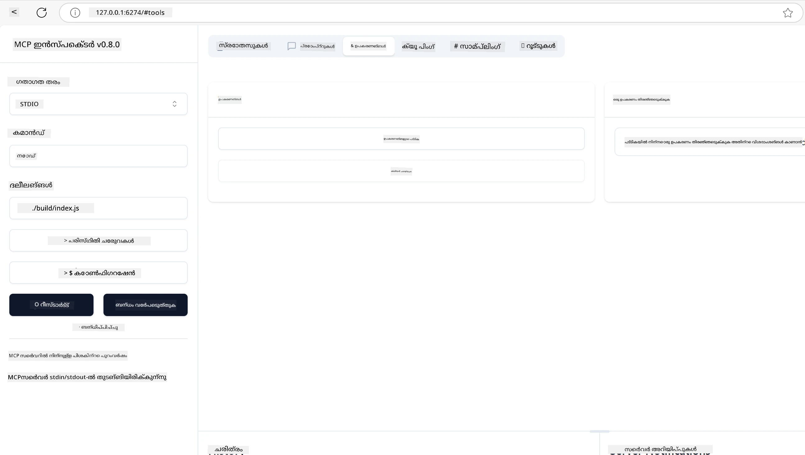
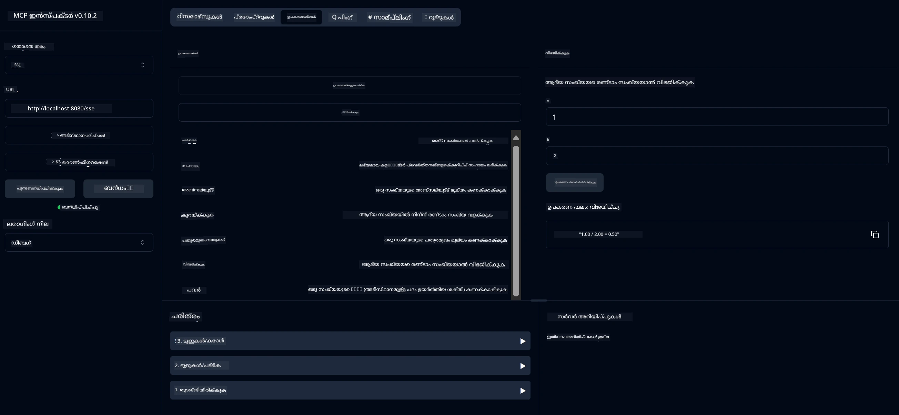
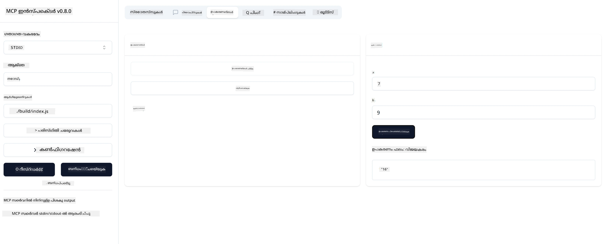

# MCP ഉപയോഗിച്ച് ആരംഭിക്കുന്നത്

Model Context Protocol (MCP) ഉപയോഗിച്ച് നിങ്ങളുടെ ആദ്യപടി സ്വാഗതം! നിങ്ങൾ MCP-യിൽ പുതുമയുള്ളവരായാലോ അല്ലെങ്കിൽ നിങ്ങളുടെ അറിവ് കൂടുതൽ ആഴത്തിൽ ആക്കാൻ ആഗ്രഹിക്കുന്നവരായാലോ, ഈ ഗൈഡ് MCP-യുടെ അടിസ്ഥാന സജ്ജീകരണവും വികസന പ്രക്രിയയും വഴി നിങ്ങളെ നയിക്കും. MCP എങ്ങനെ AI മോഡലുകളും ആപ്ലിക്കേഷനുകളും തമ്മിൽ സുതാര്യമായ ഇന്റഗ്രേഷൻ സാധ്യമാക്കുന്നു എന്ന് നിങ്ങൾ കണ്ടെത്തും, കൂടാതെ MCP-പവർഡ് സൊല്യൂഷനുകൾ നിർമ്മിക്കാനും പരീക്ഷിക്കാനും നിങ്ങളുടെ പരിസ്ഥിതി എങ്ങനെ വേഗത്തിൽ തയ്യാറാക്കാമെന്ന് പഠിക്കും.

> TLDR; നിങ്ങൾ AI ആപ്ലിക്കേഷനുകൾ നിർമ്മിക്കുന്നുവെങ്കിൽ, നിങ്ങളുടെ LLM (വലിയ ഭാഷാ മോഡൽ) കൂടുതൽ അറിവുള്ളതാക്കാൻ നിങ്ങൾക്ക് ടൂളുകളും മറ്റ് വിഭവങ്ങളും ചേർക്കാമെന്ന് നിങ്ങൾ അറിയാം. എന്നാൽ ആ ടൂളുകളും വിഭവങ്ങളും ഒരു സെർവറിൽ വെച്ചാൽ, ആ ആപ്പ്, സെർവർ ശേഷികളും LLM ഉള്ളതോ ഇല്ലാതെയോ ഏതൊരു ക്ലയന്റും ഉപയോഗിക്കാം.

## അവലോകനം

ഈ പാഠം MCP പരിസ്ഥിതികൾ സജ്ജമാക്കുന്നതിനും നിങ്ങളുടെ ആദ്യ MCP ആപ്ലിക്കേഷനുകൾ നിർമ്മിക്കുന്നതിനും പ്രായോഗിക മാർഗ്ഗനിർദ്ദേശങ്ങൾ നൽകുന്നു. ആവശ്യമായ ടൂളുകളും ഫ്രെയിംവർക്കുകളും സജ്ജമാക്കുന്നത്, അടിസ്ഥാന MCP സെർവറുകൾ നിർമ്മിക്കുന്നത്, ഹോസ്റ്റ് ആപ്ലിക്കേഷനുകൾ സൃഷ്ടിക്കുന്നത്, നിങ്ങളുടെ നടപ്പാക്കലുകൾ പരീക്ഷിക്കുന്നതും നിങ്ങൾ പഠിക്കും.

Model Context Protocol (MCP) ഒരു തുറന്ന പ്രോട്ടോക്കോൾ ആണ്, ആപ്ലിക്കേഷനുകൾ LLM-കൾക്ക് കോൺടെക്സ്റ്റ് നൽകുന്നത് എങ്ങനെ സ്റ്റാൻഡേർഡൈസ് ചെയ്യാമെന്ന് നിർവചിക്കുന്നു. MCP-യെ AI ആപ്ലിക്കേഷനുകൾക്കുള്ള USB-C പോർട്ട് പോലെ കരുതുക - ഇത് AI മോഡലുകളെ വ്യത്യസ്ത ഡാറ്റാ സ്രോതസ്സുകളുമായി ടൂളുകളുമായി കണക്റ്റ് ചെയ്യാനുള്ള സ്റ്റാൻഡേർഡൈസ്ഡ് മാർഗം നൽകുന്നു.

## പഠന ലക്ഷ്യങ്ങൾ

ഈ പാഠം അവസാനിക്കുമ്പോൾ, നിങ്ങൾക്ക് കഴിയും:

- C#, Java, Python, TypeScript, Rust എന്നിവയിൽ MCP വികസന പരിസ്ഥിതികൾ സജ്ജമാക്കുക
- കസ്റ്റം ഫീച്ചറുകളുള്ള (വിഭവങ്ങൾ, പ്രോംപ്റ്റുകൾ, ടൂളുകൾ) അടിസ്ഥാന MCP സെർവറുകൾ നിർമ്മിച്ച് വിന്യസിക്കുക
- MCP സെർവറുകളുമായി കണക്റ്റ് ചെയ്യുന്ന ഹോസ്റ്റ് ആപ്ലിക്കേഷനുകൾ സൃഷ്ടിക്കുക
- MCP നടപ്പാക്കലുകൾ പരീക്ഷിക്കുകയും ഡീബഗ് ചെയ്യുകയും ചെയ്യുക

## നിങ്ങളുടെ MCP പരിസ്ഥിതി സജ്ജമാക്കൽ

MCP-യുമായി പ്രവർത്തനം ആരംഭിക്കുന്നതിന് മുമ്പ്, നിങ്ങളുടെ വികസന പരിസ്ഥിതിയെ തയ്യാറാക്കുകയും അടിസ്ഥാന പ്രവൃത്തി പ്രവാഹം മനസ്സിലാക്കുകയും ചെയ്യുന്നത് പ്രധാനമാണ്. ഈ വിഭാഗം MCP-യുമായി സുതാര്യമായ തുടക്കം ഉറപ്പാക്കാൻ പ്രാഥമിക സജ്ജീകരണ ഘട്ടങ്ങൾ വഴി നിങ്ങളെ നയിക്കും.

### മുൻകൂട്ടി ആവശ്യങ്ങൾ

MCP വികസനത്തിൽ പ്രവേശിക്കുന്നതിന് മുമ്പ്, നിങ്ങൾക്കുണ്ടാകേണ്ടത്:

- **വികസന പരിസ്ഥിതി**: നിങ്ങളുടെ തിരഞ്ഞെടുക്കുന്ന ഭാഷയിൽ (C#, Java, Python, TypeScript, അല്ലെങ്കിൽ Rust)
- **IDE/എഡിറ്റർ**: Visual Studio, Visual Studio Code, IntelliJ, Eclipse, PyCharm, അല്ലെങ്കിൽ ഏതെങ്കിലും ആധുനിക കോഡ് എഡിറ്റർ
- **പാക്കേജ് മാനേജർമാർ**: NuGet, Maven/Gradle, pip, npm/yarn, അല്ലെങ്കിൽ Cargo
- **API കീകൾ**: ഹോസ്റ്റ് ആപ്ലിക്കേഷനുകളിൽ ഉപയോഗിക്കാൻ ആഗ്രഹിക്കുന്ന ഏതെങ്കിലും AI സേവനങ്ങൾക്ക്

## അടിസ്ഥാന MCP സെർവർ ഘടന

ഒരു MCP സെർവർ സാധാരണയായി ഉൾക്കൊള്ളുന്നു:

- **സെർവർ കോൺഫിഗറേഷൻ**: പോർട്ട്, ഓതന്റിക്കേഷൻ, മറ്റ് ക്രമീകരണങ്ങൾ സജ്ജമാക്കൽ
- **വിഭവങ്ങൾ**: LLM-കൾക്ക് ലഭ്യമാക്കുന്ന ഡാറ്റയും കോൺടെക്സ്റ്റും
- **ടൂളുകൾ**: മോഡലുകൾ വിളിക്കാവുന്ന ഫംഗ്ഷണാലിറ്റി
- **പ്രോംപ്റ്റുകൾ**: ടെക്സ്റ്റ് സൃഷ്ടിക്കാനോ ഘടിപ്പിക്കാനോ ഉപയോഗിക്കുന്ന ടെംപ്ലേറ്റുകൾ

TypeScript-ൽ ഒരു ലളിതമായ ഉദാഹരണം ഇതാ:

```typescript
import { McpServer, ResourceTemplate } from "@modelcontextprotocol/sdk/server/mcp.js";
import { StdioServerTransport } from "@modelcontextprotocol/sdk/server/stdio.js";
import { z } from "zod";

// ഒരു MCP സെർവർ സൃഷ്ടിക്കുക
const server = new McpServer({
  name: "Demo",
  version: "1.0.0"
});

// ഒരു കൂട്ടിച്ചേർക്കൽ ഉപകരണം ചേർക്കുക
server.tool("add",
  { a: z.number(), b: z.number() },
  async ({ a, b }) => ({
    content: [{ type: "text", text: String(a + b) }]
  })
);

// ഒരു ഡൈനാമിക് ഗ്രീറ്റിംഗ് റിസോഴ്‌സ് ചേർക്കുക
server.resource(
  "file",
  // 'list' പാരാമീറ്റർ റിസോഴ്‌സ് ലഭ്യമായ ഫയലുകൾ എങ്ങനെ ലിസ്റ്റ് ചെയ്യുമെന്ന് നിയന്ത്രിക്കുന്നു. അതിനെ undefined ആയി സജ്ജീകരിക്കുന്നത് ഈ റിസോഴ്‌സിനുള്ള ലിസ്റ്റിംഗ് അപ്രാപ്തമാക്കുന്നു.
  new ResourceTemplate("file://{path}", { list: undefined }),
  async (uri, { path }) => ({
    contents: [{
      uri: uri.href,
      text: `File, ${path}!`
    }]
  })
);

// ഫയൽ ഉള്ളടക്കം വായിക്കുന്ന ഒരു ഫയൽ റിസോഴ്‌സ് ചേർക്കുക
server.resource(
  "file",
  new ResourceTemplate("file://{path}", { list: undefined }),
  async (uri, { path }) => {
    let text;
    try {
      text = await fs.readFile(path, "utf8");
    } catch (err) {
      text = `Error reading file: ${err.message}`;
    }
    return {
      contents: [{
        uri: uri.href,
        text
      }]
    };
  }
);

server.prompt(
  "review-code",
  { code: z.string() },
  ({ code }) => ({
    messages: [{
      role: "user",
      content: {
        type: "text",
        text: `Please review this code:\n\n${code}`
      }
    }]
  })
);

// stdin-ൽ സന്ദേശങ്ങൾ സ്വീകരിക്കാൻ തുടങ്ങിയ് stdout-ൽ സന്ദേശങ്ങൾ അയയ്ക്കുക
const transport = new StdioServerTransport();
await server.connect(transport);
```

മുൻപത്തെ കോഡിൽ ഞങ്ങൾ:

- MCP TypeScript SDK-യിൽ നിന്നുള്ള ആവശ്യമായ ക്ലാസുകൾ ഇറക്കുമതി ചെയ്തു.
- പുതിയ MCP സെർവർ ഇൻസ്റ്റൻസ് സൃഷ്ടിച്ച് കോൺഫിഗർ ചെയ്തു.
- കസ്റ്റം ടൂൾ (`calculator`) ഒരു ഹാൻഡ്ലർ ഫംഗ്ഷനോടുകൂടി രജിസ്റ്റർ ചെയ്തു.
- MCP അഭ്യർത്ഥനകൾ കേൾക്കാൻ സെർവർ ആരംഭിച്ചു.

## പരീക്ഷണവും ഡീബഗിംഗും

നിങ്ങളുടെ MCP സെർവർ പരീക്ഷിക്കാൻ തുടങ്ങുന്നതിന് മുമ്പ്, ലഭ്യമായ ടൂളുകളും ഡീബഗിംഗിനുള്ള മികച്ച രീതികളും മനസ്സിലാക്കുന്നത് പ്രധാനമാണ്. ഫലപ്രദമായ പരീക്ഷണം നിങ്ങളുടെ സെർവർ പ്രതീക്ഷിച്ചതുപോലെ പ്രവർത്തിക്കുന്നുണ്ടെന്ന് ഉറപ്പാക്കുകയും പ്രശ്നങ്ങൾ വേഗത്തിൽ കണ്ടെത്തി പരിഹരിക്കാൻ സഹായിക്കുകയും ചെയ്യും. താഴെ നൽകിയിരിക്കുന്ന വിഭാഗം നിങ്ങളുടെ MCP നടപ്പാക്കൽ സാധുവാക്കുന്നതിനുള്ള ശുപാർശ ചെയ്ത സമീപനങ്ങൾ വിശദീകരിക്കുന്നു.

MCP നിങ്ങളുടെ സെർവർ പരീക്ഷിക്കാനും ഡീബഗ് ചെയ്യാനും സഹായിക്കുന്ന ടൂളുകൾ നൽകുന്നു:

- **ഇൻസ്പെക്ടർ ടൂൾ**: ഈ ഗ്രാഫിക്കൽ ഇന്റർഫേസ് നിങ്ങളുടെ സെർവറുമായി കണക്റ്റ് ചെയ്ത് ടൂളുകൾ, പ്രോംപ്റ്റുകൾ, വിഭവങ്ങൾ പരീക്ഷിക്കാൻ അനുവദിക്കുന്നു.
- **curl**: curl പോലുള്ള കമാൻഡ് ലൈൻ ടൂൾ ഉപയോഗിച്ച് അല്ലെങ്കിൽ HTTP കമാൻഡുകൾ സൃഷ്ടിച്ച് പ്രവർത്തിപ്പിക്കാൻ കഴിയുന്ന മറ്റ് ക്ലയന്റുകൾ ഉപയോഗിച്ച് സെർവറുമായി കണക്റ്റ് ചെയ്യാം.

### MCP ഇൻസ്പെക്ടർ ഉപയോഗിക്കൽ

[MCP ഇൻസ്പെക്ടർ](https://github.com/modelcontextprotocol/inspector) ഒരു ദൃശ്യപരമായ പരീക്ഷണ ടൂൾ ആണ്, ഇത് നിങ്ങളെ സഹായിക്കുന്നു:

1. **സെർവർ ശേഷികൾ കണ്ടെത്തുക**: ലഭ്യമായ വിഭവങ്ങൾ, ടൂളുകൾ, പ്രോംപ്റ്റുകൾ സ്വയം കണ്ടെത്തുക
2. **ടൂൾ എക്സിക്യൂഷൻ പരീക്ഷിക്കുക**: വ്യത്യസ്ത പാരാമീറ്ററുകൾ പരീക്ഷിച്ച് പ്രതികരണങ്ങൾ യഥാർത്ഥ സമയത്ത് കാണുക
3. **സെർവർ മെറ്റാഡേറ്റ കാണുക**: സെർവർ വിവരങ്ങൾ, സ്കീമകൾ, ക്രമീകരണങ്ങൾ പരിശോധിക്കുക

```bash
# ഉദാഹരണത്തിന് TypeScript, MCP ഇൻസ്പെക്ടർ ഇൻസ്റ്റാൾ ചെയ്യുകയും പ്രവർത്തിപ്പിക്കുകയും ചെയ്യുന്നു
npx @modelcontextprotocol/inspector node build/index.js
```

മുകളിൽ കൊടുത്ത കമാൻഡുകൾ പ്രവർത്തിപ്പിക്കുമ്പോൾ, MCP ഇൻസ്പെക്ടർ നിങ്ങളുടെ ബ്രൗസറിൽ ഒരു ലോക്കൽ വെബ് ഇന്റർഫേസ് ആരംഭിക്കും. രജിസ്റ്റർ ചെയ്ത MCP സെർവർകൾ, അവയുടെ ലഭ്യമായ ടൂളുകൾ, വിഭവങ്ങൾ, പ്രോംപ്റ്റുകൾ ഡാഷ്ബോർഡിൽ കാണാൻ കഴിയും. ഈ ഇന്റർഫേസ് ടൂൾ എക്സിക്യൂഷൻ ഇന്ററാക്ടീവ് ആയി പരീക്ഷിക്കാൻ, സെർവർ മെറ്റാഡേറ്റ പരിശോധിക്കാൻ, യഥാർത്ഥ സമയ പ്രതികരണങ്ങൾ കാണാൻ അനുവദിക്കുന്നു, ഇത് MCP സെർവർ നടപ്പാക്കലുകൾ സാധുവാക്കാനും ഡീബഗ് ചെയ്യാനും എളുപ്പമാക്കുന്നു.

ഇതാ അതിന്റെ സ്ക്രീൻഷോട്ട്:



## സാധാരണ സജ്ജീകരണ പ്രശ്നങ്ങളും പരിഹാരങ്ങളും

| പ്രശ്നം | സാധ്യതയുള്ള പരിഹാരം |
|-------|-------------------|
| കണക്ഷൻ നിരസിച്ചു | സെർവർ പ്രവർത്തിക്കുന്നുണ്ടോ, പോർട്ട് ശരിയാണോ പരിശോധിക്കുക |
| ടൂൾ എക്സിക്യൂഷൻ പിശകുകൾ | പാരാമീറ്റർ പരിശോധനയും പിശക് കൈകാര്യം ചെയ്യലും പരിശോധിക്കുക |
| ഓതന്റിക്കേഷൻ പരാജയങ്ങൾ | API കീകളും അനുമതികളും പരിശോധിക്കുക |
| സ്കീമാ പരിശോധന പിശകുകൾ | പാരാമീറ്ററുകൾ നിർവചിച്ച സ്കീമയുമായി പൊരുത്തപ്പെടുന്നുണ്ടോ ഉറപ്പാക്കുക |
| സെർവർ ആരംഭിക്കുന്നില്ല | പോർട്ട് സംഘർഷങ്ങൾ അല്ലെങ്കിൽ അഭാവമുള്ള ആശ്രിതങ്ങൾ പരിശോധിക്കുക |
| CORS പിശകുകൾ | ക്രോസ്-ഓറിജിൻ അഭ്യർത്ഥനകൾക്കായി ശരിയായ CORS ഹെഡറുകൾ ക്രമീകരിക്കുക |
| ഓതന്റിക്കേഷൻ പ്രശ്നങ്ങൾ | ടോക്കൺ സാധുതയും അനുമതികളും പരിശോധിക്കുക |

## ലോക്കൽ വികസനം

ലോക്കൽ വികസനത്തിനും പരീക്ഷണത്തിനും, നിങ്ങൾക്ക് MCP സെർവർകൾ നേരിട്ട് നിങ്ങളുടെ മെഷീനിൽ ഓടിക്കാം:

1. **സെർവർ പ്രോസസ് ആരംഭിക്കുക**: നിങ്ങളുടെ MCP സെർവർ ആപ്ലിക്കേഷൻ ഓടിക്കുക
2. **നെറ്റ്‌വർക്ക് ക്രമീകരിക്കുക**: സെർവർ പ്രതീക്ഷിക്കുന്ന പോർട്ടിൽ ആക്സസിബിൾ ആണെന്ന് ഉറപ്പാക്കുക
3. **ക്ലയന്റുകൾ കണക്റ്റ് ചെയ്യുക**: `http://localhost:3000` പോലുള്ള ലോക്കൽ കണക്ഷൻ URLs ഉപയോഗിക്കുക

```bash
# ഉദാഹരണം: ടൈപ്പ്‌സ്‌ക്രിപ്റ്റ് MCP സെർവർ ലോക്കലായി പ്രവർത്തിപ്പിക്കുന്നു
npm run start
# സെർവർ http://localhost:3000 ൽ പ്രവർത്തിക്കുന്നു
```

## നിങ്ങളുടെ ആദ്യ MCP സെർവർ നിർമ്മിക്കൽ

നാം മുമ്പത്തെ പാഠത്തിൽ [കോർ ആശയങ്ങൾ](/01-CoreConcepts/README.md) പഠിച്ചു, ഇപ്പോൾ ആ അറിവ് പ്രയോഗിക്കാനുള്ള സമയം.

### ഒരു സെർവർ എന്ത് ചെയ്യാൻ കഴിയും

കോഡ് എഴുതാൻ തുടങ്ങുന്നതിന് മുമ്പ്, ഒരു സെർവർ എന്ത് ചെയ്യാൻ കഴിയും എന്ന് ഓർമ്മിപ്പിക്കാം:

ഒരു MCP സെർവർ ഉദാഹരണത്തിന്:

- ലോക്കൽ ഫയലുകളും ഡാറ്റാബേസുകളും ആക്സസ് ചെയ്യാം
- റിമോട്ട് API-കളുമായി കണക്റ്റ് ചെയ്യാം
- കണക്കുകൂട്ടലുകൾ നടത്താം
- മറ്റ് ടൂളുകളുമായി സേവനങ്ങളുമായി ഇന്റഗ്രേറ്റ് ചെയ്യാം
- ഇന്ററാക്ഷനിനായി ഒരു യൂസർ ഇന്റർഫേസ് നൽകാം

ശരി, ഇനി നമുക്ക് എന്ത് ചെയ്യാമെന്ന് അറിയാമെങ്കിൽ, കോഡിംഗ് ആരംഭിക്കാം.

## അഭ്യാസം: ഒരു സെർവർ സൃഷ്ടിക്കൽ

ഒരു സെർവർ സൃഷ്ടിക്കാൻ, നിങ്ങൾക്ക് ഈ ഘട്ടങ്ങൾ പിന്തുടരേണ്ടതാണ്:

- MCP SDK ഇൻസ്റ്റാൾ ചെയ്യുക.
- ഒരു പ്രോജക്ട് സൃഷ്ടിച്ച് പ്രോജക്ട് ഘടന സജ്ജമാക്കുക.
- സെർവർ കോഡ് എഴുതുക.
- സെർവർ പരീക്ഷിക്കുക.

### -1- പ്രോജക്ട് സൃഷ്ടിക്കുക

#### TypeScript

```sh
# പ്രോജക്ട് ഡയറക്ടറി സൃഷ്ടിച്ച് npm പ്രോജക്ട് ആരംഭിക്കുക
mkdir calculator-server
cd calculator-server
npm init -y
```

#### Python

```sh
# പ്രോജക്ട് ഡയറക്ടറി സൃഷ്ടിക്കുക
mkdir calculator-server
cd calculator-server
# ഫോൾഡർ Visual Studio Code-ൽ തുറക്കുക - നിങ്ങൾ വേറൊരു IDE ഉപയോഗിക്കുന്നുവെങ്കിൽ ഇത് ഒഴിവാക്കുക
code .
```

#### .NET

```sh
dotnet new console -n McpCalculatorServer
cd McpCalculatorServer
```

#### Java

Java-ക്കായി, ഒരു Spring Boot പ്രോജക്ട് സൃഷ്ടിക്കുക:

```bash
curl https://start.spring.io/starter.zip \
  -d dependencies=web \
  -d javaVersion=21 \
  -d type=maven-project \
  -d groupId=com.example \
  -d artifactId=calculator-server \
  -d name=McpServer \
  -d packageName=com.microsoft.mcp.sample.server \
  -o calculator-server.zip
```

Zip ഫയൽ എക്സ്ട്രാക്റ്റ് ചെയ്യുക:

```bash
unzip calculator-server.zip -d calculator-server
cd calculator-server
# ഐച്ഛികം ഉപയോഗിക്കാത്ത ടെസ്റ്റ് നീക്കം ചെയ്യുക
rm -rf src/test/java
```

*pom.xml* ഫയലിൽ താഴെ കാണുന്ന പൂർണ്ണ കോൺഫിഗറേഷൻ ചേർക്കുക:

```xml
<?xml version="1.0" encoding="UTF-8"?>
<project xmlns="http://maven.apache.org/POM/4.0.0"
    xmlns:xsi="http://www.w3.org/2001/XMLSchema-instance"
    xsi:schemaLocation="http://maven.apache.org/POM/4.0.0 http://maven.apache.org/xsd/maven-4.0.0.xsd">
    <modelVersion>4.0.0</modelVersion>
    
    <!-- Spring Boot parent for dependency management -->
    <parent>
        <groupId>org.springframework.boot</groupId>
        <artifactId>spring-boot-starter-parent</artifactId>
        <version>3.5.0</version>
        <relativePath />
    </parent>

    <!-- Project coordinates -->
    <groupId>com.example</groupId>
    <artifactId>calculator-server</artifactId>
    <version>0.0.1-SNAPSHOT</version>
    <name>Calculator Server</name>
    <description>Basic calculator MCP service for beginners</description>

    <!-- Properties -->
    <properties>
        <java.version>21</java.version>
        <maven.compiler.source>21</maven.compiler.source>
        <maven.compiler.target>21</maven.compiler.target>
    </properties>

    <!-- Spring AI BOM for version management -->
    <dependencyManagement>
        <dependencies>
            <dependency>
                <groupId>org.springframework.ai</groupId>
                <artifactId>spring-ai-bom</artifactId>
                <version>1.0.0-SNAPSHOT</version>
                <type>pom</type>
                <scope>import</scope>
            </dependency>
        </dependencies>
    </dependencyManagement>

    <!-- Dependencies -->
    <dependencies>
        <dependency>
            <groupId>org.springframework.ai</groupId>
            <artifactId>spring-ai-starter-mcp-server-webflux</artifactId>
        </dependency>
        <dependency>
            <groupId>org.springframework.boot</groupId>
            <artifactId>spring-boot-starter-actuator</artifactId>
        </dependency>
        <dependency>
         <groupId>org.springframework.boot</groupId>
         <artifactId>spring-boot-starter-test</artifactId>
         <scope>test</scope>
      </dependency>
    </dependencies>

    <!-- Build configuration -->
    <build>
        <plugins>
            <plugin>
                <groupId>org.springframework.boot</groupId>
                <artifactId>spring-boot-maven-plugin</artifactId>
            </plugin>
            <plugin>
                <groupId>org.apache.maven.plugins</groupId>
                <artifactId>maven-compiler-plugin</artifactId>
                <configuration>
                    <release>21</release>
                </configuration>
            </plugin>
        </plugins>
    </build>

    <!-- Repositories for Spring AI snapshots -->
    <repositories>
        <repository>
            <id>spring-milestones</id>
            <name>Spring Milestones</name>
            <url>https://repo.spring.io/milestone</url>
            <snapshots>
                <enabled>false</enabled>
            </snapshots>
        </repository>
        <repository>
            <id>spring-snapshots</id>
            <name>Spring Snapshots</name>
            <url>https://repo.spring.io/snapshot</url>
            <releases>
                <enabled>false</enabled>
            </releases>
        </repository>
    </repositories>
</project>
```

#### Rust

```sh
mkdir calculator-server
cd calculator-server
cargo init
```

### -2- ആശ്രിതങ്ങൾ ചേർക്കുക

ഇപ്പോൾ പ്രോജക്ട് സൃഷ്ടിച്ചിട്ടുണ്ടെങ്കിൽ, അടുത്തതായി ആശ്രിതങ്ങൾ ചേർക്കാം:

#### TypeScript

```sh
# ഇതിനകം ഇൻസ്റ്റാൾ ചെയ്തിട്ടില്ലെങ്കിൽ, TypeScript ഗ്ലോബലായി ഇൻസ്റ്റാൾ ചെയ്യുക
npm install typescript -g

# MCP SDKയും സ്കീമാ സാധുതക്കായി Zodയും ഇൻസ്റ്റാൾ ചെയ്യുക
npm install @modelcontextprotocol/sdk zod
npm install -D @types/node typescript
```

#### Python

```sh
# ഒരു വെർച്വൽ എൻവയോൺമെന്റ് സൃഷ്ടിച്ച് ആശ്രിതങ്ങൾ ഇൻസ്റ്റാൾ ചെയ്യുക
python -m venv venv
venv\Scripts\activate
pip install "mcp[cli]"
```

#### Java

```bash
cd calculator-server
./mvnw clean install -DskipTests
```

#### Rust

```sh
cargo add rmcp --features server,transport-io
cargo add serde
cargo add tokio --features rt-multi-thread
```

### -3- പ്രോജക്ട് ഫയലുകൾ സൃഷ്ടിക്കുക

#### TypeScript

*package.json* ഫയൽ തുറന്ന്, സെർവർ നിർമ്മിക്കുകയും ഓടിക്കാനും കഴിയുന്ന വിധം ഉള്ളടക്കം മാറ്റുക:

```json
{
  "name": "calculator-server",
  "version": "1.0.0",
  "main": "index.js",
  "type": "module",
  "scripts": {
    "build": "tsc",
    "start": "npm run build && node ./build/index.js",
  },
  "keywords": [],
  "author": "",
  "license": "ISC",
  "description": "A simple calculator server using Model Context Protocol",
  "dependencies": {
    "@modelcontextprotocol/sdk": "^1.16.0",
    "zod": "^3.25.76"
  },
  "devDependencies": {
    "@types/node": "^24.0.14",
    "typescript": "^5.8.3"
  }
}
```

*tsconfig.json* എന്ന ഫയൽ താഴെ കാണുന്ന ഉള്ളടക്കത്തോടെ സൃഷ്ടിക്കുക:

```json
{
  "compilerOptions": {
    "target": "ES2022",
    "module": "Node16",
    "moduleResolution": "Node16",
    "outDir": "./build",
    "rootDir": "./src",
    "strict": true,
    "esModuleInterop": true,
    "skipLibCheck": true,
    "forceConsistentCasingInFileNames": true
  },
  "include": ["src/**/*"],
  "exclude": ["node_modules"]
}
```

നിങ്ങളുടെ സോഴ്‌സ് കോഡിനായി ഒരു ഡയറക്ടറി സൃഷ്ടിക്കുക:

```sh
mkdir src
touch src/index.ts
```

#### Python

*server.py* എന്ന ഫയൽ സൃഷ്ടിക്കുക

```sh
touch server.py
```

#### .NET

ആവശ്യമായ NuGet പാക്കേജുകൾ ഇൻസ്റ്റാൾ ചെയ്യുക:

```sh
dotnet add package ModelContextProtocol --prerelease
dotnet add package Microsoft.Extensions.Hosting
```

#### Java

Java Spring Boot പ്രോജക്ടുകൾക്കായി, പ്രോജക്ട് ഘടന സ്വയം സൃഷ്ടിക്കപ്പെടും.

#### Rust

Rust-ക്കായി, `cargo init` ഓടിക്കുമ്പോൾ *src/main.rs* ഫയൽ ഡിഫോൾട്ടായി സൃഷ്ടിക്കപ്പെടും. ഫയൽ തുറന്ന് ഡിഫോൾട്ട് കോഡ് നീക്കം ചെയ്യുക.

### -4- സെർവർ കോഡ് സൃഷ്ടിക്കുക

#### TypeScript

*index.ts* എന്ന ഫയൽ സൃഷ്ടിച്ച് താഴെ കാണുന്ന കോഡ് ചേർക്കുക:

```typescript
import { McpServer, ResourceTemplate } from "@modelcontextprotocol/sdk/server/mcp.js";
import { StdioServerTransport } from "@modelcontextprotocol/sdk/server/stdio.js";
import { z } from "zod";
 
// ഒരു MCP സെർവർ സൃഷ്ടിക്കുക
const server = new McpServer({
  name: "Calculator MCP Server",
  version: "1.0.0"
});
```

ഇപ്പോൾ നിങ്ങൾക്ക് ഒരു സെർവർ ഉണ്ടെങ്കിലും, അത് വളരെ കുറച്ച് മാത്രമേ ചെയ്യൂ, അത് പരിഹരിക്കാം.

#### Python

```python
# server.py
from mcp.server.fastmcp import FastMCP

# ഒരു MCP സെർവർ സൃഷ്ടിക്കുക
mcp = FastMCP("Demo")
```

#### .NET

```csharp
using Microsoft.Extensions.DependencyInjection;
using Microsoft.Extensions.Hosting;
using Microsoft.Extensions.Logging;
using ModelContextProtocol.Server;
using System.ComponentModel;

var builder = Host.CreateApplicationBuilder(args);
builder.Logging.AddConsole(consoleLogOptions =>
{
    // Configure all logs to go to stderr
    consoleLogOptions.LogToStandardErrorThreshold = LogLevel.Trace;
});

builder.Services
    .AddMcpServer()
    .WithStdioServerTransport()
    .WithToolsFromAssembly();
await builder.Build().RunAsync();

// add features
```

#### Java

Java-ക്കായി, കോർ സെർവർ ഘടകങ്ങൾ സൃഷ്ടിക്കുക. ആദ്യം, പ്രധാന ആപ്ലിക്കേഷൻ ക്ലാസ് മാറ്റുക:

*src/main/java/com/microsoft/mcp/sample/server/McpServerApplication.java*:

```java
package com.microsoft.mcp.sample.server;

import org.springframework.ai.tool.ToolCallbackProvider;
import org.springframework.ai.tool.method.MethodToolCallbackProvider;
import org.springframework.boot.SpringApplication;
import org.springframework.boot.autoconfigure.SpringBootApplication;
import org.springframework.context.annotation.Bean;
import com.microsoft.mcp.sample.server.service.CalculatorService;

@SpringBootApplication
public class McpServerApplication {

    public static void main(String[] args) {
        SpringApplication.run(McpServerApplication.class, args);
    }
    
    @Bean
    public ToolCallbackProvider calculatorTools(CalculatorService calculator) {
        return MethodToolCallbackProvider.builder().toolObjects(calculator).build();
    }
}
```

കാൽക്കുലേറ്റർ സർവീസ് സൃഷ്ടിക്കുക *src/main/java/com/microsoft/mcp/sample/server/service/CalculatorService.java*:

```java
package com.microsoft.mcp.sample.server.service;

import org.springframework.ai.tool.annotation.Tool;
import org.springframework.stereotype.Service;

/**
 * Service for basic calculator operations.
 * This service provides simple calculator functionality through MCP.
 */
@Service
public class CalculatorService {

    /**
     * Add two numbers
     * @param a The first number
     * @param b The second number
     * @return The sum of the two numbers
     */
    @Tool(description = "Add two numbers together")
    public String add(double a, double b) {
        double result = a + b;
        return formatResult(a, "+", b, result);
    }

    /**
     * Subtract one number from another
     * @param a The number to subtract from
     * @param b The number to subtract
     * @return The result of the subtraction
     */
    @Tool(description = "Subtract the second number from the first number")
    public String subtract(double a, double b) {
        double result = a - b;
        return formatResult(a, "-", b, result);
    }

    /**
     * Multiply two numbers
     * @param a The first number
     * @param b The second number
     * @return The product of the two numbers
     */
    @Tool(description = "Multiply two numbers together")
    public String multiply(double a, double b) {
        double result = a * b;
        return formatResult(a, "*", b, result);
    }

    /**
     * Divide one number by another
     * @param a The numerator
     * @param b The denominator
     * @return The result of the division
     */
    @Tool(description = "Divide the first number by the second number")
    public String divide(double a, double b) {
        if (b == 0) {
            return "Error: Cannot divide by zero";
        }
        double result = a / b;
        return formatResult(a, "/", b, result);
    }

    /**
     * Calculate the power of a number
     * @param base The base number
     * @param exponent The exponent
     * @return The result of raising the base to the exponent
     */
    @Tool(description = "Calculate the power of a number (base raised to an exponent)")
    public String power(double base, double exponent) {
        double result = Math.pow(base, exponent);
        return formatResult(base, "^", exponent, result);
    }

    /**
     * Calculate the square root of a number
     * @param number The number to find the square root of
     * @return The square root of the number
     */
    @Tool(description = "Calculate the square root of a number")
    public String squareRoot(double number) {
        if (number < 0) {
            return "Error: Cannot calculate square root of a negative number";
        }
        double result = Math.sqrt(number);
        return String.format("√%.2f = %.2f", number, result);
    }

    /**
     * Calculate the modulus (remainder) of division
     * @param a The dividend
     * @param b The divisor
     * @return The remainder of the division
     */
    @Tool(description = "Calculate the remainder when one number is divided by another")
    public String modulus(double a, double b) {
        if (b == 0) {
            return "Error: Cannot divide by zero";
        }
        double result = a % b;
        return formatResult(a, "%", b, result);
    }

    /**
     * Calculate the absolute value of a number
     * @param number The number to find the absolute value of
     * @return The absolute value of the number
     */
    @Tool(description = "Calculate the absolute value of a number")
    public String absolute(double number) {
        double result = Math.abs(number);
        return String.format("|%.2f| = %.2f", number, result);
    }

    /**
     * Get help about available calculator operations
     * @return Information about available operations
     */
    @Tool(description = "Get help about available calculator operations")
    public String help() {
        return "Basic Calculator MCP Service\n\n" +
               "Available operations:\n" +
               "1. add(a, b) - Adds two numbers\n" +
               "2. subtract(a, b) - Subtracts the second number from the first\n" +
               "3. multiply(a, b) - Multiplies two numbers\n" +
               "4. divide(a, b) - Divides the first number by the second\n" +
               "5. power(base, exponent) - Raises a number to a power\n" +
               "6. squareRoot(number) - Calculates the square root\n" + 
               "7. modulus(a, b) - Calculates the remainder of division\n" +
               "8. absolute(number) - Calculates the absolute value\n\n" +
               "Example usage: add(5, 3) will return 5 + 3 = 8";
    }

    /**
     * Format the result of a calculation
     */
    private String formatResult(double a, String operator, double b, double result) {
        return String.format("%.2f %s %.2f = %.2f", a, operator, b, result);
    }
}
```

**പ്രൊഡക്ഷൻ-റെഡി സർവീസിനുള്ള ഓപ്ഷണൽ ഘടകങ്ങൾ:**

സ്റ്റാർട്ടപ്പ് കോൺഫിഗറേഷൻ സൃഷ്ടിക്കുക *src/main/java/com/microsoft/mcp/sample/server/config/StartupConfig.java*:

```java
package com.microsoft.mcp.sample.server.config;

import org.springframework.boot.CommandLineRunner;
import org.springframework.context.annotation.Bean;
import org.springframework.context.annotation.Configuration;

@Configuration
public class StartupConfig {
    
    @Bean
    public CommandLineRunner startupInfo() {
        return args -> {
            System.out.println("\n" + "=".repeat(60));
            System.out.println("Calculator MCP Server is starting...");
            System.out.println("SSE endpoint: http://localhost:8080/sse");
            System.out.println("Health check: http://localhost:8080/actuator/health");
            System.out.println("=".repeat(60) + "\n");
        };
    }
}
```

ഹെൽത്ത് കൺട്രോളർ സൃഷ്ടിക്കുക *src/main/java/com/microsoft/mcp/sample/server/controller/HealthController.java*:

```java
package com.microsoft.mcp.sample.server.controller;

import org.springframework.http.ResponseEntity;
import org.springframework.web.bind.annotation.GetMapping;
import org.springframework.web.bind.annotation.RestController;
import java.time.LocalDateTime;
import java.util.HashMap;
import java.util.Map;

@RestController
public class HealthController {
    
    @GetMapping("/health")
    public ResponseEntity<Map<String, Object>> healthCheck() {
        Map<String, Object> response = new HashMap<>();
        response.put("status", "UP");
        response.put("timestamp", LocalDateTime.now().toString());
        response.put("service", "Calculator MCP Server");
        return ResponseEntity.ok(response);
    }
}
```

എക്സെപ്ഷൻ ഹാൻഡ്ലർ സൃഷ്ടിക്കുക *src/main/java/com/microsoft/mcp/sample/server/exception/GlobalExceptionHandler.java*:

```java
package com.microsoft.mcp.sample.server.exception;

import org.springframework.http.HttpStatus;
import org.springframework.http.ResponseEntity;
import org.springframework.web.bind.annotation.ExceptionHandler;
import org.springframework.web.bind.annotation.RestControllerAdvice;

@RestControllerAdvice
public class GlobalExceptionHandler {

    @ExceptionHandler(IllegalArgumentException.class)
    public ResponseEntity<ErrorResponse> handleIllegalArgumentException(IllegalArgumentException ex) {
        ErrorResponse error = new ErrorResponse(
            "Invalid_Input", 
            "Invalid input parameter: " + ex.getMessage());
        return new ResponseEntity<>(error, HttpStatus.BAD_REQUEST);
    }

    public static class ErrorResponse {
        private String code;
        private String message;

        public ErrorResponse(String code, String message) {
            this.code = code;
            this.message = message;
        }

        // ഗെറ്ററുകൾ
        public String getCode() { return code; }
        public String getMessage() { return message; }
    }
}
```

കസ്റ്റം ബാനർ സൃഷ്ടിക്കുക *src/main/resources/banner.txt*:

```text
_____      _            _       _             
 / ____|    | |          | |     | |            
| |     __ _| | ___ _   _| | __ _| |_ ___  _ __ 
| |    / _` | |/ __| | | | |/ _` | __/ _ \| '__|
| |___| (_| | | (__| |_| | | (_| | || (_) | |   
 \_____\__,_|_|\___|\__,_|_|\__,_|\__\___/|_|   
                                                
Calculator MCP Server v1.0
Spring Boot MCP Application
```

</details>

#### Rust

*src/main.rs* ഫയലിന്റെ മുകളിൽ താഴെ കാണുന്ന കോഡ് ചേർക്കുക. ഇത് MCP സെർവറിനായി ആവശ്യമായ ലൈബ്രറികളും മോഡ്യൂളുകളും ഇറക്കുമതി ചെയ്യുന്നു.

```rust
use rmcp::{
    handler::server::{router::tool::ToolRouter, tool::Parameters},
    model::{ServerCapabilities, ServerInfo},
    schemars, tool, tool_handler, tool_router,
    transport::stdio,
    ServerHandler, ServiceExt,
};
use std::error::Error;
```

കാൽക്കുലേറ്റർ സെർവർ രണ്ട് സംഖ്യകൾ കൂട്ടിച്ചേർക്കാൻ സാധിക്കുന്ന ലളിതമായ ഒരു സെർവർ ആയിരിക്കും. കാൽക്കുലേറ്റർ അഭ്യർത്ഥന പ്രതിനിധീകരിക്കാൻ ഒരു struct സൃഷ്ടിക്കാം.

```rust
#[derive(Debug, serde::Deserialize, schemars::JsonSchema)]
pub struct CalculatorRequest {
    pub a: f64,
    pub b: f64,
}
```

അടുത്തതായി, കാൽക്കുലേറ്റർ സെർവർ പ്രതിനിധീകരിക്കാൻ ഒരു struct സൃഷ്ടിക്കുക. ഈ struct ടൂൾ റൂട്ടർ കൈകാര്യം ചെയ്യും, ടൂളുകൾ രജിസ്റ്റർ ചെയ്യാൻ ഉപയോഗിക്കുന്നു.

```rust
#[derive(Debug, Clone)]
pub struct Calculator {
    tool_router: ToolRouter<Self>,
}
```

ഇപ്പോൾ, `Calculator` struct നടപ്പിലാക്കി സെർവറിന്റെ പുതിയ ഇൻസ്റ്റൻസ് സൃഷ്ടിക്കുകയും സെർവർ വിവരങ്ങൾ നൽകാൻ സെർവർ ഹാൻഡ്ലർ നടപ്പിലാക്കുകയും ചെയ്യാം.

```rust
#[tool_router]
impl Calculator {
    pub fn new() -> Self {
        Self {
            tool_router: Self::tool_router(),
        }
    }
}

#[tool_handler]
impl ServerHandler for Calculator {
    fn get_info(&self) -> ServerInfo {
        ServerInfo {
            instructions: Some("A simple calculator tool".into()),
            capabilities: ServerCapabilities::builder().enable_tools().build(),
            ..Default::default()
        }
    }
}
```

അവസാനമായി, സെർവർ ആരംഭിക്കാൻ പ്രധാന ഫംഗ്ഷൻ നടപ്പിലാക്കണം. ഈ ഫംഗ്ഷൻ `Calculator` struct-ന്റെ ഒരു ഇൻസ്റ്റൻസ് സൃഷ്ടിച്ച് സ്റ്റാൻഡേർഡ് ഇൻപുട്ട്/ഔട്ട്പുട്ട് വഴി സർവ് ചെയ്യും.

```rust
#[tokio::main]
async fn main() -> Result<(), Box<dyn Error>> {
    let service = Calculator::new().serve(stdio()).await?;
    service.waiting().await?;
    Ok(())
}
```

ഇപ്പോൾ സെർവർ അടിസ്ഥാന വിവരങ്ങൾ നൽകാൻ സജ്ജമാണ്. അടുത്തതായി കൂട്ടിച്ചേർക്കൽ നടത്താൻ ഒരു ടൂൾ ചേർക്കാം.

### -5- ഒരു ടൂൾയും വിഭവവും ചേർക്കൽ

താഴെ കാണുന്ന കോഡ് ചേർത്ത് ഒരു ടൂൾയും വിഭവവും ചേർക്കുക:

#### TypeScript

```typescript
server.tool(
  "add",
  { a: z.number(), b: z.number() },
  async ({ a, b }) => ({
    content: [{ type: "text", text: String(a + b) }]
  })
);

server.resource(
  "greeting",
  new ResourceTemplate("greeting://{name}", { list: undefined }),
  async (uri, { name }) => ({
    contents: [{
      uri: uri.href,
      text: `Hello, ${name}!`
    }]
  })
);
```

നിങ്ങളുടെ ടൂൾ `a`യും `b`യും എന്ന പാരാമീറ്ററുകൾ സ്വീകരിച്ച് താഴെ കാണുന്ന രൂപത്തിലുള്ള പ്രതികരണം സൃഷ്ടിക്കുന്ന ഒരു ഫംഗ്ഷൻ ഓടിക്കുന്നു:

```typescript
{
  contents: [{
    type: "text", content: "some content"
  }]
}
```

നിങ്ങളുടെ വിഭവം "greeting" എന്ന സ്ട്രിംഗ് വഴി ആക്സസ് ചെയ്യപ്പെടുന്നു, `name` എന്ന പാരാമീറ്റർ സ്വീകരിച്ച് ടൂളിനോട് സമാനമായ പ്രതികരണം സൃഷ്ടിക്കുന്നു:

```typescript
{
  uri: "<href>",
  text: "a text"
}
```

#### Python

```python
# ഒരു കൂട്ടിച്ചേർക്കൽ ഉപകരണം ചേർക്കുക
@mcp.tool()
def add(a: int, b: int) -> int:
    """Add two numbers"""
    return a + b


# ഒരു ഡൈനാമിക് അഭിവാദ്യ സ്രോതസ്സ് ചേർക്കുക
@mcp.resource("greeting://{name}")
def get_greeting(name: str) -> str:
    """Get a personalized greeting"""
    return f"Hello, {name}!"
```

മുൻപത്തെ കോഡിൽ ഞങ്ങൾ:

- `a`യും `b`യും എന്ന രണ്ട് പാരാമീറ്ററുകൾ സ്വീകരിക്കുന്ന `add` എന്ന ടൂൾ നിർവചിച്ചു.
- `name` എന്ന പാരാമീറ്റർ സ്വീകരിക്കുന്ന `greeting` എന്ന വിഭവം സൃഷ്ടിച്ചു.

#### .NET

ഇത് നിങ്ങളുടെ Program.cs ഫയലിൽ ചേർക്കുക:

```csharp
[McpServerToolType]
public static class CalculatorTool
{
    [McpServerTool, Description("Adds two numbers")]
    public static string Add(int a, int b) => $"Sum {a + b}";
}
```

#### Java

ടൂളുകൾ മുമ്പത്തെ ഘട്ടത്തിൽ ഇതിനകം സൃഷ്ടിച്ചിരിക്കുന്നു.

#### Rust

`impl Calculator` ബ്ലോക്കിനുള്ളിൽ പുതിയ ഒരു ടൂൾ ചേർക്കുക:

```rust
#[tool(description = "Adds a and b")]
async fn add(
    &self,
    Parameters(CalculatorRequest { a, b }): Parameters<CalculatorRequest>,
) -> String {
    (a + b).to_string()
}
```

### -6- അന്തിമ കോഡ്

സെർവർ ആരംഭിക്കാൻ ആവശ്യമായ അവസാന കോഡ് ചേർക്കാം:

#### TypeScript

```typescript
// stdin-ൽ സന്ദേശങ്ങൾ സ്വീകരിക്കാൻ ആരംഭിച്ച് stdout-ൽ സന്ദേശങ്ങൾ അയയ്ക്കുന്നു
const transport = new StdioServerTransport();
await server.connect(transport);
```

പൂർണ്ണ കോഡ് ഇതാ:

```typescript
// index.ts
import { McpServer, ResourceTemplate } from "@modelcontextprotocol/sdk/server/mcp.js";
import { StdioServerTransport } from "@modelcontextprotocol/sdk/server/stdio.js";
import { z } from "zod";

// ഒരു MCP സെർവർ സൃഷ്ടിക്കുക
const server = new McpServer({
  name: "Calculator MCP Server",
  version: "1.0.0"
});

// ഒരു കൂട്ടിച്ചേർക്കൽ ഉപകരണം ചേർക്കുക
server.tool(
  "add",
  { a: z.number(), b: z.number() },
  async ({ a, b }) => ({
    content: [{ type: "text", text: String(a + b) }]
  })
);

// ഒരു ഡൈനാമിക് ഗ്രീറ്റിംഗ് റിസോഴ്‌സ് ചേർക്കുക
server.resource(
  "greeting",
  new ResourceTemplate("greeting://{name}", { list: undefined }),
  async (uri, { name }) => ({
    contents: [{
      uri: uri.href,
      text: `Hello, ${name}!`
    }]
  })
);

// stdin-ൽ സന്ദേശങ്ങൾ സ്വീകരിക്കാൻ തുടങ്ങിയ ശേഷം stdout-ൽ സന്ദേശങ്ങൾ അയയ്ക്കുക
const transport = new StdioServerTransport();
server.connect(transport);
```

#### Python

```python
# server.py
from mcp.server.fastmcp import FastMCP

# ഒരു MCP സെർവർ സൃഷ്ടിക്കുക
mcp = FastMCP("Demo")


# ഒരു കൂട്ടിച്ചേർക്കൽ ഉപകരണം ചേർക്കുക
@mcp.tool()
def add(a: int, b: int) -> int:
    """Add two numbers"""
    return a + b


# ഒരു ഡൈനാമിക് ഗ്രീറ്റിംഗ് റിസോഴ്‌സ് ചേർക്കുക
@mcp.resource("greeting://{name}")
def get_greeting(name: str) -> str:
    """Get a personalized greeting"""
    return f"Hello, {name}!"

# പ്രധാന നിർവഹണ ബ്ലോക്ക് - സെർവർ പ്രവർത്തിപ്പിക്കാൻ ഇത് ആവശ്യമാണ്
if __name__ == "__main__":
    mcp.run()
```

#### .NET

താഴെ കാണുന്ന ഉള്ളടക്കത്തോടെ Program.cs ഫയൽ സൃഷ്ടിക്കുക:

```csharp
using Microsoft.Extensions.DependencyInjection;
using Microsoft.Extensions.Hosting;
using Microsoft.Extensions.Logging;
using ModelContextProtocol.Server;
using System.ComponentModel;

var builder = Host.CreateApplicationBuilder(args);
builder.Logging.AddConsole(consoleLogOptions =>
{
    // Configure all logs to go to stderr
    consoleLogOptions.LogToStandardErrorThreshold = LogLevel.Trace;
});

builder.Services
    .AddMcpServer()
    .WithStdioServerTransport()
    .WithToolsFromAssembly();
await builder.Build().RunAsync();

[McpServerToolType]
public static class CalculatorTool
{
    [McpServerTool, Description("Adds two numbers")]
    public static string Add(int a, int b) => $"Sum {a + b}";
}
```

#### Java

നിങ്ങളുടെ പൂർണ്ണ പ്രധാന ആപ്ലിക്കേഷൻ ക്ലാസ് ഇങ്ങനെ കാണണം:

```java
// McpServerApplication.java
package com.microsoft.mcp.sample.server;

import org.springframework.ai.tool.ToolCallbackProvider;
import org.springframework.ai.tool.method.MethodToolCallbackProvider;
import org.springframework.boot.SpringApplication;
import org.springframework.boot.autoconfigure.SpringBootApplication;
import org.springframework.context.annotation.Bean;
import com.microsoft.mcp.sample.server.service.CalculatorService;

@SpringBootApplication
public class McpServerApplication {

    public static void main(String[] args) {
        SpringApplication.run(McpServerApplication.class, args);
    }
    
    @Bean
    public ToolCallbackProvider calculatorTools(CalculatorService calculator) {
        return MethodToolCallbackProvider.builder().toolObjects(calculator).build();
    }
}
```

#### Rust

Rust സെർവറിന്റെ അന്തിമ കോഡ് ഇങ്ങനെ കാണണം:

```rust
use rmcp::{
    ServerHandler, ServiceExt,
    handler::server::{router::tool::ToolRouter, tool::Parameters},
    model::{ServerCapabilities, ServerInfo},
    schemars, tool, tool_handler, tool_router,
    transport::stdio,
};
use std::error::Error;

#[derive(Debug, serde::Deserialize, schemars::JsonSchema)]
pub struct CalculatorRequest {
    pub a: f64,
    pub b: f64,
}

#[derive(Debug, Clone)]
pub struct Calculator {
    tool_router: ToolRouter<Self>,
}

#[tool_router]
impl Calculator {
    pub fn new() -> Self {
        Self {
            tool_router: Self::tool_router(),
        }
    }
    
    #[tool(description = "Adds a and b")]
    async fn add(
        &self,
        Parameters(CalculatorRequest { a, b }): Parameters<CalculatorRequest>,
    ) -> String {
        (a + b).to_string()
    }
}

#[tool_handler]
impl ServerHandler for Calculator {
    fn get_info(&self) -> ServerInfo {
        ServerInfo {
            instructions: Some("A simple calculator tool".into()),
            capabilities: ServerCapabilities::builder().enable_tools().build(),
            ..Default::default()
        }
    }
}

#[tokio::main]
async fn main() -> Result<(), Box<dyn Error>> {
    let service = Calculator::new().serve(stdio()).await?;
    service.waiting().await?;
    Ok(())
}
```

### -7- സെർവർ പരീക്ഷിക്കുക

താഴെ കാണുന്ന കമാൻഡ് ഉപയോഗിച്ച് സെർവർ ആരംഭിക്കുക:

#### TypeScript

```sh
npm run build
```

#### Python

```sh
mcp run server.py
```

> MCP ഇൻസ്പെക്ടർ ഉപയോഗിക്കാൻ, `mcp dev server.py` ഉപയോഗിക്കുക, ഇത് സ്വയം ഇൻസ്പെക്ട
`Command` ഫീൽഡിൽ `python` സെറ്റ് ചെയ്യുകയും `Arguments` ആയി `server.py` സെറ്റ് ചെയ്യുകയും ചെയ്യുക. ഇതിലൂടെ സ്ക്രിപ്റ്റ് ശരിയായി പ്രവർത്തിക്കും.

#### .NET

നിങ്ങളുടെ പ്രോജക്ട് ഡയറക്ടറിയിൽ ഉണ്ടെന്ന് ഉറപ്പാക്കുക:

```sh
cd McpCalculatorServer
npx @modelcontextprotocol/inspector dotnet run
```

#### Java

നിങ്ങളുടെ കാൽക്കുലേറ്റർ സെർവർ പ്രവർത്തനക്ഷമമാണെന്ന് ഉറപ്പാക്കുക
ഇൻസ്പെക്ടർ പ്രവർത്തിപ്പിക്കുക:

```cmd
npx @modelcontextprotocol/inspector
```

ഇൻസ്പെക്ടർ വെബ് ഇന്റർഫേസിൽ:

1. ട്രാൻസ്പോർട്ട് തരം "SSE" ആയി തിരഞ്ഞെടുക്കുക
2. URL ഇങ്ങനെ സെറ്റ് ചെയ്യുക: `http://localhost:8080/sse`
3. "Connect" ക്ലിക്ക് ചെയ്യുക



**നിങ്ങൾ ഇപ്പോൾ സെർവറുമായി കണക്ട് ചെയ്തിരിക്കുന്നു**
**ജാവ സെർവർ ടെസ്റ്റിംഗ് സെക്ഷൻ ഇപ്പോൾ പൂർത്തിയായി**

അടുത്ത സെക്ഷൻ സെർവറുമായി ഇടപഴകുന്നതിനെക്കുറിച്ചാണ്.

നിങ്ങൾക്ക് താഴെ കാണുന്ന യൂസർ ഇന്റർഫേസ് കാണാം:


1. Connect ബട്ടൺ തിരഞ്ഞെടുക്കുക സെർവറുമായി കണക്ട് ചെയ്യാൻ
  സെർവറുമായി കണക്ട് ചെയ്ത ശേഷം, നിങ്ങൾക്ക് താഴെ കാണാം:

  

1. "Tools" ൽ "listTools" തിരഞ്ഞെടുക്കുക, "Add" കാണാം, "Add" തിരഞ്ഞെടുക്കുക, പാരാമീറ്റർ മൂല്യങ്ങൾ പൂരിപ്പിക്കുക.

  നിങ്ങൾക്ക് താഴെ കാണുന്ന പ്രതികരണം കാണാം, അതായത് "add" ടൂളിൽ നിന്നുള്ള ഫലം:

  

അഭിനന്ദനങ്ങൾ, നിങ്ങൾ നിങ്ങളുടെ ആദ്യ സെർവർ സൃഷ്ടിക്കുകയും പ്രവർത്തിപ്പിക്കുകയും ചെയ്തു!

#### Rust

MCP ഇൻസ്പെക്ടർ CLI ഉപയോഗിച്ച് Rust സെർവർ പ്രവർത്തിപ്പിക്കാൻ താഴെ കാണുന്ന കമാൻഡ് ഉപയോഗിക്കുക:

```sh
npx @modelcontextprotocol/inspector cargo run --cli --method tools/call --tool-name add --tool-arg a=1 b=2
```

### ഔദ്യോഗിക SDKകൾ

MCP വിവിധ ഭാഷകൾക്കായി ഔദ്യോഗിക SDKകൾ നൽകുന്നു:

- [C# SDK](https://github.com/modelcontextprotocol/csharp-sdk) - Microsoft-നൊപ്പം സംയുക്തമായി പരിപാലിക്കുന്നു
- [Java SDK](https://github.com/modelcontextprotocol/java-sdk) - Spring AI-നൊപ്പം സംയുക്തമായി പരിപാലിക്കുന്നു
- [TypeScript SDK](https://github.com/modelcontextprotocol/typescript-sdk) - ഔദ്യോഗിക TypeScript ഇംപ്ലിമെന്റേഷൻ
- [Python SDK](https://github.com/modelcontextprotocol/python-sdk) - ഔദ്യോഗിക Python ഇംപ്ലിമെന്റേഷൻ
- [Kotlin SDK](https://github.com/modelcontextprotocol/kotlin-sdk) - ഔദ്യോഗിക Kotlin ഇംപ്ലിമെന്റേഷൻ
- [Swift SDK](https://github.com/modelcontextprotocol/swift-sdk) - Loopwork AI-നൊപ്പം സംയുക്തമായി പരിപാലിക്കുന്നു
- [Rust SDK](https://github.com/modelcontextprotocol/rust-sdk) - ഔദ്യോഗിക Rust ഇംപ്ലിമെന്റേഷൻ

## പ്രധാന കാര്യങ്ങൾ

- MCP ഡെവലപ്പ്മെന്റ് പരിസ്ഥിതി ഭാഷാ-നിർദ്ദിഷ്ട SDKകളോടെ എളുപ്പത്തിൽ സജ്ജമാക്കാം
- MCP സെർവർ നിർമ്മാണം ടൂളുകൾ സൃഷ്ടിക്കുകയും വ്യക്തമായ സ്കീമകളോടെ രജിസ്റ്റർ ചെയ്യുകയും ചെയ്യുന്നതാണ്
- വിശ്വസനീയമായ MCP ഇംപ്ലിമെന്റേഷനുകൾക്കായി ടെസ്റ്റിംഗ്, ഡീബഗ്ഗിംഗ് അനിവാര്യമാണ്

## സാമ്പിളുകൾ

- [Java Calculator](../samples/java/calculator/README.md)
- [.Net Calculator](../../../../03-GettingStarted/samples/csharp)
- [JavaScript Calculator](../samples/javascript/README.md)
- [TypeScript Calculator](../samples/typescript/README.md)
- [Python Calculator](../../../../03-GettingStarted/samples/python)
- [Rust Calculator](../../../../03-GettingStarted/samples/rust)

## അസൈൻമെന്റ്

നിങ്ങളുടെ ഇഷ്ടമുള്ള ടൂൾ ഉപയോഗിച്ച് ഒരു ലളിതമായ MCP സെർവർ സൃഷ്ടിക്കുക:

1. നിങ്ങളുടെ ഇഷ്ടഭാഷയിൽ ടൂൾ ഇംപ്ലിമെന്റ് ചെയ്യുക (.NET, Java, Python, TypeScript, അല്ലെങ്കിൽ Rust).
2. ഇൻപുട്ട് പാരാമീറ്ററുകളും റിട്ടേൺ മൂല്യങ്ങളും നിർവചിക്കുക.
3. ഇൻസ്പെക്ടർ ടൂൾ പ്രവർത്തിപ്പിച്ച് സെർവർ ശരിയായി പ്രവർത്തിക്കുന്നുണ്ടെന്ന് ഉറപ്പാക്കുക.
4. വിവിധ ഇൻപുട്ടുകളുമായി ഇംപ്ലിമെന്റേഷൻ ടെസ്റ്റ് ചെയ്യുക.

## പരിഹാരം

[Solution](./solution/README.md)

## അധിക വിഭവങ്ങൾ

- [Azure-ൽ Model Context Protocol ഉപയോഗിച്ച് ഏജന്റുകൾ നിർമ്മിക്കുക](https://learn.microsoft.com/azure/developer/ai/intro-agents-mcp)
- [Azure Container Apps-ൽ റിമോട്ട് MCP (Node.js/TypeScript/JavaScript)](https://learn.microsoft.com/samples/azure-samples/mcp-container-ts/mcp-container-ts/)
- [.NET OpenAI MCP ഏജന്റ്](https://learn.microsoft.com/samples/azure-samples/openai-mcp-agent-dotnet/openai-mcp-agent-dotnet/)

## അടുത്തത്

അടുത്തത്: [MCP ക്ലയന്റുകളുമായി ആരംഭിക്കൽ](../02-client/README.md)

---

<!-- CO-OP TRANSLATOR DISCLAIMER START -->
**അസൂയാ**:  
ഈ രേഖ AI വിവർത്തന സേവനം [Co-op Translator](https://github.com/Azure/co-op-translator) ഉപയോഗിച്ച് വിവർത്തനം ചെയ്തതാണ്. നാം കൃത്യതയ്ക്ക് ശ്രമിച്ചെങ്കിലും, സ്വയം പ്രവർത്തിക്കുന്ന വിവർത്തനങ്ങളിൽ പിശകുകൾ അല്ലെങ്കിൽ തെറ്റുകൾ ഉണ്ടാകാമെന്ന് ദയവായി ശ്രദ്ധിക്കുക. അതിന്റെ മാതൃഭാഷയിലുള്ള യഥാർത്ഥ രേഖ അധികാരപരമായ ഉറവിടമായി കണക്കാക്കണം. നിർണായക വിവരങ്ങൾക്ക്, പ്രൊഫഷണൽ മനുഷ്യ വിവർത്തനം ശുപാർശ ചെയ്യപ്പെടുന്നു. ഈ വിവർത്തനത്തിന്റെ ഉപയോഗത്തിൽ നിന്നുണ്ടാകുന്ന ഏതെങ്കിലും തെറ്റിദ്ധാരണകൾക്കോ തെറ്റായ വ്യാഖ്യാനങ്ങൾക്കോ ഞങ്ങൾ ഉത്തരവാദികളല്ല.
<!-- CO-OP TRANSLATOR DISCLAIMER END -->