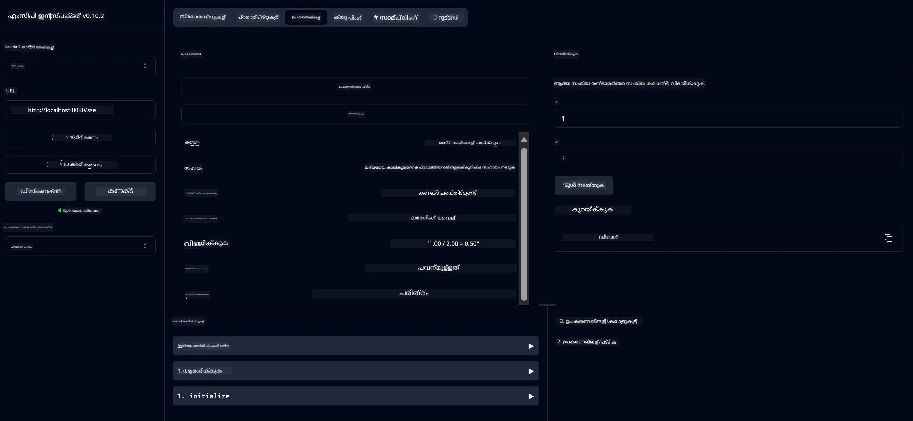

# അടിസ്ഥാന കാൽക്കുലേറ്റർ MCP സർവീസ്

ഈ സർവീസ് മോഡൽ കോൺടെക്സ്റ്റ് പ്രോട്ടോക്കോൾ (MCP) വഴി സ്പ്രിംഗ് ബൂട്ട് വെബ്‌ഫ്ലക്സ് ട്രാൻസ്പോർട്ട് ഉപയോഗിച്ച് അടിസ്ഥാന കാൽക്കുലേറ്റർ പ്രവർത്തനങ്ങൾ നൽകുന്നു. MCP നടപ്പാക്കലുകൾ പഠിക്കുന്ന തുടക്കക്കാർക്കായി ഇത് ഒരു ലളിതമായ ഉദാഹരണമായി രൂപകൽപ്പന ചെയ്തതാണ്.

കൂടുതൽ വിവരങ്ങൾക്ക്, [MCP Server Boot Starter](https://docs.spring.io/spring-ai/reference/api/mcp/mcp-server-boot-starter-docs.html) റഫറൻസ് ഡോക്യുമെന്റേഷൻ കാണുക.


## സർവീസ് ഉപയോഗിക്കൽ

MCP പ്രോട്ടോക്കോൾ വഴി സർവീസ് താഴെപ്പറയുന്ന API എൻഡ്‌പോയിന്റുകൾ പ്രദാനം ചെയ്യുന്നു:

- `add(a, b)`: രണ്ട് സംഖ്യകൾ ചേർക്കുക
- `subtract(a, b)`: രണ്ടാമത്തെ സംഖ്യ ആദ്യത്തേതിൽ നിന്ന് കുറയ്ക്കുക
- `multiply(a, b)`: രണ്ട് സംഖ്യകൾ ഗുണിക്കുക
- `divide(a, b)`: ആദ്യത്തെ സംഖ്യ രണ്ടാമത്തേതിൽ വിഭജിക്കുക (പൂജ്യം പരിശോധിച്ച്)
- `power(base, exponent)`: ഒരു സംഖ്യയുടെ പവർ കണക്കാക്കുക
- `squareRoot(number)`: ചതുരശ്രമൂലം കണക്കാക്കുക (നേർവിരുദ്ധ സംഖ്യ പരിശോധിച്ച്)
- `modulus(a, b)`: വിഭജിക്കുമ്പോൾ ശേഷിക്കുന്ന അവശിഷ്ടം കണക്കാക്കുക
- `absolute(number)`: മൂല്യത്തിന്റെ ആബ്സല്യൂട്ട് വാല്യൂ കണക്കാക്കുക

## ആശ്രിതങ്ങൾ

പ്രോജക്ടിന് താഴെപ്പറയുന്ന പ്രധാന ആശ്രിതങ്ങൾ ആവശ്യമാണ്:

```xml
<dependency>
    <groupId>org.springframework.ai</groupId>
    <artifactId>spring-ai-starter-mcp-server-webflux</artifactId>
</dependency>
```

## പ്രോജക്ട് നിർമ്മാണം

Maven ഉപയോഗിച്ച് പ്രോജക്ട് നിർമ്മിക്കുക:
```bash
./mvnw clean install -DskipTests
```

## സർവർ പ്രവർത്തിപ്പിക്കൽ

### ജാവ ഉപയോഗിച്ച്

```bash
java -jar target/calculator-server-0.0.1-SNAPSHOT.jar
```

### MCP ഇൻസ്പെക്ടർ ഉപയോഗിച്ച്

MCP ഇൻസ്പെക്ടർ MCP സർവീസുകളുമായി ഇടപഴകാൻ സഹായിക്കുന്ന ഒരു ഉപകരണം ആണ്. ഈ കാൽക്കുലേറ്റർ സർവീസുമായി ഇത് ഉപയോഗിക്കാൻ:

1. **പുതിയ ടെർമിനൽ വിൻഡോയിൽ MCP ഇൻസ്പെക്ടർ ഇൻസ്റ്റാൾ ചെയ്ത് പ്രവർത്തിപ്പിക്കുക**:
   ```bash
   npx @modelcontextprotocol/inspector
   ```

2. **ആപ്പ് കാണിക്കുന്ന URL ക്ലിക്ക് ചെയ്ത് വെബ് UI ആക്‌സസ് ചെയ്യുക** (സാധാരണയായി http://localhost:6274)

3. **കണക്ഷൻ ക്രമീകരിക്കുക**:
   - ട്രാൻസ്പോർട്ട് തരം "SSE" ആയി സെറ്റ് ചെയ്യുക
   - നിങ്ങളുടെ പ്രവർത്തിക്കുന്ന സർവറിന്റെ SSE എൻഡ്‌പോയിന്റ് URL സെറ്റ് ചെയ്യുക: `http://localhost:8080/sse`
   - "Connect" ക്ലിക്ക് ചെയ്യുക

4. **ഉപകരണങ്ങൾ ഉപയോഗിക്കുക**:
   - ലഭ്യമായ കാൽക്കുലേറ്റർ പ്രവർത്തനങ്ങൾ കാണാൻ "List Tools" ക്ലിക്ക് ചെയ്യുക
   - ഒരു ഉപകരണം തിരഞ്ഞെടുക്കുക, "Run Tool" ക്ലിക്ക് ചെയ്ത് പ്രവർത്തനം നടത്തുക



---

<!-- CO-OP TRANSLATOR DISCLAIMER START -->
**അസൂയാ**:  
ഈ രേഖ AI വിവർത്തന സേവനം [Co-op Translator](https://github.com/Azure/co-op-translator) ഉപയോഗിച്ച് വിവർത്തനം ചെയ്തതാണ്. നാം കൃത്യതയ്ക്ക് ശ്രമിച്ചിട്ടുണ്ടെങ്കിലും, സ്വയം പ്രവർത്തിക്കുന്ന വിവർത്തനങ്ങളിൽ പിശകുകൾ അല്ലെങ്കിൽ തെറ്റുകൾ ഉണ്ടാകാമെന്ന് ദയവായി ശ്രദ്ധിക്കുക. അതിന്റെ മാതൃഭാഷയിലുള്ള യഥാർത്ഥ രേഖ അധികാരപരമായ ഉറവിടമായി കണക്കാക്കപ്പെടണം. നിർണായക വിവരങ്ങൾക്ക്, പ്രൊഫഷണൽ മനുഷ്യ വിവർത്തനം ശുപാർശ ചെയ്യപ്പെടുന്നു. ഈ വിവർത്തനം ഉപയോഗിക്കുന്നതിൽ നിന്നുണ്ടാകുന്ന ഏതെങ്കിലും തെറ്റിദ്ധാരണകൾക്കോ വ്യാഖ്യാനക്കേടുകൾക്കോ ഞങ്ങൾ ഉത്തരവാദികളല്ല.
<!-- CO-OP TRANSLATOR DISCLAIMER END -->