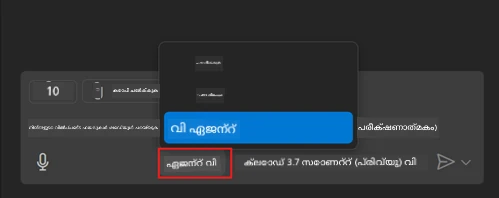
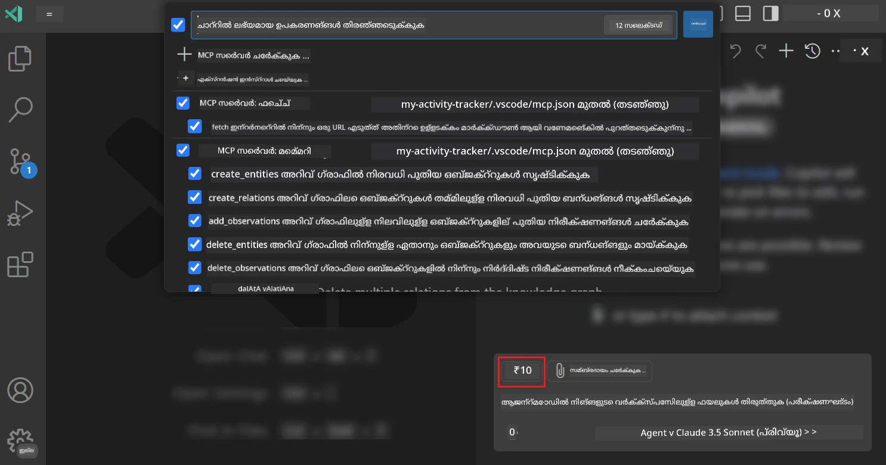
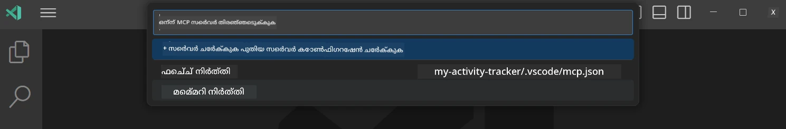
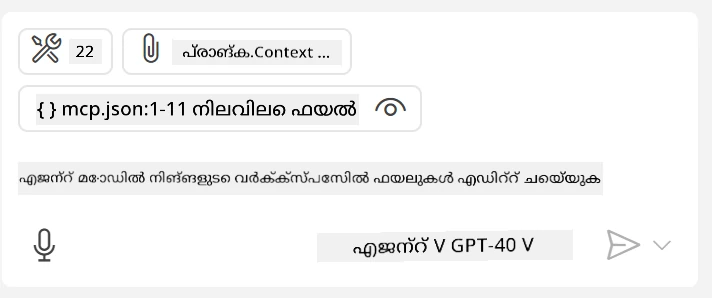
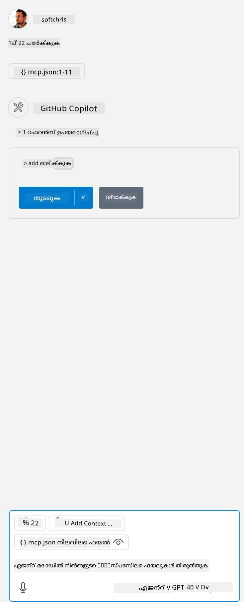

# GitHub Copilot ഏജന്റ് മോഡ് വഴി ഒരു സെർവർ ഉപയോഗിക്കൽ

Visual Studio Codeയും GitHub Copilotഉം ഒരു ക്ലയന്റായി പ്രവർത്തിച്ച് MCP സെർവർ ഉപയോഗിക്കാം. നിങ്ങൾക്ക് എന്തിനാണ് ഇത് ചെയ്യേണ്ടത് എന്ന് ചോദിക്കാം. അതായത് MCP സെർവറിന്റെ എല്ലാ ഫീച്ചറുകളും ഇപ്പോൾ നിങ്ങളുടെ IDE-യിൽ നിന്ന് ഉപയോഗിക്കാനാകും. ഉദാഹരണത്തിന് GitHub-ന്റെ MCP സെർവർ ചേർക്കുന്നതായി കരുതുക, ഇത് ടർമിനലിൽ പ്രത്യേക കമാൻഡുകൾ ടൈപ്പ് ചെയ്യാതെ പ്രോംപ്റ്റുകൾ വഴി GitHub നിയന്ത്രിക്കാൻ അനുവദിക്കും. അല്ലെങ്കിൽ സാധാരണയായി നിങ്ങളുടെ ഡെവലപ്പർ അനുഭവം മെച്ചപ്പെടുത്താൻ കഴിയുന്ന ഏതെങ്കിലും കാര്യവും സ്വാഭാവിക ഭാഷയിലൂടെ നിയന്ത്രിക്കപ്പെടും. ഇപ്പോൾ നിങ്ങൾ വിജയമെന്ന് കാണാൻ തുടങ്ങും, അല്ലേ?

## അവലോകനം

ഈ പാഠം Visual Studio Codeയും GitHub Copilot-ന്റെ ഏജന്റ് മോഡും നിങ്ങളുടെ MCP സെർവറിന്റെ ക്ലയന്റായി എങ്ങനെ ഉപയോഗിക്കാമെന്ന് വിശദീകരിക്കുന്നു.

## പഠന ലക്ഷ്യങ്ങൾ

ഈ പാഠം അവസാനിക്കുമ്പോൾ, നിങ്ങൾക്ക് കഴിയും:

- Visual Studio Code വഴി MCP സെർവർ ഉപയോഗിക്കുക.
- GitHub Copilot വഴി ടൂളുകൾ പോലുള്ള കഴിവുകൾ പ്രവർത്തിപ്പിക്കുക.
- Visual Studio Code-നെ നിങ്ങളുടെ MCP സെർവർ കണ്ടെത്താനും നിയന്ത്രിക്കാനും ക്രമീകരിക്കുക.

## ഉപയോഗം

നിങ്ങൾക്ക് MCP സെർവർ രണ്ട് വ്യത്യസ്ത മാർഗങ്ങളിൽ നിയന്ത്രിക്കാം:

- ഉപയോക്തൃ ഇന്റർഫേസ്, ഇത് ഈ അധ്യായത്തിൽ പിന്നീട് കാണാം.
- ടർമിനൽ, `code` എക്സിക്യൂട്ടബിൾ ഉപയോഗിച്ച് ടർമിനലിൽ നിന്ന് കാര്യങ്ങൾ നിയന്ത്രിക്കാം:

  നിങ്ങളുടെ ഉപയോക്തൃ പ്രൊഫൈലിൽ MCP സെർവർ ചേർക്കാൻ, --add-mcp കമാൻഡ് ലൈൻ ഓപ്ഷൻ ഉപയോഗിച്ച് {\"name\":\"server-name\",\"command\":...} എന്ന രൂപത്തിലുള്ള JSON സെർവർ കോൺഫിഗറേഷൻ നൽകുക.

  ```
  code --add-mcp "{\"name\":\"my-server\",\"command\": \"uvx\",\"args\": [\"mcp-server-fetch\"]}"
  ```

### സ്ക്രീൻഷോട്ടുകൾ





അടുത്ത ഭാഗങ്ങളിൽ നാം വിസ്വൽ ഇന്റർഫേസ് എങ്ങനെ ഉപയോഗിക്കാമെന്ന് കൂടുതൽ സംസാരിക്കാം.

## സമീപനം

ഇത് ഉയർന്ന തലത്തിൽ എങ്ങനെ സമീപിക്കണം:

- MCP സെർവർ കണ്ടെത്താൻ ഒരു ഫയൽ ക്രമീകരിക്കുക.
- ആ സെർവർ ആരംഭിച്ച് അതിന്റെ കഴിവുകൾ ലിസ്റ്റ് ചെയ്യുക.
- GitHub Copilot Chat ഇന്റർഫേസിലൂടെ ആ കഴിവുകൾ ഉപയോഗിക്കുക.

ശരി, ഇപ്പോൾ ഫ്ലോ മനസ്സിലായി, Visual Studio Code വഴി MCP സെർവർ ഉപയോഗിച്ച് ഒരു അഭ്യാസം ചെയ്യാം.

## അഭ്യാസം: ഒരു സെർവർ ഉപയോഗിക്കൽ

ഈ അഭ്യാസത്തിൽ, GitHub Copilot Chat ഇന്റർഫേസിൽ നിന്ന് ഉപയോഗിക്കാൻ Visual Studio Code-നെ നിങ്ങളുടെ MCP സെർവർ കണ്ടെത്താൻ ക്രമീകരിക്കും.

### -0- മുൻപടി, MCP സെർവർ കണ്ടെത്തൽ സജീവമാക്കുക

MCP സെർവർ കണ്ടെത്തൽ സജീവമാക്കേണ്ടതുണ്ടാകാം.

1. Visual Studio Code-ൽ `File -> Preferences -> Settings`-ലേക്ക് പോകുക.

1. "MCP" എന്ന് തിരയുക, settings.json ഫയലിൽ `chat.mcp.discovery.enabled` സജീവമാക്കുക.

### -1- കോൺഫിഗ് ഫയൽ സൃഷ്ടിക്കുക

നിങ്ങളുടെ പ്രോജക്ട് റൂട്ടിൽ ഒരു കോൺഫിഗ് ഫയൽ സൃഷ്ടിക്കുക, MCP.json എന്ന ഫയൽ .vscode എന്ന ഫോൾഡറിൽ ഇടണം. ഇത് ഇങ്ങനെ കാണണം:

```text
.vscode
|-- mcp.json
```

അടുത്തതായി, സെർവർ എൻട്രി എങ്ങനെ ചേർക്കാമെന്ന് നോക്കാം.

### -2- സെർവർ ക്രമീകരിക്കുക

*mcp.json*-ലേക്ക് താഴെ കാണുന്ന ഉള്ളടക്കം ചേർക്കുക:

```json
{
    "inputs": [],
    "servers": {
       "hello-mcp": {
           "command": "node",
           "args": [
               "build/index.js"
           ]
       }
    }
}
```

മുകളിൽ കാണുന്ന ഉദാഹരണം Node.js-ൽ എഴുതിയ ഒരു സെർവർ ആരംഭിക്കുന്നതിനുള്ളതാണ്, മറ്റ് റൺടൈമുകൾക്കായി `command` ഉം `args` ഉം ഉപയോഗിച്ച് സെർവർ ആരംഭിക്കുന്ന ശരിയായ കമാൻഡ് വ്യക്തമാക്കുക.

### -3- സെർവർ ആരംഭിക്കുക

നിങ്ങൾ എൻട്രി ചേർത്തതിനുശേഷം, സെർവർ ആരംഭിക്കാം:

1. *mcp.json*-ൽ നിങ്ങളുടെ എൻട്രി കണ്ടെത്തുക, "play" ഐക്കൺ കാണുന്നതായി ഉറപ്പാക്കുക:

    

1. "play" ഐക്കൺ ക്ലിക്ക് ചെയ്യുക, GitHub Copilot Chat-ൽ ടൂൾസ് ഐക്കൺ ലഭ്യമായ ടൂളുകളുടെ എണ്ണം വർദ്ധിക്കുന്നതായി കാണാം. ആ ടൂൾസ് ഐക്കൺ ക്ലിക്ക് ചെയ്താൽ രജിസ്റ്റർ ചെയ്ത ടൂളുകളുടെ പട്ടിക കാണാം. GitHub Copilot അവയെ കോൺടെക്സ്റ്റായി ഉപയോഗിക്കണമെങ്കിൽ ഓരോ ടൂളും തിരഞ്ഞെടുക്കാം/തിരഞ്ഞെടുത്തതിൽ നിന്ന് ഒഴിവാക്കാം:

  

1. ഒരു ടൂൾ പ്രവർത്തിപ്പിക്കാൻ, നിങ്ങളുടെ ടൂളുകളിൽ ഒന്നിന്റെ വിവരണവുമായി പൊരുത്തപ്പെടുന്ന പ്രോംപ്റ്റ് ടൈപ്പ് ചെയ്യുക, ഉദാഹരണത്തിന് "add 22 to 1" എന്ന പ്രോംപ്റ്റ്:

  

  23 എന്ന മറുപടി കാണണം.

## അസൈൻമെന്റ്

*mcp.json* ഫയലിൽ ഒരു സെർവർ എൻട്രി ചേർക്കാൻ ശ്രമിക്കുക, സെർവർ ആരംഭിക്കാനും നിർത്താനും കഴിയുന്നുണ്ടെന്ന് ഉറപ്പാക്കുക. GitHub Copilot Chat ഇന്റർഫേസിലൂടെ സെർവറിലെ ടൂളുകളുമായി ആശയവിനിമയം നടത്താൻ കഴിയുന്നുണ്ടെന്ന് ഉറപ്പാക്കുക.

## പരിഹാരം

[പരിഹാരം](./solution/README.md)

## പ്രധാനപ്പെട്ട കാര്യങ്ങൾ

ഈ അധ്യായത്തിൽ നിന്നുള്ള പ്രധാനപ്പെട്ട കാര്യങ്ങൾ:

- Visual Studio Code ഒരു മികച്ച ക്ലയന്റാണ്, ഇത് നിരവധി MCP സെർവർകളും അവയുടെ ടൂളുകളും ഉപയോഗിക്കാൻ അനുവദിക്കുന്നു.
- GitHub Copilot Chat ഇന്റർഫേസ് സെർവറുകളുമായി സംവദിക്കുന്ന മാർഗമാണ്.
- ഉപയോക്താവിൽ നിന്ന് API കീകൾ പോലുള്ള ഇൻപുട്ടുകൾ ചോദിച്ച് അവ MCP സെർവറിലേക്ക് *mcp.json* ഫയലിൽ സെർവർ എൻട്രി ക്രമീകരിക്കുമ്പോൾ പാസ്സ് ചെയ്യാം.

## സാമ്പിളുകൾ

- [Java കാൽക്കുലേറ്റർ](../samples/java/calculator/README.md)
- [.Net കാൽക്കുലേറ്റർ](../../../../03-GettingStarted/samples/csharp)
- [JavaScript കാൽക്കുലേറ്റർ](../samples/javascript/README.md)
- [TypeScript കാൽക്കുലേറ്റർ](../samples/typescript/README.md)
- [Python കാൽക്കുലേറ്റർ](../../../../03-GettingStarted/samples/python)

## അധിക വിഭവങ്ങൾ

- [Visual Studio ഡോക്സ്](https://code.visualstudio.com/docs/copilot/chat/mcp-servers)

## അടുത്തത്

- അടുത്തത്: [stdio സെർവർ സൃഷ്ടിക്കൽ](../05-stdio-server/README.md)

---

<!-- CO-OP TRANSLATOR DISCLAIMER START -->
**അസൂയാ**:  
ഈ രേഖ AI വിവർത്തന സേവനം [Co-op Translator](https://github.com/Azure/co-op-translator) ഉപയോഗിച്ച് വിവർത്തനം ചെയ്തതാണ്. നാം കൃത്യതയ്ക്ക് ശ്രമിച്ചെങ്കിലും, സ്വയം പ്രവർത്തിക്കുന്ന വിവർത്തനങ്ങളിൽ പിശകുകൾ അല്ലെങ്കിൽ തെറ്റുകൾ ഉണ്ടാകാമെന്ന് ദയവായി ശ്രദ്ധിക്കുക. അതിന്റെ മാതൃഭാഷയിലുള്ള യഥാർത്ഥ രേഖ അധികാരപരമായ ഉറവിടമായി കണക്കാക്കണം. നിർണായക വിവരങ്ങൾക്ക്, പ്രൊഫഷണൽ മനുഷ്യ വിവർത്തനം ശുപാർശ ചെയ്യപ്പെടുന്നു. ഈ വിവർത്തനം ഉപയോഗിക്കുന്നതിൽ നിന്നുണ്ടാകുന്ന ഏതെങ്കിലും തെറ്റിദ്ധാരണകൾക്കോ തെറ്റായ വ്യാഖ്യാനങ്ങൾക്കോ ഞങ്ങൾ ഉത്തരവാദികളല്ല.
<!-- CO-OP TRANSLATOR DISCLAIMER END -->