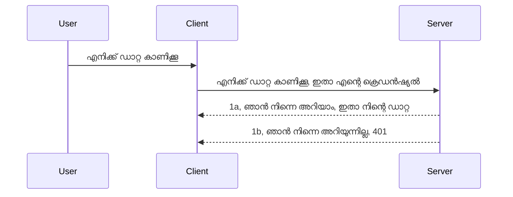

# ലളിതമായ ഓത്

MCP SDKകൾ OAuth 2.1 ഉപയോഗത്തെ പിന്തുണയ്ക്കുന്നു, ഇത് അത് ശരിക്കും ഒരു സങ്കീർണമായ പ്രക്രിയയാണ്, അതിൽ ഓത് സെർവർ, റിസോഴ്‌സ് സെർവർ, ക്രെഡൻഷ്യലുകൾ പോസ്റ്റ് ചെയ്യൽ, കോഡ് ലഭിക്കൽ, കോഡ് ഒരു ബിയർ ടോക്കനായി എക്‌സ്‌ചേഞ്ച് ചെയ്യൽ എന്നിവ ഉൾപ്പെടുന്നു, ഇതുവരെ നിങ്ങൾക്ക് ഒടുവിൽ നിങ്ങളുടെ റിസോഴ്‌സ് ഡാറ്റ ലഭിക്കും. OAuth ഉപയോഗിക്കാൻ പരിചയമില്ലാത്തവർക്ക്, ഇത് നടപ്പിലാക്കാൻ വലിയ കാര്യമാണെങ്കിലും, ഒരു അടിസ്ഥാന തലത്തിലുള്ള ഓത്ത് ഉപയോഗിച്ച് ആരംഭിച്ച് മെച്ചപ്പെട്ട സുരക്ഷയിലേക്ക് വളരുക നല്ല ആശയമാണ്. ഈ അദ്ധ്യായം അതിനാൽ നിലനിൽക്കുന്നു, കൂടുതൽ പരിചയസമ്പന്നമായ ഓത്തിൽ നിങ്ങളെ വഴിപെടുത്താൻ.

## ഓത്ത്, ഞങ്ങൾ അർത്ഥമാക്കുന്നത് എന്ത്?

ഓത്ത് ആണ് ഓത്തന്റിക്കേഷൻ ഉം অথോറൈസേഷൻ ഉം എന്നതിന് ചുരുക്കം. ഞങ്ങൾ ചെയ്യേണ്ടത് രണ്ട് കാര്യങ്ങളാണ്:

- **ഓത്തന്റിക്കേഷൻ**, അതായത് ഒരു ആളെ നമ്മുടെ വീട്ടിലേക്ക് പ്രവേശിക്കാൻ അനുവദിക്കണമോ എന്ന് കണ്ടെത്താനുള്ള പ്രക്രിയ, അവർക്കും "ഇവിടെ" ആയിരിക്കാനുള്ള അവകാശം ഉണ്ടോ എന്ന് എന്നത്, അതായത് നമ്മുടെ MCP സെർവർ ഫീച്ചറുകൾ നിലനിൽക്കുന്ന റിസോഴ്‌സ് സെർവറിലേക്ക് ആക്സസ് ഉണ്ടോ എന്ന് കണ്ടെത്തൽ.
- **അഥോറൈസേഷൻ**, ഉപയോക്താവിന് അവർ ചോദിക്കുന്ന പ്രത്യേക റിസോഴ്‌സുകൾക്ക് ആക്സസ് ലഭിക്കുമോ എന്നോ, ഉദാഹരണത്തിന് അവരെ ഓർഡറുകൾ അല്ലെങ്കിൽ ഉൽപന്നങ്ങൾ വായിക്കാൻ അനുവദിക്കപ്പെടുന്നത് അല്ലെങ്കിൽ ഉള്ളടക്കം വായിക്കാൻ പാടുള്ളതെങ്കിലും നീക്കം ചെയ്യാനാകാത്തത് പോലുള്ള അവകാശത്തിനോ എന്ന് കണ്ടെത്താനുള്ള പ്രക്രിയ.

## ക്രെഡൻഷ്യലുകൾ: ഞങ്ങൾ ആരാണെന്ന് സിസ്റ്റത്തിലേക്ക് പറഞ്ഞുകൊടുക്കുന്നത്

പല വെബ് ഡെവലപ്പർമാർ സാധാരണയായി സെർവറിലേക്ക് ഒരു ക്രെഡൻഷ്യൽ ലഭ്യമാക്കുന്നത് ആലോചിക്കുന്നു, സാധാരണയായി അവരെ ഇവിടെ "ഓത്തന്റിക്കേഷൻ" ചെയ്യാൻ അനുവാദമുള്ളവരാണ് എന്ന് സൂചിപ്പിക്കുന്ന ഒരു രഹസ്യം. ഈ ക്രെഡൻഷ്യൽ സാധാരണയായി യൂസർനെയിം-പാസ്‌വേഡ് ബേസ64 എൻകോഡഡ് ഓത് ആകാമോ അല്ലെങ്കിൽ ഒരു API കീ ആയി ഒരു പ്രത്യേക ഉപയോക്താവിനെ തിരിച്ചറിയുന്നവതാകും.

ഇത് "Authorization" എന്ന ഹെഡറിൽ അയയ്ക്കുന്നതിലൂടെ നടക്കുന്നു:

```json
{ "Authorization": "secret123" }
```
  
ഇത് സാധാരണയായി ബേസിക് ഓത്തന്റിക്കേഷൻ എന്ന പേരിൽ അറിയപ്പെടുന്നു. ആകെ ഫ്ലോ ഇതുപോലെ പ്രവർത്തിക്കുന്നു:


ഇപ്പോൾ ഇത് ഫ്ലോ ഭേദത്തിൽ എങ്ങനെ ജോലി ചെയ്യുന്നതെന്ന് മനസ്സിലായി, എങ്ങനെ നടപ്പിലാക്കാം? അധികം വെബ് സെർവറുകൾക്ക് മിഡിൽവെയർ എന്ന ആശയം ഉണ്ട്, അഭ്യർത്ഥനയുടെ ഭാഗമായി പ്രവർത്തിക്കുന്ന ഒരു കോഡ് ബാല്യം, ക്രെഡൻഷ്യലുകൾ പരിശോധിച്ച് സാധുവെങ്കിൽ അഭ്യർത്ഥന കടന്നുപോകാന് അനുവദിക്കുന്നു. സാധുവായ ക്രെഡൻഷ്യൽ ഇല്ലെങ്കിൽ ഓത്ത് പിശക് ലഭിക്കും. ഇത് എങ്ങനെ നടപ്പിലാക്കാമെന്നു നോക്കാം:

**Python**

```python
class AuthMiddleware(BaseHTTPMiddleware):
    async def dispatch(self, request, call_next):

        has_header = request.headers.get("Authorization")
        if not has_header:
            print("-> Missing Authorization header!")
            return Response(status_code=401, content="Unauthorized")

        if not valid_token(has_header):
            print("-> Invalid token!")
            return Response(status_code=403, content="Forbidden")

        print("Valid token, proceeding...")
       
        response = await call_next(request)
        # എക്കെങ്കിലും കസ്റ്റമർ ഹെഡറുകൾ ചേർക്കുക അല്ലെങ്കിൽ പ്രതികരണത്തിൽ ഏതു കേഞ്ഞ മാറ്റമുണ്ടാക്കുക
        return response


starlette_app.add_middleware(CustomHeaderMiddleware)
```
  
ഇവിടെ:

- `AuthMiddleware` എന്ന മിഡിൽവെയർ സൃഷ്ടിച്ചു, അതിന്റെ `dispatch` മെത്തഡ് വെബ് സെർവർ ആക്റ്റിവേറ്റ് ചെയ്യും.  
- വെബ് സെർവറിൽ മിഡിൽവെയർ ചേർത്തു:

    ```python
    starlette_app.add_middleware(AuthMiddleware)
    ```
  
- Authorization ഹെഡർ ഉണ്ടോ എന്നും അയക്കുന്ന രഹസ്യം സാധുവാണോ എന്നും പരിശോധിക്കുന്ന സാധുത പരിശോധന ലിസ്റ്റ് എഴുതിയിട്ടുണ്ട്:

    ```python
    has_header = request.headers.get("Authorization")
    if not has_header:
        print("-> Missing Authorization header!")
        return Response(status_code=401, content="Unauthorized")

    if not valid_token(has_header):
        print("-> Invalid token!")
        return Response(status_code=403, content="Forbidden")
    ```
  
    രഹസ്യം ഉണ്ടാകുകയും സാധുവായതിനാൽ അഭ്യർത്ഥന `call_next` വിളിച്ച് കടന്നുപോകാൻ സമ്മതിക്കുന്നു; പ്രതികരണം നൽകും.

    ```python
    response = await call_next(request)
    # പ്രതികരണത്തില്‍ ഏതെങ്കിലും കസ്റ്റമര്‍ ഹെഡറുകള്‍ ചേര്‍ക്കുക അല്ലെങ്കില്‍ ചിലവിധം മാറ്റം വരുത്തുക
    return response
    ```
  
എങ്ങനെ ഇത് പ്രവർത്തിക്കുന്നു എന്ന് പറയും: വെബ് അഭ്യർത്ഥനം സെർവറിലേക്കെത്തുമ്പോൾ മിഡിൽവെയർ പ്രവർത്തിക്കും, നിർവഹണ പ്രകാരം അഭ്യർത്ഥന കടന്നുപോകാനോ പിശക് തിരികെ നൽകാനോ ചെയ്യും, ക്ലയന്റ് തുടരാൻ അനുവദിക്കപ്പെടാത്തപ്പോൾ.

**TypeScript**

Express പോലുള്ള പ്രസിദ്ധമായ ഫ്രെയിംവർക്ക് ഉപയോഗിച്ച് മിഡിൽവെയർ സൃഷ്ടിച്ച് MCP സെർവറിൽ എത്തുന്നതിനു മുമ്പ് അഭ്യർത്ഥന തടയാനാണ് ഇവിടെ ചെയ്യുന്നത്. കോഡ് ഇങ്ങനെ:

```typescript
function isValid(secret) {
    return secret === "secret123";
}

app.use((req, res, next) => {
    // 1. അനുമതി ഹെഡർ ഉണ്ട് എന്നറിയുമോ?
    if(!req.headers["Authorization"]) {
        res.status(401).send('Unauthorized');
    }
    
    let token = req.headers["Authorization"];

    // 2. മര്യാദ ശരിയായതോ പരിശോധിക്കുക.
    if(!isValid(token)) {
        res.status(403).send('Forbidden');
    }

   
    console.log('Middleware executed');
    // 3. അപേക്ഷ നിലവിലുള്ള പൈപ്പ്ലൈനിലെ അടുത്ത ഘട്ടത്തിലേക്ക് അയയ്ക്കുന്നു.
    next();
});
```
  
ഇവിടെ:

1. ആദ്യം Authorization ഹെഡർ ഉണ്ടോയെന്ന് പരിശോധിക്കുന്നു, ഇല്ലെങ്കിൽ 401 പിശക് അയയ്ക്കുന്നു.  
2. ക്രെഡൻഷ്യൽ/ടോക്കൺ സാധുവാണോ എന്ന് ഉറപ്പാക്കുന്നു, അല്ലെങ്കിൽ 403 പിശക് അയയ്ക്കുന്നു.  
3. ഒടുവിൽ അഭ്യർത്ഥന തുടർന്നു ആവശ്യപ്പെട്ട റിസോഴ്‌സ് നൽകുന്നു.

## അഭ്യാസം: ഓത്തന്റിക്കേഷൻ നടപ്പിലാക്കുക

ഞങ്ങളുടെ അറിവ് ഉപയോഗിച്ച് ഇത് പരീക്ഷിച്ചു നടപ്പിലാക്കാം. പദ്ധതി:

സെർവർ

- വെബ് സെർവർ, MCP ഇൻസ്റ്റൻസ് സൃഷ്ടിക്കുക.  
- സെർവറിനായി മിഡിൽവെയർ നടപ്പിലാക്കുക.

ക്ലയന്റ്

- ഹെഡർ വഴി ക്രെഡൻഷ്യൽയോടെ വെബ് അഭ്യർത്ഥന അയയ്ക്കുക.

### -1- వెബ് సెർവറും MCP ഇൻസ്റ്റൻസും സൃഷ്ടിക്കുക

ആദ്യ ഘട്ടത്തിൽ, വെബ് സെർവർ ഇൻസ്റ്റൻസ്, MCP സെർവർ ഉണ്ടാക്കണം.

**Python**

MCP സെർവർ ഇൻസ്റ്റൻസ് സൃഷ്ടിക്കുമ്പോൾ starlette വെബ് ആപ്പ് സൃഷ്ടിച്ച് uvicorn ഉപയോഗിച്ച് ഹോസ്റ്റ് ചെയ്യുന്നു.

```python
# MCP സെർവറു് സൃഷ്ടിക്കുന്നു

app = FastMCP(
    name="MCP Resource Server",
    instructions="Resource Server that validates tokens via Authorization Server introspection",
    host=settings["host"],
    port=settings["port"],
    debug=True
)

# സ്റ്റാർലെറ്റ് വെബ് അപ്ലിക്കേഷൻ സൃഷ്ടിക്കുന്നു
starlette_app = app.streamable_http_app()

# uvicorn വഴി അപ്ലിക്കേഷൻ സേവനം നൽകുന്നു
async def run(starlette_app):
    import uvicorn
    config = uvicorn.Config(
            starlette_app,
            host=app.settings.host,
            port=app.settings.port,
            log_level=app.settings.log_level.lower(),
        )
    server = uvicorn.Server(config)
    await server.serve()

run(starlette_app)
```
  
ഇവിടെ:

- MCP സെർവർ സൃഷ്ടിച്ചു.  
- MCP സെർവറിൽനിന്ന് starlette വെബ് ആപ്പ് `app.streamable_http_app()` ഉണ്ടാക്കി.  
- uvicorn ഉപയോഗിച്ച് ആപ്പ് ഹോസ്റ്റ് ചെയ്ത് സർവ് ചെയ്തു.

**TypeScript**

MCP സെർവർ ഇൻസ്റ്റൻസ് സൃഷ്ടിക്കുന്നു.

```typescript
const server = new McpServer({
      name: "example-server",
      version: "1.0.0"
    });

    // ... സെർവർ റിസോഴ്സുകൾ, ടൂളുകൾ, പ്രോംപ്റ്റുകൾ ക്രമീകരിക്കുക ...
```
  
MCP സെർവർ സൃഷ്ടിക്കൽ POST /mcp റൂട്ടിനുള്ളിൽ നടക്കണം, അതിനാൽ മുകളിൽ നൽകിയ കോഡ് ഇങ്ങനെ മാറ്റാം:

```typescript
import express from "express";
import { randomUUID } from "node:crypto";
import { McpServer } from "@modelcontextprotocol/sdk/server/mcp.js";
import { StreamableHTTPServerTransport } from "@modelcontextprotocol/sdk/server/streamableHttp.js";
import { isInitializeRequest } from "@modelcontextprotocol/sdk/types.js"

const app = express();
app.use(express.json());

// സെഷൻ ID പ്രകാരം ട്രാൻസ്പോർട്ടുകൾ സൂക്ഷിക്കാന്‍ മാപ്പ്
const transports: { [sessionId: string]: StreamableHTTPServerTransport } = {};

// ക്ലയന്റ്-തുടർന്ന് സർവർ ക്ലയന്റ് POST അഭ്യർത്ഥനകൾ കൈകാര്യം ചെയ്യുക
app.post('/mcp', async (req, res) => {
  // നിലവിലുള്ള സെഷൻ ID പരിശോധിക്കുക
  const sessionId = req.headers['mcp-session-id'] as string | undefined;
  let transport: StreamableHTTPServerTransport;

  if (sessionId && transports[sessionId]) {
    // നിലവിലുള്ള ട്രാൻസ്പോർട്ട് പുനരുപയോഗം ചെയ്യുക
    transport = transports[sessionId];
  } else if (!sessionId && isInitializeRequest(req.body)) {
    // പുതിയ ഇൻഷ്യലൈസേഷൻ അഭ്യർത്ഥന
    transport = new StreamableHTTPServerTransport({
      sessionIdGenerator: () => randomUUID(),
      onsessioninitialized: (sessionId) => {
        // സെഷൻ ID പ്രകാരം ട്രാൻസ്പോർട്ട് സൂക്ഷിക്കുക
        transports[sessionId] = transport;
      },
      // DNS റീബൈൻഡിംഗ് സംരക്ഷണം പഴയ പതിപ്പുകളുമായി സഹവാസത്തിന് ഡിഫോൾട്ടായി അപ്രാപ്തമാക്കപ്പെട്ടിരിക്കുന്നു. നിങ്ങൾ ഈ സർവർ
      // പ്രാദേശികമായി പ്രവർത്തിപ്പിക്കുകയാണെങ്കിൽ, താഴെ പറയുന്നതുകളിൽ ഉറപ്പുവരുത്തുക:
      // enableDnsRebindingProtection: true,
      // allowedHosts: ['127.0.0.1'],
    });

    // അഡ്മിറ്റെട് ട്രാൻസ്പോർട്ട് അടച്ചപ്പോൾ ശുചുക്കുക
    transport.onclose = () => {
      if (transport.sessionId) {
        delete transports[transport.sessionId];
      }
    };
    const server = new McpServer({
      name: "example-server",
      version: "1.0.0"
    });

    // ... സർവർ വിഭവങ്ങൾ, ഉപകരണങ്ങൾ, പ്രോംപ്റ്റുകൾ സജ്ജമാക്കുക ...

    // MCP സർവറുമായി ബന്ധപ്പെടുക
    await server.connect(transport);
  } else {
    // അസാധുവായ അഭ്യർത്ഥന
    res.status(400).json({
      jsonrpc: '2.0',
      error: {
        code: -32000,
        message: 'Bad Request: No valid session ID provided',
      },
      id: null,
    });
    return;
  }

  // അഭ്യർത്ഥന കൈകാര്യം ചെയ്യുക
  await transport.handleRequest(req, res, req.body);
});

// GET, DELETE അഭ്യർത്ഥനകൾക്കായി പുനരുപയോഗയോഗ്യമായ ഹാൻഡിലർ
const handleSessionRequest = async (req: express.Request, res: express.Response) => {
  const sessionId = req.headers['mcp-session-id'] as string | undefined;
  if (!sessionId || !transports[sessionId]) {
    res.status(400).send('Invalid or missing session ID');
    return;
  }
  
  const transport = transports[sessionId];
  await transport.handleRequest(req, res);
};

// SSE വഴി സർവറിൽ നിന്ന് ക്ലയന്റിലേക്ക് അറിയിപ്പുകൾക്ക് GET അഭ്യർത്ഥനകൾ കൈകാര്യം ചെയ്യുക
app.get('/mcp', handleSessionRequest);

// സെഷൻ അവസാനിപ്പിക്കൽ DELETE അഭ്യർത്ഥനകൾ കൈകാര്യം ചെയ്യുക
app.delete('/mcp', handleSessionRequest);

app.listen(3000);
```
  
`app.post("/mcp")` അടക്കത്തിലാണ് MCP സെർവർ സൃഷ്ടിക്കൽ വന്നിട്ടുള്ളത്.

ആഗമിക്കുന്ന ക്രെഡൻഷ്യൽ പരിശോധിക്കാൻ എങ്ങിനെ മിഡിൽവെയർ സൃഷ്ടിക്കാം എന്ന അടുത്ത ഘട്ടത്തിലേക്ക് പോവാം.

### -2- സെർവറിനായി മിഡിൽവെയർ നടപ്പിലാക്കുക

ഇപ്പോൾ മിഡിൽവെയർ ഭാഗത്തിലേക്ക്. `Authorization` ഹെഡറിൽ ക്രെഡൻഷ്യൽ അന്വേഷിച്ച് സാധുവാണോ എന്ന് പരിശോധന നടത്തും. സാധുവാണെങ്കിൽ അഭ്യർത്ഥന തുടരും (ഉദാ: ടൂളുകൾ ലിസ്റ്റ് ചെയ്യുക, റിസോഴ്‌സ് വായിക്കുക, അല്ലാതെ MCP സവിശേഷതകൾ ചെയ്യുക).

**Python**

മിഡിൽവെയർ സൃഷ്ടിക്കാൻ, `BaseHTTPMiddleware`-ൽ നിന്നുള്ള ക്ലാസ് സൃഷ്ടിക്കണം. രണ്ടു പ്രധാന കാര്യങ്ങൾ:

- `request` - ഹെഡർ വിവരങ്ങൾ വായിക്കുന്ന അഭ്യർത്ഥന.  
- `call_next` - ക്ലയന്റ് കൊണ്ടുവന്ന സാധുതയായ ക്രെഡൻഷ്യൽ അംഗീകരിച്ചാൽ വിളിക്കേണ്ട കോൾബാക്ക്.

ആദ്യമേ `Authorization` ഹെഡർ ഇല്ലാത്ത കേസ് കൈകാര്യം ചെയ്യണം:

```python
has_header = request.headers.get("Authorization")

# ഹെടർ ലഭ്യമല്ല, 401 സാദ്ധ്യതയോടെ പരാജയം, ഇല്ലെങ്കിൽ മുന്നോട്ട് പോവുക.
if not has_header:
    print("-> Missing Authorization header!")
    return Response(status_code=401, content="Unauthorized")
```
  
ക്ലയന്റ് ഓത്തന്റിക്കേഷനിൽ പരാജയപ്പെടുന്നു എന്ന് 401 അനധികൃത സന്ദേശം അയയ്ക്കുന്നു.

അടുത്തത്, ക്രെഡൻഷ്യൽ നൽകിയാൽ, സാധുത പരിശോധിക്കണം:

```python
 if not valid_token(has_header):
    print("-> Invalid token!")
    return Response(status_code=403, content="Forbidden")
```
  
ഇവിടെ 403 നിരോധിത സന്ദേശം അയയ്‌ക്കുന്നു. താഴെ മുഴുവൻ മിഡിൽവെയർ നടപ്പിലാക്കൽ കാണാം:

```python
class AuthMiddleware(BaseHTTPMiddleware):
    async def dispatch(self, request, call_next):

        has_header = request.headers.get("Authorization")
        if not has_header:
            print("-> Missing Authorization header!")
            return Response(status_code=401, content="Unauthorized")

        if not valid_token(has_header):
            print("-> Invalid token!")
            return Response(status_code=403, content="Forbidden")

        print("Valid token, proceeding...")
        print(f"-> Received {request.method} {request.url}")
        response = await call_next(request)
        response.headers['Custom'] = 'Example'
        return response

```
  
ശ്രോതസ്സായ `valid_token` ഫങ്ഷൻ എന്താണെന്ന് നോക്കാം:

```python
# ഉൽപാദനത്തിനായി ഉപയോഗിക്കരുത് - ഇത് മെച്ചപ്പെടുത്തിയേക്കുക !!
def valid_token(token: str) -> bool:
    # "Bearer " പ്രീഫിക്സ് നീക്കംചെയ്യുക
    if token.startswith("Bearer "):
        token = token[7:]
        return token == "secret-token"
    return False
```
  
ഈ ഭാഗം മെച്ചപ്പെടുത്തേണ്ടതാണ്.

[!IMPORTANT] ചുരുക്കി പറയുന്നത്: രഹസ്യങ്ങൾ കോഡിൽ വരാതെ സൂക്ഷിക്കണം. സാധാരണയായി ഡാറ്റ സോഴ്‌സ് അല്ലെങ്കിൽ ഐഡിപി (ഐഡന്റിറ്റി സർവീസ് പ്രൊവൈഡർ) മുതലായി വാല്യു എടുക്കണം, അല്ലെങ്കിൽ ഐഡിപി തന്നെ സാധുത പരിശോധന നടത്തുന്നതിന് നൽകണം.

**TypeScript**

Express ഉപയോഗിച്ച്, മിഡിൽവെയർ ഫംഗ്ഷനുകൾ കൈകാര്യം ചെയ്യാൻ `use` മെത്തഡ് വിളിക്കണം.

- അഭ്യർത്ഥനയിലെ `Authorization` പ്രോപ്പർട്ടി പരിശോധിക്കുക.  
- ക്രെഡൻഷ്യൽ സാധുവാണെങ്കിൽ അഭ്യർത്ഥനയുടെ MCP അഭ്യർത്ഥന പ്രവർത്തിക്കും.

`Authorization` ഹെഡർ ഇല്ലെങ്കിൽ അഭ്യർത്ഥന തടയുന്നു:

```typescript
if(!req.headers["authorization"]) {
    res.status(401).send('Unauthorized');
    return;
}
```
  
ഹെഡർ ഇല്ലെങ്കിൽ 401 ലഭിക്കും.

അടുത്തതായി ക്രെഡൻഷ്യൽ സാധുവാണോയെന്ന് പരിശോധിക്കും, അല്ലെങ്കിൽ ഇനി പലിശ പ്രകാരം 403 തിരിച്ചയയ്ക്കും:

```typescript
if(!isValid(token)) {
    res.status(403).send('Forbidden');
    return;
} 
```
  
ഇപ്പോൾ 403 പിശക് ലഭിക്കുന്നതായി കാണാം.

പൂർണ്ണ കോഡ്:

```typescript
app.use((req, res, next) => {
    console.log('Request received:', req.method, req.url, req.headers);
    console.log('Headers:', req.headers["authorization"]);
    if(!req.headers["authorization"]) {
        res.status(401).send('Unauthorized');
        return;
    }
    
    let token = req.headers["authorization"];

    if(!isValid(token)) {
        res.status(403).send('Forbidden');
        return;
    }  

    console.log('Middleware executed');
    next();
});
```
  
ക്ലയന്റ് അയക്കുന്ന ക്രെഡൻഷ്യൽ പരിശോധിക്കാൻ വെബ് സെർവർ മിഡിൽവെയർ സജ്ജമാക്കി. ക്ലയന്റ് എന്താണ് ചെയ്യുന്നത്?

### -3- ക്രെഡൻഷ്യൽ ഹെഡർ വഴി വെബ് അഭ്യർത്ഥന അയയ്‌ക്കുക

ക്ലയന്റ് ക്രെഡൻഷ്യൽ ഹെഡർ വഴി അയയ്ക്കേണ്ടത് ഉറപ്പാക്കണം. MCP ക്ലയന്റ് ഉപയോഗിക്കുന്നു, എങ്ങനെ ചെയ്യാമെന്ന് കാണാം.

**Python**

ക്ലയന്റിന്റെ ഹെഡർ ക്രെഡൻഷ്യൽ പോലെ:

```python
# മൂല്യം ഹാർഡ്‌കോഡ് ചെയ്യരുത്, കുറഞ്ഞത് ഒരു എൻവയോൺമെന്റ് വേരിയബിൾ അല്ലെങ്കിൽ കൂടുതൽ സുരക്ഷിതമായ സംഭരണത്തിൽ വെക്കുക
token = "secret-token"

async with streamablehttp_client(
        url = f"http://localhost:{port}/mcp",
        headers = {"Authorization": f"Bearer {token}"}
    ) as (
        read_stream,
        write_stream,
        session_callback,
    ):
        async with ClientSession(
            read_stream,
            write_stream
        ) as session:
            await session.initialize()
      
            # TODO, ക്ലയന്റിൽ നിങ്ങൾ ചെയ്യണമെന്ന് ഉദ്ദേശിക്കുന്നത്, ഉദാഹരണം പോലെ ടൂൾസ് ലിസ്റ്റ് ചെയ്യുക, ടൂൾസ് കോളുചെയ്യുക തുടങ്ങിയവ.
```
  
`headers = {"Authorization": f"Bearer {token}"}` എന്നവിധം ഹെഡർ പൂരിപ്പിക്കുന്നു.

**TypeScript**

രണ്ട് ഘട്ടത്തിൽ പരിഹരിക്കാം:

1. ക്രെഡൻഷ്യൽ ഉള്ള കോൺഫിഗർ ഓബ്‌ജെക്ട് പൂരിപ്പിക്കുക.  
2. കോൺഫിഗർ ഓബ്‌ജെക്ട് ട്രാൻസ്പോർട്ടിലേക്ക് നൽകുക.

```typescript

// ഇവിടെ കാണിക്കുന്നതുപോലെ മൂല്യം ഹാർഡ്‌കോഡുചെയ്യരുത്. ಕನಿಷ್ಟം അത് ഒരു പരിതസ്ഥിതി变量മായി വെച്ച് ഡെവലപ്പ്മെന്റ്മോഡിൽ dotenv പോലുള്ള ഒന്നിനെ ഉപയോഗിക്കണം.
let token = "secret123"

// ഒരു ക്ലൈന്റ് ട്രാൻസ്പോർട്ട് ഓപ്ഷൻ ഒബ്ജക്റ്റ് നിർവ്വചിക്കുക
let options: StreamableHTTPClientTransportOptions = {
  sessionId: sessionId,
  requestInit: {
    headers: {
      "Authorization": "secret123"
    }
  }
};

// ഓപ്ഷനുകളുടെ ഒബ്ജക്റ്റ് ട്രാൻസ്പോർട്ടിന് പാസ്സ് ചെയ്യുക
async function main() {
   const transport = new StreamableHTTPClientTransport(
      new URL(serverUrl),
      options
   );
```
  
ഇവിടെ `options` ഒബ്‌ജെക്ട് സൃഷ്ടിച്ച് `requestInit` പ്രോപ്പർട്ടിക്ക് ഹെഡറുകൾ ഉൾപ്പെടുത്തിയിട്ടുണ്ട്.

[!IMPORTANT] കൂടുതൽ മെച്ചപ്പെടുത്തലുകൾ? നിലവിലെ നടപ്പാക്കൽ ചില പ്രശ്നങ്ങളുണ്ട്. ക്രെഡൻഷ്യൽ ഇങ്ങനെ അയയ്ക്കുന്നത് HTTPS ഇല്ലായിരുന്നെങ്കിൽ വളരെ അപകടം. HTTPS ഉണ്ട് എങ്കിൽ പോലും ടോക്കൺ കവർച്ച ഉണ്ടാകാം; അതിനാൽ ടോക്കൺ റദ്ദാക്കാൻ, ലോകത്തിന്റെ ഏതു ഭാഗത്ത് നിന്നാണെന്ന് പരിശോധിക്കാൻ, ആവശ്യത്തിന് റിക്വസ്റ്റ് ആവർത്തിക്കുകയും(bot പോലുള്ള പെരുമാറ്റം), മറ്റു നിരവധി സുരക്ഷാ പരിഗണനകൾ ആവശ്യമാണ്. 

എങ്കിലും, വളരെ ലളിതമായ APIകളും ആർക്കും ഓത്തന്റിക്കേഷൻ ഇല്ലാത്തവരെ അണിയിച്ചെടുക്കാനാകാത്ത APIകൾക്ക് ഇത് നല്ല തുടക്കം ആണ്.

അതനുസരിച്ച്, സുരക്ഷ കുറച്ച് ശക്തിപ്പെടുത്താൻ JSON Web Token (JWT) എന്ന പათിരൂപം ഉപയോഗിക്കാം.

## JSON Web Tokens, JWT

പാർ്റെണ്ഷ്യൽ ക്രെഡൻഷ്യലുകൾ അയയ്ക്കുന്നതിൽ നിന്നും മെച്ചപ്പെടുത്താൻ ശ്രമിക്കുമ്പോൾ ആണ് JWT സ്വീകരിക്കുന്നത്.

- **സുരക്ഷാ മെച്ചപ്പെടുത്തലുകൾ**: ലളിതമായ ഓത്ത്-ൽ, യൂസർനെയും പാസ്‌വേഡും ബേസ്64 എൻകോഡഡ് ആയി അയയ്ക്കുന്നു (അല്ലെങ്കിൽ API കീ), തുടർച്ചയായി ഇത് അയയ്ക്കുന്നത് അപകടം വർദ്ധിപ്പിക്കുന്നു. JWT-ൽ, യൂസർനെയും പാസ്‌വേഡും അയച്ച് ടോക്കൺ ലഭിക്കും, ഇത് സമയം നിർബന്ധിതവും ആയിരിക്കും, കാലഹരണപ്പെടും. തിരിഞ്ഞ് റോളുകൾ, സ്കോപ്പുകളും അനുമതികളും ഉപയോഗിച്ച് ഫൈൻ-ഗ്രെയ്നഡ് ആക്സസ് നിയന്ത്രണം നടപ്പാക്കാം.  
- **സ്റ്റേറ്റ്‌ലെസ്സ് ആയും സ്കേബിൾ ആയും**: JWT സ്വയം ഉൾക്കൊള്ളുന്നു, ഉപയോക്തൃ വിവരം ഉൾക്കൊള്ളുന്നു, സെർവർ-സൈഡ് സെഷൻ സംഭരണം വേണ്ടാതാക്കുന്നു. ടോക്കൺ ലൊക്കലായി പരിശോധിക്കാം.  
- **ഇന്റർഓപ്പറബിലിറ്റിയും ഫെഡറേഷനും**: JWT OpenID Connect-ന്റെ കേന്ദ്ര ഭാഗമാണ്, Entra ID, Google Identity, Auth0 പോലുള്ള ഐഡന്റിറ്റി പ്രൊവൈഡർമാരുമായി ഉപയോഗിക്കുന്നു. സിംഗിൾ സൈൻ-ഓൺ പരീക്ഷക്ക് സഹായിക്കുന്നു, എന്റർപ്രൈസ്-ഗ്രേഡ് ആക്കുന്നു.  
- **മോഡുലാരിറ്റി, ഫ്ലക്സിബിലിറ്റി**: API ഗേറ്റ്വേകൾ (Azure API Management, NGINX മുതലായവ) ഉപയോഗിക്കാനും മറ്റ് ഓത്തന്റിക്കേഷൻ സാഹചര്യങ്ങൾക്കും, സര്‍വ്വറില് നിന്നുള്ള സീപീ ആയി പ്രവർത്തിക്കാനും ടെർമുണ്ട് ഡെലിഗേഷൻ സീനാരിയോ മുതലായവയ്ക്കുമുള്ള പിന്തുണ.  
- **പരീക്ഷണങ്ങളും ക്യാഷിംഗും**: JWT ഡികോഡ് ചെയ്തു കാഷെ ചെയ്യാം, ഇത് പാഴ്സ് ആവശ്യം കുറയ്ക്കുന്നു. ബഹു-ട്രാഫിക് ആപ്പുകൾക്ക് ഇത് ത്രൂപ്പുട്ട് മെച്ചപ്പെടുത്തുകയും ഇൻഫ്രാസ്ട്രക്ചർ ബോഡ് കുറയ്ക്കുകയും ചെയ്യുന്നു.  
- **അഡ്വാൻസ്ഡ് ഫീച്ചറുകൾ**: ഇൻട്രോസ്പെക്ഷൻ (സെർവറിൽ സാധുത പരിശോധിക്കൽ), റദ്ദാക്കൽ (ടോക്കൺ അസാധുവാക്കൽ) പിന്തുണ.

ഇവയൊക്കെ മനസ്സിലാക്കി, നടപ്പാക്കൽ അടുത്ത നിലവാരത്തിലേക്ക് എങ്ങനെ കൊണ്ടുപോകാമെന്ന് നോക്കാം.

## ലളിതമായ ഓത്ത് നിന്ന് JWT യിലേക്ക് മാറൽ

മേൽനോട്ടത്തിൽ മാറ്റേണ്ട കാര്യങ്ങൾ:

- **JWT ടോക്കൺ സൃഷ്ടിക്കുക** എന്ന് പഠിക്കുക, ക്ലയന്റിൽ നിന്ന് സെർവറിലേക്ക് അയയ്ക്കാൻ തയ്യാറാക്കുക.  
- **JWT ടോക്കൺ സാധുത പരിശോധിക്കുക**, സാധുവെങ്കിൽ ക്ലയന്റ് റിസോഴ്‌സുകൾക്ക് ആക്സസ് നൽകുക.  
- **ടോക്കൺ സുരക്ഷിത സംഭരണം** എങ്ങനെ സൂക്ഷിക്കണം.  
- **റൂട്ടുകൾ സംരക്ഷിക്കുക** - മാർഗ്ഗങ്ങൾ, പ്രത്യേക MCP ഫീച്ചറുകൾ സംരക്ഷണം.  
- **റിഫ്രെഷ് ടോക്കൺ ചേർക്കുക** - ചെറിയ കാലതാമസമുള്ള ടോക്കണുകൾ സൃഷ്ടിക്കുക, കൂടാതെ പുതിയ ടോക്കണുകൾക്ക് ഉപയോഗിക്കാവുന്ന ദീർഘകാല റിഫ്രഷ് ടോക്കണുകൾ, റിഫ്രഷ് എന്റ്പോയിന്റും റോട്ടേഷൻ സ്‌ട്രാറ്റജിയും ഉറപ്പാക്കുക.

### -1- JWT ടോക്കൺ സൃഷ്ടിക്കുക

ആദ്യമേ, JWT ടോക്കണിന് ഇവയുള്ള ഭാഗങ്ങളുണ്ട്:

- **ഹെഡർ** - ഉപയോഗിച്ച ആലഗോരിതം, ടോക്കൺ തരം.  
- **പേലോഡ്** - ക്ലെയിംസുകൾ, ഉദാ: sub (ടോക്കൺ പ്രതിനിധാനം ചെയ്യുന്ന ഉപയോക്താവ് അല്ലെങ്കിൽ ഇന്എ), exp (കാലഹരണം), role (റോൾ).  
- **സിഗ്നേച്ചർ** - രഹസ്യത്തോടെ അല്ലെങ്കിൽ സ്വകാര്യ കീ ഉപയോഗിച്ച് ഒപ്പിടുന്നു.

ഇതിനായി ഹെഡർ, പേലോഡ് നിർമ്മിച്ച് എൻകോഡഡ് ടോക്കൺ സൃഷ്ടിക്കണം.

**Python**

```python

import jwt
import jwt
from jwt.exceptions import ExpiredSignatureError, InvalidTokenError
import datetime

# JWT ഒപ്പുവയ്‌ക്കാനായി ഉപയോഗിക്കുന്ന രഹസ്യിപുറം
secret_key = 'your-secret-key'

header = {
    "alg": "HS256",
    "typ": "JWT"
}

# ഉപയോക്തൃ വിവരങ്ങളും അവയുടെ അവകാശങ്ങളും കാലാവധിയും
payload = {
    "sub": "1234567890",               # വിഷയം (ഉപയോക്തൃ ഐഡി)
    "name": "User Userson",                # ഇഷ്ടാനുസൃത അവകാശം
    "admin": True,                     # ഇഷ്ടാനുസൃത അവകാശം
    "iat": datetime.datetime.utcnow(),# പുറത്തിറക്കിയ സമയം
    "exp": datetime.datetime.utcnow() + datetime.timedelta(hours=1)  # കാലഹരണപ്പെടൽ
}

# ഇത് കോഡുചെയ്‌തു
encoded_jwt = jwt.encode(payload, secret_key, algorithm="HS256", headers=header)
```
  
മുകളിൽ കാണുന്നതുപോലെ:

- HS256 ആലഗോരിതം ഉപയോഗിച്ച് JWT ടൈപ്പ് ഹെഡർ നിർവചിച്ചു.  
- ഉപയോഗയോഗ്യമായ ക്രെയിംസ് - സബ്ജക്റ്റ് (user id),urname, role, აგურის് ഇടം iat, കാലഹരണ d exp - ഉൾപ്പെടുത്തിയെടുത്ത് വാർത്താസമയബന്ധിതത്വം നടപ്പിലാക്കി.

**TypeScript**

ഇവിടെ നമുക്ക് ഡെപൻഡൻസുകൾ വേണ്ടതായിരിക്കും JWT ടോക്കൺ സൃഷ്ടിക്കാൻ സഹായിക്കുന്നവ.

ഡെപൻഡൻസുകൾ:

```sh

npm install jsonwebtoken
npm install --save-dev @types/jsonwebtoken
```
  
ഇത് ഉള്ളതോടെ ഹെഡർ, പേലോഡ് സൃഷ്ടിച്ച് എൻകോഡഡ് ടോക്കൺ ഉണ്ടാക്കാം.

```typescript
import jwt from 'jsonwebtoken';

const secretKey = 'your-secret-key'; // ഉൽപ്പാദനത്തിൽ env വ്യർസ് ഉപയോഗിക്കുക

// ഫലമുള്ള വിവരങ്ങൾ നിർവ്വചിക്കുക
const payload = {
  sub: '1234567890',
  name: 'User usersson',
  admin: true,
  iat: Math.floor(Date.now() / 1000), // പ്രഖ്യാപിക്കപ്പെട്ടവ
  exp: Math.floor(Date.now() / 1000) + 60 * 60 // 1 മണിക്കൂര്‍ കഴിഞ്ഞ് കാലഹരണപ്പെടും
};

// ഹെഡർ നിർവചിക്കുക (ഐച്ഛികം, jsonwebtoken ഡീഫോൾട്ടുകൾ സജ്ജീകരിക്കുന്നു)
const header = {
  alg: 'HS256',
  typ: 'JWT'
};

// ടോക്കൺ സൃഷ്ടിക്കുക
const token = jwt.sign(payload, secretKey, {
  algorithm: 'HS256',
  header: header
});

console.log('JWT:', token);
```
  
ഈ ടോക്കൺ:

HS256 ഉപയോഗിച്ച് ഒപ്പിട്ടത്  
1 മണിക്കൂർ സാധുവായത്  
sub, name, admin, iat, exp പോലുള്ള ക്ലെയിംസുകൾ ഉൾകൊള്ളുന്നു.

### -2- ടോക്കൺ സാധുത പരിശോധിക്കുക

ടോക്കൺ സാധുത പരിശോധിക്കണം, ഇത് സെർവറിലൂടെ നടത്തുക ഉചിതമാണ്, ക്ലയന്റ് അയക്കുന്ന ടോക്കൺ സാധുവാണെന്ന് ഉറപ്പാക്കാൻ. ഘടന പരിശോധിക്കുന്നതിൽ നിന്ന് തുടക്കം വരെ നിരവധി പരിശോധനകൾ വേണം. നിങ്ങളുടെ സിസ്റ്റത്തിലെ ഉപയോക്താവാണോ എന്ന് പരിശോധിക്കാനും മറ്റനവധി പരിശോധനകളും ചേർക്കുക.

സാധുത പരിശോധിക്കാൻ ടോക്കൺ ഡീകോഡ് ചെയ്ത് വായിച്ച് പരിശോധിക്കും:

**Python**

```python

# JWT ഡീകോഡ് ചെയ്ത് സ്ഥിരീകരിക്കുക
try:
    decoded = jwt.decode(token, secret_key, algorithms=["HS256"])
    print("✅ Token is valid.")
    print("Decoded claims:")
    for key, value in decoded.items():
        print(f"  {key}: {value}")
except ExpiredSignatureError:
    print("❌ Token has expired.")
except InvalidTokenError as e:
    print(f"❌ Invalid token: {e}")

```
  
ഇവിടെ `jwt.decode` കോൾ ചെയ്യുന്നു, ടോക്കൺ, രഹസ്യ കീ, ആലഗോരിതം നൽകുന്നു. ഫെയ്ൽ ആകുമ്പോൾ error ഉണ്ട്, അതിനാൽ ട്രൈ-കാച്ച് ഉപയോഗിക്കുന്നു.

**TypeScript**

ഇവിടെ `jwt.verify` വിളിച്ച് ടോക്കൺ ഡീകോഡ് ചെയ്ത് മൂല്യം പരിശോധിക്കും. വിളി പരാജയപ്പെടുകയാണെങ്കിൽ ഘടന തെറ്റെന്നും സാധുവല്ലെന്നും അർത്ഥം.

```typescript

try {
  const decoded = jwt.verify(token, secretKey);
  console.log('Decoded Payload:', decoded);
} catch (err) {
  console.error('Token verification failed:', err);
}
```
  
[!IMPORTANT] മുൻപ് പറഞ്ഞതുപോലെ, ടോക്കൺ നമ്മുടെ സിസ്റ്റത്തിലെ ഉപയോക്താവിനെയാണ് സൂചിപ്പിക്കുന്നത് എന്നും അവർക്കുള്ള അവകാശങ്ങൾ ശരിയാണെന്ന് ഉറപ്പുവരുത്തുക.
Next, let's look into role based access control, also known as RBAC.

## റോളിംഗ് അടിസ്ഥാനമാക്കിയുള്ള ആക്‌സസ് നിയന്ത്രണം ചേർക്കൽ

വിവിധ റോൾസുകൾക്ക് വ്യത്യസ്ത അനുവാദങ്ങൾ ഉണ്ടെന്ന് പ്രകടിപ്പിക്കാനാണ് ആശയം. ഉദാഹരണത്തിന്, ഒരു അഡ്മിൻ എല്ലാം ചെയ്യാമെന്ന് കരുതുന്നു, സാധാരണ ഉപയോക്താക്കൾക്ക് വായനയും എഴുതലും ചെയ്യാമെന്നും ഒരു അതിഥിക്ക് വെറും വായനമേ കഴിയും എന്നും കരുതുന്നു. അതിനാൽ, ചില സാധ്യമായ അനുവാദ ലെവലുകൾ ഇതാ:

- Admin.Write 
- User.Read
- Guest.Read

മിഡിൽവെയർ ഉപയോഗിച്ച് ഇത്തരത്തിലൊരു നിയന്ത്രണം എങ്ങനെ നടപ്പിലാക്കാമെന്ന് നോക്കാം. ഓരോ റൂട്ടിനും പ്രത്യേകമായി, കൂടാതെ എല്ലാ റൂട്ടുകൾക്കും മിഡിൽവെയർ ചേർക്കാൻ കഴിയും.

**Python**

```python
from starlette.middleware.base import BaseHTTPMiddleware
from starlette.responses import JSONResponse
import jwt

# രഹസ്യം കോഡിൽ ഉൾക്കൊള്ളിക്കരുത്, ഇത് പ്രദർശനത്തിനായാണ് മാത്രമായിരിക്കുക. ഇത് സുരക്ഷിതമായ സ്ഥലത്ത് നിന്ന് വായിക്കുക.
SECRET_KEY = "your-secret-key" # ഇത് env വేరിയബിളിൽ ഉൾപ്പെടുത്തുക
REQUIRED_PERMISSION = "User.Read"

class JWTPermissionMiddleware(BaseHTTPMiddleware):
    async def dispatch(self, request, call_next):
        auth_header = request.headers.get("Authorization")
        if not auth_header or not auth_header.startswith("Bearer "):
            return JSONResponse({"error": "Missing or invalid Authorization header"}, status_code=401)

        token = auth_header.split(" ")[1]
        try:
            decoded = jwt.decode(token, SECRET_KEY, algorithms=["HS256"])
        except jwt.ExpiredSignatureError:
            return JSONResponse({"error": "Token expired"}, status_code=401)
        except jwt.InvalidTokenError:
            return JSONResponse({"error": "Invalid token"}, status_code=401)

        permissions = decoded.get("permissions", [])
        if REQUIRED_PERMISSION not in permissions:
            return JSONResponse({"error": "Permission denied"}, status_code=403)

        request.state.user = decoded
        return await call_next(request)


```

മിടിൽവെയർ ചേർക്കാനുള്ള ചില വ്യത്യസ്ത മാർഗങ്ങൾ താഴെപ്പറയുകയാണ്:

```python

# Alt 1: സ്റ്റാർലെറ്റ് ആപ്പ് നിർമ്മിക്കുമ്പോൾ മിഡിൽവെയർ ചേർക്കുക
middleware = [
    Middleware(JWTPermissionMiddleware)
]

app = Starlette(routes=routes, middleware=middleware)

# Alt 2: സ്റ്റാർലെറ്റ് ആപ്പ് മുമ്പ് തന്നെ നിർമ്മിച്ച ശേഷം മിഡിൽവെയർ ചേർക്കുക
starlette_app.add_middleware(JWTPermissionMiddleware)

# Alt 3: റൂട്ടു പ്രാവശ്യമാക്കിയ മിഡിൽവെയർ ചേർക്കുക
routes = [
    Route(
        "/mcp",
        endpoint=..., # ഹാൻഡ്ലർ
        middleware=[Middleware(JWTPermissionMiddleware)]
    )
]
```

**TypeScript**

എല്ലാ അഭ്യർത്ഥനകളിലും പ്രവർത്തിക്കുന്ന മിഡിൽവെയർക്ക് വേണ്ടി `app.use` ഉപയോഗിക്കാം. 

```typescript
app.use((req, res, next) => {
    console.log('Request received:', req.method, req.url, req.headers);
    console.log('Headers:', req.headers["authorization"]);

    // 1. അധികാര ഹെഡർ അയച്ചിട്ടുണ്ടോ എന്ന് പരിശോധിക്കുക

    if(!req.headers["authorization"]) {
        res.status(401).send('Unauthorized');
        return;
    }
    
    let token = req.headers["authorization"];

    // 2. ടോക്കൺ സാധുവാണോ എന്ന് പരിശോധിക്കുക
    if(!isValid(token)) {
        res.status(403).send('Forbidden');
        return;
    }  

    // 3. ടോക്കൺ ഉപയോഗക്കാരൻ നമ്മുടെ സിസ്റ്റത്തിൽ ഉണ്ടോ എന്ന് പരിശോധിക്കുക
    if(!isExistingUser(token)) {
        res.status(403).send('Forbidden');
        console.log("User does not exist");
        return;
    }
    console.log("User exists");

    // 4. ടോക്കൺക്ക് ശരിയായ അനുമതികൾ ഉണ്ട് എന്ന് സ്ഥിരീകരിക്കുക
    if(!hasScopes(token, ["User.Read"])){
        res.status(403).send('Forbidden - insufficient scopes');
    }

    console.log("User has required scopes");

    console.log('Middleware executed');
    next();
});

```

ഞങ്ങൾക്കു മിടിൽവെയർ ചെയ്യാൻ കഴിയുന്ന കാര്യങ്ങൾ പലതുമുണ്ട്, മിഡിൽവെയർ ചെയ്യേണ്ടതും ഇങ്ങനെ:

1.Authorization ഹെഡർ ഉണ്ടോയെന്ന് പരിശോധിക്കുക  
2.ടോകൺ സാധുവാണോ എന്ന് പരിശോധിക്കുക, ഞങ്ങൾ എഴുതിയ `isValid` മേധഡ് ഉപയോഗിച്ച് JWT ടോകണിന്റെ ഐക്യവും സാധുതയും പരിശോധിക്കുന്നു.  
3.ഉപയോക്താവ് നമ്മുടെ സിസ്റ്റത്തിൽ നിലവിലുണ്ടോ എന്ന് ശരിയാക്കുക, ഇതും പരിശോധിക്കണം.

   ```typescript
    // ഡാറ്റാബേസിലുള്ള ഉപയോക്താക്കൾ
   const users = [
     "user1",
     "User usersson",
   ]

   function isExistingUser(token) {
     let decodedToken = verifyToken(token);

     // ചെയ്യാനുള്ളത്, ഉപയോക്താവ് ഡാറ്റാബേസില്‍ ഉണ്ടോ എന്ന് പരിശോധിക്കുക
     return users.includes(decodedToken?.name || "");
   }
   ```

മുകളിൽ, ഒരു വളരെ ലളിതമായ `users` ലിസ്റ്റ് സൃഷ്ടിച്ചിട്ടുണ്ട്, ഇത് നിശ്ചയമായും ഒരു ഡാറ്റാബേസിൽ ഉണ്ടാകണം.

4.ഇതു കൂടാതെ, ടോകണിന് ശരിയായ അനുമതികൾ ഉണ്ടോയെന്നും പരിശോധിക്കണം.

   ```typescript
   if(!hasScopes(token, ["User.Read"])){
        res.status(403).send('Forbidden - insufficient scopes');
   }
   ```

മിടിൽവെയർ ऊपर കൊടുത്ത കോഡിൽ, ടോകൺ User.Read അനുമതി ഉള്ളതായി പരിശോധിക്കുന്നു, ഇല്ലാതെങ്കിൽ 403 പിഴവ് അയക്കുന്നു. താഴെ `hasScopes` സഹായക മേധഡ് കാണാം.

   ```typescript
   function hasScopes(scope: string, requiredScopes: string[]) {
     let decodedToken = verifyToken(scope);
    return requiredScopes.every(scope => decodedToken?.scopes.includes(scope));
  }
   ```

Have a think which additional checks you should be doing, but these are the absolute minimum of checks you should be doing.

Using Express as a web framework is a common choice. There are helpers library when you use JWT so you can write less code.

- `express-jwt`, helper library that provides a middleware that helps decode your token.
- `express-jwt-permissions`, this provides a middleware `guard` that helps check if a certain permission is on the token.

Here's what these libraries can look like when used:

```typescript
const express = require('express');
const jwt = require('express-jwt');
const guard = require('express-jwt-permissions')();

const app = express();
const secretKey = 'your-secret-key'; // put this in env variable

// Decode JWT and attach to req.user
app.use(jwt({ secret: secretKey, algorithms: ['HS256'] }));

// Check for User.Read permission
app.use(guard.check('User.Read'));

// multiple permissions
// app.use(guard.check(['User.Read', 'Admin.Access']));

app.get('/protected', (req, res) => {
  res.json({ message: `Welcome ${req.user.name}` });
});

// Error handler
app.use((err, req, res, next) => {
  if (err.code === 'permission_denied') {
    return res.status(403).send('Forbidden');
  }
  next(err);
});

```

ഇപ്പോൾ നിങ്ങൾ കാണിച്ചു മിടിൽവെയർ സവിശേഷത പോലെ പ്രാമാണീകരണത്തിന് (authentication)യും അധികാരനിർണ്ണയത്തിനും (authorization) ഉപയോഗിക്കാമെന്ന്; എന്നാൽ MCP-യിൽ അത് എങ്ങനെ ബാധിക്കും? അതറിയുക അടുത്ത ഭാഗത്ത്.

### -3- MCP-യിലേക്കുള്ള RBAC ചേർക്കൽ

മിഡിൽവെയർ വഴിയോ RBAC ചേർക്കാമെന്ന് ഇതുവരെ കാണിച്ചു. എന്നാൽ MCPയിൽ ഇത് വളരെ എളുപ്പമുള്ള കാര്യമല്ല, എന്ത് ചെയ്യണം? ഒരു പ്രത്യേക ഉപകരണം (tool) വിളിക്കാനായി ക്ലയന്റ് അവകാശമുണ്ടോയെന്ന് പരിശോധിക്കുന്ന കോഡ് ഇങ്ങനെ ചേർക്കണം:

ഒരു ഫീച്ചറിനുവേണ്ടി RBAC സാധ്യമാക്കാൻ ചില വഴികൾ:

- ഓരോ ടൂൾ, സ്രോത്, പ്രോംപ്റ്റ് എന്നിവയ്ക്കും അവകാശ പിശക് പരിശോധിക്കുന്ന ചെക്ക് കൂട്ടുക.

   **python**

   ```python
   @tool()
   def delete_product(id: int):
      try:
          check_permissions(role="Admin.Write", request)
      catch:
        pass # ക്ലയന്റ് സ്ഥിരീകരണം പരാജയപ്പെട്ടു, സ്ഥിരീകരണ പിശക് ഉയർത്തുക
   ```

   **typescript**

   ```typescript
   server.registerTool(
    "delete-product",
    {
      title: Delete a product",
      description: "Deletes a product",
      inputSchema: { id: z.number() }
    },
    async ({ id }) => {
      
      try {
        checkPermissions("Admin.Write", request);
        // ചെയ്യേണ്ടത്, id productService ക്കും remote entry ക്കും അയയ്ക്കുക
      } catch(Exception e) {
        console.log("Authorization error, you're not allowed");  
      }

      return {
        content: [{ type: "text", text: `Deletected product with id ${id}` }]
      };
    }
   );
   ```


- അഭ്യർത്ഥന കൈകാര്യം ചെയ്യുന്ന ഹാൻഡ്ലറുകളുടെ സഹായത്തോടെ അഭ്യർക്കികളിൽ ചെക്ക് എടുക്കുന്ന സ്ഥലങ്ങൾ കുറയ്ക്കുക.

   **Python**

   ```python
   
   tool_permission = {
      "create_product": ["User.Write", "Admin.Write"],
      "delete_product": ["Admin.Write"]
   }

   def has_permission(user_permissions, required_permissions) -> bool:
      # user_permissions: ഉപയോക്താവിന് ഉള്ള അനുമതികളുടെ പട്ടിക
      # required_permissions: ഉപകരണം ആവശ്യപ്പെടുന്ന അനുമതികളുടെ പട്ടിക
      return any(perm in user_permissions for perm in required_permissions)

   @server.call_tool()
   async def handle_call_tool(
     name: str, arguments: dict[str, str] | None
   ) -> list[types.TextContent]:
    # request.user.permissions ഉപയോക്താവിന് ഉള്ള അനുമതികളുടെ പട്ടിക ആണെന്ന് കരുതുക
     user_permissions = request.user.permissions
     required_permissions = tool_permission.get(name, [])
     if not has_permission(user_permissions, required_permissions):
        # പിഴവ് ഉയർത്തുക "നിങ്ങൾക്ക് ടൂൾ {name} വിളിക്കാനുള്ള അനുമതി ഇല്ല"
        raise Exception(f"You don't have permission to call tool {name}")
     # തുടർന്നു ടൂൾ വിളിക്കുക
     # ...
   ```   
   

   **TypeScript**

   ```typescript
   function hasPermission(userPermissions: string[], requiredPermissions: string[]): boolean {
       if (!Array.isArray(userPermissions) || !Array.isArray(requiredPermissions)) return false;
       // ഉപയോക്താവിന് കുറഞ്ഞതും ഒരു ആവശ്യമായ അനുമതിയും ഉണ്ടെങ്കിൽ സത്യം തിരിച്ചറക്കുക
       
       return requiredPermissions.some(perm => userPermissions.includes(perm));
   }
  
   server.setRequestHandler(CallToolRequestSchema, async (request) => {
      const { params: { name } } = request;
  
      let permissions = request.user.permissions;
  
      if (!hasPermission(permissions, toolPermissions[name])) {
         return new Error(`You don't have permission to call ${name}`);
      }
  
      // തുടർന്നൊ...
   });
   ```

   ശ്രദ്ധിക്കുക, മിടിൽവെയർ ഒരു ഡീകോഡ് ചെയ്ത ടോകൺ request എന്ന ऑബ്ജക്ടിന്റെ user പ്രോപ്പർട്ടിക്ക് നിയോഗിക്കണം, അതുകൊണ്ട് മുകളിലെ കോഡ് ലളിതമാകും.

### സംക്ഷേപം

ഇപ്പോൾ പൊതുവെ RBAC എങ്ങനെ ചേർക്കാമെന്നു, പ്രത്യേകിച്ച് MCP-യിലേക്ക് എങ്ങനെ ചേർക്കാമെന്നു ചര്‍ച്ച ചെയ്തു, നിങ്ങൾ അത്നിർവ്വഹിച്ച് ആശയങ്ങൾ കൃത്യമായി മനസ്സിലാക്കിയെന്ന് ഉറപ്പാക്കാൻ സാങ്കേതിക സുരക്ഷ നടപ്പിലാക്കാൻ ശ്രമിക്കാനായി.

## അസൈൻമെന്റ് 1: അടിസ്ഥാന പ്രമാണനിർവചനം ഉപയോഗിച്ച് ഒരു MCP സെർവർ, MCP ക്ലയിന്റ് നിർമ്മിക്കുക

ഇവിടെ നിങ്ങൾ ഹെഡറുകൾ വഴി ക്രെഡൻഷ്യലുകൾ അയക്കുന്നതിനെക്കുറിച്ച് പഠിച്ചതുപയോഗിക്കും.

## സൊല്യൂഷൻ 1

[Solution 1](./code/basic/README.md)

## അസൈൻമെന്റ് 2: അസൈൻമെന്റ് 1 ന്റെ പരിഹാരം JWT ഉപയോഗിച്ച് അപ്‌ഗ്രേഡുചെയ്യുക

ആദ്യ പരിഹാരം എടുക്കുക, എന്നാൽ ഈദും മെച്ചപ്പെടുത്തുക.

ബേസിക് ഓത്തിൻറെ പകരം JWT ഉപയോഗിക്കുക.

## സൊല്യൂഷൻ 2

[Solution 2](./solution/jwt-solution/README.md)

## ചലഞ്ച്

"Add RBAC to MCP" വിഭാഗത്തിൽ വിവരിച്ചിരിക്കുന്ന അദ്ദേഹം ഓരോ ടൂളിനും RBAC ചേർക്കുക.

## സംഗ്രഹം

ഈ അധ്യായത്തിൽ നിങ്ങൾ ശ്രദ്ധിച്ചത് നിവൃത്തിയോടെ, അടിസ്ഥാന സുരക്ഷ, JWT, MCP യിലേക്ക് അതിന്റെ ചേർക്കലുകൾ തുടങ്ങി പലപ്പോഴും.

നാം പ്രത്യേക JWTകൾ ഉപയോഗിച്ച് ഉറച്ച നിഗൂഢത കെട്ടിച്ചിരുത്തിയിട്ടുണ്ട്, എന്നാൽ സ്കെയിൽ ചെയ്യുമ്പോൾ ഞങ്ങൾ ഒരു സ്റ്റാൻഡേർഡസ് അടിസ്ഥാന ഐഡന്റിറ്റി മോഡലിലേക്ക് മാറുകയാണ്. Entra അല്ലെങ്കിൽ Keycloak പോലുള്ള IdP സ്വീകരിക്കുമ്പോൾ ടോക്കൺ ഇറക്കൽ, പരിശോധന, ലൈഫ്സൈക്കിൾ മാനേജ്മെന്റ് എന്നിവ വിശ്വസനീയമായ പ്ലാറ്റ്ഫോമിലേക്ക് മാറ്റുന്നു — ഇത് നമുക്ക് ആപ്പ് ലൊജിക്, ഉപയോക്തൃ അനുഭവം എന്നിങ്ങനെ ശ്രദ്ധ നൽകാൻ അവസരം നൽകുന്നു.

അതിനായി, ഞങ്ങൾക്കുണ്ട് കൂടുതൽ [ഉയർന്ന തല കപിചർ Entra](../../05-AdvancedTopics/mcp-security-entra/README.md)

## അടുത്തത്

- അടുത്തത്: [MCP ഹോസ്റ്റുകൾ ക്രമീകരിക്കൽ](../12-mcp-hosts/README.md)

---

<!-- CO-OP TRANSLATOR DISCLAIMER START -->
**ഉപദേശം**:  
ഈ രേഖ AI പരിഭാഷാ സേവനം [Co-op Translator](https://github.com/Azure/co-op-translator) ഉപയোগിച്ച് പരിഭാഷപ്പെടുത്തിയതാണ്. നാം ശുദ്ധിപരമായി പ്രവർത്തിച്ചാൽ പോലും, ഓട്ടോമേറ്റഡ് പരിഭാഷകളിൽ പിഴവുകൾ അല്ലെങ്കിൽ അകൃത്യതകൾ ഉണ്ടാകാൻ സാധ്യത ഉണ്ടെന്ന് ദയവായി ശ്രദ്ധിക്കുക. സ്വതന്ത്ര ഭാഷയിലുള്ള മൗലിക രേഖയെ അധികാരം ഉള്ള ഉറവിടമായെന്ന് കണക്കാക്കുക. അത്യാവശ്യ വിവരങ്ങൾക്ക്, പ്രൊഫഷണൽ മനുഷ്യ പരിഭാഷ നൽകുന്നത് ശിപാർശ ചെയ്യുന്നു. ഈ പരിഭാഷയെ ഉപയോഗിച്ചതിൽ നിന്നുള്ള οποιεδήποτε തെറ്റിദ്ധാരണകൾക്കോ അതോ വ്യാഖ്യാന ദോഷങ്ങൾക്കോ ഞങ്ങൾ ഉത്തരവാദുന്നല്ല.
<!-- CO-OP TRANSLATOR DISCLAIMER END -->