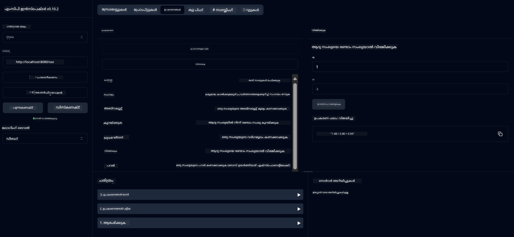

<!--
CO_OP_TRANSLATOR_METADATA:
{
  "original_hash": "13231e9951b68efd9df8c56bd5cdb27e",
  "translation_date": "2025-12-11T12:53:42+00:00",
  "source_file": "03-GettingStarted/samples/java/calculator/README.md",
  "language_code": "ml"
}
-->
# അടിസ്ഥാന കാൽക്കുലേറ്റർ MCP സർവീസ്

ഈ സർവീസ് മോഡൽ കോൺടെക്സ്റ്റ് പ്രോട്ടോക്കോൾ (MCP) വഴി സ്പ്രിംഗ് ബൂട്ട് ഉപയോഗിച്ച് വെബ്‌ഫ്ലക്സ് ട്രാൻസ്പോർട്ട് ഉപയോഗിച്ച് അടിസ്ഥാന കാൽക്കുലേറ്റർ പ്രവർത്തനങ്ങൾ നൽകുന്നു. MCP നടപ്പാക്കലുകൾ പഠിക്കുന്ന തുടക്കക്കാർക്കായി ഇത് ഒരു ലളിതമായ ഉദാഹരണമായി രൂപകൽപ്പന ചെയ്തതാണ്.

കൂടുതൽ വിവരങ്ങൾക്ക്, [MCP Server Boot Starter](https://docs.spring.io/spring-ai/reference/api/mcp/mcp-server-boot-starter-docs.html) റഫറൻസ് ഡോക്യുമെന്റേഷൻ കാണുക.

## അവലോകനം

സർവീസ് താഴെ കാണിക്കുന്നു:
- SSE (സർവർ-സെന്റ് ഇവന്റുകൾ) പിന്തുണ
- സ്പ്രിംഗ് AI യുടെ `@Tool` അനോട്ടേഷൻ ഉപയോഗിച്ച് സ്വയം ടൂൾ രജിസ്ട്രേഷൻ
- അടിസ്ഥാന കാൽക്കുലേറ്റർ ഫംഗ്ഷനുകൾ:
  - കൂട്ടിച്ചേർക്കൽ, കുറയ്ക്കൽ, ഗുണനം, വിഭജനം
  - പവർ കാൽക്കുലേഷൻ, സ്ക്വയർ റൂട്ട്
  - മോഡുലസ് (ശേഷം) അംശം, ആബ്സല്യൂട്ട് വാല്യു
  - പ്രവർത്തന വിവരണങ്ങൾക്ക് സഹായ ഫംഗ്ഷൻ

## സവിശേഷതകൾ

ഈ കാൽക്കുലേറ്റർ സർവീസ് താഴെ പറയുന്ന കഴിവുകൾ നൽകുന്നു:

1. **അടിസ്ഥാന ഗണിത പ്രവർത്തനങ്ങൾ**:
   - രണ്ട് സംഖ്യകളുടെ കൂട്ടിച്ചേർക്കൽ
   - ഒരു സംഖ്യയിൽ നിന്ന് മറ്റൊന്ന് കുറയ്ക്കൽ
   - രണ്ട് സംഖ്യകളുടെ ഗുണനം
   - ഒരു സംഖ്യയെ മറ്റൊന്നാൽ വിഭജിക്കൽ (പൂജ്യം വിഭജനം പരിശോധിച്ച്)

2. **ഉന്നത പ്രവർത്തനങ്ങൾ**:
   - പവർ കാൽക്കുലേഷൻ (ബേസ് സംഖ്യയെ എക്സ്പൊണന്റ് ഉയർത്തൽ)
   - സ്ക്വയർ റൂട്ട് കാൽക്കുലേഷൻ (നേഗറ്റീവ് സംഖ്യ പരിശോധിച്ച്)
   - മോഡുലസ് (ശേഷം) കാൽക്കുലേഷൻ
   - ആബ്സല്യൂട്ട് വാല്യു കാൽക്കുലേഷൻ

3. **സഹായ സംവിധാനം**:
   - ലഭ്യമായ എല്ലാ പ്രവർത്തനങ്ങളും വിശദീകരിക്കുന്ന ഇൻബിൽറ്റ് സഹായ ഫംഗ്ഷൻ

## സർവീസ് ഉപയോഗിക്കൽ

സർവീസ് MCP പ്രോട്ടോക്കോൾ വഴി താഴെ പറയുന്ന API എൻഡ്‌പോയിന്റുകൾ തുറക്കുന്നു:

- `add(a, b)`: രണ്ട് സംഖ്യകൾ കൂട്ടിച്ചേർക്കുക
- `subtract(a, b)`: രണ്ടാമത്തെ സംഖ്യ ആദ്യത്തെയിൽ നിന്ന് കുറയ്ക്കുക
- `multiply(a, b)`: രണ്ട് സംഖ്യകൾ ഗുണിക്കുക
- `divide(a, b)`: ആദ്യ സംഖ്യ രണ്ടാമത്താൽ വിഭജിക്കുക (പൂജ്യം പരിശോധിച്ച്)
- `power(base, exponent)`: സംഖ്യയുടെ പവർ കാൽക്കുലേറ്റ് ചെയ്യുക
- `squareRoot(number)`: സ്ക്വയർ റൂട്ട് കാൽക്കുലേറ്റ് ചെയ്യുക (നേഗറ്റീവ് പരിശോധിച്ച്)
- `modulus(a, b)`: വിഭജിക്കുമ്പോൾ ശേഷിക്കുന്ന അംശം കാൽക്കുലേറ്റ് ചെയ്യുക
- `absolute(number)`: ആബ്സല്യൂട്ട് വാല്യു കാൽക്കുലേറ്റ് ചെയ്യുക
- `help()`: ലഭ്യമായ പ്രവർത്തനങ്ങളെക്കുറിച്ച് വിവരങ്ങൾ നേടുക

## ടെസ്റ്റ് ക്ലയന്റ്

`com.microsoft.mcp.sample.client` പാക്കേജിൽ ലളിതമായ ഒരു ടെസ്റ്റ് ക്ലയന്റ് ഉൾപ്പെടുത്തിയിട്ടുണ്ട്. `SampleCalculatorClient` ക്ലാസ് കാൽക്കുലേറ്റർ സർവീസിന്റെ ലഭ്യമായ പ്രവർത്തനങ്ങൾ പ്രദർശിപ്പിക്കുന്നു.

## LangChain4j ക്ലയന്റ് ഉപയോഗിക്കൽ

പ്രോജക്റ്റിൽ `com.microsoft.mcp.sample.client.LangChain4jClient` എന്ന LangChain4j ഉദാഹരണ ക്ലയന്റ് ഉൾപ്പെടുത്തിയിട്ടുണ്ട്, ഇത് കാൽക്കുലേറ്റർ സർവീസിനെ LangChain4j, GitHub മോഡലുകളുമായി എങ്ങനെ സംയോജിപ്പിക്കാമെന്ന് കാണിക്കുന്നു:

### മുൻ‌വശം ആവശ്യങ്ങൾ

1. **GitHub ടോക്കൺ ക്രമീകരണം**:
   
   GitHub ന്റെ AI മോഡലുകൾ (phi-4 പോലുള്ള) ഉപയോഗിക്കാൻ, GitHub വ്യക്തിഗത ആക്‌സസ് ടോക്കൺ ആവശ്യമാണ്:

   a. നിങ്ങളുടെ GitHub അക്കൗണ്ട് സെറ്റിംഗ്സിലേക്ക് പോകുക: https://github.com/settings/tokens
   
   b. "Generate new token" → "Generate new token (classic)" ക്ലിക്ക് ചെയ്യുക
   
   c. ടോക്കണിന് വിവരണാത്മകമായ പേര് നൽകുക
   
   d. താഴെ പറയുന്ന സ്കോപ്പുകൾ തിരഞ്ഞെടുക്കുക:
      - `repo` (സ്വകാര്യ റിപോസിറ്ററികളുടെ പൂർണ്ണ നിയന്ത്രണം)
      - `read:org` (ഓർഗും ടീം അംഗത്വവും വായിക്കുക, ഓർഗ് പ്രോജക്റ്റുകൾ വായിക്കുക)
      - `gist` (ഗിസ്റ്റുകൾ സൃഷ്ടിക്കുക)
      - `user:email` (ഉപയോക്തൃ ഇമെയിൽ വിലാസങ്ങൾ ആക്‌സസ് ചെയ്യുക (വായ-only))
   
   e. "Generate token" ക്ലിക്ക് ചെയ്ത് പുതിയ ടോക്കൺ കോപ്പി ചെയ്യുക
   
   f. അത് ഒരു എൻവയോൺമെന്റ് വേരിയബിളായി സജ്ജമാക്കുക:
      
      Windows-ൽ:
      ```
      set GITHUB_TOKEN=your-github-token
      ```
      
      macOS/Linux-ൽ:
      ```bash
      export GITHUB_TOKEN=your-github-token
      ```

   g. സ്ഥിരതയുള്ള ക്രമീകരണത്തിന്, സിസ്റ്റം സെറ്റിംഗ്സിലൂടെ എൻവയോൺമെന്റ് വേരിയബിളുകളിൽ ചേർക്കുക

2. LangChain4j GitHub ഡിപ്പൻഡൻസി നിങ്ങളുടെ പ്രോജക്റ്റിൽ ചേർക്കുക (pom.xml-ൽ ഇതിനകം ഉൾപ്പെടുത്തിയിട്ടുണ്ട്):
   ```xml
   <dependency>
       <groupId>dev.langchain4j</groupId>
       <artifactId>langchain4j-github</artifactId>
       <version>${langchain4j.version}</version>
   </dependency>
   ```

3. കാൽക്കുലേറ്റർ സർവർ `localhost:8080`-ൽ പ്രവർത്തിക്കുന്നതായി ഉറപ്പാക്കുക

### LangChain4j ക്ലയന്റ് പ്രവർത്തിപ്പിക്കൽ

ഈ ഉദാഹരണം കാണിക്കുന്നു:
- SSE ട്രാൻസ്പോർട്ട് വഴി കാൽക്കുലേറ്റർ MCP സർവറുമായി കണക്ട് ചെയ്യുന്നത്
- കാൽക്കുലേറ്റർ പ്രവർത്തനങ്ങൾ ഉപയോഗിച്ച് LangChain4j ചാറ്റ് ബോട്ട് സൃഷ്ടിക്കുന്നത്
- GitHub AI മോഡലുകളുമായി സംയോജിപ്പിക്കൽ (ഇപ്പോൾ phi-4 മോഡൽ ഉപയോഗിച്ച്)

ക്ലയന്റ് പ്രവർത്തനം കാണിക്കാൻ താഴെ പറയുന്ന സാമ്പിൾ ക്വെറികൾ അയയ്ക്കുന്നു:
1. രണ്ട് സംഖ്യകളുടെ കൂട്ടം കാൽക്കുലേറ്റ് ചെയ്യൽ
2. ഒരു സംഖ്യയുടെ സ്ക്വയർ റൂട്ട് കണ്ടെത്തൽ
3. ലഭ്യമായ കാൽക്കുലേറ്റർ പ്രവർത്തനങ്ങളെക്കുറിച്ച് സഹായ വിവരങ്ങൾ നേടൽ

ഉദാഹരണം പ്രവർത്തിപ്പിച്ച് കൺസോൾ ഔട്ട്പുട്ട് പരിശോധിച്ച് എങ്ങനെ AI മോഡൽ കാൽക്കുലേറ്റർ ടൂളുകൾ ഉപയോഗിച്ച് ക്വെറികൾക്ക് മറുപടി നൽകുന്നു എന്ന് കാണുക.

### GitHub മോഡൽ കോൺഫിഗറേഷൻ

LangChain4j ക്ലയന്റ് GitHub ന്റെ phi-4 മോഡൽ ഉപയോഗിക്കാൻ താഴെ പറയുന്ന ക്രമീകരണങ്ങളോടെ സജ്ജീകരിച്ചിരിക്കുന്നു:

```java
ChatLanguageModel model = GitHubChatModel.builder()
    .apiKey(System.getenv("GITHUB_TOKEN"))
    .timeout(Duration.ofSeconds(60))
    .modelName("phi-4")
    .logRequests(true)
    .logResponses(true)
    .build();
```

മറ്റു GitHub മോഡലുകൾ ഉപയോഗിക്കാൻ, `modelName` പാരാമീറ്റർ മറ്റൊരു പിന്തുണയുള്ള മോഡലിലേക്ക് മാറ്റുക (ഉദാ: "claude-3-haiku-20240307", "llama-3-70b-8192" തുടങ്ങിയവ).

## ഡിപ്പൻഡൻസികൾ

പ്രോജക്റ്റിന് ആവശ്യമായ പ്രധാന ഡിപ്പൻഡൻസികൾ:

```xml
<!-- For MCP Server -->
<dependency>
    <groupId>org.springframework.ai</groupId>
    <artifactId>spring-ai-starter-mcp-server-webflux</artifactId>
</dependency>

<!-- For LangChain4j integration -->
<dependency>
    <groupId>dev.langchain4j</groupId>
    <artifactId>langchain4j-mcp</artifactId>
    <version>${langchain4j.version}</version>
</dependency>

<!-- For GitHub models support -->
<dependency>
    <groupId>dev.langchain4j</groupId>
    <artifactId>langchain4j-github</artifactId>
    <version>${langchain4j.version}</version>
</dependency>
```

## പ്രോജക്റ്റ് നിർമ്മാണം

Maven ഉപയോഗിച്ച് പ്രോജക്റ്റ് നിർമ്മിക്കുക:
```bash
./mvnw clean install -DskipTests
```

## സർവർ പ്രവർത്തിപ്പിക്കൽ

### ജാവ ഉപയോഗിച്ച്

```bash
java -jar target/calculator-server-0.0.1-SNAPSHOT.jar
```

### MCP ഇൻസ്പെക്ടർ ഉപയോഗിച്ച്

MCP ഇൻസ്പെക്ടർ MCP സർവീസുകളുമായി ഇടപഴകാൻ സഹായിക്കുന്ന ഒരു ഉപകരണം ആണ്. ഈ കാൽക്കുലേറ്റർ സർവീസിനൊപ്പം ഇത് ഉപയോഗിക്കാൻ:

1. **MCP ഇൻസ്പെക്ടർ ഇൻസ്റ്റാൾ ചെയ്ത് പുതിയ ടെർമിനൽ വിൻഡോയിൽ പ്രവർത്തിപ്പിക്കുക**:
   ```bash
   npx @modelcontextprotocol/inspector
   ```

2. **ആപ്പ് കാണിക്കുന്ന URL-ൽ ക്ലിക്ക് ചെയ്ത് വെബ് UI-യിൽ പ്രവേശിക്കുക** (സാധാരണയായി http://localhost:6274)

3. **കണക്ഷൻ ക്രമീകരിക്കുക**:
   - ട്രാൻസ്പോർട്ട് തരം "SSE" ആയി സെറ്റ് ചെയ്യുക
   - നിങ്ങളുടെ സർവർ SSE എൻഡ്‌പോയിന്റ് URL: `http://localhost:8080/sse` സെറ്റ് ചെയ്യുക
   - "Connect" ക്ലിക്ക് ചെയ്യുക

4. **ടൂളുകൾ ഉപയോഗിക്കുക**:
   - "List Tools" ക്ലിക്ക് ചെയ്ത് ലഭ്യമായ കാൽക്കുലേറ്റർ പ്രവർത്തനങ്ങൾ കാണുക
   - ഒരു ടൂൾ തിരഞ്ഞെടുക്കുകയും "Run Tool" ക്ലിക്ക് ചെയ്ത് പ്രവർത്തനം നടത്തുക



### ഡോക്കർ ഉപയോഗിച്ച്

പ്രോജക്റ്റിൽ കണ്ടെയ്‌നറൈസ്ഡ് ഡിപ്ലോയ്മെന്റിനായി Dockerfile ഉൾപ്പെടുത്തിയിട്ടുണ്ട്:

1. **Docker ഇമേജ് നിർമ്മിക്കുക**:
   ```bash
   docker build -t calculator-mcp-service .
   ```

2. **Docker കണ്ടെയ്‌നർ പ്രവർത്തിപ്പിക്കുക**:
   ```bash
   docker run -p 8080:8080 calculator-mcp-service
   ```

ഇത് ചെയ്യും:
- Maven 3.9.9, Eclipse Temurin 24 JDK ഉപയോഗിച്ച് മൾട്ടി-സ്റ്റേജ് Docker ഇമേജ് നിർമ്മിക്കുക
- ഒരു ഓപ്റ്റിമൈസ്ഡ് കണ്ടെയ്‌നർ ഇമേജ് സൃഷ്ടിക്കുക
- സർവീസ് പോർട്ട് 8080-ൽ എക്സ്പോസ് ചെയ്യുക
- കണ്ടെയ്‌നറിനുള്ളിൽ MCP കാൽക്കുലേറ്റർ സർവീസ് ആരംഭിക്കുക

കണ്ടെയ്‌നർ പ്രവർത്തനസജ്ജമായാൽ `http://localhost:8080`-ൽ സർവീസ് ആക്‌സസ് ചെയ്യാം.

## പ്രശ്നപരിഹാരം

### GitHub ടോക്കൺ സംബന്ധിച്ച സാധാരണ പ്രശ്നങ്ങൾ

1. **ടോക്കൺ അനുമതി പ്രശ്നങ്ങൾ**: 403 Forbidden പിശക് ലഭിച്ചാൽ, മുൻ‌വശം ആവശ്യങ്ങളിൽ പറഞ്ഞിട്ടുള്ള അനുമതികൾ ടോക്കണിന് ഉണ്ടെന്ന് പരിശോധിക്കുക.

2. **ടോക്കൺ കണ്ടെത്താനാകാത്തത്**: "No API key found" പിശക് വന്നാൽ, GITHUB_TOKEN എൻവയോൺമെന്റ് വേരിയബിൾ ശരിയായി സജ്ജമാക്കിയിട്ടുണ്ടോ എന്ന് ഉറപ്പാക്കുക.

3. **റേറ്റ് ലിമിറ്റിംഗ്**: GitHub API-യ്ക്ക് റേറ്റ് ലിമിറ്റുകൾ ഉണ്ട്. 429 സ്റ്റാറ്റസ് കോഡ് പിശക് വന്നാൽ, കുറച്ച് മിനിറ്റുകൾ കാത്ത് വീണ്ടും ശ്രമിക്കുക.

4. **ടോക്കൺ കാലഹരണപ്പെടൽ**: GitHub ടോക്കണുകൾ കാലഹരണപ്പെടാം. ചില സമയം കഴിഞ്ഞ് ഓതന്റിക്കേഷൻ പിശകുകൾ വന്നാൽ, പുതിയ ടോക്കൺ സൃഷ്ടിച്ച് എൻവയോൺമെന്റ് വേരിയബിൾ അപ്ഡേറ്റ് ചെയ്യുക.

കൂടുതൽ സഹായത്തിന് [LangChain4j ഡോക്യുമെന്റേഷൻ](https://github.com/langchain4j/langchain4j) അല്ലെങ്കിൽ [GitHub API ഡോക്യുമെന്റേഷൻ](https://docs.github.com/en/rest) പരിശോധിക്കുക.

---

<!-- CO-OP TRANSLATOR DISCLAIMER START -->
**അസൂയാ**:  
ഈ രേഖ AI വിവർത്തന സേവനം [Co-op Translator](https://github.com/Azure/co-op-translator) ഉപയോഗിച്ച് വിവർത്തനം ചെയ്തതാണ്. നാം കൃത്യതയ്ക്ക് ശ്രമിച്ചിട്ടുണ്ടെങ്കിലും, സ്വയം പ്രവർത്തിക്കുന്ന വിവർത്തനങ്ങളിൽ പിശകുകൾ അല്ലെങ്കിൽ തെറ്റുകൾ ഉണ്ടാകാമെന്ന് ദയവായി ശ്രദ്ധിക്കുക. അതിന്റെ മാതൃഭാഷയിലുള്ള യഥാർത്ഥ രേഖയാണ് പ്രാമാണികമായ ഉറവിടം എന്ന് പരിഗണിക്കേണ്ടതാണ്. നിർണായകമായ വിവരങ്ങൾക്ക്, പ്രൊഫഷണൽ മനുഷ്യ വിവർത്തനം ശുപാർശ ചെയ്യപ്പെടുന്നു. ഈ വിവർത്തനം ഉപയോഗിക്കുന്നതിൽ നിന്നുണ്ടാകുന്ന ഏതെങ്കിലും തെറ്റിദ്ധാരണകൾക്കോ തെറ്റായ വ്യാഖ്യാനങ്ങൾക്കോ ഞങ്ങൾ ഉത്തരവാദികളല്ല.
<!-- CO-OP TRANSLATOR DISCLAIMER END -->