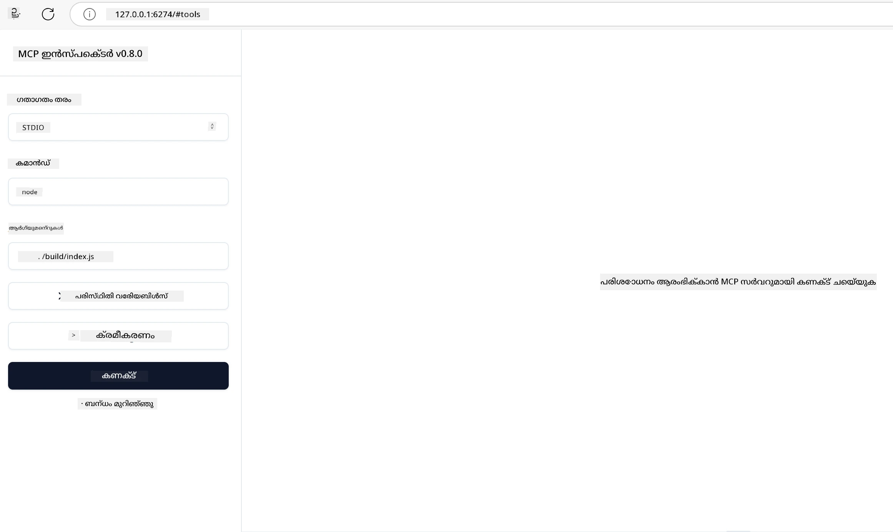

# പ്രായോഗിക നടപ്പാക്കൽ

[](https://youtu.be/vCN9-mKBDfQ)

_(ഈ പാഠത്തിന്റെ വീഡിയൊ കാണാനായി മുകളിൽ ഉള്ള ചിത്രം ക്ലിക്ക് ചെയ്യുക)_

പ്രായോഗിക നടപ്പാക്കലാണ് Model Context Protocol (MCP) യുടെ ശക്തി അനുഭവാർഥമാകുന്നത്. MCP ന്റെ സിദ്ധാന്തവും ശില്പശാലയും മനസ്സിലാക്കുന്നത് പ്രധാനപ്പെട്ടതായിരിക്കും, എന്നാൽ യാഥാർത്ഥ്യപ്രശ്നങ്ങൾ പരിഹരിക്കുന്ന പരിഹാരങ്ങൾ നിർമ്മിക്കുക, പരീക്ഷിക്കുക, വിന്യസിക്കുക തുടങ്ങിയ പ്രവർത്തനങ്ങളിൽ ഈ ആശയങ്ങൾ പ്രയോഗിക്കുന്നത് ആണ് യഥാർത്ഥ മൂല്യം. ഈ അധ്യായം തത്വവാദാന്‌തവും സ്വകാര്യാവശ്യകതകളും തമ്മിലുള്ള ഇടംവച്ച് MCP അടിസ്ഥാനമാക്കി ആപ്ലിക്കേഷനുകൾ സജീവമാക്കുന്ന പ്രക്രിയയിലൂടെ നിങ്ങളെ നയിക്കുന്നു.

നിങ്ങൾ ബുദ്ധിമുട്ടുള്ള അസിസ്റ്റന്റുകളിൽ വികസിപ്പിക്കുകയോ, AI ബിസിനസ് പ്രവൃത്തികളിലേക്ക് സംയോജിപ്പിക്കുകയോ, ഡാറ്റ പ്രോസസ്സിംഗിനായി കസ്റ്റം ടൂളുകൾ നിർമ്മിക്കുകയോ ചെയ്താലും, MCP ഒരു ലളിതവും എളുപ്പത്തിലുള്ള അടിസ്ഥാനം നൽകുന്നു. അതിന്റെ ഭാഷാ-നിഷ്ഠ ഡിസൈൻ, പ്രശസ്ത പ്രോഗ്രാമിങ് ഭാഷകളിലേക്കുള്ള ഔദ്യോഗിക SDK കളിലൂടെ പലവിധ ഡെവലപ്പർമാർക്ക് ഇത് ലഭ്യമാകുന്നു. ഈ SDK കളുടെ സഹായത്തോടുകൂടി, നിങ്ങൾ തുരങ്കം ഉണ്ടാക്കാനും, കൂട്ടിയിണക്കാനും, വിവിധ പ്ലാറ്റ്ഫോമുകളിലെയും പരിസരങ്ങളിലെയും നിശ്ചിത പരിഹാരങ്ങൾ വേഗത്തിൽ വ്യാപിപ്പിക്കാനും കഴിയും.

താഴെപ്പറയുന്ന വകുപ്പുകളിൽ, നിങ്ങള്ക്ക് C#, Java with Spring, TypeScript, JavaScript, Python എന്നിങ്ങനെ MCP ന്റെ പ്രായോഗിക ഉദാഹരണങ്ങൾ, സാമ്പിൾ കോഡ്, വിന്യാസ തന്ത്രങ്ങൾ ലഭിക്കും. MCP സെർവർസ് ഡീബഗും, API മാനേജുമെന്റും, Azure ഉപയോഗിച്ച് ക്ലൗഡിലേക്കേ വിന്യാസം ചെയ്യുന്നതും സംബന്ധിച്ച പഠനങ്ങളും ഉൾക്കൊള്ളുന്നു. ഈ ഹാന്റ്സ്-ഓൺ റിസോഴ്‌സുകൾ നിങ്ങളുടെ പഠനത്തെ വേഗത്തിലാക്കുകയും ഉറപ്പിക്കപ്പെട്ട ഉത്‌പാദനോൽപ്പന്ന MCP ആപ്ലിക്കേഷനുകൾ നിർമ്മിക്കാൻ സഹായിക്കുകയും ചെയ്യും.

## അവലോകനം

ഈ പാഠം MCP സ്രഷ്ടിയിൽ വിവിധ പ്രോഗ്രാമിങ് ഭാഷകൾ ഉപയോഗിച്ചുള്ള പ്രായോഗിക അടിസ്ഥാനം പരിശോധിക്കുന്നു. C#, Java with Spring, TypeScript, JavaScript, Python എന്നിവയിൽ MCP SDKകൾ ഉപയോഗിച്ച് കരുത്തുറ്റ ആപ്ലിക്കേഷനുകൾ നിർമ്മിക്കാനും MCP സെർവർസ് ഡീബഗ് ചെയ്ത് ടെസ്റ്റ് ചെയ്യാനും, പുനരുപയോഗയോഗ്യമായ റിസോഴ്‌സുകൾ, പ്രോമ്പ്റ്റുകൾ, ടൂളുകൾ സൃഷ്ടിക്കാനും പഠിപ്പിക്കുന്നു.

## പഠന ലക്ഷ്യങ്ങൾ

ഈ പാഠം അവസാനിക്കുമ്പോൾ, നിങ്ങൾക്ക് കഴിയും:

- വിവിധ പ്രോഗ്രാമിങ് ഭാഷകളിലെ ഔദ്യോഗിക SDKകൾ ഉപയോഗിച്ച് MCP പരിഹാരങ്ങൾ നടപ്പിലാക്കാൻ
- MCP സെർവർസ് സിസ്റ്റമാറ്റിക് ആയി ഡീബഗ് ചെയ്ത് ടെസ്റ്റ് ചെയ്യാൻ
- സെർവർ ഫീച്ചറുകൾ (റിസോഴ്‌സുകൾ, പ്രോംപ്റ്റുകൾ, ടൂളുകൾ) സൃഷ്ടിക്കുകയും ഉപയോഗിക്കുകയും ചെയ്യാൻ
- സങ്കീർണപ്രവൃത്തികൾക്കായി MCP വർക്ക്‌ഫ്ലോകൾ രൂപകൽപ്പന ചെയ്യാൻ
- പ്രകടനവും വിശ്വാസ്യതയും ഉറപ്പാക്കുന്നതിനായി MCP നടപ്പാക്കലുകൾ ഓപ്റ്റിമൈസ് ചെയ്യാൻ

## ഔദ്യോഗിക SDK റിസോഴ്‌സുകൾ

Model Context Protocol മൾട്ടി-ലാംഗ്വേജ് ഔദ്യോഗിക SDK കളുമായി ലഭ്യമാണ് ([MCP Specification 2025-11-25](https://spec.modelcontextprotocol.io/specification/2025-11-25/) അനുസരിച്ച്):

- [C# SDK](https://github.com/modelcontextprotocol/csharp-sdk)
- [Java with Spring SDK](https://github.com/modelcontextprotocol/java-sdk) **കുറിപ്പ്:** Project Reactor നു ആശ്രയമാണ്. (വായിക്കുക [discussion issue 246](https://github.com/orgs/modelcontextprotocol/discussions/246).)
- [TypeScript SDK](https://github.com/modelcontextprotocol/typescript-sdk)
- [Python SDK](https://github.com/modelcontextprotocol/python-sdk)
- [Kotlin SDK](https://github.com/modelcontextprotocol/kotlin-sdk)
- [Go SDK](https://github.com/modelcontextprotocol/go-sdk)

## MCP SDK കളുമായുള്ള പ്രവർത്തനം

MCP പ്രയോഗത്തിൻ്റെ പ്രായോഗിക ഉദാഹരണങ്ങൾ വിവിധ പ്രോഗ്രാമിങ് ഭാഷകളിൽ ഈ ഭാഗം നൽകുന്നു. ഭാഷാപ്രകാരം `samples` ഫോൾഡറിൽ സാമ്പിൾ കോഡ് കാണാം.

### ലഭ്യമായ സാമ്പിളുകൾ

റിപോസിറ്ററിയിൽ ഉള്ള [സാമ്പിൾ നടപ്പാക്കലുകൾ](../../../04-PracticalImplementation/samples) ഇതിലുണ്ട്:

- [C#](./samples/csharp/README.md)
- [Java with Spring](./samples/java/containerapp/README.md)
- [TypeScript](./samples/typescript/README.md)
- [JavaScript](./samples/javascript/README.md)
- [Python](./samples/python/README.md)

പ്രത്യേക ഭാഷയ്ക്കും പരിസ്ഥിതിക്കും അനുയോജ്യമായി MCP സിദ്ധാന്തങ്ങളും നടപ്പാക്കൽ മാതൃകകളും ഓരോ സാമ്പളും കാണിക്കുന്നു.

### പ്രായോഗിക മാർഗ്ഗനിർദേശങ്ങൾ

പേരാണുള്ള MCP നടപ്പാക്കലിനായുള്ള കൂട്ടിച്ചേർത്ത മാർഗ്ഗനിർദേശങ്ങൾ:

- [Pagination and Large Result Sets](./pagination/README.md) - ഉപകരണങ്ങൾ, റിസോഴ്‌സുകൾ, വലുതായ ഡാറ്റാ സെറ്റുകൾക്കായി കേഴ്സർ ആധാരിത പേജിനേഷൻ കൈകാര്യം ചെയ്യുക

## കോർ സെർവർ ഫീച്ചറുകൾ

MCP സെർവർസിന് താഴെ പറയുന്ന ഫീച്ചറുകളുടെ സമാമേളം നടപ്പിലാക്കാൻ കഴിയും:

### Resources

ഉപയോക്താവിനോ AI മോഡലിനോ ഉപയോഗിക്കാനുളള കോൺടെക്സ്റ്റും ഡാറ്റയും നൽകുന്ന റിസോഴ്‌സുകൾ:

- ഡോക്യുമെന്റ് സംഭരണങ്ങൾ
- വിജ്ഞാന അടിസ്ഥാനങ്ങൾ
- ഘടിത ഡാറ്റാ ഉറവിടങ്ങൾ
- ഫയൽ സിസ്റ്റങ്ങൾ

### Prompts

ഉപയോക്താക്കളുടെ വേണ്ടി ടെംപ്ലേറ്റുചെയ്ത സന്ദേശങ്ങളും പ്രവൃത്തിപ്രവാഹങ്ങളും:

- മുൻനിർണ്ണയിച്ച സംഭാഷണ ടെംപ്ളേറ്റുകൾ
- നയിക്കുന്ന സംവേദന മാതൃകകൾ
- പ്രത്യേക സംഭാഷണ ഘടനകൾ

### Tools

AI മോഡലിന് നിർവ്വഹിക്കേണ്ട പ്രവർത്തനങ്ങൾ:

- ഡാറ്റ പ്രോസസ്സിംഗ് ഉപകരണങ്ങൾ
- ബാഹ്യ API സംയോജനം
- ഗണിത ശേഷികൾ
- തിരയൽ സൗകര്യം

## സാമ്പിൾ നടപ്പാക്കലുകൾ: C# Implementation

ഓദ്യോഗിക C# SDK റിപോസിറ്ററിയിൽ MCP ന്റെ വിവിധ ഭാഗങ്ങൾ കാണിക്കുന്ന പല സാമ്പിൾ നടപ്പാക്കലുകളുണ്ട്:

- **ബേസിക് MCP ക്ലയന്റ്**: MCP ക്ലയന്റ് സൃഷ്ടിച്ച് ടൂളുകൾ വിളിക്കുന്ന ലളിത ഉദാഹരണം
- **ബേസിക് MCP സെർവർ**: അടിസ്ഥാന ടൂൾ രജിസ്ട്രേഷൻ ഉള്ള സ്വൽപമാകുന്ന സെർവർ
- **ആഡ്‌വാൻസ്ഡ് MCP സെർവർ**: ടൂൾ രജിസ്ട്രേഷൻ, അത്തന്റിക്കേഷൻ, പിശക് കൈകാര്യം എന്നിവ ഉൾപ്പെടുത്തിയ മുഴുവൻ ഫീച്ചറുള്ള സെർവർ
- **ASP.NET ഇന്റഗ്രേഷൻ**: ASP.NET കോറുമായി സംയോജിപ്പിക്കുന്ന ഉദാഹരണങ്ങൾ
- **ടൂൾ നടപ്പാക്കൽ മാതൃകകൾ**: വേഗമേറിയും വ്യത്യസ്ത ബുദ്ധിമുട്ടുകളും ഉള്ള ടൂളുകൾ നടപ്പിലാക്കാനുളള വ്യത്യസ്ത മാതൃകകൾ

MCP C# SDK ഇപ്പോൾ പ്രിവ്യൂ ഘട്ടത്തിലാണ്, API ഗൾ മാറ്റം വരുത്താൻ സാധ്യതയുണ്ട്. SDK വികസനവുമായി ക്രമത്തോടെയാണ് ഈ ബ്ലോഗ് പുതുക്കുന്നതു.

### പ്രധാന ഫീച്ചറുകൾ

- [C# MCP Nuget ModelContextProtocol](https://www.nuget.org/packages/ModelContextProtocol)
- നിങ്ങളുടെ [ആദ്യ MCP സെർവർ](https://devblogs.microsoft.com/dotnet/build-a-model-context-protocol-mcp-server-in-csharp/) നിർമ്മിക്കലിൽ സഹായം

കമ്പിളീറ്റ് C# സാമ്പിൾക്കായി, [ഔദ്യോഗിക C# SDK സാമ്പിൾസ് റിപോസിറ്ററി](https://github.com/modelcontextprotocol/csharp-sdk) സന്ദർശിക്കുക

## സാമ്പിൾ നടപ്പാക്കൽ: Java with Spring Implementation

Java with Spring SDK എന്റർപ്രൈസ് നിലവാരമുള്ള ഫീച്ചറുകൾ കൂടിയ ശക്തമായ MCP നടപ്പാക്കൽ ഓഫർ ചെയ്യുന്നു.

### പ്രധാന ഫീച്ചറുകൾ

- സ്പ്രിംഗ് ഫ്രെയിംവർക്ക് ഇന്റഗ്രേഷൻ
- ബലമുള്ള ടൈപ്പ് സുരക്ഷ
- റിയാക്റ്റീവ് പ്രോഗ്രാമിങ് പിന്തുണ
- സമഗ്ര പിശക് കൈകാര്യം

പൂർണ്ണ Java with Spring നടപ്പാക്കലിനായി [Java with Spring സാമ്പിൾ](samples/java/containerapp/README.md) നോക്കുക.

## സാമ്പിൾ നടപ്പാക്കൽ: JavaScript Implementation

JavaScript SDK ഒരു ലഘുവുമായും സുതാര്യവുമായ MCP നടപ്പാക്കൽ വഴി നൽകുന്നു.

### പ്രധാന ഫീച്ചറുകൾ

- Node.js, ബ്രൗസർ പിന്തുണ
- പ്രോമിസ് അടിസ്ഥാനമാക്കിയ API
- Express പോലുള്ള ഫ്രെയിംവർക്ക്‌സും മറ്റും എളുപ്പത്തിൽ സംയോജിപ്പിക്കൽ
- ಸ್ಟ್ರೀಮಿಂಗ್ സപ്പോർട്ട് വെബ്സോക്കറ്റിൽ

പൂർണ്ണ JavaScript നടപ്പാക്കലിനായി [JavaScript സാമ്പിൾ](samples/javascript/README.md) കാണുക.

## സാമ്പിൾ നടപ്പാക്കൽ: Python Implementation

Python SDK ഏറ്റവും മികച്ച മെഷീൻ ലേണിംഗ് ഫ്രെയിംവർക്കുകൾ സംയോജിപ്പിക്കൽ കൂടിയ Pythonയെ അനുയോജ്യമായ MCP നടപ്പാക്കൽ നൽകുന്നു.

### പ്രധാന ഫീച്ചറുകൾ

- asyncio ഉപയോഗിച്ച് async/await പിന്തുണ
- FastAPI ഇന്റഗ്രേഷൻ
- ലളിതമായ ടൂൾ രജിസ്ട്രേഷൻ
- പ്രശസ്ത ML ലൈബ്രറികളുമായുള്ള നാറ്റീവ് ഇന്റഗ്രേഷൻ

പൂർണ്ണ Python നടപ്പാക്കലിനായി [Python സാമ്പിൾ](samples/python/README.md) കാണുക.

## API മാനേജുമെന്റ്

Azure API മാനേജുമെന്റ് MCP സെർവറുകളുടെ സുരക്ഷയ്ക്കുള്ള ഒരു മികച്ച ഉത്തരം ആണ്. നിങ്ങളുടെ MCP സെർവറിന് മുൻപായി ഒരു Azure API മാനേജുമെന്റ് ഇൻസ്റ്റൻസ് സ്ഥാപിച്ച്, താഴെപ്പറയുന്നവ പോലുള്ള ഫീച്ചറുകൾ കൈകാര്യം ചെയ്യാൻ ഇതിനെ അനുവദിക്കാം:

- റേറ്റ് ലിമിറ്റിംഗ്
- ടോക്കൺ മാനേജുമെന്റ്
- നിരീക്ഷണം
- ലോഡ് ബാലൻസിങ്ങ്
- സുരക്ഷ

### Azure സാമ്പിൾ

നിങ്ങൾ ഈ പോലെ ചെയ്യുന്നത് കാണുന്ന ഒരു Azure സാമ്പിൾ—അതാണ് MCP സെർവർ സൃഷ്ടിച്ച് Azure API മാനേജ്‌മെന്റിൽ അത് സുരക്ഷിതമാക്കൽ: [remote-mcp-apim-functions-python](https://github.com/Azure-Samples/remote-mcp-apim-functions-python).

അധികാരം പ്രക്രിയ താഴെയുള്ള ചിത്രത്തിൽ കാണുക:


മുൻപ് നൽകിയ ചിത്രത്തിൽ സംഭവിക്കുന്നത്:

- Microsoft Entra ഉപയോഗിച്ച് അംഗീകൃതവും അധികാര നിയന്ത്രണവും നടക്കുന്നു.
- Azure API മാനേജുമെന്റ് ഗേറ്റ്വേയെന്ന നിലയിൽ പ്രവർത്തിച്ച് പോളിസികൾ ഉപയോഗിച്ചും ട്രാഫിക് നിയന്ത്രിക്കുന്നു.
- Azure Monitor മികച്ച വിശകലനത്തിനായി എല്ലാ റിക്വസ്റ്റുകളും രേഖപ്പെടുത്തുന്നു.

#### Authorization flow

അധികാരം ലഭിക്കുന്ന പ്രവാഹം വിശദമായി കാണാം:


#### MCP authorization specification

കൂടുതൽ അറിയാൻ [MCP Authorization specification](https://spec.modelcontextprotocol.io/specification/2025-11-25/basic/authorization/) കാണുക

## Remote MCP Server Azure -ലേക്ക് വിന്യാസം

മുമ്പ് പറഞ്ഞ സാമ്പിൾ വിന്യാസിക്കാൻ നോക്കാം:

1. റിപോ ക്ലോൺ ചെയ്യുക

    ```bash
    git clone https://github.com/Azure-Samples/remote-mcp-apim-functions-python.git
    cd remote-mcp-apim-functions-python
    ```

1. `Microsoft.App` റിസോഴ്‌സ് പ്രൊവൈഡർ രജിസ്റ്റർ ചെയ്യുക.

   - Azure CLI ഉപയോഗിക്കുന്നെങ്കിൽ `az provider register --namespace Microsoft.App --wait` എന്നത് പ്രവർത്തിപ്പിക്കുക.
   - Azure PowerShell ഉപയോഗിക്കുന്നെങ്കിൽ `Register-AzResourceProvider -ProviderNamespace Microsoft.App` എന്നത് പ്രവർത്തിപ്പിക്കുക. കുറേ നേരത്തിന് ശേഷം `(Get-AzResourceProvider -ProviderNamespace Microsoft.App).RegistrationState` പരിശോധിക്കുക രജിസ്ട്രേഷൻ പൂർത്തിയായെന്ന് ഉറപ്പ് വരുത്താൻ.

1. api മാനേജ്മെന്റ് സേവനം, ഫംഗ്ഷൻ ആപ്പ് (കോഡിനൊപ്പം) എന്നിവ പ്രദാനം ചെയ്യാൻ ഈ [azd](https://aka.ms/azd) കമാൻഡ് പ്രവർത്തിപ്പിക്കുക

    ```shell
    azd up
    ```

    ഈ കമാൻഡുകൾ Azure-ൽ എല്ലാ ക്ലൗഡ് റിസോഴ്‌സുകളും വിന്യാസം ചെയ്യും

### MCP ഇൻസ്പെക്റ്റർ ഉപയോഗിച്ച് സെർവർ ടെസ്റ്റിംഗ്

1. **പുതിയ ടെർമിനൽ വിൻഡോയിൽ**, MCP ഇൻസ്പെക്റ്റർ ഇൻസ്റ്റാൾ ചെയ്തു പ്രവർത്തിപ്പിക്കുക

    ```shell
    npx @modelcontextprotocol/inspector
    ```

    നിങ്ങള്ക്ക് ഈ പോലുള്ള ഇന്റർഫേസ് കാണും:

    

1. MCP Inspector വെബ് ആപ്പ് URL (ജെ. സോ. [http://127.0.0.1:6274/#resources](http://127.0.0.1:6274/#resources)) CTRL ക്ലിക്ക് ചെയ്ത് ലോഡുചെയ്യുക
1. ട്രാൻസ്പോർട്ട് ടൈപ്പ് `SSE` ആക്കുക
1. നിങ്ങൾ പ്രവർത്തിപ്പിച്ചിരിക്കുന്ന API മാനേജ്മെന്റ് SSE എൻഡ്‌പോയിന്റ് (azd up ശേഷം കാണുന്നത്) URL ആയി സെറ്റ് ചെയ്ത് **Connect** ചെയ്യുക:

    ```shell
    https://<apim-servicename-from-azd-output>.azure-api.net/mcp/sse
    ```

1. **List Tools** അമർത്തുക. ഒരു ടൂൾ ക്ലിക്ക് ചെയ്ത് **Run Tool** അമർത്തുക.  

എല്ലാ ഘട്ടങ്ങളും വിജയകരമാണെങ്കിൽ ഇനി MCP സെർവറുമായി ബന്ധപ്പെടുകയും ഒരു ടൂൾ വിളിക്കാൻ കഴിയും.

## Azure-നുള്ള MCP സെർവർസ്

[Remote-mcp-functions](https://github.com/Azure-Samples/remote-mcp-functions-dotnet): Python, C# .NET, Node/TypeScript ഉപയോഗിച്ച് Azure Functions വഴി റിമോട്ട് MCP സെർവർട്ടിക്ക് ക്വിക്‌സ്റ്റാർട്ട് ടെംപ്ലേറ്റുകൾ.

സാമ്പിളുകളിലൂടെ മോഡലർമാർക്ക് സാധ്യമാക്കുന്നു:

- ലോക്കലിൽ ബിൽഡ് ചെയ്യാനും റൺ ചെയ്യാനും: MCP സെർവർ ഡെവലപ് ചെയ്ത് ഡീബഗ് ചെയ്യുക
- Azure ലേക്ക് വിന്യാസം: azd up ഉപയോഗിച്ച് എളുപ്പത്തിൽ ക്ലൗഡിലേക്ക് വിന്യസിക്കുക
- ക്ലയന്റുകളിൽ നിന്ന് കണക്ട് ചെയ്യുക: VS Code Copilot ഏജന്റ് മോഡ്, MCP Inspector ടൂൾ തുടങ്ങിയവയിൽ നിന്നുള്ള കണക്ഷൻ ലഭ്യമാക്കുക

### പ്രധാന ഫീച്ചറുകൾ

- സെക്യൂരിറ്റി: കീകളും HTTPS ഉപയോഗിച്ച് MCP സെർവർ സുരക്ഷിതമാക്കുന്നു
- അത്തന്റ് ഓപ്ഷനുകൾ: ബിൽറ്റ് ഇൻ ഓത് അല്ലെങ്കിൽ API മാനേജ്മെന്റ് ഉപയോഗിച്ചുള്ള ഓത് പിന്തുണ
- നെറ്റ്വർക് ഐസൊലേഷൻ: Azure Virtual Networks (VNET) ഉപയോഗിച്ച് നെറ്റ്വർക്കിനെ നിർബന്ധിതമാക്കാം
- സർവർ ലെസ്സ് ശിൽപശാല: Azure Functions ഉപയോഗിച്ച് സ്കെയിലബിൾ, ഇവന്റ്-ചാലിത പ്രോസസ്സിങ്ങ്
- ലോക്കൽ ഡെവലപ്പ്‌മെന്റ്: സമഗ്രമായ ലോക്കൽ വികസനവും ഡീബഗ്ഗിംഗും
- ലളിത വിന്യാസം: Azure ലേക്കുള്ള streamlined deployment

പഠനം ആരംഭിക്കാൻ പ്രോഡക്ഷൻ റെഡി MCP സെർവർ നടപ്പാക്കലിനായി എല്ലാ കോൺഫിഗ് ഫയലുകളും, സോഴ്‌സ് കോഡും, ഇൻഫ്രാസ്ട്രക്ചർ നിർവചനങ്ങളും ഇതിൽ ഉൾക്കൊള്ളുന്നു.

- [Azure Remote MCP Functions Python](https://github.com/Azure-Samples/remote-mcp-functions-python) - Azure Functions Python ഉപയോഗിക്കുന്ന MCP ഉദാഹരണം

- [Azure Remote MCP Functions .NET](https://github.com/Azure-Samples/remote-mcp-functions-dotnet) - Azure Functions C# .NET ഉപയോഗിക്കുന്ന MCP ഉദാഹരണം

- [Azure Remote MCP Functions Node/Typescript](https://github.com/Azure-Samples/remote-mcp-functions-typescript) - Azure Functions Node/TypeScript ഉപയോഗിക്കുന്ന MCP ഉദാഹരണം

## പ്രധാന കണ്ടെത്തലുകൾ

- MCP SDK കളിൽ ഭാഷാ-സവിശേഷ ടൂളുകൾ MCP പരിഹാരങ്ങൾ നടപ്പിലാക്കാൻ ലഭിക്കുന്നു
- ഡീബഗിംഗ്, ടെസ്റ്റിംഗ് പ്രക്രിയ MCP ആപ്ലിക്കേഷനുകൾക്ക് വിശ്വാസ്യത നൽകുന്നതിൽ നിർണായകം
- പുനരുപയോഗയോഗ്യമായ പ്രോമ്പ്റ്റ് ടെംപ്ലേറ്റുകൾ AI സംവാദം സ്ഥിരതയുള്ളതാക്കുന്നു
- മികച്ച വർക്ക്‌ഫ്ലോകൾ സങ്കീർണ ടാസ്‌കുകൾ ഒത്തു ചേർത്തു നടത്തുന്നു
- MCP പരിഹാരങ്ങൾ നടപ്പിലാക്കുമ്പോൾ സുരക്ഷ, പ്രകടനം, പിശക് കൈകാര്യം എന്നിവ പരിഗണിക്കേണ്ടത് അനിവാര്യമാണ്

## പരിശീലനം

താങ്കളുടെ മേഖലയിലെ യാഥാർത്ഥ്യപ്രശ്നം പരിഹരിക്കുന്ന ഒരു പ്രായോഗിക MCP വർക്ക്‌ഫ്ലോ രൂപകൽപ്പന ചെയ്യുക:

1. ഈ പ്രശ്നം പരിഹരിക്കുന്നതിന് സഹായകമായ 3-4 ടൂളുകൾ തിരിച്ചറിഞ്ഞു
2. ഈ ടൂളുകൾ എങ്ങനെ സംവേദിക്കുന്നു എന്ന് കാണിക്കുന്ന വർക്ക്‌ഫ്ലോ രേഖ രചിക്കുക
3. നിങ്ങൾക്ക് ഇഷ്ടമുള്ള ഭാഷയിൽ ഒന്ന് ടൂൾ അടിസ്ഥാന രൂപത്തിൽ നടപ്പിലാക്കുക
4. മോഡൽ നിങ്ങളുടെ ടൂൾ ഫലപ്രദമായി ഉപയോഗിക്കാൻ സഹായിക്കുന്ന പ്രോമ്പ്റ്റ് ടെംപ്ലേറ്റ് സൃഷ്ടിക്കുക

## അധിക റിസോഴ്‌സുകൾ

---

## പിന്നിലെത്

അടുത്തത്: [അഡ്വാൻസ്ഡ് വിഷങ്ങൾ](../05-AdvancedTopics/README.md)

---

<!-- CO-OP TRANSLATOR DISCLAIMER START -->
**അസ്വീകാര്യം**:  
ഈ രേഖ AI വിവർത്തന സേവനം [Co-op Translator](https://github.com/Azure/co-op-translator) ഉപയോഗിച്ച് പരിഭാഷപ്പെടുത്തിയതാണ്. നാം സത്യം നിലനിറുത്താൻ ശ്രമിക്കുന്നുവെങ്കിലും ഓട്ടോമായ വിവർത്തനങ്ങളിൽ പിശകുകളും അപൂർവ്വതകളും ഉണ്ടാകാമെന്നും ദയവായി മനസിലാക്കുക. പ്രധാനമായ വിവരങ്ങൾക്കും ഔദ്യോഗികമായി പ്രൊഫഷണൽ മനുഷ്യൻ നിർവഹിക്കുന്ന വിവർത്തനം നിർദേശിക്കുന്നു. ഈ വിവർത്തനം ഉപയോഗിച്ച് ഉണ്ടായ യാതൊരു തെറ്റിദ്ധാരണക്കായോ വ്യാഖ്യാനക്കായോ ഞങ്ങൾ ഉത്തരവാദിത്വം ഏറ്റെടുക്കുന്നില്ല.  
മൂല രേഖ നമ്മുടെ സ്വജീവിത ഭാഷയിലുള്ളതാണ് അതിനാൽ അതേ ഉറവിടം അംഗീകരിക്കണം.
<!-- CO-OP TRANSLATOR DISCLAIMER END -->