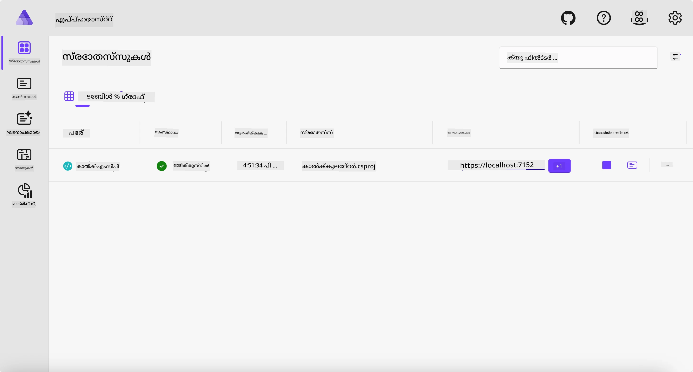
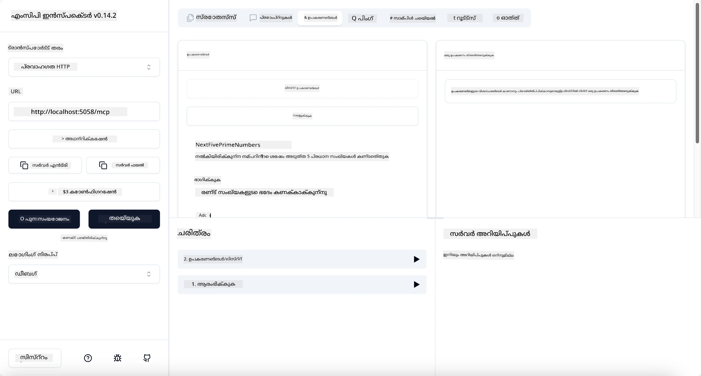

# സാമ്പിൾ

മുൻ ഉദാഹരണം `stdio` തരം ഉപയോഗിച്ച് ഒരു ലോക്കൽ .NET പ്രോജക്ട് എങ്ങനെ ഉപയോഗിക്കാമെന്ന് കാണിക്കുന്നു. കൂടാതെ ഒരു കണ്ടെയ്‌നറിൽ സെർവർ ലോക്കലായി എങ്ങനെ ഓടിക്കാമെന്ന് കാണിക്കുന്നു. ഇത് പല സാഹചര്യങ്ങളിലും നല്ല പരിഹാരമാണ്. എന്നിരുന്നാലും, സെർവർ ക്ലൗഡ് പരിസ്ഥിതിയിൽ പോലുള്ള ദൂരസ്ഥലത്ത് ഓടിക്കുന്നത് ഉപകാരപ്രദമായിരിക്കാം. ഇതാണ് `http` തരം ഉപയോഗിക്കുന്ന സ്ഥലം.

`04-PracticalImplementation` ഫോൾഡറിലുള്ള പരിഹാരം നോക്കുമ്പോൾ, ഇത് മുൻവരെയുള്ളതിനെക്കാൾ വളരെ സങ്കീർണ്ണമായതായി തോന്നാം. പക്ഷേ യാഥാർത്ഥ്യത്തിൽ അത് അങ്ങനെ അല്ല. `src/Calculator` പ്രോജക്ട് ശ്രദ്ധാപൂർവ്വം നോക്കിയാൽ, മുൻ ഉദാഹരണത്തിലെ കോഡിനോട് വളരെ സാമ്യമാണെന്ന് കാണും. വ്യത്യാസം ഒറ്റയടിക്ക്, HTTP അഭ്യർത്ഥനകൾ കൈകാര്യം ചെയ്യാൻ നാം വ്യത്യസ്തമായ ലൈബ്രറി `ModelContextProtocol.AspNetCore` ഉപയോഗിക്കുന്നു എന്നതാണ്. കൂടാതെ `IsPrime` മെത്തഡ് പ്രൈവറ്റ് ആക്കുന്നു, ഇത് നിങ്ങളുടെ കോഡിൽ പ്രൈവറ്റ് മെത്തഡുകൾ ഉണ്ടാകാമെന്ന് കാണിക്കാൻ മാത്രം. ബാക്കി കോഡ് മുൻപത്തെ പോലെ തന്നെയാണ്.

മറ്റു പ്രോജക്ടുകൾ [.NET Aspire](https://learn.microsoft.com/dotnet/aspire/get-started/aspire-overview) നിന്നാണ്. സൊല്യൂഷനിൽ .NET Aspire ഉണ്ടാകുന്നത് ഡെവലപ്പർക്ക് വികസിപ്പിക്കുമ്പോഴും ടെസ്റ്റുചെയ്യുമ്പോഴും അനുഭവം മെച്ചപ്പെടുത്തുകയും ഓബ്സർവബിലിറ്റിയിൽ സഹായിക്കുകയും ചെയ്യും. സെർവർ ഓടിക്കാൻ ഇത് ആവശ്യമായില്ല, പക്ഷേ സൊല്യൂഷനിൽ ഇത് ഉൾപ്പെടുത്തുന്നത് നല്ല പ്രാക്ടീസാണ്.

## സെർവർ ലോക്കലായി ആരംഭിക്കുക

1. VS Code (C# DevKit എക്സ്റ്റൻഷൻ ഉപയോഗിച്ച്) ൽ നിന്ന് `04-PracticalImplementation/samples/csharp` ഡയറക്ടറിയിലേക്ക് പോകുക.
1. സെർവർ ആരംഭിക്കാൻ താഴെ കാണുന്ന കമാൻഡ് പ്രവർത്തിപ്പിക്കുക:

   ```bash
    dotnet watch run --project ./src/AppHost
   ```

1. ഒരു വെബ് ബ്രൗസർ .NET Aspire ഡാഷ്ബോർഡ് തുറക്കുമ്പോൾ, `http` URL ശ്രദ്ധിക്കുക. ഇത് `http://localhost:5058/` പോലെയായിരിക്കണം.

   

## MCP ഇൻസ്പെക്ടർ ഉപയോഗിച്ച് Streamable HTTP ടെസ്റ്റ് ചെയ്യുക

നിങ്ങൾക്ക് Node.js 22.7.5 അല്ലെങ്കിൽ അതിനുമുകളിൽ ഉണ്ടെങ്കിൽ, MCP ഇൻസ്പെക്ടർ ഉപയോഗിച്ച് നിങ്ങളുടെ സെർവർ ടെസ്റ്റ് ചെയ്യാം.

സെർവർ ആരംഭിച്ച് ഒരു ടെർമിനലിൽ താഴെ കാണുന്ന കമാൻഡ് പ്രവർത്തിപ്പിക്കുക:

```bash
npx @modelcontextprotocol/inspector http://localhost:5058
```



- ട്രാൻസ്പോർട്ട് തരം ആയി `Streamable HTTP` തിരഞ്ഞെടുക്കുക.
- Url ഫീൽഡിൽ മുൻപ് ശ്രദ്ധിച്ച സെർവറിന്റെ URL നൽകുക, പിന്നെ `/mcp` ചേർക്കുക. ഇത് `http` (https അല്ല) ആയിരിക്കണം, ഉദാഹരണത്തിന് `http://localhost:5058/mcp`.
- Connect ബട്ടൺ തിരഞ്ഞെടുക്കുക.

ഇൻസ്പെക്ടറിന്റെ നല്ല കാര്യം എന്താണ് നടക്കുന്നതെന്ന് നന്നായി കാണിക്കാൻ സഹായിക്കുന്നതാണ്.

- ലഭ്യമായ ടൂളുകൾ ലിസ്റ്റ് ചെയ്യാൻ ശ്രമിക്കുക
- അവയിൽ ചിലത് പരീക്ഷിക്കുക, മുൻപത്തെ പോലെ പ്രവർത്തിക്കണം.

## GitHub Copilot Chat ൽ MCP സെർവർ ടെസ്റ്റ് ചെയ്യുക

GitHub Copilot Chat ഉപയോഗിച്ച് Streamable HTTP ട്രാൻസ്പോർട്ട് ഉപയോഗിക്കാൻ, മുൻപ് സൃഷ്ടിച്ച `calc-mcp` സെർവറിന്റെ കോൺഫിഗറേഷൻ ഇങ്ങനെ മാറ്റുക:

```jsonc
// .vscode/mcp.json
{
  "servers": {
    "calc-mcp": {
      "type": "http",
      "url": "http://localhost:5058/mcp"
    }
  }
}
```

ചില പരീക്ഷണങ്ങൾ ചെയ്യുക:

- "6780 ന് ശേഷം 3 പ്രൈം നമ്പറുകൾ" ചോദിക്കുക. Copilot പുതിയ ടൂളുകൾ `NextFivePrimeNumbers` ഉപയോഗിച്ച് ആദ്യ 3 പ്രൈം നമ്പറുകൾ മാത്രം തിരികെ നൽകുന്നത് ശ്രദ്ധിക്കുക.
- "111 ന് ശേഷം 7 പ്രൈം നമ്പറുകൾ" ചോദിച്ച് എന്ത് സംഭവിക്കുന്നു എന്ന് കാണുക.
- "ജോൺക്ക് 24 ലോളികൾ ഉണ്ട്, അവയെ 3 കുട്ടികൾക്ക് എല്ലാം വിതരണം ചെയ്യാൻ ആഗ്രഹിക്കുന്നു. ഓരോ കുട്ടിക്കും എത്ര ലോളികൾ കിട്ടും?" ചോദിച്ച് എന്ത് സംഭവിക്കുന്നു എന്ന് കാണുക.

## സെർവർ Azure-ലേക്ക് ഡിപ്ലോയ് ചെയ്യുക

കൂടുതൽ ആളുകൾ ഉപയോഗിക്കാനായി സെർവർ Azure-ലേക്ക് ഡിപ്ലോയ് ചെയ്യാം.

ഒരു ടെർമിനലിൽ നിന്ന് `04-PracticalImplementation/samples/csharp` ഫോൾഡറിലേക്ക് പോയി താഴെ കാണുന്ന കമാൻഡ് പ്രവർത്തിപ്പിക്കുക:

```bash
azd up
```

ഡിപ്ലോയ്മെന്റ് പൂർത്തിയായ ശേഷം, ഇങ്ങനെ ഒരു സന്ദേശം കാണും:


URL പിടിച്ച് MCP ഇൻസ്പെക്ടറിലും GitHub Copilot Chat-ലും ഉപയോഗിക്കുക.

```jsonc
// .vscode/mcp.json
{
  "servers": {
    "calc-mcp": {
      "type": "http",
      "url": "https://calc-mcp.gentleriver-3977fbcf.australiaeast.azurecontainerapps.io/mcp"
    }
  }
}
```

## അടുത്തത് എന്താണ്?

നാം വ്യത്യസ്ത ട്രാൻസ്പോർട്ട് തരംകളും ടെസ്റ്റിംഗ് ടൂളുകളും പരീക്ഷിച്ചു. MCP സെർവർ Azure-ലേക്ക് ഡിപ്ലോയ് ചെയ്തു. പക്ഷേ നമ്മുടെ സെർവർ പ്രൈവറ്റ് റിസോഴ്‌സുകൾക്ക് ആക്‌സസ് വേണമെങ്കിൽ? ഉദാഹരണത്തിന്, ഒരു ഡാറ്റാബേസ് അല്ലെങ്കിൽ പ്രൈവറ്റ് API? അടുത്ത അധ്യായത്തിൽ, സെർവറിന്റെ സുരക്ഷ എങ്ങനെ മെച്ചപ്പെടുത്താമെന്ന് കാണാം.

---

<!-- CO-OP TRANSLATOR DISCLAIMER START -->
**അസൂയാ**:  
ഈ രേഖ AI വിവർത്തന സേവനം [Co-op Translator](https://github.com/Azure/co-op-translator) ഉപയോഗിച്ച് വിവർത്തനം ചെയ്തതാണ്. നാം കൃത്യതയ്ക്ക് ശ്രമിച്ചിട്ടുണ്ടെങ്കിലും, സ്വയം പ്രവർത്തിക്കുന്ന വിവർത്തനങ്ങളിൽ പിശകുകൾ അല്ലെങ്കിൽ തെറ്റുകൾ ഉണ്ടാകാമെന്ന് ദയവായി ശ്രദ്ധിക്കുക. അതിന്റെ മാതൃഭാഷയിലുള്ള യഥാർത്ഥ രേഖ അധികാരപരമായ ഉറവിടമായി കണക്കാക്കപ്പെടണം. നിർണായക വിവരങ്ങൾക്ക്, പ്രൊഫഷണൽ മനുഷ്യ വിവർത്തനം ശുപാർശ ചെയ്യപ്പെടുന്നു. ഈ വിവർത്തനം ഉപയോഗിക്കുന്നതിൽ നിന്നുണ്ടാകുന്ന ഏതെങ്കിലും തെറ്റിദ്ധാരണകൾക്കോ തെറ്റായ വ്യാഖ്യാനങ്ങൾക്കോ ഞങ്ങൾ ഉത്തരവാദികളല്ല.
<!-- CO-OP TRANSLATOR DISCLAIMER END -->