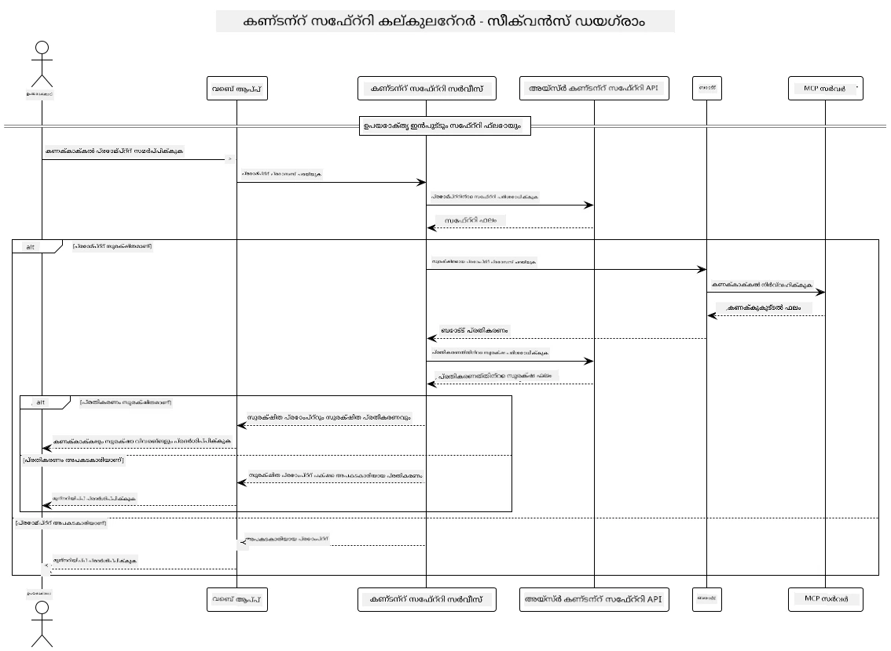

## സിസ്റ്റം ആർക്കിടെക്ചർ

ഈ പ്രോജക്ട് ഒരു വെബ് അപ്ലിക്കേഷൻ പ്രദർശിപ്പിക്കുന്നു, ഇത് യൂസർ പ്രോംപ്റ്റുകൾ കാൽക്കുലേറ്റർ സർവീസിലേക്ക് Model Context Protocol (MCP) വഴി അയയ്ക്കുന്നതിന് മുമ്പ് ഉള്ളടക്ക സുരക്ഷ പരിശോധന ഉപയോഗിക്കുന്നു.



### ഇത് എങ്ങനെ പ്രവർത്തിക്കുന്നു

1. **ഉപയോക്തൃ ഇൻപുട്ട്**: ഉപയോക്താവ് വെബ് ഇന്റർഫേസിൽ കാൽക്കുലേഷൻ പ്രോംപ്റ്റ് നൽകുന്നു  
2. **ഉള്ളടക്ക സുരക്ഷ സ്ക്രീനിംഗ് (ഇൻപുട്ട്)**: പ്രോംപ്റ്റ് Azure Content Safety API ഉപയോഗിച്ച് വിശകലനം ചെയ്യപ്പെടുന്നു  
3. **സുരക്ഷാ തീരുമാനം (ഇൻപുട്ട്)**:  
   - ഉള്ളടക്കം സുരക്ഷിതമാണെങ്കിൽ (എല്ലാ വിഭാഗങ്ങളിലും ഗുരുതരത < 2), അത് കാൽക്കുലേറ്ററിലേക്ക് മുന്നോട്ട് പോകുന്നു  
   - ഉള്ളടക്കം അപകടകാരിയായതായി ഫ്ലാഗ് ചെയ്താൽ, പ്രക്രിയ നിർത്തുകയും മുന്നറിയിപ്പ് നൽകുകയും ചെയ്യുന്നു  
4. **കാൽക്കുലേറ്റർ ഇന്റഗ്രേഷൻ**: സുരക്ഷിത ഉള്ളടക്കം LangChain4j വഴി MCP കാൽക്കുലേറ്റർ സർവറുമായി സംവദിച്ച് പ്രോസസ്സ് ചെയ്യുന്നു  
5. **ഉള്ളടക്ക സുരക്ഷ സ്ക്രീനിംഗ് (ഔട്ട്പുട്ട്)**: ബോട്ടിന്റെ പ്രതികരണം Azure Content Safety API ഉപയോഗിച്ച് വിശകലനം ചെയ്യപ്പെടുന്നു  
6. **സുരക്ഷാ തീരുമാനം (ഔട്ട്പുട്ട്)**:  
   - ബോട്ട് പ്രതികരണം സുരക്ഷിതമാണെങ്കിൽ, അത് ഉപയോക്താവിന് കാണിക്കുന്നു  
   - ബോട്ട് പ്രതികരണം അപകടകാരിയായതായി ഫ്ലാഗ് ചെയ്താൽ, അത് മുന്നറിയിപ്പോടെ മാറ്റിവെക്കുന്നു  
7. **പ്രതികരണം**: ഫലങ്ങൾ (സുരക്ഷിതമാണെങ്കിൽ) ഉപയോക്താവിന് രണ്ട് സുരക്ഷാ വിശകലനങ്ങളോടൊപ്പം പ്രദർശിപ്പിക്കുന്നു

## കാൽക്കുലേറ്റർ സർവീസുകളുമായി Model Context Protocol (MCP) ഉപയോഗിക്കൽ

ഈ പ്രോജക്ട് LangChain4j-ൽ നിന്ന് കാൽക്കുലേറ്റർ MCP സർവീസുകൾ വിളിക്കാൻ Model Context Protocol (MCP) എങ്ങനെ ഉപയോഗിക്കാമെന്ന് പ്രദർശിപ്പിക്കുന്നു. കാൽക്കുലേറ്റർ ഓപ്പറേഷനുകൾ നൽകാൻ പോർട്ട് 8080-ൽ പ്രവർത്തിക്കുന്ന ഒരു ലോക്കൽ MCP സർവർ ഉപയോഗിക്കുന്നു.

### Azure Content Safety സർവീസ് സജ്ജീകരിക്കൽ

ഉള്ളടക്ക സുരക്ഷാ ഫീച്ചറുകൾ ഉപയോഗിക്കുന്നതിന് മുമ്പ്, നിങ്ങൾക്ക് Azure Content Safety സർവീസ് റിസോഴ്‌സ് സൃഷ്ടിക്കേണ്ടതാണ്:

1. [Azure Portal](https://portal.azure.com) ലോഗിൻ ചെയ്യുക  
2. "Create a resource" ക്ലിക്ക് ചെയ്ത് "Content Safety" തിരയുക  
3. "Content Safety" തിരഞ്ഞെടുക്കുകയും "Create" ക്ലിക്ക് ചെയ്യുകയും ചെയ്യുക  
4. നിങ്ങളുടെ റിസോഴ്‌സിന് ഒരു വ്യത്യസ്തമായ പേര് നൽകുക  
5. നിങ്ങളുടെ സബ്സ്ക്രിപ്ഷനും റിസോഴ്‌സ് ഗ്രൂപ്പും തിരഞ്ഞെടുക്കുക (അല്ലെങ്കിൽ പുതിയത് സൃഷ്ടിക്കുക)  
6. പിന്തുണയുള്ള ഒരു റീജിയൻ തിരഞ്ഞെടുക്കുക ([Region availability](https://azure.microsoft.com/en-us/global-infrastructure/services/?products=cognitive-services) പരിശോധിക്കുക)  
7. അനുയോജ്യമായ പ്രൈസിംഗ് ടയർ തിരഞ്ഞെടുക്കുക  
8. റിസോഴ്‌സ് ഡിപ്ലോയ്മെന്റ് ആരംഭിക്കാൻ "Create" ക്ലിക്ക് ചെയ്യുക  
9. ഡിപ്ലോയ്മെന്റ് പൂർത്തിയായ ശേഷം "Go to resource" ക്ലിക്ക് ചെയ്യുക  
10. ഇടത് പാനലിൽ "Resource Management" കീഴിൽ "Keys and Endpoint" തിരഞ്ഞെടുക്കുക  
11. അടുത്ത ഘട്ടത്തിൽ ഉപയോഗിക്കാൻ കീകളിലോ എൻഡ്‌പോയിന്റ് URL-ലോ ഏതെങ്കിലും ഒരു കോപ്പി ചെയ്യുക

### പരിസ്ഥിതി വേരിയബിളുകൾ കോൺഫിഗർ ചെയ്യൽ

GitHub മോഡലുകളുടെ ഓതന്റിക്കേഷനായി `GITHUB_TOKEN` പരിസ്ഥിതി വേരിയബിൾ സജ്ജമാക്കുക:  
```sh
export GITHUB_TOKEN=<your_github_token>
```
  
ഉള്ളടക്ക സുരക്ഷാ ഫീച്ചറുകൾക്കായി, സജ്ജമാക്കുക:  
```sh
export CONTENT_SAFETY_ENDPOINT=<your_content_safety_endpoint>
export CONTENT_SAFETY_KEY=<your_content_safety_key>
```
  
ഈ പരിസ്ഥിതി വേരിയബിളുകൾ അപ്ലിക്കേഷൻ Azure Content Safety സർവീസുമായി ഓതന്റിക്കേറ്റ് ചെയ്യാൻ ഉപയോഗിക്കുന്നു. ഈ വേരിയബിളുകൾ സജ്ജമാക്കിയിട്ടില്ലെങ്കിൽ, അപ്ലിക്കേഷൻ ഡെമോ ആവശ്യങ്ങൾക്ക് പ്ലേസ്ഹോൾഡർ മൂല്യങ്ങൾ ഉപയോഗിക്കും, എന്നാൽ ഉള്ളടക്ക സുരക്ഷാ ഫീച്ചറുകൾ ശരിയായി പ്രവർത്തിക്കില്ല.

### കാൽക്കുലേറ്റർ MCP സർവർ ആരംഭിക്കൽ

ക്ലയന്റ് പ്രവർത്തിപ്പിക്കുന്നതിന് മുമ്പ്, localhost:8080-ൽ SSE മോഡിൽ കാൽക്കുലേറ്റർ MCP സർവർ ആരംഭിക്കേണ്ടതാണ്.

## പ്രോജക്ട് വിവരണം

ഈ പ്രോജക്ട് LangChain4j-യുമായി Model Context Protocol (MCP) സംയോജിപ്പിച്ച് കാൽക്കുലേറ്റർ സർവീസുകൾ വിളിക്കുന്നതിനെ പ്രദർശിപ്പിക്കുന്നു. പ്രധാന ഫീച്ചറുകൾ:

- അടിസ്ഥാന ഗണിത ഓപ്പറേഷനുകൾക്കായി കാൽക്കുലേറ്റർ സർവീസുമായി MCP ഉപയോഗിച്ച് കണക്ട് ചെയ്യൽ  
- ഉപയോക്തൃ പ്രോംപ്റ്റുകളിലും ബോട്ട് പ്രതികരണങ്ങളിലും ഇരട്ട-പാളി ഉള്ളടക്ക സുരക്ഷ പരിശോധന  
- LangChain4j വഴി GitHub-ന്റെ gpt-4.1-nano മോഡലുമായി സംയോജനം  
- MCP ട്രാൻസ്പോർട്ടിനായി Server-Sent Events (SSE) ഉപയോഗിക്കൽ

## ഉള്ളടക്ക സുരക്ഷ സംയോജനം

ഉപയോക്തൃ ഇൻപുട്ടുകളും സിസ്റ്റം പ്രതികരണങ്ങളും ഹാനികരമായ ഉള്ളടക്കമില്ലാതിരിക്കാനുള്ള സമഗ്ര ഉള്ളടക്ക സുരക്ഷാ ഫീച്ചറുകൾ ഈ പ്രോജക്ടിൽ ഉൾപ്പെടുത്തിയിട്ടുണ്ട്:

1. **ഇൻപുട്ട് സ്ക്രീനിംഗ്**: ഉപയോക്തൃ പ്രോംപ്റ്റുകൾ ഹേറ്റ്സ്പീച്ച്, ഹിംസ, സ്വയംഹാനി, ലൈംഗിക ഉള്ളടക്കം തുടങ്ങിയ ഹാനികരമായ ഉള്ളടക്ക വിഭാഗങ്ങൾക്കായി പ്രോസസ്സ് ചെയ്യുന്നതിന് മുമ്പ് വിശകലനം ചെയ്യപ്പെടുന്നു.  

2. **ഔട്ട്പുട്ട് സ്ക്രീനിംഗ്**: സാധ്യതയുള്ള സെൻസർ ചെയ്യാത്ത മോഡലുകൾ ഉപയോഗിക്കുമ്പോഴും, സിസ്റ്റം എല്ലാ സൃഷ്ടിച്ച പ്രതികരണങ്ങളും ഒരേ ഉള്ളടക്ക സുരക്ഷാ ഫിൽട്ടറുകൾ വഴി പരിശോധിച്ച് ഉപയോക്താവിന് പ്രദർശിപ്പിക്കുന്നു.

ഈ ഇരട്ട-പാളി സമീപനം ഏത് AI മോഡലും ഉപയോഗിച്ചാലും സിസ്റ്റം സുരക്ഷിതമായി നിലനിൽക്കാൻ ഉറപ്പാക്കുന്നു, ഉപയോക്താക്കളെ ഹാനികരമായ ഇൻപുട്ടുകളിലും പ്രശ്നകരമായ AI-ഉൽപ്പന്ന ഔട്ട്പുട്ടുകളിലും നിന്ന് സംരക്ഷിക്കുന്നു.

## വെബ് ക്ലയന്റ്

ഉള്ളടക്ക സുരക്ഷ കാൽക്കുലേറ്റർ സിസ്റ്റവുമായി സംവദിക്കാൻ ഉപയോക്താക്കൾക്ക് സൗകര്യമുള്ള ഒരു വെബ് ഇന്റർഫേസ് അപ്ലിക്കേഷനിൽ ഉൾപ്പെടുത്തിയിട്ടുണ്ട്:

### വെബ് ഇന്റർഫേസ് ഫീച്ചറുകൾ

- കാൽക്കുലേഷൻ പ്രോംപ്റ്റുകൾ നൽകുന്നതിനുള്ള ലളിതവും ബോധഗമ്യവുമായ ഫോം  
- ഇരട്ട-പാളി ഉള്ളടക്ക സുരക്ഷാ പരിശോധന (ഇൻപുട്ടും ഔട്ട്പുട്ടും)  
- പ്രോംപ്റ്റിന്റെയും പ്രതികരണത്തിന്റെയും സുരക്ഷിതത്വത്തെക്കുറിച്ചുള്ള റിയൽ-ടൈം ഫീഡ്ബാക്ക്  
- എളുപ്പത്തിൽ വ്യാഖ്യാനിക്കാൻ നിറം-കോഡുചെയ്ത സുരക്ഷാ സൂചകങ്ങൾ  
- വിവിധ ഉപകരണങ്ങളിൽ പ്രവർത്തിക്കുന്ന ശുദ്ധവും പ്രതികരണശീലമുള്ള ഡിസൈൻ  
- ഉപയോക്താക്കളെ മാർഗനിർദ്ദേശം നൽകുന്ന ഉദാഹരണ സുരക്ഷിത പ്രോംപ്റ്റുകൾ

### വെബ് ക്ലയന്റ് ഉപയോഗിക്കൽ

1. അപ്ലിക്കേഷൻ ആരംഭിക്കുക:  
   ```sh
   mvn spring-boot:run
   ```
  
2. നിങ്ങളുടെ ബ്രൗസർ തുറന്ന് `http://localhost:8087` എന്ന വിലാസത്തിലേക്ക് പോവുക  

3. നൽകിയ ടെക്സ്റ്റ് ഏരിയയിൽ കാൽക്കുലേഷൻ പ്രോംപ്റ്റ് നൽകുക (ഉദാ: "Calculate the sum of 24.5 and 17.3")  

4. നിങ്ങളുടെ അഭ്യർത്ഥന പ്രോസസ്സ് ചെയ്യാൻ "Submit" ക്ലിക്ക് ചെയ്യുക  

5. ഫലങ്ങൾ കാണുക, അവയിൽ ഉൾപ്പെടുന്നത്:  
   - നിങ്ങളുടെ പ്രോംപ്റ്റിന്റെ ഉള്ളടക്ക സുരക്ഷാ വിശകലനം  
   - കാൽക്കുലേറ്റുചെയ്ത ഫലം (പ്രോംപ്റ്റ് സുരക്ഷിതമായിരുന്നെങ്കിൽ)  
   - ബോട്ടിന്റെ പ്രതികരണത്തിന്റെ ഉള്ളടക്ക സുരക്ഷാ വിശകലനം  
   - ഇൻപുട്ട് അല്ലെങ്കിൽ ഔട്ട്പുട്ട് ഫ്ലാഗ് ചെയ്തിട്ടുണ്ടെങ്കിൽ ഏതെങ്കിലും സുരക്ഷാ മുന്നറിയിപ്പുകൾ

വെബ് ക്ലയന്റ് സ്വയം ഉള്ളടക്ക സുരക്ഷാ പരിശോധന പ്രക്രിയകൾ കൈകാര്യം ചെയ്യുന്നു, ഏത് AI മോഡലും ഉപയോഗിച്ചാലും എല്ലാ ഇടപെടലുകളും സുരക്ഷിതവും അനുയോജ്യവുമാകാൻ ഉറപ്പാക്കുന്നു.

---

<!-- CO-OP TRANSLATOR DISCLAIMER START -->
**അസൂയാ**:  
ഈ രേഖ AI വിവർത്തന സേവനം [Co-op Translator](https://github.com/Azure/co-op-translator) ഉപയോഗിച്ച് വിവർത്തനം ചെയ്തതാണ്. നാം കൃത്യതയ്ക്ക് ശ്രമിച്ചിട്ടുണ്ടെങ്കിലും, സ്വയം പ്രവർത്തിക്കുന്ന വിവർത്തനങ്ങളിൽ പിശകുകൾ അല്ലെങ്കിൽ തെറ്റുകൾ ഉണ്ടാകാമെന്ന് ദയവായി ശ്രദ്ധിക്കുക. അതിന്റെ മാതൃഭാഷയിലുള്ള യഥാർത്ഥ രേഖ അധികാരപരമായ ഉറവിടമായി കണക്കാക്കണം. നിർണായകമായ വിവരങ്ങൾക്ക്, പ്രൊഫഷണൽ മനുഷ്യ വിവർത്തനം ശുപാർശ ചെയ്യപ്പെടുന്നു. ഈ വിവർത്തനം ഉപയോഗിക്കുന്നതിൽ നിന്നുണ്ടാകുന്ന ഏതെങ്കിലും തെറ്റിദ്ധാരണകൾക്കോ തെറ്റായ വ്യാഖ്യാനങ്ങൾക്കോ ഞങ്ങൾ ഉത്തരവാദികളല്ല.
<!-- CO-OP TRANSLATOR DISCLAIMER END -->