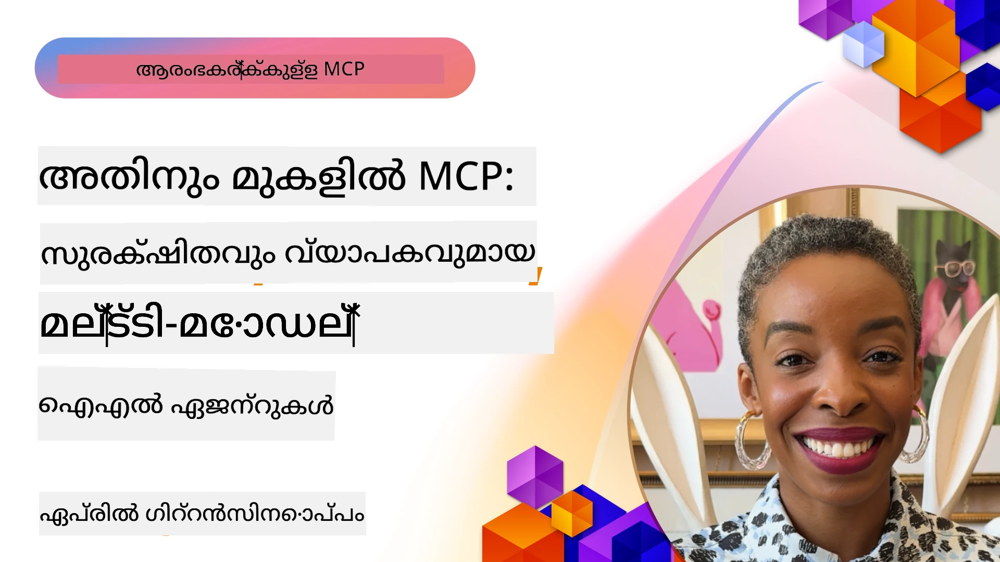

# MCP യിലെ അഡ്വാൻസ്ഡ് വിഷയങ്ങൾ

_(ഈ പാഠത്തിന്റെ വീഡിയോ കാണാൻ മുകളിൽ ഉള്ള ചിത്രം ക്ലിക്ക് ചെയ്യുക)_

ഈ അധ്യായം മോഡൽ കോൺടെക്സ്‌റ്റ് പ്രോട്ടോക്കോൾ (MCP) നടപ്പാക്കലിലുള്ള മൾട്ടി-മോഡൽ ഏകീകരണം, സ്കാലബിലിറ്റി, സെക്യൂരിറ്റി മികച്ച പ്രവൃത്തികൾ, എന്റർപ്രൈസ് ഏകീകരണം തുടങ്ങിയ അഭിജാത വിഷയങ്ങൾ ഉൾക്കൊള്ളുന്നു. ആധുനിക എഐ സംവിധാനങ്ങളുടെ ആവശ്യങ്ങൾ മറവിടാൻ ശേഷിയുള്ള ശക്തമായ, ഉത്പാദന സജ്ജമായ MCP അപ്ലിക്കേഷൻകൾ നിർമ്മിക്കുന്നതിന് ഈ വിഷയങ്ങൾ അനിവാര്യമാണ്.

## അവലോകനം

ഈ പാഠം മോഡൽ കോൺടെക്സ്‌റ്റ് പ്രോട്ടോക്കോൾ നടപ്പാക്കലിലെ അഭിജാത ആശയങ്ങളെ പരിശോധിക്കുന്നു, മൾട്ടി-മോഡൽ ഏകീകരണം, സ്കാലബിലിറ്റി, സെക്യൂരിറ്റി മികച്ച പ്രധാനം, എന്റർപ്രൈസ് ഏകീകരണം എന്നിവയിൽ കേന്ദ്രീകരിക്കുന്നു. കോംപ്ലക്സ് ആവശ്യങ്ങൾ കൈകാര്യം ചെയ്യാൻ സമർത്ഥമായ ഉത്പാദന നിലവാരമുള്ള MCP അപ്ലിക്കേഷനുകൾ നിർമ്മിക്കേണ്ടതിന് ഈ വിഷയങ്ങൾ അനിവാര്യമാണ്.

## പഠന ഉദ്ദേശ്യങ്ങൾ

ഈ പാഠം പൂർത്തിയാകുമ്പോൾ നിങ്ങൾക്ക് സാധിക്കും:

- MCP ഫ്രെയിംവർക്കുകളിൽ മൾട്ടി-മോഡൽ ശേഷികൾ വിന്യസിക്കണം
- ഉയർന്ന ആവശ്യക്കാർക്കായി സ്കാലബിള്‍ MCP ആർക്കിടെക്ചറുകൾ രൂപകൽപ്പന ചെയ്യണം
- MCP ന്റെ സുരക്ഷ പ്രേരക സിദ്ധാന്തങ്ങൾ അനുസരിച്ച് മികച്ച സെക്യൂരിറ്റി പ്രവൃത്തികൾ പ്രയോഗിക്കണം
- MCP ന്ന് എന്റർപ്രൈസ് എഐ സംവിധാനങ്ങളുമായി ഏകീകരിക്കണം
- ഉത്പാദന പരിസ്ഥിതികളിൽ പ്രകടനവും വിശ്വാസ്യതയും മെച്ചപ്പെടുത്തണം

## പാഠങ്ങളും സാമ്പിള്‍ പ്രൊജക്ടുകളും

| ലിങ്ക് | ശീർഷകം | വിവരണം |
|------|-------|-------------|
| [5.1 Integration with Azure](./mcp-integration/README.md) | Azure-ഉം MCP സംയോജിപ്പിക്കൽ | MCP സെർവർ Azure-ൽ എങ്ങനെ സംയോജിപ്പിക്കാമെന്നു പഠിക്കുക |
| [5.2 Multi modal sample](./mcp-multi-modality/README.md) | MCP മൾട്ടി മോഡൽ സാമ്പിളുകൾ | ഓഡിയോ, ചിത്രം, മൾട്ടി മോഡൽ പ്രതികരണങ്ങൾക്ക് സാമ്പിളുകൾ |
| [5.3 MCP OAuth2 sample](../../../05-AdvancedTopics/mcp-oauth2-demo) | MCP OAuth2 ഡെമോ | MCP ഉപയോഗിച്ച് OAuth2 അടങ്ങിയ ലഘു സ്പ്രിംഗ് ബൂട്ട് ആപ്പ്. Authorization, റിസോഴ്‌സ് സെർവർ ആയി പ്രവർത്തനം. സുരക്ഷിത ടോക്കൺ പ്രസിദ്ധീകരണം, സംരക്ഷിത എൻഡ്‌പോയിന്റുകൾ, Azure കൺറ്റെയ്‌നർ ആപ്പുകൾ, API മാനേജ്മെന്റ് സമന്വയം എന്നിവ പ്രദർശിപ്പിക്കുന്നു. |
| [5.4 Root Contexts](./mcp-root-contexts/README.md) | Root Contexts | റൂട്ട് കോൺടെക്സ്‌റ്റ് എന്താണെന്ന് കൂടുതൽ അറിയുക, എങ്ങനെ നടപ്പിലാക്കാം |
| [5.5 Routing](./mcp-routing/README.md) | Routing | വ്യത്യസ്ത റൂട്ടിങ്ങ് തരം പഠിക്കുക |
| [5.6 Sampling](./mcp-sampling/README.md) | Sampling | സാമ്പ്ലിംഗ് എടുക്കുന്നത് എങ്ങനെ |
| [5.7 Scaling](./mcp-scaling/README.md) | Scaling | സ്കാലിങ് എന്താണെന്ന് അറിയുക |
| [5.8 Security](./mcp-security/README.md) | Security | നിങ്ങളുടെ MCP സെർവർ സുരക്ഷിതമാക്കുക |
| [5.9 Web Search sample](./web-search-mcp/README.md) | Web Search MCP | Python MCP സെർവർ, ക്ലയന്റ് - SerpAPI യുമായി സംയോജിപ്പിച്ച് റിയൽടൈം വെബ്, വാർത്ത, ഉൽപ്പന്ന തിരച്ചിൽ, Q&A. മൾട്ടി-ടൂൾ ഓർക്കസ്ട്രേഷൻ, ബാഹ്യ API സംയോജനം, ദൃഢമായ പിഴവ് കൈകാര്യം. |
| [5.10 Realtime Streaming](./mcp-realtimestreaming/README.md) | Streaming | ഇന്നത്തെ ഡാറ്റാചാലിത ലോകത്ത് റിയൽ-ടൈം ഡാറ്റastreaming അനിവാര്യമാണ്, ബിസിനസുകളും അപ്ലിക്കേഷനുകളും താത്കാലിക തീരുമാനങ്ങൾക്ക് ഉടനെ വിവരം ലഭിക്കാൻ ആവശ്യപ്പെടുന്നു. |
| [5.11 Realtime Web Search](./mcp-realtimesearch/README.md) | Web Search | MCP വെബ് തിരച്ചിൽ എങ്ങനെ മാറ്റുന്നു, കൺടെക്സ്‌റ്റ് മാനേജ്മെന്റിനുള്ള ഒരു മാനദണ്ഡപദവി എല്ലാ എഐ മോഡലുകളിലും, തിരയൽ എഞ്ചിനുകളിലും, അപ്ലിക്കേഷനുകളിലും നൽകുന്നു. | 
| [5.12  Entra ID Authentication for Model Context Protocol Servers](./mcp-security-entra/README.md) | Entra ID Authentication | മൈക്രോസോഫ്റ്റ് Entra ID, ക്ലൗഡ് അടിസ്ഥാനമാക്കിയ ഐഡന്റിറ്റി ആക്‌സസ് മാനേജ്മെന്റ് പരിഹാരം നൽകുന്നു. അഞ്ഞൂർ MCP സെർവറുമായി പ്രാമാണികയുള്ള ഉപയോക്താക്കളും അപ്ലിക്കേഷനുകളും മാത്രമേ ഇടപെടാനാകൂ എന്ന് ഉറപ്പാക്കുന്നു. |
| [5.13 Azure AI Foundry Agent Integration](./mcp-foundry-agent-integration/README.md) | Azure AI Foundry Integration | മോഡൽ കോൺടെക്സ്‌റ്റ് പ്രോട്ടോക്കോൾ സെർവറുകളെ Azure AI Foundry ഏജന്റുകളുമായി സംയോജിപ്പിക്കുന്നതിനെക്കുറിച്ച് പഠിക്കുക, ശക്തമായ ടൂൾ ഓർക്കസ്ട്രേഷനും എന്റർപ്രൈസ് എഐ ശേഷികളും മാനദണ്ഡപ്പെട്ട ബാഹ്യ ഡേറ്റാ സ്രോതസ്സ് ബന്ധങ്ങളും ലഭ്യമാക്കുന്നു. |
| [5.14 Context Engineering](./mcp-contextengineering/README.md) | Context Engineering | MCP സെർവറുകളിൽ പ്രയോഗിക്കാവുന്ന കൺടെക്സ്‌റ്റ് എഞ്ചിനീയറിംഗ് സാങ്കേതിക വിദ്യകൾ, കൺടെക്സ്‌റ്റ് ഓപ്‌റ്റിമൈസേഷൻ, ഡൈനാമിക് മാനേജ്മെന്റ്, MCP പ്രോംപ്റ്റ് എഞ്ചിനീയറിങ്ങിനുള്ള സാങ്കേതിക വിദ്യകൾ എന്നിവയുടെ ഭാവിയിലെ അവസരങ്ങൾ. |
| [5.15 MCP Custom Transport](./mcp-transport/README.md) | Custom Transport | പ്രത്യേക MCP സംവാദ സാഹചര്യങ്ങൾക്കായി കസ്റ്റം ട്രാൻസ്പോർട്ട് മെക്കാനിസങ്ങൾ നടപ്പിലാക്കുന്നത് പഠിക്കുക. |
| [5.16 Protocol Features Deep Dive](./mcp-protocol-features/README.md) | Protocol Features | പുരോഗതി അറിയിപ്പുകൾ, അഭ്യർത്ഥന റദ്ദാക്കലുകൾ, റിസോഴ്‌സ് ടെംപ്ലേറ്റുകൾ, പിഴവ് കൈകാര്യം എന്നീ അഭിജാത പ്രോട്ടോക്കോൾ ഫീച്ചറുകൾ അടക്കമുള്ളവയിൽ പ്രാവീണ്യം നേടുക. |

> **MCP സ്പെസിഫിക്കേഷൻ 2025-11-25 ലുള്ള പുതിയത്**: സ്പെസിഫിക്കേഷൻ ഇപ്പോൾ പരീക്ഷണപരമായി പിന്തുണയാണ് നൽകുന്നത് **ടാസ്കുകൾ** (പോര്ഗത നില വികസിപ്പിക്കുന്ന ദീർഘകാലപ്രവർത്തനങ്ങൾ), **ടൂൾ അനൊട്ടേഷനുകൾ** (സുരക്ഷയ്ക്കായി ടൂളിന്റെ പെരുമാറ്റത്തെക്കുറിച്ചുള്ള മെറ്റാഡെട), **URL മോഡ് ഇലിസിറ്റേഷൻ** (ക്ലയന്റുകളിൽ പ്രത്യേക URL ഉള്ളടക്കം അഭ്യർത്ഥിക്കൽ), കൂടാതെ മെച്ചപ്പെടുത്തിയ **Roots** (വർക്ക്സ്പേസ് കോൺടെക്സ്‌റ്റ് മാനേജ്മെന്റിനായി). കൂടുതൽ വിവരങ്ങൾക്ക് [MCP സ്പെസിഫിക്കേഷൻ ചാൽഞ്ച് ലോഗ്](https://spec.modelcontextprotocol.io/) കാണുക.

## അധിക റഫറൻസുകൾ

ആധുനിക MCP വിഷയങ്ങളിൽ ഏറ്റവും പുതിയ വിവരങ്ങൾക്ക് സന്ദർശിക്കുക:
- [MCP ഡോക്യുമെന്റേഷൻ](https://modelcontextprotocol.io/)
- [MCP സ്പെസിഫിക്കേഷൻ (2025-11-25)](https://spec.modelcontextprotocol.io/specification/2025-11-25/)
- [ഗിറ്റ്ഹബ് റിപ്പൊ](https://github.com/modelcontextprotocol)
- [OWASP MCP Top 10](https://microsoft.github.io/mcp-azure-security-guide/mcp/) - സുരക്ഷാ അപകടങ്ങളും പരിഹാരങ്ങളും
- [MCP Security Summit Workshop (Sherpa)](https://azure-samples.github.io/sherpa/) - പരിശീലനവും ഹാൻഡ്‌സ്ഒൻ സെക്യൂരിറ്റി പരിശീലനവും

## പ്രധാന കാര്യങ്ങൾ

- മൾട്ടി-മോഡൽ MCP നടപ്പാക്കലുകൾ എഐ കഴിവുകൾ വാചകകുറിച്ചെഴുതൽ മാത്രമല്ലാതെ വിപുലീകരിക്കുന്നു
- സ്കാലബിലിറ്റി എന്റർപ്രൈസ് വിന്യസനങ്ങൾക്ക് അനിവാര്യമാണ്, ഹോരിസോണ്ടൽ, വെർട്ടിക്കൽ സ്കാലിങ്ങിലൂടെ കൈകാര്യം ചെയ്യാം
- സമഗ്രമായ സുരക്ഷാ മാർഗ്ഗങ്ങൾ ഡേറ്റ സംരക്ഷിക്കുകയും ശരിയായ ആക്‌സസ് നിയന്ത്രണം ഉറപ്പാക്കുകയും ചെയ്യുന്നു
- Azure OpenAI, Microsoft AI Foundry പോലുള്ള പ്ലാറ്റ്‌ഫോമുകളോടുള്ള എന്റർപ്രൈസ് ഏകീകരണം MCP ശേഷികൾ മെച്ചപ്പെടുത്തുന്നു
- ഉയർന്ന MCP നടപ്പാക്കലുകൾ മെച്ചപ്പെടുത്തി രൂപകൽപ്പനയും ജാഗ്രതയുള്ള റിസോഴ്‌സ് മാനേജ്മെന്റും കൊണ്ടു സാരമുണ്ട്

## പ്രവർത്തനം

ഒരിടത്തും MCP നടപ്പാക്കലിന്റെ എന്റർപ്രൈസ് നിലവാരത്തിലുള്ള രൂപകല്‌പന:

1. നിങ്ങളുടെ ഉപയോഗത്തിനുള്ള മൾട്ടി-മോഡൽ ആവശ്യങ്ങൾ തിരിച്ചറിയുക  
2. അന്തർഘടമായ ഡാറ്റ സംരക്ഷിക്കാൻ ആവശ്യമായ സുരക്ഷാ നിയന്ത്രണങ്ങൾ രേഖപ്പെടുത്തുക  
3. വ്യത്യസ്ത ലെവലുകളിൽ ലോഡ് കൈകാര്യം ചെയ്യാൻ ഉള്ള സ്കാലബിള്‍ ആർക്കിടെക്ചർ രൂപകല്‌പന ചെയ്യുക  
4. എന്റർപ്രൈസ് എഐ സംവിധാനങ്ങളുമായി സംയോജിപ്പിക്കുന്ന പാഥങ്ങൾ പദ്ധതിയിടുക  
5. പ്രകടന Bottleneck-കളും പരിഹാര തന്ത്രങ്ങളും രേഖപ്പെടുത്തുക  

## അധിക ഉപയോഗ പത്രങ്ങൾ

- [Azure OpenAI ഡോക്യുമെന്റേഷൻ](https://learn.microsoft.com/en-us/azure/ai-services/openai/)
- [Microsoft AI Foundry ഡോക്യുമെന്റേഷൻ](https://learn.microsoft.com/en-us/ai-services/)

---

## അടുത്തത് എന്താണ്

ഈ മോഡ്യൂളിലെ പാഠങ്ങൾ എക്‌സ്‌പ്ലോർ ചെയ്ത് തുടങ്ങുക: [5.1 MCP Integration](./mcp-integration/README.md)

ഈ മോഡ്യൂൾ പൂർത്തിയായാൽ തുടർന്നു: [Module 6: Community Contributions](../06-CommunityContributions/README.md)

---

<!-- CO-OP TRANSLATOR DISCLAIMER START -->
**അസ്വീകാരം**:
ഈ പ്രമാണം AI വിവർത്തനസേവനമായ [Co-op Translator](https://github.com/Azure/co-op-translator) ഉപയോഗിച്ച് വിവർത്തനം ചെയ്തതാണ്. ഞങ്ങൾ കൃത്യതയ്ക്ക് ശ്രമിക്കുന്നുവെങ്കിലും, യന്ത്രം നടത്തിയ വിവർത്തനങ്ങളിൽ പിശകുകൾ അല്ലെങ്കിൽ തെറ്റിദ്ധാരണകൾ ഉണ്ടാകാം എന്ന് ദയവായി മനസിലാക്കുക. സ്വന്തം മാതൃഭാഷയിലെ മൗലിക പ്രമാണമാണ് ഉദ്ദേശിച്ച നിർദ്ദേശകമായ പ്രമാണമായി കണക്കാക്കേണ്ടത്. നിർണായകമായ വിവരങ്ങൾക്ക്, പ്രൊഫഷണൽ മനുഷ്യ വിവർത്തനം നിർദേശം ചെയ്യപ്പെടുന്നു. ഈ വിവർത്തനത്തിന്റെ ഉപയോഗം മൂലം ഉണ്ടാകാവുന്ന തെറ്റിദ്ധാരണകൾക്കോ പിശകുകളിലോ ഞങ്ങൾ ഉത്തരവാദികളല്ല.
<!-- CO-OP TRANSLATOR DISCLAIMER END -->