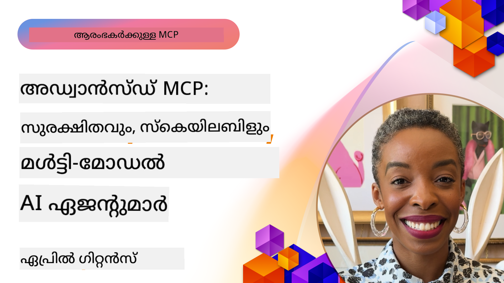

<!--
CO_OP_TRANSLATOR_METADATA:
{
  "original_hash": "d204bc94ea6027d06a703b21b711ca57",
  "translation_date": "2025-12-11T10:58:43+00:00",
  "source_file": "05-AdvancedTopics/README.md",
  "language_code": "ml"
}
-->
# MCP-യിലെ ആധുനിക വിഷയങ്ങൾ

_(ഈ പാഠത്തിന്റെ വീഡിയോ കാണാൻ മുകളിൽ ചിത്രത്തിൽ ക്ലിക്ക് ചെയ്യുക)_

ഈ അധ്യായം മോഡൽ കോൺടെക്സ്റ്റ് പ്രോട്ടോക്കോൾ (MCP) നടപ്പാക്കലിലെ ആധുനിക വിഷയങ്ങളുടെ ഒരു പരമ്പരയെ ഉൾക്കൊള്ളുന്നു, മൾട്ടി-മോഡൽ ഇന്റഗ്രേഷൻ, സ്കെയിലബിലിറ്റി, സുരക്ഷാ മികച്ച പ്രാക്ടീസുകൾ, എന്റർപ്രൈസ് ഇന്റഗ്രേഷൻ എന്നിവ ഉൾപ്പെടുന്നു. ഈ വിഷയങ്ങൾ ആധുനിക AI സിസ്റ്റങ്ങളുടെയും ആവശ്യകതകൾ നിറവേറ്റാൻ കഴിയുന്ന ശക്തമായ, പ്രൊഡക്ഷൻ-സജ്ജമായ MCP ആപ്ലിക്കേഷനുകൾ നിർമ്മിക്കാൻ നിർണായകമാണ്.

## അവലോകനം

ഈ പാഠം മോഡൽ കോൺടെക്സ്റ്റ് പ്രോട്ടോക്കോൾ നടപ്പാക്കലിലെ ആധുനിക ആശയങ്ങളെ അന്വേഷിക്കുന്നു, മൾട്ടി-മോഡൽ ഇന്റഗ്രേഷൻ, സ്കെയിലബിലിറ്റി, സുരക്ഷാ മികച്ച പ്രാക്ടീസുകൾ, എന്റർപ്രൈസ് ഇന്റഗ്രേഷൻ എന്നിവയിൽ ശ്രദ്ധ കേന്ദ്രീകരിക്കുന്നു. ഈ വിഷയങ്ങൾ എന്റർപ്രൈസ് പരിസരങ്ങളിൽ സങ്കീർണ്ണ ആവശ്യകതകൾ കൈകാര്യം ചെയ്യാൻ കഴിയുന്ന പ്രൊഡക്ഷൻ-ഗ്രേഡ് MCP ആപ്ലിക്കേഷനുകൾ നിർമ്മിക്കാൻ അനിവാര്യമാണ്.

## പഠന ലക്ഷ്യങ്ങൾ

ഈ പാഠം അവസാനിക്കുമ്പോൾ, നിങ്ങൾക്ക് കഴിയും:

- MCP ഫ്രെയിംവർക്കുകളിൽ മൾട്ടി-മോഡൽ കഴിവുകൾ നടപ്പാക്കുക
- ഉയർന്ന ആവശ്യകതാ സാഹചര്യങ്ങൾക്ക് സ്കെയിലബിള് MCP ആർക്കിടെക്ചറുകൾ രൂപകൽപ്പന ചെയ്യുക
- MCP-യുടെ സുരക്ഷാ സിദ്ധാന്തങ്ങളുമായി പൊരുത്തപ്പെടുന്ന സുരക്ഷാ മികച്ച പ്രാക്ടീസുകൾ പ്രയോഗിക്കുക
- MCP-നെ എന്റർപ്രൈസ് AI സിസ്റ്റങ്ങളുമായി ഫ്രെയിംവർക്കുകളുമായി ഇന്റഗ്രേറ്റ് ചെയ്യുക
- പ്രൊഡക്ഷൻ പരിസരങ്ങളിൽ പ്രകടനവും വിശ്വാസ്യതയും മെച്ചപ്പെടുത്തുക

## പാഠങ്ങളും സാമ്പിൾ പ്രോജക്റ്റുകളും

| ലിങ്ക് | ശീർഷകം | വിവരണം |
|------|-------|-------------|
| [5.1 Integration with Azure](./mcp-integration/README.md) | Azure-യുമായി ഇന്റഗ്രേറ്റ് ചെയ്യുക | നിങ്ങളുടെ MCP സെർവർ Azure-യിൽ എങ്ങനെ ഇന്റഗ്രേറ്റ് ചെയ്യാമെന്ന് പഠിക്കുക |
| [5.2 Multi modal sample](./mcp-multi-modality/README.md) | MCP മൾട്ടി-മോഡൽ സാമ്പിളുകൾ | ഓഡിയോ, ചിത്രം, മൾട്ടി-മോഡൽ പ്രതികരണങ്ങൾക്കുള്ള സാമ്പിളുകൾ |
| [5.3 MCP OAuth2 sample](../../../05-AdvancedTopics/mcp-oauth2-demo) | MCP OAuth2 ഡെമോ | MCP-യുമായി OAuth2 ഉപയോഗിച്ച്, അതോറൈസേഷൻ, റിസോഴ്‌സ് സെർവർ എന്നിവ കാണിക്കുന്ന മിനിമൽ സ്പ്രിംഗ് ബൂട്ട് ആപ്പ്. സുരക്ഷിത ടോക്കൺ ഇഷ്യൂവൽ, സംരക്ഷിത എൻഡ്‌പോയിന്റുകൾ, Azure കൺറ്റെയ്‌നർ ആപ്പുകൾ ഡിപ്ലോയ്മെന്റ്, API മാനേജ്മെന്റ് ഇന്റഗ്രേഷൻ എന്നിവ പ്രദർശിപ്പിക്കുന്നു. |
| [5.4 Root Contexts](./mcp-root-contexts/README.md) | റൂട്ട് കോൺടെക്സ്റ്റുകൾ | റൂട്ട് കോൺടെക്സ്റ്റ് എന്താണെന്ന് കൂടുതൽ അറിയുക, അവ എങ്ങനെ നടപ്പാക്കാമെന്ന് പഠിക്കുക |
| [5.5 Routing](./mcp-routing/README.md) | റൂട്ടിംഗ് | വ്യത്യസ്ത തരത്തിലുള്ള റൂട്ടിംഗ് പഠിക്കുക |
| [5.6 Sampling](./mcp-sampling/README.md) | സാമ്പ്ലിംഗ് | സാമ്പ്ലിംഗ് എങ്ങനെ പ്രവർത്തിക്കാമെന്ന് പഠിക്കുക |
| [5.7 Scaling](./mcp-scaling/README.md) | സ്കെയിലിംഗ് | സ്കെയിലിംഗ് സംബന്ധിച്ച പഠനം |
| [5.8 Security](./mcp-security/README.md) | സുരക്ഷ | നിങ്ങളുടെ MCP സെർവർ സുരക്ഷിതമാക്കുക |
| [5.9 Web Search sample](./web-search-mcp/README.md) | വെബ് സെർച്ച് MCP | SerpAPI-യുമായി സംയോജിപ്പിച്ച Python MCP സെർവർ, ക്ലയന്റ്, റിയൽ-ടൈം വെബ്, വാർത്ത, ഉൽപ്പന്ന സെർച്ച്, Q&A എന്നിവയ്ക്കായി. മൾട്ടി-ടൂൾ ഓർക്കസ്ട്രേഷൻ, ബാഹ്യ API ഇന്റഗ്രേഷൻ, ശക്തമായ പിശക് കൈകാര്യം എന്നിവ പ്രദർശിപ്പിക്കുന്നു. |
| [5.10 Realtime Streaming](./mcp-realtimestreaming/README.md) | സ്ട്രീമിംഗ് | ഇന്നത്തെ ഡാറ്റാ-ഡ്രിവൻ ലോകത്ത്, ബിസിനസ്സുകളും ആപ്ലിക്കേഷനുകളും സമയബന്ധിത തീരുമാനങ്ങൾ എടുക്കാൻ ഉടൻ വിവരങ്ങൾ ലഭിക്കേണ്ടതിന്റെ ആവശ്യകതയെക്കുറിച്ച് റിയൽ-ടൈം ഡാറ്റാ സ്ട്രീമിംഗ് അനിവാര്യമാണ്. |
| [5.11 Realtime Web Search](./mcp-realtimesearch/README.md) | വെബ് സെർച്ച് | MCP എങ്ങനെ AI മോഡലുകൾ, സെർച്ച് എഞ്ചിനുകൾ, ആപ്ലിക്കേഷനുകൾ എന്നിവയിൽ കോൺടെക്സ്റ്റ് മാനേജ്മെന്റിന് ഒരു സ്റ്റാൻഡേർഡൈസ്ഡ് സമീപനം നൽകിയാണ് റിയൽ-ടൈം വെബ് സെർച്ച് മാറ്റം വരുത്തുന്നത്. | 
| [5.12  Entra ID Authentication for Model Context Protocol Servers](./mcp-security-entra/README.md) | Entra ID ഓതന്റിക്കേഷൻ | Microsoft Entra ID ഒരു ശക്തമായ ക്ലൗഡ്-അധിഷ്ഠിത ഐഡന്റിറ്റി ആക്‌സസ് മാനേജ്മെന്റ് പരിഹാരമാണ്, ഇത് നിങ്ങളുടെ MCP സെർവറുമായി അനുമതിയുള്ള ഉപയോക്താക്കളും ആപ്ലിക്കേഷനുകളും മാത്രമേ ഇടപെടാൻ കഴിയൂ എന്നത് ഉറപ്പാക്കുന്നു. |
| [5.13 Azure AI Foundry Agent Integration](./mcp-foundry-agent-integration/README.md) | Azure AI Foundry ഇന്റഗ്രേഷൻ | മോഡൽ കോൺടെക്സ്റ്റ് പ്രോട്ടോക്കോൾ സെർവറുകളെ Azure AI Foundry ഏജന്റുകളുമായി ഇന്റഗ്രേറ്റ് ചെയ്യുന്നത് എങ്ങനെ എന്നത് പഠിക്കുക, ശക്തമായ ടൂൾ ഓർക്കസ്ട്രേഷൻ, സ്റ്റാൻഡേർഡൈസ്ഡ് ബാഹ്യ ഡാറ്റാ സോഴ്‌സ് കണക്ഷനുകൾ എന്നിവയോടെ എന്റർപ്രൈസ് AI കഴിവുകൾ സജ്ജമാക്കുന്നു. |
| [5.14 Context Engineering](./mcp-contextengineering/README.md) | കോൺടെക്സ്റ്റ് എഞ്ചിനീയറിംഗ് | MCP സെർവറുകൾക്കുള്ള കോൺടെക്സ്റ്റ് എഞ്ചിനീയറിംഗ് സാങ്കേതികവിദ്യകളുടെ ഭാവി അവസരങ്ങൾ, കോൺടെക്സ്റ്റ് ഓപ്റ്റിമൈസേഷൻ, ഡൈനാമിക് കോൺടെക്സ്റ്റ് മാനേജ്മെന്റ്, MCP ഫ്രെയിംവർക്കുകളിൽ ഫലപ്രദമായ പ്രോംപ്റ്റ് എഞ്ചിനീയറിംഗിനുള്ള തന്ത്രങ്ങൾ ഉൾപ്പെടെ. |

## അധിക റഫറൻസുകൾ

ആധുനിക MCP വിഷയങ്ങളിലെ ഏറ്റവും പുതിയ വിവരങ്ങൾക്ക്, കാണുക:
- [MCP ഡോക്യുമെന്റേഷൻ](https://modelcontextprotocol.io/)
- [MCP സ്പെസിഫിക്കേഷൻ](https://spec.modelcontextprotocol.io/)
- [GitHub റിപോസിറ്ററി](https://github.com/modelcontextprotocol)

## പ്രധാനപ്പെട്ട കാര്യങ്ങൾ

- മൾട്ടി-മോഡൽ MCP നടപ്പാക്കലുകൾ ടെക്സ്റ്റ് പ്രോസസ്സിംഗിന് പുറമേ AI കഴിവുകൾ വിപുലീകരിക്കുന്നു
- സ്കെയിലബിലിറ്റി എന്റർപ്രൈസ് വിന്യാസങ്ങൾക്ക് അനിവാര്യമാണ്, ഹോറിസോണ്ടൽ, വെർട്ടിക്കൽ സ്കെയിലിംഗ് വഴി പരിഹരിക്കാം
- സമഗ്രമായ സുരക്ഷാ നടപടികൾ ഡാറ്റ സംരക്ഷിക്കുകയും ശരിയായ ആക്‌സസ് നിയന്ത്രണം ഉറപ്പാക്കുകയും ചെയ്യുന്നു
- Azure OpenAI, Microsoft AI Foundry പോലുള്ള പ്ലാറ്റ്ഫോമുകളുമായി എന്റർപ്രൈസ് ഇന്റഗ്രേഷൻ MCP കഴിവുകൾ മെച്ചപ്പെടുത്തുന്നു
- ആധുനിക MCP നടപ്പാക്കലുകൾ മെച്ചപ്പെട്ട ആർക്കിടെക്ചറുകളും സൂക്ഷ്മമായ റിസോഴ്‌സ് മാനേജ്മെന്റും വഴി ലാഭം നേടുന്നു

## അഭ്യാസം

ഒരു പ്രത്യേക ഉപയോഗത്തിനായി എന്റർപ്രൈസ്-ഗ്രേഡ് MCP നടപ്പാക്കൽ രൂപകൽപ്പന ചെയ്യുക:

1. നിങ്ങളുടെ ഉപയോഗത്തിനുള്ള മൾട്ടി-മോഡൽ ആവശ്യകതകൾ തിരിച്ചറിയുക
2. സങ്കീർണ്ണ ഡാറ്റ സംരക്ഷിക്കാൻ ആവശ്യമായ സുരക്ഷാ നിയന്ത്രണങ്ങൾ രേഖപ്പെടുത്തുക
3. വ്യത്യസ്ത ലോഡുകൾ കൈകാര്യം ചെയ്യാൻ കഴിയുന്ന സ്കെയിലബിള് ആർക്കിടെക്ചർ രൂപകൽപ്പന ചെയ്യുക
4. എന്റർപ്രൈസ് AI സിസ്റ്റങ്ങളുമായി ഇന്റഗ്രേഷൻ പോയിന്റുകൾ പദ്ധതിയിടുക
5. പ്രകടന ബോട്ടിൽനെക്കുകളും പരിഹാര തന്ത്രങ്ങളും രേഖപ്പെടുത്തുക

## അധിക സ്രോതസുകൾ

- [Azure OpenAI ഡോക്യുമെന്റേഷൻ](https://learn.microsoft.com/en-us/azure/ai-services/openai/)
- [Microsoft AI Foundry ഡോക്യുമെന്റേഷൻ](https://learn.microsoft.com/en-us/ai-services/)

---

## അടുത്തത്

- [5.1 MCP Integration](./mcp-integration/README.md)

---

<!-- CO-OP TRANSLATOR DISCLAIMER START -->
**അസൂയാ**:  
ഈ രേഖ AI വിവർത്തന സേവനം [Co-op Translator](https://github.com/Azure/co-op-translator) ഉപയോഗിച്ച് വിവർത്തനം ചെയ്തതാണ്. നാം കൃത്യതയ്ക്ക് ശ്രമിച്ചിട്ടുണ്ടെങ്കിലും, സ്വയം പ്രവർത്തിക്കുന്ന വിവർത്തനങ്ങളിൽ പിശകുകൾ അല്ലെങ്കിൽ തെറ്റുകൾ ഉണ്ടാകാമെന്ന് ദയവായി ശ്രദ്ധിക്കുക. അതിന്റെ മാതൃഭാഷയിലുള്ള യഥാർത്ഥ രേഖ അധികാരപരമായ ഉറവിടമായി കണക്കാക്കപ്പെടണം. നിർണായക വിവരങ്ങൾക്ക്, പ്രൊഫഷണൽ മനുഷ്യ വിവർത്തനം ശുപാർശ ചെയ്യപ്പെടുന്നു. ഈ വിവർത്തനം ഉപയോഗിക്കുന്നതിൽ നിന്നുണ്ടാകുന്ന ഏതെങ്കിലും തെറ്റിദ്ധാരണകൾക്കോ തെറ്റായ വ്യാഖ്യാനങ്ങൾക്കോ ഞങ്ങൾ ഉത്തരവാദികളല്ല.
<!-- CO-OP TRANSLATOR DISCLAIMER END -->