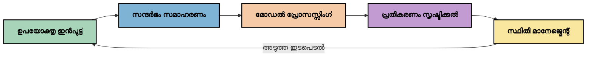
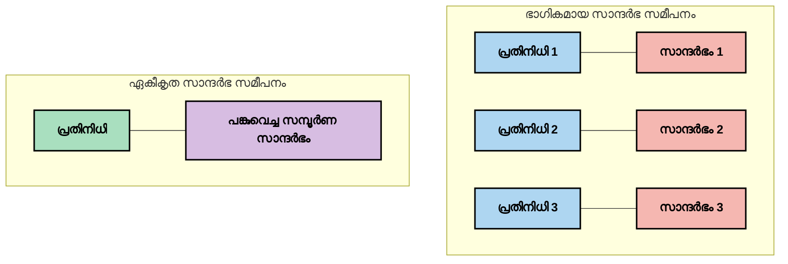
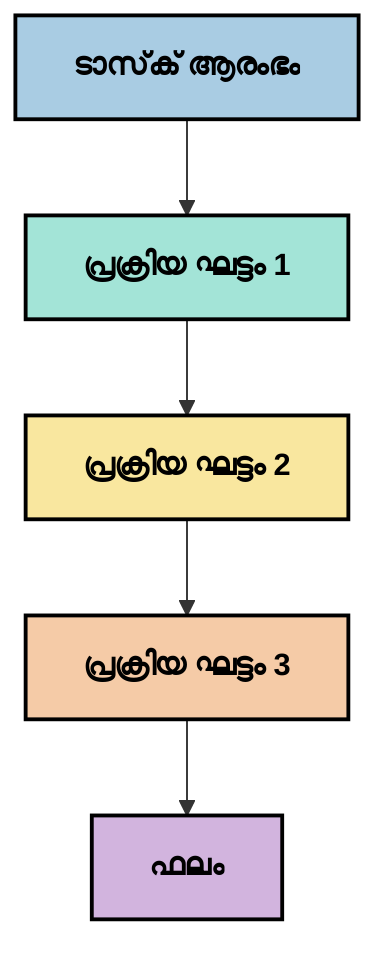
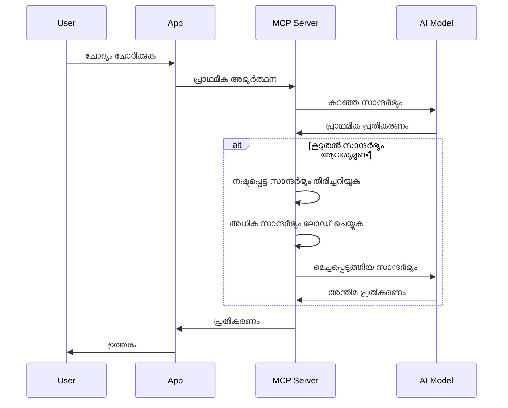
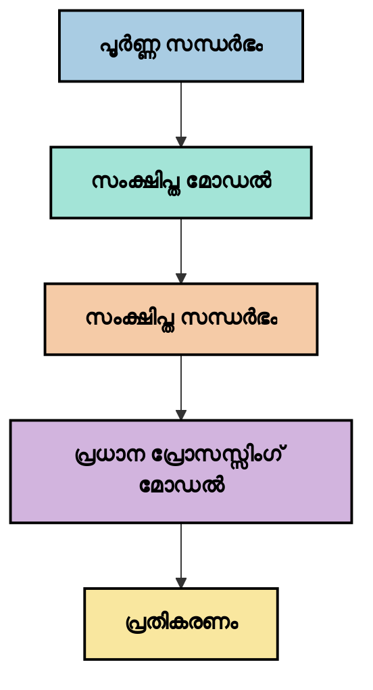

<!--
CO_OP_TRANSLATOR_METADATA:
{
  "original_hash": "fd169ca3071b81b5ee282e194bc823df",
  "translation_date": "2025-12-11T15:44:13+00:00",
  "source_file": "05-AdvancedTopics/mcp-contextengineering/README.md",
  "language_code": "ml"
}
-->
# Context Engineering: MCP ഇക്കോസിസ്റ്റത്തിൽ ഒരു ഉദയാസന്നമായ ആശയം

## അവലോകനം

Context engineering എന്നത് AI മേഖലയിലെ ഒരു ഉദയാസന്നമായ ആശയമാണ്, ഇത് ക്ലയന്റുകളും AI സേവനങ്ങളും തമ്മിലുള്ള ഇടപെടലുകളിൽ വിവരങ്ങൾ എങ്ങനെ ഘടിപ്പിക്കപ്പെടുന്നു, വിതരണം ചെയ്യപ്പെടുന്നു, പരിപാലിക്കപ്പെടുന്നു എന്നതിനെ അന്വേഷിക്കുന്നു. Model Context Protocol (MCP) ഇക്കോസിസ്റ്റം വികസിക്കുമ്പോൾ, context-നെ ഫലപ്രദമായി കൈകാര്യം ചെയ്യുന്നത് കൂടുതൽ പ്രധാനമാകുന്നു. ഈ മോഡ്യൂൾ context engineering എന്ന ആശയം പരിചയപ്പെടുത്തുകയും MCP നടപ്പാക്കലുകളിൽ അതിന്റെ സാധ്യതാപരമായ പ്രയോഗങ്ങൾ പരിശോധിക്കുകയും ചെയ്യുന്നു.

## പഠന ലക്ഷ്യങ്ങൾ

ഈ മോഡ്യൂൾ അവസാനിക്കുമ്പോൾ, നിങ്ങൾക്ക് കഴിയും:

- context engineering എന്ന ഉദയാസന്നമായ ആശയവും MCP പ്രയോഗങ്ങളിൽ അതിന്റെ സാധ്യതാപരമായ പങ്കും മനസിലാക്കുക
- MCP പ്രോട്ടോക്കോൾ ഡിസൈൻ അഭിമുഖീകരിക്കുന്ന context മാനേജ്മെന്റ് പ്രധാന വെല്ലുവിളികൾ തിരിച്ചറിയുക
- context കൈകാര്യം മെച്ചപ്പെടുത്തുന്നതിനുള്ള സാങ്കേതിക വിദ്യകൾ അന്വേഷിക്കുക
- context ഫലപ്രാപ്തി അളക്കുന്നതിനും വിലയിരുത്തുന്നതിനും സമീപനങ്ങൾ പരിഗണിക്കുക
- MCP ഫ്രെയിംവർക്കിലൂടെ AI അനുഭവങ്ങൾ മെച്ചപ്പെടുത്താൻ ഈ ഉദയാസന്ന ആശയങ്ങൾ പ്രയോഗിക്കുക

## Context Engineering-ലേക്കുള്ള പരിചയം

Context engineering എന്നത് ഉപയോക്താക്കളും ആപ്ലിക്കേഷനുകളും AI മോഡലുകളും തമ്മിലുള്ള വിവരപ്രവാഹത്തിന്റെ ഉദ്ദേശ്യപൂർവ്വമായ രൂപകൽപ്പനയും മാനേജ്മെന്റും കേന്ദ്രീകരിച്ചുള്ള ഒരു ഉദയാസന്ന ആശയമാണ്. prompt engineering പോലുള്ള സ്ഥാപിത മേഖലകളിൽ നിന്ന് വ്യത്യസ്തമായി, context engineering ഇപ്പോഴും പ്രായോഗികർ നിർവചിക്കുന്നതിൽ ആണ്, AI മോഡലുകൾക്ക് ശരിയായ സമയത്ത് ശരിയായ വിവരങ്ങൾ നൽകുന്നതിന്റെ പ്രത്യേക വെല്ലുവിളികൾ പരിഹരിക്കാൻ ശ്രമിക്കുമ്പോൾ.

വലിയ ഭാഷാ മോഡലുകൾ (LLMs) വികസിച്ചതോടെ, context-ന്റെ പ്രാധാന്യം കൂടുതൽ വ്യക്തമായി. നാം നൽകുന്ന context-ന്റെ ഗുണമേന്മ, പ്രസക്തി, ഘടന മോഡൽ ഔട്ട്പുട്ടുകളെ നേരിട്ട് ബാധിക്കുന്നു. context engineering ഈ ബന്ധം അന്വേഷിക്കുകയും ഫലപ്രദമായ context മാനേജ്മെന്റിനുള്ള സിദ്ധാന്തങ്ങൾ വികസിപ്പിക്കാൻ ശ്രമിക്കുകയും ചെയ്യുന്നു.

> "2025-ൽ, മോഡലുകൾ അത്യന്തം ബുദ്ധിമാന്മാരാണ്. എന്നാൽ ഏറ്റവും ബുദ്ധിമാനായ മനുഷ്യനും അവർ ചെയ്യേണ്ടത് എന്താണെന്ന് അറിയാതെ context ഇല്ലാതെ അവരുടെ ജോലി ഫലപ്രദമായി ചെയ്യാൻ കഴിയില്ല... 'Context engineering' എന്നത് prompt engineering-ന്റെ അടുത്ത തലമാണ്. ഇത് ഒരു ഡൈനാമിക് സിസ്റ്റത്തിൽ സ്വയം പ്രവർത്തിക്കുന്നതിനെക്കുറിച്ചാണ്." — വാൾഡൻ യാൻ, Cognition AI

Context engineering ഉൾക്കൊള്ളാം:

1. **Context തിരഞ്ഞെടുക്കൽ**: ഒരു നിർദ്ദിഷ്ട പ്രവർത്തനത്തിന് പ്രസക്തമായ വിവരങ്ങൾ നിർണ്ണയിക്കൽ
2. **Context ഘടന**: മോഡൽ മനസ്സിലാക്കലിനായി വിവരങ്ങൾ ക്രമീകരിക്കൽ
3. **Context വിതരണം**: വിവരങ്ങൾ മോഡലുകൾക്ക് എപ്പോൾ എങ്ങനെ അയയ്ക്കണമെന്ന് മെച്ചപ്പെടുത്തൽ
4. **Context പരിപാലനം**: സമയക്രമത്തിൽ context-ന്റെ നിലയും വളർച്ചയും കൈകാര്യം ചെയ്യൽ
5. **Context വിലയിരുത്തൽ**: context-ന്റെ ഫലപ്രാപ്തി അളക്കുകയും മെച്ചപ്പെടുത്തുകയും ചെയ്യൽ

ഈ ശ്രദ്ധാകേന്ദ്രങ്ങൾ MCP ഇക്കോസിസ്റ്റത്തിനായി പ്രത്യേകിച്ച് പ്രസക്തമാണ്, കാരണം MCP ആപ്ലിക്കേഷനുകൾക്ക് LLM-കൾക്ക് context നൽകാനുള്ള ഒരു സ്റ്റാൻഡേർഡൈസ്ഡ് മാർഗം നൽകുന്നു.

## Context യാത്രയുടെ ദൃഷ്ടികോണം

Context engineering-നെ ദൃശ്യവൽക്കരിക്കാൻ ഒരു മാർഗം MCP സിസ്റ്റത്തിലൂടെ വിവരങ്ങൾ എങ്ങനെ യാത്ര ചെയ്യുന്നു എന്ന് പിന്തുടരുകയാണ്:


### Context യാത്രയിലെ പ്രധാന ഘട്ടങ്ങൾ:

1. **ഉപയോക്തൃ ഇൻപുട്ട്**: ഉപയോക്താവിൽ നിന്നുള്ള അസംസ്കൃത വിവരങ്ങൾ (ടെക്സ്റ്റ്, ചിത്രങ്ങൾ, ഡോക്യുമെന്റുകൾ)
2. **Context അസംബ്ലി**: ഉപയോക്തൃ ഇൻപുട്ട് സിസ്റ്റം context, സംഭാഷണ ചരിത്രം, മറ്റ് ലഭ്യമായ വിവരങ്ങളുമായി സംയോജിപ്പിക്കൽ
3. **മോഡൽ പ്രോസസ്സിംഗ്**: AI മോഡൽ അസംബ്ല് ചെയ്ത context പ്രോസസ്സ് ചെയ്യുന്നു
4. **പ്രതികരണം സൃഷ്ടിക്കൽ**: നൽകിയ context അടിസ്ഥാനമാക്കി മോഡൽ ഔട്ട്പുട്ടുകൾ സൃഷ്ടിക്കുന്നു
5. **സ്റ്റേറ്റ് മാനേജ്മെന്റ്**: ഇടപെടലിന്റെ അടിസ്ഥാനത്തിൽ സിസ്റ്റം അതിന്റെ ആന്തരിക നില അപ്ഡേറ്റ് ചെയ്യുന്നു

ഈ ദൃഷ്ടികോണം AI സിസ്റ്റങ്ങളിൽ context-ന്റെ ഡൈനാമിക് സ്വഭാവം വ്യക്തമാക്കുകയും ഓരോ ഘട്ടത്തിലും വിവരങ്ങൾ എങ്ങനെ ഫലപ്രദമായി കൈകാര്യം ചെയ്യാമെന്ന് ചോദ്യങ്ങൾ ഉയർത്തുകയും ചെയ്യുന്നു.

## Context Engineering-ലെ ഉദയാസന്ന സിദ്ധാന്തങ്ങൾ

Context engineering-ന്റെ മേഖല രൂപപ്പെടുമ്പോൾ, പ്രായോഗികർ ചില പ്രാഥമിക സിദ്ധാന്തങ്ങൾ രൂപപ്പെടുത്തുന്നു. MCP നടപ്പാക്കലുകൾക്കായി ഈ സിദ്ധാന്തങ്ങൾ സഹായകമായേക്കാം:

### സിദ്ധാന്തം 1: Context പൂർണ്ണമായി പങ്കുവെക്കുക

Context ഒരു സിസ്റ്റത്തിലെ എല്ലാ ഘടകങ്ങൾക്കുമിടയിൽ പൂർണ്ണമായി പങ്കുവെക്കണം, പല ഏജന്റുകളിലോ പ്രോസസ്സുകളിലോ വിഭജിക്കരുത്. context വിഭജിക്കപ്പെട്ടാൽ, സിസ്റ്റത്തിന്റെ ഒരു ഭാഗത്ത് എടുത്ത തീരുമാനങ്ങൾ മറ്റിടങ്ങളിൽ എടുത്തവയുമായി പൊരുത്തക്കേടുകൾ ഉണ്ടാക്കാം.


MCP പ്രയോഗങ്ങളിൽ, context മുഴുവൻ പൈപ്പ്‌ലൈൻ മുഴുവൻ സുതാര്യമായി ഒഴുകുന്ന രീതിയിൽ സിസ്റ്റങ്ങൾ രൂപകൽപ്പന ചെയ്യണമെന്ന് ഇത് സൂചിപ്പിക്കുന്നു.

### സിദ്ധാന്തം 2: പ്രവർത്തനങ്ങൾ അന്യോന്യ തീരുമാനങ്ങൾ ഉൾക്കൊള്ളുന്നു എന്ന് തിരിച്ചറിയുക

ഒരു മോഡൽ എടുക്കുന്ന ഓരോ പ്രവർത്തനവും context വ്യാഖ്യാനിക്കുന്നതിൽ അന്യോന്യ തീരുമാനങ്ങൾ ഉൾക്കൊള്ളുന്നു. പല ഘടകങ്ങളും വ്യത്യസ്ത context-കളിൽ പ്രവർത്തിക്കുമ്പോൾ, ഈ അന്യോന്യ തീരുമാനങ്ങൾ പൊരുത്തക്കേടുകൾ ഉണ്ടാക്കാം, ഫലങ്ങൾ അസംഘടിതമാകാം.

MCP പ്രയോഗങ്ങൾക്ക് ഈ സിദ്ധാന്തത്തിന് പ്രധാനപ്പെട്ട പ്രഭാവങ്ങൾ ഉണ്ട്:
- വിഭജിച്ച context-യുള്ള സമാന്തര പ്രവർത്തനത്തിന് പകരം സങ്കീർണ്ണ പ്രവർത്തനങ്ങൾ ലീനിയർ പ്രോസസ്സിംഗ് ചെയ്യുക
- എല്ലാ തീരുമാന ബിന്ദുക്കൾക്കും ഒരേ context ലഭ്യമാക്കുക
- പിന്നീട് വരുന്ന ഘട്ടങ്ങൾ മുൻപ് എടുത്ത തീരുമാനങ്ങളുടെ പൂർണ്ണ context കാണാൻ കഴിയുന്ന രീതിയിൽ സിസ്റ്റങ്ങൾ രൂപകൽപ്പന ചെയ്യുക

### സിദ്ധാന്തം 3: Context ആഴവും വിൻഡോ പരിധികളും തമ്മിൽ തുല്യനില പാലിക്കുക

സംഭാഷണങ്ങളും പ്രക്രിയകളും നീണ്ടുപോകുമ്പോൾ context വിൻഡോകൾ eventually overflow ആകും. ഫലപ്രദമായ context engineering സമഗ്ര context-നും സാങ്കേതിക പരിധികൾക്കും ഇടയിലുള്ള ഈ സംഘർഷം കൈകാര്യം ചെയ്യാനുള്ള സമീപനങ്ങൾ അന്വേഷിക്കുന്നു.

അന്വേഷിക്കപ്പെടുന്ന സാധ്യതാപരമായ സമീപനങ്ങൾ:
- ടോക്കൺ ഉപയോഗം കുറയ്ക്കുമ്പോഴും അനിവാര്യ വിവരങ്ങൾ നിലനിർത്തുന്ന context കംപ്രഷൻ
- നിലവിലെ ആവശ്യങ്ങൾക്ക് അനുയോജ്യമായി context പ്രോഗ്രസീവ് ലോഡിംഗ്
- മുൻപ് നടന്ന ഇടപെടലുകളുടെ സംഗ്രഹം, പ്രധാന തീരുമാനങ്ങളും വസ്തുതകളും സംരക്ഷിച്ച്

## Context വെല്ലുവിളികളും MCP പ്രോട്ടോക്കോൾ ഡിസൈനും

Model Context Protocol (MCP) context മാനേജ്മെന്റിന്റെ പ്രത്യേക വെല്ലുവിളികൾ മനസ്സിലാക്കി രൂപകൽപ്പന ചെയ്തതാണ്. ഈ വെല്ലുവിളികൾ മനസ്സിലാക്കുന്നത് MCP പ്രോട്ടോക്കോൾ ഡിസൈനിന്റെ പ്രധാന ഭാഗങ്ങൾ വിശദീകരിക്കാൻ സഹായിക്കുന്നു:

### വെല്ലുവിളി 1: Context വിൻഡോ പരിധികൾ  
ഏതാണ്ട് എല്ലാ AI മോഡലുകൾക്കും നിശ്ചിത context വിൻഡോ വലുപ്പമുണ്ട്, ഒരേസമയം എത്ര വിവരങ്ങൾ പ്രോസസ്സ് ചെയ്യാമെന്ന് അതു നിയന്ത്രിക്കുന്നു.

**MCP ഡിസൈൻ പ്രതികരണം:**  
- സ്രോതസ്സ് അടിസ്ഥാനമാക്കിയുള്ള ഘടനാപരമായ context-നെ ഫലപ്രദമായി റഫറൻസ് ചെയ്യാൻ പ്രോട്ടോക്കോൾ പിന്തുണയ്ക്കുന്നു  
- സ്രോതസ്സ് പേജിനേറ്റുചെയ്യാനും പ്രോഗ്രസീവ് ലോഡിംഗിനും സാധിക്കും

### വെല്ലുവിളി 2: പ്രസക്തി നിർണ്ണയം  
Context-ൽ ഉൾപ്പെടുത്തേണ്ട ഏറ്റവും പ്രസക്തമായ വിവരങ്ങൾ കണ്ടെത്തുന്നത് ബുദ്ധിമുട്ടാണ്.

**MCP ഡിസൈൻ പ്രതികരണം:**  
- ആവശ്യാനുസരണം ഡൈനാമിക് വിവരങ്ങൾ തിരികെ കൊണ്ടുവരാൻ ഫ്ലെക്സിബിൾ ടൂളുകൾ  
- സ്ഥിരതയുള്ള context ക്രമീകരണത്തിന് ഘടനാപരമായ പ്രോംപ്റ്റുകൾ

### വെല്ലുവിളി 3: Context സ്ഥിരത  
ഇടപെടലുകൾക്കിടയിൽ നില കൈകാര്യം ചെയ്യുന്നത് സൂക്ഷ്മമായ ട്രാക്കിംഗ് ആവശ്യമാണ്.

**MCP ഡിസൈൻ പ്രതികരണം:**  
- സ്റ്റാൻഡേർഡൈസ്ഡ് സെഷൻ മാനേജ്മെന്റ്  
- context വളർച്ചയ്ക്കുള്ള വ്യക്തമായ ഇടപെടൽ മാതൃകകൾ

### വെല്ലുവിളി 4: മൾട്ടി-മോഡൽ Context  
വിവിധ തരത്തിലുള്ള ഡാറ്റ (ടെക്സ്റ്റ്, ചിത്രങ്ങൾ, ഘടനാപരമായ ഡാറ്റ) വ്യത്യസ്ത കൈകാര്യം ആവശ്യമാണ്.

**MCP ഡിസൈൻ പ്രതികരണം:**  
- വിവിധ ഉള്ളടക്ക തരം കൈകാര്യം ചെയ്യാൻ പ്രോട്ടോക്കോൾ രൂപകൽപ്പന  
- മൾട്ടി-മോഡൽ വിവരങ്ങളുടെ സ്റ്റാൻഡേർഡൈസ്ഡ് പ്രതിനിധാനം

### വെല്ലുവിളി 5: സുരക്ഷയും സ്വകാര്യതയും  
Context-ൽ പലപ്പോഴും സംവേദനശീലമായ വിവരങ്ങൾ അടങ്ങിയിരിക്കുന്നു, അവ സംരക്ഷിക്കേണ്ടതാണ്.

**MCP ഡിസൈൻ പ്രതികരണം:**  
- ക്ലയന്റ്-സർവർ ഉത്തരവാദിത്വങ്ങൾക്കിടയിൽ വ്യക്തമായ അതിരുകൾ  
- ഡാറ്റാ എക്സ്പോഷർ കുറയ്ക്കാൻ ലോക്കൽ പ്രോസസ്സിംഗ് ഓപ്ഷനുകൾ

ഈ വെല്ലുവിളികൾ മനസ്സിലാക്കുകയും MCP അവയെ എങ്ങനെ കൈകാര്യം ചെയ്യുന്നു എന്നത് കൂടുതൽ പുരോഗമന context engineering സാങ്കേതിക വിദ്യകൾ അന്വേഷിക്കാൻ അടിസ്ഥാനം നൽകുന്നു.

## Context Engineering-ലെ ഉദയാസന്ന സമീപനങ്ങൾ

Context engineering വികസിക്കുമ്പോൾ, ചില പ്രതീക്ഷാജനക സമീപനങ്ങൾ രൂപപ്പെടുന്നു. ഇവ നിലവിലുള്ള ചിന്തകളാണ്, സ്ഥാപിതമായ മികച്ച പ്രാക്ടീസുകൾ അല്ല, MCP നടപ്പാക്കലുകളുമായി അനുഭവം കൂടുമ്പോൾ ഇവ വികസിക്കുമെന്നാണ് പ്രതീക്ഷ.

### 1. സിംഗിൾ-ത്രെഡഡ് ലീനിയർ പ്രോസസ്സിംഗ്

Context വിഭജിക്കുന്ന മൾട്ടി-ഏജന്റ് ആർക്കിടെക്ചറുകളുമായി താരതമ്യപ്പെടുത്തുമ്പോൾ, ചില പ്രായോഗികർ സിംഗിൾ-ത്രെഡഡ് ലീനിയർ പ്രോസസ്സിംഗ് കൂടുതൽ സ്ഥിരതയുള്ള ഫലങ്ങൾ നൽകുന്നു എന്ന് കണ്ടെത്തുന്നു. ഇത് ഏകീകൃത context നിലനിർത്താനുള്ള സിദ്ധാന്തത്തോടും പൊരുത്തപ്പെടുന്നു.


ഈ സമീപനം സമാന്തര പ്രോസസ്സിംഗിനേക്കാൾ കുറവ് കാര്യക്ഷമമെന്നു തോന്നിയേക്കാം, എന്നാൽ ഓരോ ഘട്ടവും മുൻപ് എടുത്ത തീരുമാനങ്ങളുടെ പൂർണ്ണ മനസ്സിലാക്കലിൽ അടിസ്ഥാനമാക്കിയുള്ളതിനാൽ കൂടുതൽ സുസ്ഥിരവും വിശ്വസനീയവുമായ ഫലങ്ങൾ നൽകുന്നു.

### 2. Context ചങ്കിംഗ് & പ്രാധാന്യനിർണ്ണയം

വലിയ context-കൾ കൈകാര്യം ചെയ്യാവുന്ന ഭാഗങ്ങളായി വിഭജിച്ച് ഏറ്റവും പ്രധാനപ്പെട്ടവ മുൻഗണന നൽകൽ.

```python
# ആശയപരമായ ഉദാഹരണം: കോൺടെക്സ്റ്റ് ചങ്കിംഗ്‌യും മുൻഗണനയും
def process_with_chunked_context(documents, query):
    # 1. ഡോക്യുമെന്റുകൾ ചെറുതായി ചങ്കുകളായി വിഭജിക്കുക
    chunks = chunk_documents(documents)
    
    # 2. ഓരോ ചങ്കിനും പ്രസക്തി സ്കോറുകൾ കണക്കാക്കുക
    scored_chunks = [(chunk, calculate_relevance(chunk, query)) for chunk in chunks]
    
    # 3. പ്രസക്തി സ്കോറിന്റെ അടിസ്ഥാനത്തിൽ ചങ്കുകൾ ക്രമീകരിക്കുക
    sorted_chunks = sorted(scored_chunks, key=lambda x: x[1], reverse=True)
    
    # 4. ഏറ്റവും പ്രസക്തമായ ചങ്കുകൾ കോൺടെക്സ്റ്റായി ഉപയോഗിക്കുക
    context = create_context_from_chunks([chunk for chunk, score in sorted_chunks[:5]])
    
    # 5. മുൻഗണന നൽകിയ കോൺടെക്സ്റ്റ് ഉപയോഗിച്ച് പ്രോസസ്സ് ചെയ്യുക
    return generate_response(context, query)
```
  
മുകളിൽ കാണിച്ചിരിക്കുന്ന ആശയം വലിയ ഡോക്യുമെന്റുകൾ കൈകാര്യം ചെയ്യുമ്പോൾ context വിൻഡോ പരിധികൾക്കുള്ളിൽ പ്രവർത്തിക്കാനും വലിയ അറിവ് അടിസ്ഥാനങ്ങൾ ഉപയോഗിക്കാനും സഹായിക്കുന്നു.

### 3. പ്രോഗ്രസീവ് Context ലോഡിംഗ്

ആവശ്യത്തിന് മാത്രം context പ്രോഗ്രസീവായി ലോഡ് ചെയ്യൽ, എല്ലാം ഒരുമിച്ച് ലോഡ് ചെയ്യാതെ.


പ്രോഗ്രസീവ് context ലോഡിംഗ് കുറഞ്ഞ context-നോടെ ആരംഭിച്ച് ആവശ്യമായപ്പോൾ മാത്രമേ context വിപുലീകരിക്കൂ. ഇത് ലളിതമായ ചോദ്യങ്ങൾക്ക് ടോക്കൺ ഉപയോഗം കുറയ്ക്കുകയും സങ്കീർണ്ണ ചോദ്യങ്ങൾ കൈകാര്യം ചെയ്യാനുള്ള കഴിവ് നിലനിർത്തുകയും ചെയ്യുന്നു.

### 4. Context കംപ്രഷൻ & സംഗ്രഹം

അനിവാര്യ വിവരങ്ങൾ സംരക്ഷിച്ച് context വലുപ്പം കുറയ്ക്കൽ.


Context കംപ്രഷൻ ശ്രദ്ധ കേന്ദ്രീകരിക്കുന്നു:  
- ആവർത്തിക്കുന്ന വിവരങ്ങൾ നീക്കം ചെയ്യൽ  
- ദൈർഘ്യമേറിയ ഉള്ളടക്കം സംഗ്രഹിക്കൽ  
- പ്രധാന വസ്തുതകളും വിശദാംശങ്ങളും എടുക്കൽ  
- നിർണായക context ഘടകങ്ങൾ സംരക്ഷിക്കൽ  
- ടോക്കൺ കാര്യക്ഷമതയ്ക്ക് ഒപ്റ്റിമൈസ് ചെയ്യൽ

ഈ സമീപനം context വിൻഡോകളിൽ നീണ്ട സംഭാഷണങ്ങൾ നിലനിർത്താനും വലിയ ഡോക്യുമെന്റുകൾ ഫലപ്രദമായി പ്രോസസ്സ് ചെയ്യാനും പ്രത്യേകിച്ച് മൂല്യവത്താണ്. ചില പ്രായോഗികർ context കംപ്രഷനും സംഭാഷണ ചരിത്ര സംഗ്രഹത്തിനും പ്രത്യേക മോഡലുകൾ ഉപയോഗിക്കുന്നു.

## Context Engineering-ലെ പരീക്ഷണപരമായ പരിഗണനകൾ

Context engineering-ന്റെ ഉദയാസന്ന മേഖല അന്വേഷിക്കുമ്പോൾ MCP നടപ്പാക്കലുകളിൽ ചില പരിഗണനകൾ ശ്രദ്ധിക്കേണ്ടതാണ്. ഇവ നിർദ്ദേശങ്ങളല്ല, നിങ്ങളുടെ പ്രത്യേക ഉപയോഗത്തിൽ മെച്ചപ്പെടുത്തലുകൾ നൽകാവുന്ന പരീക്ഷണ മേഖലകളാണ്.

### നിങ്ങളുടെ Context ലക്ഷ്യങ്ങൾ പരിഗണിക്കുക

സങ്കീർണ്ണ context മാനേജ്മെന്റ് പരിഹാരങ്ങൾ നടപ്പിലാക്കുന്നതിന് മുമ്പ്, നിങ്ങൾ നേടാൻ ശ്രമിക്കുന്നതെന്തെന്ന് വ്യക്തമായി വ്യക്തമാക്കുക:  
- മോഡലിന് വിജയിക്കാൻ ആവശ്യമായ പ്രത്യേക വിവരങ്ങൾ എന്തെല്ലാം?  
- ഏത് വിവരങ്ങൾ അനിവാര്യമാണ്, ഏത് അനുബന്ധം?  
- നിങ്ങളുടെ പ്രകടന പരിധികൾ (ലേറ്റൻസി, ടോക്കൺ പരിധികൾ, ചെലവുകൾ) എന്തെല്ലാം?

### ലെയർ ചെയ്ത Context സമീപനങ്ങൾ അന്വേഷിക്കുക

ചില പ്രായോഗികർ ആശയപരമായ ലെയറുകളിൽ context ക്രമീകരിച്ച് വിജയിക്കുന്നു:  
- **കോർ ലെയർ**: മോഡലിന് എപ്പോഴും ആവശ്യമായ അനിവാര്യ വിവരങ്ങൾ  
- **സിറ്റുവേഷണൽ ലെയർ**: നിലവിലെ ഇടപെടലിനുള്ള context  
- **സപ്പോർട്ടിംഗ് ലെയർ**: സഹായകമായ അധിക വിവരങ്ങൾ  
- **ഫാൾബാക്ക് ലെയർ**: ആവശ്യമായപ്പോൾ മാത്രം ആക്‌സസ് ചെയ്യുന്ന വിവരങ്ങൾ

### റിട്രീവൽ തന്ത്രങ്ങൾ പരിശോധിക്കുക

Context ഫലപ്രാപ്തി നിങ്ങൾ വിവരങ്ങൾ എങ്ങനെ തിരികെ കൊണ്ടുവരുന്നു എന്നതിൽ ആശ്രയിച്ചിരിക്കുന്നു:  
- ആശയപരമായി പ്രസക്തമായ വിവരങ്ങൾ കണ്ടെത്താൻ സെമാന്റിക് സെർച്ച്, എംബെഡ്ഡിംഗ്സ്  
- പ്രത്യേക വസ്തുതകൾക്കായി കീവേഡ് അടിസ്ഥാനമാക്കിയുള്ള തിരയൽ  
- പല റിട്രീവൽ രീതികളും സംയോജിപ്പിക്കുന്ന ഹൈബ്രിഡ് സമീപനങ്ങൾ  
- വിഭാഗങ്ങൾ, തീയതികൾ, ഉറവിടങ്ങൾ അടിസ്ഥാനമാക്കി മെറ്റാഡേറ്റ ഫിൽറ്ററിംഗ്

### Context സുസ്ഥിരത പരീക്ഷിക്കുക

Context-ന്റെ ഘടനയും പ്രവാഹവും മോഡൽ മനസ്സിലാക്കലിനെ ബാധിക്കാം:  
- ബന്ധപ്പെട്ട വിവരങ്ങൾ കൂട്ടിച്ചേർക്കൽ  
- സ്ഥിരതയുള്ള ഫോർമാറ്റിംഗ്, ക്രമീകരണം  
- യുക്തിപരമായ അല്ലെങ്കിൽ കാലക്രമാനുസൃത ക്രമീകരണം  
- വിരുദ്ധമായ വിവരങ്ങൾ ഒഴിവാക്കൽ

### മൾട്ടി-ഏജന്റ് ആർക്കിടെക്ചറുകളുടെ ഗുണദോഷങ്ങൾ വിലയിരുത്തുക

മൾട്ടി-ഏജന്റ് ആർക്കിടെക്ചറുകൾ പല AI ഫ്രെയിംവർക്കുകളിലും ജനപ്രിയമാണ്, എന്നാൽ context മാനേജ്മെന്റിൽ വലിയ വെല്ലുവിളികൾ ഉണ്ട്:  
- context വിഭജനം ഏജന്റുകൾക്കിടയിൽ അസംഘടിത തീരുമാനങ്ങൾ ഉണ്ടാക്കാം  
- സമാന്തര പ്രോസസ്സിംഗ് പൊരുത്തക്കേടുകൾ സൃഷ്ടിക്കാം  
- ഏജന്റുകൾക്കിടയിലെ ആശയവിനിമയം പ്രകടന നേട്ടങ്ങൾ കുറയ്ക്കാം  
- സുസ്ഥിരത നിലനിർത്താൻ സങ്കീർണ്ണ സ്റ്റേറ്റ് മാനേജ്മെന്റ് ആവശ്യമാണ്

പല സാഹചര്യങ്ങളിലും, സമഗ്ര context മാനേജ്മെന്റുള്ള സിംഗിൾ-ഏജന്റ് സമീപനം വിഭജിച്ച context ഉള്ള മൾട്ടി-ഏജന്റ് ആർക്കിടെക്ചറുകളേക്കാൾ വിശ്വസനീയമായ ഫലങ്ങൾ നൽകാം.

### വിലയിരുത്തൽ രീതികൾ വികസിപ്പിക്കുക

Context engineering മെച്ചപ്പെടുത്താൻ, വിജയമെന്നത് എങ്ങനെ അളക്കുമെന്ന് പരിഗണിക്കുക:  
- വ്യത്യസ്ത context ഘടനകൾ A/B ടെസ്റ്റിംഗ്  
- ടോക്കൺ ഉപയോഗവും പ്രതികരണ സമയവും നിരീക്ഷിക്കൽ  
- ഉപയോക്തൃ സംതൃപ്തിയും ടാസ്‌ക് പൂർത്തീകരണ നിരക്കും ട്രാക്ക് ചെയ്യൽ  
- context തന്ത്രങ്ങൾ എപ്പോൾ, എന്തുകൊണ്ട് പരാജയപ്പെടുന്നു എന്ന് വിശകലനം

ഈ പരിഗണനകൾ context engineering മേഖലയിലെ സജീവ അന്വേഷണ മേഖലകളാണ്. മേഖല വളരുമ്പോൾ കൂടുതൽ വ്യക്തമായ മാതൃകകളും പ്രാക്ടീസുകളും രൂപപ്പെടും.

## Context ഫലപ്രാപ്തി അളക്കൽ: ഒരു വികസിത ഫ്രെയിംവർക്കും

Context engineering ഒരു ആശയമായി ഉദിക്കുന്നതിനൊപ്പം, പ്രായോഗികർ അതിന്റെ ഫലപ്രാപ്തി എങ്ങനെ അളക്കാമെന്ന് അന്വേഷിക്കുകയാണ്. നിലവിൽ സ്ഥാപിതമായ ഫ്രെയിംവർക്ക് ഇല്ല, എന്നാൽ ഭ
- [Model Context Protocol വെബ്സൈറ്റ്](https://modelcontextprotocol.io/)
- [Model Context Protocol സ്പെസിഫിക്കേഷൻ](https://github.com/modelcontextprotocol/modelcontextprotocol)
- [MCP ഡോക്യുമെന്റേഷൻ](https://modelcontextprotocol.io/docs)
- [MCP C# SDK](https://github.com/modelcontextprotocol/csharp-sdk)
- [MCP Python SDK](https://github.com/modelcontextprotocol/python-sdk)
- [MCP TypeScript SDK](https://github.com/modelcontextprotocol/typescript-sdk)
- [MCP ഇൻസ്പെക്ടർ](https://github.com/modelcontextprotocol/inspector) - MCP സർവറുകൾക്കുള്ള ദൃശ്യപരിശോധന ഉപകരണം

### Context Engineering ലേഖനങ്ങൾ
- [മൾട്ടി-ഏജന്റുകൾ നിർമ്മിക്കരുത്: Context Engineering ന്റെ സിദ്ധാന്തങ്ങൾ](https://cognition.ai/blog/dont-build-multi-agents) - Walden Yan ന്റെ context engineering സിദ്ധാന്തങ്ങളെക്കുറിച്ചുള്ള洞察ങ്ങൾ
- [ഏജന്റുകൾ നിർമ്മിക്കുന്നതിനുള്ള പ്രായോഗിക മാർഗ്ഗനിർദ്ദേശം](https://cdn.openai.com/business-guides-and-resources/a-practical-guide-to-building-agents.pdf) - ഫലപ്രദമായ ഏജന്റ് ഡിസൈനിനുള്ള OpenAI ന്റെ മാർഗ്ഗനിർദ്ദേശം
- [ഫലപ്രദമായ ഏജന്റുകൾ നിർമ്മിക്കൽ](https://www.anthropic.com/engineering/building-effective-agents) - ഏജന്റ് വികസനത്തിന് Anthropic ന്റെ സമീപനം

### ബന്ധപ്പെട്ട ഗവേഷണം
- [വലിയ ഭാഷാ മോഡലുകൾക്കുള്ള ഡൈനാമിക് റിട്രീവൽ ഓഗ്മെന്റേഷൻ](https://arxiv.org/abs/2310.01487) - ഡൈനാമിക് റിട്രീവൽ സമീപനങ്ങളെക്കുറിച്ചുള്ള ഗവേഷണം
- [Lost in the Middle: ഭാഷാ മോഡലുകൾ ദീർഘകാല context എങ്ങനെ ഉപയോഗിക്കുന്നു](https://arxiv.org/abs/2307.03172) - context പ്രോസസ്സിംഗ് മാതൃകകളെക്കുറിച്ചുള്ള പ്രധാന ഗവേഷണം
- [CLIP Latents ഉപയോഗിച്ച് ഹയർആർക്കിക്കൽ ടെക്സ്റ്റ്-കണ്ടീഷനഡ് ഇമേജ് ജനറേഷൻ](https://arxiv.org/abs/2204.06125) - DALL-E 2 പേപ്പർ context ഘടനയെക്കുറിച്ചുള്ള洞察ങ്ങൾ
- [വലിയ ഭാഷാ മോഡൽ ആർക്കിടെക്ചറുകളിൽ context ന്റെ പങ്ക് അന്വേഷിക്കൽ](https://aclanthology.org/2023.findings-emnlp.124/) - context കൈകാര്യം ചെയ്യലിൽ പുതിയ ഗവേഷണം
- [മൾട്ടി-ഏജന്റ് സഹകരണ: ഒരു സർവേ](https://arxiv.org/abs/2304.03442) - മൾട്ടി-ഏജന്റ് സിസ്റ്റങ്ങൾക്കും അവയുടെ വെല്ലുവിളികൾക്കും 관한 ഗവേഷണം

### അധിക വിഭവങ്ങൾ
- [Context വിൻഡോ ഒപ്റ്റിമൈസേഷൻ സാങ്കേതികവിദ്യകൾ](https://learn.microsoft.com/en-us/azure/ai-services/openai/concepts/context-window)
- [അഡ്വാൻസ്ഡ് RAG സാങ്കേതികവിദ്യകൾ](https://www.microsoft.com/en-us/research/blog/retrieval-augmented-generation-rag-and-frontier-models/)
- [Semantic Kernel ഡോക്യുമെന്റേഷൻ](https://github.com/microsoft/semantic-kernel)
- [Context മാനേജ്മെന്റിനുള്ള AI ടൂൾകിറ്റ്](https://github.com/microsoft/aitoolkit)

## അടുത്തത് എന്താണ്

- [5.15 MCP കസ്റ്റം ട്രാൻസ്പോർട്ട്](../mcp-transport/README.md)

---

<!-- CO-OP TRANSLATOR DISCLAIMER START -->
**അസൂയാ**:  
ഈ രേഖ AI വിവർത്തന സേവനം [Co-op Translator](https://github.com/Azure/co-op-translator) ഉപയോഗിച്ച് വിവർത്തനം ചെയ്തതാണ്. നാം കൃത്യതയ്ക്ക് ശ്രമിച്ചെങ്കിലും, സ്വയം പ്രവർത്തിക്കുന്ന വിവർത്തനങ്ങളിൽ പിശകുകൾ അല്ലെങ്കിൽ തെറ്റുകൾ ഉണ്ടാകാമെന്ന് ദയവായി ശ്രദ്ധിക്കുക. അതിന്റെ മാതൃഭാഷയിലുള്ള യഥാർത്ഥ രേഖ അധികാരപരമായ ഉറവിടമായി കണക്കാക്കണം. നിർണായക വിവരങ്ങൾക്ക്, പ്രൊഫഷണൽ മനുഷ്യ വിവർത്തനം ശുപാർശ ചെയ്യപ്പെടുന്നു. ഈ വിവർത്തനത്തിന്റെ ഉപയോഗത്തിൽ നിന്നുണ്ടാകുന്ന ഏതെങ്കിലും തെറ്റിദ്ധാരണകൾക്കോ തെറ്റായ വ്യാഖ്യാനങ്ങൾക്കോ ഞങ്ങൾ ഉത്തരവാദികളല്ല.
<!-- CO-OP TRANSLATOR DISCLAIMER END -->