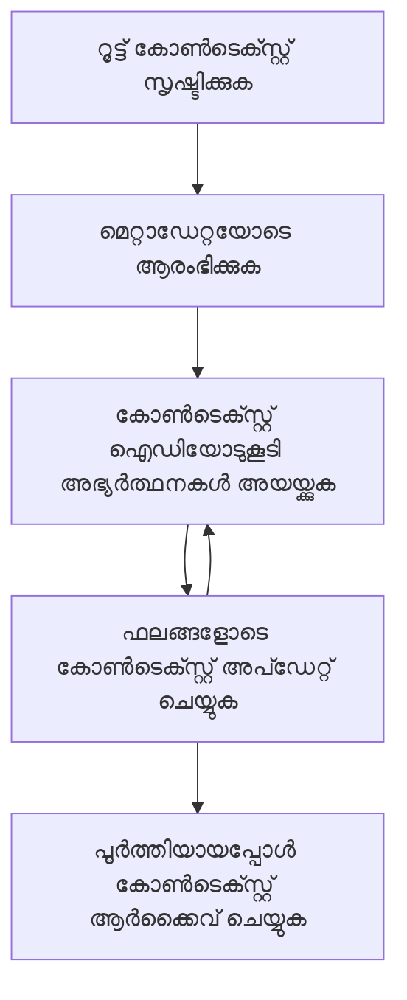

<!--
CO_OP_TRANSLATOR_METADATA:
{
  "original_hash": "ebdb86db46113f1cbd59ce4c74caaa79",
  "translation_date": "2025-12-11T15:15:20+00:00",
  "source_file": "05-AdvancedTopics/mcp-root-contexts/README.md",
  "language_code": "ml"
}
-->
# MCP റൂട്ട് കോൺടെക്സ്റ്റുകൾ

റൂട്ട് കോൺടെക്സ്റ്റുകൾ മോഡൽ കോൺടെക്സ്റ്റ് പ്രോട്ടോക്കോളിലെ ഒരു അടിസ്ഥാന ആശയമാണ്, ഇത് പല അഭ്യർത്ഥനകളും സെഷനുകളും കടന്നുപോകുന്ന സംഭാഷണ ചരിത്രവും പങ്കുവെച്ച സ്റ്റേറ്റും നിലനിർത്തുന്നതിനുള്ള സ്ഥിരമായ ഒരു പാളി നൽകുന്നു.

## പരിചയം

ഈ പാഠത്തിൽ, MCP-യിൽ റൂട്ട് കോൺടെക്സ്റ്റുകൾ എങ്ങനെ സൃഷ്ടിക്കാമെന്നും, നിയന്ത്രിക്കാമെന്നും, ഉപയോഗിക്കാമെന്നും നാം പരിശോധിക്കും.

## പഠന ലക്ഷ്യങ്ങൾ

ഈ പാഠം അവസാനിക്കുമ്പോൾ, നിങ്ങൾക്ക് കഴിയും:

- റൂട്ട് കോൺടെക്സ്റ്റുകളുടെ ഉദ്ദേശവും ഘടനയും മനസിലാക്കുക
- MCP ക്ലയന്റ് ലൈബ്രറികൾ ഉപയോഗിച്ച് റൂട്ട് കോൺടെക്സ്റ്റുകൾ സൃഷ്ടിക്കുകയും നിയന്ത്രിക്കുകയും ചെയ്യുക
- .NET, ജാവ, ജാവാസ്ക്രിപ്റ്റ്, പൈത്തൺ ആപ്ലിക്കേഷനുകളിൽ റൂട്ട് കോൺടെക്സ്റ്റുകൾ നടപ്പിലാക്കുക
- മൾട്ടി-ടേൺ സംഭാഷണങ്ങൾക്കും സ്റ്റേറ്റ് മാനേജ്മെന്റിനും റൂട്ട് കോൺടെക്സ്റ്റുകൾ ഉപയോഗിക്കുക
- റൂട്ട് കോൺടെക്സ്റ്റ് മാനേജ്മെന്റിനുള്ള മികച്ച പ്രാക്ടീസുകൾ നടപ്പിലാക്കുക

## റൂട്ട് കോൺടെക്സ്റ്റുകൾ മനസിലാക്കൽ

റൂട്ട് കോൺടെക്സ്റ്റുകൾ ബന്ധപ്പെട്ട ഇടപെടലുകളുടെ ഒരു പരമ്പരയ്ക്കുള്ള ചരിത്രവും സ്റ്റേറ്റും സൂക്ഷിക്കുന്ന കണ്ടെയ്‌നറുകളായി പ്രവർത്തിക്കുന്നു. അവ സാധ്യമാക്കുന്നു:

- **സംഭാഷണ സ്ഥിരത**: സുസ്ഥിരമായ മൾട്ടി-ടേൺ സംഭാഷണങ്ങൾ നിലനിർത്തൽ
- **മെമ്മറി മാനേജ്മെന്റ്**: ഇടപെടലുകൾക്കിടയിൽ വിവരങ്ങൾ സൂക്ഷിക്കുകയും പുനഃപ്രാപിക്കുകയും ചെയ്യുക
- **സ്റ്റേറ്റ് മാനേജ്മെന്റ്**: സങ്കീർണ്ണമായ വർക്ക്‌ഫ്ലോകളിൽ പുരോഗതി ട്രാക്ക് ചെയ്യുക
- **കോൺടെക്സ്റ്റ് പങ്കിടൽ**: പല ക്ലയന്റുകൾക്കും ഒരേ സംഭാഷണ സ്റ്റേറ്റ് ആക്‌സസ് ചെയ്യാൻ അനുവദിക്കുക

MCP-യിൽ, റൂട്ട് കോൺടെക്സ്റ്റുകൾക്ക് ഈ പ്രധാന സവിശേഷതകൾ ഉണ്ട്:

- ഓരോ റൂട്ട് കോൺടെക്സ്റ്റിനും ഒരു വ്യത്യസ്ത ഐഡന്റിഫയർ ഉണ്ട്.
- അവ സംഭാഷണ ചരിത്രം, ഉപയോക്തൃ മുൻഗണനകൾ, മറ്റ് മെറ്റാഡേറ്റ എന്നിവ ഉൾക്കൊള്ളാം.
- ആവശ്യത്തിന് അവ സൃഷ്ടിക്കാനും ആക്‌സസ് ചെയ്യാനും ആർക്കൈവ് ചെയ്യാനും കഴിയും.
- സൂക്ഷ്മ ആക്‌സസ് നിയന്ത്രണവും അനുമതികളും പിന്തുണയ്ക്കുന്നു.

## റൂട്ട് കോൺടെക്സ്റ്റ് ലൈഫ്‌സൈക്കിൾ


## റൂട്ട് കോൺടെക്സ്റ്റുകളുമായി പ്രവർത്തിക്കൽ

റൂട്ട് കോൺടെക്സ്റ്റുകൾ എങ്ങനെ സൃഷ്ടിക്കുകയും നിയന്ത്രിക്കുകയും ചെയ്യാമെന്ന് ഒരു ഉദാഹരണം ഇവിടെ കാണാം.

### C# നടപ്പാക്കൽ

```csharp
// .NET Example: Root Context Management
using Microsoft.Mcp.Client;
using System;
using System.Threading.Tasks;
using System.Collections.Generic;

public class RootContextExample
{
    private readonly IMcpClient _client;
    private readonly IRootContextManager _contextManager;
    
    public RootContextExample(IMcpClient client, IRootContextManager contextManager)
    {
        _client = client;
        _contextManager = contextManager;
    }
    
    public async Task DemonstrateRootContextAsync()
    {
        // 1. Create a new root context
        var contextResult = await _contextManager.CreateRootContextAsync(new RootContextCreateOptions
        {
            Name = "Customer Support Session",
            Metadata = new Dictionary<string, string>
            {
                ["CustomerName"] = "Acme Corporation",
                ["PriorityLevel"] = "High",
                ["Domain"] = "Cloud Services"
            }
        });
        
        string contextId = contextResult.ContextId;
        Console.WriteLine($"Created root context with ID: {contextId}");
        
        // 2. First interaction using the context
        var response1 = await _client.SendPromptAsync(
            "I'm having issues scaling my web service deployment in the cloud.", 
            new SendPromptOptions { RootContextId = contextId }
        );
        
        Console.WriteLine($"First response: {response1.GeneratedText}");
        
        // Second interaction - the model will have access to the previous conversation
        var response2 = await _client.SendPromptAsync(
            "Yes, we're using containerized deployments with Kubernetes.", 
            new SendPromptOptions { RootContextId = contextId }
        );
        
        Console.WriteLine($"Second response: {response2.GeneratedText}");
        
        // 3. Add metadata to the context based on conversation
        await _contextManager.UpdateContextMetadataAsync(contextId, new Dictionary<string, string>
        {
            ["TechnicalEnvironment"] = "Kubernetes",
            ["IssueType"] = "Scaling"
        });
        
        // 4. Get context information
        var contextInfo = await _contextManager.GetRootContextInfoAsync(contextId);
        
        Console.WriteLine("Context Information:");
        Console.WriteLine($"- Name: {contextInfo.Name}");
        Console.WriteLine($"- Created: {contextInfo.CreatedAt}");
        Console.WriteLine($"- Messages: {contextInfo.MessageCount}");
        
        // 5. When the conversation is complete, archive the context
        await _contextManager.ArchiveRootContextAsync(contextId);
        Console.WriteLine($"Archived context {contextId}");
    }
}
```

മുൻകൂട്ടി നൽകിയ കോഡിൽ നാം:

1. ഒരു കസ്റ്റമർ സപ്പോർട്ട് സെഷനിനായി റൂട്ട് കോൺടെക്സ്റ്റ് സൃഷ്ടിച്ചു.
1. ആ കോൺടെക്സ്റ്റിനുള്ളിൽ പല സന്ദേശങ്ങളും അയച്ചു, മോഡലിന് സ്റ്റേറ്റ് നിലനിർത്താൻ അനുവദിച്ചു.
1. സംഭാഷണത്തിന്റെ അടിസ്ഥാനത്തിൽ ബന്ധപ്പെട്ട മെറ്റാഡേറ്റ ഉപയോഗിച്ച് കോൺടെക്സ്റ്റ് അപ്ഡേറ്റ് ചെയ്തു.
1. സംഭാഷണ ചരിത്രം മനസിലാക്കാൻ കോൺടെക്സ്റ്റ് വിവരങ്ങൾ പുനഃപ്രാപിച്ചു.
1. സംഭാഷണം പൂർത്തിയായപ്പോൾ കോൺടെക്സ്റ്റ് ആർക്കൈവ് ചെയ്തു.

## ഉദാഹരണം: സാമ്പത്തിക വിശകലനത്തിനുള്ള റൂട്ട് കോൺടെക്സ്റ്റ് നടപ്പാക്കൽ

ഈ ഉദാഹരണത്തിൽ, നാം സാമ്പത്തിക വിശകലന സെഷനിനായി ഒരു റൂട്ട് കോൺടെക്സ്റ്റ് സൃഷ്ടിച്ച്, പല ഇടപെടലുകളിലൂടെയും സ്റ്റേറ്റ് എങ്ങനെ നിലനിർത്താമെന്ന് കാണിക്കും.

### ജാവ നടപ്പാക്കൽ

```java
// ജാവ ഉദാഹരണം: റൂട്ട് കോൺടെക്സ്റ്റ് നടപ്പാക്കൽ
package com.example.mcp.contexts;

import com.mcp.client.McpClient;
import com.mcp.client.ContextManager;
import com.mcp.models.RootContext;
import com.mcp.models.McpResponse;

import java.util.HashMap;
import java.util.Map;
import java.util.UUID;

public class RootContextsDemo {
    private final McpClient client;
    private final ContextManager contextManager;
    
    public RootContextsDemo(String serverUrl) {
        this.client = new McpClient.Builder()
            .setServerUrl(serverUrl)
            .build();
            
        this.contextManager = new ContextManager(client);
    }
    
    public void demonstrateRootContext() throws Exception {
        // കോൺടെക്സ്റ്റ് മെറ്റാഡേറ്റ സൃഷ്ടിക്കുക
        Map<String, String> metadata = new HashMap<>();
        metadata.put("projectName", "Financial Analysis");
        metadata.put("userRole", "Financial Analyst");
        metadata.put("dataSource", "Q1 2025 Financial Reports");
        
        // 1. പുതിയ റൂട്ട് കോൺടെക്സ്റ്റ് സൃഷ്ടിക്കുക
        RootContext context = contextManager.createRootContext("Financial Analysis Session", metadata);
        String contextId = context.getId();
        
        System.out.println("Created context: " + contextId);
        
        // 2. ആദ്യ ഇടപെടൽ
        McpResponse response1 = client.sendPrompt(
            "Analyze the trends in Q1 financial data for our technology division",
            contextId
        );
        
        System.out.println("First response: " + response1.getGeneratedText());
        
        // 3. പ്രതികരണത്തിൽ നിന്നുള്ള പ്രധാന വിവരങ്ങൾ ഉപയോഗിച്ച് കോൺടെക്സ്റ്റ് അപ്ഡേറ്റ് ചെയ്യുക
        contextManager.addContextMetadata(contextId, 
            Map.of("identifiedTrend", "Increasing cloud infrastructure costs"));
        
        // രണ്ടാം ഇടപെടൽ - അതേ കോൺടെക്സ്റ്റ് ഉപയോഗിച്ച്
        McpResponse response2 = client.sendPrompt(
            "What's driving the increase in cloud infrastructure costs?",
            contextId
        );
        
        System.out.println("Second response: " + response2.getGeneratedText());
        
        // 4. വിശകലന സെഷന്റെ സംഗ്രഹം സൃഷ്ടിക്കുക
        McpResponse summaryResponse = client.sendPrompt(
            "Summarize our analysis of the technology division financials in 3-5 key points",
            contextId
        );
        
        // സംഗ്രഹം കോൺടെക്സ്റ്റ് മെറ്റാഡേറ്റയിൽ സൂക്ഷിക്കുക
        contextManager.addContextMetadata(contextId, 
            Map.of("analysisSummary", summaryResponse.getGeneratedText()));
            
        // അപ്ഡേറ്റുചെയ്‌ത കോൺടെക്സ്റ്റ് വിവരങ്ങൾ നേടുക
        RootContext updatedContext = contextManager.getRootContext(contextId);
        
        System.out.println("Context Information:");
        System.out.println("- Created: " + updatedContext.getCreatedAt());
        System.out.println("- Last Updated: " + updatedContext.getLastUpdatedAt());
        System.out.println("- Analysis Summary: " + 
            updatedContext.getMetadata().get("analysisSummary"));
            
        // 5. പൂർത്തിയായപ്പോൾ കോൺടെക്സ്റ്റ് ആർക്കൈവ് ചെയ്യുക
        contextManager.archiveContext(contextId);
        System.out.println("Context archived");
    }
}
```

മുൻകൂട്ടി നൽകിയ കോഡിൽ നാം:

1. സാമ്പത്തിക വിശകലന സെഷനിനായി ഒരു റൂട്ട് കോൺടെക്സ്റ്റ് സൃഷ്ടിച്ചു.
2. ആ കോൺടെക്സ്റ്റിനുള്ളിൽ പല സന്ദേശങ്ങളും അയച്ചു, മോഡലിന് സ്റ്റേറ്റ് നിലനിർത്താൻ അനുവദിച്ചു.
3. സംഭാഷണത്തിന്റെ അടിസ്ഥാനത്തിൽ ബന്ധപ്പെട്ട മെറ്റാഡേറ്റ ഉപയോഗിച്ച് കോൺടെക്സ്റ്റ് അപ്ഡേറ്റ് ചെയ്തു.
4. വിശകലന സെഷന്റെ സംഗ്രഹം സൃഷ്ടിച്ച് അത് കോൺടെക്സ്റ്റ് മെറ്റാഡേറ്റയിൽ സൂക്ഷിച്ചു.
5. സംഭാഷണം പൂർത്തിയായപ്പോൾ കോൺടെക്സ്റ്റ് ആർക്കൈവ് ചെയ്തു.

## ഉദാഹരണം: റൂട്ട് കോൺടെക്സ്റ്റ് മാനേജ്മെന്റ്

സംഭാഷണ ചരിത്രവും സ്റ്റേറ്റും നിലനിർത്താൻ റൂട്ട് കോൺടെക്സ്റ്റുകൾ ഫലപ്രദമായി മാനേജ് ചെയ്യുന്നത് അത്യന്താപേക്ഷിതമാണ്. റൂട്ട് കോൺടെക്സ്റ്റ് മാനേജ്മെന്റ് എങ്ങനെ നടപ്പിലാക്കാമെന്ന് താഴെ ഒരു ഉദാഹരണം കാണാം.

### ജാവാസ്ക്രിപ്റ്റ് നടപ്പാക്കൽ

```javascript
// ജാവാസ്ക്രിപ്റ്റ് ഉദാഹരണം: MCP റൂട്ട് കോൺടെക്സ്റ്റുകൾ മാനേജ് ചെയ്യൽ
const { McpClient, RootContextManager } = require('@mcp/client');

class ContextSession {
  constructor(serverUrl, apiKey = null) {
    // MCP ക്ലയന്റ് ആരംഭിക്കുക
    this.client = new McpClient({
      serverUrl,
      apiKey
    });
    
    // കോൺടെക്സ്റ്റ് മാനേജർ ആരംഭിക്കുക
    this.contextManager = new RootContextManager(this.client);
  }
  
  /**
   * Create a new conversation context
   * @param {string} sessionName - Name of the conversation session
   * @param {Object} metadata - Additional metadata for the context
   * @returns {Promise<string>} - Context ID
   */
  async createConversationContext(sessionName, metadata = {}) {
    try {
      const contextResult = await this.contextManager.createRootContext({
        name: sessionName,
        metadata: {
          ...metadata,
          createdAt: new Date().toISOString(),
          status: 'active'
        }
      });
      
      console.log(`Created root context '${sessionName}' with ID: ${contextResult.id}`);
      return contextResult.id;
    } catch (error) {
      console.error('Error creating root context:', error);
      throw error;
    }
  }
  
  /**
   * Send a message in an existing context
   * @param {string} contextId - The root context ID
   * @param {string} message - The user's message
   * @param {Object} options - Additional options
   * @returns {Promise<Object>} - Response data
   */
  async sendMessage(contextId, message, options = {}) {
    try {
      // നിർദ്ദിഷ്ട കോൺടെക്സ്റ്റ് ഉപയോഗിച്ച് സന്ദേശം അയയ്ക്കുക
      const response = await this.client.sendPrompt(message, {
        rootContextId: contextId,
        temperature: options.temperature || 0.7,
        allowedTools: options.allowedTools || []
      });
      
      // സംഭാഷണത്തിൽ നിന്നുള്ള പ്രധാന洞ങ്ങൾ ഓപ്ഷണൽ ആയി സംഭരിക്കുക
      if (options.storeInsights) {
        await this.storeConversationInsights(contextId, message, response.generatedText);
      }
      
      return {
        message: response.generatedText,
        toolCalls: response.toolCalls || [],
        contextId
      };
    } catch (error) {
      console.error(`Error sending message in context ${contextId}:`, error);
      throw error;
    }
  }
  
  /**
   * Store important insights from a conversation
   * @param {string} contextId - The root context ID
   * @param {string} userMessage - User's message
   * @param {string} aiResponse - AI's response
   */
  async storeConversationInsights(contextId, userMessage, aiResponse) {
    try {
      // സാധ്യതയുള്ള洞ങ്ങൾ എടുക്കുക (യഥാർത്ഥ ആപ്പിൽ ഇത് കൂടുതൽ സങ്കീർണ്ണമായിരിക്കും)
      const combinedText = userMessage + "\n" + aiResponse;
      
      // സാധ്യതയുള്ള洞ങ്ങൾ തിരിച്ചറിയാനുള്ള ലളിതമായ ഹ്യൂറിസ്റ്റിക്
      const insightWords = ["important", "key point", "remember", "significant", "crucial"];
      
      const potentialInsights = combinedText
        .split(".")
        .filter(sentence => 
          insightWords.some(word => sentence.toLowerCase().includes(word))
        )
        .map(sentence => sentence.trim())
        .filter(sentence => sentence.length > 10);
      
      // 洞ങ്ങൾ കോൺടെക്സ്റ്റ് മെറ്റാഡേറ്റയിൽ സംഭരിക്കുക
      if (potentialInsights.length > 0) {
        const insights = {};
        potentialInsights.forEach((insight, index) => {
          insights[`insight_${Date.now()}_${index}`] = insight;
        });
        
        await this.contextManager.updateContextMetadata(contextId, insights);
        console.log(`Stored ${potentialInsights.length} insights in context ${contextId}`);
      }
    } catch (error) {
      console.warn('Error storing conversation insights:', error);
      // നിർണായകമല്ലാത്ത പിശക്, അതിനാൽ വെറും മുന്നറിയിപ്പ് ലോഗ് ചെയ്യുക
    }
  }
  
  /**
   * Get summary information about a context
   * @param {string} contextId - The root context ID
   * @returns {Promise<Object>} - Context information
   */
  async getContextInfo(contextId) {
    try {
      const contextInfo = await this.contextManager.getContextInfo(contextId);
      
      return {
        id: contextInfo.id,
        name: contextInfo.name,
        created: new Date(contextInfo.createdAt).toLocaleString(),
        lastUpdated: new Date(contextInfo.lastUpdatedAt).toLocaleString(),
        messageCount: contextInfo.messageCount,
        metadata: contextInfo.metadata,
        status: contextInfo.status
      };
    } catch (error) {
      console.error(`Error getting context info for ${contextId}:`, error);
      throw error;
    }
  }
  
  /**
   * Generate a summary of the conversation in a context
   * @param {string} contextId - The root context ID
   * @returns {Promise<string>} - Generated summary
   */
  async generateContextSummary(contextId) {
    try {
      // ഇതുവരെ നടന്ന സംഭാഷണത്തിന്റെ സംക്ഷേപം സൃഷ്ടിക്കാൻ മോഡലിനെ ചോദിക്കുക
      const response = await this.client.sendPrompt(
        "Please summarize our conversation so far in 3-4 sentences, highlighting the main points discussed.",
        { rootContextId: contextId, temperature: 0.3 }
      );
      
      // സംക്ഷേപം കോൺടെക്സ്റ്റ് മെറ്റാഡേറ്റയിൽ സംഭരിക്കുക
      await this.contextManager.updateContextMetadata(contextId, {
        conversationSummary: response.generatedText,
        summarizedAt: new Date().toISOString()
      });
      
      return response.generatedText;
    } catch (error) {
      console.error(`Error generating context summary for ${contextId}:`, error);
      throw error;
    }
  }
  
  /**
   * Archive a context when it's no longer needed
   * @param {string} contextId - The root context ID
   * @returns {Promise<Object>} - Result of the archive operation
   */
  async archiveContext(contextId) {
    try {
      // ആർക്കൈവ് ചെയ്യുന്നതിന് മുമ്പ് അന്തിമ സംക്ഷേപം സൃഷ്ടിക്കുക
      const summary = await this.generateContextSummary(contextId);
      
      // കോൺടെക്സ്റ്റ് ആർക്കൈവ് ചെയ്യുക
      await this.contextManager.archiveContext(contextId);
      
      return {
        status: "archived",
        contextId,
        summary
      };
    } catch (error) {
      console.error(`Error archiving context ${contextId}:`, error);
      throw error;
    }
  }
}

// ഉദാഹരണ ഉപയോഗം
async function demonstrateContextSession() {
  const session = new ContextSession('https://mcp-server-example.com');
  
  try {
    // 1. ഉൽപ്പന്ന പിന്തുണ സംഭാഷണത്തിന് പുതിയ കോൺടെക്സ്റ്റ് സൃഷ്ടിക്കുക
    const contextId = await session.createConversationContext(
      'Product Support - Database Performance',
      {
        customer: 'Globex Corporation',
        product: 'Enterprise Database',
        severity: 'Medium',
        supportAgent: 'AI Assistant'
      }
    );
    
    // 2. സംഭാഷണത്തിലെ ആദ്യ സന്ദേശം
    const response1 = await session.sendMessage(
      contextId,
      "I'm experiencing slow query performance on our database cluster after the latest update.",
      { storeInsights: true }
    );
    console.log('Response 1:', response1.message);
    
    // അതേ കോൺടെക്സ്റ്റിൽ ഫോളോ-അപ്പ് സന്ദേശം
    const response2 = await session.sendMessage(
      contextId,
      "Yes, we've already checked the indexes and they seem to be properly configured.",
      { storeInsights: true }
    );
    console.log('Response 2:', response2.message);
    
    // 3. കോൺടെക്സ്റ്റ് സംബന്ധിച്ച വിവരങ്ങൾ നേടുക
    const contextInfo = await session.getContextInfo(contextId);
    console.log('Context Information:', contextInfo);
    
    // 4. സംഭാഷണ സംക്ഷേപം സൃഷ്ടിച്ച് പ്രദർശിപ്പിക്കുക
    const summary = await session.generateContextSummary(contextId);
    console.log('Conversation Summary:', summary);
    
    // 5. പൂർത്തിയായപ്പോൾ കോൺടെക്സ്റ്റ് ആർക്കൈവ് ചെയ്യുക
    const archiveResult = await session.archiveContext(contextId);
    console.log('Archive Result:', archiveResult);
    
    // 6. പിശകുകൾ സുഖപ്രദമായി കൈകാര്യം ചെയ്യുക
  } catch (error) {
    console.error('Error in context session demonstration:', error);
  }
}

demonstrateContextSession();
```

മുൻകൂട്ടി നൽകിയ കോഡിൽ നാം:

1. `createConversationContext` ഫംഗ്ഷൻ ഉപയോഗിച്ച് ഒരു ഉൽപ്പന്ന പിന്തുണാ സംഭാഷണത്തിനായി റൂട്ട് കോൺടെക്സ്റ്റ് സൃഷ്ടിച്ചു. ഈ കേസിൽ, കോൺടെക്സ്റ്റ് ഡാറ്റാബേസ് പ്രകടന പ്രശ്നങ്ങളെക്കുറിച്ചാണ്.

1. `sendMessage` ഫംഗ്ഷൻ ഉപയോഗിച്ച് ആ കോൺടെക്സ്റ്റിനുള്ളിൽ പല സന്ദേശങ്ങളും അയച്ചു, മോഡലിന് സ്റ്റേറ്റ് നിലനിർത്താൻ അനുവദിച്ചു. അയച്ച സന്ദേശങ്ങൾ മന്ദഗതിയിലുള്ള ക്വറി പ്രകടനവും ഇൻഡക്സ് കോൺഫിഗറേഷനും സംബന്ധിച്ചവയാണ്.

1. സംഭാഷണത്തിന്റെ അടിസ്ഥാനത്തിൽ ബന്ധപ്പെട്ട മെറ്റാഡേറ്റ ഉപയോഗിച്ച് കോൺടെക്സ്റ്റ് അപ്ഡേറ്റ് ചെയ്തു.

1. `generateContextSummary` ഫംഗ്ഷൻ ഉപയോഗിച്ച് സംഭാഷണത്തിന്റെ സംഗ്രഹം സൃഷ്ടിച്ച് അത് കോൺടെക്സ്റ്റ് മെറ്റാഡേറ്റയിൽ സൂക്ഷിച്ചു.

1. `archiveContext` ഫംഗ്ഷൻ ഉപയോഗിച്ച് സംഭാഷണം പൂർത്തിയായപ്പോൾ കോൺടെക്സ്റ്റ് ആർക്കൈവ് ചെയ്തു.

1. ദൃഢത ഉറപ്പാക്കാൻ പിശകുകൾ സുതാര്യമായി കൈകാര്യം ചെയ്തു.

## മൾട്ടി-ടേൺ സഹായത്തിനുള്ള റൂട്ട് കോൺടെക്സ്റ്റ്

ഈ ഉദാഹരണത്തിൽ, നാം മൾട്ടി-ടേൺ സഹായ സെഷനിനായി ഒരു റൂട്ട് കോൺടെക്സ്റ്റ് സൃഷ്ടിച്ച്, പല ഇടപെടലുകളിലൂടെയും സ്റ്റേറ്റ് എങ്ങനെ നിലനിർത്താമെന്ന് കാണിക്കും.

### പൈത്തൺ നടപ്പാക്കൽ

```python
# പൈതൺ ഉദാഹരണം: മൾട്ടി-ടേൺ സഹായത്തിനുള്ള റൂട്ട് കോൺടെക്സ്റ്റ്
import asyncio
from datetime import datetime
from mcp_client import McpClient, RootContextManager

class AssistantSession:
    def __init__(self, server_url, api_key=None):
        self.client = McpClient(server_url=server_url, api_key=api_key)
        self.context_manager = RootContextManager(self.client)
    
    async def create_session(self, name, user_info=None):
        """Create a new root context for an assistant session"""
        metadata = {
            "session_type": "assistant",
            "created_at": datetime.now().isoformat(),
        }
        
        # നൽകിയാൽ ഉപയോക്തൃ വിവരങ്ങൾ ചേർക്കുക
        if user_info:
            metadata.update({f"user_{k}": v for k, v in user_info.items()})
            
        # റൂട്ട് കോൺടെക്സ്റ്റ് സൃഷ്ടിക്കുക
        context = await self.context_manager.create_root_context(name, metadata)
        return context.id
    
    async def send_message(self, context_id, message, tools=None):
        """Send a message within a root context"""
        # കോൺടെക്സ്റ്റ് ഐഡിയോടെ ഓപ്ഷനുകൾ സൃഷ്ടിക്കുക
        options = {
            "root_context_id": context_id
        }
        
        # നിർദ്ദേശിച്ചാൽ ടൂളുകൾ ചേർക്കുക
        if tools:
            options["allowed_tools"] = tools
        
        # കോൺടെക്സ്റ്റിനുള്ളിൽ പ്രോംപ്റ്റ് അയയ്ക്കുക
        response = await self.client.send_prompt(message, options)
        
        # സംഭാഷണ പുരോഗതിയോടെ കോൺടെക്സ്റ്റ് മെറ്റാഡേറ്റ അപ്ഡേറ്റ് ചെയ്യുക
        await self.context_manager.update_context_metadata(
            context_id,
            {
                f"message_{datetime.now().timestamp()}": message[:50] + "...",
                "last_interaction": datetime.now().isoformat()
            }
        )
        
        return response
    
    async def get_conversation_history(self, context_id):
        """Retrieve conversation history from a context"""
        context_info = await self.context_manager.get_context_info(context_id)
        messages = await self.client.get_context_messages(context_id)
        
        return {
            "context_info": context_info,
            "messages": messages
        }
    
    async def end_session(self, context_id):
        """End an assistant session by archiving the context"""
        # ആദ്യം ഒരു സംഗ്രഹ പ്രോംപ്റ്റ് സൃഷ്ടിക്കുക
        summary_response = await self.client.send_prompt(
            "Please summarize our conversation and any key points or decisions made.",
            {"root_context_id": context_id}
        )
        
        # മെറ്റാഡേറ്റയിൽ സംഗ്രഹം സൂക്ഷിക്കുക
        await self.context_manager.update_context_metadata(
            context_id,
            {
                "summary": summary_response.generated_text,
                "ended_at": datetime.now().isoformat(),
                "status": "completed"
            }
        )
        
        # കോൺടെക്സ്റ്റ് ആർക്കൈവ് ചെയ്യുക
        await self.context_manager.archive_context(context_id)
        
        return {
            "status": "completed",
            "summary": summary_response.generated_text
        }

# ഉദാഹരണ ഉപയോഗം
async def demo_assistant_session():
    assistant = AssistantSession("https://mcp-server-example.com")
    
    # 1. സെഷൻ സൃഷ്ടിക്കുക
    context_id = await assistant.create_session(
        "Technical Support Session",
        {"name": "Alex", "technical_level": "advanced", "product": "Cloud Services"}
    )
    print(f"Created session with context ID: {context_id}")
    
    # 2. ആദ്യ ഇടപാട്
    response1 = await assistant.send_message(
        context_id, 
        "I'm having trouble with the auto-scaling feature in your cloud platform.",
        ["documentation_search", "diagnostic_tool"]
    )
    print(f"Response 1: {response1.generated_text}")
    
    # അതേ കോൺടെക്സ്റ്റിൽ രണ്ടാം ഇടപാട്
    response2 = await assistant.send_message(
        context_id,
        "Yes, I've already checked the configuration settings you mentioned, but it's still not working."
    )
    print(f"Response 2: {response2.generated_text}")
    
    # 3. ചരിത്രം നേടുക
    history = await assistant.get_conversation_history(context_id)
    print(f"Session has {len(history['messages'])} messages")
    
    # 4. സെഷൻ അവസാനിപ്പിക്കുക
    end_result = await assistant.end_session(context_id)
    print(f"Session ended with summary: {end_result['summary']}")

if __name__ == "__main__":
    asyncio.run(demo_assistant_session())
```

മുൻകൂട്ടി നൽകിയ കോഡിൽ നാം:

1. `create_session` ഫംഗ്ഷൻ ഉപയോഗിച്ച് ഒരു ടെക്നിക്കൽ സപ്പോർട്ട് സെഷനിനായി റൂട്ട് കോൺടെക്സ്റ്റ് സൃഷ്ടിച്ചു. കോൺടെക്സ്റ്റിൽ പേര്, ടെക്നിക്കൽ ലെവൽ തുടങ്ങിയ ഉപയോക്തൃ വിവരങ്ങൾ ഉൾപ്പെടുന്നു.

1. `send_message` ഫംഗ്ഷൻ ഉപയോഗിച്ച് ആ കോൺടെക്സ്റ്റിനുള്ളിൽ പല സന്ദേശങ്ങളും അയച്ചു, മോഡലിന് സ്റ്റേറ്റ് നിലനിർത്താൻ അനുവദിച്ചു. അയച്ച സന്ദേശങ്ങൾ ഓട്ടോ-സ്കെയിലിംഗ് ഫീച്ചറുമായി ബന്ധപ്പെട്ട പ്രശ്നങ്ങളാണ്.

1. `get_conversation_history` ഫംഗ്ഷൻ ഉപയോഗിച്ച് സംഭാഷണ ചരിത്രം പുനഃപ്രാപിച്ചു, ഇത് കോൺടെക്സ്റ്റ് വിവരങ്ങളും സന്ദേശങ്ങളും നൽകുന്നു.

1. `end_session` ഫംഗ്ഷൻ ഉപയോഗിച്ച് സെഷൻ അവസാനിപ്പിച്ച് കോൺടെക്സ്റ്റ് ആർക്കൈവ് ചെയ്തു, സംഭാഷണത്തിലെ പ്രധാനപ്പെട്ട കാര്യങ്ങൾ ഉൾക്കൊള്ളുന്ന ഒരു സംഗ്രഹം സൃഷ്ടിച്ചു.

## റൂട്ട് കോൺടെക്സ്റ്റ് മികച്ച പ്രാക്ടീസുകൾ

റൂട്ട് കോൺടെക്സ്റ്റുകൾ ഫലപ്രദമായി മാനേജ് ചെയ്യുന്നതിനുള്ള ചില മികച്ച പ്രാക്ടീസുകൾ:

- **കേന്ദ്രികൃത കോൺടെക്സ്റ്റുകൾ സൃഷ്ടിക്കുക**: വ്യത്യസ്ത സംഭാഷണ ഉദ്ദേശങ്ങൾക്കോ ഡൊമെയ്‌നുകൾക്കോ വേണ്ടി വേർതിരിച്ച റൂട്ട് കോൺടെക്സ്റ്റുകൾ സൃഷ്ടിച്ച് വ്യക്തത നിലനിർത്തുക.

- **കാലഹരണ നയങ്ങൾ സജ്ജമാക്കുക**: പഴയ കോൺടെക്സ്റ്റുകൾ ആർക്കൈവ് ചെയ്യുകയോ ഇല്ലാതാക്കുകയോ ചെയ്യാനുള്ള നയങ്ങൾ നടപ്പിലാക്കി സംഭരണവും ഡാറ്റാ നിലനിർത്തൽ നയങ്ങളും പാലിക്കുക.

- **പ്രസക്തമായ മെറ്റാഡേറ്റ സൂക്ഷിക്കുക**: സംഭാഷണത്തെക്കുറിച്ചുള്ള പ്രധാന വിവരങ്ങൾ പിന്നീട് ഉപയോഗിക്കാൻ കോൺടെക്സ്റ്റ് മെറ്റാഡേറ്റയിൽ സൂക്ഷിക്കുക.

- **കോൺടെക്സ്റ്റ് ഐഡികൾ സ്ഥിരമായി ഉപയോഗിക്കുക**: ഒരു കോൺടെക്സ്റ്റ് സൃഷ്ടിച്ചതിന് ശേഷം, അതിന്റെ ഐഡി എല്ലാ ബന്ധപ്പെട്ട അഭ്യർത്ഥനകൾക്കും സ്ഥിരമായി ഉപയോഗിച്ച് തുടർച്ച നിലനിർത്തുക.

- **സംഗ്രഹങ്ങൾ സൃഷ്ടിക്കുക**: ഒരു കോൺടെക്സ്റ്റ് വലുതാകുമ്പോൾ, അതിന്റെ വലിപ്പം നിയന്ത്രിക്കാനും പ്രധാന വിവരങ്ങൾ പിടിച്ചെടുക്കാനും സംഗ്രഹങ്ങൾ സൃഷ്ടിക്കാൻ പരിഗണിക്കുക.

- **ആക്‌സസ് നിയന്ത്രണം നടപ്പിലാക്കുക**: മൾട്ടി-ഉപയോക്തൃ സിസ്റ്റങ്ങൾക്കായി, സംഭാഷണ കോൺടെക്സ്റ്റുകളുടെ സ്വകാര്യതയും സുരക്ഷയും ഉറപ്പാക്കാൻ ശരിയായ ആക്‌സസ് നിയന്ത്രണങ്ങൾ നടപ്പിലാക്കുക.

- **കോൺടെക്സ്റ്റ് പരിധികൾ കൈകാര്യം ചെയ്യുക**: കോൺടെക്സ്റ്റ് വലിപ്പ പരിധികൾ അറിയുകയും വളരെ ദൈർഘ്യമുള്ള സംഭാഷണങ്ങൾ കൈകാര്യം ചെയ്യാനുള്ള തന്ത്രങ്ങൾ നടപ്പിലാക്കുകയും ചെയ്യുക.

- **പൂർത്തിയായപ്പോൾ ആർക്കൈവ് ചെയ്യുക**: സംഭാഷണങ്ങൾ പൂർത്തിയായപ്പോൾ കോൺടെക്സ്റ്റുകൾ ആർക്കൈവ് ചെയ്ത് സംഭാഷണ ചരിത്രം സംരക്ഷിക്കുമ്പോൾ വിഭവങ്ങൾ മോചിപ്പിക്കുക.

## അടുത്തത്

- [5.5 Routing](../mcp-routing/README.md)

---

<!-- CO-OP TRANSLATOR DISCLAIMER START -->
**അസൂയാ**:  
ഈ രേഖ AI വിവർത്തന സേവനം [Co-op Translator](https://github.com/Azure/co-op-translator) ഉപയോഗിച്ച് വിവർത്തനം ചെയ്തതാണ്. നാം കൃത്യതയ്ക്ക് ശ്രമിച്ചിട്ടുണ്ടെങ്കിലും, സ്വയം പ്രവർത്തിക്കുന്ന വിവർത്തനങ്ങളിൽ പിശകുകൾ അല്ലെങ്കിൽ തെറ്റുകൾ ഉണ്ടാകാമെന്ന് ദയവായി ശ്രദ്ധിക്കുക. അതിന്റെ മാതൃഭാഷയിലുള്ള യഥാർത്ഥ രേഖയാണ് പ്രാമാണികമായ ഉറവിടം എന്ന് പരിഗണിക്കേണ്ടതാണ്. നിർണായകമായ വിവരങ്ങൾക്ക്, പ്രൊഫഷണൽ മനുഷ്യ വിവർത്തനം ശുപാർശ ചെയ്യപ്പെടുന്നു. ഈ വിവർത്തനം ഉപയോഗിക്കുന്നതിൽ നിന്നുണ്ടാകുന്ന ഏതെങ്കിലും തെറ്റിദ്ധാരണകൾക്കോ തെറ്റായ വ്യാഖ്യാനങ്ങൾക്കോ ഞങ്ങൾ ഉത്തരവാദികളല്ല.
<!-- CO-OP TRANSLATOR DISCLAIMER END -->