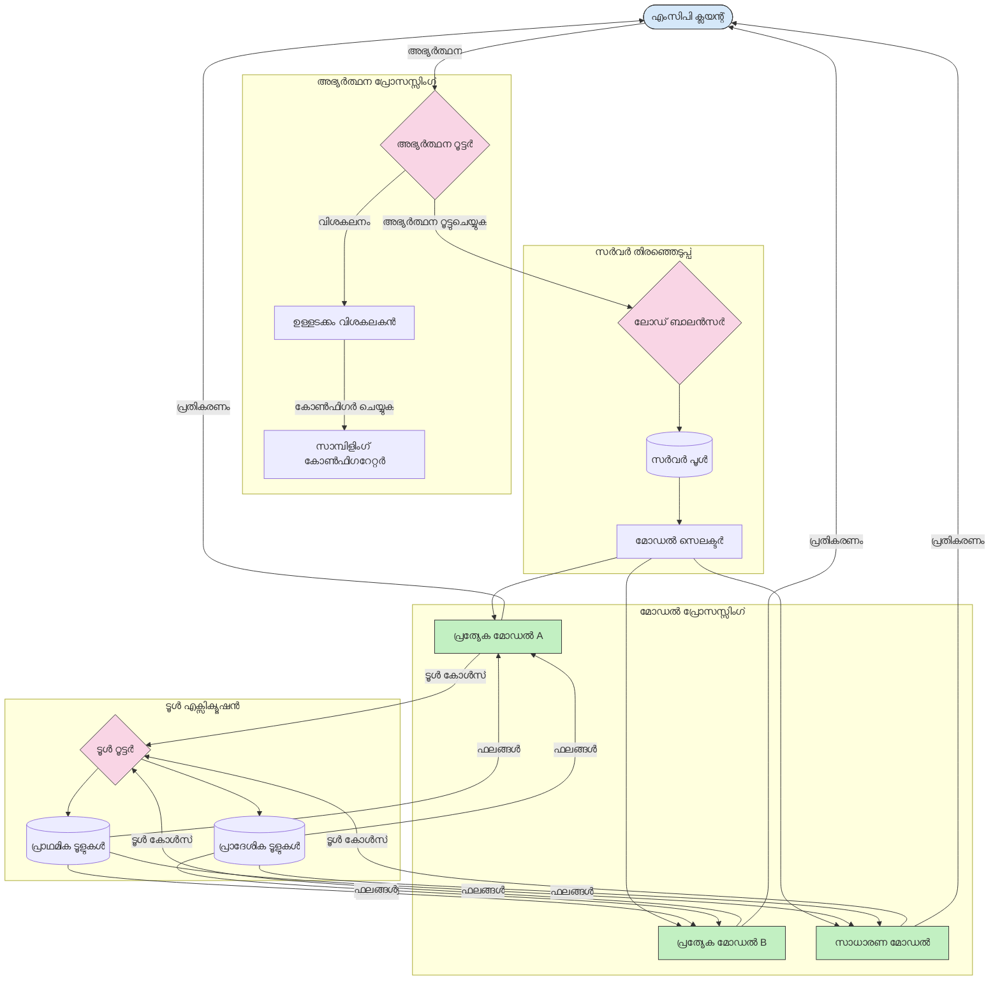

<!--
CO_OP_TRANSLATOR_METADATA:
{
  "original_hash": "2f1b473818b5a6cc9a9bbf777fffa6d4",
  "translation_date": "2025-12-11T16:29:38+00:00",
  "source_file": "05-AdvancedTopics/mcp-routing/README.md",
  "language_code": "ml"
}
-->
# മോഡൽ കോൺടെക്സ്റ്റ് പ്രോട്ടോക്കോളിലെ റൂട്ടിംഗ്

MCP ഇക്കോസിസ്റ്റത്തിൽ ആവശ്യമായ മോഡലുകൾ, ടൂളുകൾ, അല്ലെങ്കിൽ സേവനങ്ങളിലേക്ക് അഭ്യർത്ഥനകൾ നയിക്കുന്നതിന് റൂട്ടിംഗ് അനിവാര്യമാണ്.

## പരിചയം

മോഡൽ കോൺടെക്സ്റ്റ് പ്രോട്ടോക്കോളിൽ (MCP) റൂട്ടിംഗ് എന്നത് ഉള്ളടക്ക തരം, ഉപയോക്തൃ കോൺടെക്സ്റ്റ്, സിസ്റ്റം ലോഡ് തുടങ്ങിയ വിവിധ മാനദണ്ഡങ്ങളുടെ അടിസ്ഥാനത്തിൽ ഏറ്റവും അനുയോജ്യമായ മോഡലുകളിലേക്കോ സേവനങ്ങളിലേക്കോ അഭ്യർത്ഥനകൾ നയിക്കുന്നതിനെ ഉൾക്കൊള്ളുന്നു. ഇത് കാര്യക്ഷമമായ പ്രോസസ്സിംഗിനും മികച്ച വിഭവ ഉപയോഗത്തിനും ഉറപ്പുനൽകുന്നു.

## പഠന ലക്ഷ്യങ്ങൾ

ഈ പാഠം അവസാനിക്കുമ്പോൾ, നിങ്ങൾക്ക് കഴിയും:

- MCP-യിലെ റൂട്ടിംഗിന്റെ സിദ്ധാന്തങ്ങൾ മനസിലാക്കുക.
- പ്രത്യേക സേവനങ്ങളിലേക്കുള്ള അഭ്യർത്ഥനകൾ നയിക്കാൻ ഉള്ളടക്ക അടിസ്ഥാനത്തിലുള്ള റൂട്ടിംഗ് നടപ്പിലാക്കുക.
- വിഭവ ഉപയോഗം മെച്ചപ്പെടുത്താൻ ബുദ്ധിമുട്ടുള്ള ലോഡ് ബാലൻസിംഗ് തന്ത്രങ്ങൾ പ്രയോഗിക്കുക.
- അഭ്യർത്ഥനയുടെ കോൺടെക്സ്റ്റിന്റെ അടിസ്ഥാനത്തിൽ ഡൈനാമിക് ടൂൾ റൂട്ടിംഗ് നടപ്പിലാക്കുക.

## ഉള്ളടക്ക അടിസ്ഥാനത്തിലുള്ള റൂട്ടിംഗ്

ഉള്ളടക്കത്തിന്റെ അടിസ്ഥാനത്തിൽ അഭ്യർത്ഥനകൾ പ്രത്യേക സേവനങ്ങളിലേക്കു നയിക്കുന്നതാണ് ഉള്ളടക്ക അടിസ്ഥാനത്തിലുള്ള റൂട്ടിംഗ്. ഉദാഹരണത്തിന്, കോഡ് ജനറേഷനുമായി ബന്ധപ്പെട്ട അഭ്യർത്ഥനകൾ പ്രത്യേക കോഡ് മോഡലിലേക്കു നയിക്കാം, സൃഷ്ടിപരമായ എഴുത്ത് അഭ്യർത്ഥനകൾ സൃഷ്ടിപരമായ എഴുത്ത് മോഡലിലേക്കു അയയ്ക്കാം.

വിവിധ പ്രോഗ്രാമിംഗ് ഭാഷകളിൽ ഒരു ഉദാഹരണ നടപ്പാക്കൽ നോക്കാം.

<details>
<summary>.NET</summary>

```csharp
// .NET Example: Content-based routing in MCP
public class ContentBasedRouter
{
    private readonly Dictionary<string, McpClient> _specializedClients;
    private readonly RoutingClassifier _classifier;
    
    public ContentBasedRouter()
    {
        // Initialize specialized clients for different domains
        _specializedClients = new Dictionary<string, McpClient>
        {
            ["code"] = new McpClient("https://code-specialized-mcp.com"),
            ["creative"] = new McpClient("https://creative-specialized-mcp.com"),
            ["scientific"] = new McpClient("https://scientific-specialized-mcp.com"),
            ["general"] = new McpClient("https://general-mcp.com")
        };
        
        // Initialize content classifier
        _classifier = new RoutingClassifier();
    }
    
    public async Task<McpResponse> RouteAndProcessAsync(string prompt, IDictionary<string, object> parameters = null)
    {
        // Classify the prompt to determine the best specialized service
        string category = await _classifier.ClassifyPromptAsync(prompt);
        
        // Get the appropriate client or fall back to general
        var client = _specializedClients.ContainsKey(category) 
            ? _specializedClients[category] 
            : _specializedClients["general"];
            
        Console.WriteLine($"Routing request to {category} specialized service");
        
        // Send request to the selected service
        return await client.SendPromptAsync(prompt, parameters);
    }
    
    // Simple classifier for routing decisions
    private class RoutingClassifier
    {
        public Task<string> ClassifyPromptAsync(string prompt)
        {
            prompt = prompt.ToLowerInvariant();
            
            if (prompt.Contains("code") || prompt.Contains("function") || 
                prompt.Contains("program") || prompt.Contains("algorithm"))
            {
                return Task.FromResult("code");
            }
            
            if (prompt.Contains("story") || prompt.Contains("creative") || 
                prompt.Contains("imagine") || prompt.Contains("design"))
            {
                return Task.FromResult("creative");
            }
            
            if (prompt.Contains("science") || prompt.Contains("research") || 
                prompt.Contains("analyze") || prompt.Contains("study"))
            {
                return Task.FromResult("scientific");
            }
            
            return Task.FromResult("general");
        }
    }
}
```

മുൻകൂട്ടി നൽകിയ കോഡിൽ, ഞങ്ങൾ:

- പ്രോംപ്റ്റിന്റെ ഉള്ളടക്കത്തിന്റെ അടിസ്ഥാനത്തിൽ അഭ്യർത്ഥനകൾ നയിക്കുന്ന `ContentBasedRouter` ക്ലാസ് സൃഷ്ടിച്ചു.
- വ്യത്യസ്ത ഡൊമെയ്‌നുകൾക്കായി (കോഡ്, സൃഷ്ടിപരമായ, ശാസ്ത്രീയ, പൊതുവായ) പ്രത്യേക ക്ലയന്റുകൾ ആരംഭിച്ചു.
- പ്രോംപ്റ്റിന്റെ വിഭാഗം നിർണയിച്ച് അനുയോജ്യമായ പ്രത്യേക സേവനത്തിലേക്ക് റൂട്ടിംഗ് നിർവഹിക്കുന്ന ലളിതമായ ക്ലാസിഫയർ നടപ്പിലാക്കി.
- പ്രത്യേക സേവനം ലഭ്യമല്ലെങ്കിൽ പൊതുവായ സേവനത്തിലേക്ക് റൂട്ടിംഗ് നടത്താൻ ഫാൾബാക്ക് മെക്കാനിസം ഉപയോഗിച്ചു.
- അഭ്യർത്ഥനകൾ കാര്യക്ഷമമായി കൈകാര്യം ചെയ്യാൻ അസിങ്ക്രണസ് പ്രോസസ്സിംഗ് നടപ്പിലാക്കി.
- ഉള്ളടക്ക വിഭാഗങ്ങളെ പ്രത്യേക MCP ക്ലയന്റുകളുമായി മാപ്പ് ചെയ്യാൻ ഡിക്ഷണറി ഉപയോഗിച്ചു.
- പ്രോംപ്റ്റ് വിശകലനം ചെയ്ത് അനുയോജ്യമായ വിഭാഗം തിരിച്ചറിയുന്ന ലളിതമായ ക്ലാസിഫയർ നടപ്പിലാക്കി.
- അഭ്യർത്ഥന അയച്ച് പ്രതികരണം സ്വീകരിക്കാൻ പ്രത്യേക ക്ലയന്റ് ഉപയോഗിച്ചു.
- പ്രോംപ്റ്റ് ഏതെങ്കിലും പ്രത്യേക വിഭാഗത്തോട് പൊരുത്തപ്പെടാത്ത സാഹചര്യങ്ങളിൽ പൊതുവായ സേവനത്തിലേക്ക് റൂട്ടിംഗ് നടത്തി.

</details>

## ബുദ്ധിമുട്ടുള്ള ലോഡ് ബാലൻസിംഗ്

ലോഡ് ബാലൻസിംഗ് വിഭവ ഉപയോഗം മെച്ചപ്പെടുത്തുകയും MCP സേവനങ്ങൾക്ക് ഉയർന്ന ലഭ്യത ഉറപ്പാക്കുകയും ചെയ്യുന്നു. റൗണ്ട്-റോബിൻ, ഭാരിത പ്രതികരണ സമയം, ഉള്ളടക്ക-അറിയുന്ന തന്ത്രങ്ങൾ തുടങ്ങിയ വിവിധ രീതികളിൽ ലോഡ് ബാലൻസിംഗ് നടപ്പിലാക്കാം.

താഴെ കൊടുത്തിരിക്കുന്ന ഉദാഹരണ നടപ്പാക്കൽ താഴെപ്പറയുന്ന തന്ത്രങ്ങൾ ഉപയോഗിക്കുന്നു:

- **റൗണ്ട് റോബിൻ**: ലഭ്യമായ സെർവറുകളിൽ അഭ്യർത്ഥനകൾ സമമായി വിതരണം ചെയ്യുന്നു.
- **ഭാരിത പ്രതികരണ സമയം**: സെർവറുകളുടെ ശരാശരി പ്രതികരണ സമയത്തിന്റെ അടിസ്ഥാനത്തിൽ അഭ്യർത്ഥനകൾ നയിക്കുന്നു.
- **ഉള്ളടക്ക-അറിയുന്ന**: അഭ്യർത്ഥനയുടെ ഉള്ളടക്കത്തിന്റെ അടിസ്ഥാനത്തിൽ പ്രത്യേക സെർവറുകളിലേക്കു റൂട്ടിംഗ് നടത്തുന്നു.

<details>
<summary>Java</summary>

```java
// ജാവ ഉദാഹരണം: MCP സെർവറുകൾക്കായുള്ള ബുദ്ധിമുട്ടുള്ള ലോഡ് ബാലൻസിംഗ്
public class McpLoadBalancer {
    private final List<McpServerNode> serverNodes;
    private final LoadBalancingStrategy strategy;
    
    public McpLoadBalancer(List<McpServerNode> nodes, LoadBalancingStrategy strategy) {
        this.serverNodes = new ArrayList<>(nodes);
        this.strategy = strategy;
    }
    
    public McpResponse processRequest(McpRequest request) {
        // തന്ത്രത്തിന്റെ അടിസ്ഥാനത്തിൽ മികച്ച സെർവർ തിരഞ്ഞെടുക്കുക
        McpServerNode selectedNode = strategy.selectNode(serverNodes, request);
        
        try {
            // തിരഞ്ഞെടുക്കപ്പെട്ട നോഡിലേക്ക് അഭ്യർത്ഥന റൂട്ടുചെയ്യുക
            return selectedNode.processRequest(request);
        } catch (Exception e) {
            // പരാജയം കൈകാര്യം ചെയ്യുക - റിട്രൈ അല്ലെങ്കിൽ ഫാൾബാക്ക് ലജിക് നടപ്പിലാക്കുക
            System.err.println("Error processing request on node " + selectedNode.getId() + ": " + e.getMessage());
            
            // നോഡ് സാധ്യതയുള്ള അസുഖകരമായതായി അടയാളപ്പെടുത്തുക
            selectedNode.recordFailure();
            
            // ഫാൾബാക്കായി അടുത്ത മികച്ച നോഡ് ശ്രമിക്കുക
            List<McpServerNode> remainingNodes = new ArrayList<>(serverNodes);
            remainingNodes.remove(selectedNode);
            
            if (!remainingNodes.isEmpty()) {
                McpServerNode fallbackNode = strategy.selectNode(remainingNodes, request);
                return fallbackNode.processRequest(request);
            } else {
                throw new RuntimeException("All MCP server nodes failed to process the request");
            }
        }
    }
    
    // നോഡ് ആരോഗ്യ പരിശോധനാ ജോലി
    public void startHealthChecks(Duration interval) {
        ScheduledExecutorService scheduler = Executors.newScheduledThreadPool(1);
        scheduler.scheduleAtFixedRate(() -> {
            for (McpServerNode node : serverNodes) {
                try {
                    boolean isHealthy = node.checkHealth();
                    System.out.println("Node " + node.getId() + " health status: " + 
                                      (isHealthy ? "HEALTHY" : "UNHEALTHY"));
                } catch (Exception e) {
                    System.err.println("Health check failed for node " + node.getId());
                    node.setHealthy(false);
                }
            }
        }, 0, interval.toMillis(), TimeUnit.MILLISECONDS);
    }
    
    // ലോഡ് ബാലൻസിംഗ് തന്ത്രങ്ങൾക്കുള്ള ഇന്റർഫേസ്
    public interface LoadBalancingStrategy {
        McpServerNode selectNode(List<McpServerNode> nodes, McpRequest request);
    }
    
    // റൗണ്ട്-റോബിൻ തന്ത്രം
    public static class RoundRobinStrategy implements LoadBalancingStrategy {
        private AtomicInteger counter = new AtomicInteger(0);
        
        @Override
        public McpServerNode selectNode(List<McpServerNode> nodes, McpRequest request) {
            List<McpServerNode> healthyNodes = nodes.stream()
                .filter(McpServerNode::isHealthy)
                .collect(Collectors.toList());
            
            if (healthyNodes.isEmpty()) {
                throw new RuntimeException("No healthy nodes available");
            }
            
            int index = counter.getAndIncrement() % healthyNodes.size();
            return healthyNodes.get(index);
        }
    }
    
    // ഭാരിത പ്രതികരണ സമയം തന്ത്രം
    public static class ResponseTimeStrategy implements LoadBalancingStrategy {
        @Override
        public McpServerNode selectNode(List<McpServerNode> nodes, McpRequest request) {
            return nodes.stream()
                .filter(McpServerNode::isHealthy)
                .min(Comparator.comparing(McpServerNode::getAverageResponseTime))
                .orElseThrow(() -> new RuntimeException("No healthy nodes available"));
        }
    }
    
    // ഉള്ളടക്ക-അറിയുന്ന തന്ത്രം
    public static class ContentAwareStrategy implements LoadBalancingStrategy {
        @Override
        public McpServerNode selectNode(List<McpServerNode> nodes, McpRequest request) {
            // അഭ്യർത്ഥനയുടെ സവിശേഷതകൾ നിർണ്ണയിക്കുക
            boolean isCodeRequest = request.getPrompt().contains("code") || 
                                   request.getAllowedTools().contains("codeInterpreter");
            
            boolean isCreativeRequest = request.getPrompt().contains("creative") || 
                                       request.getPrompt().contains("story");
            
            // പ്രത്യേക നോഡുകൾ കണ്ടെത്തുക
            Optional<McpServerNode> specializedNode = nodes.stream()
                .filter(McpServerNode::isHealthy)
                .filter(node -> {
                    if (isCodeRequest && node.getSpecialization().equals("code")) {
                        return true;
                    }
                    if (isCreativeRequest && node.getSpecialization().equals("creative")) {
                        return true;
                    }
                    return false;
                })
                .findFirst();
            
            // പ്രത്യേക നോഡ് അല്ലെങ്കിൽ ഏറ്റവും കുറവ് ലോഡ് ചെയ്ത നോഡ് തിരികെ നൽകുക
            return specializedNode.orElse(
                nodes.stream()
                    .filter(McpServerNode::isHealthy)
                    .min(Comparator.comparing(McpServerNode::getCurrentLoad))
                    .orElseThrow(() -> new RuntimeException("No healthy nodes available"))
            );
        }
    }
}
```

മുൻകൂട്ടി നൽകിയ കോഡിൽ, ഞങ്ങൾ:

- MCP സെർവർ നോഡുകളുടെ പട്ടിക കൈകാര്യം ചെയ്ത് തിരഞ്ഞെടുക്കപ്പെട്ട ലോഡ് ബാലൻസിംഗ് തന്ത്രത്തിന്റെ അടിസ്ഥാനത്തിൽ അഭ്യർത്ഥനകൾ നയിക്കുന്ന `McpLoadBalancer` ക്ലാസ് സൃഷ്ടിച്ചു.
- വ്യത്യസ്ത ലോഡ് ബാലൻസിംഗ് തന്ത്രങ്ങൾ നടപ്പിലാക്കി: `RoundRobinStrategy`, `ResponseTimeStrategy`, `ContentAwareStrategy`.
- സെർവർ നോഡുകളുടെ ആരോഗ്യ നില കാലക്രമേണ പരിശോധിക്കാൻ `ScheduledExecutorService` ഉപയോഗിച്ചു.
- ആരോഗ്യ പരിശോധനയുടെ അടിസ്ഥാനത്തിൽ നോഡുകൾ ആരോഗ്യവാനോ അല്ലയോ എന്ന് അടയാളപ്പെടുത്തുന്ന ആരോഗ്യ പരിശോധനാ മെക്കാനിസം നടപ്പിലാക്കി.
- ഉയർന്ന ലഭ്യത ഉറപ്പാക്കാൻ പിശക് കൈകാര്യം ചെയ്യലും ഫാൾബാക്ക് ലജിക്കും ഉൾപ്പെടുത്തി അഭ്യർത്ഥന പ്രോസസ്സിംഗ് കൈകാര്യം ചെയ്തു.
- ഓരോ MCP സെർവർ നോഡിന്റെ ആരോഗ്യ നില, ശരാശരി പ്രതികരണ സമയം, നിലവിലെ ലോഡ് എന്നിവ ഉൾക്കൊള്ളുന്ന `McpServerNode` ക്ലാസ് ഉപയോഗിച്ചു.
- പ്രോംപ്റ്റും അനുവദിച്ച ടൂളുകളും ഉൾക്കൊള്ളുന്ന അഭ്യർത്ഥന വിശദാംശങ്ങൾ പാക്കുചെയ്യാൻ `McpRequest` ക്ലാസ് നടപ്പിലാക്കി.
- ആരോഗ്യ നിലയും പ്രത്യേകതയും അടിസ്ഥാനമാക്കി നോഡുകൾ ഫിൽട്ടർ ചെയ്ത് തിരഞ്ഞെടുക്കാൻ ജാവ സ്റ്റ്രീംസ് ഉപയോഗിച്ചു.

</details>

## ഡൈനാമിക് ടൂൾ റൂട്ടിംഗ്

ടൂൾ റൂട്ടിംഗ്, ടൂൾ കോൾസ് ഏറ്റവും അനുയോജ്യമായ സേവനത്തിലേക്ക് നയിക്കുന്നതിന് ഉറപ്പുനൽകുന്നു. ഉദാഹരണത്തിന്, കാലാവസ്ഥാ ടൂൾ കോൾ ഉപയോക്താവിന്റെ സ്ഥലം അടിസ്ഥാനമാക്കി പ്രാദേശിക എന്റ്പോയിന്റിലേക്കു റൂട്ടുചെയ്യേണ്ടതുണ്ടാകാം, അല്ലെങ്കിൽ കാൽക്കുലേറ്റർ ടൂൾ ഒരു പ്രത്യേക API പതിപ്പ് ഉപയോഗിക്കേണ്ടതുണ്ടാകാം.

അഭ്യർത്ഥന വിശകലനം, പ്രാദേശിക എന്റ്പോയിന്റുകൾ, പതിപ്പിനുള്ള പിന്തുണ എന്നിവയുടെ അടിസ്ഥാനത്തിൽ ഡൈനാമിക് ടൂൾ റൂട്ടിംഗ് കാണിക്കുന്ന ഒരു ഉദാഹരണ നടപ്പാക്കൽ നോക്കാം.

<details>
<summary>Python</summary>

```python
# പൈത്തൺ ഉദാഹരണം: അഭ്യർത്ഥന വിശകലനത്തിന്റെ അടിസ്ഥാനത്തിൽ ഡൈനാമിക് ടൂൾ റൂട്ടിംഗ്
class McpToolRouter:
    def __init__(self):
        # ലഭ്യമായ ടൂൾ എൻഡ്‌പോയിന്റുകൾ രജിസ്റ്റർ ചെയ്യുക
        self.tool_endpoints = {
            "weatherTool": "https://weather-service.example.com/api",
            "calculatorTool": "https://calculator-service.example.com/compute",
            "databaseTool": "https://database-service.example.com/query",
            "searchTool": "https://search-service.example.com/search"
        }
        
        # ആഗോള വിതരണത്തിനുള്ള പ്രാദേശിക എൻഡ്‌പോയിന്റുകൾ
        self.regional_endpoints = {
            "us": {
                "weatherTool": "https://us-west.weather-service.example.com/api",
                "searchTool": "https://us.search-service.example.com/search"
            },
            "europe": {
                "weatherTool": "https://eu.weather-service.example.com/api",
                "searchTool": "https://eu.search-service.example.com/search"
            },
            "asia": {
                "weatherTool": "https://asia.weather-service.example.com/api",
                "searchTool": "https://asia.search-service.example.com/search"
            }
        }
        
        # ടൂൾ വേർഷനിംഗ് പിന്തുണ
        self.tool_versions = {
            "weatherTool": {
                "default": "v2",
                "v1": "https://weather-service.example.com/api/v1",
                "v2": "https://weather-service.example.com/api/v2",
                "beta": "https://weather-service.example.com/api/beta"
            }
        }
    
    async def route_tool_request(self, tool_name, parameters, user_context=None):
        """Route a tool request to the appropriate endpoint based on context"""
        endpoint = self._select_endpoint(tool_name, parameters, user_context)
        
        if not endpoint:
            raise ValueError(f"No endpoint available for tool: {tool_name}")
        
        # തിരഞ്ഞെടുക്കപ്പെട്ട എൻഡ്‌പോയിന്റിലേക്ക് യഥാർത്ഥ അഭ്യർത്ഥന നടത്തുക
        return await self._execute_tool_request(endpoint, tool_name, parameters)
    
    def _select_endpoint(self, tool_name, parameters, user_context=None):
        """Select the most appropriate endpoint based on context"""
        # രജിസ്ട്രിയിൽ നിന്നുള്ള അടിസ്ഥാന എൻഡ്‌പോയിന്റ്
        if tool_name not in self.tool_endpoints:
            return None
            
        base_endpoint = self.tool_endpoints[tool_name]
        
        # നമുക്ക് ഒരു പ്രത്യേക ടൂൾ വേർഷൻ ഉപയോഗിക്കേണ്ടതുണ്ടോ എന്ന് പരിശോധിക്കുക
        if tool_name in self.tool_versions:
            version_info = self.tool_versions[tool_name]
            
            # നിർദ്ദിഷ്ട വേർഷൻ അല്ലെങ്കിൽ ഡിഫോൾട്ട് ഉപയോഗിക്കുക
            requested_version = parameters.get("_version", version_info["default"])
            if requested_version in version_info:
                base_endpoint = version_info[requested_version]
        
        # ഉപയോക്തൃ പ്രദേശം അറിയാമെങ്കിൽ പ്രാദേശിക റൂട്ടിംഗ് പരിശോധിക്കുക
        if user_context and "region" in user_context:
            user_region = user_context["region"]
            
            if user_region in self.regional_endpoints:
                regional_tools = self.regional_endpoints[user_region]
                
                if tool_name in regional_tools:
                    # പ്രദേശം-നിർദ്ദിഷ്ട എൻഡ്‌പോയിന്റ് ഉപയോഗിക്കുക
                    return regional_tools[tool_name]
        
        # ഡാറ്റ റെസിഡൻസി ആവശ്യകതകൾ പരിശോധിക്കുക
        if user_context and "data_residency" in user_context:
            # ഡാറ്റ നിർദ്ദിഷ്ട നിയമപരിധിയിൽ തുടരാൻ ഉറപ്പാക്കാൻ ഈ ലജിക് നടപ്പിലാക്കും
            pass
        
        # ലാറ്റൻസി അടിസ്ഥാനമാക്കിയുള്ള റൂട്ടിംഗ് പരിശോധിക്കുക
        if user_context and "latency_sensitive" in user_context and user_context["latency_sensitive"]:
            # ഏറ്റവും കുറഞ്ഞ ലാറ്റൻസി ഉള്ള എൻഡ്‌പോയിന്റ് തിരഞ്ഞെടുക്കാൻ ഈ ലജിക് നടപ്പിലാക്കും
            pass
            
        return base_endpoint
        
    async def _execute_tool_request(self, endpoint, tool_name, parameters):
        """Execute the actual tool request to the selected endpoint"""
        try:
            async with aiohttp.ClientSession() as session:
                async with session.post(
                    endpoint,
                    json={"toolName": tool_name, "parameters": parameters},
                    headers={"Content-Type": "application/json"}
                ) as response:
                    if response.status == 200:
                        result = await response.json()
                        return result
                    else:
                        error_text = await response.text()
                        raise Exception(f"Tool execution failed: {error_text}")
        except Exception as e:
            # റിട്രൈ ലജിക് അല്ലെങ്കിൽ ഫാൾബാക്ക് തന്ത്രം നടപ്പിലാക്കുക
            print(f"Error executing tool {tool_name} at {endpoint}: {str(e)}")
            raise
```

മുൻകൂട്ടി നൽകിയ കോഡിൽ, ഞങ്ങൾ:

- അഭ്യർത്ഥന വിശകലനം, പ്രാദേശിക എന്റ്പോയിന്റുകൾ, പതിപ്പിനുള്ള പിന്തുണ എന്നിവയുടെ അടിസ്ഥാനത്തിൽ ടൂൾ റൂട്ടിംഗ് കൈകാര്യം ചെയ്യുന്ന `McpToolRouter` ക്ലാസ് സൃഷ്ടിച്ചു.
- ലഭ്യമായ ടൂൾ എന്റ്പോയിന്റുകളും പ്രാദേശിക എന്റ്പോയിന്റുകളും ആഗോള വിതരണംക്കായി രജിസ്റ്റർ ചെയ്തു.
- ഉപയോക്തൃ കോൺടെക്സ്റ്റ് (പ്രദേശം, ഡാറ്റ റെസിഡൻസി ആവശ്യകതകൾ) അടിസ്ഥാനമാക്കി അനുയോജ്യമായ എന്റ്പോയിന്റ് തിരഞ്ഞെടുക്കുന്ന ഡൈനാമിക് റൂട്ടിംഗ് ലജിക് നടപ്പിലാക്കി.
- ഉപയോക്താക്കൾക്ക് ഉപയോഗിക്കാനാഗ്രഹിക്കുന്ന ടൂൾ പതിപ്പ് വ്യക്തമാക്കാൻ അനുവദിക്കുന്ന പതിപ്പിനുള്ള പിന്തുണ നടപ്പിലാക്കി.
- ടൂൾ കോൾസ് നിർവഹിക്കുകയും പ്രതികരണങ്ങൾ കൈകാര്യം ചെയ്യുകയും ചെയ്യാൻ അസിങ്ക്രണസ് HTTP അഭ്യർത്ഥനകൾ ഉപയോഗിച്ചു.

</details>

## MCP-യിലെ സാമ്പ്ലിംഗ്, റൂട്ടിംഗ് ആർക്കിടെക്ചർ

സാമ്പ്ലിംഗ് മോഡൽ കോൺടെക്സ്റ്റ് പ്രോട്ടോക്കോളിന്റെ (MCP) ഒരു നിർണായക ഘടകമാണ്, ഇത് കാര്യക്ഷമമായ അഭ്യർത്ഥന പ്രോസസ്സിംഗിനും റൂട്ടിംഗിനും സഹായിക്കുന്നു. ഉള്ളടക്ക തരം, ഉപയോക്തൃ കോൺടെക്സ്റ്റ്, സിസ്റ്റം ലോഡ് തുടങ്ങിയ വിവിധ മാനദണ്ഡങ്ങളുടെ അടിസ്ഥാനത്തിൽ ഏറ്റവും അനുയോജ്യമായ മോഡലോ സേവനമോ തിരഞ്ഞെടുക്കാൻ വരവിലെ അഭ്യർത്ഥനകൾ വിശകലനം ചെയ്യുന്നതാണ് ഇത്.

സാമ്പ്ലിംഗും റൂട്ടിംഗും സംയോജിപ്പിച്ച് വിഭവ ഉപയോഗം മെച്ചപ്പെടുത്തുകയും ഉയർന്ന ലഭ്യത ഉറപ്പാക്കുകയും ചെയ്യുന്ന ശക്തമായ ആർക്കിടെക്ചർ സൃഷ്ടിക്കാം. അഭ്യർത്ഥനകൾ ക്ലാസിഫൈ ചെയ്യാൻ സാമ്പ്ലിംഗ് ഉപയോഗിക്കാം, റൂട്ടിംഗ് അവയെ അനുയോജ്യമായ മോഡലുകളിലേക്കോ സേവനങ്ങളിലേക്കോ നയിക്കുന്നു.

താഴെ കാണുന്ന ചിത്രത്തിൽ MCP ആർക്കിടെക്ചറിൽ സാമ്പ്ലിംഗും റൂട്ടിംഗും എങ്ങനെ ചേർന്ന് പ്രവർത്തിക്കുന്നുവെന്ന് കാണിക്കുന്നു:


## അടുത്തത് എന്താണ്

- [5.6 Sampling](../mcp-sampling/README.md)

---

<!-- CO-OP TRANSLATOR DISCLAIMER START -->
**അസൂയാ**:  
ഈ രേഖ AI വിവർത്തന സേവനം [Co-op Translator](https://github.com/Azure/co-op-translator) ഉപയോഗിച്ച് വിവർത്തനം ചെയ്തതാണ്. നാം കൃത്യതയ്ക്ക് ശ്രമിച്ചിട്ടുണ്ടെങ്കിലും, സ്വയം പ്രവർത്തിക്കുന്ന വിവർത്തനങ്ങളിൽ പിശകുകൾ അല്ലെങ്കിൽ തെറ്റുകൾ ഉണ്ടാകാമെന്ന് ദയവായി ശ്രദ്ധിക്കുക. അതിന്റെ മാതൃഭാഷയിലുള്ള യഥാർത്ഥ രേഖ അധികാരപരമായ ഉറവിടമായി കണക്കാക്കണം. നിർണായക വിവരങ്ങൾക്ക്, പ്രൊഫഷണൽ മനുഷ്യ വിവർത്തനം ശുപാർശ ചെയ്യപ്പെടുന്നു. ഈ വിവർത്തനം ഉപയോഗിക്കുന്നതിൽ നിന്നുണ്ടാകുന്ന ഏതെങ്കിലും തെറ്റിദ്ധാരണകൾക്കോ തെറ്റായ വ്യാഖ്യാനങ്ങൾക്കോ ഞങ്ങൾ ഉത്തരവാദികളല്ല.
<!-- CO-OP TRANSLATOR DISCLAIMER END -->