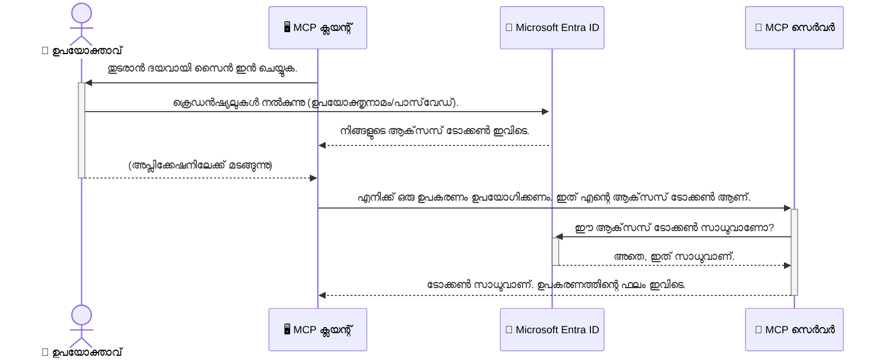

<!--
CO_OP_TRANSLATOR_METADATA:
{
  "original_hash": "6e562d7e5a77c8982da4aa8f762ad1d8",
  "translation_date": "2025-12-11T15:57:28+00:00",
  "source_file": "05-AdvancedTopics/mcp-security-entra/README.md",
  "language_code": "ml"
}
-->
# AI പ്രവൃത്തികൾ സുരക്ഷിതമാക്കൽ: മോഡൽ കോൺടെക്സ്റ്റ് പ്രോട്ടോക്കോൾ സർവറുകൾക്കായി Entra ID പ്രാമാണീകരണം

## പരിചയം
നിങ്ങളുടെ മോഡൽ കോൺടെക്സ്റ്റ് പ്രോട്ടോക്കോൾ (MCP) സർവറെ സുരക്ഷിതമാക്കുന്നത് നിങ്ങളുടെ വീട്ടിലെ മുൻവാതിൽ താക്കോൽ വെക്കുന്നതുപോലെ പ്രധാനമാണ്. നിങ്ങളുടെ MCP സർവർ തുറന്നിരിക്കുകയാണെങ്കിൽ, അനധികൃത പ്രവേശനത്തിന് നിങ്ങളുടെ ഉപകരണങ്ങളും ഡാറ്റയും വെളിപ്പെടുത്തപ്പെടും, ഇത് സുരക്ഷാ ലംഘനങ്ങൾക്ക് കാരണമാകാം. Microsoft Entra ID ഒരു ശക്തമായ ക്ലൗഡ് അടിസ്ഥാനമാക്കിയ ഐഡന്റിറ്റി ആൻഡ് ആക്‌സസ് മാനേജ്മെന്റ് പരിഹാരമാണ്, ഇത് അനുമതിയുള്ള ഉപയോക്താക്കളും ആപ്ലിക്കേഷനുകളും മാത്രമേ നിങ്ങളുടെ MCP സർവറുമായി ഇടപഴകാൻ കഴിയൂ എന്ന് ഉറപ്പാക്കാൻ സഹായിക്കുന്നു. ഈ വിഭാഗത്തിൽ, Entra ID പ്രാമാണീകരണം ഉപയോഗിച്ച് നിങ്ങളുടെ AI പ്രവൃത്തികൾ എങ്ങനെ സംരക്ഷിക്കാമെന്ന് നിങ്ങൾ പഠിക്കും.

## പഠന ലക്ഷ്യങ്ങൾ
ഈ വിഭാഗം അവസാനിക്കുമ്പോൾ, നിങ്ങൾക്ക് കഴിയും:

- MCP സർവറുകൾ സുരക്ഷിതമാക്കുന്നതിന്റെ പ്രാധാന്യം മനസിലാക്കുക.
- Microsoft Entra IDയും OAuth 2.0 പ്രാമാണീകരണവും അടിസ്ഥാനപരമായി വിശദീകരിക്കുക.
- പൊതു ക്ലയന്റുകളും രഹസ്യ ക്ലയന്റുകളും തമ്മിലുള്ള വ്യത്യാസം തിരിച്ചറിയുക.
- പ്രാദേശിക (പൊതു ക്ലയന്റ്)യും ദൂരസ്ഥ (രഹസ്യ ക്ലയന്റ്) MCP സർവർ സാഹചര്യങ്ങളിലും Entra ID പ്രാമാണീകരണം നടപ്പിലാക്കുക.
- AI പ്രവൃത്തികൾ വികസിപ്പിക്കുമ്പോൾ സുരക്ഷാ മികച്ച പ്രാക്ടീസുകൾ പ്രയോഗിക്കുക.

## സുരക്ഷയും MCP

നിങ്ങളുടെ വീട്ടിലെ മുൻവാതിൽ താക്കോൽ വെക്കാതെ വിടാറില്ലാത്തതുപോലെ, നിങ്ങളുടെ MCP സർവർ ആരും പ്രവേശിക്കാതെ തുറന്നിരിക്കരുത്. നിങ്ങളുടെ AI പ്രവൃത്തികൾ സുരക്ഷിതമാക്കുന്നത് ശക്തമായ, വിശ്വസനീയമായ, സുരക്ഷിതമായ ആപ്ലിക്കേഷനുകൾ നിർമ്മിക്കാൻ അനിവാര്യമാണ്. ഈ അധ്യായം Microsoft Entra ID ഉപയോഗിച്ച് നിങ്ങളുടെ MCP സർവറുകൾ എങ്ങനെ സുരക്ഷിതമാക്കാമെന്ന് പരിചയപ്പെടുത്തും, അനുമതിയുള്ള ഉപയോക്താക്കളും ആപ്ലിക്കേഷനുകളും മാത്രമേ നിങ്ങളുടെ ഉപകരണങ്ങളുമായി ഡാറ്റയുമായി ഇടപഴകാൻ കഴിയൂ എന്ന് ഉറപ്പാക്കും.

## MCP സർവറുകൾക്കുള്ള സുരക്ഷയുടെ പ്രാധാന്യം

നിങ്ങളുടെ MCP സർവറിൽ ഇമെയിൽ അയയ്ക്കാനോ ഉപഭോക്തൃ ഡാറ്റാബേസ് ആക്‌സസ് ചെയ്യാനോ കഴിയുന്ന ഒരു ഉപകരണം ഉണ്ടെന്ന് കരുതുക. സുരക്ഷിതമല്ലാത്ത സർവർ ആരും ആ ഉപകരണം ഉപയോഗിക്കാമെന്നു അർത്ഥം, അനധികൃത ഡാറ്റ ആക്‌സസ്, സ്‌പാം, അല്ലെങ്കിൽ മറ്റ് ദുഷ്പ്രവൃത്തികൾക്ക് വഴിവെക്കുന്നു.

പ്രാമാണീകരണം നടപ്പിലാക്കുന്നതിലൂടെ, നിങ്ങളുടെ സർവറിലേക്ക് വരുന്ന ഓരോ അഭ്യർത്ഥനയും പരിശോധിക്കപ്പെടും, അഭ്യർത്ഥന ചെയ്യുന്ന ഉപയോക്താവിന്റെയോ ആപ്ലിക്കേഷന്റെയോ തിരിച്ചറിയൽ സ്ഥിരീകരിക്കും. ഇത് നിങ്ങളുടെ AI പ്രവൃത്തികൾ സുരക്ഷിതമാക്കാനുള്ള ആദ്യവും ഏറ്റവും പ്രധാനപ്പെട്ട ഘട്ടവുമാണ്.

## Microsoft Entra ID പരിചയം

[**Microsoft Entra ID**](https://adoption.microsoft.com/microsoft-security/entra/) ഒരു ക്ലൗഡ് അടിസ്ഥാനമാക്കിയ ഐഡന്റിറ്റി ആൻഡ് ആക്‌സസ് മാനേജ്മെന്റ് സേവനമാണ്. ഇത് നിങ്ങളുടെ ആപ്ലിക്കേഷനുകൾക്കുള്ള സർവത്ര സുരക്ഷാ ഗാർഡായി കരുതാം. ഉപയോക്തൃ തിരിച്ചറിയലുകൾ (പ്രാമാണീകരണം) പരിശോധിക്കുന്നതും അവർക്ക് എന്ത് ചെയ്യാൻ അനുവാദമുണ്ടെന്ന് (അധികാരം) നിർണ്ണയിക്കുന്നതും ഇതാണ് കൈകാര്യം ചെയ്യുന്നത്.

Entra ID ഉപയോഗിച്ച്, നിങ്ങൾക്ക് കഴിയും:

- ഉപയോക്താക്കൾക്ക് സുരക്ഷിതമായ സൈൻ-ഇൻ സജ്ജമാക്കുക.
- APIകളും സേവനങ്ങളും സംരക്ഷിക്കുക.
- ആക്‌സസ് നയങ്ങൾ കേന്ദ്രകേന്ദ്രമായി നിയന്ത്രിക്കുക.

MCP സർവറുകൾക്കായി, Entra ID നിങ്ങളുടെ സർവറിന്റെ ശേഷികൾ ആക്‌സസ് ചെയ്യാൻ ആരെ അനുവദിക്കണം എന്ന് നിയന്ത്രിക്കാൻ ശക്തവും വിശ്വസനീയവുമായ പരിഹാരമാണ്.

---

## മാജിക് മനസിലാക്കൽ: Entra ID പ്രാമാണീകരണം എങ്ങനെ പ്രവർത്തിക്കുന്നു

Entra ID **OAuth 2.0** പോലുള്ള തുറന്ന സ്റ്റാൻഡേർഡുകൾ ഉപയോഗിച്ച് പ്രാമാണീകരണം കൈകാര്യം ചെയ്യുന്നു. വിശദാംശങ്ങൾ സങ്കീർണ്ണമായിരിക്കാം, എന്നാൽ അടിസ്ഥാന ആശയം ലളിതമാണ്, ഒരു ഉപമ ഉപയോഗിച്ച് മനസിലാക്കാം.

### OAuth 2.0 ലളിതമായ പരിചയം: വാലറ്റ് കീ

OAuth 2.0 നിങ്ങളുടെ കാറിനുള്ള വാലറ്റ് സർവീസായി കരുതുക. നിങ്ങൾ ഒരു റെസ്റ്റോറന്റിൽ എത്തുമ്പോൾ, വാലറ്റിന് നിങ്ങളുടെ മാസ്റ്റർ കീ നൽകാറില്ല. പകരം, നിങ്ങൾക്ക് **വാലറ്റ് കീ** നൽകുന്നു, അതിന് പരിമിതമായ അനുമതികൾ ഉണ്ട്—കാർ സ്റ്റാർട്ട് ചെയ്യാനും വാതിലുകൾ താക്കോൽവെക്കാനും കഴിയും, പക്ഷേ ട്രങ്ക് അല്ലെങ്കിൽ ഗ്ലോവ് കമ്പാർട്ട്മെന്റ് തുറക്കാൻ കഴിയില്ല.

ഈ ഉപമയിൽ:

- **നിങ്ങൾ** ആണ് **ഉപയോക്താവ്**.
- **നിങ്ങളുടെ കാർ** ആണ് **MCP സർവർ** അതിന്റെ വിലപ്പെട്ട ഉപകരണങ്ങളോടും ഡാറ്റയോടും കൂടെ.
- **വാലറ്റ്** ആണ് **Microsoft Entra ID**.
- **പാർക്കിംഗ് അറ്റൻഡന്റ്** ആണ് **MCP ക്ലയന്റ്** (സർവർ ആക്‌സസ് ചെയ്യാൻ ശ്രമിക്കുന്ന ആപ്ലിക്കേഷൻ).
- **വാലറ്റ് കീ** ആണ് **ആക്‌സസ് ടോക്കൺ**.

ആക്‌സസ് ടോക്കൺ Entra ID-യിൽ സൈൻ ഇൻ ചെയ്ത ശേഷം MCP ക്ലയന്റ് സ്വീകരിക്കുന്ന സുരക്ഷിതമായ ടെക്സ്റ്റ് സ്ട്രിംഗ് ആണ്. ക്ലയന്റ് ഈ ടോക്കൺ MCP സർവറിന് ഓരോ അഭ്യർത്ഥനയോടും സമർപ്പിക്കുന്നു. സർവർ ടോക്കൺ പരിശോധിച്ച് അഭ്യർത്ഥന നിയമാനുസൃതമാണോ, ക്ലയന്റിന് ആവശ്യമായ അനുമതികൾ ഉണ്ടോ എന്ന് ഉറപ്പാക്കുന്നു, നിങ്ങളുടെ യഥാർത്ഥ ക്രെഡൻഷ്യലുകൾ (പാസ്വേഡ് പോലുള്ള) കൈകാര്യം ചെയ്യാതെ.

### പ്രാമാണീകരണ പ്രവാഹം

പ്രവൃത്തി എങ്ങനെ നടക്കുന്നു:


### Microsoft Authentication Library (MSAL) പരിചയം

കോഡിലേക്ക് കടക്കുന്നതിന് മുമ്പ്, ഉദാഹരണങ്ങളിൽ കാണുന്ന ഒരു പ്രധാന ഘടകം പരിചയപ്പെടുത്താം: **Microsoft Authentication Library (MSAL)**.

MSAL മൈക്രോസോഫ്റ്റ് വികസിപ്പിച്ച ഒരു ലൈബ്രറിയാണ്, ഇത് ഡെവലപ്പർമാർക്ക് പ്രാമാണീകരണം കൈകാര്യം ചെയ്യുന്നത് വളരെ എളുപ്പമാക്കുന്നു. സുരക്ഷാ ടോക്കണുകൾ കൈകാര്യം ചെയ്യുക, സൈൻ-ഇൻ മാനേജ് ചെയ്യുക, സെഷനുകൾ പുതുക്കുക തുടങ്ങിയ സങ്കീർണ്ണ കോഡ് എഴുതേണ്ടതില്ല, MSAL ഈ ഭാരങ്ങൾ ഏറ്റെടുക്കുന്നു.

MSAL ഉപയോഗിക്കുന്നത് ശുപാർശ ചെയ്യപ്പെടുന്നത്:

- **സുരക്ഷിതമാണ്:** വ്യവസായ നിലവാരത്തിലുള്ള പ്രോട്ടോകോളുകളും സുരക്ഷാ മികച്ച പ്രാക്ടീസുകളും നടപ്പിലാക്കുന്നു, നിങ്ങളുടെ കോഡിലെ ദുർബലതകൾ കുറയ്ക്കുന്നു.
- **വികസനം ലളിതമാക്കുന്നു:** OAuth 2.0, OpenID Connect പ്രോട്ടോകോളുകളുടെ സങ്കീർണ്ണത മറച്ചുവെച്ച്, കുറച്ച് കോഡ് വരികളിൽ ശക്തമായ പ്രാമാണീകരണം ആപ്ലിക്കേഷനിൽ ചേർക്കാൻ സഹായിക്കുന്നു.
- **പരിപാലനത്തിലുള്ളതാണ്:** മൈക്രോസോഫ്റ്റ് MSAL-നെ സജീവമായി പരിപാലിക്കുകയും പുതിയ സുരക്ഷാ ഭീഷണികൾക്കും പ്ലാറ്റ്ഫോം മാറ്റങ്ങൾക്കും അനുസരിച്ച് അപ്ഡേറ്റ് ചെയ്യുകയും ചെയ്യുന്നു.

MSAL .NET, JavaScript/TypeScript, Python, Java, Go, iOS, Android പോലുള്ള വിവിധ ഭാഷകളും ആപ്ലിക്കേഷൻ ഫ്രെയിംവർകുകളും പിന്തുണയ്ക്കുന്നു. അതായത്, നിങ്ങളുടെ സാങ്കേതിക സ്റ്റാക്കിലെ മുഴുവൻ ഭാഗങ്ങളിലും ഒരേ സ്ഥിരമായ പ്രാമാണീകരണ മാതൃകകൾ ഉപയോഗിക്കാം.

MSAL-നെക്കുറിച്ച് കൂടുതൽ അറിയാൻ, ഔദ്യോഗിക [MSAL അവലോകന ഡോക്യുമെന്റേഷൻ](https://learn.microsoft.com/entra/identity-platform/msal-overview) കാണുക.

---

## Entra ID ഉപയോഗിച്ച് നിങ്ങളുടെ MCP സർവർ സുരക്ഷിതമാക്കൽ: ഘട്ടം ഘട്ടമായി മാർഗ്ഗനിർദ്ദേശം

ഇപ്പോൾ, Entra ID ഉപയോഗിച്ച് പ്രാദേശിക MCP സർവർ (stdio വഴി ആശയവിനിമയം നടത്തുന്ന) എങ്ങനെ സുരക്ഷിതമാക്കാമെന്ന് നോക്കാം. ഈ ഉദാഹരണം **പൊതു ക്ലയന്റ്** ഉപയോഗിക്കുന്നു, ഇത് ഉപയോക്താവിന്റെ യന്ത്രത്തിൽ പ്രവർത്തിക്കുന്ന ആപ്ലിക്കേഷനുകൾക്കായി അനുയോജ്യമാണ്, ഉദാഹരണത്തിന് ഡെസ്ക്ടോപ്പ് ആപ്പ് അല്ലെങ്കിൽ പ്രാദേശിക ഡെവലപ്പ്മെന്റ് സർവർ.

### സാഹചര്യമൊന്ന്: പ്രാദേശിക MCP സർവർ സുരക്ഷിതമാക്കൽ (പൊതു ക്ലയന്റ് ഉപയോഗിച്ച്)

ഈ സാഹചര്യത്തിൽ, പ്രാദേശികമായി പ്രവർത്തിക്കുന്ന MCP സർവർ stdio വഴി ആശയവിനിമയം നടത്തുന്നു, ഉപയോക്താവിനെ പ്രാമാണീകരിക്കാൻ Entra ID ഉപയോഗിക്കുന്നു, അതിനുശേഷം ഉപകരണങ്ങൾ ആക്‌സസ് ചെയ്യാൻ അനുവദിക്കുന്നു. സർവറിന് ഒരു ഉപകരണം മാത്രമേ ഉണ്ടാകൂ, അത് Microsoft Graph API-യിൽ നിന്ന് ഉപയോക്താവിന്റെ പ്രൊഫൈൽ വിവരങ്ങൾ എടുക്കുന്നു.

#### 1. Entra ID-യിൽ ആപ്ലിക്കേഷൻ സജ്ജമാക്കൽ

ഏതെങ്കിലും കോഡ് എഴുതുന്നതിന് മുമ്പ്, നിങ്ങളുടെ ആപ്ലിക്കേഷൻ Microsoft Entra ID-യിൽ രജിസ്റ്റർ ചെയ്യണം. ഇത് Entra ID-യ്ക്ക് നിങ്ങളുടെ ആപ്ലിക്കേഷൻ അറിയിക്കുകയും പ്രാമാണീകരണ സേവനം ഉപയോഗിക്കാൻ അനുമതി നൽകുകയും ചെയ്യുന്നു.

1. **[Microsoft Entra പോർട്ടൽ](https://entra.microsoft.com/)** സന്ദർശിക്കുക.
2. **App registrations**-ലേക്ക് പോകുക, **New registration** ക്ലിക്ക് ചെയ്യുക.
3. നിങ്ങളുടെ ആപ്ലിക്കേഷനു ഒരു പേര് നൽകുക (ഉദാ: "My Local MCP Server").
4. **Supported account types**-ൽ **Accounts in this organizational directory only** തിരഞ്ഞെടുക്കുക.
5. ഈ ഉദാഹരണത്തിന് **Redirect URI** ഒഴിവാക്കാം.
6. **Register** ക്ലിക്ക് ചെയ്യുക.

രജിസ്റ്റർ ചെയ്ത ശേഷം, **Application (client) ID**യും **Directory (tenant) ID**യും ശ്രദ്ധിക്കുക. കോഡിൽ ഇവ ആവശ്യമാണ്.

#### 2. കോഡ്: ഒരു അവലോകനം

പ്രാമാണീകരണം കൈകാര്യം ചെയ്യുന്ന പ്രധാന ഭാഗങ്ങൾ നോക്കാം. ഈ ഉദാഹരണത്തിന്റെ പൂർണ്ണ കോഡ് [Entra ID - Local - WAM](https://github.com/Azure-Samples/mcp-auth-servers/tree/main/src/entra-id-local-wam) ഫോൾഡറിൽ [mcp-auth-servers GitHub റിപോസിറ്ററിയിൽ](https://github.com/Azure-Samples/mcp-auth-servers) ലഭ്യമാണ്.

**`AuthenticationService.cs`**

ഈ ക്ലാസ് Entra ID-യുമായി ഇടപഴകൽ കൈകാര്യം ചെയ്യുന്നു.

- **`CreateAsync`**: MSAL (Microsoft Authentication Library) യിൽ നിന്നുള്ള `PublicClientApplication` ആരംഭിക്കുന്നു. നിങ്ങളുടെ ആപ്ലിക്കേഷന്റെ `clientId`യും `tenantId`യും ഉപയോഗിച്ച് കോൺഫിഗർ ചെയ്യുന്നു.
- **`WithBroker`**: ബ്രോക്കർ (Windows Web Account Manager പോലുള്ള) ഉപയോഗിക്കാൻ അനുവദിക്കുന്നു, ഇത് കൂടുതൽ സുരക്ഷിതവും സുതാര്യവുമായ സിംഗിൾ സൈൻ-ഓൺ അനുഭവം നൽകുന്നു.
- **`AcquireTokenAsync`**: പ്രധാന മെത്തഡ്. ആദ്യം ടോക്കൺ സൈലന്റ് ആയി (ഉപയോക്താവ് മുമ്പ് സൈൻ ഇൻ ചെയ്തിട്ടുണ്ടെങ്കിൽ വീണ്ടും സൈൻ ഇൻ ചെയ്യേണ്ടതില്ല) നേടാൻ ശ്രമിക്കുന്നു. സാധ്യമല്ലെങ്കിൽ, ഉപയോക്താവിനെ ഇന്ററാക്ടീവ് ആയി സൈൻ ഇൻ ചെയ്യാൻ പ്രേരിപ്പിക്കുന്നു.

```csharp
// Simplified for clarity
public static async Task<AuthenticationService> CreateAsync(ILogger<AuthenticationService> logger)
{
    var msalClient = PublicClientApplicationBuilder
        .Create(_clientId) // Your Application (client) ID
        .WithAuthority(AadAuthorityAudience.AzureAdMyOrg)
        .WithTenantId(_tenantId) // Your Directory (tenant) ID
        .WithBroker(new BrokerOptions(BrokerOptions.OperatingSystems.Windows))
        .Build();

    // ... cache registration ...

    return new AuthenticationService(logger, msalClient);
}

public async Task<string> AcquireTokenAsync()
{
    try
    {
        // Try silent authentication first
        var accounts = await _msalClient.GetAccountsAsync();
        var account = accounts.FirstOrDefault();

        AuthenticationResult? result = null;

        if (account != null)
        {
            result = await _msalClient.AcquireTokenSilent(_scopes, account).ExecuteAsync();
        }
        else
        {
            // If no account, or silent fails, go interactive
            result = await _msalClient.AcquireTokenInteractive(_scopes).ExecuteAsync();
        }

        return result.AccessToken;
    }
    catch (Exception ex)
    {
        _logger.LogError(ex, "An error occurred while acquiring the token.");
        throw; // Optionally rethrow the exception for higher-level handling
    }
}
```

**`Program.cs`**

ഇവിടെ MCP സർവർ സജ്ജമാക്കുകയും പ്രാമാണീകരണ സേവനം സംയോജിപ്പിക്കുകയും ചെയ്യുന്നു.

- **`AddSingleton<AuthenticationService>`**: `AuthenticationService` ഡിപ്പൻഡൻസി ഇൻജക്ഷൻ കണ്ടെയ്‌നറിൽ രജിസ്റ്റർ ചെയ്യുന്നു, അതിനാൽ ആപ്ലിക്കേഷന്റെ മറ്റ് ഭാഗങ്ങൾ (ഉദാ: ഉപകരണം) ഇത് ഉപയോഗിക്കാം.
- **`GetUserDetailsFromGraph` ഉപകരണം**: ഈ ഉപകരണം `AuthenticationService`-ന്റെ ഒരു ഇൻസ്റ്റൻസ് ആവശ്യപ്പെടുന്നു. ഒന്നും ചെയ്യുന്നതിന് മുമ്പ്, `authService.AcquireTokenAsync()` വിളിച്ച് സാധുവായ ആക്‌സസ് ടോക്കൺ നേടുന്നു. പ്രാമാണീകരണം വിജയിച്ചാൽ, ടോക്കൺ ഉപയോഗിച്ച് Microsoft Graph API-യെ വിളിച്ച് ഉപയോക്താവിന്റെ വിവരങ്ങൾ എടുക്കുന്നു.

```csharp
// Simplified for clarity
[McpServerTool(Name = "GetUserDetailsFromGraph")]
public static async Task<string> GetUserDetailsFromGraph(
    AuthenticationService authService)
{
    try
    {
        // This will trigger the authentication flow
        var accessToken = await authService.AcquireTokenAsync();

        // Use the token to create a GraphServiceClient
        var graphClient = new GraphServiceClient(
            new BaseBearerTokenAuthenticationProvider(new TokenProvider(authService)));

        var user = await graphClient.Me.GetAsync();

        return System.Text.Json.JsonSerializer.Serialize(user);
    }
    catch (Exception ex)
    {
        return $"Error: {ex.Message}";
    }
}
```

#### 3. എല്ലാം എങ്ങനെ ചേർന്ന് പ്രവർത്തിക്കുന്നു

1. MCP ക്ലയന്റ് `GetUserDetailsFromGraph` ഉപകരണം ഉപയോഗിക്കാൻ ശ്രമിക്കുമ്പോൾ, ഉപകരണം ആദ്യം `AcquireTokenAsync` വിളിക്കുന്നു.
2. `AcquireTokenAsync` MSAL ലൈബ്രറിയെ സാധുവായ ടോക്കൺ ഉണ്ടോയെന്ന് പരിശോധിക്കാൻ പ്രേരിപ്പിക്കുന്നു.
3. ടോക്കൺ കണ്ടെത്താനാകാതെപോയാൽ, MSAL ബ്രോക്കറിലൂടെ ഉപയോക്താവിനെ Entra ID അക്കൗണ്ടിൽ സൈൻ ഇൻ ചെയ്യാൻ പ്രേരിപ്പിക്കും.
4. ഉപയോക്താവ് സൈൻ ഇൻ ചെയ്തശേഷം, Entra ID ആക്‌സസ് ടോക്കൺ നൽകുന്നു.
5. ഉപകരണം ടോക്കൺ സ്വീകരിച്ച് Microsoft Graph API-യെ സുരക്ഷിതമായി വിളിക്കുന്നു.
6. ഉപയോക്താവിന്റെ വിവരങ്ങൾ MCP ക്ലയന്റിന് തിരിച്ചെത്തുന്നു.

ഈ പ്രക്രിയ ഉറപ്പാക്കുന്നു, പ്രാമാണീകരിച്ച ഉപയോക്താക്കളേ മാത്രം ഉപകരണം ഉപയോഗിക്കാനാകും, നിങ്ങളുടെ പ്രാദേശിക MCP സർവർ ഫലപ്രദമായി സുരക്ഷിതമാക്കുന്നു.

### സാഹചര്യരണ്ട്: ദൂരസ്ഥ MCP സർവർ സുരക്ഷിതമാക്കൽ (രഹസ്യ ക്ലയന്റ് ഉപയോഗിച്ച്)

നിങ്ങളുടെ MCP സർവർ ഒരു ദൂരസ്ഥ യന്ത്രത്തിൽ (ക്ലൗഡ് സർവർ പോലുള്ള) പ്രവർത്തിക്കുമ്പോൾ, HTTP Streaming പോലുള്ള പ്രോട്ടോക്കോൾ വഴി ആശയവിനിമയം നടത്തുമ്പോൾ, സുരക്ഷാ ആവശ്യകതകൾ വ്യത്യസ്തമാണ്. ഈ സാഹചര്യത്തിൽ, **രഹസ്യ ക്ലയന്റ്**യും **Authorization Code Flow**യും ഉപയോഗിക്കണം. ഇത് കൂടുതൽ സുരക്ഷിതമാണ്, കാരണം ആപ്ലിക്കേഷന്റെ രഹസ്യങ്ങൾ ബ്രൗസറിലേക്ക് വെളിപ്പെടുത്തപ്പെടാറില്ല.

ഈ ഉദാഹരണം Express.js ഉപയോഗിച്ച് HTTP അഭ്യർത്ഥനകൾ കൈകാര്യം ചെയ്യുന്ന TypeScript അടിസ്ഥാനമാക്കിയ MCP സർവർ ആണ്.

#### 1. Entra ID-യിൽ ആപ്ലിക്കേഷൻ സജ്ജമാക്കൽ

Entra ID-യിൽ സജ്ജീകരണം പൊതു ക്ലയന്റിനോട് സമാനമാണ്, പക്ഷേ ഒരു പ്രധാന വ്യത്യാസമുണ്ട്: **ക്ലയന്റ് സീക്രട്ട്** സൃഷ്ടിക്കണം.

1. **[Microsoft Entra പോർട്ടൽ](https://entra.microsoft.com/)** സന്ദർശിക്കുക.
2. നിങ്ങളുടെ ആപ്പ് രജിസ്ട്രേഷനിൽ **Certificates & secrets** ടാബിലേക്ക് പോകുക.
3. **New client secret** ക്ലിക്ക് ചെയ്ത് വിവരണം നൽകുക, **Add** ക്ലിക്ക് ചെയ്യുക.
4. **പ്രധാനമാണ്:** സീക്രട്ട് മൂല്യം ഉടൻ കോപ്പി ചെയ്യുക. പിന്നീട് കാണാനാകില്ല.
5. **Redirect URI** കോൺഫിഗർ ചെയ്യണം. **Authentication** ടാബിൽ പോയി, **Add a platform** ക്ലിക്ക് ചെയ്ത് **Web** തിരഞ്ഞെടുക്കുക, നിങ്ങളുടെ ആപ്ലിക്കേഷന്റെ റീഡയറക്ട് URI നൽകുക (ഉദാ: `http://localhost:3001/auth/callback`).

> **⚠️ പ്രധാന സുരക്ഷാ കുറിപ്പ്:** പ്രൊഡക്ഷൻ ആപ്ലിക്കേഷനുകൾക്കായി, Microsoft ക്ലയന്റ് സീക്രറ്റുകൾക്കുപകരം **Managed Identity** അല്ലെങ്കിൽ **Workload Identity Federation** പോലുള്ള **സീക്രട്ട് രഹിത പ്രാമാണീകരണ** രീതികൾ ഉപയോഗിക്കാൻ ശക്തമായി ശുപാർശ ചെയ്യുന്നു. ക്ലയന്റ് സീക്രറ്റുകൾ വെളിപ്പെടുത്തപ്പെടുകയോ തകരാറിലാകുകയോ ചെയ്യാനുള്ള സുരക്ഷാ അപകടങ്ങൾ ഉണ്ട്. മാനേജ്ഡ് ഐഡന്റിറ്റികൾ നിങ്ങളുടെ കോഡിലോ കോൺഫിഗറേഷനിലോ ക്രെഡൻഷ്യലുകൾ സൂക്ഷിക്കേണ്ടതില്ലാത്തതിനാൽ കൂടുതൽ സുരക്ഷിതമാണ്.
>
> മാനേജ്ഡ് ഐഡന്റിറ്റികൾക്കുറിച്ചും അവ എങ്ങനെ നടപ്പിലാക്കാമെന്നും അറിയാൻ [Managed identities for Azure resources overview](https://learn.microsoft.com/entra/identity/managed-identities-azure-resources/overview) കാണുക.

#### 2. കോഡ്: ഒരു അവലോകനം

ഈ ഉദാഹരണം സെഷൻ അടിസ്ഥാനമാക്കിയുള്ള സമീപനം ഉപയോഗിക്കുന്നു. ഉപയോക്താവ് പ്രാമാണീകരിക്കുമ്പോൾ, സർവർ ആക്‌സസ് ടോക്കണും റിഫ്രഷ് ടോക്കണും സെഷനിൽ സൂക്ഷിക്കുന്നു, ഉപയോക്താവിന് സെഷൻ ടോക്കൺ നൽകുന്നു. പിന്നീട് ഈ സെഷൻ ടോക്കൺ ഉപയോഗിച്ച് അഭ്യർത്ഥനകൾ നടത്തുന്നു. പൂർണ്ണ കോഡ് [Entra ID - Confidential client](https://github.com/Azure-Samples/mcp-auth-servers/tree/main/src/entra-id-cca-session) ഫോൾഡറിൽ [mcp-auth-servers GitHub റിപോസിറ്ററിയിൽ](https://github.com/Azure-Samples/mcp-auth-servers) ലഭ്യമാണ്.

**`Server.ts`**

Express സർവർയും MCP ട്രാൻസ്പോർട്ട് ലെയറും സജ്ജമാക്കുന്നു.

- **`requireBearerAuth`**: `/sse`യും `/message`യും എൻഡ്‌പോയിന്റുകൾ സംരക്ഷിക്കുന്ന മിഡിൽവെയർ. അഭ്യർത്ഥനയുടെ `Authorization` ഹെഡറിൽ സാധുവ
2. ഉപയോക്താവ് അവരുടെ Entra ID അക്കൗണ്ടിൽ സൈൻ ഇൻ ചെയ്യുന്നു.  
3. Entra ID ഉപയോക്താവിനെ `/auth/callback` എൻഡ്‌പോയിന്റിലേക്ക് ഒരു.authorization കോഡിനൊപ്പം തിരിച്ചുവിടുന്നു.  
4. സെർവർ ആ.authorization കോഡ് access token-ഉം refresh token-ഉം ആയി മാറ്റി, അവ സംഭരിച്ചു, ക്ലയന്റിലേക്ക് അയക്കുന്ന ഒരു സെഷൻ ടോക്കൺ സൃഷ്ടിക്കുന്നു.  
5. ക്ലയന്റ് ഇനി ഈ സെഷൻ ടോക്കൺ MCP സെർവറിലേക്ക് എല്ലാ ഭാവി അഭ്യർത്ഥനകളിലും `Authorization` ഹെഡറിൽ ഉപയോഗിക്കാം.  
6. `getUserDetails` ടൂൾ വിളിക്കുമ്പോൾ, സെഷൻ ടോക്കൺ ഉപയോഗിച്ച് Entra ID access token കണ്ടെത്തുകയും അതുപയോഗിച്ച് Microsoft Graph API വിളിക്കുകയും ചെയ്യുന്നു.  

ഈ പ്രവാഹം പബ്ലിക് ക്ലയന്റ് പ്രവാഹത്തേക്കാൾ കൂടുതൽ സങ്കീർണ്ണമാണ്, എന്നാൽ ഇന്റർനെറ്റ്-മുഖം എൻഡ്‌പോയിന്റുകൾക്കായി ഇത് ആവശ്യമാണ്. റിമോട്ട് MCP സെർവർകൾ പബ്ലിക് ഇന്റർനെറ്റിലൂടെ ആക്സസ്ബിള്‍ ആയതിനാൽ, അനധികൃത ആക്സസ്‌ക്കും സാധ്യതയുള്ള ആക്രമണങ്ങൾക്കും എതിരായി ശക്തമായ സുരക്ഷാ നടപടികൾ ആവശ്യമാണ്.  


## സുരക്ഷാ മികച്ച പ്രാക്ടീസുകൾ

- **എപ്പോഴും HTTPS ഉപയോഗിക്കുക**: ടോക്കണുകൾ പിടിച്ചെടുക്കപ്പെടുന്നത് തടയാൻ ക്ലയന്റും സെർവറും തമ്മിലുള്ള സംവാദം എൻക്രിപ്റ്റ് ചെയ്യുക.  
- **റോൾ-ബേസ്ഡ് ആക്സസ് കൺട്രോൾ (RBAC) നടപ്പിലാക്കുക**: ഉപയോക്താവ് ഓതന്റിക്കേറ്റഡ് ആണോ എന്ന് മാത്രം പരിശോധിക്കരുത്; അവർക്ക് എന്ത് അനുമതിയുണ്ട് എന്നും പരിശോധിക്കുക. Entra ID-യിൽ റോളുകൾ നിർവചിച്ച് MCP സെർവറിൽ അവ പരിശോധിക്കാം.  
- **മോണിറ്റർ ചെയ്യുകയും ഓഡിറ്റ് ചെയ്യുകയും ചെയ്യുക**: എല്ലാ ഓതന്റിക്കേഷൻ ഇവന്റുകളും ലോഗ് ചെയ്ത് സംശയാസ്പദ പ്രവർത്തനങ്ങൾ കണ്ടെത്തുകയും പ്രതികരിക്കുകയും ചെയ്യുക.  
- **റേറ്റ് ലിമിറ്റിംഗ്, ത്രോട്ട്ലിംഗ് കൈകാര്യം ചെയ്യുക**: Microsoft Graph ഉൾപ്പെടെയുള്ള API-കൾ ദുരുപയോഗം തടയാൻ റേറ്റ് ലിമിറ്റിംഗ് നടപ്പിലാക്കുന്നു. MCP സെർവറിൽ എക്സ്പൊണൻഷ്യൽ ബാക്ക്ഓഫ്, റിട്രൈ ലജിക് നടപ്പിലാക്കി HTTP 429 (Too Many Requests) പ്രതികരണങ്ങൾ സുഖപ്രദമായി കൈകാര്യം ചെയ്യുക. API കോൾസ് കുറയ്ക്കാൻ പതിവായി ആക്സസ് ചെയ്യുന്ന ഡാറ്റ കാഷ് ചെയ്യുന്നതും പരിഗണിക്കുക.  
- **ടോക്കൺ സുരക്ഷിത സംഭരണം**: Access token-കളും refresh token-കളും സുരക്ഷിതമായി സംഭരിക്കുക. ലോക്കൽ ആപ്ലിക്കേഷനുകൾക്ക് സിസ്റ്റത്തിന്റെ സുരക്ഷിത സംഭരണ സംവിധാനങ്ങൾ ഉപയോഗിക്കുക. സെർവർ ആപ്ലിക്കേഷനുകൾക്ക് എൻക്രിപ്റ്റഡ് സംഭരണം അല്ലെങ്കിൽ Azure Key Vault പോലുള്ള സുരക്ഷിത കീ മാനേജ്മെന്റ് സേവനങ്ങൾ പരിഗണിക്കുക.  
- **ടോക്കൺ കാലഹരണ കൈകാര്യം ചെയ്യൽ**: Access token-കൾക്ക് പരിമിതമായ കാലാവധി ഉണ്ട്. റിഫ്രഷ് ടോക്കൺ ഉപയോഗിച്ച് സ്വയം ടോക്കൺ പുതുക്കൽ നടപ്പിലാക്കി ഉപയോക്തൃ അനുഭവം തുടർച്ചയായിരിക്കണം, പുനഃഓതന്റിക്കേഷൻ ആവശ്യമില്ലാതെ.  
- **Azure API Management ഉപയോഗിക്കാൻ പരിഗണിക്കുക**: MCP സെർവറിൽ നേരിട്ട് സുരക്ഷ നടപ്പിലാക്കുന്നത് നന്നായി നിയന്ത്രണം നൽകുന്നുവെങ്കിലും, Azure API Management പോലുള്ള API ഗേറ്റ്വേകൾ ഓതന്റിക്കേഷൻ, ഓതറൈസേഷൻ, റേറ്റ് ലിമിറ്റിംഗ്, മോണിറ്ററിംഗ് എന്നിവ സ്വയം കൈകാര്യം ചെയ്യുന്നു. ഇവ ക്ലയന്റുകളും MCP സെർവറുകളും തമ്മിലുള്ള കേന്ദ്രികൃത സുരക്ഷാ ലെയർ നൽകുന്നു. MCP-യുമായി API ഗേറ്റ്വേകൾ ഉപയോഗിക്കുന്നതിന്റെ കൂടുതൽ വിവരങ്ങൾക്ക് [Azure API Management Your Auth Gateway For MCP Servers](https://techcommunity.microsoft.com/blog/integrationsonazureblog/azure-api-management-your-auth-gateway-for-mcp-servers/4402690) കാണുക.  


## പ്രധാനപ്പെട്ട കാര്യങ്ങൾ

- നിങ്ങളുടെ MCP സെർവർ സുരക്ഷിതമാക്കുന്നത് നിങ്ങളുടെ ഡാറ്റയും ടൂളുകളും സംരക്ഷിക്കാൻ അത്യന്താപേക്ഷിതമാണ്.  
- Microsoft Entra ID ഓതന്റിക്കേഷൻ, ഓതറൈസേഷൻ എന്നിവയ്ക്ക് ശക്തവും സ്കെയിലബിളുമായ പരിഹാരമാണ്.  
- ലോക്കൽ ആപ്ലിക്കേഷനുകൾക്കായി **പബ്ലിക് ക്ലയന്റ്** ഉപയോഗിക്കുക, റിമോട്ട് സെർവറുകൾക്കായി **കൺഫിഡൻഷ്യൽ ക്ലയന്റ്** ഉപയോഗിക്കുക.  
- വെബ് ആപ്ലിക്കേഷനുകൾക്കായി ഏറ്റവും സുരക്ഷിതമായ ഓപ്ഷൻ **Authorization Code Flow** ആണ്.  


## അഭ്യാസം

1. നിങ്ങൾ നിർമ്മിക്കാൻ പോകുന്ന MCP സെർവർ ലോക്കലായിരിക്കും, റിമോട്ടായിരിക്കും?  
2. നിങ്ങളുടെ ഉത്തരത്തിന്റെ അടിസ്ഥാനത്തിൽ, പബ്ലിക് ക്ലയന്റ് ഉപയോഗിക്കുമോ, കൺഫിഡൻഷ്യൽ ക്ലയന്റ്?  
3. Microsoft Graph-നോട് പ്രവർത്തനങ്ങൾ നടത്താൻ നിങ്ങളുടെ MCP സെർവർ ഏത് അനുമതികൾ അഭ്യർത്ഥിക്കും?  


## പ്രായോഗിക അഭ്യാസങ്ങൾ

### അഭ്യാസം 1: Entra ID-യിൽ ഒരു ആപ്ലിക്കേഷൻ രജിസ്റ്റർ ചെയ്യുക  
Microsoft Entra പോർട്ടലിലേക്ക് പോകുക.  
നിങ്ങളുടെ MCP സെർവറിനായി പുതിയ ഒരു ആപ്ലിക്കേഷൻ രജിസ്റ്റർ ചെയ്യുക.  
ആപ്ലിക്കേഷൻ (ക്ലയന്റ്) IDയും ഡയറക്ടറി (ടെനന്റ്) IDയും രേഖപ്പെടുത്തുക.  

### അഭ്യാസം 2: ഒരു ലോക്കൽ MCP സെർവർ സുരക്ഷിതമാക്കുക (പബ്ലിക് ക്ലയന്റ്)  
- ഉപയോക്തൃ ഓതന്റിക്കേഷനായി MSAL (Microsoft Authentication Library) സംയോജിപ്പിക്കാൻ കോഡ് ഉദാഹരണം പിന്തുടരുക.  
- Microsoft Graph-ൽ നിന്നുള്ള ഉപയോക്തൃ വിശദാംശങ്ങൾ ലഭിക്കുന്ന MCP ടൂൾ വിളിച്ച് ഓതന്റിക്കേഷൻ പ്രവാഹം പരീക്ഷിക്കുക.  

### അഭ്യാസം 3: ഒരു റിമോട്ട് MCP സെർവർ സുരക്ഷിതമാക്കുക (കൺഫിഡൻഷ്യൽ ക്ലയന്റ്)  
- Entra ID-യിൽ ഒരു കൺഫിഡൻഷ്യൽ ക്ലയന്റ് രജിസ്റ്റർ ചെയ്ത് ക്ലയന്റ് സീക്രട്ട് സൃഷ്ടിക്കുക.  
- Express.js MCP സെർവറിൽ Authorization Code Flow ഉപയോഗിക്കാൻ കോൺഫിഗർ ചെയ്യുക.  
- സംരക്ഷിത എൻഡ്‌പോയിന്റുകൾ പരീക്ഷിച്ച് ടോക്കൺ അടിസ്ഥാനമാക്കിയുള്ള ആക്സസ് സ്ഥിരീകരിക്കുക.  

### അഭ്യാസം 4: സുരക്ഷാ മികച്ച പ്രാക്ടീസുകൾ പ്രയോഗിക്കുക  
- നിങ്ങളുടെ ലോക്കൽ അല്ലെങ്കിൽ റിമോട്ട് സെർവറിനായി HTTPS സജ്ജമാക്കുക.  
- സെർവർ ലജിക്കിൽ റോൾ-ബേസ്ഡ് ആക്സസ് കൺട്രോൾ (RBAC) നടപ്പിലാക്കുക.  
- ടോക്കൺ കാലഹരണ കൈകാര്യം ചെയ്യലും സുരക്ഷിത ടോക്കൺ സംഭരണവും ചേർക്കുക.  


## റിസോഴ്‌സുകൾ

1. **MSAL അവലോകന ഡോക്യുമെന്റേഷൻ**  
   Microsoft Authentication Library (MSAL) പ്ലാറ്റ്ഫോമുകൾക്കിടയിൽ സുരക്ഷിത ടോക്കൺ ലഭ്യമാക്കുന്നത് എങ്ങനെ സാധ്യമാക്കുന്നു എന്ന് പഠിക്കുക:  
   [MSAL Overview on Microsoft Learn](https://learn.microsoft.com/en-gb/entra/msal/overview)  

2. **Azure-Samples/mcp-auth-servers GitHub റിപോസിറ്ററി**  
   ഓതന്റിക്കേഷൻ പ്രവാഹങ്ങൾ കാണിക്കുന്ന MCP സെർവർ റഫറൻസ് ഇംപ്ലിമെന്റേഷനുകൾ:  
   [Azure-Samples/mcp-auth-servers on GitHub](https://github.com/Azure-Samples/mcp-auth-servers)  

3. **Azure റിസോഴ്‌സുകൾക്കുള്ള മാനേജ്ഡ് ഐഡന്റിറ്റീസ് അവലോകനം**  
   സിസ്റ്റം അല്ലെങ്കിൽ ഉപയോക്തൃ നിയോഗിച്ച മാനേജ്ഡ് ഐഡന്റിറ്റികൾ ഉപയോഗിച്ച് സീക്രറ്റുകൾ ഒഴിവാക്കുന്നത് എങ്ങനെ എന്നത് മനസ്സിലാക്കുക:  
   [Managed Identities Overview on Microsoft Learn](https://learn.microsoft.com/en-us/entra/identity/managed-identities-azure-resources/)  

4. **Azure API Management: MCP സെർവറുകൾക്കുള്ള നിങ്ങളുടെ ഓത്ഗേറ്റ്‌വേ**  
   MCP സെർവറുകൾക്കായി APIM ഒരു സുരക്ഷിത OAuth2 ഗേറ്റ്‌വേ ആയി ഉപയോഗിക്കുന്നതിന്റെ വിശദമായ പഠനം:  
   [Azure API Management Your Auth Gateway For MCP Servers](https://techcommunity.microsoft.com/blog/integrationsonazureblog/azure-api-management-your-auth-gateway-for-mcp-servers/4402690)  

5. **Microsoft Graph അനുമതികൾ റഫറൻസ്**  
   Microsoft Graph-നുള്ള ഡെലിഗേറ്റഡ്, ആപ്ലിക്കേഷൻ അനുമതികളുടെ സമഗ്ര പട്ടിക:  
   [Microsoft Graph Permissions Reference](https://learn.microsoft.com/zh-tw/graph/permissions-reference)  


## പഠന ഫലങ്ങൾ  
ഈ വിഭാഗം പൂർത്തിയാക്കിയ ശേഷം, നിങ്ങൾക്ക് കഴിയും:

- MCP സെർവറുകൾക്കും AI വർക്ക്‌ഫ്ലോകൾക്കും ഓതന്റിക്കേഷൻ എന്തുകൊണ്ട് നിർണായകമാണെന്ന് വിശദീകരിക്കാൻ.  
- ലോക്കൽ, റിമോട്ട് MCP സെർവർ സീനാരിയോകൾക്കായി Entra ID ഓതന്റിക്കേഷൻ സജ്ജമാക്കാനും കോൺഫിഗർ ചെയ്യാനും.  
- നിങ്ങളുടെ സെർവറിന്റെ വിന്യാസത്തിന്റെ അടിസ്ഥാനത്തിൽ അനുയോജ്യമായ ക്ലയന്റ് തരം (പബ്ലിക് അല്ലെങ്കിൽ കൺഫിഡൻഷ്യൽ) തിരഞ്ഞെടുക്കാനും.  
- ടോക്കൺ സംഭരണം, റോൾ-ബേസ്ഡ് ഓതറൈസേഷൻ ഉൾപ്പെടെയുള്ള സുരക്ഷിത കോഡിംഗ് പ്രാക്ടീസുകൾ നടപ്പിലാക്കാനും.  
- അനധികൃത ആക്സസിൽ നിന്ന് നിങ്ങളുടെ MCP സെർവർ, ടൂളുകൾ എന്നിവ ആത്മവിശ്വാസത്തോടെ സംരക്ഷിക്കാനും.  


## അടുത്തത്

- [5.13 Model Context Protocol (MCP) Integration with Azure AI Foundry](../mcp-foundry-agent-integration/README.md)

---

<!-- CO-OP TRANSLATOR DISCLAIMER START -->
**അസൂയാ**:  
ഈ രേഖ AI വിവർത്തന സേവനം [Co-op Translator](https://github.com/Azure/co-op-translator) ഉപയോഗിച്ച് വിവർത്തനം ചെയ്തതാണ്. നാം കൃത്യതയ്ക്ക് ശ്രമിച്ചിട്ടുണ്ടെങ്കിലും, സ്വയം പ്രവർത്തിക്കുന്ന വിവർത്തനങ്ങളിൽ പിശകുകൾ അല്ലെങ്കിൽ തെറ്റുകൾ ഉണ്ടാകാമെന്ന് ദയവായി ശ്രദ്ധിക്കുക. അതിന്റെ മാതൃഭാഷയിലുള്ള യഥാർത്ഥ രേഖയാണ് പ്രാമാണികമായ ഉറവിടം എന്ന് പരിഗണിക്കേണ്ടതാണ്. നിർണായകമായ വിവരങ്ങൾക്ക്, പ്രൊഫഷണൽ മനുഷ്യ വിവർത്തനം ശുപാർശ ചെയ്യപ്പെടുന്നു. ഈ വിവർത്തനം ഉപയോഗിക്കുന്നതിൽ നിന്നുണ്ടാകുന്ന ഏതെങ്കിലും തെറ്റിദ്ധാരണകൾക്കോ തെറ്റായ വ്യാഖ്യാനങ്ങൾക്കോ ഞങ്ങൾ ഉത്തരവാദികളല്ല.
<!-- CO-OP TRANSLATOR DISCLAIMER END -->