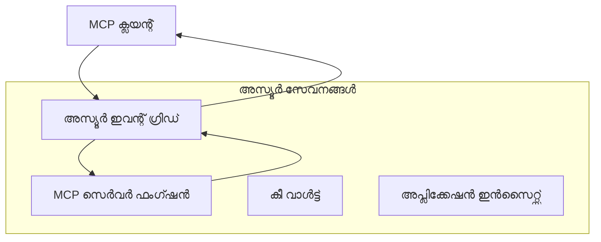
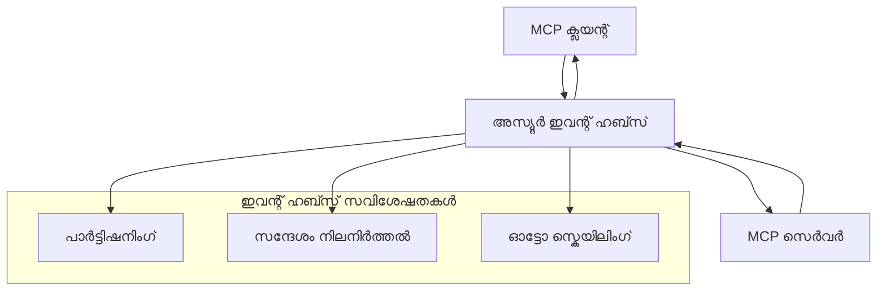

# MCP കസ്റ്റം ട്രാൻസ്പോർട്ടുകൾ - ആധുനിക നടപ്പാക്കൽ ഗൈഡ്

Model Context Protocol (MCP) ട്രാൻസ്പോർട്ട് മെക്കാനിസങ്ങൾക്കായി സൗകര്യം നൽകുന്നു, പ്രത്യേക എന്റർപ്രൈസ് പരിസ്ഥിതികൾക്കായി കസ്റ്റം നടപ്പാക്കലുകൾ അനുവദിക്കുന്നു. ഈ ആധുനിക ഗൈഡ് Azure Event Grid, Azure Event Hubs എന്നിവ ഉപയോഗിച്ച് കസ്റ്റം ട്രാൻസ്പോർട്ട് നടപ്പാക്കലുകൾ പരിശോധിക്കുന്നു, സ്കെയിലബിൾ, ക്ലൗഡ്-നേറ്റീവ് MCP പരിഹാരങ്ങൾ നിർമ്മിക്കുന്നതിനുള്ള പ്രായോഗിക ഉദാഹരണങ്ങളായി.

## പരിചയം

MCPയുടെ സ്റ്റാൻഡേർഡ് ട്രാൻസ്പോർട്ടുകൾ (stdio, HTTP streaming) പല ഉപയോഗങ്ങൾക്കും സേവനം നൽകുമ്പോഴും, എന്റർപ്രൈസ് പരിസ്ഥിതികൾക്ക് മെച്ചപ്പെട്ട സ്കെയിലബിലിറ്റി, വിശ്വാസ്യത, നിലവിലുള്ള ക്ലൗഡ് ഇൻഫ്രാസ്ട്രക്ചറുമായി സംയോജനം എന്നിവയ്ക്കായി പ്രത്യേക ട്രാൻസ്പോർട്ട് മെക്കാനിസങ്ങൾ ആവശ്യമാകും. കസ്റ്റം ട്രാൻസ്പോർട്ടുകൾ MCP-ന് അസിങ്ക്രോണസ് കമ്മ്യൂണിക്കേഷൻ, ഇവന്റ്-ഡ്രിവൻ ആർക്കിടെക്ചറുകൾ, വിതരണ പ്രോസസ്സിംഗ് എന്നിവയ്ക്കായി ക്ലൗഡ്-നേറ്റീവ് മെസേജിംഗ് സേവനങ്ങൾ ഉപയോഗിക്കാൻ അനുവദിക്കുന്നു.

ഈ പാഠം ഏറ്റവും പുതിയ MCP സ്പെസിഫിക്കേഷൻ (2025-11-25), Azure മെസേജിംഗ് സേവനങ്ങൾ, സ്ഥാപിത എന്റർപ്രൈസ് ഇന്റഗ്രേഷൻ പാറ്റേണുകൾ അടിസ്ഥാനമാക്കി ആധുനിക ട്രാൻസ്പോർട്ട് നടപ്പാക്കലുകൾ പരിശോധിക്കുന്നു.

### **MCP ട്രാൻസ്പോർട്ട് ആർക്കിടെക്ചർ**

**MCP സ്പെസിഫിക്കേഷൻ (2025-11-25) പ്രകാരം:**

- **സ്റ്റാൻഡേർഡ് ട്രാൻസ്പോർട്ടുകൾ**: stdio (ശുപാർശ ചെയ്യുന്നു), HTTP streaming (റിമോട്ട് സാഹചര്യങ്ങൾക്ക്)
- **കസ്റ്റം ട്രാൻസ്പോർട്ടുകൾ**: MCP മെസേജ് എക്സ്ചേഞ്ച് പ്രോട്ടോക്കോൾ നടപ്പാക്കുന്ന ഏതെങ്കിലും ട്രാൻസ്പോർട്ട്
- **മെസേജ് ഫോർമാറ്റ്**: JSON-RPC 2.0 MCP-നിഷ്ഠ വിപുലീകരണങ്ങളോടെ
- **ബൈഡയറക്ഷണൽ കമ്മ്യൂണിക്കേഷൻ**: നോട്ടിഫിക്കേഷനുകൾക്കും പ്രതികരണങ്ങൾക്കും പൂർണ്ണ ഡുപ്ലക്സ് കമ്മ്യൂണിക്കേഷൻ ആവശ്യമാണ്

## പഠന ലക്ഷ്യങ്ങൾ

ഈ ആധുനിക പാഠം അവസാനിക്കുമ്പോൾ, നിങ്ങൾക്ക് കഴിയും:

- **കസ്റ്റം ട്രാൻസ്പോർട്ട് ആവശ്യകതകൾ മനസ്സിലാക്കുക**: MCP പ്രോട്ടോക്കോൾ ഏതെങ്കിലും ട്രാൻസ്പോർട്ട് ലെയറിൽ നടപ്പാക്കുക, അനുസരണ നിലനിർത്തിക്കൊണ്ട്
- **Azure Event Grid ട്രാൻസ്പോർട്ട് നിർമ്മിക്കുക**: സെർവർലെസ് സ്കെയിലബിലിറ്റിക്ക് Azure Event Grid ഉപയോഗിച്ച് ഇവന്റ്-ഡ്രിവൻ MCP സെർവറുകൾ സൃഷ്ടിക്കുക
- **Azure Event Hubs ട്രാൻസ്പോർട്ട് നടപ്പാക്കുക**: റിയൽ-ടൈം സ്റ്റ്രീമിംഗിനായി Azure Event Hubs ഉപയോഗിച്ച് ഉയർന്ന ത്രൂപുട്ട് MCP പരിഹാരങ്ങൾ രൂപകൽപ്പന ചെയ്യുക
- **എന്റർപ്രൈസ് പാറ്റേണുകൾ പ്രയോഗിക്കുക**: നിലവിലുള്ള Azure ഇൻഫ്രാസ്ട്രക്ചറും സുരക്ഷാ മോഡലുകളും കസ്റ്റം ട്രാൻസ്പോർട്ടുകളുമായി സംയോജിപ്പിക്കുക
- **ട്രാൻസ്പോർട്ട് വിശ്വാസ്യത കൈകാര്യം ചെയ്യുക**: മെസേജ് ദൃഢത, ഓർഡറിംഗ്, പിശക് കൈകാര്യം എന്നിവ നടപ്പാക്കുക
- **പ്രകടനം മെച്ചപ്പെടുത്തുക**: സ്കെയിൽ, ലാറ്റൻസി, ത്രൂപുട്ട് ആവശ്യകതകൾക്കായി ട്രാൻസ്പോർട്ട് പരിഹാരങ്ങൾ രൂപകൽപ്പന ചെയ്യുക

## **ട്രാൻസ്പോർട്ട് ആവശ്യകതകൾ**

### **MCP സ്പെസിഫിക്കേഷൻ (2025-11-25) പ്രകാരം പ്രധാന ആവശ്യകതകൾ:**

```yaml
Message Protocol:
  format: "JSON-RPC 2.0 with MCP extensions"
  bidirectional: "Full duplex communication required"
  ordering: "Message ordering must be preserved per session"
  
Transport Layer:
  reliability: "Transport MUST handle connection failures gracefully"
  security: "Transport MUST support secure communication"
  identification: "Each session MUST have unique identifier"
  
Custom Transport:
  compliance: "MUST implement complete MCP message exchange"
  extensibility: "MAY add transport-specific features"
  interoperability: "MUST maintain protocol compatibility"
```

## **Azure Event Grid ട്രാൻസ്പോർട്ട് നടപ്പാക്കൽ**

Azure Event Grid ഇവന്റ്-ഡ്രിവൻ MCP ആർക്കിടെക്ചറുകൾക്കായി അനുയോജ്യമായ സെർവർലെസ് ഇവന്റ് റൂട്ടിംഗ് സേവനം നൽകുന്നു. ഈ നടപ്പാക്കൽ സ്കെയിലബിൾ, ലൂസ്‌ലി-കപ്പിൾഡ് MCP സിസ്റ്റങ്ങൾ നിർമ്മിക്കുന്ന വിധം കാണിക്കുന്നു.

### **ആർക്കിടെക്ചർ അവലോകനം**


### **C# നടപ്പാക്കൽ - Event Grid ട്രാൻസ്പോർട്ട്**

```csharp
using Azure.Messaging.EventGrid;
using Microsoft.Extensions.Azure;
using System.Text.Json;

public class EventGridMcpTransport : IMcpTransport
{
    private readonly EventGridPublisherClient _publisher;
    private readonly string _topicEndpoint;
    private readonly string _clientId;
    
    public EventGridMcpTransport(string topicEndpoint, string accessKey, string clientId)
    {
        _publisher = new EventGridPublisherClient(
            new Uri(topicEndpoint), 
            new AzureKeyCredential(accessKey));
        _topicEndpoint = topicEndpoint;
        _clientId = clientId;
    }
    
    public async Task SendMessageAsync(McpMessage message)
    {
        var eventGridEvent = new EventGridEvent(
            subject: $"mcp/{_clientId}",
            eventType: "MCP.MessageReceived",
            dataVersion: "1.0",
            data: JsonSerializer.Serialize(message))
        {
            Id = Guid.NewGuid().ToString(),
            EventTime = DateTimeOffset.UtcNow
        };
        
        await _publisher.SendEventAsync(eventGridEvent);
    }
    
    public async Task<McpMessage> ReceiveMessageAsync(CancellationToken cancellationToken)
    {
        // Event Grid is push-based, so implement webhook receiver
        // This would typically be handled by Azure Functions trigger
        throw new NotImplementedException("Use EventGridTrigger in Azure Functions");
    }
}

// Azure Function for receiving Event Grid events
[FunctionName("McpEventGridReceiver")]
public async Task<IActionResult> HandleEventGridMessage(
    [EventGridTrigger] EventGridEvent eventGridEvent,
    ILogger log)
{
    try
    {
        var mcpMessage = JsonSerializer.Deserialize<McpMessage>(
            eventGridEvent.Data.ToString());
        
        // Process MCP message
        var response = await _mcpServer.ProcessMessageAsync(mcpMessage);
        
        // Send response back via Event Grid
        await _transport.SendMessageAsync(response);
        
        return new OkResult();
    }
    catch (Exception ex)
    {
        log.LogError(ex, "Error processing Event Grid MCP message");
        return new BadRequestResult();
    }
}
```

### **TypeScript നടപ്പാക്കൽ - Event Grid ട്രാൻസ്പോർട്ട്**

```typescript
import { EventGridPublisherClient, AzureKeyCredential } from "@azure/eventgrid";
import { McpTransport, McpMessage } from "./mcp-types";

export class EventGridMcpTransport implements McpTransport {
    private publisher: EventGridPublisherClient;
    private clientId: string;
    
    constructor(
        private topicEndpoint: string,
        private accessKey: string,
        clientId: string
    ) {
        this.publisher = new EventGridPublisherClient(
            topicEndpoint,
            new AzureKeyCredential(accessKey)
        );
        this.clientId = clientId;
    }
    
    async sendMessage(message: McpMessage): Promise<void> {
        const event = {
            id: crypto.randomUUID(),
            source: `mcp-client-${this.clientId}`,
            type: "MCP.MessageReceived",
            time: new Date(),
            data: message
        };
        
        await this.publisher.sendEvents([event]);
    }
    
    // ഇവന്റ്-ഡ്രിവൻ സ്വീകരണം Azure Functions വഴി
    onMessage(handler: (message: McpMessage) => Promise<void>): void {
        // നടപ്പാക്കൽ Azure Functions Event Grid ട്രിഗർ ഉപയോഗിക്കും
        // ഇത് webhook സ്വീകരകത്തിനുള്ള ആശയപരമായ ഇന്റർഫേസ് ആണ്
    }
}

// Azure Functions നടപ്പാക്കൽ
import { app, InvocationContext, EventGridEvent } from "@azure/functions";

app.eventGrid("mcpEventGridHandler", {
    handler: async (event: EventGridEvent, context: InvocationContext) => {
        try {
            const mcpMessage = event.data as McpMessage;
            
            // MCP സന്ദേശം പ്രോസസ്സ് ചെയ്യുക
            const response = await mcpServer.processMessage(mcpMessage);
            
            // Event Grid വഴി പ്രതികരണം അയയ്ക്കുക
            await transport.sendMessage(response);
            
        } catch (error) {
            context.error("Error processing MCP message:", error);
            throw error;
        }
    }
});
```

### **Python നടപ്പാക്കൽ - Event Grid ട്രാൻസ്പോർട്ട്**

```python
from azure.eventgrid import EventGridPublisherClient, EventGridEvent
from azure.core.credentials import AzureKeyCredential
import asyncio
import json
from typing import Callable, Optional
import uuid
from datetime import datetime

class EventGridMcpTransport:
    def __init__(self, topic_endpoint: str, access_key: str, client_id: str):
        self.client = EventGridPublisherClient(
            topic_endpoint, 
            AzureKeyCredential(access_key)
        )
        self.client_id = client_id
        self.message_handler: Optional[Callable] = None
    
    async def send_message(self, message: dict) -> None:
        """Send MCP message via Event Grid"""
        event = EventGridEvent(
            data=message,
            subject=f"mcp/{self.client_id}",
            event_type="MCP.MessageReceived",
            data_version="1.0"
        )
        
        await self.client.send(event)
    
    def on_message(self, handler: Callable[[dict], None]) -> None:
        """Register message handler for incoming events"""
        self.message_handler = handler

# അസ്യൂർ ഫംഗ്ഷനുകളുടെ നടപ്പാക്കൽ
import azure.functions as func
import logging

def main(event: func.EventGridEvent) -> None:
    """Azure Functions Event Grid trigger for MCP messages"""
    try:
        # ഇവന്റ് ഗ്രിഡ് ഇവന്റിൽ നിന്ന് MCP സന്ദേശം പാഴ്സ് ചെയ്യുക
        mcp_message = json.loads(event.get_body().decode('utf-8'))
        
        # MCP സന്ദേശം പ്രോസസ്സ് ചെയ്യുക
        response = process_mcp_message(mcp_message)
        
        # ഇവന്റ് ഗ്രിഡ് വഴി പ്രതികരണം അയയ്ക്കുക
        # (നടപ്പാക്കൽ പുതിയ ഇവന്റ് ഗ്രിഡ് ക്ലയന്റ് സൃഷ്ടിക്കും)
        
    except Exception as e:
        logging.error(f"Error processing MCP Event Grid message: {e}")
        raise
```

## **Azure Event Hubs ട്രാൻസ്പോർട്ട് നടപ്പാക്കൽ**

Azure Event Hubs കുറഞ്ഞ ലാറ്റൻസി, ഉയർന്ന മെസേജ് വോളിയം ആവശ്യമായ MCP സാഹചര്യങ്ങൾക്ക് ഉയർന്ന ത്രൂപുട്ട്, റിയൽ-ടൈം സ്റ്റ്രീമിംഗ് കഴിവുകൾ നൽകുന്നു.

### **ആർക്കിടെക്ചർ അവലോകനം**


### **C# നടപ്പാക്കൽ - Event Hubs ട്രാൻസ്പോർട്ട്**

```csharp
using Azure.Messaging.EventHubs;
using Azure.Messaging.EventHubs.Producer;
using Azure.Messaging.EventHubs.Consumer;
using System.Text;

public class EventHubsMcpTransport : IMcpTransport, IDisposable
{
    private readonly EventHubProducerClient _producer;
    private readonly EventHubConsumerClient _consumer;
    private readonly string _consumerGroup;
    private readonly CancellationTokenSource _cancellationTokenSource;
    
    public EventHubsMcpTransport(
        string connectionString, 
        string eventHubName,
        string consumerGroup = "$Default")
    {
        _producer = new EventHubProducerClient(connectionString, eventHubName);
        _consumer = new EventHubConsumerClient(
            consumerGroup, 
            connectionString, 
            eventHubName);
        _consumerGroup = consumerGroup;
        _cancellationTokenSource = new CancellationTokenSource();
    }
    
    public async Task SendMessageAsync(McpMessage message)
    {
        var messageBody = JsonSerializer.Serialize(message);
        var eventData = new EventData(Encoding.UTF8.GetBytes(messageBody));
        
        // Add MCP-specific properties
        eventData.Properties.Add("MessageType", message.Method ?? "response");
        eventData.Properties.Add("MessageId", message.Id);
        eventData.Properties.Add("Timestamp", DateTimeOffset.UtcNow);
        
        await _producer.SendAsync(new[] { eventData });
    }
    
    public async Task StartReceivingAsync(
        Func<McpMessage, Task> messageHandler)
    {
        await foreach (PartitionEvent partitionEvent in _consumer.ReadEventsAsync(
            _cancellationTokenSource.Token))
        {
            try
            {
                var messageBody = Encoding.UTF8.GetString(
                    partitionEvent.Data.EventBody.ToArray());
                var mcpMessage = JsonSerializer.Deserialize<McpMessage>(messageBody);
                
                await messageHandler(mcpMessage);
            }
            catch (Exception ex)
            {
                // Handle deserialization or processing errors
                Console.WriteLine($"Error processing message: {ex.Message}");
            }
        }
    }
    
    public void Dispose()
    {
        _cancellationTokenSource?.Cancel();
        _producer?.DisposeAsync().AsTask().Wait();
        _consumer?.DisposeAsync().AsTask().Wait();
        _cancellationTokenSource?.Dispose();
    }
}
```

### **TypeScript നടപ്പാക്കൽ - Event Hubs ട്രാൻസ്പോർട്ട്**

```typescript
import { 
    EventHubProducerClient, 
    EventHubConsumerClient, 
    EventData 
} from "@azure/event-hubs";

export class EventHubsMcpTransport implements McpTransport {
    private producer: EventHubProducerClient;
    private consumer: EventHubConsumerClient;
    private isReceiving = false;
    
    constructor(
        private connectionString: string,
        private eventHubName: string,
        private consumerGroup: string = "$Default"
    ) {
        this.producer = new EventHubProducerClient(
            connectionString, 
            eventHubName
        );
        this.consumer = new EventHubConsumerClient(
            consumerGroup,
            connectionString,
            eventHubName
        );
    }
    
    async sendMessage(message: McpMessage): Promise<void> {
        const eventData: EventData = {
            body: JSON.stringify(message),
            properties: {
                messageType: message.method || "response",
                messageId: message.id,
                timestamp: new Date().toISOString()
            }
        };
        
        await this.producer.sendBatch([eventData]);
    }
    
    async startReceiving(
        messageHandler: (message: McpMessage) => Promise<void>
    ): Promise<void> {
        if (this.isReceiving) return;
        
        this.isReceiving = true;
        
        const subscription = this.consumer.subscribe({
            processEvents: async (events, context) => {
                for (const event of events) {
                    try {
                        const messageBody = event.body as string;
                        const mcpMessage: McpMessage = JSON.parse(messageBody);
                        
                        await messageHandler(mcpMessage);
                        
                        // കുറഞ്ഞത് ഒരിക്കൽ ഡെലിവറിയ്ക്കായി ചെക്ക്പോയിന്റ് അപ്ഡേറ്റ് ചെയ്യുക
                        await context.updateCheckpoint(event);
                    } catch (error) {
                        console.error("Error processing Event Hubs message:", error);
                    }
                }
            },
            processError: async (err, context) => {
                console.error("Event Hubs error:", err);
            }
        });
    }
    
    async close(): Promise<void> {
        this.isReceiving = false;
        await this.producer.close();
        await this.consumer.close();
    }
}
```

### **Python നടപ്പാക്കൽ - Event Hubs ട്രാൻസ്പോർട്ട്**

```python
from azure.eventhub import EventHubProducerClient, EventHubConsumerClient
from azure.eventhub import EventData
import json
import asyncio
from typing import Callable, Dict, Any
import logging

class EventHubsMcpTransport:
    def __init__(
        self, 
        connection_string: str, 
        eventhub_name: str,
        consumer_group: str = "$Default"
    ):
        self.producer = EventHubProducerClient.from_connection_string(
            connection_string, 
            eventhub_name=eventhub_name
        )
        self.consumer = EventHubConsumerClient.from_connection_string(
            connection_string,
            consumer_group=consumer_group,
            eventhub_name=eventhub_name
        )
        self.is_receiving = False
    
    async def send_message(self, message: Dict[str, Any]) -> None:
        """Send MCP message via Event Hubs"""
        event_data = EventData(json.dumps(message))
        
        # MCP-നിർദ്ദിഷ്ട ഗുണങ്ങൾ ചേർക്കുക
        event_data.properties = {
            "messageType": message.get("method", "response"),
            "messageId": message.get("id"),
            "timestamp": "2025-01-14T10:30:00Z"  # യഥാർത്ഥ ടൈംസ്റ്റാമ്പ് ഉപയോഗിക്കുക
        }
        
        async with self.producer:
            event_data_batch = await self.producer.create_batch()
            event_data_batch.add(event_data)
            await self.producer.send_batch(event_data_batch)
    
    async def start_receiving(
        self, 
        message_handler: Callable[[Dict[str, Any]], None]
    ) -> None:
        """Start receiving MCP messages from Event Hubs"""
        if self.is_receiving:
            return
        
        self.is_receiving = True
        
        async with self.consumer:
            await self.consumer.receive(
                on_event=self._on_event_received(message_handler),
                starting_position="-1"  # ആരംഭത്തിൽ നിന്ന് തുടങ്ങുക
            )
    
    def _on_event_received(self, handler: Callable):
        """Internal event handler wrapper"""
        async def handle_event(partition_context, event):
            try:
                # Event Hubs ഇവന്റിൽ നിന്ന് MCP സന്ദേശം പാഴ്‌സ് ചെയ്യുക
                message_body = event.body_as_str(encoding='UTF-8')
                mcp_message = json.loads(message_body)
                
                # MCP സന്ദേശം പ്രോസസ്സ് ചെയ്യുക
                await handler(mcp_message)
                
                # കുറഞ്ഞത് ഒരിക്കൽ ഡെലിവറിയ്ക്കായി ചെക്ക്പോയിന്റ് അപ്ഡേറ്റ് ചെയ്യുക
                await partition_context.update_checkpoint(event)
                
            except Exception as e:
                logging.error(f"Error processing Event Hubs message: {e}")
        
        return handle_event
    
    async def close(self) -> None:
        """Clean up transport resources"""
        self.is_receiving = False
        await self.producer.close()
        await self.consumer.close()
```

## **ആധുനിക ട്രാൻസ്പോർട്ട് പാറ്റേണുകൾ**

### **മെസേജ് ദൃഢതയും വിശ്വാസ്യതയും**

```csharp
// Implementing message durability with retry logic
public class ReliableTransportWrapper : IMcpTransport
{
    private readonly IMcpTransport _innerTransport;
    private readonly RetryPolicy _retryPolicy;
    
    public async Task SendMessageAsync(McpMessage message)
    {
        await _retryPolicy.ExecuteAsync(async () =>
        {
            try
            {
                await _innerTransport.SendMessageAsync(message);
            }
            catch (TransportException ex) when (ex.IsRetryable)
            {
                // Log and retry
                throw;
            }
        });
    }
}
```

### **ട്രാൻസ്പോർട്ട് സുരക്ഷാ സംയോജനം**

```csharp
// Integrating Azure Key Vault for transport security
public class SecureTransportFactory
{
    private readonly SecretClient _keyVaultClient;
    
    public async Task<IMcpTransport> CreateEventGridTransportAsync()
    {
        var accessKey = await _keyVaultClient.GetSecretAsync("EventGridAccessKey");
        var topicEndpoint = await _keyVaultClient.GetSecretAsync("EventGridTopic");
        
        return new EventGridMcpTransport(
            topicEndpoint.Value.Value,
            accessKey.Value.Value,
            Environment.MachineName
        );
    }
}
```

### **ട്രാൻസ്പോർട്ട് നിരീക്ഷണവും ദൃശ്യവത്കരണവും**

```csharp
// Adding telemetry to custom transports
public class ObservableTransport : IMcpTransport
{
    private readonly IMcpTransport _transport;
    private readonly ILogger _logger;
    private readonly TelemetryClient _telemetryClient;
    
    public async Task SendMessageAsync(McpMessage message)
    {
        using var activity = Activity.StartActivity("MCP.Transport.Send");
        activity?.SetTag("transport.type", "EventGrid");
        activity?.SetTag("message.method", message.Method);
        
        var stopwatch = Stopwatch.StartNew();
        
        try
        {
            await _transport.SendMessageAsync(message);
            
            _telemetryClient.TrackDependency(
                "EventGrid",
                "SendMessage",
                DateTime.UtcNow.Subtract(stopwatch.Elapsed),
                stopwatch.Elapsed,
                true
            );
        }
        catch (Exception ex)
        {
            _telemetryClient.TrackException(ex);
            throw;
        }
    }
}
```

## **എന്റർപ്രൈസ് ഇന്റഗ്രേഷൻ സാഹചര്യങ്ങൾ**

### **സാഹചര്യം 1: വിതരണ MCP പ്രോസസ്സിംഗ്**

മൾട്ടിപ്പിൾ പ്രോസസ്സിംഗ് നോഡുകൾക്കിടയിൽ MCP അഭ്യർത്ഥനകൾ വിതരണം ചെയ്യാൻ Azure Event Grid ഉപയോഗിക്കൽ:

```yaml
Architecture:
  - MCP Client sends requests to Event Grid topic
  - Multiple Azure Functions subscribe to process different tool types
  - Results aggregated and returned via separate response topic
  
Benefits:
  - Horizontal scaling based on message volume
  - Fault tolerance through redundant processors
  - Cost optimization with serverless compute
```

### **സാഹചര്യം 2: റിയൽ-ടൈം MCP സ്റ്റ്രീമിംഗ്**

ഉയർന്ന ഫ്രീക്വൻസി MCP ഇടപെടലുകൾക്കായി Azure Event Hubs ഉപയോഗിക്കൽ:

```yaml
Architecture:
  - MCP Client streams continuous requests via Event Hubs
  - Stream Analytics processes and routes messages
  - Multiple consumers handle different aspect of processing
  
Benefits:
  - Low latency for real-time scenarios
  - High throughput for batch processing
  - Built-in partitioning for parallel processing
```

### **സാഹചര്യം 3: ഹൈബ്രിഡ് ട്രാൻസ്പോർട്ട് ആർക്കിടെക്ചർ**

വിവിധ ഉപയോഗങ്ങൾക്കായി മൾട്ടിപ്പിൾ ട്രാൻസ്പോർട്ടുകൾ സംയോജിപ്പിക്കൽ:

```csharp
public class HybridMcpTransport : IMcpTransport
{
    private readonly IMcpTransport _realtimeTransport; // Event Hubs
    private readonly IMcpTransport _batchTransport;    // Event Grid
    private readonly IMcpTransport _fallbackTransport; // HTTP Streaming
    
    public async Task SendMessageAsync(McpMessage message)
    {
        // Route based on message characteristics
        var transport = message.Method switch
        {
            "tools/call" when IsRealtime(message) => _realtimeTransport,
            "resources/read" when IsBatch(message) => _batchTransport,
            _ => _fallbackTransport
        };
        
        await transport.SendMessageAsync(message);
    }
}
```

## **പ്രകടന മെച്ചപ്പെടുത്തൽ**

### **Event Grid-ക്കായി മെസേജ് ബാച്ചിംഗ്**

```csharp
public class BatchingEventGridTransport : IMcpTransport
{
    private readonly List<McpMessage> _messageBuffer = new();
    private readonly Timer _flushTimer;
    private const int MaxBatchSize = 100;
    
    public async Task SendMessageAsync(McpMessage message)
    {
        lock (_messageBuffer)
        {
            _messageBuffer.Add(message);
            
            if (_messageBuffer.Count >= MaxBatchSize)
            {
                _ = Task.Run(FlushMessages);
            }
        }
    }
    
    private async Task FlushMessages()
    {
        List<McpMessage> toSend;
        lock (_messageBuffer)
        {
            toSend = new List<McpMessage>(_messageBuffer);
            _messageBuffer.Clear();
        }
        
        if (toSend.Any())
        {
            var events = toSend.Select(CreateEventGridEvent);
            await _publisher.SendEventsAsync(events);
        }
    }
}
```

### **Event Hubs-ക്കായി പാർട്ടിഷനിംഗ് തന്ത്രം**

```csharp
public class PartitionedEventHubsTransport : IMcpTransport
{
    public async Task SendMessageAsync(McpMessage message)
    {
        // Partition by client ID for session affinity
        var partitionKey = ExtractClientId(message);
        
        var eventData = new EventData(JsonSerializer.SerializeToUtf8Bytes(message))
        {
            PartitionKey = partitionKey
        };
        
        await _producer.SendAsync(new[] { eventData });
    }
}
```

## **കസ്റ്റം ട്രാൻസ്പോർട്ടുകൾ ടെസ്റ്റിംഗ്**

### **ടെസ്റ്റ് ഡബിൾസുമായി യൂണിറ്റ് ടെസ്റ്റിംഗ്**

```csharp
[Test]
public async Task EventGridTransport_SendMessage_PublishesCorrectEvent()
{
    // Arrange
    var mockPublisher = new Mock<EventGridPublisherClient>();
    var transport = new EventGridMcpTransport(mockPublisher.Object);
    var message = new McpMessage { Method = "tools/list", Id = "test-123" };
    
    // Act
    await transport.SendMessageAsync(message);
    
    // Assert
    mockPublisher.Verify(
        x => x.SendEventAsync(
            It.Is<EventGridEvent>(e => 
                e.EventType == "MCP.MessageReceived" &&
                e.Subject == "mcp/test-client"
            )
        ),
        Times.Once
    );
}
```

### **Azure Test Containers ഉപയോഗിച്ച് ഇന്റഗ്രേഷൻ ടെസ്റ്റിംഗ്**

```csharp
[Test]
public async Task EventHubsTransport_IntegrationTest()
{
    // Using Testcontainers for integration testing
    var eventHubsContainer = new EventHubsContainer()
        .WithEventHub("test-hub");
    
    await eventHubsContainer.StartAsync();
    
    var transport = new EventHubsMcpTransport(
        eventHubsContainer.GetConnectionString(),
        "test-hub"
    );
    
    // Test message round-trip
    var sentMessage = new McpMessage { Method = "test", Id = "123" };
    McpMessage receivedMessage = null;
    
    await transport.StartReceivingAsync(msg => {
        receivedMessage = msg;
        return Task.CompletedTask;
    });
    
    await transport.SendMessageAsync(sentMessage);
    await Task.Delay(1000); // Allow for message processing
    
    Assert.That(receivedMessage?.Id, Is.EqualTo("123"));
}
```

## **മികച്ച പ്രാക്ടീസുകളും മാർഗ്ഗനിർദ്ദേശങ്ങളും**

### **ട്രാൻസ്പോർട്ട് ഡിസൈൻ സിദ്ധാന്തങ്ങൾ**

1. **ഐഡംപോട്ടൻസി**: ഡ്യൂപ്ലിക്കേറ്റുകൾ കൈകാര്യം ചെയ്യാൻ മെസേജ് പ്രോസസ്സിംഗ് ഐഡംപോട്ടന്റ് ആക്കുക
2. **പിശക് കൈകാര്യം**: സമഗ്രമായ പിശക് കൈകാര്യം ചെയ്യലും ഡെഡ് ലെറ്റർ ക്യൂസും നടപ്പാക്കുക
3. **നിരീക്ഷണം**: വിശദമായ ടെലിമെട്രി, ഹെൽത്ത് ചെക്കുകൾ ചേർക്കുക
4. **സുരക്ഷ**: മാനേജ്ഡ് ഐഡന്റിറ്റികളും കുറഞ്ഞ പ്രിവിലേജ് ആക്സസും ഉപയോഗിക്കുക
5. **പ്രകടനം**: നിങ്ങളുടെ പ്രത്യേക ലാറ്റൻസി, ത്രൂപുട്ട് ആവശ്യകതകൾക്കായി രൂപകൽപ്പന ചെയ്യുക

### **Azure-നിഷ്ഠ ശുപാർശകൾ**

1. **മാനേജ്ഡ് ഐഡന്റിറ്റി ഉപയോഗിക്കുക**: പ്രൊഡക്ഷനിൽ കണക്ഷൻ സ്ട്രിംഗുകൾ ഒഴിവാക്കുക
2. **സർക്കിറ്റ് ബ്രേക്കറുകൾ നടപ്പാക്കുക**: Azure സേവന തകരാറുകളിൽ നിന്ന് സംരക്ഷിക്കുക
3. **ചെലവുകൾ നിരീക്ഷിക്കുക**: മെസേജ് വോളിയവും പ്രോസസ്സിംഗ് ചെലവുകളും ട്രാക്ക് ചെയ്യുക
4. **സ്കെയിലിനായി പദ്ധതി തയ്യാറാക്കുക**: പാർട്ടിഷനിംഗ്, സ്കെയിലിംഗ് തന്ത്രങ്ങൾ നേരത്തെ രൂപകൽപ്പന ചെയ്യുക
5. **സമഗ്രമായി ടെസ്റ്റ് ചെയ്യുക**: Azure DevTest Labs ഉപയോഗിച്ച് സമഗ്രമായ ടെസ്റ്റിംഗ് നടത്തുക

## **സംഗ്രഹം**

കസ്റ്റം MCP ട്രാൻസ്പോർട്ടുകൾ Azure മെസേജിംഗ് സേവനങ്ങൾ ഉപയോഗിച്ച് ശക്തമായ എന്റർപ്രൈസ് സാഹചര്യങ്ങൾ സൃഷ്ടിക്കാൻ സഹായിക്കുന്നു. Event Grid അല്ലെങ്കിൽ Event Hubs ട്രാൻസ്പോർട്ടുകൾ നടപ്പാക്കുന്നതിലൂടെ, നിലവിലുള്ള Azure ഇൻഫ്രാസ്ട്രക്ചറുമായി സുതാര്യമായി സംയോജിപ്പിക്കുന്ന സ്കെയിലബിൾ, വിശ്വാസയോഗ്യമായ MCP പരിഹാരങ്ങൾ നിർമ്മിക്കാം.

നൽകിയിരിക്കുന്ന ഉദാഹരണങ്ങൾ MCP പ്രോട്ടോക്കോൾ അനുസരണവും Azure മികച്ച പ്രാക്ടീസുകളും പാലിച്ച് കസ്റ്റം ട്രാൻസ്പോർട്ടുകൾ നടപ്പാക്കുന്നതിനുള്ള പ്രൊഡക്ഷൻ-റെഡി പാറ്റേണുകൾ കാണിക്കുന്നു.

## **കൂടുതൽ വിഭവങ്ങൾ**

- [MCP Specification 2025-06-18](https://spec.modelcontextprotocol.io/specification/2025-06-18/)
- [Azure Event Grid Documentation](https://docs.microsoft.com/azure/event-grid/)
- [Azure Event Hubs Documentation](https://docs.microsoft.com/azure/event-hubs/)
- [Azure Functions Event Grid Trigger](https://docs.microsoft.com/azure/azure-functions/functions-bindings-event-grid)
- [Azure SDK for .NET](https://github.com/Azure/azure-sdk-for-net)
- [Azure SDK for TypeScript](https://github.com/Azure/azure-sdk-for-js)
- [Azure SDK for Python](https://github.com/Azure/azure-sdk-for-python)

---

> *ഈ ഗൈഡ് പ്രൊഡക്ഷൻ MCP സിസ്റ്റങ്ങൾക്കുള്ള പ്രായോഗിക നടപ്പാക്കൽ പാറ്റേണുകൾക്ക് കേന്ദ്രീകരിച്ചിരിക്കുന്നു. നിങ്ങളുടെ പ്രത്യേക ആവശ്യകതകൾക്കും Azure സേവന പരിധികൾക്കും എതിരെ ട്രാൻസ്പോർട്ട് നടപ്പാക്കലുകൾ എല്ലായ്പ്പോഴും പരിശോധിക്കുക.*
> **നിലവിലെ സ്റ്റാൻഡേർഡ്**: ഈ ഗൈഡ് [MCP Specification 2025-06-18](https://spec.modelcontextprotocol.io/specification/2025-06-18/) ട്രാൻസ്പോർട്ട് ആവശ്യകതകളും എന്റർപ്രൈസ് പരിസ്ഥിതികൾക്കുള്ള ആധുനിക ട്രാൻസ്പോർട്ട് പാറ്റേണുകളും പ്രതിഫലിപ്പിക്കുന്നു.


## What's Next
- [6. Community Contributions](../../06-CommunityContributions/README.md)

---

<!-- CO-OP TRANSLATOR DISCLAIMER START -->
**അസൂയാ**:  
ഈ രേഖ AI വിവർത്തന സേവനം [Co-op Translator](https://github.com/Azure/co-op-translator) ഉപയോഗിച്ച് വിവർത്തനം ചെയ്തതാണ്. നാം കൃത്യതയ്ക്ക് ശ്രമിച്ചിട്ടുണ്ടെങ്കിലും, സ്വയം പ്രവർത്തിക്കുന്ന വിവർത്തനങ്ങളിൽ പിശകുകൾ അല്ലെങ്കിൽ തെറ്റുകൾ ഉണ്ടാകാമെന്ന് ദയവായി ശ്രദ്ധിക്കുക. അതിന്റെ മാതൃഭാഷയിലുള്ള യഥാർത്ഥ രേഖയാണ് പ്രാമാണികമായ ഉറവിടം എന്ന് പരിഗണിക്കേണ്ടതാണ്. നിർണായകമായ വിവരങ്ങൾക്ക്, പ്രൊഫഷണൽ മനുഷ്യ വിവർത്തനം ശുപാർശ ചെയ്യപ്പെടുന്നു. ഈ വിവർത്തനം ഉപയോഗിക്കുന്നതിൽ നിന്നുണ്ടാകുന്ന ഏതെങ്കിലും തെറ്റിദ്ധാരണകൾക്കോ തെറ്റായ വ്യാഖ്യാനങ്ങൾക്കോ ഞങ്ങൾ ഉത്തരവാദികളല്ല.
<!-- CO-OP TRANSLATOR DISCLAIMER END -->