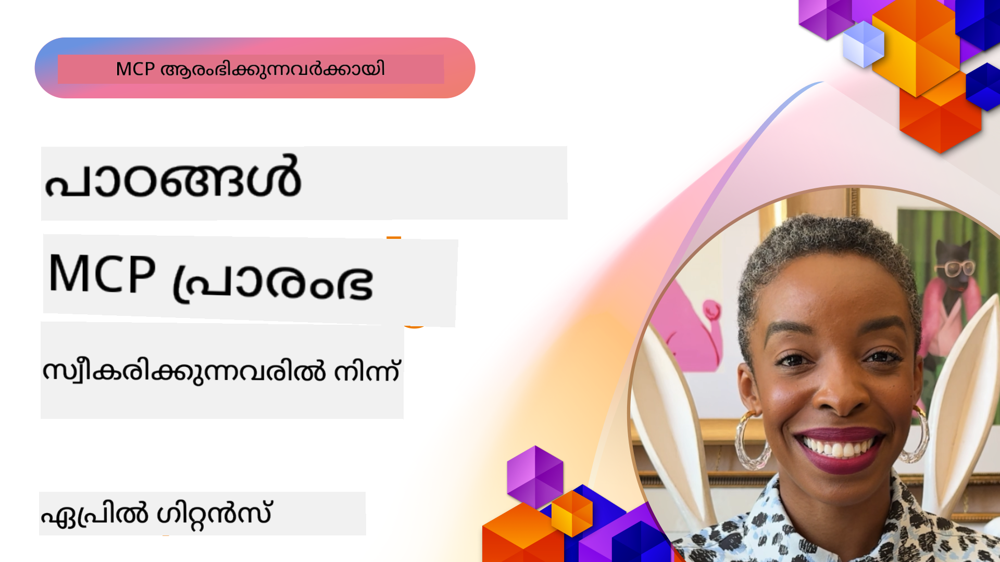

<!--
CO_OP_TRANSLATOR_METADATA:
{
  "original_hash": "41f16dac486d2086a53bc644a01cbe42",
  "translation_date": "2025-12-11T09:55:55+00:00",
  "source_file": "07-LessonsfromEarlyAdoption/README.md",
  "language_code": "ml"
}
-->
# 🌟 പ്രാരംഭ സ്വീകരിക്കുന്നവരിൽ നിന്നുള്ള പാഠങ്ങൾ

[](https://youtu.be/jds7dSmNptE)

_(ഈ പാഠത്തിന്റെ വീഡിയോ കാണാൻ മുകളിൽ ചിത്രത്തിൽ ക്ലിക്ക് ചെയ്യുക)_

## 🎯 ഈ മോഡ്യൂൾ ഉൾക്കൊള്ളുന്നത്

ഈ മോഡ്യൂൾ യഥാർത്ഥ സംഘടനകളും ഡെവലപ്പർമാരും മോഡൽ കോൺടെക്സ്റ്റ് പ്രോട്ടോക്കോൾ (MCP) ഉപയോഗിച്ച് യഥാർത്ഥ വെല്ലുവിളികൾ പരിഹരിക്കുകയും നവീകരണം പ്രേരിപ്പിക്കുകയും ചെയ്യുന്ന രീതികൾ പരിശോധിക്കുന്നു. വിശദമായ കേസ് സ്റ്റഡികൾ, പ്രായോഗിക ഉദാഹരണങ്ങൾ എന്നിവയിലൂടെ, MCP എങ്ങനെ സുരക്ഷിതവും സ്കെയിലബിളുമായ AI സംയോജനം സാധ്യമാക്കുന്നു എന്ന് കണ്ടെത്തും, ഇത് ഭാഷാ മോഡലുകൾ, ഉപകരണങ്ങൾ, എന്റർപ്രൈസ് ഡാറ്റ എന്നിവ ബന്ധിപ്പിക്കുന്നു.

### 📚 MCP പ്രവർത്തനത്തിൽ കാണുക

ഈ സിദ്ധാന്തങ്ങൾ പ്രൊഡക്ഷൻ റെഡി ടൂളുകളിൽ എങ്ങനെ പ്രയോഗിക്കപ്പെടുന്നു എന്ന് കാണാൻ ആഗ്രഹിക്കുന്നുവോ? ഞങ്ങളുടെ [**10 Microsoft MCP Servers That Are Transforming Developer Productivity**](microsoft-mcp-servers.md) പരിശോധിക്കുക, ഇന്ന് നിങ്ങൾക്ക് ഉപയോഗിക്കാവുന്ന യഥാർത്ഥ Microsoft MCP സെർവറുകൾ ഇവിടെ കാണാം.

## അവലോകനം

ഈ പാഠം പ്രാരംഭ സ്വീകരിക്കുന്നവർ മോഡൽ കോൺടെക്സ്റ്റ് പ്രോട്ടോക്കോൾ (MCP) ഉപയോഗിച്ച് വ്യവസായങ്ങളിലുടനീളം യഥാർത്ഥ വെല്ലുവിളികൾ പരിഹരിക്കുകയും നവീകരണം പ്രേരിപ്പിക്കുകയും ചെയ്ത രീതികൾ പരിശോധിക്കുന്നു. വിശദമായ കേസ് സ്റ്റഡികളും പ്രായോഗിക പദ്ധതികളും വഴി, MCP എങ്ങനെ സ്റ്റാൻഡേർഡൈസ്ഡ്, സുരക്ഷിതവും സ്കെയിലബിളുമായ AI സംയോജനം സാധ്യമാക്കുന്നു എന്ന് കാണാം — വലിയ ഭാഷാ മോഡലുകൾ, ഉപകരണങ്ങൾ, എന്റർപ്രൈസ് ഡാറ്റ എന്നിവ ഏകീകൃത ഫ്രെയിംവർക്കിൽ ബന്ധിപ്പിക്കുന്നു. MCP അടിസ്ഥാനമാക്കിയുള്ള പരിഹാരങ്ങൾ രൂപകൽപ്പന ചെയ്യാനും നിർമ്മിക്കാനും പ്രായോഗിക പരിചയം നേടുകയും, തെളിയിച്ച നടപ്പിലാക്കൽ മാതൃകകളിൽ നിന്ന് പഠിക്കുകയും, പ്രൊഡക്ഷൻ പരിസ്ഥിതികളിൽ MCP വിനിയോഗിക്കാനുള്ള മികച്ച രീതികൾ കണ്ടെത്തുകയും ചെയ്യും. MCP സാങ്കേതികവിദ്യയുടെ വളർച്ചയും അതിന്റെ പരിസരവുമായ ബന്ധപ്പെട്ട പുതിയ പ്രവണതകളും ഭാവി ദിശകളും തുറന്ന സോഴ്‌സ് വിഭവങ്ങളും ഈ പാഠം ഹൈലൈറ്റ് ചെയ്യുന്നു.

## പഠന ലക്ഷ്യങ്ങൾ

- വ്യത്യസ്ത വ്യവസായങ്ങളിലെ യഥാർത്ഥ MCP നടപ്പാക്കലുകൾ വിശകലനം ചെയ്യുക
- MCP അടിസ്ഥാനമാക്കിയുള്ള സമ്പൂർണ ആപ്ലിക്കേഷനുകൾ രൂപകൽപ്പന ചെയ്ത് നിർമ്മിക്കുക
- MCP സാങ്കേതികവിദ്യയിലെ പുതിയ പ്രവണതകളും ഭാവി ദിശകളും അന്വേഷിക്കുക
- യഥാർത്ഥ വികസന സാഹചര്യങ്ങളിൽ മികച്ച രീതികൾ പ്രയോഗിക്കുക

## യഥാർത്ഥ MCP നടപ്പാക്കലുകൾ

### കേസ് സ്റ്റഡി 1: എന്റർപ്രൈസ് കസ്റ്റമർ സപ്പോർട്ട് ഓട്ടോമേഷൻ

ഒരു ബഹുരാഷ്ട്ര കോർപ്പറേഷൻ MCP അടിസ്ഥാനമാക്കിയുള്ള പരിഹാരമൊരുക്കി അവരുടെ കസ്റ്റമർ സപ്പോർട്ട് സിസ്റ്റങ്ങൾക്കിടയിൽ AI ഇടപെടലുകൾ സ്റ്റാൻഡേർഡൈസ് ചെയ്തു. ഇതുവഴി അവർക്ക് സാധിച്ചു:

- പല LLM പ്രൊവൈഡർമാർക്കും ഏകീകൃത ഇന്റർഫേസ് സൃഷ്ടിക്കുക
- വകുപ്പുകൾക്കിടയിൽ സ്ഥിരതയുള്ള പ്രോംപ്റ്റ് മാനേജ്മെന്റ് നിലനിർത്തുക
- ശക്തമായ സുരക്ഷയും അനുസരണ നിയന്ത്രണങ്ങളും നടപ്പിലാക്കുക
- പ്രത്യേക ആവശ്യങ്ങൾ അടിസ്ഥാനമാക്കി വ്യത്യസ്ത AI മോഡലുകൾ എളുപ്പത്തിൽ മാറുക

**സാങ്കേതിക നടപ്പാക്കൽ:**

```python
# ഉപഭോക്തൃ പിന്തുണയ്ക്കുള്ള Python MCP സെർവർ നടപ്പാക്കൽ
import logging
import asyncio
from modelcontextprotocol import create_server, ServerConfig
from modelcontextprotocol.server import MCPServer
from modelcontextprotocol.transports import create_http_transport
from modelcontextprotocol.resources import ResourceDefinition
from modelcontextprotocol.prompts import PromptDefinition
from modelcontextprotocol.tool import ToolDefinition

# ലോഗിംഗ് ക്രമീകരിക്കുക
logging.basicConfig(level=logging.INFO)

async def main():
    # സെർവർ കോൺഫിഗറേഷൻ സൃഷ്ടിക്കുക
    config = ServerConfig(
        name="Enterprise Customer Support Server",
        version="1.0.0",
        description="MCP server for handling customer support inquiries"
    )
    
    # MCP സെർവർ ആരംഭിക്കുക
    server = create_server(config)
    
    # നോളജ് ബേസ് റിസോഴ്‌സുകൾ രജിസ്റ്റർ ചെയ്യുക
    server.resources.register(
        ResourceDefinition(
            name="customer_kb",
            description="Customer knowledge base documentation"
        ),
        lambda params: get_customer_documentation(params)
    )
    
    # പ്രോംപ്റ്റ് ടെംപ്ലേറ്റുകൾ രജിസ്റ്റർ ചെയ്യുക
    server.prompts.register(
        PromptDefinition(
            name="support_template",
            description="Templates for customer support responses"
        ),
        lambda params: get_support_templates(params)
    )
    
    # പിന്തുണ ഉപകരണങ്ങൾ രജിസ്റ്റർ ചെയ്യുക
    server.tools.register(
        ToolDefinition(
            name="ticketing",
            description="Create and update support tickets"
        ),
        handle_ticketing_operations
    )
    
    # HTTP ട്രാൻസ്പോർട്ടുമായി സെർവർ ആരംഭിക്കുക
    transport = create_http_transport(port=8080)
    await server.run(transport)

if __name__ == "__main__":
    asyncio.run(main())
```
  
**ഫലങ്ങൾ:** മോഡൽ ചെലവുകളിൽ 30% കുറവ്, പ്രതികരണ സ്ഥിരതയിൽ 45% മെച്ചവും ആഗോള പ്രവർത്തനങ്ങളിൽ അനുസരണ വർദ്ധനവും.

### കേസ് സ്റ്റഡി 2: ഹെൽത്ത്‌കെയർ ഡയഗ്നോസ്റ്റിക് അസിസ്റ്റന്റ്

ഒരു ഹെൽത്ത്‌കെയർ പ്രൊവൈഡർ MCP അടിസ്ഥാനമാക്കിയുള്ള ഇൻഫ്രാസ്ട്രക്ചർ വികസിപ്പിച്ചു, പല പ്രത്യേക മെഡിക്കൽ AI മോഡലുകളും സംയോജിപ്പിക്കുമ്പോൾ രഹസ്യമായ രോഗി ഡാറ്റ സംരക്ഷിക്കപ്പെടുന്നു:

- ജനറലിസ്റ്റും സ്പെഷ്യലിസ്റ്റും ആയ മെഡിക്കൽ മോഡലുകൾക്കിടയിൽ സുതാര്യമായ മാറൽ
- കർശനമായ സ്വകാര്യത നിയന്ത്രണങ്ങളും ഓഡിറ്റ് ട്രെയിലുകളും
- നിലവിലുള്ള ഇലക്ട്രോണിക് ഹെൽത്ത് റെക്കോർഡ് (EHR) സിസ്റ്റങ്ങളുമായി സംയോജനം
- മെഡിക്കൽ പദസമ്പ്രദായത്തിനായി സ്ഥിരതയുള്ള പ്രോംപ്റ്റ് എഞ്ചിനീയറിംഗ്

**സാങ്കേതിക നടപ്പാക്കൽ:**

```csharp
// C# MCP host application implementation in healthcare application
using Microsoft.Extensions.DependencyInjection;
using ModelContextProtocol.SDK.Client;
using ModelContextProtocol.SDK.Security;
using ModelContextProtocol.SDK.Resources;

public class DiagnosticAssistant
{
    private readonly MCPHostClient _mcpClient;
    private readonly PatientContext _patientContext;
    
    public DiagnosticAssistant(PatientContext patientContext)
    {
        _patientContext = patientContext;
        
        // Configure MCP client with healthcare-specific settings
        var clientOptions = new ClientOptions
        {
            Name = "Healthcare Diagnostic Assistant",
            Version = "1.0.0",
            Security = new SecurityOptions
            {
                Encryption = EncryptionLevel.Medical,
                AuditEnabled = true
            }
        };
        
        _mcpClient = new MCPHostClientBuilder()
            .WithOptions(clientOptions)
            .WithTransport(new HttpTransport("https://healthcare-mcp.example.org"))
            .WithAuthentication(new HIPAACompliantAuthProvider())
            .Build();
    }
    
    public async Task<DiagnosticSuggestion> GetDiagnosticAssistance(
        string symptoms, string patientHistory)
    {
        // Create request with appropriate resources and tool access
        var resourceRequest = new ResourceRequest
        {
            Name = "patient_records",
            Parameters = new Dictionary<string, object>
            {
                ["patientId"] = _patientContext.PatientId,
                ["requestingProvider"] = _patientContext.ProviderId
            }
        };
        
        // Request diagnostic assistance using appropriate prompt
        var response = await _mcpClient.SendPromptRequestAsync(
            promptName: "diagnostic_assistance",
            parameters: new Dictionary<string, object>
            {
                ["symptoms"] = symptoms,
                patientHistory = patientHistory,
                relevantGuidelines = _patientContext.GetRelevantGuidelines()
            });
            
        return DiagnosticSuggestion.FromMCPResponse(response);
    }
}
```
  
**ഫലങ്ങൾ:** ഡോക്ടർമാർക്ക് മെച്ചപ്പെട്ട ഡയഗ്നോസ്റ്റിക് നിർദ്ദേശങ്ങൾ, HIPAA അനുസരണ പൂർണ്ണമായും നിലനിർത്തി, സിസ്റ്റങ്ങൾക്കിടയിലെ കോൺടെക്സ്റ്റ്-സ്വിച്ച് കുറവ്.

### കേസ് സ്റ്റഡി 3: ഫിനാൻഷ്യൽ സർവീസസ് റിസ്‌ക് അനാലിസിസ്

ഒരു ഫിനാൻഷ്യൽ സ്ഥാപനo MCP നടപ്പാക്കി അവരുടെ റിസ്‌ക് അനാലിസിസ് പ്രക്രിയകൾ വിവിധ വകുപ്പുകളിൽ സ്റ്റാൻഡേർഡൈസ് ചെയ്യാൻ:

- ക്രെഡിറ്റ് റിസ്‌ക്, തട്ടിപ്പ് കണ്ടെത്തൽ, നിക്ഷേപ റിസ്‌ക് മോഡലുകൾക്കായി ഏകീകൃത ഇന്റർഫേസ് സൃഷ്ടിച്ചു
- കർശനമായ ആക്‌സസ് നിയന്ത്രണങ്ങളും മോഡൽ വേർഷനിംഗും നടപ്പിലാക്കി
- എല്ലാ AI ശുപാർശകളുടെയും ഓഡിറ്റബിലിറ്റി ഉറപ്പാക്കി
- വ്യത്യസ്ത സിസ്റ്റങ്ങൾക്കിടയിൽ സ്ഥിരതയുള്ള ഡാറ്റ ഫോർമാറ്റിംഗ് നിലനിർത്തി

**സാങ്കേതിക നടപ്പാക്കൽ:**

```java
// സാമ്പത്തിക അപകടം വിലയിരുത്തലിനുള്ള ജാവ MCP സെർവർ
import org.mcp.server.*;
import org.mcp.security.*;

public class FinancialRiskMCPServer {
    public static void main(String[] args) {
        // സാമ്പത്തിക അനുസരണ സവിശേഷതകളോടെ MCP സെർവർ സൃഷ്ടിക്കുക
        MCPServer server = new MCPServerBuilder()
            .withModelProviders(
                new ModelProvider("risk-assessment-primary", new AzureOpenAIProvider()),
                new ModelProvider("risk-assessment-audit", new LocalLlamaProvider())
            )
            .withPromptTemplateDirectory("./compliance/templates")
            .withAccessControls(new SOCCompliantAccessControl())
            .withDataEncryption(EncryptionStandard.FINANCIAL_GRADE)
            .withVersionControl(true)
            .withAuditLogging(new DatabaseAuditLogger())
            .build();
            
        server.addRequestValidator(new FinancialDataValidator());
        server.addResponseFilter(new PII_RedactionFilter());
        
        server.start(9000);
        
        System.out.println("Financial Risk MCP Server running on port 9000");
    }
}
```
  
**ഫലങ്ങൾ:** അനുസരണ വർദ്ധനവ്, മോഡൽ വിനിയോഗ ചക്രങ്ങൾ 40% വേഗത്തിൽ, വകുപ്പുകൾക്കിടയിലെ റിസ്‌ക് വിലയിരുത്തൽ സ്ഥിരത മെച്ചപ്പെട്ടു.

### കേസ് സ്റ്റഡി 4: Microsoft Playwright MCP Server ബ്രൗസർ ഓട്ടോമേഷൻ

Microsoft മോഡൽ കോൺടെക്സ്റ്റ് പ്രോട്ടോക്കോൾ വഴി സുരക്ഷിതവും സ്റ്റാൻഡേർഡൈസ്ഡ് ബ്രൗസർ ഓട്ടോമേഷൻ സാധ്യമാക്കാൻ [Playwright MCP സെർവർ](https://github.com/microsoft/playwright-mcp) വികസിപ്പിച്ചു. ഈ പ്രൊഡക്ഷൻ റെഡി സെർവർ AI ഏജന്റുകളും LLM-കളും വെബ് ബ്രൗസറുകളുമായി നിയന്ത്രിതവും ഓഡിറ്റബിൾവുമായും ഇടപെടാൻ അനുവദിക്കുന്നു — ഓട്ടോമേറ്റഡ് വെബ് ടെസ്റ്റിംഗ്, ഡാറ്റ എക്സ്ട്രാക്ഷൻ, എന്റു-എൻഡ് വർക്ക്‌ഫ്ലോകൾ തുടങ്ങിയ ഉപയോഗങ്ങൾക്കായി.

> **🎯 പ്രൊഡക്ഷൻ റെഡി ടൂൾ**
> 
> ഇന്ന് നിങ്ങൾക്ക് ഉപയോഗിക്കാവുന്ന യഥാർത്ഥ MCP സെർവർ! Playwright MCP Server-നും മറ്റ് 9 പ്രൊഡക്ഷൻ റെഡി Microsoft MCP സെർവറുകൾക്കും കുറിച്ച് ഞങ്ങളുടെ [**Microsoft MCP Servers Guide**](microsoft-mcp-servers.md#8--playwright-mcp-server) കാണുക.

**പ്രധാന സവിശേഷതകൾ:**  
- MCP ടൂളുകളായി ബ്രൗസർ ഓട്ടോമേഷൻ കഴിവുകൾ (നാവിഗേഷൻ, ഫോം പൂരിപ്പിക്കൽ, സ്ക്രീൻഷോട്ട് പിടിക്കൽ തുടങ്ങിയവ) പ്രദർശിപ്പിക്കുന്നു  
- അനധികൃത പ്രവർത്തനങ്ങൾ തടയാൻ കർശന ആക്‌സസ് നിയന്ത്രണങ്ങളും സാൻഡ്‌ബോക്സിംഗും നടപ്പിലാക്കുന്നു  
- എല്ലാ ബ്രൗസർ ഇടപെടലുകൾക്കും വിശദമായ ഓഡിറ്റ് ലോഗുകൾ നൽകുന്നു  
- ഏജന്റ്-നിർദ്ദേശിത ഓട്ടോമേഷനായി Azure OpenAI-യുമായി സംയോജനം പിന്തുണയ്ക്കുന്നു  
- GitHub Copilot-ന്റെ കോഡിംഗ് ഏജന്റിന് വെബ് ബ്രൗസിംഗ് കഴിവുകൾ നൽകുന്നു  

**സാങ്കേതിക നടപ്പാക്കൽ:**

```typescript
// ടൈപ്പ്‌സ്‌ക്രിപ്റ്റ്: MCP സെർവറിൽ പ്ലേറൈറ്റ് ബ്രൗസർ ഓട്ടോമേഷൻ ടൂളുകൾ രജിസ്റ്റർ ചെയ്യുന്നു
import { createServer, ToolDefinition } from 'modelcontextprotocol';
import { launch } from 'playwright';

const server = createServer({
  name: 'Playwright MCP Server',
  version: '1.0.0',
  description: 'MCP server for browser automation using Playwright'
});

// ഒരു URL-ലേക്ക് നാവിഗേറ്റ് ചെയ്ത് സ്ക്രീൻഷോട്ട് എടുക്കാനുള്ള ടൂൾ രജിസ്റ്റർ ചെയ്യുക
server.tools.register(
  new ToolDefinition({
    name: 'navigate_and_screenshot',
    description: 'Navigate to a URL and capture a screenshot',
    parameters: {
      url: { type: 'string', description: 'The URL to visit' }
    }
  }),
  async ({ url }) => {
    const browser = await launch();
    const page = await browser.newPage();
    await page.goto(url);
    const screenshot = await page.screenshot();
    await browser.close();
    return { screenshot };
  }
);

// MCP സെർവർ ആരംഭിക്കുക
server.listen(8080);
```
  
**ഫലങ്ങൾ:**  

- AI ഏജന്റുകൾക്കും LLM-കൾക്കും സുരക്ഷിതവും പ്രോഗ്രാമാറ്റിക് ബ്രൗസർ ഓട്ടോമേഷൻ സാധ്യമാക്കി  
- മാനുവൽ ടെസ്റ്റിംഗ് ശ്രമം കുറച്ചു, വെബ് ആപ്ലിക്കേഷനുകളുടെ ടെസ്റ്റ് കവറേജ് മെച്ചപ്പെടുത്തി  
- എന്റർപ്രൈസ് പരിസ്ഥിതികളിൽ ബ്രൗസർ അടിസ്ഥാനമാക്കിയുള്ള ടൂൾ സംയോജനത്തിന് പുനരുപയോഗയോഗ്യവും വിപുലീകരണയോഗ്യവുമായ ഫ്രെയിംവർക്കും നൽകി  
- GitHub Copilot-ന്റെ വെബ് ബ്രൗസിംഗ് കഴിവുകൾക്ക് ശക്തി നൽകി  

**റഫറൻസുകൾ:**  

- [Playwright MCP Server GitHub Repository](https://github.com/microsoft/playwright-mcp)  
- [Microsoft AI and Automation Solutions](https://azure.microsoft.com/en-us/products/ai-services/)  

### കേസ് സ്റ്റഡി 5: Azure MCP – എന്റർപ്രൈസ്-ഗ്രേഡ് മോഡൽ കോൺടെക്സ്റ്റ് പ്രോട്ടോക്കോൾ സർവീസ്

Azure MCP ([https://aka.ms/azmcp](https://aka.ms/azmcp)) Microsoft-ന്റെ മാനേജുചെയ്ത, എന്റർപ്രൈസ്-ഗ്രേഡ് മോഡൽ കോൺടെക്സ്റ്റ് പ്രോട്ടോക്കോൾ നടപ്പാക്കലാണ്, സ്കെയിലബിള്‍, സുരക്ഷിതവും അനുസരണയുള്ള MCP സെർവർ കഴിവുകൾ ക്ലൗഡ് സർവീസായി നൽകാൻ രൂപകൽപ്പന ചെയ്തതാണ്. Azure MCP സംഘടനകൾക്ക് MCP സെർവർകൾ വേഗത്തിൽ വിന്യസിക്കാനും, നിയന്ത്രിക്കാനും, Azure AI, ഡാറ്റ, സുരക്ഷാ സേവനങ്ങളുമായി സംയോജിപ്പിക്കാനും സഹായിക്കുന്നു, പ്രവർത്തനഭാരം കുറയ്ക്കുകയും AI സ്വീകരണം വേഗത്തിലാക്കുകയും ചെയ്യുന്നു.

> **🎯 പ്രൊഡക്ഷൻ റെഡി ടൂൾ**
> 
> ഇന്ന് നിങ്ങൾക്ക് ഉപയോഗിക്കാവുന്ന യഥാർത്ഥ MCP സെർവർ! Azure AI Foundry MCP Server-നെ കുറിച്ച് ഞങ്ങളുടെ [**Microsoft MCP Servers Guide**](microsoft-mcp-servers.md) കാണുക.

- ബിൽറ്റ്-ഇൻ സ്കെയിലിംഗ്, മോണിറ്ററിംഗ്, സുരക്ഷയോടുകൂടിയ ഫുൾ മാനേജ്ഡ് MCP സെർവർ ഹോസ്റ്റിംഗ്  
- Azure OpenAI, Azure AI Search, മറ്റ് Azure സേവനങ്ങളുമായി നേറ്റീവ് സംയോജനം  
- Microsoft Entra ID വഴി എന്റർപ്രൈസ് ഓതന്റിക്കേഷൻ, ഓതറൈസേഷൻ  
- കസ്റ്റം ടൂളുകൾ, പ്രോംപ്റ്റ് ടെംപ്ലേറ്റുകൾ, റിസോഴ്‌സ് കണക്ടറുകൾക്ക് പിന്തുണ  
- എന്റർപ്രൈസ് സുരക്ഷയും നിയമാനുസരണ ആവശ്യകതകളും പാലിക്കൽ  

**സാങ്കേതിക നടപ്പാക്കൽ:**

```yaml
# Example: Azure MCP server deployment configuration (YAML)
apiVersion: mcp.microsoft.com/v1
kind: McpServer
metadata:
  name: enterprise-mcp-server
spec:
  modelProviders:
    - name: azure-openai
      type: AzureOpenAI
      endpoint: https://<your-openai-resource>.openai.azure.com/
      apiKeySecret: <your-azure-keyvault-secret>
  tools:
    - name: document_search
      type: AzureAISearch
      endpoint: https://<your-search-resource>.search.windows.net/
      apiKeySecret: <your-azure-keyvault-secret>
  authentication:
    type: EntraID
    tenantId: <your-tenant-id>
  monitoring:
    enabled: true
    logAnalyticsWorkspace: <your-log-analytics-id>
```
  
**ഫലങ്ങൾ:**  
- എന്റർപ്രൈസ് AI പദ്ധതികൾക്ക് റെഡി-ടു-യൂസ്, അനുസരണ MCP സെർവർ പ്ലാറ്റ്ഫോം നൽകിക്കൊണ്ട് മൂല്യലഭ്യത സമയം കുറച്ചു  
- LLM-കൾ, ടൂളുകൾ, എന്റർപ്രൈസ് ഡാറ്റ സ്രോതസ്സുകളുടെ സംയോജനം ലളിതമാക്കി  
- MCP വർക്ക്‌ലോഡുകൾക്കായി സുരക്ഷ, നിരീക്ഷണക്ഷമത, പ്രവർത്തനക്ഷമത മെച്ചപ്പെടുത്തി  
- Azure SDK മികച്ച രീതികളും നിലവിലെ ഓതന്റിക്കേഷൻ മാതൃകകളും ഉപയോഗിച്ച് കോഡ് ഗുണമേന്മ വർദ്ധിപ്പിച്ചു  

**റഫറൻസുകൾ:**  
- [Azure MCP Documentation](https://aka.ms/azmcp)  
- [Azure MCP Server GitHub Repository](https://github.com/Azure/azure-mcp)  
- [Azure AI Services](https://azure.microsoft.com/en-us/products/ai-services/)  
- [Microsoft MCP Center](https://mcp.azure.com)  

## കേസ് സ്റ്റഡി 6: NLWeb  
MCP (Model Context Protocol) ചാറ്റ്ബോട്ടുകളും AI അസിസ്റ്റന്റുകളും ഉപകരണങ്ങളുമായി ഇടപെടാൻ ഉപയോഗിക്കുന്ന ഒരു ഉയർന്ന പ്രോട്ടോക്കോളാണ്. ഓരോ NLWeb ഇൻസ്റ്റൻസും MCP സെർവറാണ്, ഇത് ഒരു കോർ മെത്തഡ് ആയ ask-നെ പിന്തുണയ്ക്കുന്നു, ഇത് വെബ്സൈറ്റിനോട് സ്വാഭാവിക ഭാഷയിൽ ചോദ്യം ചോദിക്കാൻ ഉപയോഗിക്കുന്നു. ലഭിക്കുന്ന പ്രതികരണം schema.org ഉപയോഗിക്കുന്നു, വെബ് ഡാറ്റ വിവരണത്തിന് വ്യാപകമായി ഉപയോഗിക്കുന്ന വാക്ക്. ലൂസ്ലി പറഞ്ഞാൽ, MCP Http-ന് HTML പോലെയാണ്. NLWeb പ്രോട്ടോക്കോളുകൾ, Schema.org ഫോർമാറ്റുകൾ, സാമ്പിൾ കോഡ് എന്നിവ സംയോജിപ്പിച്ച് സൈറ്റുകൾക്ക് ഈ എന്റ്പോയിന്റുകൾ വേഗത്തിൽ സൃഷ്ടിക്കാൻ സഹായിക്കുന്നു, മനുഷ്യർക്കും യന്ത്രങ്ങൾക്കും സ്വാഭാവിക ഏജന്റ്-ടു-ഏജന്റ് ഇടപെടലുകൾ വഴി പ്രയോജനകരമാണ്.

NLWeb-ന് രണ്ട് വ്യത്യസ്ത ഘടകങ്ങളുണ്ട്:  
- ഒരു പ്രോട്ടോക്കോൾ, വളരെ ലളിതമായത്, സ്വാഭാവിക ഭാഷയിൽ സൈറ്റുമായി ഇന്റർഫേസ് ചെയ്യാൻ, json, schema.org ഉപയോഗിച്ച് മറുപടി നൽകുന്നു. REST API ഡോക്യുമെന്റേഷൻ കൂടുതൽ വിവരങ്ങൾക്ക് കാണുക.  
- (1)ന്റെ ലളിതമായ നടപ്പാക്കൽ, നിലവിലുള്ള മാർക്കപ്പ് ഉപയോഗിച്ച്, ലിസ്റ്റ് ചെയ്ത ഇനങ്ങളായി (ഉൽപ്പന്നങ്ങൾ, റെസിപ്പികൾ, ആകർഷണങ്ങൾ, റിവ്യൂകൾ തുടങ്ങിയവ) സൈറ്റുകൾ abstraction ചെയ്യാവുന്നതിന്. ഉപയോക്തൃ ഇന്റർഫേസ് വിഡ്ജറ്റുകളുമായി ചേർന്ന്, സൈറ്റുകൾക്ക് അവരുടെ ഉള്ളടക്കത്തിന് സംഭാഷണാത്മക ഇന്റർഫേസുകൾ എളുപ്പത്തിൽ നൽകാം. Life of a chat query ഡോക്യുമെന്റേഷൻ കൂടുതൽ വിവരങ്ങൾക്ക് കാണുക.

**റഫറൻസുകൾ:**  
- [Azure MCP Documentation](https://aka.ms/azmcp)  
- [NLWeb](https://github.com/microsoft/NlWeb)  

### കേസ് സ്റ്റഡി 7: Azure AI Foundry MCP Server – എന്റർപ്രൈസ് AI ഏജന്റ് സംയോജനം

Azure AI Foundry MCP സെർവർ MCP ഉപയോഗിച്ച് എന്റർപ്രൈസ് പരിസ്ഥിതികളിൽ AI ഏജന്റുകളും വർക്ക്‌ഫ്ലോകളും ഓർക്കസ്ട്രേറ്റ് ചെയ്യാനും നിയന്ത്രിക്കാനും എങ്ങനെ സാധ്യമാകുന്നു എന്ന് കാണിക്കുന്നു. MCP-നെ Azure AI Foundry-യുമായി സംയോജിപ്പിച്ച്, സംഘടനകൾ ഏജന്റ് ഇടപെടലുകൾ സ്റ്റാൻഡേർഡൈസ് ചെയ്യുകയും, Foundry-യുടെ വർക്ക്‌ഫ്ലോ മാനേജ്മെന്റ് ഉപയോഗിക്കുകയും, സുരക്ഷിതവും സ്കെയിലബിളുമായ വിനിയോഗങ്ങൾ ഉറപ്പാക്കുകയും ചെയ്യുന്നു.

> **🎯 പ്രൊഡക്ഷൻ റെഡി ടൂൾ**
> 
> ഇന്ന് നിങ്ങൾക്ക് ഉപയോഗിക്കാവുന്ന യഥാർത്ഥ MCP സെർവർ! Azure AI Foundry MCP Server-നെ കുറിച്ച് ഞങ്ങളുടെ [**Microsoft MCP Servers Guide**](microsoft-mcp-servers.md#9--azure-ai-foundry-mcp-server) കാണുക.

**പ്രധാന സവിശേഷതകൾ:**  
- മോഡൽ കാറ്റലോഗുകളും വിനിയോഗ മാനേജ്മെന്റും ഉൾപ്പെടെ Azure AI പരിസ്ഥിതിയിലേക്ക് സമഗ്ര ആക്‌സസ്  
- RAG ആപ്ലിക്കേഷനുകൾക്കായി Azure AI Search ഉപയോഗിച്ച് നോളജ് ഇൻഡക്സിംഗ്  
- AI മോഡൽ പ്രകടനവും ഗുണനിലവാര ഉറപ്പും വിലയിരുത്താനുള്ള ഉപകരണങ്ങൾ  
- Azure AI Foundry കാറ്റലോഗും ലാബുകളും ഉപയോഗിച്ച് ആധുനിക ഗവേഷണ മോഡലുകൾ സംയോജിപ്പിക്കൽ  
- പ്രൊഡക്ഷൻ സാഹചര്യങ്ങൾക്ക് ഏജന്റ് മാനേജ്മെന്റ്, വിലയിരുത്തൽ കഴിവുകൾ  

**ഫലങ്ങൾ:**  
- AI ഏജന്റ് വർക്ക്‌ഫ്ലോകളുടെ വേഗത്തിലുള്ള പ്രോട്ടോടൈപ്പിംഗ്, ശക്തമായ നിരീക്ഷണം  
- Azure AI സേവനങ്ങളുമായി സുതാര്യമായ സംയോജനം  
- ഏജന്റ് പൈപ്പ്ലൈനുകൾ നിർമ്മിക്കാനും വിനിയോഗിക്കാനും നിരീക്ഷിക്കാനും ഏകീകൃത ഇന്റർഫേസ്  
- എന്റർപ്രൈസുകൾക്കായി മെച്ചപ്പെട്ട സുരക്ഷ, അനുസരണം, പ്രവർത്തനക്ഷമത  
- സങ്കീർണ്ണമായ ഏജന്റ്-നിർദ്ദേശിത പ്രക്രിയകളെ നിയന്ത്രിക്കുമ്പോൾ AI സ്വീകരണം വേഗത്തിലാക്കൽ  

**റഫറൻസുകൾ:**  
- [Azure AI Foundry MCP Server GitHub Repository](https://github.com/azure-ai-foundry/mcp-foundry)  
- [Integrating Azure AI Agents with MCP (Microsoft Foundry Blog)](https://devblogs.microsoft.com/foundry/integrating-azure-ai-agents-mcp/)  

### കേസ് സ്റ്റഡി 8: Foundry MCP Playground – പരീക്ഷണവും പ്രോട്ടോടൈപ്പിംഗും

Foundry MCP Playground MCP സെർവറുകളുമായി Azure AI Foundry സംയോജനങ്ങൾ പരീക്ഷിക്കാൻ റെഡി-ടു-യൂസ് പരിസ്ഥിതിയാണ്. ഡെവലപ്പർമാർക്ക് Azure AI Foundry കാറ്റലോഗും ലാബുകളും ഉപയോഗിച്ച് AI മോഡലുകളും ഏജന്റ് വർക്ക്‌ഫ്ലോകളും വേഗത്തിൽ പ്രോട്ടോടൈപ്പ് ചെയ്യാനും പരീക്ഷിക്കാനും വിലയിരുത്താനും സാധിക്കുന്നു. പ്ലേഗ്രൗണ്ട് സജ്ജീകരണം ലളിതമാക്കുന്നു, സാമ്പിൾ പ്രോജക്റ്റുകൾ നൽകുന്നു, സഹകരണ വികസനത്തിന് പിന്തുണ നൽകുന്നു, കുറഞ്ഞ ബാരിയറുകളോടെ മികച്ച രീതികളും പുതിയ സാഹചര്യങ്ങളും പരീക്ഷിക്കാൻ സഹായിക്കുന്നു. ഇത് ആശയങ്ങൾ സ്ഥിരീകരിക്കാൻ, പരീക്ഷണങ്ങൾ പങ്കുവെക്കാൻ, പഠനം വേഗത്തിലാക്കാൻ ടീമുകൾക്ക് പ്രത്യേകിച്ച് ഉപകാരപ്രദമാണ്.

**റഫറൻസുകൾ:**  

- [Foundry MCP Playground GitHub Repository](https://github.com/azure-ai-foundry/foundry-mcp-playground)  

### കേസ് സ്റ്റഡി 9: Microsoft Learn Docs MCP Server –
**എന്തുകൊണ്ട് ഇത് നിർണായകമാണ്:**
- മൈക്രോസോഫ്റ്റ് സാങ്കേതികവിദ്യകൾക്കായി "പഴയതായ AI അറിവ്" പ്രശ്നം പരിഹരിക്കുന്നു
- AI അസിസ്റ്റന്റുകൾക്ക് ഏറ്റവും പുതിയ .NET, C#, Azure, മൈക്രോസോഫ്റ്റ് 365 ഫീച്ചറുകളിലേക്ക് ആക്‌സസ് ഉറപ്പാക്കുന്നു
- കൃത്യമായ കോഡ് ജനറേഷനായി അധികാരമുള്ള, ആദ്യകക്ഷി വിവരങ്ങൾ നൽകുന്നു
- വേഗത്തിൽ വികസിക്കുന്ന മൈക്രോസോഫ്റ്റ് സാങ്കേതികവിദ്യകളുമായി ജോലി ചെയ്യുന്ന ഡെവലപ്പർമാർക്ക് അത്യാവശ്യമാണ്

**ഫലങ്ങൾ:**
- മൈക്രോസോഫ്റ്റ് സാങ്കേതികവിദ്യകൾക്കായി AI-ഉൽപാദിത കോഡിന്റെ കൃത്യത നിഗമനാത്മകമായി മെച്ചപ്പെടുത്തി
- നിലവിലുള്ള ഡോക്യുമെന്റേഷൻ, മികച്ച പ്രാക്ടീസുകൾ അന്വേഷിക്കുന്നതിന് ചെലവഴിക്കുന്ന സമയം കുറച്ചു
- സാന്ദർഭ്യബോധമുള്ള ഡോക്യുമെന്റേഷൻ റിട്രീവലിലൂടെ ഡെവലപ്പർ ഉൽപാദകത്വം വർദ്ധിപ്പിച്ചു
- IDE വിട്ടുപോകാതെ വികസന പ്രവൃത്തികളുമായി സുതാര്യമായ സംയോജനം

**റഫറൻസുകൾ:**
- [Microsoft Learn Docs MCP Server GitHub Repository](https://github.com/MicrosoftDocs/mcp)
- [Microsoft Learn Documentation](https://learn.microsoft.com/)

## ഹാൻഡ്‌സ്-ഓൺ പ്രോജക്റ്റുകൾ

### പ്രോജക്റ്റ് 1: മൾട്ടി-പ്രൊവൈഡർ MCP സെർവർ നിർമ്മിക്കുക

**ലക്ഷ്യം:** പ്രത്യേക മാനദണ്ഡങ്ങളുടെ അടിസ്ഥാനത്തിൽ നിരവധി AI മോഡൽ പ്രൊവൈഡർമാർക്ക് അഭ്യർത്ഥനകൾ റൂട്ടുചെയ്യാൻ കഴിയുന്ന MCP സെർവർ സൃഷ്ടിക്കുക.

**ആവശ്യകതകൾ:**

- കുറഞ്ഞത് മൂന്ന് വ്യത്യസ്ത മോഡൽ പ്രൊവൈഡർമാർക്ക് പിന്തുണ നൽകുക (ഉദാ: OpenAI, Anthropic, ലോക്കൽ മോഡലുകൾ)
- അഭ്യർത്ഥന മെടാഡേറ്റയുടെ അടിസ്ഥാനത്തിൽ റൂട്ടിംഗ് മെക്കാനിസം നടപ്പിലാക്കുക
- പ്രൊവൈഡർ ക്രെഡൻഷ്യലുകൾ മാനേജുചെയ്യുന്നതിനുള്ള കോൺഫിഗറേഷൻ സിസ്റ്റം സൃഷ്ടിക്കുക
- പ്രകടനവും ചെലവും മെച്ചപ്പെടുത്താൻ കാഷിംഗ് ചേർക്കുക
- ഉപയോഗം നിരീക്ഷിക്കുന്നതിനുള്ള ലളിതമായ ഡാഷ്ബോർഡ് നിർമ്മിക്കുക

**നടപടികൾ:**

1. അടിസ്ഥാന MCP സെർവർ ഇൻഫ്രാസ്ട്രക്ചർ സജ്ജമാക്കുക
2. ഓരോ AI മോഡൽ സർവീസിനും പ്രൊവൈഡർ അഡാപ്റ്ററുകൾ നടപ്പിലാക്കുക
3. അഭ്യർത്ഥനയുടെ ഗുണലക്ഷണങ്ങളുടെ അടിസ്ഥാനത്തിൽ റൂട്ടിംഗ് ലജിക് സൃഷ്ടിക്കുക
4. ആവർത്തിക്കുന്ന അഭ്യർത്ഥനകൾക്കായി കാഷിംഗ് മെക്കാനിസങ്ങൾ ചേർക്കുക
5. നിരീക്ഷണ ഡാഷ്ബോർഡ് വികസിപ്പിക്കുക
6. വിവിധ അഭ്യർത്ഥന പാറ്റേണുകളുമായി പരീക്ഷിക്കുക

**സാങ്കേതികവിദ്യകൾ:** Python (.NET/Java/Python നിങ്ങളുടെ ഇഷ്ടാനുസരണം), കാഷിംഗിനായി Redis, ഡാഷ്ബോർഡിനായി ലളിതമായ വെബ് ഫ്രെയിംവർക്ക്.

### പ്രോജക്റ്റ് 2: എന്റർപ്രൈസ് പ്രോംപ്റ്റ് മാനേജ്മെന്റ് സിസ്റ്റം

**ലക്ഷ്യം:** ഒരു MCP അടിസ്ഥാനമാക്കിയുള്ള സിസ്റ്റം വികസിപ്പിക്കുക, പ്രോംപ്റ്റ് ടെംപ്ലേറ്റുകൾ മാനേജുചെയ്യാനും, വേർഷനിംഗ് നടത്താനും, സംഘടനയിലുടനീളം വിന്യസിക്കാനും.

**ആവശ്യകതകൾ:**

- പ്രോംപ്റ്റ് ടെംപ്ലേറ്റുകൾക്കായി കേന്ദ്രകൃതമായ റിപോസിറ്ററി സൃഷ്ടിക്കുക
- വേർഷനിംഗ്, അംഗീകാരം പ്രവൃത്തിപദ്ധതികൾ നടപ്പിലാക്കുക
- സാമ്പിൾ ഇൻപുട്ടുകളോടെ ടെംപ്ലേറ്റ് ടെസ്റ്റിംഗ് കഴിവുകൾ നിർമ്മിക്കുക
- റോളിനനുസരിച്ചുള്ള ആക്‌സസ് നിയന്ത്രണങ്ങൾ വികസിപ്പിക്കുക
- ടെംപ്ലേറ്റ് റിട്രീവലിനും വിന്യാസത്തിനും API സൃഷ്ടിക്കുക

**നടപടികൾ:**

1. ടെംപ്ലേറ്റ് സംഭരണത്തിനുള്ള ഡാറ്റാബേസ് സ്കീമ രൂപകൽപ്പന ചെയ്യുക
2. ടെംപ്ലേറ്റ് CRUD പ്രവർത്തനങ്ങൾക്ക് കോർ API സൃഷ്ടിക്കുക
3. വേർഷനിംഗ് സിസ്റ്റം നടപ്പിലാക്കുക
4. അംഗീകാരം പ്രവൃത്തിപദ്ധതി നിർമ്മിക്കുക
5. ടെസ്റ്റിംഗ് ഫ്രെയിംവർക്ക് വികസിപ്പിക്കുക
6. മാനേജ്മെന്റിനായി ലളിതമായ വെബ് ഇന്റർഫേസ് സൃഷ്ടിക്കുക
7. MCP സെർവറുമായി സംയോജിപ്പിക്കുക

**സാങ്കേതികവിദ്യകൾ:** നിങ്ങളുടെ ഇഷ്ടാനുസരണം ബാക്ക്‌എൻഡ് ഫ്രെയിംവർക്ക്, SQL അല്ലെങ്കിൽ NoSQL ഡാറ്റാബേസ്, മാനേജ്മെന്റ് ഇന്റർഫേസിനായി ഫ്രണ്ട്‌എൻഡ് ഫ്രെയിംവർക്ക്.

### പ്രോജക്റ്റ് 3: MCP അടിസ്ഥാനത്തിലുള്ള ഉള്ളടക്ക സൃഷ്ടി പ്ലാറ്റ്ഫോം

**ലക്ഷ്യം:** MCP ഉപയോഗിച്ച് വിവിധ ഉള്ളടക്ക തരംകളിൽ സ്ഥിരതയുള്ള ഫലങ്ങൾ നൽകുന്ന ഉള്ളടക്ക സൃഷ്ടി പ്ലാറ്റ്ഫോം നിർമ്മിക്കുക.

**ആവശ്യകതകൾ:**

- ബ്‌ളോഗ് പോസ്റ്റുകൾ, സോഷ്യൽ മീഡിയ, മാർക്കറ്റിംഗ് കോപ്പി തുടങ്ങിയ നിരവധി ഉള്ളടക്ക ഫോർമാറ്റുകൾക്ക് പിന്തുണ നൽകുക
- ഇഷ്ടാനുസൃതമാക്കലുകൾ ഉള്ള ടെംപ്ലേറ്റ് അടിസ്ഥാനത്തിലുള്ള സൃഷ്ടി നടപ്പിലാക്കുക
- ഉള്ളടക്ക അവലോകനവും ഫീഡ്ബാക്ക് സിസ്റ്റവും സൃഷ്ടിക്കുക
- ഉള്ളടക്ക പ്രകടന മെട്രിക്‌സ് ട്രാക്ക് ചെയ്യുക
- ഉള്ളടക്ക വേർഷനിംഗ്, പുനരാവൃത്തി പിന്തുണയ്ക്കുക

**നടപടികൾ:**

1. MCP ക്ലയന്റ് ഇൻഫ്രാസ്ട്രക്ചർ സജ്ജമാക്കുക
2. വ്യത്യസ്ത ഉള്ളടക്ക തരംകളുടെ ടെംപ്ലേറ്റുകൾ സൃഷ്ടിക്കുക
3. ഉള്ളടക്ക സൃഷ്ടി പൈപ്പ്‌ലൈൻ നിർമ്മിക്കുക
4. അവലോകന സിസ്റ്റം നടപ്പിലാക്കുക
5. മെട്രിക്‌സ് ട്രാക്കിംഗ് സിസ്റ്റം വികസിപ്പിക്കുക
6. ടെംപ്ലേറ്റ് മാനേജ്മെന്റിനും ഉള്ളടക്ക സൃഷ്ടിക്കും ഉപയോക്തൃ ഇന്റർഫേസ് സൃഷ്ടിക്കുക

**സാങ്കേതികവിദ്യകൾ:** നിങ്ങളുടെ ഇഷ്ടാനുസരണം പ്രോഗ്രാമിംഗ് ഭാഷ, വെബ് ഫ്രെയിംവർക്ക്, ഡാറ്റാബേസ് സിസ്റ്റം.

## MCP സാങ്കേതികവിദ്യയുടെ ഭാവി ദിശകൾ

### ഉയർന്നുവരുന്ന പ്രവണതകൾ

1. **മൾട്ടി-മോഡൽ MCP**
   - ചിത്രം, ഓഡിയോ, വീഡിയോ മോഡലുകളുമായി MCP സംവാദങ്ങൾ സ്റ്റാൻഡർഡൈസ് ചെയ്യൽ
   - ക്രോസ്-മോഡൽ റീസണിംഗ് കഴിവുകൾ വികസിപ്പിക്കൽ
   - വ്യത്യസ്ത മോഡാലിറ്റികൾക്കായി സ്റ്റാൻഡർഡൈസ് ചെയ്ത പ്രോംപ്റ്റ് ഫോർമാറ്റുകൾ

2. **ഫെഡറേറ്റഡ് MCP ഇൻഫ്രാസ്ട്രക്ചർ**
   - സംഘടനകളിൽ വിഭജിച്ച് വിഭവങ്ങൾ പങ്കിടാൻ കഴിയുന്ന MCP നെറ്റ്‌വർക്ക്
   - സുരക്ഷിത മോഡൽ പങ്കുവെക്കലിനുള്ള സ്റ്റാൻഡർഡൈസ് ചെയ്ത പ്രോട്ടോകോളുകൾ
   - സ്വകാര്യത സംരക്ഷിക്കുന്ന കംപ്യൂട്ടേഷൻ സാങ്കേതികവിദ്യകൾ

3. **MCP മാർക്കറ്റ്പ്ലേസുകൾ**
   - MCP ടെംപ്ലേറ്റുകളും പ്ലഗിനുകളും പങ്കുവെക്കാനും പണമായി മാറ്റാനും ഉള്ള ഇക്കോസിസ്റ്റങ്ങൾ
   - ഗുണനിലവാര ഉറപ്പ്, സർട്ടിഫിക്കേഷൻ പ്രക്രിയകൾ
   - മോഡൽ മാർക്കറ്റ്പ്ലേസുകളുമായി സംയോജനം

4. **എഡ്ജ് കംപ്യൂട്ടിംഗിനുള്ള MCP**
   - വിഭവപരിമിത എഡ്ജ് ഉപകരണങ്ങൾക്ക് MCP സ്റ്റാൻഡേർഡുകൾ അനുയോജ്യമായി മാറ്റം
   - കുറഞ്ഞ ബാൻഡ്‌വിഡ്ത്ത് പരിസ്ഥിതികൾക്കായി പ്രോട്ടോകോളുകൾ മെച്ചപ്പെടുത്തൽ
   - IoT ഇക്കോസിസ്റ്റങ്ങൾക്കായി പ്രത്യേക MCP നടപ്പാക്കലുകൾ

5. **നിയന്ത്രണ ഘടനകൾ**
   - നിയമാനുസൃതതയ്ക്കുള്ള MCP വിപുലീകരണങ്ങൾ വികസിപ്പിക്കൽ
   - സ്റ്റാൻഡർഡൈസ് ചെയ്ത ഓഡിറ്റ് ട്രെയിലുകളും വിശദീകരണ ഇന്റർഫേസുകളും
   - ഉയർന്നുവരുന്ന AI ഗവർണൻസ് ഘടനകളുമായി സംയോജനം

### മൈക്രോസോഫ്റ്റിൽ നിന്നുള്ള MCP പരിഹാരങ്ങൾ

മൈക്രോസോഫ്റ്റും Azureയും വിവിധ സാഹചര്യങ്ങളിൽ MCP നടപ്പിലാക്കാൻ സഹായിക്കുന്ന നിരവധി ഓപ്പൺ-സോഴ്‌സ് റിപോസിറ്ററികൾ വികസിപ്പിച്ചിട്ടുണ്ട്:

#### Microsoft Organization

1. [playwright-mcp](https://github.com/microsoft/playwright-mcp) - ബ്രൗസർ ഓട്ടോമേഷൻ, ടെസ്റ്റിംഗിനുള്ള Playwright MCP സെർവർ
2. [files-mcp-server](https://github.com/microsoft/files-mcp-server) - ലോക്കൽ ടെസ്റ്റിംഗിനും കമ്മ്യൂണിറ്റി സംഭാവനയ്ക്കുമായി OneDrive MCP സെർവർ നടപ്പാക്കൽ
3. [NLWeb](https://github.com/microsoft/NlWeb) - AI വെബിനായി അടിസ്ഥാന പാളി സ്ഥാപിക്കുന്നതിൽ കേന്ദ്രീകരിച്ചുള്ള ഓപ്പൺ പ്രോട്ടോകോളുകളും ടൂളുകളും

#### Azure-Samples Organization

1. [mcp](https://github.com/Azure-Samples/mcp) - Azure-ൽ MCP സെർവർ നിർമ്മാണത്തിനും സംയോജനത്തിനും സാമ്പിളുകൾ, ടൂളുകൾ, വിഭവങ്ങൾ
2. [mcp-auth-servers](https://github.com/Azure-Samples/mcp-auth-servers) - നിലവിലെ Model Context Protocol സ്പെസിഫിക്കേഷനുമായി ഓതന്റിക്കേഷൻ കാണിക്കുന്ന MCP സെർവർ റഫറൻസ്
3. [remote-mcp-functions](https://github.com/Azure-Samples/remote-mcp-functions) - Azure Functions-ൽ റിമോട്ട് MCP സെർവർ നടപ്പാക്കലുകൾക്കുള്ള ലാൻഡിംഗ് പേജ്
4. [remote-mcp-functions-python](https://github.com/Azure-Samples/remote-mcp-functions-python) - Python ഉപയോഗിച്ച് Azure Functions വഴി കസ്റ്റം റിമോട്ട് MCP സെർവർ നിർമ്മാണത്തിനും വിന്യാസത്തിനും ക്വിക്‌സ്റ്റാർട്ട് ടെംപ്ലേറ്റ്
5. [remote-mcp-functions-dotnet](https://github.com/Azure-Samples/remote-mcp-functions-dotnet) - .NET/C# ഉപയോഗിച്ച് Azure Functions വഴി കസ്റ്റം റിമോട്ട് MCP സെർവർ നിർമ്മാണത്തിനും വിന്യാസത്തിനും ക്വിക്‌സ്റ്റാർട്ട് ടെംപ്ലേറ്റ്
6. [remote-mcp-functions-typescript](https://github.com/Azure-Samples/remote-mcp-functions-typescript) - TypeScript ഉപയോഗിച്ച് Azure Functions വഴി കസ്റ്റം റിമോട്ട് MCP സെർവർ നിർമ്മാണത്തിനും വിന്യാസത്തിനും ക്വിക്‌സ്റ്റാർട്ട് ടെംപ്ലേറ്റ്
7. [remote-mcp-apim-functions-python](https://github.com/Azure-Samples/remote-mcp-apim-functions-python) - Python ഉപയോഗിച്ച് റിമോട്ട് MCP സെർവറുകളിലേക്ക് Azure API മാനേജ്മെന്റ് AI ഗേറ്റ്വേ ആയി
8. [AI-Gateway](https://github.com/Azure-Samples/AI-Gateway) - MCP കഴിവുകൾ ഉൾപ്പെടുന്ന APIM ❤️ AI പരീക്ഷണങ്ങൾ, Azure OpenAI, AI Foundry സംയോജിപ്പിച്ച്

ഈ റിപോസിറ്ററികൾ വിവിധ പ്രോഗ്രാമിംഗ് ഭാഷകളിലും Azure സേവനങ്ങളിലും Model Context Protocol ഉപയോഗിച്ച് പ്രവർത്തിക്കുന്നതിനുള്ള വിവിധ നടപ്പാക്കലുകൾ, ടെംപ്ലേറ്റുകൾ, വിഭവങ്ങൾ നൽകുന്നു. അടിസ്ഥാന സെർവർ നടപ്പാക്കലുകളിൽ നിന്ന് ഓതന്റിക്കേഷൻ, ക്ലൗഡ് വിന്യാസം, എന്റർപ്രൈസ് സംയോജനം വരെ വിവിധ ഉപയോഗകേസുകൾ ഉൾക്കൊള്ളുന്നു.

#### MCP Resources Directory

അധികൃത മൈക്രോസോഫ്റ്റ് MCP റിപോസിറ്ററിയിലെ [MCP Resources directory](https://github.com/microsoft/mcp/tree/main/Resources) MCP സെർവറുകളുമായി ഉപയോഗിക്കുന്ന സാമ്പിൾ വിഭവങ്ങൾ, പ്രോംപ്റ്റ് ടെംപ്ലേറ്റുകൾ, ടൂൾ നിർവചനങ്ങൾ എന്നിവയുടെ ശേഖരം നൽകുന്നു. ഇത് ഡെവലപ്പർമാർക്ക് MCP ഉപയോഗിച്ച് വേഗത്തിൽ ആരംഭിക്കാൻ സഹായിക്കുന്ന പുനരുപയോഗയോഗ്യമായ ഘടകങ്ങളും മികച്ച പ്രാക്ടീസ് ഉദാഹരണങ്ങളും നൽകുന്നു:

- **പ്രോംപ്റ്റ് ടെംപ്ലേറ്റുകൾ:** സാധാരണ AI ടാസ്കുകൾക്കും സാഹചര്യങ്ങൾക്കും ഉപയോഗിക്കാൻ തയ്യാറായ പ്രോംപ്റ്റ് ടെംപ്ലേറ്റുകൾ, നിങ്ങളുടെ MCP സെർവർ നടപ്പാക്കലുകൾക്കായി അനുയോജ്യമായി മാറ്റാം.
- **ടൂൾ നിർവചനങ്ങൾ:** വ്യത്യസ്ത MCP സെർവറുകളിൽ ടൂൾ സംയോജനം, വിളിപ്പിക്കൽ സ്റ്റാൻഡർഡൈസ് ചെയ്യുന്നതിനുള്ള ഉദാഹരണ ടൂൾ സ്കീമകളും മെടാഡേറ്റയും.
- **വിഭവ സാമ്പിളുകൾ:** MCP ഫ്രെയിംവർക്കിനുള്ളിൽ ഡാറ്റാ സ്രോതസ്സുകൾ, APIകൾ, ബാഹ്യ സേവനങ്ങൾ എന്നിവയുമായി ബന്ധിപ്പിക്കുന്ന ഉദാഹരണ വിഭവ നിർവചനങ്ങൾ.
- **റഫറൻസ് നടപ്പാക്കലുകൾ:** യഥാർത്ഥ MCP പ്രോജക്റ്റുകളിൽ വിഭവങ്ങൾ, പ്രോംപ്റ്റുകൾ, ടൂളുകൾ എങ്ങനെ ഘടിപ്പിക്കാമെന്ന് കാണിക്കുന്ന പ്രായോഗിക സാമ്പിളുകൾ.

ഈ വിഭവങ്ങൾ വികസനം വേഗത്തിലാക്കുകയും സ്റ്റാൻഡർഡൈസേഷൻ പ്രോത്സാഹിപ്പിക്കുകയും MCP അടിസ്ഥാനമാക്കിയുള്ള പരിഹാരങ്ങൾ നിർമ്മിക്കുമ്പോൾ മികച്ച പ്രാക്ടീസുകൾ ഉറപ്പാക്കുകയും ചെയ്യുന്നു.

#### MCP Resources Directory

- [MCP Resources (Sample Prompts, Tools, and Resource Definitions)](https://github.com/microsoft/mcp/tree/main/Resources)

### ഗവേഷണ അവസരങ്ങൾ

- MCP ഫ്രെയിംവർക്കുകളിൽ ഫലപ്രദമായ പ്രോംപ്റ്റ് ഓപ്റ്റിമൈസേഷൻ സാങ്കേതികവിദ്യകൾ
- മൾട്ടി-ടെനന്റ് MCP വിന്യാസങ്ങൾക്ക് സുരക്ഷാ മോഡലുകൾ
- വ്യത്യസ്ത MCP നടപ്പാക്കലുകളിൽ പ്രകടന ബഞ്ച്മാർക്കിംഗ്
- MCP സെർവറുകളുടെ ഫോർമൽ വെരിഫിക്കേഷൻ രീതികൾ

## നിഗമനം

Model Context Protocol (MCP) വ്യവസായങ്ങളിലുടനീളം സ്റ്റാൻഡർഡൈസ് ചെയ്ത, സുരക്ഷിതവും ഇന്റർഓപ്പറബിൾ ആയ AI സംയോജനത്തിന്റെ ഭാവി രൂപപ്പെടുത്തുകയാണ്. ഈ പാഠത്തിലെ കേസ് സ്റ്റഡികളും ഹാൻഡ്‌സ്-ഓൺ പ്രോജക്റ്റുകളും വഴി, മൈക്രോസോഫ്റ്റും Azureയും ഉൾപ്പെടെയുള്ള പ്രാരംഭ ദത്തെടുക്കുന്നവർ MCP ഉപയോഗിച്ച് യഥാർത്ഥ ലോക പ്രശ്നങ്ങൾ പരിഹരിക്കുകയും AI സ്വീകരണം വേഗത്തിലാക്കുകയും നിയമാനുസൃതത, സുരക്ഷ, സ്കെയിലബിലിറ്റി ഉറപ്പാക്കുകയും ചെയ്യുന്നുവെന്ന് നിങ്ങൾ കണ്ടു. MCP-യുടെ മോടുലാർ സമീപനം വലിയ ഭാഷാ മോഡലുകൾ, ടൂളുകൾ, എന്റർപ്രൈസ് ഡാറ്റ എന്നിവ ഏകീകൃതവും ഓഡിറ്റബിൾ ആയ ഫ്രെയിംവർക്കിൽ ബന്ധിപ്പിക്കാൻ സംഘടനകൾക്ക് സാധ്യമാക്കുന്നു. MCP തുടർച്ചയായി വികസിക്കുമ്പോൾ, കമ്മ്യൂണിറ്റിയുമായി സജീവമായി ബന്ധപ്പെടുകയും ഓപ്പൺ-സോഴ്‌സ് വിഭവങ്ങൾ അന്വേഷിക്കുകയും മികച്ച പ്രാക്ടീസുകൾ പ്രയോഗിക്കുകയും ചെയ്യുന്നത് ഭാവി-സജ്ജമായ AI പരിഹാരങ്ങൾ നിർമ്മിക്കുന്നതിന് നിർണായകമാണ്.

## അധിക വിഭവങ്ങൾ

- [MCP Foundry GitHub Repository](https://github.com/azure-ai-foundry/mcp-foundry)
- [Foundry MCP Playground](https://github.com/azure-ai-foundry/foundry-mcp-playground)
- [Integrating Azure AI Agents with MCP (Microsoft Foundry Blog)](https://devblogs.microsoft.com/foundry/integrating-azure-ai-agents-mcp/)
- [MCP GitHub Repository (Microsoft)](https://github.com/microsoft/mcp)
- [MCP Resources Directory (Sample Prompts, Tools, and Resource Definitions)](https://github.com/microsoft/mcp/tree/main/Resources)
- [MCP Community & Documentation](https://modelcontextprotocol.io/introduction)
- [Azure MCP Documentation](https://aka.ms/azmcp)
- [Playwright MCP Server GitHub Repository](https://github.com/microsoft/playwright-mcp)
- [Files MCP Server (OneDrive)](https://github.com/microsoft/files-mcp-server)
- [Azure-Samples MCP](https://github.com/Azure-Samples/mcp)
- [MCP Auth Servers (Azure-Samples)](https://github.com/Azure-Samples/mcp-auth-servers)
- [Remote MCP Functions (Azure-Samples)](https://github.com/Azure-Samples/remote-mcp-functions)
- [Remote MCP Functions Python (Azure-Samples)](https://github.com/Azure-Samples/remote-mcp-functions-python)
- [Remote MCP Functions .NET (Azure-Samples)](https://github.com/Azure-Samples/remote-mcp-functions-dotnet)
- [Remote MCP Functions TypeScript (Azure-Samples)](https://github.com/Azure-Samples/remote-mcp-functions-typescript)
- [Remote MCP APIM Functions Python (Azure-Samples)](https://github.com/Azure-Samples/remote-mcp-apim-functions-python)
- [AI-Gateway (Azure-Samples)](https://github.com/Azure-Samples/AI-Gateway)
- [Microsoft AI and Automation Solutions](https://azure.microsoft.com/en-us/products/ai-services/)

## അഭ്യാസങ്ങൾ

1. ഒരു കേസ് സ്റ്റഡി വിശകലനം ചെയ്ത് മറ്റൊരു നടപ്പാക്കൽ സമീപനം നിർദ്ദേശിക്കുക.
2. ഒരു പ്രോജക്റ്റ് ആശയം

---

<!-- CO-OP TRANSLATOR DISCLAIMER START -->
**അസൂയാ**:  
ഈ രേഖ AI വിവർത്തന സേവനം [Co-op Translator](https://github.com/Azure/co-op-translator) ഉപയോഗിച്ച് വിവർത്തനം ചെയ്തതാണ്. നാം കൃത്യതയ്ക്ക് ശ്രമിച്ചിട്ടുണ്ടെങ്കിലും, സ്വയം പ്രവർത്തിക്കുന്ന വിവർത്തനങ്ങളിൽ പിശകുകൾ അല്ലെങ്കിൽ തെറ്റുകൾ ഉണ്ടാകാമെന്ന് ദയവായി ശ്രദ്ധിക്കുക. അതിന്റെ മാതൃഭാഷയിലുള്ള യഥാർത്ഥ രേഖ പ്രാമാണികമായ ഉറവിടമായി കണക്കാക്കണം. നിർണായക വിവരങ്ങൾക്ക്, പ്രൊഫഷണൽ മനുഷ്യ വിവർത്തനം ശുപാർശ ചെയ്യപ്പെടുന്നു. ഈ വിവർത്തനം ഉപയോഗിക്കുന്നതിൽ നിന്നുണ്ടാകുന്ന ഏതെങ്കിലും തെറ്റിദ്ധാരണകൾക്കോ വ്യാഖ്യാനക്കേടുകൾക്കോ ഞങ്ങൾ ഉത്തരവാദികളല്ല.
<!-- CO-OP TRANSLATOR DISCLAIMER END -->