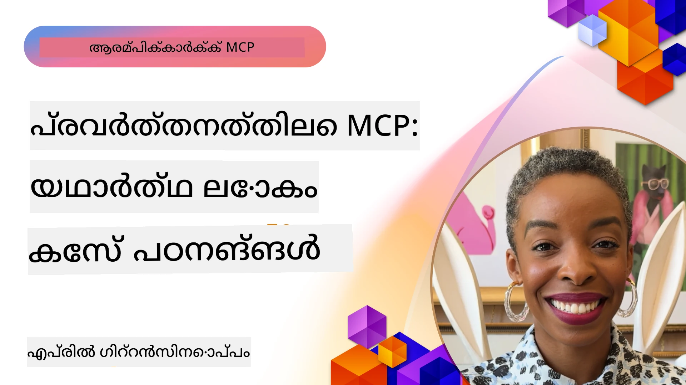

# MCP പ്രവർത്തനത്തിൽ: യാഥാർഥ്യకേസുകൾ

_(ഈ പാഠത്തിന്റെ വീഡിയോ കാണാൻ മേൽക്കാണുന്ന ചിത്രത്തിൽ ക്ലിക്ക് ചെയ്യുക)_

Model Context Protocol (MCP) എങ്ങനെ AI ആപ്ലിക്കേഷനുകൾ ഡാറ്റ, ഉപകരണങ്ങൾ, സേവനങ്ങൾ എന്നിവയുമായി ബന്ധപ്പെടുന്നു എന്നത് സ്വതന്ത്രായി മാറ്റുകയാണ്. വ്യത്യസ്ത വ്യവസായ സാഹചര്യങ്ങളിൽ MCP പ്രായോഗികമായി എങ്ങനെ ഉപയോഗപ്രദമാകുന്നുവെന്ന് ഈ അദ്ധായം യാഥാർഥ്യകേസുകൾ വഴിയും പ്രദർശിപ്പിക്കുന്നു.

## അവലോകനം

ഈ ഭാഗം MCP നടപ്പാക്കലുകളുടെ കാഴ്ച്ചകൾ നല്കുന്നു, ഈ പ്രോട്ടോകോൾ ഉപയോഗിച്ച് സ്ഥാപനങ്ങൾ എങ്ങനെ സങ്കീർണ്ണമായ ബിസിനസ് വെല്ലുവിളികൾ പരിഹരിക്കുകയാണ് എന്നതിനെ കുറിച്ച് പ്രകാശിപ്പിക്കുന്നു. ഈ കേസ് സ്റ്റഡികൾ പരിശോധിച്ച്, MCP ന്റെ വ്യത്യസ്തത, സ്കെയിലബിലിറ്റി, പ്രായോഗിക ഗുണങ്ങൾ എന്നിവയെക്കുറിച്ച് വിശദമായ അറിവുകൾ നിങ്ങൾക്ക് ലഭിക്കും.

## പ്രധാന പഠന ലക്ഷ്യങ്ങൾ

ഈ കേസുകൾ പരിശോധിച്ച്, നിങ്ങൾക്ക് സാധിക്കും:

- MCP വഴി പ്രത്യേക ബിസിനസ് പ്രശ്നങ്ങൾ എങ്ങനെ പരിഹരിക്കാമെന്നു മനസിലാക്കുക  
- വ്യത്യസ്ത ഇന്‍റഗ്രേഷന്‍ മാതൃകകളും ആർക്കിടെക്ചറൽ സമീപനങ്ങളും പഠിക്കുക  
- എന്റർപ്രൈസ് പരിതസ്ഥിതികളിൽ MCP നടപ്പിലാക്കലിന്റെ മികച്ച രീതികൾ തിരിച്ചറിയുക  
- യാഥാർഥ്യ നടപ്പാക്കലിൽ നേരിടുന്ന വെല്ലുവിളികളെയും പരിഹാരങ്ങളെയും കുറിച്ചുള്ള അറിവുകൾ നേടുക  
- നിങ്ങളുടെ സ്വന്തം പദ്ധതികളിൽ സമാനമായ മാതൃകകൾ പ്രയോഗിക്കാനുള്ള അവസരങ്ങൾ കണ്ടെത്തുക  

## മുഖ്യപ്പെട്ട കേസ് സ്റ്റഡികൾ

### 1. [Azure AI ട്രാവൽ ഏജന്റുകൾ – റഫറൻസ് നടപ്പാക്കൽ](./travelagentsample.md)

Microsoft ന്റെ മൂല്യവാനമായ റഫറൻസ് പരിഹാരമാണ് ഈ കേസ് സ്റ്റഡി പരിശോധിക്കുന്നത്. MCP, Azure OpenAI, Azure AI Search എന്നിവ ഉപയോഗിച്ച് മൾട്ടി ഏജന്റ്, AI ശക്തികരിച്ച ട്രാവൽ പ്ലാനിങ് ആപ് എങ്ങനെ നിർമ്മിക്കാമെന്ന് ഇത് പ്രദർശിപ്പിക്കുന്നു. പദ്ധതിയിൽ ഉൾക്കൊള്ളുന്നു:

- MCP വഴി മൾട്ടി ഏജന്റ് ഓർക്കസ്‌ട്രേഷൻ  
- Azure AI Search ഉപയോഗിച്ച് എന്റർപ്രൈസ് ഡാറ്റ ഇന്റഗ്രേഷൻ  
- Azure സേവനങ്ങൾ ഉപയോഗിച്ചുള്ള സുരക്ഷിതവും സ്കെയിലബിൾ ആർക്കിടെക്ചർ  
- പുനരുപയോഗിക്കാവുന്ന MCP ഘടകങ്ങളുടെ സഹായത്തോടെ توسീരണീയ ഉപകരണങ്ങൾ  
- Azure OpenAI ശക്തീകരിച്ച സംഭാഷണ ഉപയോക്തൃ അനുഭവം  

ആർക്കിടെക്ചറും നടപ്പാക്കലിന്റെ വിശദാംശങ്ങളും MCP ഏകീകരണ ലെയറായി ഉപയോഗിച്ച് സങ്കീർണ്ണമായ മൾട്ടി ഏജന്റ് സംവിധാനങ്ങൾ നിർമ്മിക്കുന്നതിന് മൂല്യവത്തായ അറിവുകൾ നൽകുന്നു.

### 2. [YouTube ഡാറ്റയിൽ നിന്ന് Azure DevOps ഇനങ്ങൾ അപ്ഡേറ്റ് ചെയ്യൽ](./UpdateADOItemsFromYT.md)

വർക്ക്‌ഫ്ലോ പ്രക്രിയകൾ സ്വയം പ്രവർത്തിപ്പിക്കാനായി MCP ഉപയോഗിക്കുന്ന പ്രായോഗിക ഉദാഹരണമാണ് ഈ കേസ് സ്റ്റഡി. ഇതിൽ കാണുന്നത്:

- ഓൺലൈൻ പ്ലാറ്റ്ഫോമുകളിൽ നിന്നുള്ള (YouTube) ഡാറ്റ എടുക്കൽ  
- Azure DevOps സിസ്റ്റങ്ങളിലെ വർക്ക്ഐറ്റങ്ങൾ അപ്ഡേറ്റ് ചെയ്യൽ  
- ആവർത്തന automation workflows സൃഷ്ടിക്കൽ  
- വ്യത്യസ്ത സിസ്റ്റങ്ങളിൽ ഡാറ്റ ഇന്റഗ്രേറ്റ് ചെയ്യുക  

ഈ ഉദാഹരണം ഒട്ടും സൗമ്യേ അല്ലാത്ത MCP നടപ്പാക്കലുകൾ എത്രത്തോളം കാര്യക്ഷമത വർദ്ധിപ്പിക്കാനും സിസ്റ്റം ഡാറ്റ സമയബന്ധിതം മെച്ചപ്പെടുത്താനും കഴിയുമെന്ന് കാണിക്കുന്നു.

### 3. [MCP ഉപയോഗിച്ച് യാഥാർഥ്യ സമയ ഡോക്യുമെന്റേഷൻ റിട്രീവൽ](./docs-mcp/README.md)

Python കൺസോൾ ക്ലയന്റ് ഉപയോഗിച്ച് Model Context Protocol (MCP) സെർവറുമായി ബന്ധപ്പെടുകയും യാഥാർഥ്യസമയം, സാന്ദർഭ്യബോധമുള്ള Microsoft ഡൊക്യുമെന്റേഷൻ സ്വന്തമാക്കുകയും ചെയ്യാൻ ഈ കേസ് സ്റ്റഡി മാർഗ്ഗനിർദ്ദേശം നൽകുന്നു. ഇവിടെ നിങ്ങൾ പഠിക്കും:

- MCP സെർവറുമായി Python ക്ലയന്റ്, ഔദ്യോഗിക MCP SDK ഉപയോഗിച്ച് ബന്ധം സ്ഥാപിക്കൽ  
- കാര്യക്ഷമമായ യാഥാർഥ്യസമയം ഡാറ്റ ലഭ്യമാക്കാനായി സ്റ്റ്രീമിംഗ് HTTP ക്ലയന്റ് ഉപയോഗിക്കൽ  
- സെർവറിൽ ഡോക്യൂമെന്റേഷൻ ഉപകരണങ്ങൾ വിളിച്ച് പ്രതികരണങ്ങൾ നേരിട്ട് കൺസോളിൽ രേഖപ്പെടുത്തൽ  
- പ_terminal_ ഒഴിഞ്ഞ് Microsoft ഡൊക്യുമെന്റേഷൻ ഇപ്പോഴത്തെ നിലയിൽ നിങ്ങളുടെ വർക്ക്ഫ്‌ളോയിൽ ഉൾപ്പെടുത്തുക  

ചാപ്റ്ററിൽ ഹാൻഡ്‌സ്-ഓൺ അസൈൻമെന്റും, കുറഞ്ഞ കോഡ് സാമ്പിളും, കൂടുതൽ പഠന സഹായകമായ ലിങ്കുകളും ഉൾപ്പെടുത്തിയിട്ടുണ്ട്. MCP ഡൊക്യുമെന്റേഷന്‍ ആക്‌സസ് മാറ്റുകയും ഡെവലപ്പർ ഉൽപാദകത്വം വർധിപ്പിക്കുകയുമാണ് ഈ നൈപുണ്യം പ്രദർശിപ്പിക്കുന്നത്.

### 4. [MCP ഉപയോഗിച്ച് ഇന്ററാക്ടീവ് സ്റ്റഡി പ്ലാൻ ജനറേറ്റർ വെബ് ആപ്പ്](./docs-mcp/README.md)

Chainlit ഉപയോഗിച്ച് MCP സംയോജിപ്പിച്ച് ഏതെങ്കിലും വിഷയത്തിനും വ്യക്തിഗത പഠന പദ്ധതികൾ സൃഷ്ടിക്കാൻ ഈ കേസ് സ്റ്റഡി ഉദ്ദേശിക്കുന്നു. ഉപയോക്താക്കൾക്ക് വിഷയം (ഉദാ: "AI-900 സര്‍ട്ടിഫിക്കേഷൻ") ഒരു പഠനകാലയളവു (ഉദാ: 8 ആഴ്ച) നൽകാം, ആപ് ആഴ്ചവാരം അടിസ്ഥാനമാക്കിയുള്ള ശുപാർശയായ ഉള്ളടക്കം നൽകി ഉണ്ട്. Chainlit സംഭാഷണ ചാറ്റ് ഇന്റർഫേസ് സജ്ജമാക്കുന്നു, അതിലൂടെ അനുഭവം ആകർഷകവും അഥവാരൂപവുമാകും.

- Chainlit ശക്തിയുള്ള സംഭാഷണ വെബ് ആപ്പ്  
- വിഷയം, കാലാവധി എന്നിവയിലേക്കുള്ള ഉപയോക്തൃ പ്രമ്പ്റ്റുകൾ  
- MCP ഉപയോഗിച്ച് ആഴ്ച്ച തോറും ഉള്ളടക്കം ശിപാർശകൾ  
- Real-time adaptive chat responses  

ഈ പ്രോജക്റ്റ് വിവരിക്കുന്നു എങ്ങനെ സംഭാഷണ AIയും MCP യും സംയോജിപ്പിച്ച് ആധുനിക വെബ് പരിതസ്ഥിതിയിലു ഉപയോഗക്കാരനു കൈമാറാവുന്ന വിദ്യാഭ്യാസ ഉപകരണങ്ങൾ തയ്യാറാക്കാമെന്ന്.

### 5. [VS Code-ൽ MCP സെർവർ ഉപയോഗിച്ച് ഇൻ-എഡിറ്റർ ഡോക്സുകൾ](./docs-mcp/README.md)

MCP സെർവർ ഉപയോഗിച്ച് Microsoft Learn ഡോക്യുമെന്റേഷനുകൾ നേരിട്ട് VS Code ൽ ലഭ്യമാക്കാൻ ഈ കേസ് സ്റ്റഡി കാണിക്കുന്നു—ഇനി ബ്രൗസർ ടാബുകൾ മാറ്റി പോകേണ്ടതില്ല! ഇതിൽ കാണാം:

- MCP പാനൽ അല്ലെങ്കിൽ കമാൻഡ് പാലറ്റ് ഉപയോഗിച്ച് ഡോക്സ് ഉടനടി VS Code ൽ തിരയുകയും വായിക്കുകയും ചെയ്യുക  
- README അല്ലെങ്കിൽ കോഴ്സ് മാർക്ക്‌ ഡൗൺ ഫയലുകളിൽ ലിങ്കുകൾ നിക്ഷേപിക്കുക  
- GitHub Copilot, MCP എന്നിവ സംയോജിപ്പിച്ച് AI ശക്തമായ ഡോക്സ്-കോഡ് വർക്ക്ഫ്ലോ  
- യഥാർഥസമയം ഫീഡ്ബാക്ക് നൽകി ഡോക്സ് സാധുത ഉറപ്പാക്കുക  
- GitHub വർക്ക്ഫ്ലോക്‌സുമായി MCP സംയോജിപ്പിച്ച് തുടർച്ചയായ ഡോക്യുമെന്റ് സാധുത ഉറപ്പാക്കൽ  

ഇവ تشمل:

- .vscode/mcp.json ലളിതമായ സജ്ജീകരണത്തിനുള്ള ഉദാഹരണം  
- ഇൻ-എഡിറ്റർ അനുഭവത്തിന്റെ സ്ക്രീൻഷോട്ട് ആധാരമായ മാർഗ്ഗനിർദ്ദേശം  
- Copilot, MCP സംയോജിപ്പിച്ച് ഉൽപാദകത്വം പരമാവധി ആക്കാനുള്ള ടിപ്‌സ്  

കോഴ്സ് രചയിതാക്കൾക്കും ഡോക്യുമെന്റ് സ്രഷ്ടാക്കൾക്കും ഡെവലപ്പർമാർക്കും ഇതു ഏറ്റവും അനുയോജ്യമാണ്, അവർ ഡോക്സ്, Copilot, സാധുതപഠന ഉപകരണങ്ങൾ എല്ലാം ഉപയോഗിച്ച് എഡിറ്റർ അനന്തരമായി ശ്രദ്ധ കേന്ദ്രീകരിച്ചുകൊണ്ട് ജോലി ചെയ്യാൻ.

### 6. [APIM MCP സെർവർ നിർമ്മാണം](./apimsample.md)

Azure API Management (APIM) ഉപയോഗിച്ച് MCP സെർവർ എങ്ങനെ സൃഷ്ടിക്കാമെന്ന് ഈ കേസ് സ്റ്റഡി ഘട്ടംഘട്ടമായ മാർഗ്ഗനിർദ്ദേശം നൽകുന്നു. ഇതിൽ ഉൾക്കൊള്ളുന്നു:

- Azure API Management-ൽ MCP സെർവർ സജ്ജമാക്കൽ  
- API പ്രവർത്തനങ്ങളെ MCP ടൂളുകളായി പുറത്താക്കൽ  
- നിരക്ക് നിയന്ത്രണവും സുരക്ഷയും ഉറപ്പാക്കാൻ നയങ്ങൾ ക്രമീകരിക്കൽ  
- Visual Studio Code, GitHub Copilot ഉപയോഗിച്ച് MCP സെർവർ ടെസ്റ്റ് ചെയ്യൽ  

Azure-വിന്റെ ശേഷികൾ പ്രയോജനപ്പെടുത്തി ശക്തമായ MCP സെർവർ സൃഷ്ടിക്കുന്നതിൻറെ ഒരു ഉദാഹരണം ഇത്, വിവിധ ആപ്ലിക്കേഷനിലും എന്റർപ്രൈസ് API-കളുമായി AI സമ്പർക്കം മെച്ചപ്പെടുത്തുന്നു.

### 7. [GitHub MCP റജിസ്ട്രി — ഏജന്റ് സംയോജനം വേഗതപ്പെടുത്തൽ](https://github.com/mcp)

സെപ്റ്റംബർ 2025-ന് ആരംഭിച്ച GitHub MCP Registry എങ്ങനെ AI പാർശ്വപ്രവർത്തന വിജയലക്ഷണമായ Model Context Protocol (MCP) സെർവറുകളുടെ തിരഞ്ഞെടുത്തു വിന്യാസം മൂലം ഉണ്ടായിരുന്ന വെല്ലുവിളി പരിഹരിക്കുന്നു എന്നത് പരിശോധിക്കുന്നു.

#### അവലോകനം  
**MCP Registry** വ്യാപകമായി സ്ഥാപിതമായ MCP സെർവറുകളുടെ വിതരണവും രജിസ്ട്രി പാളികൾ മാറ്റം വരുത്തുന്നു, മുൻപ് ഇന്റഗ്രേഷൻ മന്ദഗതിയിലും പിശകുകളിലുമായിരുന്നു. ഈ സെർവറുകൾ API, ഡാറ്റാബേസ്, ഡോക്യുമെന്റേഷൻ ഉറവിടങ്ങൾ പോലുള്ള ബാഹ്യ സംവിധാനങ്ങളുമായി AI ഏജന്റുകൾക്ക് ഇടപഴകാൻ സഹായിക്കുന്നു.

#### പ്രശ്നാവസ്ഥ  
ഏജന്റ് വർക്ക്‌ഫ്ലോകൾ നിർമ്മിക്കുന്ന ഡെവലപ്പർമാർ പല പ്രശ്നങ്ങളുമോർത്തു:

- വ്യത്യസ്ത പ്ലാറ്റ്ഫോമുകളിൽ MCP സെർവറുകളുടെ കുറഞ്ഞ കണ്ടെത്താവൽ  
- ഫോറങ്ങളിലെയും ഡോക്യുമെന്റേഷനുകളിലെയും ആവർത്തിക്കുന്ന ക്രമീകരണ ചോദ്യങ്ങൾ  
- അനുമതിയില്ലാത്ത ഉറവിടങ്ങളിൽ നിന്നുള്ള സുരക്ഷാ ഭീഷണികൾ  
- സെർവർ ഗുണമേന്മയിലും പൊരുത്തത്തിലും മാനദണ്ഡ ലംഘനം  

#### പരിഹാര ആർക്കിടെക്ചർ  
GitHub MCP Registry വിശ്വസനീയ MCP സെർവറുകൾ കേന്ദ്രികരണം ചെയ്യുന്നു, പ്രധാന സവിശേഷതകൾ:

- VS Code വഴിയുള്ള ഒറ്റ ക്ലിക്കിൽ ഇൻസ്റ്റാൾ ഇന്റഗ്രേഷൻ  
- നക്ഷത്രങ്ങൾ, പ്രവർത്തനം, സമൂഹ സാധുത അടിസ്ഥാനമാക്കി ശബ്‌ദത്തിനുമീതെയുള്ള സിഗ്നൽ തിരഞ്ഞെടുപ്പ്  
- GitHub Copilot, മറ്റ് MCP ഉപകരണങ്ങളുമായി നേരിട്ടുള്ള സംയോജനം  
- തുറന്ന സംഭാവനാ മാതൃക, സമൂഹവും എന്റർപ്രൈസും പങ്കുവെക്കുന്നത് സാധ്യമാക്കുന്നു  

#### ബിസിനസ് പ്രഭാവം  
റജിസ്ട്രി ന്റെ ഫലങ്ങൾ:

- Microsoft Learn MCP Server പോലുള്ള ഉപകരണങ്ങൾ ഉപയോഗിക്കുന്ന ഡെവലപ്പർമാർക്ക് വേഗത്തിലുള്ള ഓൺബോർഡിങ്  
- `github-mcp-server` പോലുള്ള സവിശേഷ സെർവറുകളുടെ സഹായത്തോടെ ഗിറ്റ്ഹബ് ഓട്ടോമേഷൻ (PR സൃഷ്ടി, CI പുനരാരംഭം, കോഡ് സ്കാനിംഗ്) കൂടുതൽ ഉൽപ്പാദകത്വം  
- ക്യൂറേറ്റഡ് ലിസ്റ്റിംഗുകൾ, സുതാര്യമായ ക്രമീകരണ മാനദണ്ഡങ്ങൾ വഴി ecosystem-ൽ വിശ്വാസം വളർത്തും  

#### തന്ത്രപരമായ മൂല്യം  
ഏജന്റ് ലൈഫ്‌സൈക്കിൾ മാനേജുമെൻറും പുനരുത്പാദന 工作流程 ന് പ്രത്യേകിച്ചുള്ള വിദഗ്ധർക്കായി MCP Registry നൽകുന്നത്:

- സ്റ്റാൻഡേർഡ് ഘടകങ്ങളോടുകൂടിയ മോഡുലാർ ഏജന്റ് വിന്യാസം  
- സമാനമായ പരിശോധനകൾക്കും സാധുതയ്ക്ക് രജിസ്ട്രി പിന്തുണ  
- വ്യത്യസ്ത AI പ്ലാറ്റ്ഫോമുകൾക്കിടയിലെ പരസ്പര പ്രവർത്തനം  

ഈ കേസ് സ്റ്റഡി MCP Registry ലേഖനമാത്രമല്ല, സ്കെയിലബിളും യാഥാർഥ്യ അനുഭവമുള്ള മോഡൽ സംയോജനത്തിന്റെയും ഏജന്റ് സംവിധാന വിന്യാസത്തിന്റെയും അടിസ്ഥാന പ്ലാറ്റ്ഫോമായിട്ടുള്ളത് എന്നാണ് സൂചിപ്പിക്കുന്നത്.

## സമാപനമായുള്ള സന്ദേശം

ഈ ഏഴ് സമഗ്ര യാഥാർഥ്യകേസുകൾ Model Context Protocol വ്യത്യസ്ത യാഥാർഥ്യ സാഹചര്യങ്ങളിലെ അതുല്യമായ വൈവിധ്യവും പ്രായോഗികമായ ഉപയോഗവും തെളിയിക്കുന്നു. സങ്കീർണ്ണമായ മൾട്ടി ഏജന്റ് ട്രാവൽ പ്ലാനിങ്ങ് സിസ്റ്റംമുന്‍പേലും, എന്റർപ്രൈസ് API മാനേജുമെന്റും തുടങ്ങി സുതാര്യമായ ഡോക്യുമെന്റേഷൻ പ്രവൃത്തികളും വിപ്ലവകരമായ GitHub MCP Registry വരെ, MCP എങ്ങനെ ഒരു സ്റ്റാൻഡേർഡ്, സ്കെയിലബിള്‍ വഴി AI സംവിധാനങ്ങളെ ആവശ്യമായ ഉപകരണങ്ങൾ, ഡാറ്റ, സേവനങ്ങൾ എന്നിവയുമായി ബന്ധിപ്പിക്കാൻ സഹായിക്കുന്നുവെന്ന് ഈ ഉദാഹരണങ്ങൾ കാണിക്കുന്നു.

MCP നടപ്പിലാക്കലിന്റെ വിവിധ维度:

- **എന്റർപ്രൈസ് ഇന്റഗ്രേഷൻ**: Azure API മാനേജുമെന്റ്, Azure DevOps ഓട്ടോമേഷൻ  
- **മൾട്ടി ഏജന്റ് ഓർക്കസ്‌ട്രേഷൻ**: ഏകോപിപ്പിച്ച AI ഏജന്റുകളുമായുള്ള യാത്രാ പദ്ധതിയിടൽ  
- **ഡെവലപ്പർ ഉൽപാദകത്വം**: VS Code സംയോജനം, യാഥാർഥ്യസമയം ഡോക്യുമെന്റേഷന് ആക്‌സസ്  
- **ഇക്കോസിസ്റ്റം വികസനം**: GitHub MCP Registry അടിസ്ഥാന പ്ലാറ്റ്ഫോമായി  
- **ശിക്ഷണ പ്രയോഗങ്ങൾ**: ഇന്ററാക്ടീവ് സ്റ്റഡി പ്ലാൻ ജനറേറ്ററുകളും സംഭാഷണ ഇന്റർഫേസുകളും  

ഈ നടപ്പാക്കലുകൾ പഠിച്ച് നിങ്ങൾക്ക് കിട്ടും:

- വ്യത്യസ്ത സ്‌കെയിലിലും ഉപയോഗകേസ് വുമുള്ള ആർച്ചിടെക്ചറൽ മാതൃകകൾ  
- പ്രവർത്തനക്ഷമതയും പരിപാലനക്ഷമതയും തുല്യമായ നടപ്പിക്കൽ തന്ത്രങ്ങൾ  
- ഉത്പാദന വിന്യാസങ്ങളിലെ സുരക്ഷയും സ്കെയിലബിലിറ്റിയും  
- MCP സെർവർ വികസനത്തിനും ക്ലയന്റ് ഇന്റഗ്രേഷനും മികച്ച രീതി  
- പരസ്പര ബന്ധമുള്ള AI സംവിധാനങ്ങൾ നിർമ്മിക്കുന്ന ഇക്കോസിസ്റ്റം ചിന്തന  

ഈ ഉദാഹരണങ്ങൾ MCP ഒരു സിദ്ധാന്തപരമായ രൂപരേഖ മാത്രമല്ല, സങ്കീർണ്ണമായ ബിസിനസ് വെല്ലുവിളികൾ പരിഹരിക്കാനാവുന്ന ഒരു പാഠഭാഗമായ പ്രോട്ടോകോൾ എന്നും തെളിയിക്കുന്നു. ലളിതമായ ഓട്ടോമേഷൻ ഉപകരണങ്ങളോ, സങ്കീർണ്ണമായ മൾട്ടി ഏജന്റ് സംവിധാനങ്ങളോ നിർമ്മിക്കുമ്പോഴും ഇവിടെ കാണിച്ച മാതൃകകളും സമീപനങ്ങളും നിങ്ങളുടെ MCP പദ്ധതികൾക്കായി ഉറപ്പുള്ള അടിസ്ഥാനവുമായിരിക്കും.

## അധിക സ منابع

- [Azure AI Travel Agents GitHub Repository](https://github.com/Azure-Samples/azure-ai-travel-agents)
- [Azure DevOps MCP Tool](https://github.com/microsoft/azure-devops-mcp)
- [Playwright MCP Tool](https://github.com/microsoft/playwright-mcp)
- [Microsoft Docs MCP Server](https://github.com/MicrosoftDocs/mcp)
- [GitHub MCP Registry — Accelerating Agentic Integration](https://github.com/mcp)
- [MCP Community Examples](https://github.com/microsoft/mcp)

## അടുത്തത്

- മുൻപ്: [മൊഡ്യൂൾ 8: ഏറ്റവും മികച്ച പ്രാക്ടീസ്](../08-BestPractices/README.md)
- അടുത്തത്: [മൊഡ്യൂൾ 10: AI വർക്ക്ഫ്ലോകൾ സ്ട്രീംലൈൻ ചെയ്യൽ: AI ടൂൾകിറ്റ് ഉപയോഗിച്ച് MCP സെർവർ നിർമ്മാണം](../10-StreamliningAIWorkflowsBuildingAnMCPServerWithAIToolkit/README.md)

---

<!-- CO-OP TRANSLATOR DISCLAIMER START -->
**അസംബന്ധം**:  
ഈ രേഖ AI തർജ്ജമാ സർവീസ് [Co-op Translator](https://github.com/Azure/co-op-translator) ഉപയോഗിച്ച് തർജ്ജിമചെയ്തതാണ്. നാം രൂക്ഷതയ്ക്ക് പരിശ്രമിക്കുന്നുണ്ടെങ്കിലും, സ്വയം പ്രവർത്തിക്കുന്ന തർജ്ജമകളിൽ പിഴവുകളും അശുദ്ധികളും ഉണ്ടാകാമെന്നും ദയവായി ശ്രദ്ധിക്കുക. മൂല രേഖ അതിന്റെ സ്വതന്ത്രഭാഷയിലുള്ളതായിട്ടാണ് ഔദ്യോഗിക ഉറവിടമായി കണക്കാക്കേണ്ടത്. നിർണായക വിവരങ്ങൾക്ക്, പ്രൊഫഷണൽ മനുഷ്യ തർജ്ജമ ശിപാർശ ചെയ്യപ്പെടുന്നു. ഈ തർജ്ജമ ഉപയോഗിക്കുന്നതിനാൽ ഉണ്ടാകുന്ന ഏതൊരു തെറ്റിദ്ധാരണയ്ക്കും അല്ലെങ്കിൽ വ്യാഖ്യാനത്തിൽ ഉണ്ടായ പിശകുകൾക്കും ഞങ്ങൾ ഉത്തരവാദിത്വം ഏറ്റെടുക്കുന്നില്ല.
<!-- CO-OP TRANSLATOR DISCLAIMER END -->