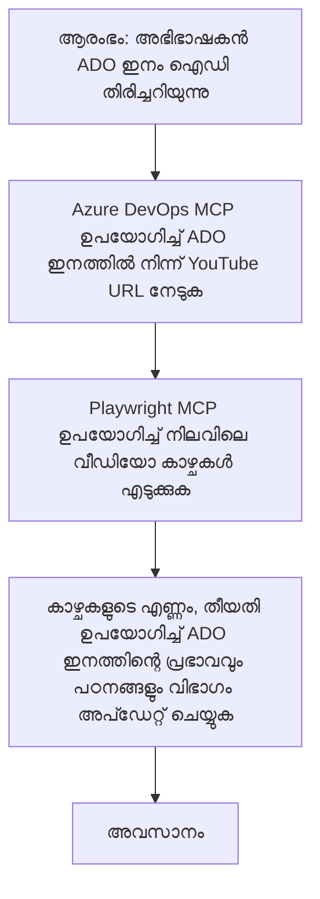

<!--
CO_OP_TRANSLATOR_METADATA:
{
  "original_hash": "14a2dfbea55ef735660a06bd6bdfe5f3",
  "translation_date": "2025-12-11T10:38:10+00:00",
  "source_file": "09-CaseStudy/UpdateADOItemsFromYT.md",
  "language_code": "ml"
}
-->
# കേസ് സ്റ്റഡി: MCP ഉപയോഗിച്ച് YouTube ഡാറ്റയിൽ നിന്നുള്ള Azure DevOps ഇനങ്ങൾ അപ്ഡേറ്റ് ചെയ്യൽ

> **അസൂയാ:** YouTube പോലുള്ള പ്ലാറ്റ്ഫോമുകളിൽ നിന്നുള്ള ഡാറ്റ ഉപയോഗിച്ച് Azure DevOps ഇനങ്ങൾ അപ്ഡേറ്റ് ചെയ്യാനുള്ള പ്രക്രിയ ഓട്ടോമേറ്റ് ചെയ്യാൻ നിലവിലുള്ള ഓൺലൈൻ ടൂളുകളും റിപ്പോർട്ടുകളും ഉണ്ട്. താഴെ കൊടുത്തിരിക്കുന്ന സീനാരിയോ MCP ടൂളുകൾ ഓട്ടോമേഷൻ, ഇന്റഗ്രേഷൻ ടാസ്കുകൾക്കായി എങ്ങനെ പ്രയോഗിക്കാമെന്ന് കാണിക്കുന്ന ഒരു സാമ്പിൾ ഉപയോഗകേസായി മാത്രമാണ്.

## അവലോകനം

ഈ കേസ് സ്റ്റഡി മോഡൽ കോൺടെക്സ്റ്റ് പ്രോട്ടോക്കോൾ (MCP)യും അതിന്റെ ടൂളുകളും ഉപയോഗിച്ച് YouTube പോലുള്ള ഓൺലൈൻ പ്ലാറ്റ്ഫോമുകളിൽ നിന്നുള്ള വിവരങ്ങൾ ഉപയോഗിച്ച് Azure DevOps (ADO) വർക്ക് ഇനങ്ങൾ അപ്ഡേറ്റ് ചെയ്യാനുള്ള പ്രക്രിയ എങ്ങനെ ഓട്ടോമേറ്റ് ചെയ്യാമെന്ന് ഒരു ഉദാഹരണമായി കാണിക്കുന്നു. വിവരണത്തിലുള്ള സീനാരിയോ ഈ ടൂളുകളുടെ വ്യാപക ശേഷികളുടെ ഒരു ഉദാഹരണമാണ്, ഇത് സമാനമായ നിരവധി ഓട്ടോമേഷൻ ആവശ്യങ്ങൾക്കായി അനുയോജ്യമായി മാറ്റാം.

ഈ ഉദാഹരണത്തിൽ, ഒരു അഡ്വക്കേറ്റ് ADO ഇനങ്ങൾ ഉപയോഗിച്ച് ഓൺലൈൻ സെഷനുകൾ ട്രാക്ക് ചെയ്യുന്നു, ഓരോ ഇനത്തിലും YouTube വീഡിയോ URL ഉൾപ്പെടുന്നു. MCP ടൂളുകൾ ഉപയോഗിച്ച്, അഡ്വക്കേറ്റ് ADO ഇനങ്ങളെ ഏറ്റവും പുതിയ വീഡിയോ മെട്രിക്‌സ്, ഉദാഹരണത്തിന്, വ്യൂ കൗണ്ടുകൾ എന്നിവയുമായി ആവർത്തനീയവും ഓട്ടോമേറ്റഡുമായ രീതിയിൽ അപ്ഡേറ്റ് ചെയ്യാൻ കഴിയും. ഈ സമീപനം ഓൺലൈൻ ഉറവിടങ്ങളിൽ നിന്നുള്ള വിവരങ്ങൾ ADO അല്ലെങ്കിൽ മറ്റ് സിസ്റ്റങ്ങളിലേക്ക് ഇന്റഗ്രേറ്റ് ചെയ്യേണ്ട മറ്റ് ഉപയോഗകേസുകൾക്കും സാധൂകരിക്കാം.

## സീനാരിയോ

ഒരു അഡ്വക്കേറ്റ് ഓൺലൈൻ സെഷനുകളുടെ പ്രഭാവവും കമ്മ്യൂണിറ്റി ഏംഗേജ്മെന്റുകളും ട്രാക്ക് ചെയ്യുന്നതിന് ഉത്തരവാദിയാണ്. ഓരോ സെഷനും 'DevRel' പ്രോജക്ടിലെ ADO വർക്ക് ഇനമായി ലോഗ് ചെയ്യപ്പെടുന്നു, വർക്ക് ഇനത്തിൽ YouTube വീഡിയോ URL ഫീൽഡ് ഉൾപ്പെടുന്നു. സെഷന്റെ എത്തിപ്പെടൽ കൃത്യമായി റിപ്പോർട്ട് ചെയ്യാൻ, അഡ്വക്കേറ്റ് ADO ഇനം നിലവിലെ വീഡിയോ വ്യൂകളുടെ എണ്ണം കൂടാതെ ഈ വിവരങ്ങൾ എപ്പോൾ ശേഖരിച്ചതെന്ന തീയതിയും അപ്ഡേറ്റ് ചെയ്യേണ്ടതുണ്ട്.

## ഉപയോഗിച്ച ടൂളുകൾ

- [Azure DevOps MCP](https://github.com/microsoft/azure-devops-mcp): MCP വഴി ADO വർക്ക് ഇനങ്ങളിൽ പ്രോഗ്രാമാറ്റിക് ആക്സസ്, അപ്ഡേറ്റുകൾ സാധ്യമാക്കുന്നു.
- [Playwright MCP](https://github.com/microsoft/playwright-mcp): YouTube വീഡിയോ സ്റ്റാറ്റിസ്റ്റിക്സ് പോലുള്ള വെബ് പേജുകളിൽ നിന്ന് ലൈവ് ഡാറ്റ എടുക്കാൻ ബ്രൗസർ പ്രവർത്തനങ്ങൾ ഓട്ടോമേറ്റ് ചെയ്യുന്നു.

## ഘട്ടം ഘട്ടമായി പ്രവൃത്തി പ്രവാഹം

1. **ADO ഇനം തിരിച്ചറിയുക**: 'DevRel' പ്രോജക്ടിലെ ADO വർക്ക് ഇനം ഐഡി (ഉദാ: 1234) ഉപയോഗിച്ച് ആരംഭിക്കുക.
2. **YouTube URL ലഭിക്കുക**: Azure DevOps MCP ടൂൾ ഉപയോഗിച്ച് വർക്ക് ഇനത്തിൽ നിന്നുള്ള YouTube URL നേടുക.
3. **വീഡിയോ വ്യൂകൾ എടുക്കുക**: Playwright MCP ടൂൾ ഉപയോഗിച്ച് YouTube URL-ലേക്ക് പോകുകയും നിലവിലെ വ്യൂ കൗണ്ട് എടുക്കുകയും ചെയ്യുക.
4. **ADO ഇനം അപ്ഡേറ്റ് ചെയ്യുക**: Azure DevOps MCP ടൂൾ ഉപയോഗിച്ച് 'Impact and Learnings' വിഭാഗത്തിൽ ഏറ്റവും പുതിയ വ്യൂ കൗണ്ട്, ശേഖരണ തീയതി എന്നിവ എഴുതുക.

## ഉദാഹരണ പ്രോംപ്റ്റ്

```bash
- Work with the ADO Item ID: 1234
- The project is '2025-Awesome'
- Get the YouTube URL for the ADO item
- Use Playwright to get the current views from the YouTube video
- Update the ADO item with the current video views and the updated date of the information
```

## Mermaid Flowchart


## സാങ്കേതിക നടപ്പാക്കൽ

- **MCP ഓർക്കസ്ട്രേഷൻ**: Azure DevOps MCP, Playwright MCP ടൂളുകളുടെ ഉപയോഗം ഏകോപിപ്പിക്കുന്ന MCP സർവർ വഴി പ്രവൃത്തി പ്രവാഹം ഓർക്കസ്ട്രേറ്റ് ചെയ്യുന്നു.
- **ഓട്ടോമേഷൻ**: പ്രക്രിയ മാനുവലായി ആരംഭിക്കാമോ അല്ലെങ്കിൽ ADO ഇനങ്ങൾ അപ്ഡേറ്റ് ചെയ്യാൻ സ്ഥിരമായ ഇടവേളകളിൽ ഓട്ടോമാറ്റിക്കായി പ്രവർത്തിക്കാമോ.
- **വ്യാപ്തി**: സമാന മാതൃക ഉപയോഗിച്ച് മറ്റ് ഓൺലൈൻ മെട്രിക്‌സ് (ഉദാ: ലൈക്കുകൾ, കമന്റുകൾ) അല്ലെങ്കിൽ മറ്റ് പ്ലാറ്റ്ഫോമുകളിൽ നിന്നുള്ള ഡാറ്റ ഉപയോഗിച്ച് ADO ഇനങ്ങൾ അപ്ഡേറ്റ് ചെയ്യാൻ സാധിക്കും.

## ഫലങ്ങളും പ്രഭാവവും

- **ക്ഷമത**: വീഡിയോ മെട്രിക്‌സ് ശേഖരണവും അപ്ഡേറ്റും ഓട്ടോമേറ്റ് ചെയ്ത് അഡ്വക്കേറ്റുകളുടെ മാനുവൽ ശ്രമം കുറയ്ക്കുന്നു.
- **കൃത്യത**: ADO ഇനങ്ങൾ ഓൺലൈൻ ഉറവിടങ്ങളിൽ നിന്നുള്ള ഏറ്റവും പുതിയ ഡാറ്റ പ്രതിഫലിപ്പിക്കുന്നു.
- **ആവർത്തനക്ഷമത**: സമാന സീനാരിയോകൾക്കായി മറ്റ് ഡാറ്റ ഉറവിടങ്ങളോ മെട്രിക്‌സുകളോ ഉൾപ്പെടുന്ന പുനരുപയോഗയോഗ്യമായ പ്രവൃത്തി പ്രവാഹം നൽകുന്നു.

## റഫറൻസുകൾ

- [Azure DevOps MCP](https://github.com/microsoft/azure-devops-mcp)
- [Playwright MCP](https://github.com/microsoft/playwright-mcp)
- [Model Context Protocol (MCP)](https://modelcontextprotocol.io/)

---

<!-- CO-OP TRANSLATOR DISCLAIMER START -->
**അസൂയാ**:  
ഈ രേഖ AI വിവർത്തന സേവനം [Co-op Translator](https://github.com/Azure/co-op-translator) ഉപയോഗിച്ച് വിവർത്തനം ചെയ്തതാണ്. നാം കൃത്യതയ്ക്ക് ശ്രമിച്ചെങ്കിലും, സ്വയം പ്രവർത്തിക്കുന്ന വിവർത്തനങ്ങളിൽ പിശകുകൾ അല്ലെങ്കിൽ തെറ്റുകൾ ഉണ്ടാകാമെന്ന് ദയവായി ശ്രദ്ധിക്കുക. അതിന്റെ മാതൃഭാഷയിലുള്ള യഥാർത്ഥ രേഖയാണ് പ്രാമാണികമായ ഉറവിടം എന്ന് പരിഗണിക്കേണ്ടതാണ്. നിർണായക വിവരങ്ങൾക്ക്, പ്രൊഫഷണൽ മനുഷ്യ വിവർത്തനം ശുപാർശ ചെയ്യപ്പെടുന്നു. ഈ വിവർത്തനം ഉപയോഗിക്കുന്നതിൽ നിന്നുണ്ടാകുന്ന ഏതെങ്കിലും തെറ്റിദ്ധാരണകൾക്കോ തെറ്റായ വ്യാഖ്യാനങ്ങൾക്കോ ഞങ്ങൾ ഉത്തരവാദികളല്ല.
<!-- CO-OP TRANSLATOR DISCLAIMER END -->