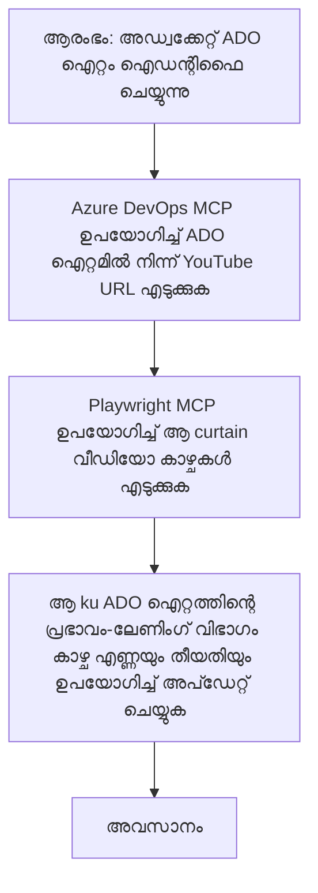

# കേസ് സ്റ്റഡി: MCP ഉപയോഗിച്ച് YouTube ഡാറ്റയിൽ നിന്നുള്ള Azure DevOps ഇനങ്ങൾ അപ്‌ഡേറ്റ് ചെയ്യുന്നു

> **തെളിവ്:** YouTube പോലുള്ള പ്ലാറ്റ്ഫോമുകളിൽ നിന്ന് ഡാറ്റ ഉപയോഗിച്ച് Azure DevOps ഇനങ്ങൾ അപ്‌ഡേറ്റ് ചെയ്യുന്നതിനുള്ള പ്രക്രിയ автоматികമാക്കാൻ സാധിക്കുന്ന നിലവിലുള്ള ഓൺലൈൻ ടൂൾസും റിപ്പോർട്ടുകളും ഉണ്ട്. താഴെ കാണിക്കുന്ന സന്നിവേശം MCP ടൂളുകൾ ഓട്ടോമേഷൻ, സംയോജനം ടാസ്കുകൾക്കായി എങ്ങനെ ഉപയോഗിക്കാമെന്ന് ഉദാഹരണമായി നൽകുന്നു.

## അവലോകനം

ഈ കേസ് സ്റ്റഡി മോഡൽ കോൺടെക്സ്റ്റ് പ്രോട്ടോകോൾ (MCP)യും അതിന്റെ ടൂളുകളും ഉപയോഗിച്ച് ഓൺലൈൻ പ്ലാറ്റ്ഫോമുകളിൽ നിന്ന് ലഭ്യമായ വിവരങ്ങൾ ഉപയോഗിച്ച് Azure DevOps (ADO) വർക്ക് ഇനങ്ങൾ അപ്‌ഡേറ്റ് ചെയ്യാനുള്ള പ്രക്രിയ എളുപ്പമാക്കുന്നത് കാണിക്കുന്നു. അപർവ വിവരങ്ങൾ നൽകുന്ന ഈ സന്നിവേശം MCP ടൂളുകളുടെ വ്യാപക ശേഷികളെ പ്രതിനിധീകരിക്കുന്നു, ഇതു സമാനമായ ഓട്ടോമേഷൻ ആവശ്യങ്ങൾക്കായി ക്രമീകരിക്കാം.

ഈ ഉദാഹരണത്തിൽ, ഒരു അഡ്വക്കേറ്റ് ADO ഇനങ്ങൾ ഉപയോഗിച്ച് ഓൺലൈൻ സെഷനുകൾ ട്രാക്ക് ചെയ്യുന്നു, ഓരോ ഇനത്തിലും YouTube വീഡിയോ URL ഉണ്ട്. MCP ടൂൾസുകളുടെ സായഹ്നത്തോടെ, അഡ്വക്കേറ്റ് വായനാപരിധികളും മറ്റ് വീഡിയോ മെട്രിക്കുകളും അപ്‌ടുഡേറ്റ് ചെയ്യുന്നവയെ പുനരാവൃത്തി മൂലം സ്വയമെന്നിങ്ങനെ മെയിൻറ്റ് ചെയ്യാനാകും. ഈ സമീപനം മറ്റുള്ള പ്രയോജനങ്ങൾക്കും സാധാരണമാക്കാവുന്നതാണ്, പ്രത്യേകിച്ച് ഓൺലൈൻ സ്രോതസ്സുകളിൽ നിന്ന് ലഭിക്കുന്ന വിവരങ്ങൾ ADO അല്ലെങ്കിൽ മറ്റ് സിസ്റ്റങ്ങൾക്കൊപ്പം സംയോജിപ്പിക്കേണ്ടപ്പോൾ.

## സന്നിവേശം

ഒരു അഡ്വക്കേറ്റ് ഓൺലൈൻ സെഷനുകളും കമ്മ്യൂണിറ്റി എൻഗേജ്മെന്റുകളും എങ്ങനെ ബാധിച്ചിട്ടുണ്ടെന്ന് ട്രാക്ക് ചെയ്യേണ്ടതിനുള്ള ഉത്തരവാദിത്തം വഹിക്കുന്നു. ഓരോ സെഷനും 'DevRel' പ്രോജക്ടിലെ ADO വർക് ഇനമായി ലോഗ് ചെയ്യപ്പെടുന്നു, അതിലും YouTube വീഡിയോ URL ഉൾപ്പെടുന്ന ഒരു ഫീൽഡുണ്ട്. സെഷന്റെ വ്യാപ്തി ശരിയായി റിപ്പോർട്ട് ചെയ്യാൻ, അഡ്വക്കേറ്റ് ADO ഇനം ഇപ്പോഴുള്ള വീഡിയോ കാഴ്ചകൾ സംഖ്യയും ഈ വിവരങ്ങൾ എപ്പോൾ ശേഖരിച്ചുവോ ആ തീയതിയും അപ്‌ഡേറ്റ് ചെയ്യേണ്ടതുണ്ട്.

## ഉപയോഗിച്ച ടൂളുകൾ

- [Azure DevOps MCP](https://github.com/microsoft/azure-devops-mcp): MCP വഴി ADO വർക്ക് ഇനങ്ങളിൽ പ്രോഗ്രാമാറ്റിക് ആക്‌സസ്‌വും അപ്‌ഡേറ്റും സാധ്യമാക്കുന്നു.
- [Playwright MCP](https://github.com/microsoft/playwright-mcp): ബ്രൗസർ പ്രവർത്തനങ്ങൾ ഓട്ടോമേറ്റുചെയ്യുന്നു, ഉദാഹരണത്തിന് YouTube വീഡിയോ სტატിസ്റ്റिक्स പോലുള്ള ലൈവ് ഡാറ്റ എടുക്കാൻ.

## ഘട്ടം ഘട്ടമായ പ്രവർത്തനക്രമം

1. **ADO ഐഡന്റിഫൈ ചെയ്യുക**: 'DevRel' പ്രോജക്ടിലെ ADO വർക് ഇന ഐഡി (ഉദാ. 1234) എന്നിവ ആരംഭിക്കുക.  
2. **YouTube URL ലഭിക്കുക**: ADO MCP ടൂൾ ഉപയോഗിച്ച് വർക് ഇനത്തിൽ നിന്ന് YouTube URL വാങ്ങുക.  
3. **വീഡിയോ കാഴ്ചകൾ എടുക്കുക**: Playwright MCP ടൂൾ ഉപയോഗിച്ച് YouTube URL സന്ദർശിച്ച് നിലവിലെ കാഴ്ചകൾ എടുക്കുക.  
4. **ADO ഇനം അപ്‌ഡേറ്റ് ചെയ്യുക**: Azure DevOps MCP ടൂൾ ഉപയോഗിച്ച് ഏറ്റവും പുതിയ കാഴ്ചകളുടെ സംഖ്യയും ശേഖരണ തീയതിയും 'Impact and Learnings' бөлімത്തിൽ എഴുതി ADO ഇനം അപ്‌ഡേറ്റ് ചെയ്യുക.

## ഉദാഹരണ പ്രോംപ്‌റ്

```bash
- Work with the ADO Item ID: 1234
- The project is '2025-Awesome'
- Get the YouTube URL for the ADO item
- Use Playwright to get the current views from the YouTube video
- Update the ADO item with the current video views and the updated date of the information
```

## Mermaid Flowchart


## സാങ്കേതിക നടപ്പാക്കൽ

- **MCP ഓർക്കസ്ട്രേഷൻ**: Azure DevOps MCP, Playwright MCP ടൂളുകൾ ഉപയോഗിക്കുന്നത coordinate ചെയ്യുന്നത് MCP സർവറിലൂടെയാണ്.  
- **ഓട്ടോമേഷൻ**: ADO ഇനങ്ങൾ അതിനനുസരിച്ച് അപ്‌ഡേറ്റ് ചെയ്യാൻ പ്രക്രിയ മാന്വൽ അല്ലെങ്കിൽ ഷെഡ്യൂൾ ചെയ്ത രീതിയിലും പ്രവർത്തിക്കാൻ കഴിയും.  
- **വിപുലീകരണക്ഷമത**: മറ്റുള്ള ഓൺലൈൻ മെട്രിക്കുകൾ (ഉദാ., ലൈക്സ്, കമന്റുകൾ) അല്ലെങ്കിൽ മറ്റ് പ്ലാറ്റ്ഫോമുകളിൽ നിന്നും ADO ഇനങ്ങൾ അപ്‌ഡേറ്റ് ചെയ്യാനായി ഇതേ പാറ്റേൺ ഉപയോഗിക്കാം.

## ഫലങ്ങളും പ്രതിഫലവും

- **പ്രവർത്തനക്ഷമത**: അഡ്വക്കേറ്റുകളുടെ മാനുവൽ ശ്രമം കുറയ്ക്കുന്നു, വീഡിയോ മെട്രിക്കുകൾ ശേഖരിക്കുകയും അപ്‌ഡേറ്റ് ചെയ്യുകയും ഓട്ടോമേറ്റ് ചെയ്യുന്നു.  
- **നിഷ്‌ടത**: ADO ഇനങ്ങൾ ഓൺലൈൻ സ്രോതസ്സുകളിൽ നിന്നുള്ള ഏറ്റവും പുതിയ ഡാറ്റ പ്രതിഫലിപ്പിക്കുന്നു.  
- **പുനരാവൃത്തി**: മറ്റു ഡാറ്റാ സ്രോതസ്സുകൾ അല്ലെങ്കിൽ മെട്രിക്കുകൾ ഉൾപ്പെടുന്ന സമാന സ്enarioഗളിലേക്ക് ആവർത്തനയോഗ്യമായ പ്രവൃത്തി ശ്രേണി നൽകുന്നു.

## റഫറൻസുകൾ

- [Azure DevOps MCP](https://github.com/microsoft/azure-devops-mcp)  
- [Playwright MCP](https://github.com/microsoft/playwright-mcp)  
- [Model Context Protocol (MCP)](https://modelcontextprotocol.io/)

## അടുത്തത് എന്താണെന്ന്

- തിരിച്ചു പോവുക: [കേസ് സ്റ്റഡീസ് അവലോകനം](./README.md)  
- അടുത്തത്: [MCP ഉപയോഗിച്ച് റിയൽ ടൈം ഡോക്യുമെന്റേഷൻ റിട്രീവ് ചെയ്യൽ](./docs-mcp/README.md)

---

<!-- CO-OP TRANSLATOR DISCLAIMER START -->
**പരാമർശിക്കൽ**:
ഈ രേഖ AI വിവർത്തന സേവനം [Co-op Translator](https://github.com/Azure/co-op-translator) ഉപയോഗിച്ച് വിവർത്തനം ചെയ്തിട്ടുണ്ട്. ഞങ്ങൾ കൃത്യതയ്ക്കായി പരിശ്രമിച്ചപ്പോൾ, ഓട്ടോമാറ്റിക് തർജ്ജമകൾക്ക് പിഴവുകൾ അല്ലെങ്കിൽ തെറ്റുകൾ ഉണ്ടാകാം എന്നത് ദയവായി മനസ്സിലാക്കുക. അതിന്റെ മൗലിക ഭാഷയിലുള്ള പ്രമാണം സത്യപ്രമാണമായി പരിഗണിക്കണം. നിർണ്ണായക വിവരങ്ങൾക്ക് പ്രൊഫഷണൽ മനുഷ്യ വിവർത്തനം ശുപാർശ ചെയ്യപ്പെടുന്നു. ഈ വിവർത്തനം ഉപയോഗിക്കുന്നതിൽ നിന്നുള്ള തെറ്റിദ്ധാരണകൾക്കോ തെറ്റുപറച്ചിലുകളിലോ ഞങ്ങൾ ഉത്തരവാദിത്വം വഹിക്കുന്നില്ല.
<!-- CO-OP TRANSLATOR DISCLAIMER END -->