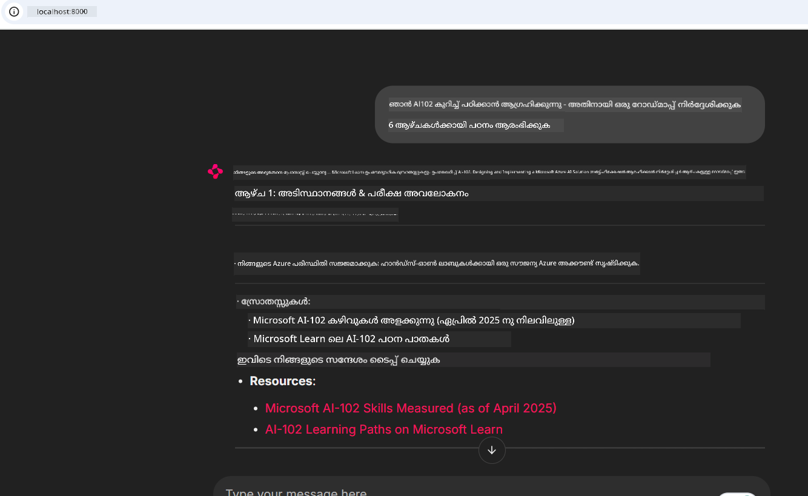
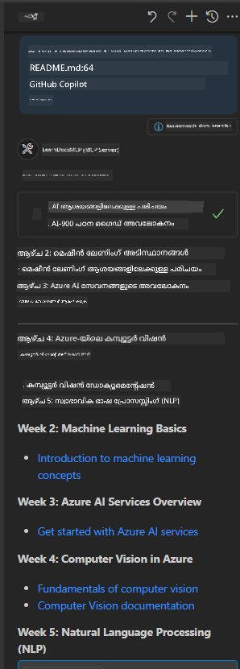

<!--
CO_OP_TRANSLATOR_METADATA:
{
  "original_hash": "4319d291c9d124ecafea52b3d04bfa0e",
  "translation_date": "2025-12-11T13:41:50+00:00",
  "source_file": "09-CaseStudy/docs-mcp/README.md",
  "language_code": "ml"
}
-->
# കേസ് സ്റ്റഡി: ക്ലയന്റിൽ നിന്ന് Microsoft Learn Docs MCP സെർവറുമായി കണക്റ്റ് ചെയ്യൽ

നിങ്ങൾക്ക് ഒരിക്കൽ പോലും ഡോക്യുമെന്റേഷൻ സൈറ്റുകൾ, Stack Overflow, അനന്തമായ സെർച്ച് എഞ്ചിൻ ടാബുകൾ എന്നിവയുടെ ഇടയിൽ ജഗ്ലിംഗ് ചെയ്യേണ്ടിവന്നിട്ടുണ്ടോ, നിങ്ങളുടെ കോഡിലെ ഒരു പ്രശ്നം പരിഹരിക്കാൻ ശ്രമിക്കുമ്പോൾ? നിങ്ങൾക്ക് ഡോക്യുമെന്റേഷനുകൾക്കായി രണ്ടാമത്തെ മോണിറ്റർ വെച്ചിട്ടുണ്ടോ, അല്ലെങ്കിൽ നിങ്ങളുടെ IDE-യും ബ്രൗസറും ഇടയിൽ സ്ഥിരമായി ആൽട്ട്-ടാബ് ചെയ്യുകയാണോ? ഡോക്യുമെന്റേഷൻ നിങ്ങളുടെ വർക്ക്‌ഫ്ലോയിൽ തന്നെ—നിങ്ങളുടെ ആപ്പുകളിലും, IDE-യിലും, അല്ലെങ്കിൽ നിങ്ങളുടെ സ്വന്തം കസ്റ്റം ടൂളുകളിലും സംയോജിപ്പിച്ചുകൊണ്ടു വരാൻ കഴിയുകയാണെങ്കിൽ എത്ര നല്ലതായിരിക്കും? ഈ കേസ് സ്റ്റഡിയിൽ, നിങ്ങളുടെ സ്വന്തം ക്ലയന്റ് ആപ്ലിക്കേഷനിൽ നിന്ന് Microsoft Learn Docs MCP സെർവറുമായി നേരിട്ട് കണക്റ്റ് ചെയ്യുന്നതിലൂടെ അതെങ്ങനെ ചെയ്യാമെന്ന് നാം പരിശോധിക്കും.

## അവലോകനം

ആധുനിക ഡെവലപ്പ്മെന്റ് വെറും കോഡ് എഴുതുന്നതിൽ മാത്രമല്ല—സമയോചിതമായ ശരിയായ വിവരങ്ങൾ കണ്ടെത്തുന്നതിലാണ്. ഡോക്യുമെന്റേഷൻ എല്ലായിടത്തും ഉണ്ട്, പക്ഷേ അത് നിങ്ങൾക്ക് ഏറ്റവും ആവശ്യമുള്ളിടത്ത്, നിങ്ങളുടെ ടൂളുകളിലും വർക്ക്‌ഫ്ലോകളിലും വളരെ കുറവാണ്. ഡോക്യുമെന്റേഷൻ നേരിട്ട് നിങ്ങളുടെ ആപ്ലിക്കേഷനുകളിൽ ഉൾപ്പെടുത്തുന്നതിലൂടെ, നിങ്ങൾക്ക് സമയം ലാഭിക്കാനും, കോൺടെക്സ്റ്റ് സ്വിച്ച് ചെയ്യൽ കുറയ്ക്കാനും, ഉൽപാദകത്വം വർദ്ധിപ്പിക്കാനും കഴിയും. ഈ വിഭാഗത്തിൽ, Microsoft Learn Docs MCP സെർവറുമായി ഒരു ക്ലയന്റ് കണക്റ്റ് ചെയ്യുന്നത് എങ്ങനെ എന്നത് കാണിക്കും, അതിലൂടെ നിങ്ങളുടെ ആപ്പിൽ നിന്ന് പുറത്തേക്ക് പോകാതെ തന്നെ റിയൽ-ടൈം, കോൺടെക്സ്റ്റ്-അവെയർ ഡോക്യുമെന്റേഷൻ ആക്‌സസ് ചെയ്യാം.

കണക്ഷൻ സ്ഥാപിക്കൽ, അഭ്യർത്ഥന അയയ്ക്കൽ, സ്ട്രീമിംഗ് പ്രതികരണങ്ങൾ കാര്യക്ഷമമായി കൈകാര്യം ചെയ്യൽ എന്നിവയുടെ പ്രക്രിയ നാം ചുവടെ വിശദീകരിക്കും. ഈ സമീപനം നിങ്ങളുടെ വർക്ക്‌ഫ്ലോയെ സുഗമമാക്കുന്നതോടൊപ്പം, കൂടുതൽ ബുദ്ധിമുട്ടുള്ള, സഹായകമായ ഡെവലപ്പർ ടൂളുകൾ നിർമ്മിക്കാൻ വാതിൽ തുറക്കും.

## പഠന ലക്ഷ്യങ്ങൾ

നാം ഇത് എന്തുകൊണ്ട് ചെയ്യുന്നു? കാരണം മികച്ച ഡെവലപ്പർ അനുഭവങ്ങൾ അവയാണ്, അവ തടസ്സങ്ങൾ നീക്കം ചെയ്യുന്നു. നിങ്ങളുടെ കോഡ് എഡിറ്റർ, ചാറ്റ്ബോട്ട്, അല്ലെങ്കിൽ വെബ് ആപ്പ് Microsoft Learn-ലെ ഏറ്റവും പുതിയ ഉള്ളടക്കം ഉപയോഗിച്ച് ഡോക്യുമെന്റേഷൻ ചോദ്യങ്ങൾക്ക് ഉടൻ മറുപടി നൽകുന്ന ഒരു ലോകം കണക്കാക്കുക. ഈ അധ്യായം അവസാനിക്കുമ്പോൾ, നിങ്ങൾക്ക് അറിയാം:

- ഡോക്യുമെന്റേഷനിനുള്ള MCP സെർവർ-ക്ലയന്റ് കമ്മ്യൂണിക്കേഷൻ അടിസ്ഥാനങ്ങൾ മനസ്സിലാക്കുക
- Microsoft Learn Docs MCP സെർവറുമായി കണക്റ്റ് ചെയ്യാൻ ഒരു കൺസോൾ അല്ലെങ്കിൽ വെബ് ആപ്പ് നടപ്പിലാക്കുക
- റിയൽ-ടൈം ഡോക്യുമെന്റേഷൻ ലഭിക്കാൻ സ്ട്രീമിംഗ് HTTP ക്ലയന്റുകൾ ഉപയോഗിക്കുക
- നിങ്ങളുടെ ആപ്പിൽ ഡോക്യുമെന്റേഷൻ പ്രതികരണങ്ങൾ ലോഗ് ചെയ്ത് വ്യാഖ്യാനിക്കുക

ഈ കഴിവുകൾ ഉപയോഗിച്ച് നിങ്ങൾക്ക് പ്രതികരണപരമായതല്ല, സത്യത്തിൽ ഇന്ററാക്ടീവ്, കോൺടെക്സ്റ്റ്-അവെയർ ടൂളുകൾ നിർമ്മിക്കാൻ കഴിയും.

## സീനാരിയോ 1 - MCP ഉപയോഗിച്ച് റിയൽ-ടൈം ഡോക്യുമെന്റേഷൻ ലഭിക്കൽ

ഈ സീനാരിയോയിലായി, Microsoft Learn Docs MCP സെർവറുമായി ഒരു ക്ലയന്റ് കണക്റ്റ് ചെയ്യുന്നത് കാണിക്കും, അതിലൂടെ നിങ്ങളുടെ ആപ്പിൽ നിന്ന് പുറത്തേക്ക് പോകാതെ തന്നെ റിയൽ-ടൈം, കോൺടെക്സ്റ്റ്-അവെയർ ഡോക്യുമെന്റേഷൻ ആക്‌സസ് ചെയ്യാം.

ഇത് പ്രായോഗികമാക്കാം. Microsoft Learn Docs MCP സെർവറുമായി കണക്റ്റ് ചെയ്യുന്ന, `microsoft_docs_search` ടൂൾ വിളിക്കുന്ന, സ്ട്രീമിംഗ് പ്രതികരണം കൺസോളിൽ ലോഗ് ചെയ്യുന്ന ഒരു ആപ്പ് എഴുതുക എന്നതാണ് നിങ്ങളുടെ ജോലി.

### ഈ സമീപനം എന്തുകൊണ്ട്?
ഇത് കൂടുതൽ പുരോഗമന സംയോജനങ്ങൾ നിർമ്മിക്കുന്നതിന് അടിസ്ഥാനമാണ്—ചാറ്റ്ബോട്ട്, IDE എക്സ്റ്റൻഷൻ, അല്ലെങ്കിൽ വെബ് ഡാഷ്ബോർഡ് പവർ ചെയ്യാൻ നിങ്ങൾ ആഗ്രഹിക്കുന്നുവെങ്കിൽ.

ഈ സീനാരിയോയുടെ കോഡ്, നിർദ്ദേശങ്ങൾ എന്നിവ ഈ കേസ് സ്റ്റഡിയിലെ [`solution`](./solution/README.md) ഫോൾഡറിൽ ലഭ്യമാണ്. കണക്ഷൻ സജ്ജമാക്കുന്നതിന് ചുവടെയുള്ള ഘട്ടങ്ങൾ പിന്തുടരുക:
- കണക്ഷനായി ഔദ്യോഗിക MCP SDKയും സ്ട്രീമിംഗ് HTTP ക്ലയന്റും ഉപയോഗിക്കുക
- ഡോക്യുമെന്റേഷൻ ലഭിക്കാൻ ക്വറി പാരാമീറ്ററോടുകൂടി `microsoft_docs_search` ടൂൾ വിളിക്കുക
- ശരിയായ ലോഗിംഗ്, പിശക് കൈകാര്യം എന്നിവ നടപ്പിലാക്കുക
- ഉപയോക്താക്കൾക്ക് പല തിരയൽ ക്വറികളും നൽകാൻ അനുവദിക്കുന്ന ഇന്ററാക്ടീവ് കൺസോൾ ഇന്റർഫേസ് സൃഷ്ടിക്കുക

ഈ സീനാരിയോ കാണിക്കുന്നു:
- Docs MCP സെർവറുമായി കണക്റ്റ് ചെയ്യുക
- ഒരു ക്വറി അയയ്ക്കുക
- ഫലങ്ങൾ പാഴ്‌സ് ചെയ്ത് പ്രിന്റ് ചെയ്യുക

സൊല്യൂഷൻ പ്രവർത്തിപ്പിക്കുന്നത് ഇങ്ങനെ കാണാം:

```
Prompt> What is Azure Key Vault?
Answer> Azure Key Vault is a cloud service for securely storing and accessing secrets. ...
```

താഴെ ഒരു ലഘു സാമ്പിൾ സൊല്യൂഷൻ നൽകിയിരിക്കുന്നു. പൂർണ്ണ കോഡ്, വിശദാംശങ്ങൾ സൊല്യൂഷൻ ഫോൾഡറിൽ ലഭ്യമാണ്.

<details>
<summary>Python</summary>

```python
import asyncio
from mcp.client.streamable_http import streamablehttp_client
from mcp import ClientSession

async def main():
    async with streamablehttp_client("https://learn.microsoft.com/api/mcp") as (read_stream, write_stream, _):
        async with ClientSession(read_stream, write_stream) as session:
            await session.initialize()
            result = await session.call_tool("microsoft_docs_search", {"query": "Azure Functions best practices"})
            print(result.content)

if __name__ == "__main__":
    asyncio.run(main())
```

- പൂർണ്ണ നടപ്പാക്കലും ലോഗിംഗും കാണാൻ [`scenario1.py`](../../../../09-CaseStudy/docs-mcp/solution/python/scenario1.py) കാണുക.
- ഇൻസ്റ്റാളേഷൻ, ഉപയോഗ നിർദ്ദേശങ്ങൾക്കായി അതേ ഫോൾഡറിലുള്ള [`README.md`](./solution/python/README.md) ഫയൽ കാണുക.
</details>


## സീനാരിയോ 2 - MCP ഉപയോഗിച്ച് ഇന്ററാക്ടീവ് സ്റ്റഡി പ്ലാൻ ജനറേറ്റർ വെബ് ആപ്പ്

ഈ സീനാരിയോയിലായി, Docs MCP ഒരു വെബ് ഡെവലപ്പ്മെന്റ് പ്രോജക്ടിൽ എങ്ങനെ സംയോജിപ്പിക്കാമെന്ന് പഠിക്കും. ലക്ഷ്യം ഉപയോക്താക്കൾക്ക് വെബ് ഇന്റർഫേസിൽ നിന്ന് നേരിട്ട് Microsoft Learn ഡോക്യുമെന്റേഷൻ തിരയാൻ സാധ്യമാക്കുക, ഡോക്യുമെന്റേഷൻ നിങ്ങളുടെ ആപ്പിലോ സൈറ്റിലോ ഉടൻ ലഭ്യമാക്കുക.

നിങ്ങൾ കാണും:
- ഒരു വെബ് ആപ്പ് സജ്ജമാക്കുക
- Docs MCP സെർവറുമായി കണക്റ്റ് ചെയ്യുക
- ഉപയോക്തൃ ഇൻപുട്ട് കൈകാര്യം ചെയ്ത് ഫലങ്ങൾ പ്രദർശിപ്പിക്കുക

സൊല്യൂഷൻ പ്രവർത്തിപ്പിക്കുന്നത് ഇങ്ങനെ കാണാം:

```
User> I want to learn about AI102 - so suggest the roadmap to get it started from learn for 6 weeks

Assistant> Here’s a detailed 6-week roadmap to start your preparation for the AI-102: Designing and Implementing a Microsoft Azure AI Solution certification, using official Microsoft resources and focusing on exam skills areas:

---
## Week 1: Introduction & Fundamentals
- **Understand the Exam**: Review the [AI-102 exam skills outline](https://learn.microsoft.com/en-us/credentials/certifications/exams/ai-102/).
- **Set up Azure**: Sign up for a free Azure account if you don't have one.
- **Learning Path**: [Introduction to Azure AI services](https://learn.microsoft.com/en-us/training/modules/intro-to-azure-ai/)
- **Focus**: Get familiar with Azure portal, AI capabilities, and necessary tools.

....more weeks of the roadmap...

Let me know if you want module-specific recommendations or need more customized weekly tasks!
```

താഴെ ഒരു ലഘു സാമ്പിൾ സൊല്യൂഷൻ നൽകിയിരിക്കുന്നു. പൂർണ്ണ കോഡ്, വിശദാംശങ്ങൾ സൊല്യൂഷൻ ഫോൾഡറിൽ ലഭ്യമാണ്.



<details>
<summary>Python (Chainlit)</summary>

Chainlit ഒരു സംഭാഷണ AI വെബ് ആപ്പുകൾ നിർമ്മിക്കാൻ ഉള്ള ഫ്രെയിംവർക്ക് ആണ്. MCP ടൂളുകൾ വിളിച്ച് ഫലങ്ങൾ റിയൽ ടൈമിൽ പ്രദർശിപ്പിക്കുന്ന ഇന്ററാക്ടീവ് ചാറ്റ്ബോട്ടുകളും അസിസ്റ്റന്റുകളും സൃഷ്ടിക്കാൻ ഇത് എളുപ്പമാക്കുന്നു. ഇത് വേഗത്തിലുള്ള പ്രോട്ടോടൈപ്പിംഗിനും ഉപയോക്തൃ സൗഹൃദ ഇന്റർഫേസുകൾക്കും അനുയോജ്യമാണ്.

```python
import chainlit as cl
import requests

MCP_URL = "https://learn.microsoft.com/api/mcp"

@cl.on_message
def handle_message(message):
    query = {"question": message}
    response = requests.post(MCP_URL, json=query)
    if response.ok:
        result = response.json()
        cl.Message(content=result.get("answer", "No answer found.")).send()
    else:
        cl.Message(content="Error: " + response.text).send()
```

- പൂർണ്ണ നടപ്പാക്കലിനായി [`scenario2.py`](../../../../09-CaseStudy/docs-mcp/solution/python/scenario2.py) കാണുക.
- സജ്ജീകരണവും പ്രവർത്തിപ്പിക്കൽ നിർദ്ദേശങ്ങളും [`README.md`](./solution/python/README.md) കാണുക.
</details>


## സീനാരിയോ 3: VS Code-ൽ MCP സെർവറുമായി ഇൻ-എഡിറ്റർ ഡോക്സ്

നിങ്ങൾക്ക് ബ്രൗസർ ടാബുകൾ മാറാതെ തന്നെ VS Code-ൽ നേരിട്ട് Microsoft Learn Docs ലഭിക്കണമെങ്കിൽ, നിങ്ങളുടെ എഡിറ്ററിൽ MCP സെർവർ ഉപയോഗിക്കാം. ഇതിലൂടെ നിങ്ങൾക്ക് സാധിക്കും:
- കോഡിംഗ് പരിസരത്ത് നിന്ന് പുറത്തുകടക്കാതെ VS Code-ൽ ഡോക്സ് തിരയാനും വായിക്കാനും.
- ഡോക്യുമെന്റേഷൻ റഫറൻസ് ചെയ്യാനും README അല്ലെങ്കിൽ കോഴ്‌സ് ഫയലുകളിൽ ലിങ്കുകൾ ചേർക്കാനും.
- GitHub Copilot-ഉം MCP-ഉം ചേർന്ന് ഒരു സുതാര്യമായ, AI-ശക്തിയുള്ള ഡോക്യുമെന്റേഷൻ വർക്ക്‌ഫ്ലോ സൃഷ്ടിക്കാനും.

**നിങ്ങൾ കാണും:**
- നിങ്ങളുടെ വർക്ക്‌സ്പേസ് റൂട്ടിൽ സാധുവായ `.vscode/mcp.json` ഫയൽ ചേർക്കുന്നത് (താഴെ ഉദാഹരണം കാണുക).
- MCP പാനൽ തുറക്കുക അല്ലെങ്കിൽ VS Code-യിലെ കമാൻഡ് പാനൽ ഉപയോഗിച്ച് ഡോക്സ് തിരയുകയും ചേർക്കുകയും ചെയ്യുക.
- നിങ്ങൾ ജോലി ചെയ്യുമ്പോൾ മാർക്ക്ഡൗൺ ഫയലുകളിൽ നേരിട്ട് ഡോക്യുമെന്റേഷൻ റഫറൻസ് ചെയ്യുക.
- GitHub Copilot-ഉം ഈ വർക്ക്‌ഫ്ലോയും ചേർത്ത് കൂടുതൽ ഉൽപാദകത്വം നേടുക.

VS Code-ൽ MCP സെർവർ സജ്ജമാക്കുന്നതിന്റെ ഒരു ഉദാഹരണം:

```json
{
  "servers": {
    "LearnDocsMCP": {
      "url": "https://learn.microsoft.com/api/mcp"
    }
  }
}
```

</details>

> സ്ക്രീൻഷോട്ടുകളോടും ഘട്ടം ഘട്ടമായ മാർഗ്ഗനിർദ്ദേശത്തോടും കൂടിയ വിശദമായ വാക്ക്-തുടർച്ചയ്ക്ക് [`README.md`](./solution/scenario3/README.md) കാണുക.



ടെക്നിക്കൽ കോഴ്‌സുകൾ നിർമ്മിക്കുന്നവർക്ക്, ഡോക്യുമെന്റേഷൻ എഴുതുന്നവർക്ക്, അല്ലെങ്കിൽ സ്ഥിരമായി റഫറൻസ് ആവശ്യമായ കോഡ് വികസിപ്പിക്കുന്നവർക്ക് ഈ സമീപനം അനുയോജ്യമാണ്.

## പ്രധാന പാഠങ്ങൾ

ഡോക്യുമെന്റേഷൻ നേരിട്ട് നിങ്ങളുടെ ടൂളുകളിൽ സംയോജിപ്പിക്കുന്നത് വെറും സൗകര്യമല്ല—ഉൽപാദകത്വത്തിന് ഒരു ഗെയിം ചേഞ്ചറാണ്. Microsoft Learn Docs MCP സെർവറുമായി നിങ്ങളുടെ ക്ലയന്റിൽ നിന്ന് കണക്റ്റ് ചെയ്യുന്നതിലൂടെ, നിങ്ങൾക്ക് സാധിക്കും:

- നിങ്ങളുടെ കോഡും ഡോക്യുമെന്റേഷനും ഇടയിൽ കോൺടെക്സ്റ്റ് സ്വിച്ച് ചെയ്യൽ ഒഴിവാക്കുക
- അപ്‌ടുഡേറ്റ് ചെയ്ത, കോൺടെക്സ്റ്റ്-അവെയർ ഡോക്സ് റിയൽ ടൈമിൽ ലഭ്യമാക്കുക
- കൂടുതൽ ബുദ്ധിമുട്ടുള്ള, ഇന്ററാക്ടീവ് ഡെവലപ്പർ ടൂളുകൾ നിർമ്മിക്കുക

ഈ കഴിവുകൾ ഉപയോഗിച്ച് നിങ്ങൾക്ക് കാര്യക്ഷമമായതും ഉപയോഗിക്കാൻ സന്തോഷകരവുമായ സൊല്യൂഷനുകൾ സൃഷ്ടിക്കാം.

## അധിക വിഭവങ്ങൾ

നിങ്ങളുടെ മനസ്സിലാക്കൽ കൂടുതൽ ആഴത്തിൽ ആക്കാൻ, ഈ ഔദ്യോഗിക വിഭവങ്ങൾ പരിശോധിക്കുക:

- [Microsoft Learn Docs MCP Server (GitHub)](https://github.com/MicrosoftDocs/mcp)
- [Get started with Azure MCP Server (mcp-python)](https://learn.microsoft.com/en-us/azure/developer/azure-mcp-server/get-started#create-the-python-app)
- [What is the Azure MCP Server?](https://learn.microsoft.com/en-us/azure/developer/azure-mcp-server/)
- [Model Context Protocol (MCP) Introduction](https://modelcontextprotocol.io/introduction)
- [Add plugins from a MCP Server (Python)](https://learn.microsoft.com/en-us/semantic-kernel/concepts/plugins/adding-mcp-plugins)

---

<!-- CO-OP TRANSLATOR DISCLAIMER START -->
**അസൂയാ**:  
ഈ രേഖ AI വിവർത്തന സേവനം [Co-op Translator](https://github.com/Azure/co-op-translator) ഉപയോഗിച്ച് വിവർത്തനം ചെയ്തതാണ്. നാം കൃത്യതയ്ക്ക് ശ്രമിച്ചെങ്കിലും, യന്ത്രം ചെയ്ത വിവർത്തനങ്ങളിൽ പിശകുകൾ അല്ലെങ്കിൽ തെറ്റുകൾ ഉണ്ടാകാമെന്ന് ദയവായി ശ്രദ്ധിക്കുക. അതിന്റെ മാതൃഭാഷയിലുള്ള യഥാർത്ഥ രേഖ പ്രാമാണികമായ ഉറവിടമായി കണക്കാക്കണം. നിർണായക വിവരങ്ങൾക്ക്, പ്രൊഫഷണൽ മനുഷ്യ വിവർത്തനം ശുപാർശ ചെയ്യപ്പെടുന്നു. ഈ വിവർത്തനം ഉപയോഗിക്കുന്നതിൽ നിന്നുണ്ടാകുന്ന ഏതെങ്കിലും തെറ്റിദ്ധാരണകൾക്കോ തെറ്റായ വ്യാഖ്യാനങ്ങൾക്കോ ഞങ്ങൾ ഉത്തരവാദികളല്ല.
<!-- CO-OP TRANSLATOR DISCLAIMER END -->