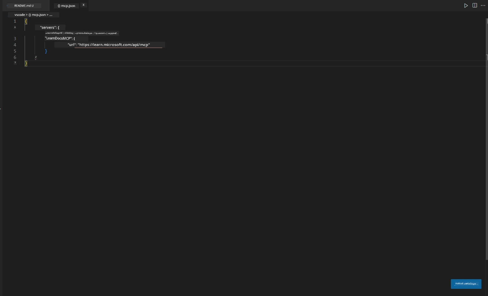
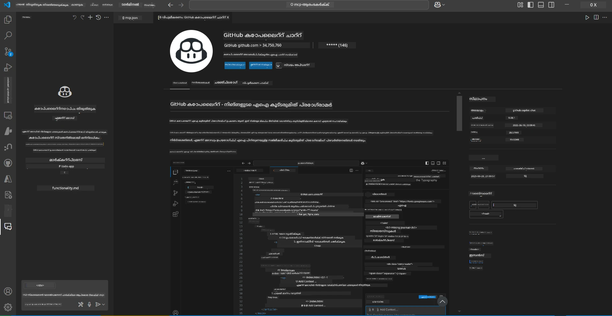
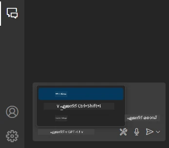
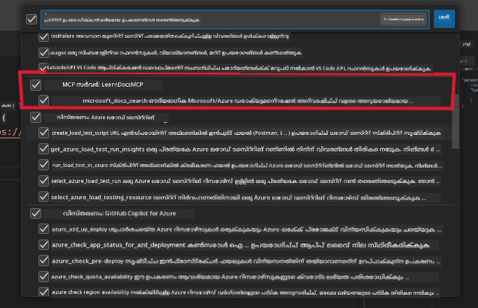
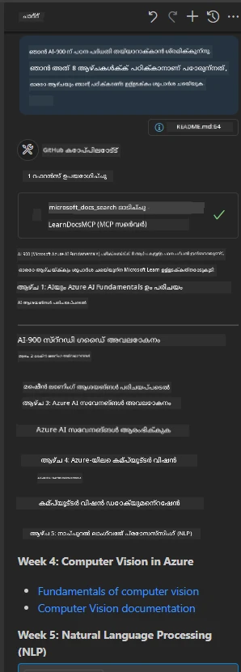
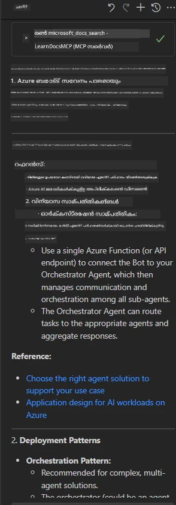

# സീനാരിയോ 3: VS കോഡിൽ MCP സെർവറോടൊപ്പം ഇൻ-എഡിറ്റർ ഡോക്സ്

## അവലോകനം

ഈ സീനാരിയോയിലായി, MCP സെർവർ ഉപയോഗിച്ച് മൈക്രോസോഫ്റ്റ് ലേൺ ഡോക്സ് നേരിട്ട് നിങ്ങളുടെ Visual Studio Code പരിസ്ഥിതിയിൽ എങ്ങനെ കൊണ്ടുവരാമെന്ന് നിങ്ങൾ പഠിക്കും. ഡോക്യുമെന്റേഷൻ തിരയാൻ ബ്രൗസർ ടാബുകൾ നിരന്തരം മാറേണ്ടതിന് പകരം, നിങ്ങൾക്ക് നിങ്ങളുടെ എഡിറ്ററിനുള്ളിൽ തന്നെ ഔദ്യോഗിക ഡോക്സ് ആക്‌സസ് ചെയ്യാനും, തിരയാനും, റഫറൻസ് ചെയ്യാനും കഴിയും. ഈ സമീപനം നിങ്ങളുടെ പ്രവൃത്തി പ്രവാഹം ലളിതമാക്കുകയും, നിങ്ങൾക്ക് ശ്രദ്ധ കേന്ദ്രീകരിക്കാനും, GitHub Copilot പോലുള്ള ഉപകരണങ്ങളുമായി സുതാര്യമായ സംയോജനം സാധ്യമാക്കുകയും ചെയ്യുന്നു.

- VS കോഡിനുള്ളിൽ തന്നെ ഡോക്സ് തിരയുകയും വായിക്കുകയും ചെയ്യുക, കോഡിംഗ് പരിസ്ഥിതി വിട്ടുപോകാതെ.
- ഡോക്യുമെന്റേഷൻ റഫറൻസ് ചെയ്യുകയും README അല്ലെങ്കിൽ കോഴ്‌സ് ഫയലുകളിൽ നേരിട്ട് ലിങ്കുകൾ ചേർക്കുകയും ചെയ്യുക.
- GitHub Copilot-നും MCP-നും ചേർന്ന് സുതാര്യമായ, AI-ശക്തിയുള്ള ഡോക്യുമെന്റേഷൻ പ്രവൃത്തി പ്രവാഹം ഉപയോഗിക്കുക.

## പഠന ലക്ഷ്യങ്ങൾ

ഈ അധ്യായത്തിന്റെ അവസാനം, MCP സെർവർ VS കോഡിനുള്ളിൽ എങ്ങനെ സജ്ജമാക്കുകയും ഉപയോഗിക്കുകയും ചെയ്യാമെന്ന് നിങ്ങൾക്ക് മനസ്സിലാകും, ഇത് നിങ്ങളുടെ ഡോക്യുമെന്റേഷൻയും വികസന പ്രവൃത്തി പ്രവാഹവും മെച്ചപ്പെടുത്തും. നിങ്ങൾക്ക് കഴിയും:

- ഡോക്യുമെന്റേഷൻ തിരയുന്നതിനായി MCP സെർവർ ഉപയോഗിക്കാൻ നിങ്ങളുടെ വർക്ക്‌സ്പേസ് കോൺഫിഗർ ചെയ്യുക.
- VS കോഡിനുള്ളിൽ നിന്ന് നേരിട്ട് ഡോക്യുമെന്റേഷൻ തിരയുകയും ചേർക്കുകയും ചെയ്യുക.
- കൂടുതൽ ഉൽപാദകമായ, AI-വളർത്തിയ പ്രവൃത്തി പ്രവാഹത്തിനായി GitHub Copilot-നും MCP-നും ചേർന്ന് പ്രവർത്തിക്കുക.

ഈ കഴിവുകൾ നിങ്ങളെ ശ്രദ്ധ കേന്ദ്രീകരിക്കാൻ, ഡോക്യുമെന്റേഷൻ ഗുണനിലവാരം മെച്ചപ്പെടുത്താൻ, ഡെവലപ്പർ അല്ലെങ്കിൽ സാങ്കേതിക എഴുത്തുകാരനായി നിങ്ങളുടെ ഉൽപാദകത വർദ്ധിപ്പിക്കാൻ സഹായിക്കും.

## പരിഹാരം

ഇൻ-എഡിറ്റർ ഡോക്യുമെന്റേഷൻ ആക്‌സസ് നേടാൻ, MCP സെർവർ VS കോഡിനും GitHub Copilot-നും സംയോജിപ്പിക്കുന്ന ഒരു പരമ്പരാ ഘട്ടങ്ങൾ നിങ്ങൾ പിന്തുടരും. കോഴ്‌സ് രചയിതാക്കൾക്കും, ഡോക്യുമെന്റേഷൻ എഴുത്തുകാരനും, ഡെവലപ്പർമാർക്കും ഇത് അനുയോജ്യമാണ്, അവർ ഡോക്സും Copilot-ഉം ഉപയോഗിച്ച് എഡിറ്ററിനുള്ളിൽ തന്നെ ശ്രദ്ധ കേന്ദ്രീകരിക്കാൻ ആഗ്രഹിക്കുന്നവർ.

- കോഴ്‌സ് അല്ലെങ്കിൽ പ്രോജക്ട് ഡോക്യുമെന്റേഷൻ എഴുതുമ്പോൾ README-യിൽ റഫറൻസ് ലിങ്കുകൾ വേഗത്തിൽ ചേർക്കുക.
- കോഡ് സൃഷ്ടിക്കാൻ Copilot ഉപയോഗിക്കുക, MCP ഉപയോഗിച്ച് ബന്ധപ്പെട്ട ഡോക്സ് ഉടൻ കണ്ടെത്തി ഉദ്ധരിക്കുക.
- നിങ്ങളുടെ എഡിറ്ററിനുള്ളിൽ ശ്രദ്ധ കേന്ദ്രീകരിച്ച് ഉൽപാദകത വർദ്ധിപ്പിക്കുക.

### ഘട്ടം-ഘട്ടമായി മാർഗ്ഗനിർദ്ദേശം

ആരംഭിക്കാൻ, ഈ ഘട്ടങ്ങൾ പിന്തുടരുക. ഓരോ ഘട്ടത്തിനും, പ്രക്രിയ ദൃശ്യമായി കാണിക്കാൻ ആസറ്റ് ഫോളഡറിൽ നിന്നുള്ള സ്ക്രീൻഷോട്ട് ചേർക്കാം.

1. **MCP കോൺഫിഗറേഷൻ ചേർക്കുക:**
   നിങ്ങളുടെ പ്രോജക്ട് റൂട്ടിൽ `.vscode/mcp.json` ഫയൽ സൃഷ്ടിച്ച് താഴെ കാണുന്ന കോൺഫിഗറേഷൻ ചേർക്കുക:
   ```json
   {
     "servers": {
       "LearnDocsMCP": {
         "url": "https://learn.microsoft.com/api/mcp"
       }
     }
   }
   ```
   ഈ കോൺഫിഗറേഷൻ VS കോഡിന് [`Microsoft Learn Docs MCP server`](https://github.com/MicrosoftDocs/mcp) എങ്ങനെ കണക്ട് ചെയ്യാമെന്ന് പറയുന്നു.
   
   
    
2. **GitHub Copilot Chat പാനൽ തുറക്കുക:**
   GitHub Copilot എക്സ്റ്റൻഷൻ ഇൻസ്റ്റാൾ ചെയ്തിട്ടില്ലെങ്കിൽ, VS കോഡിലെ എക്സ്റ്റൻഷൻസ് വ്യൂവിലേക്ക് പോയി അത് ഇൻസ്റ്റാൾ ചെയ്യുക. നിങ്ങൾക്ക് ഇത് നേരിട്ട് [Visual Studio Code Marketplace](https://marketplace.visualstudio.com/items?itemName=GitHub.copilot-chat) ൽ നിന്ന് ഡൗൺലോഡ് ചെയ്യാം. തുടർന്ന്, സൈഡ്ബാറിൽ നിന്ന് Copilot Chat പാനൽ തുറക്കുക.

   

3. **എജന്റ് മോഡ് സജീവമാക്കുകയും ടൂളുകൾ പരിശോധിക്കുകയും ചെയ്യുക:**
   Copilot Chat പാനലിൽ എജന്റ് മോഡ് സജീവമാക്കുക.

   

   എജന്റ് മോഡ് സജീവമാക്കിയ ശേഷം, MCP സെർവർ ലഭ്യമായ ടൂളുകളിൽ ഒന്നായി ലിസ്റ്റ് ചെയ്തിട്ടുണ്ടെന്ന് ഉറപ്പാക്കുക. ഇത് Copilot എജന്റിന് ഡോക്യുമെന്റേഷൻ സെർവർ ആക്‌സസ് ചെയ്ത് ബന്ധപ്പെട്ട വിവരങ്ങൾ നേടാൻ സാധിക്കും എന്ന് ഉറപ്പാക്കുന്നു.
   
   
4. **പുതിയ ചാറ്റ് ആരംഭിച്ച് എജന്റിനെ പ്രോംപ്റ്റ് ചെയ്യുക:**
   Copilot Chat പാനലിൽ പുതിയ ചാറ്റ് തുറക്കുക. ഇപ്പോൾ നിങ്ങൾക്ക് ഡോക്യുമെന്റേഷൻ ചോദ്യങ്ങളുമായി എജന്റിനെ പ്രോംപ്റ്റ് ചെയ്യാം. എജന്റ് MCP സെർവർ ഉപയോഗിച്ച് ബന്ധപ്പെട്ട മൈക്രോസോഫ്റ്റ് ലേൺ ഡോക്യുമെന്റേഷൻ നേരിട്ട് നിങ്ങളുടെ എഡിറ്ററിൽ ഫെച്ച് ചെയ്ത് പ്രദർശിപ്പിക്കും.

   - *"ഞാൻ വിഷയം X-നായി ഒരു പഠന പദ്ധതി എഴുതാൻ ശ്രമിക്കുന്നു. ഞാൻ അത് 8 ആഴ്ചകൾക്കായി പഠിക്കാനാണ് പോകുന്നത്, ഓരോ ആഴ്ചയ്ക്കും എടുക്കേണ്ട ഉള്ളടക്കം നിർദ്ദേശിക്കുക."*

   

5. **ലൈവ് ക്വറി:**

   > Azure AI Foundry Discord-ിലെ [#get-help](https://discord.gg/D6cRhjHWSC) സെക്ഷനിൽ നിന്നുള്ള ഒരു ലൈവ് ക്വറി എടുത്തു നോക്കാം ([മൂല സന്ദേശം കാണുക](https://discord.com/channels/1113626258182504448/1385498306720829572)):
   
   *"Azure AI Foundry-യിൽ വികസിപ്പിച്ച AI ഏജന്റുകളുമായി മൾട്ടി-ഏജന്റ് സൊല്യൂഷൻ ഡിപ്ലോയ് ചെയ്യുന്നതെങ്ങനെ എന്നതിനെക്കുറിച്ച് ഞാൻ ഉത്തരം അന്വേഷിക്കുന്നു. Copilot Studio ചാനലുകൾ പോലുള്ള നേരിട്ടുള്ള ഡിപ്ലോയ്മെന്റ് മാർഗ്ഗം ഇല്ലെന്ന് ഞാൻ കാണുന്നു. എന്റർപ്രൈസ് ഉപയോക്താക്കൾക്ക് ഇടപഴകാനും ജോലി പൂർത്തിയാക്കാനും ഈ ഡിപ്ലോയ്മെന്റ് ചെയ്യാനുള്ള വ്യത്യസ്ത മാർഗ്ഗങ്ങൾ എന്തെല്ലാമാണ്?
MS Teams-നും Azure AI Foundry ഏജന്റുകൾക്കും ഇടയിൽ പാലം പോലെ പ്രവർത്തിക്കാൻ Azure Bot സർവീസ് ഉപയോഗിക്കാമെന്ന് പറയുന്ന നിരവധി ലേഖനങ്ങളും ബ്ലോഗുകളും ഉണ്ട്, ഞാൻ Azure ഫംഗ്ഷൻ വഴി Azure AI Foundry-യിലെ ഓർക്കസ്ട്രേറ്റർ ഏജന്റുമായി കണക്ട് ചെയ്യുന്ന ഒരു Azure ബോട്ട് സജ്ജമാക്കിയാൽ ഇത് പ്രവർത്തിക്കുമോ, അല്ലെങ്കിൽ ബോട്ട് ഫ്രെയിംവർക്കിൽ ഓർക്കസ്ട്രേഷൻ നടത്താൻ മൾട്ടി ഏജന്റ് സൊല്യൂഷനിലെ ഓരോ AI ഏജന്റിനും Azure ഫംഗ്ഷൻ സൃഷ്ടിക്കേണ്ടതുണ്ടോ? മറ്റ് നിർദ്ദേശങ്ങൾ സ്വാഗതം."*

   

   എജന്റ് ബന്ധപ്പെട്ട ഡോക്യുമെന്റേഷൻ ലിങ്കുകളും സംഗ്രഹങ്ങളും നൽകും, അവ നിങ്ങൾക്ക് നേരിട്ട് മാർക്ക്ഡൗൺ ഫയലുകളിൽ ചേർക്കാനോ കോഡിൽ റഫറൻസായി ഉപയോഗിക്കാനോ കഴിയും.
   
### സാമ്പിൾ ക്വറികൾ

നിങ്ങൾ പരീക്ഷിക്കാവുന്ന ചില ഉദാഹരണ ക്വറികൾ ഇവയാണ്. ഈ ക്വറികൾ MCP സെർവർയും Copilot-ഉം ചേർന്ന് എങ്ങനെ വേഗത്തിൽ, സാന്ദർഭികമായി ഡോക്യുമെന്റേഷൻയും റഫറൻസുകളും നൽകുന്നുവെന്ന് കാണിക്കും, VS കോഡ് വിട്ടുപോകാതെ:

- "Azure Functions ട്രിഗറുകൾ എങ്ങനെ ഉപയോഗിക്കാമെന്ന് കാണിക്കൂ."
- "Azure Key Vault-ന്റെ ഔദ്യോഗിക ഡോക്യുമെന്റേഷനിലേക്ക് ഒരു ലിങ്ക് ചേർക്കുക."
- "Azure റിസോഴ്‌സുകൾ സുരക്ഷിതമാക്കാനുള്ള മികച്ച പ്രാക്ടീസുകൾ എന്തെല്ലാം?"
- "Azure AI സർവീസുകൾക്കുള്ള ക്വിക്‌സ്റ്റാർട്ട് കണ്ടെത്തുക."

ഈ ക്വറികൾ MCP സെർവർയും Copilot-ഉം ചേർന്ന് എങ്ങനെ വേഗത്തിൽ, സാന്ദർഭികമായി ഡോക്യുമെന്റേഷൻയും റഫറൻസുകളും നൽകുന്നുവെന്ന് കാണിക്കും, VS കോഡ് വിട്ടുപോകാതെ.

---

---

<!-- CO-OP TRANSLATOR DISCLAIMER START -->
**അസൂയാ**:  
ഈ രേഖ AI വിവർത്തന സേവനം [Co-op Translator](https://github.com/Azure/co-op-translator) ഉപയോഗിച്ച് വിവർത്തനം ചെയ്തതാണ്. നാം കൃത്യതയ്ക്ക് ശ്രമിച്ചെങ്കിലും, സ്വയം പ്രവർത്തിക്കുന്ന വിവർത്തനങ്ങളിൽ പിശകുകൾ അല്ലെങ്കിൽ തെറ്റുകൾ ഉണ്ടാകാമെന്ന് ദയവായി ശ്രദ്ധിക്കുക. അതിന്റെ മാതൃഭാഷയിലുള്ള യഥാർത്ഥ രേഖ അധികാരപരമായ ഉറവിടമായി കണക്കാക്കണം. നിർണായക വിവരങ്ങൾക്ക്, പ്രൊഫഷണൽ മനുഷ്യ വിവർത്തനം ശുപാർശ ചെയ്യപ്പെടുന്നു. ഈ വിവർത്തനം ഉപയോഗിക്കുന്നതിൽ നിന്നുണ്ടാകുന്ന ഏതെങ്കിലും തെറ്റിദ്ധാരണകൾക്കോ തെറ്റായ വ്യാഖ്യാനങ്ങൾക്കോ ഞങ്ങൾ ഉത്തരവാദികളല്ല.
<!-- CO-OP TRANSLATOR DISCLAIMER END -->