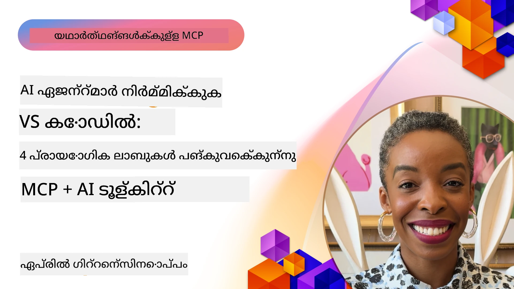

# എഐ പ്രവാഹങ്ങൾ ലളിതമാക്കൽ: എഐ ടൂൾകിറ്റ് ഉപയോഗിച്ച് MCP സെർവർ സൃഷ്ടിക്കൽ

## 🎯 അവലോകനം

_(ഈ പാഠത്തിന്റെ വീഡിയോ കാണാൻ മുകളിൽ കാണുന്ന ചിത്രത്തിലൂടെ ക്ലിക്ക് ചെയ്യുക)_

**Model Context Protocol (MCP) വർക്ക്ഷോപ്പിലേക്ക് സ്വാഗതം!** എഐ ആപ്ലിക്കേഷനുകളുടെ വികസനം വിപ്ലവപ്പെടുത്തി മാറ്റാൻ ഈ സമഗ്രമായ ഹാൻഡ്‌സ്-ഓൺ വർക്ക്ഷോപ്പ് രണ്ട് മുന്നണിയിലെ സാങ്കേതികവിദ്യകൾ ഒന്നിപ്പിക്കുന്നു:

- **🔗 Model Context Protocol (MCP)**: എഐ-ടൂൾ ഇന്റഗ്രേഷൻ എളുപ്പമാക്കാൻ ഒരു ഓപ്പൺ സ്റ്റാൻഡേർഡ്
- **🛠️ Visual Studio Code-നുള്ള എഐ ടൂൾകിറ്റ് (AITK)**: മൈക്രോസോഫ്റ്റിന്റെ ശക്തമായ എഐ വികസന എക്സ്റ്റൻഷൻ

### 🎓 നിങ്ങൾക്ക് പഠിക്കാനിരിക്കുന്നതു്

ഈ വർക്ക്ഷോപ്പ് അവസാനിച്ചപ്പോൾ, നിങ്ങൾക്ക് എഐ മോഡലുകൾ യഥാർത്ഥ ലോക ટૂલുകൾക്കും സേവനങ്ങൾക്കും തമ്മിൽ ബന്ധിപ്പിക്കുന്ന ബുദ്ധിമുട്ടുള്ള ബിസിനസ് പ്രശ്നങ്ങൾ പരിഹരിക്കാൻ പ്രായോഗിക കഴിവുകൾ കൈവരിക്കുകയും ചെയ്യുന്ന ബുദ്ധിമാനായ ആപ്ലിക്കേഷനുകൾ നിർമ്മിക്കുന്ന കലയിലാരംഭിക്കും. ഓട്ടോമേറ്റഡ് ടെസ്റ്റിംഗ് മുതൽ കസ്റ്റം API ഇന്റഗ്രേഷനുകൾ വരെ.

## 🏗️ സാങ്കേതിക സ്റ്റാക്ക്

### 🔌 Model Context Protocol (MCP)

MCP ആണ് **"എഐയ്ക്കുള്ള USB-C"** - എഐ മോഡലുകളെ പുറം ടൂളുകളുമായും ഡാറ്റാ സ്രോതസ്സുകളുമായും ബന്ധിപ്പിക്കുന്ന സർവത്രാ സ്റ്റാൻഡേർഡ്.

**✨ പ്രധാന സവിശേഷതകൾ:**

- 🔄 **സ്റ്റാൻഡേർഡൈസ്ഡ് ഇന്റഗ്രേഷൻ**: എഐ-ടൂൾ കണക്ഷനുകൾക്കുള്ള സർവത്ര ഇന്റർഫേസ്
- 🏛️ **ഫ്ലെക്സിബിൾ ആർക്കിടെക്ചർ**: stdio/SSE ട്രാൻസ്പോർട്ട് മുഖേന ലൊക്കൽ & റിമോട്ട് സെർവറുകൾ
- 🧰 **സമ്പന്നമായ എക്കോസിസ്റ്റം**: ഒരു പ്രോട്ടോക്കോളിൽ ടൂളുകൾ, പ്രോമ്പ്റ്റുകൾ, വിഭവങ്ങൾ
- 🔒 **എന്ററപ്രൈസ്-സജ്ജം**: നിർമാണസുരക്ഷയും വിശ്വാസ്യതയും ഉൾകൊള്ളുന്നു

**🎯 MCP-ന്റെ പ്രാധാന്യം:**
USB-C കേബിളുകളുടെ അസംബന്ധം ഒഴിവാക്കിയത് പോലെ, MCP എഐ ഇന്റഗ്രേഷനുകളുടെ സങ്കീർണ്ണത ഒഴിവാക്കുന്നു. ഒറ്റ പ്രോട്ടോക്കോൾ, അനവധിയായ സാധ്യതകൾ.

### 🤖 Visual Studio Code-നുള്ള എഐ ടൂൾകിറ്റ് (AITK)

മൈക്രോസോഫ്റ്റിന്റെ പ്രധാന എഐ ഡവലപ്പ്മെന്റ് എക്സ്റ്റൻഷൻ അത് VS Code-നെ ഒരു എഐ ശക്തികേന്ദ്രമാക്കുന്നു.

**🚀 കോർ കഴിവുകൾ:**

- 📦 **മോഡൽ കാറ്റലോഗ്**: Azure AI, GitHub, Hugging Face, Ollama മുതലായവയിൽ നിന്നുള്ള മോഡലുകൾക്ക് ആക്സസ്
- ⚡ **ലൊക്കൽ ഇൻഫെറൻസ്**: ONNX-ഓപ്റ്റിമൈസ്ഡ് CPU/GPU/NPU എക്സിക്യൂഷൻ
- 🏗️ **ഏജന്റ് ബിൽഡർ**: MCP ഇന്റഗ്രേഷൻ കൂടിയ താണ്യ AI ഏജന്റ് വികസനം
- 🎭 **മൾട്ടി-മോഡൽ**: ടെക്സ്റ്റ്, വിഷൻ, സ്ട്രക്ചർഡ് ഔട്ട്പുട്ട് പിന്തുണ

**💡 വികസന ആനുകൂല്യങ്ങൾ:**

- സീറോ-കോൺഫിഗ് മോഡൽ ഡിപ്ലോയ്മെന്റ്
- ദൃശ്യ പ്രോംപ്റ്റ് എഞ്ചിനീയറിംഗ്
- റിയൽ-ടൈം ടെസ്റ്റിംഗ് പ്ലേഗ്രൗഡ്
- മൃദുവായ MCP സെർവർ ഇന്റഗ്രേഷൻ

## 📚 പഠന യാത്ര

### [🚀 മോഡ്യൂൾ 1: എഐ ടൂൾകിറ്റ് അടിസ്ഥാനങ്ങൾ](./lab1/README.md)

**അവകാശം**: 15 മിനിറ്റുകൾ

- 🛠️ VS Code-നായി എഐ ടൂൾകിറ്റ് ഇൻസ്റ്റാൾ ചെയ്യുക, കോൺഫിഗർ ചെയ്യുക
- 🗂️ മോഡൽ കാറ്റലോഗ് പരിശോധിക്കുക (GitHub, ONNX, OpenAI, Anthropic, Google എന്നിവയിൽ നിന്നുള്ള 100+ മോഡലുകൾ)
- 🎮 റിയൽ-ടൈം മോഡൽ ടെസ്റ്റിംഗിനായി ഇന്ററാക്ടീവ് പ്ലേഗ്രൗഡ് കൈകാര്യം ചെയ്യുക
- 🤖 നിങ്ങളുടെ ആദ്യ AI ഏജന്റ് ഏജന്റ് ബിൽഡർ ഉപയോഗിച്ച് സൃഷ്ടിക്കുക
- 📊 ഇൻബിൽറ്റ് മീട്രിക്സുകൾ (F1, പ്രസക്തി, സമാനത, ഏകീകൃതം) ഉപയോഗിച്ച് മോഡൽ പ്രകടനം വിലയിരുത്തുക
- ⚡ ബാച്ച് പ്രോസസ്സിംഗ്, മൾട്ടി-മോഡൽ പിന്തുണ കഴിവുകൾ പഠിക്കുക

**🎯 പഠന ഫലം**: AITK കഴിവുകളുടെ സമഗ്ര ബോധത്തോടെ ഒരു പ്രവർത്തനക്ഷമ AI ഏജന്റ് നിർമ്മിക്കുക

### [🌐 മോഡ്യൂൾ 2: MCP എഐ ടൂൾകിറ്റ് അടിസ്ഥാനങ്ങളോടുകൂടെ](./lab2/README.md)

**അവകാശം**: 20 മിനിറ്റുകൾ

- 🧠 Model Context Protocol (MCP) ആർക്കിടെക്ചർ, ആശയങ്ങൾ മനസിലാക്കുക
- 🌐 മൈക്രോസോഫ്റ്റിന്റെ MCP സെർവർ എക്കോസിസ്റ്റം പരിശോധിക്കുക
- 🤖 Playwright MCP സെർവറ ഉപയോഗിച്ച് ബ്രൗസർ ഓട്ടോമേഷൻ ഏജന്റ് നിർമ്മിക്കുക
- 🔧 MCP സെർവറുകൾ AI Toolkit ഏജന്റ് ബിൽഡറുമായി ഇന്റഗ്രേറ്റ് ചെയ്യുക
- 📊 നിങ്ങളുടെ ഏജന്റുകളിൽ MCP ടൂളുകൾ കോൺഫിഗർ ചെയ്യുകയും പരീക്ഷണങ്ങൾ നടത്തുകയും ചെയ്യുക
- 🚀 MCP-ഉപയോഗിച്ച് ശക്തിപ്പെടുത്തിയ ഏജന്റുകൾ പ്രൊഡക്ഷനിലേക്ക് എക്സ്പോർട്ട് ചെയ്യുക, ഡിപ്ലോയ് ചെയ്യുക

**🎯 പഠന ഫലം**: MCP വഴി ബാഹ്യ ടൂളുകളുള്ള AI ഏജന്റ് പ്രൊഡക്ഷനിലേക്ക് ഡിപ്ലോയ് ചെയ്യുക

### [🔧 മോഡ്യൂൾ 3: എഡ്വാൻസ്ഡ് MCP വികസനം AI ടൂൾകിറ്റ് ഉപയോഗിച്ച്](./lab3/README.md)

**അവകാശം**: 20 മിനിറ്റുകൾ

- 💻 AI ടൂൾകിറ്റ് ഉപയോഗിച്ച് കസ്റ്റം MCP സെർവർസുകൾ സൃഷ്ടിക്കുക
- 🐍 ഏറ്റവും പുതിയ MCP Python SDK (v1.9.3) കോൺഫിഗർ ചെയ്യുകയും ഉപയോഗിക്കുകയും ചെയ്യുക
- 🔍 ഡിബഗിനായി MCP ഇൻസ്പെക്ടർ സെറ്റപ്പ് ചെയ്യുക, ഉപയോഗിക്കുക
- 🛠️ പ്രൊഫഷണൽ ഡിബഗിംഗ് പ്രവാഹങ്ങളോടുകൂടെ ഒരു വേദർ MCP സെർവർ നിർമ്മിക്കുക
- 🧪 ഏജന്റ് ബിൽഡറിലും ഇൻസ്പെക്ടർ പരിസ്ഥിതികളിലും MCP സെർവറുകൾ ഡിബഗ് ചെയ്യുക

**🎯 പഠന ഫലം**: ആധുനിക ഉപകരണങ്ങൾ ഉപയോഗിച്ച് കസ്റ്റം MCP സെർവർ വികസിപ്പിക്കുക, ഡിബഗ് ചെയ്യുക

### [🐙 മോഡ്യൂൾ 4: പ്രായോഗിക MCP വികസനം - കസ്റ്റം GitHub ക്ലോൺ സെർവർ](./lab4/README.md)

**അവകാശം**: 30 മിനിറ്റുകൾ

- 🏗️ വികസന പ്രവാഹങ്ങൾക്കായി യഥാർത്ഥ GitHub ക്ലോൺ MCP സെർവർ നിർമ്മിക്കുക
- 🔄 തീർച്ചയുള്ള റീപ്പോസിറ്ററി ക്ലോണിംഗ് സ്മാർട്ട് രീതിയിൽ നടപ്പിലാക്കുക, പരിശോധനയും പിശക് കൈകാര്യംചെയ്യലും ഉൾപ്പെടെ
- 📁 ബുദ്ധിമാനായ ഡയറക്ടറിയുടെ മാനേജ്മെന്റ്, VS Code ഇന്റഗ്രേഷൻ സൃഷ്ടിക്കുക
- 🤖 കസ്റ്റം MCP ടൂളുകൾ ഉപയോഗിച്ച് GitHub Copilot ഏജന്റ് മോഡ് ഉപയോഗിക്കുക
- 🛡️ പ്രൊഡക്ഷൻ-സജ്ജമായ വിശ്വാസ്യതയും ക്രോസ്-പ്ലാറ്റ്‌ഫോം അനുയോജ്യതയും പ്രയോജനപ്പെടുത്തുക

**🎯 പഠന ഫലം**: യഥാർത്ഥ വികസന പ്രവാഹങ്ങൾ ലളിതമാക്കുന്ന പ്രൊഡക്ഷൻ-തയാറായ MCP സെർവർ ഡിപ്ലോയ്മെന്റ്

## 💡 യാഥാർത്ഥ്യ ആപ്ലിക്കേഷനുകളും പ്രഭാവവും

### 🏢 എന്റർപ്രൈസ് ഉപയോഗ കേസുകൾ

#### 🔄 ഡെവ്ഓപ്സ് ഓട്ടോമേഷൻ

ബുദ്ധിയായ ഓട്ടോമേഷൻ വഴി നിങ്ങളുടെ ഡെവലപ്മെന്റ് പ്രവാഹം മാറ്റിവെക്കുക:

- **സ്മാർട്ട് റീപ്പോസിറ്ററി മാനേജ്മെന്റ്**: AI-ചാലകമായ കോഡ് റിവ്യൂ, മെർജ് തീരുമാനങ്ങൾ
- **സ്മാർട്ട് CI/CD**: കോഡ് മാറ്റങ്ങളിൽ അടിസ്ഥാനമാക്കിയുള്ള ഓട്ടോമേറ്റഡ് പൈപ്പ്‌ലൈൻ മെച്ചപ്പെടുത്തൽ
- **ഇഷ്യൂ ട്രയാഗ്**: ഓട്ടോമാറ്റിക് ബഗ് ക്ലാസിഫിക്കേഷൻ, അസൈൻമെന്റ്

#### 🧪 ഗുണനിലവാര ഉറപ്പ് വിപ്ലവം

AI-പവർഡ് ഓട്ടോമേഷനിനൊപ്പം ടെസ്റ്റിംഗ് ഉയർത്തുക:

- **ബുദ്ധിമാൻ ടസ്റ്റ് ജനറേഷൻ**: ഓട്ടോമാറ്റിക്കായി സമഗ്ര ടെസ്റ്റ് സ്യൂട്ടുകൾ സൃഷ്ടിക്കുക
- **ദൃശ്യ റിപ്പഗ്രഷൻ ടെസ്റ്റിംഗ്**: AI ശക്തിയുള്ള UI മാറ്റം കണ്ടെത്തൽ
- **പ്രവർത്തന നിരീക്ഷണം**: മുൻകൂട്ടി പ്രശ്നങ്ങൾ തിരിച്ചറിവും പരിഹാരവും

#### 📊 ഡാറ്റ പൈപ്പ്‌ലൈൻ ബുദ്ധിമുട്ടുക

കുതിച്ചുഞ്ഞ് മിന്തി ഡാറ്റാ പ്രോസസ്സിംഗ് പ്രവാഹങ്ങൾ സൃഷ്ടിക്കുക:

- **അഡാപ്റ്റീവ് ETL പ്രോസസ്സുകൾ**: സ്വയം മെച്ചമാക്കുന്ന ഡാറ്റ ട്രാൻസ്ഫോർമേഷൻസ്
- **അനോമലി കണ്ടെത്തൽ**: റിയൽ-ടൈം ഡാറ്റ ഗുണനിലവാര നിരീക്ഷണം
- **സ്മാർട്ട് റൂട്ടിംഗ്**: ബുദ്ധിമാനായ ഡാറ്റ ഫ്ലോ മാനേജ്മെന്റ്

#### 🎧 ഉപഭോക്തൃ അനുഭവം മെച്ചപ്പെടുത്തൽ

അസാധാരണ ഉപഭോക്തൃ ഇടപെടലുകൾ സൃഷ്ടിക്കുക:

- **കാര്യാവഹമായ പിന്തുണ**: ഉപഭോക്തൃ ചരിത്രത്തിലേക്ക് ആക്സസ് ഉള്ള AI ഏജന്റുകൾ
- **പ്രവർത്തി പ്രശ്ന പരിഹാരം**: പ്രവചിച്ച ഉപഭോക്തൃ സേവനം
- **മൾട്ടി-ചാനൽ ഇന്റഗ്രേഷൻ**: പ്ലാറ്റ്‌ഫോമുകളിൽ സംയോജിത AI അനുഭവം

## 🛠️ പ്രാരംഭ പഠന യോഗ്യതകളും ക്രമീകരണങ്ങളും

### 💻 സിസ്റ്റം ആവശ്യകതകൾ

| ഘടകം | ആവശ്യകത | കുറിപ്പുകൾ |
|-----------|-------------|-------|
| **ഓപറേറ്റിംഗ് സിസ്റ്റം** | Windows 10+, macOS 10.15+, Linux | എന്തെങ്കിലും ആധുനിക OS |
| **Visual Studio Code** | ഏറ്റവും പുതിയ സ്ഥിരതയുള്ള പതിപ്പ് | AITK-യ്ക്ക് ആവശ്യമാണ് |
| **Node.js** | v18.0+ കൂടാതെ npm | MCP സെർവർ വികസനത്തിനായി |
| **Python** | 3.10+ | Python MCP സെർവർസിനായുള്ള ഓപ്ഷണൽ |
| **മെമ്മറി** | മിനിമം 8GB RAM | ലൊക്കൽ മോഡലുകൾക്കായി 16GB ശുപാർശ ചെയ്യുന്നു |

### 🔧 വികസന പരിസരം

#### ശുപാർശ ചെയ്ത VS Code എക്സ്റ്റൻഷനുകൾ

- **AI Toolkit** (ms-windows-ai-studio.windows-ai-studio)
- **Python** (ms-python.python)
- **Python Debugger** (ms-python.debugpy)
- **GitHub Copilot** (GitHub.copilot) - ഓപ്ഷണൽ പക്ഷേ സഹായകരം

#### ഓപ്ഷണൽ ടൂളുകൾ

- **uv**: ആധുനിക Python പാക്കേജ് മാനേജർ
- **MCP Inspector**: MCP സെർവർസിനുള്ള ദൃശ്യ ഡിബഗിംഗ് ഉപകരണം
- **Playwright**: വെബ് ഓട്ടോമേഷൻ ഉദാഹരണങ്ങൾക്ക്

## 🎖️ പഠന ഫലങ്ങളും സർട്ടിഫിക്കേഷൻ പാതയും

### 🏆 കഴിവ് പ്രാവീണ്യ ചെക്ക്ലിസ്റ്റ്

ഈ വർക്ക്ഷോപ് പൂർത്തിയാക്കിയാൽ, നിങ്ങൾ പ്രാവീണ്യം നേടും:

#### 🎯 കോർ കഴിവുകൾ

- [ ] **MCP പ്രോട്ടോക്കോൾ പ്രാവീണ്യം**: ആർക്കിടെക്ചറും നടപ്പില്പ്പാടുകളും ദീർഘമായ മനസ്സിലാക്കൽ
- [ ] **AITK പ്രാവീണ്യം**: എഐ ടൂൾകിറ്റ് മുൻорядമായ ഉപയോഗം
- [ ] **കസ്റ്റം സെർവർ വികസനം**: പ്രൊഡക്ഷൻ MCP സെർവർ നിർമ്മാണം, ഡിപ്ലോയ്‌മെന്റ്, പരിപാലനം
- [ ] **ടൂൾ ഇന്റഗ്രേഷൻ മികവ്**: നിലവിലുള്ള ഡെവലപ്പ്മെന്റ് പ്രവാഹങ്ങളോട് എളുപ്പത്തിൽ എഐ തമ്മിൽ ബന്ധിപ്പിക്കൽ
- [ ] **പ്രശ്നപരിഹാര പ്രയോഗം**: ശിക്ഷ 받은 കഴിവുകള് റിയല് ബിസിനസ് വെല്ലുവിളികള്‍ക്ക് പ്രയോജനപ്പെടുത്തുക

#### 🔧 സാങ്കേതിക കഴിവുകൾ

- [ ] VS Code-ൽ AI Toolkit സെറ്റപ്പ്, കോൺഫിഗർ ചെയ്യുക
- [ ] കസ്റ്റം MCP സെർവർ രൂപകല്‍പ്പന, നടപ്പിലാക്കൽ
- [ ] GitHub മോഡലുകൾ MCP ആർക്കിടെക്ചറിലെ ഇന്റഗ്രേഷൻ
- [ ] Playwright ഉപയോഗിച്ച് ഓട്ടോമേറ്റഡ് ടെസ്റ്റിംഗ് പ്രവാഹങ്ങൾ നിർമ്മിക്കുക
- [ ] പ്രൊഡക്ഷൻ ഉപയോഗത്തിന് AI ഏജന്റുകൾ ഡിപ്ലോയ് ചെയ്യുക
- [ ] MCP സെർവർ പ്രകടനം ഡിബഗ്, മെച്ചപ്പെടുത്തുക

#### 🚀 ഉയർന്ന തലത്തിലുള്ള കഴിവുകൾ

- [ ] എന്റർപ്രൈസ് സ്കെയിൽ AI ഇന്റഗ്രേഷനുകൾ ആർക്കിടെക്റ്റ് ചെയ്യുക
- [ ] AI ആപ്ലിക്കേഷനുകൾക്കായുള്ള സുരക്ഷിത പ്രാക്ടീസുകൾ നടപ്പിലാക്കുക
- [ ] സ്കെയിലബിൾ MCP സെർവർ ആർക്കിടെക്ചറുകൾ രൂപകല്‍പ്പന ചെയ്യുക
- [ ] പ്രത്യേക മേഖലകൾക്കായി കസ്റ്റം ടൂൾ ചെയിൻസുകൾ സൃഷ്ടിക്കുക
- [ ] AI-നെറ്റീവ് ഡെവലപ്പ്മെന്റിൽ മറ്റുള്ളവരെ മാർഗ്ഗനിർദ്ദേശം നൽകുക

## 📖 അധിക സ്രോതസ്സുകൾ

- [MCP സ്പെസിഫിക്കേഷൻ (2025-11-25)](https://spec.modelcontextprotocol.io/specification/2025-11-25/)
- [AI Toolkit GitHub റിപോസിറ്ററി](https://github.com/microsoft/vscode-ai-toolkit)
- [സാമ്പിൾ MCP സെർവറുകളുടെ ശേഖരം](https://github.com/modelcontextprotocol/servers)
- [ലാഭകരമായ ശീലങ്ങൾ ഗൈഡ്](https://modelcontextprotocol.io/docs/best-practices)
- [OWASP MCP Top 10](https://microsoft.github.io/mcp-azure-security-guide/mcp/) - സുരക്ഷിത പ്രാക്ടീസുകൾ

---

**🚀 നിങ്ങളുടെ AI വികസന പ്രവാഹം വിപ്ലവകരമാക്കാൻ സജ്ജമാണോ?**

MCPയും AI ടൂൾകിറ്റും ഒത്തു ചേർന്ന് ബുദ്ധിമാനായ ആപ്ലിക്കേഷനുകളുടെ ഭാവി നമുക്ക് നിർമ്മിക്കാം!

## അടുത്തത്

തുടരുക: [മോഡ്യൂൾ 11: MCP സെർവർ ഹാൻഡ്‌സ്-ഓൺ ലാബുകൾ](../11-MCPServerHandsOnLabs/README.md)

---

<!-- CO-OP TRANSLATOR DISCLAIMER START -->
**പുറപ്പെടുന്ന പ്രസ്താവന**:
ഈ വാചകം AI അന്വയം സേവനം [Co-op Translator](https://github.com/Azure/co-op-translator) ഉപയോഗിച്ച് പരിഭാഷ ചെയ്തതാണ്. നാം കൃത്യതയ്ക്ക് പരിശ്രമിക്കുന്നുവെങ്കിലും, സ്വയംകരുത്തുള്ള വിവർത്തനങ്ങളിൽ പിഴവുകളോ തെറ്റുള്ള വിശദാംശങ്ങളോ ഉണ്ടാകാമെന്ന് ദയവായി കുറിപ്പുണ്ടാക്കുക. അതിന്റെ മാതൃഭാഷയിലുള്ള പ്രാഥമിക രേഖയെ പ്രാമാണിക ഉറവിടമായി കാണാവുന്നതാണ്. നിർണായകമായ വിവരങ്ങൾക്ക്, പ്രൊഫഷണൽ മനുഷ്യ വിവർത്തനം ശുപാർശ ചെയ്യപ്പെടുന്നു. ഈ വിവർത്തനത്തിന്റെ ഉപയോഗത്തിലുണ്ടാകുന്ന ഏതെങ്കിലും തെറ്റിദ്ധാരണകൾക്കും വ്യാഖ്യാനക്കുറവുകൾക്കും ഞങ്ങൾ ഉത്തരവാദിത്വം ഏറ്റെടുത്തിട്ടില്ല.
<!-- CO-OP TRANSLATOR DISCLAIMER END -->