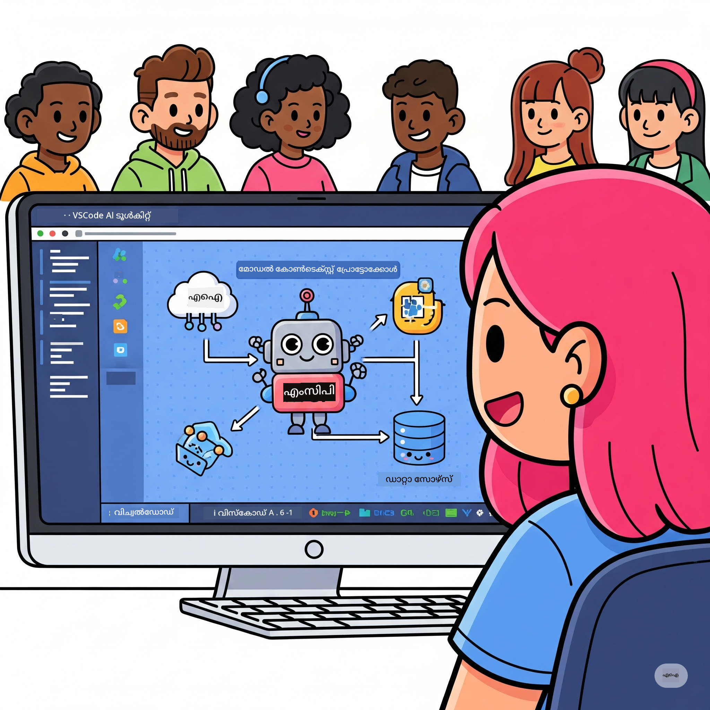
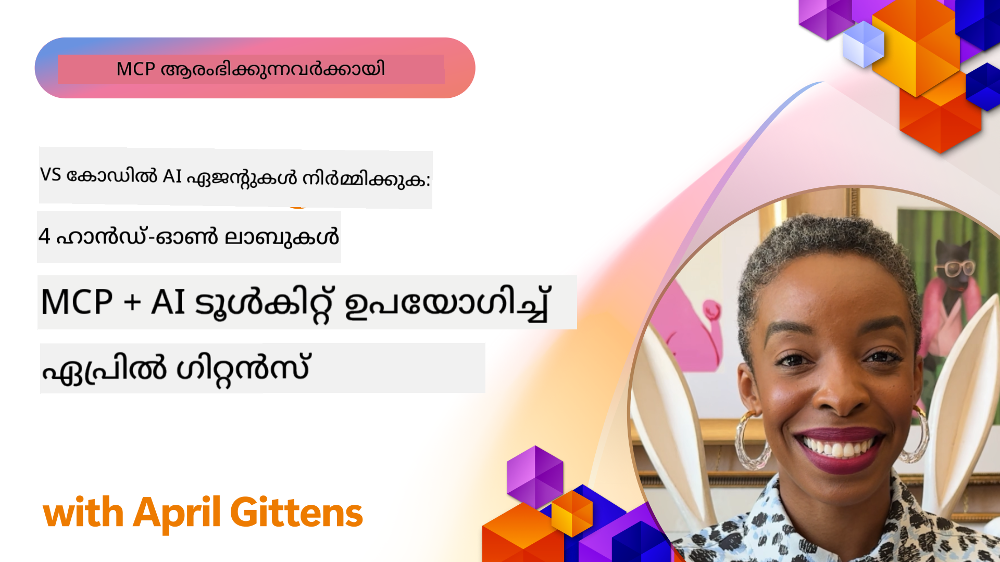

<!--
CO_OP_TRANSLATOR_METADATA:
{
  "original_hash": "1b000fd6e1b04c047578bfc5d07d54eb",
  "translation_date": "2025-12-11T11:40:02+00:00",
  "source_file": "10-StreamliningAIWorkflowsBuildingAnMCPServerWithAIToolkit/README.md",
  "language_code": "ml"
}
-->
# AI പ്രവൃത്തിപദ്ധതികൾ ലളിതമാക്കൽ: AI ടൂൾകിറ്റുമായി MCP സെർവർ നിർമ്മിക്കൽ

## 🎯 അവലോകനം

_(ഈ പാഠത്തിന്റെ വീഡിയോ കാണാൻ മുകളിൽ ചിത്രത്തിൽ ക്ലിക്ക് ചെയ്യുക)_

**Model Context Protocol (MCP) വർക്ക്‌ഷോപ്പിലേക്ക് സ്വാഗതം!** ഈ സമഗ്രമായ ഹാൻഡ്‌സ്-ഓൺ വർക്ക്‌ഷോപ്പ് രണ്ട് ആധുനിക സാങ്കേതികവിദ്യകൾ സംയോജിപ്പിച്ച് AI ആപ്ലിക്കേഷൻ വികസനത്തിൽ വിപ്ലവം സൃഷ്ടിക്കുന്നു:

- **🔗 Model Context Protocol (MCP)**: എളുപ്പത്തിൽ AI-ടൂൾ ഇന്റഗ്രേഷൻക്കുള്ള ഒരു തുറന്ന സ്റ്റാൻഡേർഡ്
- **🛠️ Visual Studio Code-നുള്ള AI ടൂൾകിറ്റ് (AITK)**: മൈക്രോസോഫ്റ്റിന്റെ ശക്തമായ AI വികസന എക്സ്റ്റൻഷൻ

### 🎓 നിങ്ങൾ പഠിക്കേണ്ടത്

ഈ വർക്ക്‌ഷോപ്പ് അവസാനിക്കുന്നതോടെ, AI മോഡലുകളെ യാഥാർത്ഥ്യത്തിലെ ടൂളുകളുമായി സേവനങ്ങളുമായി ബന്ധിപ്പിക്കുന്ന ബുദ്ധിമുട്ടുള്ള ആപ്ലിക്കേഷനുകൾ നിർമ്മിക്കുന്ന കലയിൽ നിങ്ങൾ പ്രാവീണ്യം നേടും. ഓട്ടോമേറ്റഡ് ടെസ്റ്റിംഗിൽ നിന്ന് കസ്റ്റം API ഇന്റഗ്രേഷനുകൾ വരെ, ബിസിനസ് വെല്ലുവിളികൾ പരിഹരിക്കാൻ പ്രായോഗിക കഴിവുകൾ നേടും.

## 🏗️ സാങ്കേതിക സ്റ്റാക്ക്

### 🔌 Model Context Protocol (MCP)

MCP ആണ് **"AI-ക്കുള്ള USB-C"** - AI മോഡലുകളെ ബാഹ്യ ടൂളുകളുമായി ഡാറ്റാ സ്രോതസ്സുകളുമായി ബന്ധിപ്പിക്കുന്ന സർവത്ര ഉപയോഗിക്കാവുന്ന സ്റ്റാൻഡേർഡ്.

**✨ പ്രധാന സവിശേഷതകൾ:**

- 🔄 **സ്റ്റാൻഡേർഡൈസ്ഡ് ഇന്റഗ്രേഷൻ**: AI-ടൂൾ കണക്ഷനുകൾക്കുള്ള സർവത്ര ഇന്റർഫേസ്
- 🏛️ **ഫ്ലെക്സിബിൾ ആർക്കിടെക്ചർ**: stdio/SSE ട്രാൻസ്പോർട്ട് വഴി ലോക്കൽ & റിമോട്ട് സെർവറുകൾ
- 🧰 **സമ്പന്നമായ ഇക്കോസിസ്റ്റം**: ടൂളുകൾ, പ്രോംപ്റ്റുകൾ, വിഭവങ്ങൾ ഒരേ പ്രോട്ടോക്കോളിൽ
- 🔒 **എന്റർപ്രൈസ്-റെഡി**: ഇൻബിൽറ്റ് സുരക്ഷയും വിശ്വാസ്യതയും

**🎯 MCP-ന്റെ പ്രാധാന്യം:**
USB-C കേബിൾ കുഴപ്പങ്ങൾ ഇല്ലാതാക്കിയതുപോലെ, MCP AI ഇന്റഗ്രേഷനുകളുടെ സങ്കീർണ്ണത ഇല്ലാതാക്കുന്നു. ഒരു പ്രോട്ടോക്കോൾ, അനന്ത സാധ്യതകൾ.

### 🤖 Visual Studio Code-നുള്ള AI ടൂൾകിറ്റ് (AITK)

മൈക്രോസോഫ്റ്റിന്റെ ഫ്ലാഗ്ഷിപ്പ് AI വികസന എക്സ്റ്റൻഷൻ, VS Code-നെ AI ശക്തികേന്ദ്രമാക്കുന്നു.

**🚀 പ്രധാന കഴിവുകൾ:**

- 📦 **മോഡൽ കാറ്റലോഗ്**: Azure AI, GitHub, Hugging Face, Ollama എന്നിവയിൽ നിന്നുള്ള മോഡലുകൾക്ക് ആക്‌സസ്
- ⚡ **ലോക്കൽ ഇൻഫറൻസ്**: ONNX-ഓപ്റ്റിമൈസ്ഡ് CPU/GPU/NPU എക്സിക്യൂഷൻ
- 🏗️ **എജന്റ് ബിൽഡർ**: MCP ഇന്റഗ്രേഷനോടുകൂടിയ ദൃശ്യ AI ഏജന്റ് വികസനം
- 🎭 **മൾട്ടി-മോഡൽ**: ടെക്സ്റ്റ്, ദൃശ്യവും ഘടനാപരമായ ഔട്ട്പുട്ടും പിന്തുണ

**💡 വികസന ലാഭങ്ങൾ:**

- സീറോ-കോൺഫിഗ് മോഡൽ ഡിപ്ലോയ്മെന്റ്
- ദൃശ്യ പ്രോംപ്റ്റ് എഞ്ചിനീയറിംഗ്
- റിയൽ-ടൈം ടെസ്റ്റിംഗ് പ്ലേഗ്രൗണ്ട്
- സ്മൂത്ത് MCP സെർവർ ഇന്റഗ്രേഷൻ

## 📚 പഠന യാത്ര

### [🚀 മോഡ്യൂൾ 1: AI ടൂൾകിറ്റ് അടിസ്ഥാനങ്ങൾ](./lab1/README.md)

**കാലാവധി**: 15 മിനിറ്റ്

- 🛠️ VS Code-നായി AI ടൂൾകിറ്റ് ഇൻസ്റ്റാൾ ചെയ്യുകയും കോൺഫിഗർ ചെയ്യുകയും ചെയ്യുക
- 🗂️ മോഡൽ കാറ്റലോഗ് (GitHub, ONNX, OpenAI, Anthropic, Google എന്നിവയിൽ നിന്നുള്ള 100+ മോഡലുകൾ) പരിശോധിക്കുക
- 🎮 റിയൽ-ടൈം മോഡൽ ടെസ്റ്റിംഗിനുള്ള ഇന്ററാക്ടീവ് പ്ലേഗ്രൗണ്ട് കൈകാര്യം ചെയ്യുക
- 🤖 ആദ്യ AI ഏജന്റ് എജന്റ് ബിൽഡറിലൂടെ നിർമ്മിക്കുക
- 📊 ഇൻബിൽറ്റ് മെട്രിക്‌സ് (F1, പ്രസക്തി, സമാനത, സുസംഘടിതത്വം) ഉപയോഗിച്ച് മോഡൽ പ്രകടനം വിലയിരുത്തുക
- ⚡ ബാച്ച് പ്രോസസ്സിംഗ്, മൾട്ടി-മോഡൽ പിന്തുണ കഴിവുകൾ പഠിക്കുക

**🎯 പഠന ഫലം**: AITK കഴിവുകൾ സമഗ്രമായി മനസ്സിലാക്കി പ്രവർത്തനക്ഷമമായ AI ഏജന്റ് സൃഷ്ടിക്കുക

### [🌐 മോഡ്യൂൾ 2: MCP AI ടൂൾകിറ്റുമായി അടിസ്ഥാനങ്ങൾ](./lab2/README.md)

**കാലാവധി**: 20 മിനിറ്റ്

- 🧠 Model Context Protocol (MCP) ആർക്കിടെക്ചർ, ആശയങ്ങൾ കൈകാര്യം ചെയ്യുക
- 🌐 മൈക്രോസോഫ്റ്റിന്റെ MCP സെർവർ ഇക്കോസിസ്റ്റം പരിശോധിക്കുക
- 🤖 Playwright MCP സെർവർ ഉപയോഗിച്ച് ബ്രൗസർ ഓട്ടോമേഷൻ ഏജന്റ് നിർമ്മിക്കുക
- 🔧 MCP സെർവറുകൾ AI ടൂൾകിറ്റ് ഏജന്റ് ബിൽഡറുമായി ഇന്റഗ്രേറ്റ് ചെയ്യുക
- 📊 ഏജന്റുകളിൽ MCP ടൂളുകൾ കോൺഫിഗർ ചെയ്ത് പരീക്ഷിക്കുക
- 🚀 MCP-പവർഡ് ഏജന്റുകൾ പ്രൊഡക്ഷനിലേക്ക് എക്സ്പോർട്ട് ചെയ്ത് ഡിപ്ലോയ് ചെയ്യുക

**🎯 പഠന ഫലം**: MCP വഴി ബാഹ്യ ടൂളുകളുമായി ശക്തിപ്പെടുത്തിയ AI ഏജന്റ് ഡിപ്ലോയ് ചെയ്യുക

### [🔧 മോഡ്യൂൾ 3: AI ടൂൾകിറ്റുമായി ആധുനിക MCP വികസനം](./lab3/README.md)

**കാലാവധി**: 20 മിനിറ്റ്

- 💻 AI ടൂൾകിറ്റ് ഉപയോഗിച്ച് കസ്റ്റം MCP സെർവറുകൾ സൃഷ്ടിക്കുക
- 🐍 ഏറ്റവും പുതിയ MCP Python SDK (v1.9.3) കോൺഫിഗർ ചെയ്ത് ഉപയോഗിക്കുക
- 🔍 ഡീബഗിംഗിനായി MCP ഇൻസ്പെക്ടർ സജ്ജമാക്കുക, ഉപയോഗിക്കുക
- 🛠️ പ്രൊഫഷണൽ ഡീബഗിംഗ് പ്രവൃത്തിപദ്ധതികളോടെ ഒരു വേതർ MCP സെർവർ നിർമ്മിക്കുക
- 🧪 ഏജന്റ് ബിൽഡറും ഇൻസ്പെക്ടറും പരിസരങ്ങളിൽ MCP സെർവറുകൾ ഡീബഗ് ചെയ്യുക

**🎯 പഠന ഫലം**: ആധുനിക ടൂളുകളോടെ കസ്റ്റം MCP സെർവറുകൾ വികസിപ്പിച്ച് ഡീബഗ് ചെയ്യുക

### [🐙 മോഡ്യൂൾ 4: പ്രായോഗിക MCP വികസനം - കസ്റ്റം GitHub ക്ലോൺ സെർവർ](./lab4/README.md)

**കാലാവധി**: 30 മിനിറ്റ്

- 🏗️ വികസന പ്രവൃത്തിപദ്ധതികൾക്കായി യഥാർത്ഥ GitHub ക്ലോൺ MCP സെർവർ നിർമ്മിക്കുക
- 🔄 സാധുവായ പരിശോധനയും പിശക് കൈകാര്യം ചെയ്യലും ഉൾപ്പെടെയുള്ള സ്മാർട്ട് റിപോസിറ്ററി ക്ലോണിംഗ് നടപ്പിലാക്കുക
- 📁 ബുദ്ധിമുട്ടില്ലാത്ത ഡയറക്ടറി മാനേജ്മെന്റ്, VS Code ഇന്റഗ്രേഷൻ സൃഷ്ടിക്കുക
- 🤖 GitHub Copilot ഏജന്റ് മോഡ് കസ്റ്റം MCP ടൂളുകളുമായി ഉപയോഗിക്കുക
- 🛡️ പ്രൊഡക്ഷൻ-റെഡി വിശ്വാസ്യതയും ക്രോസ്-പ്ലാറ്റ്ഫോം അനുയോജ്യതയും പ്രയോഗിക്കുക

**🎯 പഠന ഫലം**: യഥാർത്ഥ വികസന പ്രവൃത്തിപദ്ധതികൾ ലളിതമാക്കുന്ന പ്രൊഡക്ഷൻ-റെഡി MCP സെർവർ ഡിപ്ലോയ് ചെയ്യുക

## 💡 യഥാർത്ഥ ലോക ആപ്ലിക്കേഷനുകളും പ്രഭാവവും

### 🏢 എന്റർപ്രൈസ് ഉപയോഗ കേസുകൾ

#### 🔄 ഡെവ്‌ഓപ്സ് ഓട്ടോമേഷൻ

ബുദ്ധിമുട്ടില്ലാത്ത ഓട്ടോമേഷൻ ഉപയോഗിച്ച് നിങ്ങളുടെ വികസന പ്രവൃത്തിപദ്ധതി മാറ്റുക:

- **സ്മാർട്ട് റിപോസിറ്ററി മാനേജ്മെന്റ്**: AI-നിർദ്ദേശിത കോഡ് റിവ്യൂ, മർജ് തീരുമാനങ്ങൾ
- **ബുദ്ധിമുട്ടില്ലാത്ത CI/CD**: കോഡ് മാറ്റങ്ങളുടെ അടിസ്ഥാനത്തിൽ ഓട്ടോമേറ്റഡ് പൈപ്പ്‌ലൈൻ ഓപ്റ്റിമൈസേഷൻ
- **ഇഷ്യൂ ട്രയാജ്**: ഓട്ടോമാറ്റിക് ബഗ് വർഗ്ഗീകരണവും നിയോഗവും

#### 🧪 ഗുണനിലവാര ഉറപ്പ് വിപ്ലവം

AI-ശക്തിയുള്ള ഓട്ടോമേഷൻ ഉപയോഗിച്ച് ടെസ്റ്റിംഗ് ഉയർത്തുക:

- **ബുദ്ധിമുട്ടില്ലാത്ത ടെസ്റ്റ് ജനറേഷൻ**: സമഗ്രമായ ടെസ്റ്റ് സ്യൂട്ടുകൾ സ്വയം സൃഷ്ടിക്കുക
- **ദൃശ്യ റിഗ്രഷൻ ടെസ്റ്റിംഗ്**: AI-ശക്തിയുള്ള UI മാറ്റം കണ്ടെത്തൽ
- **പ്രകടന നിരീക്ഷണം**: മുൻകൂട്ടി പ്രശ്നങ്ങൾ തിരിച്ചറിയൽ, പരിഹാരം

#### 📊 ഡാറ്റ പൈപ്പ്‌ലൈൻ ബുദ്ധിമുട്ട്

ബുദ്ധിമുട്ടുള്ള ഡാറ്റ പ്രോസസ്സിംഗ് പ്രവൃത്തിപദ്ധതികൾ നിർമ്മിക്കുക:

- **അഡാപ്റ്റീവ് ETL പ്രോസസ്സുകൾ**: സ്വയം മെച്ചപ്പെടുത്തുന്ന ഡാറ്റ പരിവർത്തനങ്ങൾ
- **അനോമലി കണ്ടെത്തൽ**: റിയൽ-ടൈം ഡാറ്റ ഗുണനിലവാര നിരീക്ഷണം
- **ബുദ്ധിമുട്ടില്ലാത്ത റൂട്ടിംഗ്**: സ്മാർട്ട് ഡാറ്റ ഫ്ലോ മാനേജ്മെന്റ്

#### 🎧 ഉപഭോക്തൃ അനുഭവം മെച്ചപ്പെടുത്തൽ

അസാധാരണ ഉപഭോക്തൃ ഇടപെടലുകൾ സൃഷ്ടിക്കുക:

- **സന്ദർഭം-അറിയുന്ന പിന്തുണ**: ഉപഭോക്തൃ ചരിത്രം ആക്‌സസ് ചെയ്യുന്ന AI ഏജന്റുകൾ
- **പ്രവർത്തനപരമായ പ്രശ്ന പരിഹാരം**: പ്രവചനാത്മക ഉപഭോക്തൃ സേവനം
- **മൾട്ടി-ചാനൽ ഇന്റഗ്രേഷൻ**: പ്ലാറ്റ്ഫോമുകൾക്കിടയിൽ ഏകീകൃത AI അനുഭവം

## 🛠️ മുൻ‌അവശ്യങ്ങൾ & സജ്ജീകരണം

### 💻 സിസ്റ്റം ആവശ്യകതകൾ

| ഘടകം | ആവശ്യകത | കുറിപ്പുകൾ |
|-----------|-------------|-------|
| **ഓപ്പറേറ്റിംഗ് സിസ്റ്റം** | Windows 10+, macOS 10.15+, Linux | ഏതെങ്കിലും ആധുനിക OS |
| **Visual Studio Code** | ഏറ്റവും പുതിയ സ്ഥിരതയുള്ള പതിപ്പ് | AITK-ക്കായി ആവശ്യമാണ് |
| **Node.js** | v18.0+ & npm | MCP സെർവർ വികസനത്തിന് |
| **Python** | 3.10+ | Python MCP സെർവറുകൾക്കായി ഐച്ഛികം |
| **മെമ്മറി** | കുറഞ്ഞത് 8GB RAM | ലോക്കൽ മോഡലുകൾക്കായി 16GB ശുപാർശ ചെയ്യുന്നു |

### 🔧 വികസന പരിസ്ഥിതി

#### ശുപാർശ ചെയ്ത VS Code എക്സ്റ്റൻഷനുകൾ

- **AI Toolkit** (ms-windows-ai-studio.windows-ai-studio)
- **Python** (ms-python.python)
- **Python Debugger** (ms-python.debugpy)
- **GitHub Copilot** (GitHub.copilot) - ഐച്ഛികം, എന്നാൽ സഹായകരം

#### ഐച്ഛിക ടൂളുകൾ

- **uv**: ആധുനിക Python പാക്കേജ് മാനേജർ
- **MCP Inspector**: MCP സെർവറുകൾക്കുള്ള ദൃശ്യ ഡീബഗിംഗ് ടൂൾ
- **Playwright**: വെബ് ഓട്ടോമേഷൻ ഉദാഹരണങ്ങൾക്ക്

## 🎖️ പഠന ഫലങ്ങളും സർട്ടിഫിക്കേഷൻ പാതയും

### 🏆 കഴിവ് പ്രാവീണ്യ ചെക്ക്ലിസ്റ്റ്

ഈ വർക്ക്‌ഷോപ്പ് പൂർത്തിയാക്കിയാൽ, നിങ്ങൾ പ്രാവീണ്യം നേടും:

#### 🎯 പ്രധാന കഴിവുകൾ

- [ ] **MCP പ്രോട്ടോക്കോൾ പ്രാവീണ്യം**: ആർക്കിടെക്ചർ, നടപ്പാക്കൽ മാതൃകകളുടെ ആഴത്തിലുള്ള മനസ്സിലാക്കൽ
- [ ] **AITK പ്രാവീണ്യം**: AI ടൂൾകിറ്റ് വേഗത്തിലുള്ള വികസനത്തിനുള്ള വിദഗ്ധ ഉപയോഗം
- [ ] **കസ്റ്റം സെർവർ വികസനം**: MCP സെർവറുകൾ നിർമ്മിച്ച്, ഡിപ്ലോയ് ചെയ്ത് പരിപാലിക്കുക
- [ ] **ടൂൾ ഇന്റഗ്രേഷൻ മികവ്**: നിലവിലുള്ള വികസന പ്രവൃത്തിപദ്ധതികളുമായി AI ലളിതമായി ബന്ധിപ്പിക്കുക
- [ ] **പ്രശ്നപരിഹാര പ്രയോഗം**: പഠിച്ച കഴിവുകൾ യഥാർത്ഥ ബിസിനസ് വെല്ലുവിളികളിൽ പ്രയോഗിക്കുക

#### 🔧 സാങ്കേതിക കഴിവുകൾ

- [ ] VS Code-ൽ AI ടൂൾകിറ്റ് സജ്ജമാക്കുക, കോൺഫിഗർ ചെയ്യുക
- [ ] കസ്റ്റം MCP സെർവറുകൾ രൂപകൽപ്പന ചെയ്ത് നടപ്പിലാക്കുക
- [ ] GitHub മോഡലുകൾ MCP ആർക്കിടെക്ചറുമായി ഇന്റഗ്രേറ്റ് ചെയ്യുക
- [ ] Playwright ഉപയോഗിച്ച് ഓട്ടോമേറ്റഡ് ടെസ്റ്റിംഗ് പ്രവൃത്തിപദ്ധതികൾ നിർമ്മിക്കുക
- [ ] പ്രൊഡക്ഷൻ ഉപയോഗത്തിനായി AI ഏജന്റുകൾ ഡിപ്ലോയ് ചെയ്യുക
- [ ] MCP സെർവർ പ്രകടനം ഡീബഗ് ചെയ്ത് മെച്ചപ്പെടുത്തുക

#### 🚀 ആധുനിക കഴിവുകൾ

- [ ] എന്റർപ്രൈസ്-സ്കെയിൽ AI ഇന്റഗ്രേഷനുകൾ ആർക്കിടെക്ചർ ചെയ്യുക
- [ ] AI ആപ്ലിക്കേഷനുകൾക്കായി സുരക്ഷാ മികച്ച രീതികൾ നടപ്പിലാക്കുക
- [ ] സ്കെയിലബിൾ MCP സെർവർ ആർക്കിടെക്ചറുകൾ രൂപകൽപ്പന ചെയ്യുക
- [ ] പ്രത്യേക ഡൊമെയ്ൻ ടൂൾ ചെയിനുകൾ സൃഷ്ടിക്കുക
- [ ] AI-നേറ്റീവ് വികസനത്തിൽ മറ്റുള്ളവരെ മെന്റർ ചെയ്യുക

## 📖 അധിക വിഭവങ്ങൾ

- [MCP സ്പെസിഫിക്കേഷൻ](https://modelcontextprotocol.io/docs)
- [AI Toolkit GitHub റിപോസിറ്ററി](https://github.com/microsoft/vscode-ai-toolkit)
- [സാമ്പിൾ MCP സെർവറുകളുടെ ശേഖരം](https://github.com/modelcontextprotocol/servers)
- [മികച്ച പ്രാക്ടീസുകൾ ഗൈഡ്](https://modelcontextprotocol.io/docs/best-practices)

---

**🚀 നിങ്ങളുടെ AI വികസന പ്രവൃത്തിപദ്ധതി വിപ്ലവകരമാക്കാൻ തയ്യാറാണോ?**

MCP-യും AI ടൂൾകിറ്റും ഉപയോഗിച്ച് ബുദ്ധിമുട്ടില്ലാത്ത ആപ്ലിക്കേഷനുകളുടെ ഭാവി നമുക്ക് ചേർന്ന് നിർമ്മിക്കാം!

---

<!-- CO-OP TRANSLATOR DISCLAIMER START -->
**അസൂയാ**:  
ഈ രേഖ AI വിവർത്തന സേവനം [Co-op Translator](https://github.com/Azure/co-op-translator) ഉപയോഗിച്ച് വിവർത്തനം ചെയ്തതാണ്. നാം കൃത്യതയ്ക്ക് ശ്രമിച്ചെങ്കിലും, സ്വയം പ്രവർത്തിക്കുന്ന വിവർത്തനങ്ങളിൽ പിശകുകൾ അല്ലെങ്കിൽ തെറ്റുകൾ ഉണ്ടാകാമെന്ന് ദയവായി ശ്രദ്ധിക്കുക. അതിന്റെ മാതൃഭാഷയിലുള്ള യഥാർത്ഥ രേഖയാണ് പ്രാമാണികമായ ഉറവിടം എന്ന് പരിഗണിക്കേണ്ടതാണ്. നിർണായക വിവരങ്ങൾക്ക്, പ്രൊഫഷണൽ മനുഷ്യ വിവർത്തനം ശുപാർശ ചെയ്യപ്പെടുന്നു. ഈ വിവർത്തനത്തിന്റെ ഉപയോഗത്തിൽ നിന്നുണ്ടാകുന്ന ഏതെങ്കിലും തെറ്റിദ്ധാരണകൾക്കോ തെറ്റായ വ്യാഖ്യാനങ്ങൾക്കോ ഞങ്ങൾ ഉത്തരവാദികളല്ല.
<!-- CO-OP TRANSLATOR DISCLAIMER END -->