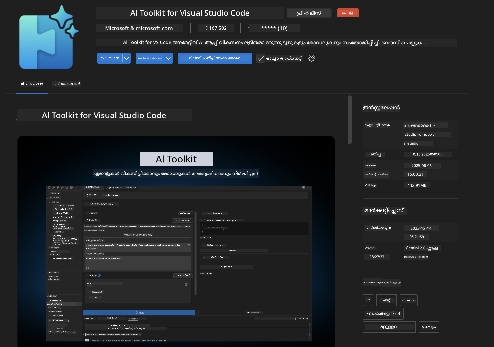
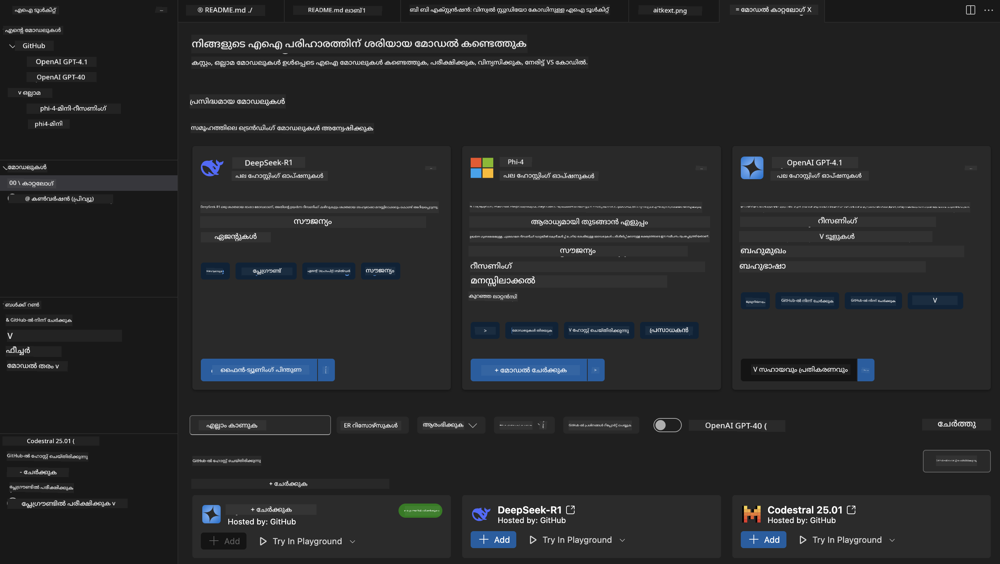
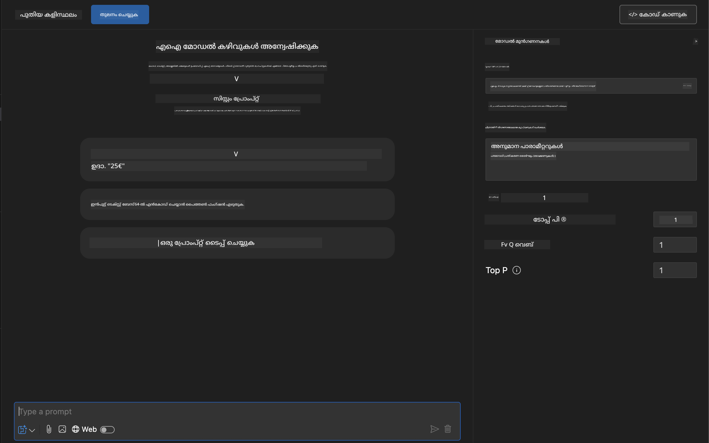
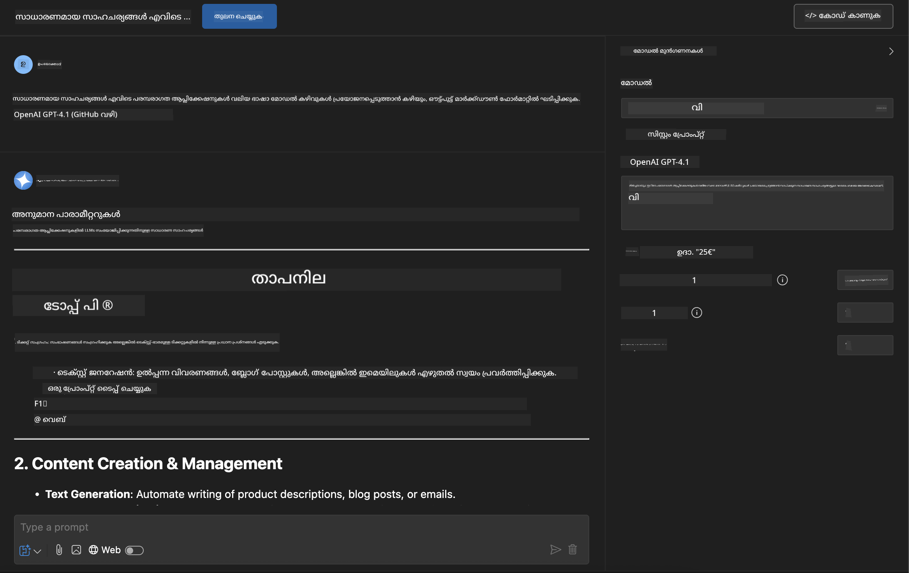
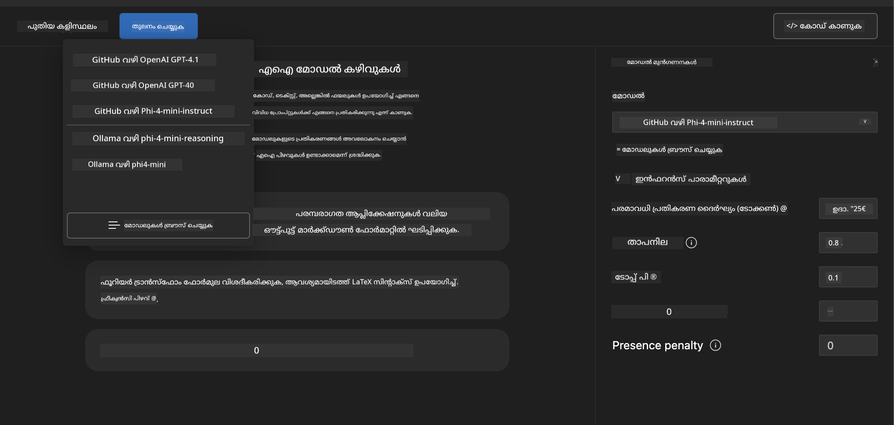
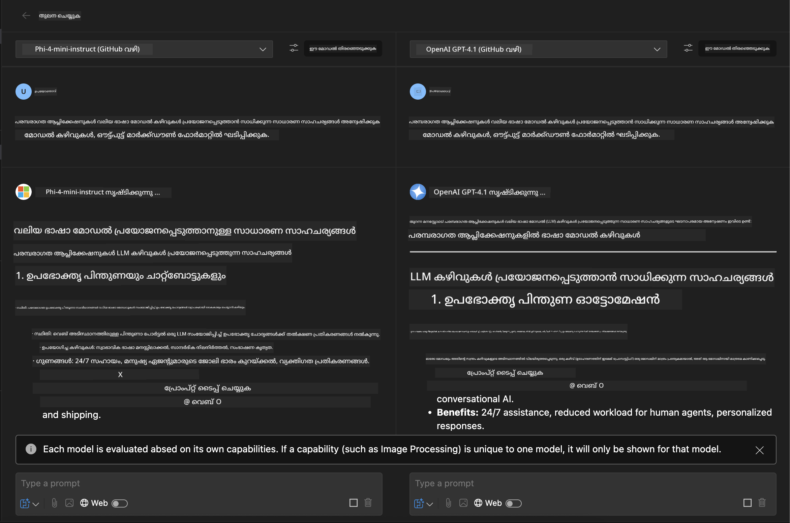
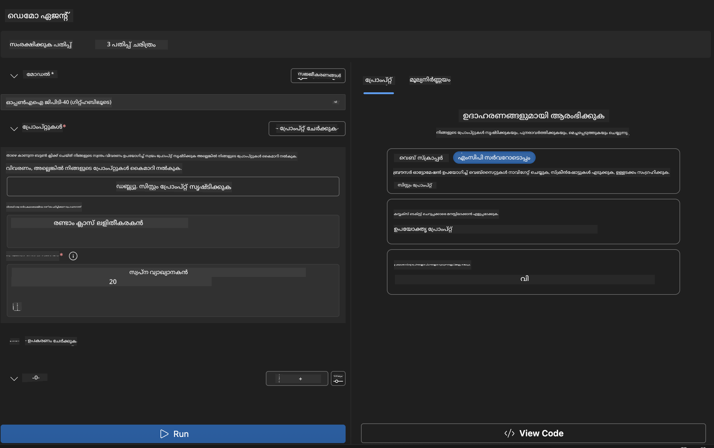
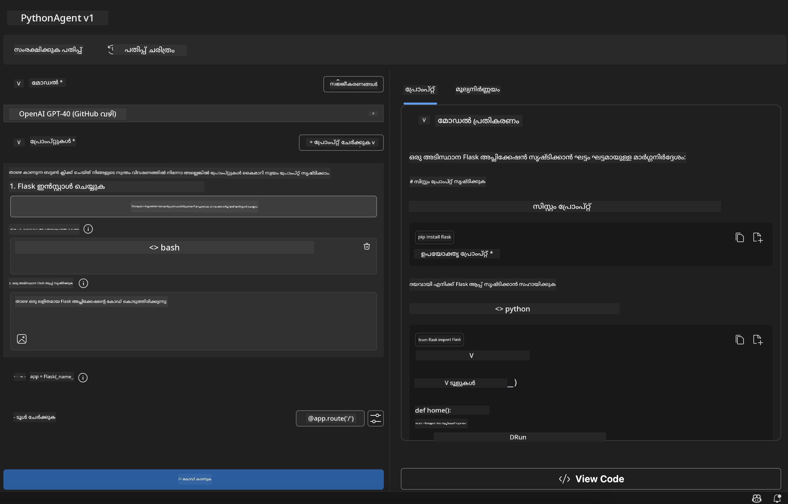

<!--
CO_OP_TRANSLATOR_METADATA:
{
  "original_hash": "2aa9dbc165e104764fa57e8a0d3f1c73",
  "translation_date": "2025-12-11T16:44:31+00:00",
  "source_file": "10-StreamliningAIWorkflowsBuildingAnMCPServerWithAIToolkit/lab1/README.md",
  "language_code": "ml"
}
-->
# 🚀 മോഡ്യൂൾ 1: AI ടൂൾകിറ്റ് അടിസ്ഥാനങ്ങൾ

[]()
[]()
[]()

## 📋 പഠന ലക്ഷ്യങ്ങൾ

ഈ മോഡ്യൂൾ അവസാനിക്കുന്നതോടെ, നിങ്ങൾക്ക് കഴിയും:
- ✅ Visual Studio Code-നായി AI ടൂൾകിറ്റ് ഇൻസ്റ്റാൾ ചെയ്ത് കോൺഫിഗർ ചെയ്യുക
- ✅ മോഡൽ കാറ്റലോഗ് നാവിഗേറ്റ് ചെയ്ത് വ്യത്യസ്ത മോഡൽ ഉറവിടങ്ങൾ മനസിലാക്കുക
- ✅ മോഡൽ ടെസ്റ്റിംഗിനും പരീക്ഷണത്തിനും പ്ലേഗ്രൗണ്ട് ഉപയോഗിക്കുക
- ✅ ഏജന്റ് ബിൽഡർ ഉപയോഗിച്ച് കസ്റ്റം AI ഏജന്റുകൾ സൃഷ്ടിക്കുക
- ✅ വ്യത്യസ്ത പ്രൊവൈഡർമാരുടെ മോഡൽ പ്രകടനം താരതമ്യം ചെയ്യുക
- ✅ പ്രോംപ്റ്റ് എഞ്ചിനീയറിംഗിനുള്ള മികച്ച പ്രാക്ടീസുകൾ പ്രയോഗിക്കുക

## 🧠 AI ടൂൾകിറ്റിലേക്ക് പരിചയം (AITK)

**Visual Studio Code-നായി AI ടൂൾകിറ്റ്** മൈക്രോസോഫ്റ്റിന്റെ ഫ്ലാഗ്ഷിപ്പ് എക്സ്റ്റൻഷനാണ്, ഇത് VS Code-നെ സമഗ്രമായ AI വികസന പരിസ്ഥിതിയാക്കി മാറ്റുന്നു. ഇത് AI ഗവേഷണവും പ്രായോഗിക അപ്ലിക്കേഷൻ വികസനവും തമ്മിലുള്ള ഇടവേള പൂരിപ്പിച്ച്, ജനറേറ്റീവ് AI എല്ലാ കഴിവുള്ള ഡെവലപ്പർമാർക്കും ലഭ്യമാക്കുന്നു.

### 🌟 പ്രധാന കഴിവുകൾ

| സവിശേഷത | വിവരണം | ഉപയോഗം |
|---------|-------------|----------|
| **🗂️ മോഡൽ കാറ്റലോഗ്** | GitHub, ONNX, OpenAI, Anthropic, Google എന്നിവയിൽ നിന്നുള്ള 100+ മോഡലുകൾ | മോഡൽ കണ്ടെത്തലും തിരഞ്ഞെടുപ്പും |
| **🔌 BYOM പിന്തുണ** | നിങ്ങളുടെ സ്വന്തം മോഡലുകൾ (ലോകൽ/റിമോട്ട്) സംയോജിപ്പിക്കുക | കസ്റ്റം മോഡൽ വിന്യാസം |
| **🎮 ഇന്ററാക്ടീവ് പ്ലേഗ്രൗണ്ട്** | ചാറ്റ് ഇന്റർഫേസോടെ റിയൽ-ടൈം മോഡൽ ടെസ്റ്റിംഗ് | വേഗത്തിലുള്ള പ്രോട്ടോടൈപ്പിംഗ്, ടെസ്റ്റിംഗ് |
| **📎 മൾട്ടി-മോഡൽ പിന്തുണ** | ടെക്സ്റ്റ്, ചിത്രങ്ങൾ, അറ്റാച്ച്മെന്റുകൾ കൈകാര്യം ചെയ്യുക | സങ്കീർണ്ണ AI അപ്ലിക്കേഷനുകൾ |
| **⚡ ബാച്ച് പ്രോസസ്സിംഗ്** | ഒരേസമയം നിരവധി പ്രോംപ്റ്റുകൾ പ്രവർത്തിപ്പിക്കുക | കാര്യക്ഷമമായ ടെസ്റ്റിംഗ് പ്രവാഹങ്ങൾ |
| **📊 മോഡൽ മൂല്യനിർണ്ണയം** | ഇൻബിൽറ്റ് മെട്രിക്‌സ് (F1, പ്രസക്തി, സമാനത, ഏകോപനം) | പ്രകടന വിലയിരുത്തൽ |

### 🎯 AI ടൂൾകിറ്റ് എന്തുകൊണ്ട് പ്രധാനമാണ്

- **🚀 വേഗതയുള്ള വികസനം**: ആശയത്തിൽ നിന്ന് പ്രോട്ടോടൈപ്പിലേക്ക് മിനിറ്റുകളിൽ
- **🔄 ഏകീകൃത പ്രവൃത്തി പ്രവാഹം**: പല AI പ്രൊവൈഡർമാർക്കും ഒരേ ഇന്റർഫേസ്
- **🧪 എളുപ്പത്തിലുള്ള പരീക്ഷണം**: സങ്കീർണ്ണ ക്രമീകരണമില്ലാതെ മോഡലുകൾ താരതമ്യം ചെയ്യുക
- **📈 പ്രൊഡക്ഷൻ റെഡി**: പ്രോട്ടോടൈപ്പിൽ നിന്ന് വിന്യാസത്തിലേക്ക് സുതാര്യമായ മാറ്റം

## 🛠️ മുൻകൂട്ടി ആവശ്യങ്ങൾ & സജ്ജീകരണം

### 📦 AI ടൂൾകിറ്റ് എക്സ്റ്റൻഷൻ ഇൻസ്റ്റാൾ ചെയ്യുക

**പടി 1: എക്സ്റ്റൻഷൻസ് മാർക്കറ്റ്പ്ലേസ് ആക്‌സസ് ചെയ്യുക**
1. Visual Studio Code തുറക്കുക
2. എക്സ്റ്റൻഷൻസ് വ്യൂവിലേക്ക് പോകുക (`Ctrl+Shift+X` അല്ലെങ്കിൽ `Cmd+Shift+X`)
3. "AI Toolkit" തിരയുക

**പടി 2: നിങ്ങളുടെ പതിപ്പ് തിരഞ്ഞെടുക്കുക**
- **🟢 റിലീസ്**: പ്രൊഡക്ഷൻ ഉപയോഗത്തിന് ശുപാർശ ചെയ്യുന്നു
- **🔶 പ്രീ-റിലീസ്**: പുതിയ സവിശേഷതകൾക്ക് മുൻകൂർ ആക്‌സസ്

**പടി 3: ഇൻസ്റ്റാൾ ചെയ്ത് സജീവമാക്കുക**



### ✅ പരിശോധനാ പട്ടിക
- [ ] AI ടൂൾകിറ്റ് ഐക്കൺ VS Code സൈഡ്ബാറിൽ കാണപ്പെടുന്നു
- [ ] എക്സ്റ്റൻഷൻ സജീവമാക്കി പ്രവർത്തനക്ഷമമാക്കി
- [ ] ഔട്ട്പുട്ട് പാനലിൽ ഇൻസ്റ്റലേഷൻ പിശകുകൾ ഇല്ല

## 🧪 ഹാൻഡ്‌സ്-ഓൺ വ്യായാമം 1: GitHub മോഡലുകൾ പരിശോധിക്കൽ

**🎯 ലക്ഷ്യം**: മോഡൽ കാറ്റലോഗ് കൈകാര്യം ചെയ്യാനും നിങ്ങളുടെ ആദ്യ AI മോഡൽ പരീക്ഷിക്കാനും പഠിക്കുക

### 📊 പടി 1: മോഡൽ കാറ്റലോഗ് നാവിഗേറ്റ് ചെയ്യുക

മോഡൽ കാറ്റലോഗ് AI പരിസ്ഥിതിയിലേക്കുള്ള നിങ്ങളുടെ ഗേറ്റ്വേ ആണ്. ഇത് പല പ്രൊവൈഡർമാരിൽ നിന്നുള്ള മോഡലുകൾ സംഗ്രഹിച്ച് കണ്ടെത്തലും താരതമ്യവും എളുപ്പമാക്കുന്നു.

**🔍 നാവിഗേഷൻ ഗൈഡ്:**

AI ടൂൾകിറ്റ് സൈഡ്ബാറിൽ **MODELS - Catalog** ക്ലിക്ക് ചെയ്യുക



**💡 പ്രോ ടിപ്പ്**: നിങ്ങളുടെ ഉപയോഗത്തിനനുസരിച്ച് പ്രത്യേക കഴിവുകൾ ഉള്ള മോഡലുകൾ തിരയുക (ഉദാ: കോഡ് ജനറേഷൻ, സൃഷ്ടിപരമായ എഴുത്ത്, വിശകലനം).

**⚠️ ശ്രദ്ധിക്കുക**: GitHub-ഹോസ്റ്റുചെയ്ത മോഡലുകൾ (GitHub മോഡലുകൾ) ഉപയോഗിക്കുന്നത് സൗജന്യമാണ്, പക്ഷേ അഭ്യർത്ഥനകളിലും ടോക്കണുകളിലും നിരക്ക് പരിധികൾ ബാധകമാണ്. GitHub അല്ലാത്ത മോഡലുകൾ (ഉദാ: Azure AI അല്ലെങ്കിൽ മറ്റ് എന്റ്പോയിന്റുകൾ വഴി ഹോസ്റ്റുചെയ്ത മോഡലുകൾ) ആക്‌സസ് ചെയ്യാൻ അനുയോജ്യമായ API കീ അല്ലെങ്കിൽ ഓതന്റിക്കേഷൻ നൽകേണ്ടതുണ്ട്.

### 🚀 പടി 2: നിങ്ങളുടെ ആദ്യ മോഡൽ ചേർക്കുകയും കോൺഫിഗർ ചെയ്യുകയും ചെയ്യുക

**മോഡൽ തിരഞ്ഞെടുപ്പ് തന്ത്രം:**
- **GPT-4.1**: സങ്കീർണ്ണമായ നിരീക്ഷണത്തിനും വിശകലനത്തിനും മികച്ചത്
- **Phi-4-mini**: ലഘുവും വേഗത്തിലുള്ള പ്രതികരണങ്ങൾക്കായി

**🔧 കോൺഫിഗറേഷൻ പ്രക്രിയ:**
1. കാറ്റലോഗിൽ നിന്ന് **OpenAI GPT-4.1** തിരഞ്ഞെടുക്കുക
2. **Add to My Models** ക്ലിക്ക് ചെയ്ത് മോഡൽ ഉപയോഗത്തിനായി രജിസ്റ്റർ ചെയ്യുക
3. **Try in Playground** തിരഞ്ഞെടുക്കുക, ടെസ്റ്റിംഗ് പരിസ്ഥിതി ആരംഭിക്കാൻ
4. മോഡൽ ഇൻഷിയലൈസേഷൻ കാത്തിരിക്കുക (ആദ്യ തവണ സജ്ജീകരണം കുറച്ച് സമയം എടുക്കാം)



**⚙️ മോഡൽ പാരാമീറ്ററുകൾ മനസിലാക്കുക:**
- **Temperature**: സൃഷ്ടിപരത്വം നിയന്ത്രിക്കുന്നു (0 = നിർണ്ണായക, 1 = സൃഷ്ടിപരമായ)
- **Max Tokens**: പരമാവധി പ്രതികരണ ദൈർഘ്യം
- **Top-p**: പ്രതികരണ വൈവിധ്യം ഉറപ്പാക്കാൻ ന്യൂക്ലിയസ് സാമ്പ്ലിംഗ്

### 🎯 പടി 3: പ്ലേഗ്രൗണ്ട് ഇന്റർഫേസ് കൈകാര്യം ചെയ്യുക

പ്ലേഗ്രൗണ്ട് നിങ്ങളുടെ AI പരീക്ഷണശാലയാണ്. ഇതിന്റെ ശേഷി പരമാവധി ഉപയോഗിക്കാൻ:

**🎨 പ്രോംപ്റ്റ് എഞ്ചിനീയറിംഗിന്റെ മികച്ച പ്രാക്ടീസുകൾ:**
1. **നിർദ്ദിഷ്ടമാകുക**: വ്യക്തവും വിശദവുമായ നിർദ്ദേശങ്ങൾ മികച്ച ഫലങ്ങൾ നൽകും
2. **സന്ദർഭം നൽകുക**: ബന്ധപ്പെട്ട പശ്ചാത്തല വിവരങ്ങൾ ഉൾപ്പെടുത്തുക
3. **ഉദാഹരണങ്ങൾ ഉപയോഗിക്കുക**: മോഡലിന് നിങ്ങൾ എന്ത് വേണമെന്ന് ഉദാഹരണങ്ങളിലൂടെ കാണിക്കുക
4. **പുനരാവർത്തനം**: ആദ്യ ഫലങ്ങളുടെ അടിസ്ഥാനത്തിൽ പ്രോംപ്റ്റുകൾ മെച്ചപ്പെടുത്തുക

**🧪 ടെസ്റ്റിംഗ് സീനാരിയോകൾ:**
```markdown
# Example 1: Code Generation
"Write a Python function that calculates the factorial of a number using recursion. Include error handling and docstrings."

# Example 2: Creative Writing
"Write a professional email to a client explaining a project delay, maintaining a positive tone while being transparent about challenges."

# Example 3: Data Analysis
"Analyze this sales data and provide insights: [paste your data]. Focus on trends, anomalies, and actionable recommendations."
```



### 🏆 ചലഞ്ച് വ്യായാമം: മോഡൽ പ്രകടനം താരതമ്യം ചെയ്യുക

**🎯 ലക്ഷ്യം**: ഒരേ പ്രോംപ്റ്റുകൾ ഉപയോഗിച്ച് വ്യത്യസ്ത മോഡലുകൾ താരതമ്യം ചെയ്ത് അവയുടെ ശക്തികൾ മനസിലാക്കുക

**📋 നിർദ്ദേശങ്ങൾ:**
1. **Phi-4-mini** നിങ്ങളുടെ വർക്ക്‌സ്പേസിൽ ചേർക്കുക
2. GPT-4.1-നും Phi-4-mini-ക്കും ഒരേ പ്രോംപ്റ്റ് ഉപയോഗിക്കുക



3. പ്രതികരണ ഗുണമേന്മ, വേഗം, കൃത്യത താരതമ്യം ചെയ്യുക
4. ഫലങ്ങൾ രേഖപ്പെടുത്തുക



**💡 കണ്ടെത്തേണ്ട പ്രധാന കാര്യങ്ങൾ:**
- LLM vs SLM എപ്പോൾ ഉപയോഗിക്കണം
- ചെലവ് vs പ്രകടനം തുല്യങ്ങൾ
- വ്യത്യസ്ത മോഡലുകളുടെ പ്രത്യേക കഴിവുകൾ

## 🤖 ഹാൻഡ്‌സ്-ഓൺ വ്യായാമം 2: ഏജന്റ് ബിൽഡർ ഉപയോഗിച്ച് കസ്റ്റം ഏജന്റുകൾ നിർമ്മിക്കൽ

**🎯 ലക്ഷ്യം**: പ്രത്യേക ജോലികൾക്കും പ്രവൃത്തി പ്രവാഹങ്ങൾക്കും അനുയോജ്യമായ പ്രത്യേക AI ഏജന്റുകൾ സൃഷ്ടിക്കുക

### 🏗️ പടി 1: ഏജന്റ് ബിൽഡർ മനസിലാക്കുക

AI ടൂൾകിറ്റിന്റെ സവിശേഷതയായ ഏജന്റ് ബിൽഡർ, വലിയ ഭാഷാ മോഡലുകളുടെ ശക്തി കസ്റ്റം നിർദ്ദേശങ്ങൾ, പ്രത്യേക പാരാമീറ്ററുകൾ, വിദഗ്ധ അറിവ് എന്നിവയുമായി സംയോജിപ്പിച്ച് ലക്ഷ്യനിർദ്ദിഷ്ട AI അസിസ്റ്റന്റുകൾ സൃഷ്ടിക്കാൻ സഹായിക്കുന്നു.

**🧠 ഏജന്റ് ആർക്കിടെക്ചർ ഘടകങ്ങൾ:**
- **കോർ മോഡൽ**: അടിസ്ഥാന LLM (GPT-4, Groks, Phi, മുതലായവ)
- **സിസ്റ്റം പ്രോംപ്റ്റ്**: ഏജന്റിന്റെ വ്യക്തിത്വവും പെരുമാറ്റവും നിർവചിക്കുന്നു
- **പാരാമീറ്ററുകൾ**: മികച്ച പ്രകടനത്തിനുള്ള ഫൈൻ-ട്യൂൺ ചെയ്ത ക്രമീകരണങ്ങൾ
- **ടൂൾസ് ഇന്റഗ്രേഷൻ**: ബാഹ്യ API-കൾക്കും MCP സേവനങ്ങൾക്കും കണക്റ്റ് ചെയ്യുക
- **മെമ്മറി**: സംഭാഷണ പശ്ചാത്തലവും സെഷൻ സ്ഥിരതയും



### ⚙️ പടി 2: ഏജന്റ് കോൺഫിഗറേഷൻ വിശദമായി

**🎨 ഫലപ്രദമായ സിസ്റ്റം പ്രോംപ്റ്റുകൾ സൃഷ്ടിക്കൽ:**
```markdown
# Template Structure:
## Role Definition
You are a [specific role] with expertise in [domain].

## Capabilities
- List specific abilities
- Define scope of knowledge
- Clarify limitations

## Behavior Guidelines
- Response style (formal, casual, technical)
- Output format preferences
- Error handling approach

## Examples
Provide 2-3 examples of ideal interactions
```

*നിങ്ങൾക്ക് Generate System Prompt ഉപയോഗിച്ച് AI-യുടെ സഹായത്തോടെ പ്രോംപ്റ്റുകൾ സൃഷ്ടിക്കുകയും മെച്ചപ്പെടുത്തുകയും ചെയ്യാം*

**🔧 പാരാമീറ്റർ ഓപ്റ്റിമൈസേഷൻ:**
| പാരാമീറ്റർ | ശുപാർശ ചെയ്ത പരിധി | ഉപയോഗം |
|-----------|------------------|----------|
| **Temperature** | 0.1-0.3 | സാങ്കേതിക/വാസ്തവ പ്രതികരണങ്ങൾ |
| **Temperature** | 0.7-0.9 | സൃഷ്ടിപരമായ/ബ്രെയിൻസ്റ്റോർമിംഗ് ജോലികൾ |
| **Max Tokens** | 500-1000 | സംക്ഷിപ്ത പ്രതികരണങ്ങൾ |
| **Max Tokens** | 2000-4000 | വിശദമായ വിശദീകരണങ്ങൾ |

### 🐍 പടി 3: പ്രായോഗിക വ്യായാമം - പൈത്തൺ പ്രോഗ്രാമിംഗ് ഏജന്റ്

**🎯 ദൗത്യം**: പ്രത്യേക പൈത്തൺ കോഡിംഗ് അസിസ്റ്റന്റ് സൃഷ്ടിക്കുക

**📋 കോൺഫിഗറേഷൻ ഘട്ടങ്ങൾ:**

1. **മോഡൽ തിരഞ്ഞെടുപ്പ്**: **Claude 3.5 Sonnet** (കോഡിനായി മികച്ചത്) തിരഞ്ഞെടുക്കുക

2. **സിസ്റ്റം പ്രോംപ്റ്റ് ഡിസൈൻ**:
```markdown
# Python Programming Expert Agent

## Role
You are a senior Python developer with 10+ years of experience. You excel at writing clean, efficient, and well-documented Python code.

## Capabilities
- Write production-ready Python code
- Debug complex issues
- Explain code concepts clearly
- Suggest best practices and optimizations
- Provide complete working examples

## Response Format
- Always include docstrings
- Add inline comments for complex logic
- Suggest testing approaches
- Mention relevant libraries when applicable

## Code Quality Standards
- Follow PEP 8 style guidelines
- Use type hints where appropriate
- Handle exceptions gracefully
- Write readable, maintainable code
```

3. **പാരാമീറ്റർ കോൺഫിഗറേഷൻ**:
   - Temperature: 0.2 (സ്ഥിരതയുള്ള, വിശ്വസനീയമായ കോഡിനായി)
   - Max Tokens: 2000 (വിശദമായ വിശദീകരണങ്ങൾ)
   - Top-p: 0.9 (സമതുല്യമായ സൃഷ്ടിപരത്വം)



### 🧪 പടി 4: നിങ്ങളുടെ പൈത്തൺ ഏജന്റ് പരീക്ഷിക്കുക

**ടെസ്റ്റിംഗ് സീനാരിയോകൾ:**
1. **അടിസ്ഥാന ഫംഗ്ഷൻ**: "പ്രൈം നമ്പറുകൾ കണ്ടെത്തുന്ന ഫംഗ്ഷൻ സൃഷ്ടിക്കുക"
2. **സങ്കീർണ്ണ ആൽഗോരിതം**: "ഇൻസേർട്ട്, ഡിലീറ്റ്, സെർച്ച് മെത്തഡുകളുള്ള ബൈനറി സെർച്ച് ട്രീ നടപ്പിലാക്കുക"
3. **യഥാർത്ഥ ലോക പ്രശ്നം**: "റേറ്റ് ലിമിറ്റിംഗ്, റിട്രൈകൾ കൈകാര്യം ചെയ്യുന്ന വെബ് സ്ക്രാപ്പർ നിർമ്മിക്കുക"
4. **ഡീബഗ്ഗിംഗ്**: "ഈ കോഡ് ശരിയാക്കുക [പേസ്റ്റ് ബഗ്ഗി കോഡ്]"

**🏆 വിജയ മാനദണ്ഡങ്ങൾ:**
- ✅ കോഡ് പിശകുകൾ കൂടാതെ പ്രവർത്തിക്കുന്നു
- ✅ ശരിയായ ഡോക്യുമെന്റേഷൻ ഉൾക്കൊള്ളുന്നു
- ✅ പൈത്തൺ മികച്ച പ്രാക്ടീസുകൾ പാലിക്കുന്നു
- ✅ വ്യക്തമായ വിശദീകരണങ്ങൾ നൽകുന്നു
- ✅ മെച്ചപ്പെടുത്തലുകൾ നിർദ്ദേശിക്കുന്നു

## 🎓 മോഡ്യൂൾ 1 സമാപനം & അടുത്ത ഘട്ടങ്ങൾ

### 📊 അറിവ് പരിശോധന

നിങ്ങളുടെ മനസ്സിലാക്കൽ പരിശോധിക്കുക:
- [ ] കാറ്റലോഗിലെ മോഡലുകൾ തമ്മിലുള്ള വ്യത്യാസം വിശദീകരിക്കാമോ?
- [ ] നിങ്ങൾ വിജയകരമായി ഒരു കസ്റ്റം ഏജന്റ് സൃഷ്ടിച്ച് പരീക്ഷിച്ചിട്ടുണ്ടോ?
- [ ] വ്യത്യസ്ത ഉപയോഗങ്ങൾക്ക് പാരാമീറ്ററുകൾ എങ്ങനെ ഓപ്റ്റിമൈസ് ചെയ്യാമെന്ന് മനസിലാക്കുന്നുണ്ടോ?
- [ ] ഫലപ്രദമായ സിസ്റ്റം പ്രോംപ്റ്റുകൾ രൂപകൽപ്പന ചെയ്യാമോ?

### 📚 അധിക സ്രോതസ്സുകൾ

- **AI ടൂൾകിറ്റ് ഡോക്യുമെന്റേഷൻ**: [അധികൃത മൈക്രോസോഫ്റ്റ് ഡോക്സ്](https://github.com/microsoft/vscode-ai-toolkit)
- **പ്രോംപ്റ്റ് എഞ്ചിനീയറിംഗ് ഗൈഡ്**: [മികച്ച പ്രാക്ടീസുകൾ](https://platform.openai.com/docs/guides/prompt-engineering)
- **AI ടൂൾകിറ്റിലെ മോഡലുകൾ**: [വികസനത്തിലുള്ള മോഡലുകൾ](https://github.com/microsoft/vscode-ai-toolkit/blob/main/doc/models.md)

**🎉 അഭിനന്ദനങ്ങൾ!** നിങ്ങൾ AI ടൂൾകിറ്റിന്റെ അടിസ്ഥാനങ്ങൾ കൈവരിച്ചു, കൂടുതൽ പുരോഗമന AI അപ്ലിക്കേഷനുകൾ നിർമ്മിക്കാൻ തയ്യാറാണ്!

### 🔜 അടുത്ത മോഡ്യൂളിലേക്ക് തുടരണം

കൂടുതൽ പുരോഗമന സവിശേഷതകൾക്കായി തയ്യാറാണോ? **[മോഡ്യൂൾ 2: MCP with AI Toolkit Fundamentals](../lab2/README.md)**-ലേക്ക് തുടരണം, ഇവിടെ നിങ്ങൾ പഠിക്കും:
- മോഡൽ കോൺടെക്സ്റ്റ് പ്രോട്ടോക്കോൾ (MCP) ഉപയോഗിച്ച് നിങ്ങളുടെ ഏജന്റുകൾ ബാഹ്യ ടൂളുകളുമായി ബന്ധിപ്പിക്കുക
- Playwright ഉപയോഗിച്ച് ബ്രൗസർ ഓട്ടോമേഷൻ ഏജന്റുകൾ നിർമ്മിക്കുക
- MCP സർവറുകൾ നിങ്ങളുടെ AI ടൂൾകിറ്റ് ഏജന്റുകളുമായി സംയോജിപ്പിക്കുക
- ബാഹ്യ ഡാറ്റയും കഴിവുകളും ഉപയോഗിച്ച് നിങ്ങളുടെ ഏജന്റുകൾ ശക്തിപ്പെടുത്തുക

---

<!-- CO-OP TRANSLATOR DISCLAIMER START -->
**അസൂയാ**:  
ഈ രേഖ AI വിവർത്തന സേവനം [Co-op Translator](https://github.com/Azure/co-op-translator) ഉപയോഗിച്ച് വിവർത്തനം ചെയ്തതാണ്. നാം കൃത്യതയ്ക്ക് ശ്രമിച്ചെങ്കിലും, സ്വയം പ്രവർത്തിക്കുന്ന വിവർത്തനങ്ങളിൽ പിശകുകൾ അല്ലെങ്കിൽ തെറ്റുകൾ ഉണ്ടാകാമെന്ന് ദയവായി ശ്രദ്ധിക്കുക. അതിന്റെ മാതൃഭാഷയിലുള്ള യഥാർത്ഥ രേഖ അധികാരപരമായ ഉറവിടമായി കണക്കാക്കണം. നിർണായക വിവരങ്ങൾക്ക്, പ്രൊഫഷണൽ മനുഷ്യ വിവർത്തനം ശുപാർശ ചെയ്യപ്പെടുന്നു. ഈ വിവർത്തനം ഉപയോഗിക്കുന്നതിൽ നിന്നുണ്ടാകുന്ന ഏതെങ്കിലും തെറ്റിദ്ധാരണകൾക്കോ തെറ്റായ വ്യാഖ്യാനങ്ങൾക്കോ ഞങ്ങൾ ഉത്തരവാദികളല്ല.
<!-- CO-OP TRANSLATOR DISCLAIMER END -->