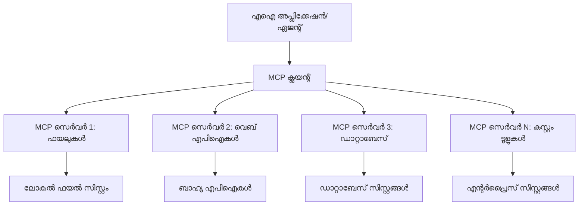
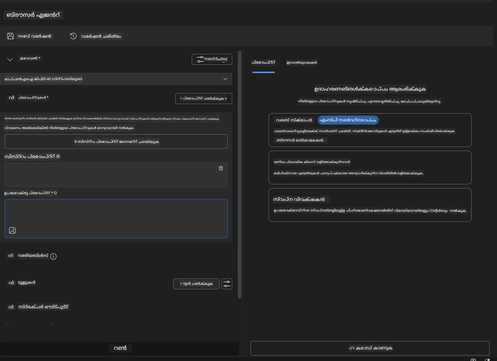
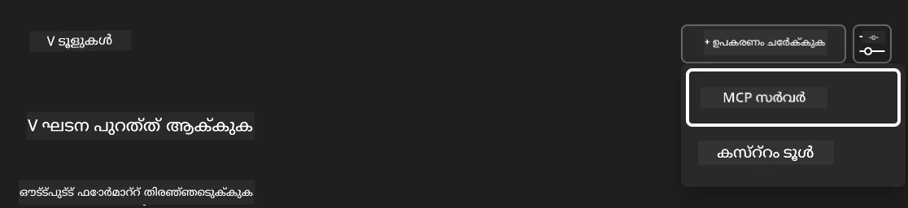
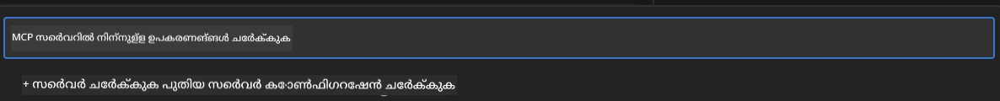
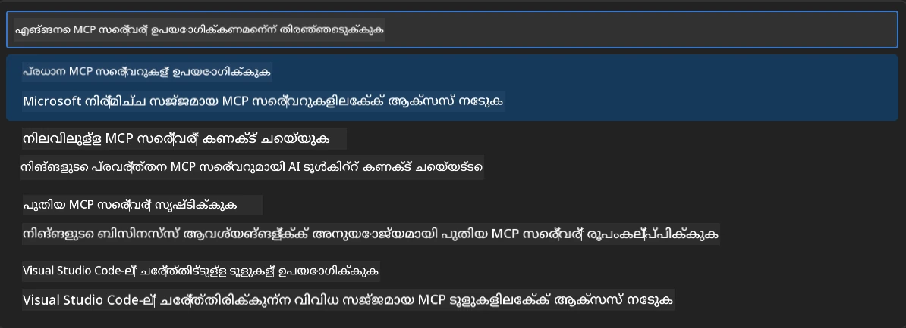
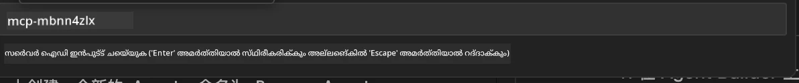
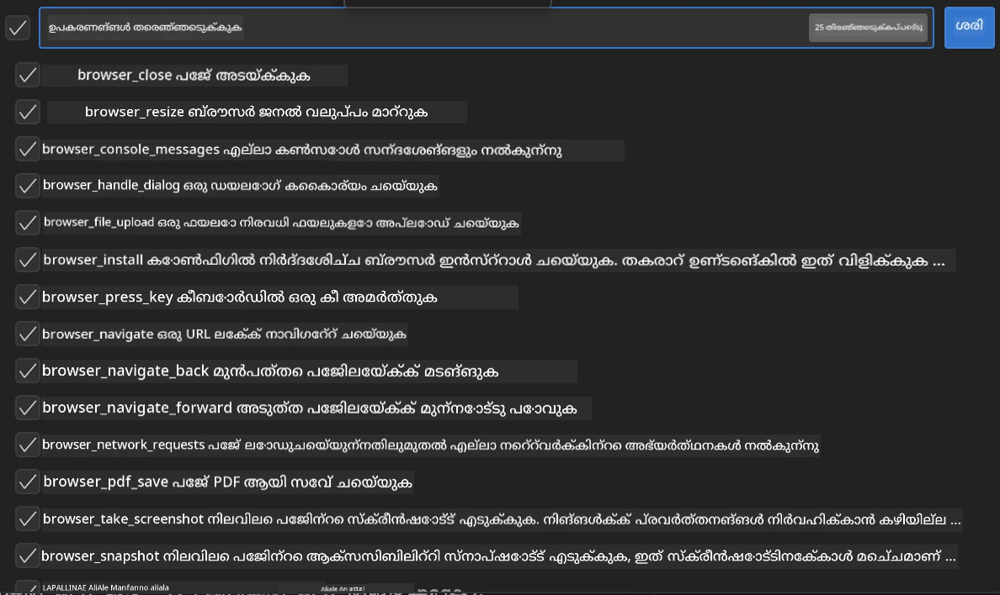
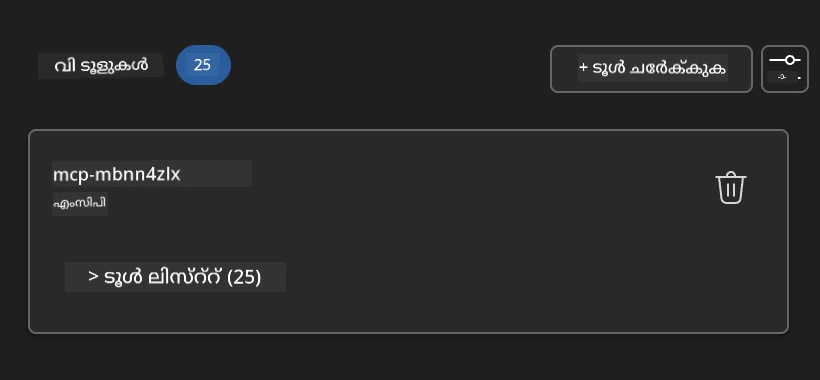
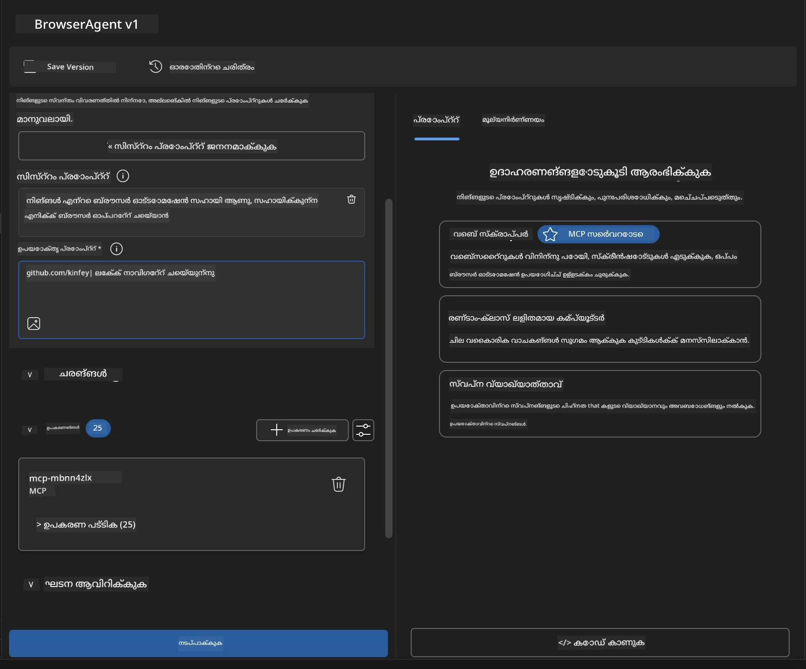

# 🌐 മോഡ്യൂൾ 2: AI ടൂൾകിറ്റ് അടിസ്ഥാനങ്ങളോടുള്ള MCP

[]()
[]()
[]()

## 📋 പഠന ലക്ഷ്യങ്ങൾ

ഈ മോഡ്യൂൾ അവസാനിക്കുമ്പോൾ, നിങ്ങൾക്ക് കഴിയും:
- ✅ മോഡൽ കോൺടെക്സ്റ്റ് പ്രോട്ടോക്കോൾ (MCP) ആർക്കിടെക്ചർയും ഗുണങ്ങളും മനസിലാക്കുക
- ✅ മൈക്രോസോഫ്റ്റിന്റെ MCP സെർവർ ഇക്കോസിസ്റ്റം അന്വേഷിക്കുക
- ✅ MCP സെർവറുകൾ AI ടൂൾകിറ്റ് ഏജന്റ് ബിൽഡറുമായി സംയോജിപ്പിക്കുക
- ✅ Playwright MCP ഉപയോഗിച്ച് പ്രവർത്തനക്ഷമമായ ബ്രൗസർ ഓട്ടോമേഷൻ ഏജന്റ് നിർമ്മിക്കുക
- ✅ നിങ്ങളുടെ ഏജന്റുകളിൽ MCP ടൂളുകൾ കോൺഫിഗർ ചെയ്ത് പരീക്ഷിക്കുക
- ✅ MCP-പവർഡ് ഏജന്റുകൾ എക്സ്പോർട്ട് ചെയ്ത് പ്രൊഡക്ഷനിലേക്ക് വിന്യസിക്കുക

## 🎯 മോഡ്യൂൾ 1-ൽ നിന്നുള്ള മുന്നേറ്റം

മോഡ്യൂൾ 1-ൽ, AI ടൂൾകിറ്റ് അടിസ്ഥാനങ്ങൾ നമുക്ക് കൈവരിച്ചു, ആദ്യ Python ഏജന്റ് സൃഷ്ടിച്ചു. ഇപ്പോൾ, വിപ്ലവകരമായ **Model Context Protocol (MCP)** വഴി നിങ്ങളുടെ ഏജന്റുകൾക്ക് ബാഹ്യ ടൂളുകളും സേവനങ്ങളും ബന്ധിപ്പിച്ച് **സൂപ്പർചാർജ്** ചെയ്യാം.

ഇത് ഒരു അടിസ്ഥാന കാൽക്കുലേറ്ററിൽ നിന്ന് പൂർണ്ണ കമ്പ്യൂട്ടറിലേക്ക് അപ്ഗ്രേഡ് ചെയ്യുന്നതുപോലെ ആണെന്ന് കരുതുക - നിങ്ങളുടെ AI ഏജന്റുകൾക്ക് കഴിയും:
- 🌐 വെബ്സൈറ്റുകൾ ബ്രൗസ് ചെയ്ത് ഇടപഴകുക
- 📁 ഫയലുകൾ ആക്‌സസ് ചെയ്ത് കൈകാര്യം ചെയ്യുക
- 🔧 എന്റർപ്രൈസ് സിസ്റ്റങ്ങളുമായി സംയോജിപ്പിക്കുക
- 📊 API-കളിൽ നിന്നുള്ള റിയൽ-ടൈം ഡാറ്റ പ്രോസസ്സ് ചെയ്യുക

## 🧠 മോഡൽ കോൺടെക്സ്റ്റ് പ്രോട്ടോക്കോൾ (MCP) മനസിലാക്കൽ

### 🔍 MCP എന്താണ്?

Model Context Protocol (MCP) എന്നത് **"AI ആപ്ലിക്കേഷനുകൾക്കുള്ള USB-C"** ആണ് - വലിയ ഭാഷാ മോഡലുകൾ (LLMs) ബാഹ്യ ടൂളുകൾ, ഡാറ്റാ സ്രോതസ്സുകൾ, സേവനങ്ങൾ എന്നിവയുമായി ബന്ധിപ്പിക്കുന്ന വിപ്ലവകരമായ ഒരു തുറന്ന സ്റ്റാൻഡേർഡ്. USB-C ഒരു സർവത്ര ഉപയോഗിക്കാവുന്ന കണക്ടർ നൽകിക്കേബിൾ കുഴപ്പം ഇല്ലാതാക്കിയതുപോലെ, MCP ഒരു ഏകീകൃത പ്രോട്ടോക്കോൾ ഉപയോഗിച്ച് AI സംയോജനം സുലഭമാക്കുന്നു.

### 🎯 MCP പരിഹരിക്കുന്ന പ്രശ്നം

**MCP-മുമ്പ്:**
- 🔧 ഓരോ ടൂളിനും കസ്റ്റം സംയോജനം
- 🔄 പ്രൊപ്രൈറ്ററി സൊല്യൂഷനുകളുമായി വൻഡർ ലോക്ക്-ഇൻ  
- 🔒 അപ്രത്യക്ഷ ബന്ധങ്ങളിൽ നിന്നുള്ള സുരക്ഷാ ദുർബലതകൾ
- ⏱️ അടിസ്ഥാന സംയോജനങ്ങൾക്ക് മാസങ്ങളോളം വികസനം

**MCP-ഉം:**
- ⚡ പ്ലഗ്-അൻഡ്-പ്ലേ ടൂൾ സംയോജനം
- 🔄 വൻഡർ-അഗ്നോസ്റ്റിക് ആർക്കിടെക്ചർ
- 🛡️ ഉൾപ്പെടുത്തിയ സുരക്ഷാ മികച്ച പ്രാക്ടീസുകൾ
- 🚀 പുതിയ കഴിവുകൾ ചേർക്കാൻ മിനിറ്റുകൾ

### 🏗️ MCP ആർക്കിടെക്ചർ വിശദമായി

MCP ഒരു **ക്ലയന്റ്-സെർവർ ആർക്കിടെക്ചർ** പിന്തുടരുന്നു, സുരക്ഷിതവും സ്കേലബിൾവുമായ ഒരു ഇക്കോസിസ്റ്റം സൃഷ്ടിക്കുന്നു:


**🔧 പ്രധാന ഘടകങ്ങൾ:**

| ഘടകം | പങ്ക് | ഉദാഹരണങ്ങൾ |
|-----------|------|----------|
| **MCP ഹോസ്റ്റുകൾ** | MCP സേവനങ്ങൾ ഉപയോഗിക്കുന്ന ആപ്ലിക്കേഷനുകൾ | Claude Desktop, VS Code, AI Toolkit |
| **MCP ക്ലയന്റുകൾ** | പ്രോട്ടോക്കോൾ ഹാൻഡ്ലറുകൾ (സെർവറുകളുമായി 1:1) | ഹോസ്റ്റ് ആപ്ലിക്കേഷനുകളിൽ ഉൾപ്പെടുത്തിയിരിക്കുന്നു |
| **MCP സെർവറുകൾ** | സ്റ്റാൻഡേർഡ് പ്രോട്ടോക്കോൾ വഴി കഴിവുകൾ പ്രദർശിപ്പിക്കുന്നു | Playwright, Files, Azure, GitHub |
| **ട്രാൻസ്പോർട്ട് ലെയർ** | ആശയവിനിമയ മാർഗങ്ങൾ | stdio, HTTP, WebSockets |


## 🏢 മൈക്രോസോഫ്റ്റിന്റെ MCP സെർവർ ഇക്കോസിസ്റ്റം

മൈക്രോസോഫ്റ്റ് MCP ഇക്കോസിസ്റ്റത്തിൽ മുൻനിരയിൽ നിൽക്കുന്നു, യഥാർത്ഥ ബിസിനസ് ആവശ്യങ്ങൾ പരിഹരിക്കുന്ന എന്റർപ്രൈസ്-ഗ്രേഡ് സെർവർസിന്റെ സമ്പൂർണ്ണ സ്യൂട്ട് നൽകുന്നു.

### 🌟 മൈക്രോസോഫ്റ്റ് MCP സെർവർസിന്റെ പ്രധാനപ്പെട്ടവ

#### 1. ☁️ Azure MCP സെർവർ
**🔗 റിപോസിറ്ററി**: [azure/azure-mcp](https://github.com/azure/azure-mcp)
**🎯 ഉദ്ദേശ്യം**: AI സംയോജനം ഉൾപ്പെടെയുള്ള സമഗ്ര Azure റിസോഴ്‌സ് മാനേജ്മെന്റ്

**✨ പ്രധാന സവിശേഷതകൾ:**
- പ്രഖ്യാപനാത്മക ഇൻഫ്രാസ്ട്രക്ചർ പ്രൊവിഷനിംഗ്
- റിയൽ-ടൈം റിസോഴ്‌സ് നിരീക്ഷണം
- ചെലവ് മെച്ചപ്പെടുത്തൽ ശുപാർശകൾ
- സുരക്ഷാ അനുസരണ പരിശോധന

**🚀 ഉപയോഗ കേസുകൾ:**
- AI സഹായത്തോടെ ഇൻഫ്രാസ്ട്രക്ചർ-ആസ്-കോഡ്
- ഓട്ടോമേറ്റഡ് റിസോഴ്‌സ് സ്കെയിലിംഗ്
- ക്ലൗഡ് ചെലവ് മെച്ചപ്പെടുത്തൽ
- ഡെവ്‌ഓപ്സ് വർക്ക്‌ഫ്ലോ ഓട്ടോമേഷൻ

#### 2. 📊 Microsoft Dataverse MCP
**📚 ഡോക്യുമെന്റേഷൻ**: [Microsoft Dataverse Integration](https://go.microsoft.com/fwlink/?linkid=2320176)
**🎯 ഉദ്ദേശ്യം**: ബിസിനസ് ഡാറ്റയ്ക്ക് സ്വാഭാവിക ഭാഷാ ഇന്റർഫേസ്

**✨ പ്രധാന സവിശേഷതകൾ:**
- സ്വാഭാവിക ഭാഷ ഡാറ്റാബേസ് ക്വറികൾ
- ബിസിനസ് കോൺടെക്സ്റ്റ് മനസിലാക്കൽ
- കസ്റ്റം പ്രോംപ്റ്റ് ടെംപ്ലേറ്റുകൾ
- എന്റർപ്രൈസ് ഡാറ്റ ഗവർണൻസ്

**🚀 ഉപയോഗ കേസുകൾ:**
- ബിസിനസ് ഇന്റലിജൻസ് റിപ്പോർട്ടിംഗ്
- കസ്റ്റമർ ഡാറ്റ വിശകലനം
- സെയിൽസ് പൈപ്പ്‌ലൈൻ洞察ങ്ങൾ
- അനുസരണ ഡാറ്റ ക്വറികൾ

#### 3. 🌐 Playwright MCP സെർവർ
**🔗 റിപോസിറ്ററി**: [microsoft/playwright-mcp](https://github.com/microsoft/playwright-mcp)
**🎯 ഉദ്ദേശ്യം**: ബ്രൗസർ ഓട്ടോമേഷൻ, വെബ് ഇടപെടൽ കഴിവുകൾ

**✨ പ്രധാന സവിശേഷതകൾ:**
- ക്രോസ്-ബ്രൗസർ ഓട്ടോമേഷൻ (ക്രോം, ഫയർഫോക്സ്, സഫാരി)
- ബുദ്ധിമുട്ടുള്ള എലമെന്റ് കണ്ടെത്തൽ
- സ്ക്രീൻഷോട്ട്, PDF ജനറേഷൻ
- നെറ്റ്‌വർക്ക് ട്രാഫിക് നിരീക്ഷണം

**🚀 ഉപയോഗ കേസുകൾ:**
- ഓട്ടോമേറ്റഡ് ടെസ്റ്റിംഗ് വർക്ക്‌ഫ്ലോകുകൾ
- വെബ് സ്ക്രാപ്പിംഗ്, ഡാറ്റ എക്സ്ട്രാക്ഷൻ
- UI/UX നിരീക്ഷണം
- മത്സരം വിശകലന ഓട്ടോമേഷൻ

#### 4. 📁 Files MCP സെർവർ
**🔗 റിപോസിറ്ററി**: [microsoft/files-mcp-server](https://github.com/microsoft/files-mcp-server)
**🎯 ഉദ്ദേശ്യം**: ബുദ്ധിമുട്ടുള്ള ഫയൽ സിസ്റ്റം ഓപ്പറേഷനുകൾ

**✨ പ്രധാന സവിശേഷതകൾ:**
- പ്രഖ്യാപനാത്മക ഫയൽ മാനേജ്മെന്റ്
- ഉള്ളടക്ക സമന്വയം
- വേർഷൻ കൺട്രോൾ സംയോജനം
- മെറ്റാഡേറ്റാ എക്സ്ട്രാക്ഷൻ

**🚀 ഉപയോഗ കേസുകൾ:**
- ഡോക്യുമെന്റേഷൻ മാനേജ്മെന്റ്
- കോഡ് റിപോസിറ്ററി ഓർഗനൈസേഷൻ
- ഉള്ളടക്ക പ്രസിദ്ധീകരണ വർക്ക്‌ഫ്ലോകുകൾ
- ഡാറ്റ പൈപ്പ്‌ലൈൻ ഫയൽ കൈകാര്യം

#### 5. 📝 MarkItDown MCP സെർവർ
**🔗 റിപോസിറ്ററി**: [microsoft/markitdown](https://github.com/microsoft/markitdown)
**🎯 ഉദ്ദേശ്യം**: ആധുനിക മാർക്ക്ഡൗൺ പ്രോസസ്സിംഗ്, മാനിപ്പുലേഷൻ

**✨ പ്രധാന സവിശേഷതകൾ:**
- സമൃദ്ധമായ മാർക്ക്ഡൗൺ പാഴ്സിംഗ്
- ഫോർമാറ്റ് പരിവർത്തനം (MD ↔ HTML ↔ PDF)
- ഉള്ളടക്ക ഘടന വിശകലനം
- ടെംപ്ലേറ്റ് പ്രോസസ്സിംഗ്

**🚀 ഉപയോഗ കേസുകൾ:**
- സാങ്കേതിക ഡോക്യുമെന്റേഷൻ വർക്ക്‌ഫ്ലോകുകൾ
- ഉള്ളടക്ക മാനേജ്മെന്റ് സിസ്റ്റങ്ങൾ
- റിപ്പോർട്ട് ജനറേഷൻ
- നോളജ് ബേസ് ഓട്ടോമേഷൻ

#### 6. 📈 Clarity MCP സെർവർ
**📦 പാക്കേജ്**: [@microsoft/clarity-mcp-server](https://www.npmjs.com/package/@microsoft/clarity-mcp-server)
**🎯 ഉദ്ദേശ്യം**: വെബ് അനലിറ്റിക്സ്, ഉപയോക്തൃ പെരുമാറ്റ洞察ങ്ങൾ

**✨ പ്രധാന സവിശേഷതകൾ:**
- ഹീറ്റ്മാപ്പ് ഡാറ്റ വിശകലനം
- ഉപയോക്തൃ സെഷൻ റെക്കോർഡിംഗുകൾ
- പ്രകടന മെട്രിക്‌സ്
- കൺവർഷൻ ഫണൽ വിശകലനം

**🚀 ഉപയോഗ കേസുകൾ:**
- വെബ്സൈറ്റ് മെച്ചപ്പെടുത്തൽ
- ഉപയോക്തൃ അനുഭവ ഗവേഷണം
- A/B ടെസ്റ്റിംഗ് വിശകലനം
- ബിസിനസ് ഇന്റലിജൻസ് ഡാഷ്ബോർഡുകൾ

### 🌍 കമ്മ്യൂണിറ്റി ഇക്കോസിസ്റ്റം

മൈക്രോസോഫ്റ്റിന്റെ സെർവറുകൾക്ക് പുറമേ, MCP ഇക്കോസിസ്റ്റത്തിൽ ഉൾപ്പെടുന്നു:
- **🐙 GitHub MCP**: റിപോസിറ്ററി മാനേജ്മെന്റ്, കോഡ് വിശകലനം
- **🗄️ ഡാറ്റാബേസ് MCPകൾ**: PostgreSQL, MySQL, MongoDB സംയോജനം
- **☁️ ക്ലൗഡ് പ്രൊവൈഡർ MCPകൾ**: AWS, GCP, Digital Ocean ടൂളുകൾ
- **📧 കമ്മ്യൂണിക്കേഷൻ MCPകൾ**: Slack, Teams, Email സംയോജനം

## 🛠️ ഹാൻഡ്‌സ്-ഓൺ ലാബ്: ബ്രൗസർ ഓട്ടോമേഷൻ ഏജന്റ് നിർമ്മാണം

**🎯 പ്രോജക്ട് ലക്ഷ്യം**: Playwright MCP സെർവർ ഉപയോഗിച്ച് വെബ്സൈറ്റുകൾ നാവിഗേറ്റ് ചെയ്ത് വിവരങ്ങൾ എടുക്കുകയും സങ്കീർണ്ണ വെബ് ഇടപെടലുകൾ നടത്തുകയും ചെയ്യുന്ന ബുദ്ധിമുട്ടുള്ള ബ്രൗസർ ഓട്ടോമേഷൻ ഏജന്റ് സൃഷ്ടിക്കുക.

### 🚀 ഘട്ടം 1: ഏജന്റ് അടിസ്ഥാന സജ്ജീകരണം

#### ഘട്ടം 1: നിങ്ങളുടെ ഏജന്റ് ആരംഭിക്കുക
1. **AI ടൂൾകിറ്റ് ഏജന്റ് ബിൽഡർ തുറക്കുക**
2. **പുതിയ ഏജന്റ് സൃഷ്ടിക്കുക** താഴെ പറയുന്ന കോൺഫിഗറേഷൻ ഉപയോഗിച്ച്:
   - **പേര്**: `BrowserAgent`
   - **മോഡൽ**: GPT-4o തിരഞ്ഞെടുക്കുക




### 🔧 ഘട്ടം 2: MCP സംയോജനം വർക്ക്‌ഫ്ലോ

#### ഘട്ടം 3: MCP സെർവർ സംയോജനം ചേർക്കുക
1. **ഏജന്റ് ബിൽഡറിലെ ടൂൾസ് സെക്ഷനിലേക്ക് പോകുക**
2. **"Add Tool" ക്ലിക്ക് ചെയ്ത് സംയോജനം മെനു തുറക്കുക**
3. **ലഭ്യമായ ഓപ്ഷനുകളിൽ നിന്ന് "MCP Server" തിരഞ്ഞെടുക്കുക**



**🔍 ടൂൾ തരം മനസിലാക്കൽ:**
- **ഇൻബിൽറ്റ് ടൂളുകൾ**: മുൻകൂട്ടി കോൺഫിഗർ ചെയ്ത AI ടൂൾകിറ്റ് ഫംഗ്ഷനുകൾ
- **MCP സെർവറുകൾ**: ബാഹ്യ സേവന സംയോജനങ്ങൾ
- **കസ്റ്റം APIകൾ**: നിങ്ങളുടെ സ്വന്തം സേവന എൻഡ്‌പോയിന്റുകൾ
- **ഫംഗ്ഷൻ കോളിംഗ്**: നേരിട്ട് മോഡൽ ഫംഗ്ഷൻ ആക്‌സസ്

#### ഘട്ടം 4: MCP സെർവർ തിരഞ്ഞെടുക്കൽ
1. **"MCP Server" ഓപ്ഷൻ തിരഞ്ഞെടുക്കുക**


2. **ലഭ്യമായ സംയോജനങ്ങൾ പരിശോധിക്കാൻ MCP കാറ്റലോഗ് ബ്രൗസ് ചെയ്യുക**



### 🎮 ഘട്ടം 3: Playwright MCP കോൺഫിഗറേഷൻ

#### ഘട്ടം 5: Playwright തിരഞ്ഞെടുക്കുകയും കോൺഫിഗർ ചെയ്യുകയും ചെയ്യുക
1. **മൈക്രോസോഫ്റ്റിന്റെ സ്ഥിരീകരിച്ച MCP സെർവറുകൾ കാണാൻ "Use Featured MCP Servers" ക്ലിക്ക് ചെയ്യുക**
2. **ഫീച്ചർ ചെയ്ത ലിസ്റ്റിൽ നിന്ന് "Playwright" തിരഞ്ഞെടുക്കുക**
3. **ഡിഫോൾട്ട് MCP ID അംഗീകരിക്കുക അല്ലെങ്കിൽ നിങ്ങളുടെ പരിസ്ഥിതിക്ക് അനുയോജ്യമായി ഇഷ്ടാനുസൃതമാക്കുക**



#### ഘട്ടം 6: Playwright കഴിവുകൾ സജീവമാക്കുക
**🔑 നിർണായക ഘട്ടം**: പരമാവധി പ്രവർത്തനക്ഷമതയ്ക്കായി ലഭ്യമായ എല്ലാ Playwright മെത്തഡുകളും തിരഞ്ഞെടുക്കുക



**🛠️ അനിവാര്യ Playwright ടൂളുകൾ:**
- **നാവിഗേഷൻ**: `goto`, `goBack`, `goForward`, `reload`
- **ഇടപെടൽ**: `click`, `fill`, `press`, `hover`, `drag`
- **എക്സ്ട്രാക്ഷൻ**: `textContent`, `innerHTML`, `getAttribute`
- **വാലിഡേഷൻ**: `isVisible`, `isEnabled`, `waitForSelector`
- **ക്യാപ്ചർ**: `screenshot`, `pdf`, `video`
- **നെറ്റ്‌വർക്ക്**: `setExtraHTTPHeaders`, `route`, `waitForResponse`

#### ഘട്ടം 7: സംയോജനം വിജയകരമാണെന്ന് സ്ഥിരീകരിക്കുക
**✅ വിജയ സൂചകങ്ങൾ:**
- ഏജന്റ് ബിൽഡർ ഇന്റർഫേസിൽ എല്ലാ ടൂളുകളും കാണപ്പെടുന്നു
- സംയോജനം പാനലിൽ പിശക് സന്ദേശങ്ങൾ ഇല്ല
- Playwright സെർവർ നില "Connected" ആയി കാണിക്കുന്നു



**🔧 സാധാരണ പ്രശ്നങ്ങൾ പരിഹരിക്കൽ:**
- **കണക്ഷൻ പരാജയം**: ഇന്റർനെറ്റ് കണക്ഷനും ഫയർവാൾ ക്രമീകരണങ്ങളും പരിശോധിക്കുക
- **ടൂളുകൾ കാണാനില്ല**: സജ്ജീകരണ സമയത്ത് എല്ലാ കഴിവുകളും തിരഞ്ഞെടുക്കപ്പെട്ടിട്ടുണ്ടെന്ന് ഉറപ്പാക്കുക
- **അനുമതി പിശകുകൾ**: VS Code-ന് ആവശ്യമായ സിസ്റ്റം അനുമതികൾ ലഭ്യമാണെന്ന് പരിശോധിക്കുക

### 🎯 ഘട്ടം 4: ആധുനിക പ്രോംപ്റ്റ് എഞ്ചിനീയറിംഗ്

#### ഘട്ടം 8: ബുദ്ധിമുട്ടുള്ള സിസ്റ്റം പ്രോംപ്റ്റുകൾ രൂപകൽപ്പന ചെയ്യുക
Playwright-ന്റെ മുഴുവൻ കഴിവുകളും പ്രയോജനപ്പെടുത്തുന്ന സങ്കീർണ്ണ പ്രോംപ്റ്റുകൾ സൃഷ്ടിക്കുക:

```markdown
# Web Automation Expert System Prompt

## Core Identity
You are an advanced web automation specialist with deep expertise in browser automation, web scraping, and user experience analysis. You have access to Playwright tools for comprehensive browser control.

## Capabilities & Approach
### Navigation Strategy
- Always start with screenshots to understand page layout
- Use semantic selectors (text content, labels) when possible
- Implement wait strategies for dynamic content
- Handle single-page applications (SPAs) effectively

### Error Handling
- Retry failed operations with exponential backoff
- Provide clear error descriptions and solutions
- Suggest alternative approaches when primary methods fail
- Always capture diagnostic screenshots on errors

### Data Extraction
- Extract structured data in JSON format when possible
- Provide confidence scores for extracted information
- Validate data completeness and accuracy
- Handle pagination and infinite scroll scenarios

### Reporting
- Include step-by-step execution logs
- Provide before/after screenshots for verification
- Suggest optimizations and alternative approaches
- Document any limitations or edge cases encountered

## Ethical Guidelines
- Respect robots.txt and rate limiting
- Avoid overloading target servers
- Only extract publicly available information
- Follow website terms of service
```

#### ഘട്ടം 9: ഡൈനാമിക് യൂസർ പ്രോംപ്റ്റുകൾ സൃഷ്ടിക്കുക
വിവിധ കഴിവുകൾ പ്രദർശിപ്പിക്കുന്ന പ്രോംപ്റ്റുകൾ രൂപകൽപ്പന ചെയ്യുക:

**🌐 വെബ് വിശകലന ഉദാഹരണം:**
```markdown
Navigate to github.com/kinfey and provide a comprehensive analysis including:
1. Repository structure and organization
2. Recent activity and contribution patterns  
3. Documentation quality assessment
4. Technology stack identification
5. Community engagement metrics
6. Notable projects and their purposes

Include screenshots at key steps and provide actionable insights.
```



### 🚀 ഘട്ടം 5: പ്രവർത്തനം നടത്തൽ, പരിശോധന

#### ഘട്ടം 10: നിങ്ങളുടെ ആദ്യ ഓട്ടോമേഷൻ പ്രവർത്തിപ്പിക്കുക
1. **ഓട്ടോമേഷൻ സീക്വൻസ് ആരംഭിക്കാൻ "Run" ക്ലിക്ക് ചെയ്യുക**
2. **റിയൽ-ടൈം പ്രവർത്തനം നിരീക്ഷിക്കുക**:
   - ക്രോം ബ്രൗസർ സ്വയം തുറ
- ഒരു കാലാവസ്ഥ MCP സെർവർ പൂജ്യം മുതൽ നിർമ്മിക്കുക

---

<!-- CO-OP TRANSLATOR DISCLAIMER START -->
**അസൂയാ**:  
ഈ രേഖ AI വിവർത്തന സേവനം [Co-op Translator](https://github.com/Azure/co-op-translator) ഉപയോഗിച്ച് വിവർത്തനം ചെയ്തതാണ്. നാം കൃത്യതയ്ക്ക് ശ്രമിച്ചിട്ടുണ്ടെങ്കിലും, സ്വയം പ്രവർത്തിക്കുന്ന വിവർത്തനങ്ങളിൽ പിശകുകൾ അല്ലെങ്കിൽ തെറ്റുകൾ ഉണ്ടാകാമെന്ന് ദയവായി ശ്രദ്ധിക്കുക. അതിന്റെ മാതൃഭാഷയിലുള്ള യഥാർത്ഥ രേഖ പ്രാമാണികമായ ഉറവിടമായി കണക്കാക്കണം. നിർണായകമായ വിവരങ്ങൾക്ക്, പ്രൊഫഷണൽ മനുഷ്യ വിവർത്തനം ശുപാർശ ചെയ്യപ്പെടുന്നു. ഈ വിവർത്തനം ഉപയോഗിക്കുന്നതിൽ നിന്നുണ്ടാകുന്ന ഏതെങ്കിലും തെറ്റിദ്ധാരണകൾക്കോ തെറ്റായ വ്യാഖ്യാനങ്ങൾക്കോ ഞങ്ങൾ ഉത്തരവാദികളല്ല.
<!-- CO-OP TRANSLATOR DISCLAIMER END -->