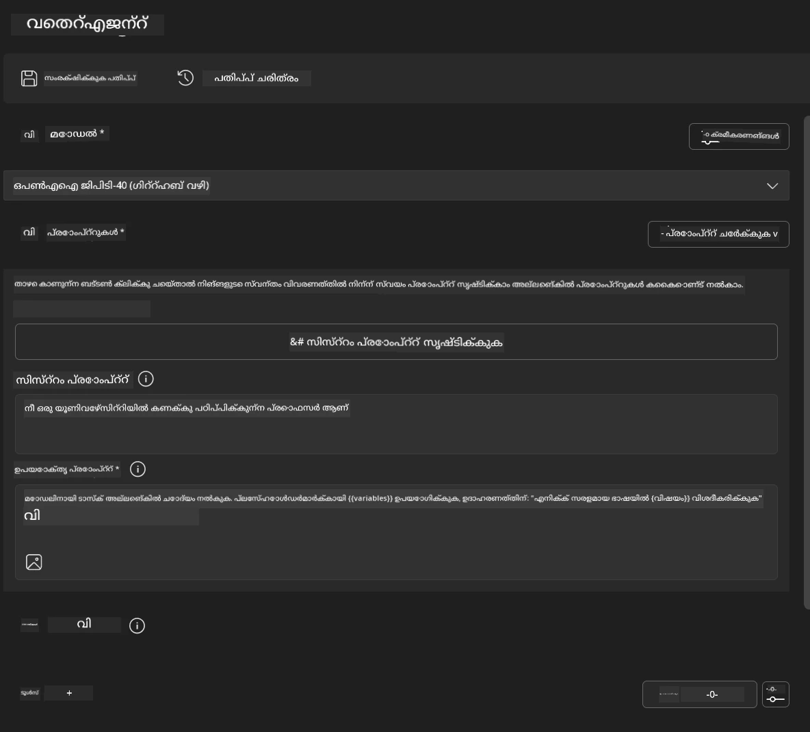
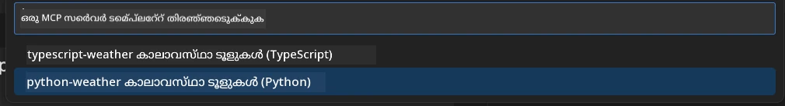
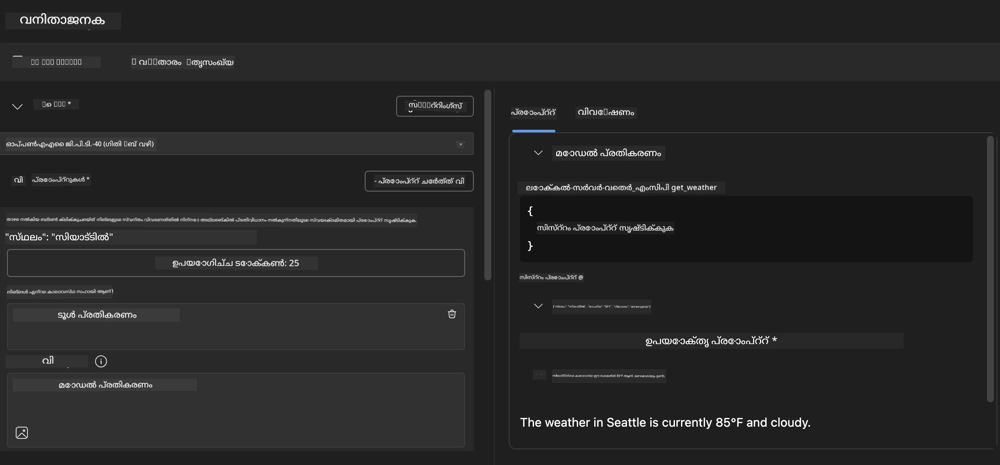
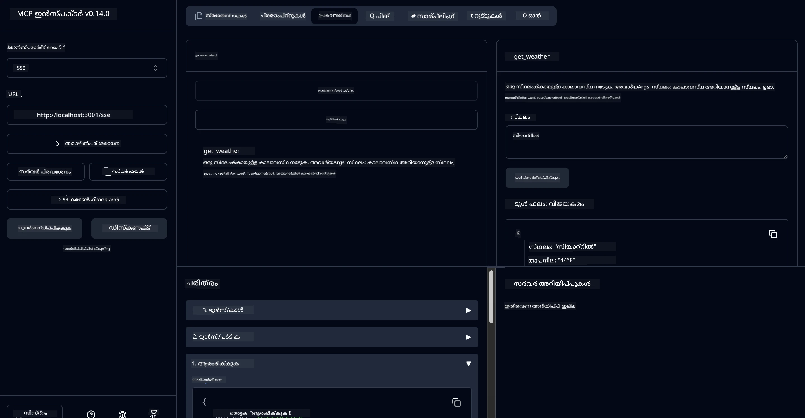

# 🔧 മോഡ്യൂൾ 3: AI ടൂൾകിറ്റ് ഉപയോഗിച്ച് ആഡ്വാൻസ്ഡ് MCP ഡെവലപ്പ്മെന്റ്


## 🎯 പഠന ലക്ഷ്യങ്ങൾ

ഈ ലാബിന്റെ അവസാനം, നിങ്ങൾക്ക് കഴിയും:

- ✅ AI ടൂൾകിറ്റ് ഉപയോഗിച്ച് കസ്റ്റം MCP സർവറുകൾ സൃഷ്ടിക്കുക
- ✅ ഏറ്റവും പുതിയ MCP Python SDK (v1.9.3) കോൺഫിഗർ ചെയ്ത് ഉപയോഗിക്കുക
- ✅ ഡീബഗിംഗിനായി MCP ഇൻസ്പെക്ടർ സജ്ജമാക്കുകയും ഉപയോഗിക്കുകയും ചെയ്യുക
- ✅ ഏജന്റ് ബിൽഡറും ഇൻസ്പെക്ടർ പരിസ്ഥിതികളിലും MCP സർവറുകൾ ഡീബഗ് ചെയ്യുക
- ✅ ആഡ്വാൻസ്ഡ് MCP സർവർ ഡെവലപ്പ്മെന്റ് വർക്ക്‌ഫ്ലോകൾ മനസിലാക്കുക

## 📋 മുൻ‌അവശ്യങ്ങൾ

- ലാബ് 2 (MCP അടിസ്ഥാനങ്ങൾ) പൂർത്തിയാക്കിയിരിക്കണം
- AI ടൂൾകിറ്റ് എക്സ്റ്റൻഷൻ ഇൻസ്റ്റാൾ ചെയ്ത VS കോഡ്
- Python 3.10+ പരിസ്ഥിതി
- ഇൻസ്പെക്ടർ സജ്ജീകരണത്തിന് Node.js, npm

## 🏗️ നിങ്ങൾ നിർമ്മിക്കുന്നതു്

ഈ ലാബിൽ, നിങ്ങൾ ഒരു **വേദർ MCP സർവർ** സൃഷ്ടിക്കും, ഇത് കാണിക്കുന്നു:
- കസ്റ്റം MCP സർവർ നടപ്പാക്കൽ
- AI ടൂൾകിറ്റ് ഏജന്റ് ബിൽഡറുമായി ഇന്റഗ്രേഷൻ
- പ്രൊഫഷണൽ ഡീബഗിംഗ് വർക്ക്‌ഫ്ലോകൾ
- ആധുനിക MCP SDK ഉപയോഗ മാതൃകകൾ

---

## 🔧 കോർ ഘടകങ്ങളുടെ അവലോകനം

### 🐍 MCP Python SDK
Model Context Protocol Python SDK കസ്റ്റം MCP സർവറുകൾ നിർമ്മിക്കാൻ അടിസ്ഥാനമാകുന്നു. നിങ്ങൾ 1.9.3 പതിപ്പ് ഉപയോഗിക്കും, മെച്ചപ്പെട്ട ഡീബഗിംഗ് കഴിവുകളോടെ.

### 🔍 MCP ഇൻസ്പെക്ടർ
ശക്തമായ ഡീബഗിംഗ് ഉപകരണം, ഇത് നൽകുന്നു:
- റിയൽ-ടൈം സർവർ നിരീക്ഷണം
- ടൂൾ എക്സിക്യൂഷൻ ദൃശ്യീകരണം
- നെറ്റ്‌വർക്ക് അഭ്യർത്ഥന/പ്രതികരണം പരിശോധന
- ഇന്ററാക്ടീവ് ടെസ്റ്റിംഗ് പരിസ്ഥിതി

---

## 📖 ഘട്ടം ഘട്ടമായി നടപ്പാക്കൽ

### ഘട്ടം 1: ഏജന്റ് ബിൽഡറിൽ WeatherAgent സൃഷ്ടിക്കുക

1. **VS കോഡിൽ AI ടൂൾകിറ്റ് എക്സ്റ്റൻഷൻ വഴി ഏജന്റ് ബിൽഡർ ആരംഭിക്കുക**
2. **പുതിയ ഏജന്റ് സൃഷ്ടിക്കുക** താഴെപ്പറയുന്ന കോൺഫിഗറേഷൻ ഉപയോഗിച്ച്:
   - ഏജന്റ് നാമം: `WeatherAgent`



### ഘട്ടം 2: MCP സർവർ പ്രോജക്ട് ആരംഭിക്കുക

1. **ഏജന്റ് ബിൽഡറിൽ Tools → Add Tool** എന്നിടത്ത് പോകുക
2. **"MCP Server" തിരഞ്ഞെടുക്കുക**
3. **"Create A new MCP Server" തിരഞ്ഞെടുക്കുക**
4. **`python-weather` ടെംപ്ലേറ്റ് തിരഞ്ഞെടുക്കുക**
5. **സർവർ നാമം നൽകുക:** `weather_mcp`



### ഘട്ടം 3: പ്രോജക്ട് തുറന്ന് പരിശോധിക്കുക

1. **സൃഷ്ടിച്ച പ്രോജക്ട് VS കോഡിൽ തുറക്കുക**
2. **പ്രോജക്ട് ഘടന പരിശോധിക്കുക:**
   ```
   weather_mcp/
   ├── src/
   │   ├── __init__.py
   │   └── server.py
   ├── inspector/
   │   ├── package.json
   │   └── package-lock.json
   ├── .vscode/
   │   ├── launch.json
   │   └── tasks.json
   ├── pyproject.toml
   └── README.md
   ```

### ഘട്ടം 4: ഏറ്റവും പുതിയ MCP SDK-യിലേക്ക് അപ്ഗ്രേഡ് ചെയ്യുക

> **🔍 എന്തുകൊണ്ട് അപ്ഗ്രേഡ് ചെയ്യണം?** മെച്ചപ്പെട്ട ഫീച്ചറുകളും മികച്ച ഡീബഗിംഗ് കഴിവുകളും ലഭിക്കാൻ ഏറ്റവും പുതിയ MCP SDK (v1.9.3)യും ഇൻസ്പെക്ടർ സർവീസും (0.14.0) ഉപയോഗിക്കണം.

#### 4a. Python ഡിപ്പൻഡൻസികൾ അപ്ഡേറ്റ് ചെയ്യുക

**`pyproject.toml` എഡിറ്റ് ചെയ്യുക:** [./code/weather_mcp/pyproject.toml](../../../../10-StreamliningAIWorkflowsBuildingAnMCPServerWithAIToolkit/lab3/code/weather_mcp/pyproject.toml) അപ്ഡേറ്റ് ചെയ്യുക


#### 4b. ഇൻസ്പെക്ടർ കോൺഫിഗറേഷൻ അപ്ഡേറ്റ് ചെയ്യുക

**`inspector/package.json` എഡിറ്റ് ചെയ്യുക:** [./code/weather_mcp/inspector/package.json](../../../../10-StreamliningAIWorkflowsBuildingAnMCPServerWithAIToolkit/lab3/code/weather_mcp/inspector/package.json) അപ്ഡേറ്റ് ചെയ്യുക

#### 4c. ഇൻസ്പെക്ടർ ഡിപ്പൻഡൻസികൾ അപ്ഡേറ്റ് ചെയ്യുക

**`inspector/package-lock.json` എഡിറ്റ് ചെയ്യുക:** [./code/weather_mcp/inspector/package-lock.json](../../../../10-StreamliningAIWorkflowsBuildingAnMCPServerWithAIToolkit/lab3/code/weather_mcp/inspector/package-lock.json) അപ്ഡേറ്റ് ചെയ്യുക

> **📝 കുറിപ്പ്:** ഈ ഫയൽ വ്യാപകമായ ഡിപ്പൻഡൻസി നിർവചനങ്ങൾ ഉൾക്കൊള്ളുന്നു. താഴെ പ്രധാന ഘടന കാണിക്കുന്നു - പൂർണ്ണ ഉള്ളടക്കം ശരിയായ ഡിപ്പൻഡൻസി പരിഹാരത്തിന് ആവശ്യമാണ്.


> **⚡ പൂർണ്ണ പാക്കേജ് ലോക്ക്:** പൂർണ്ണ package-lock.json ~3000 വരികളുള്ള ഡിപ്പൻഡൻസി നിർവചനങ്ങൾ ഉൾക്കൊള്ളുന്നു. മുകളിൽ പ്രധാന ഘടന കാണിക്കുന്നു - പൂർണ്ണ പരിഹാരത്തിന് നൽകിയ ഫയൽ ഉപയോഗിക്കുക.

### ഘട്ടം 5: VS കോഡ് ഡീബഗിംഗ് കോൺഫിഗർ ചെയ്യുക

*കുറിപ്പ്: നിർദ്ദിഷ്ട പാതയിലെ ഫയൽ കോപ്പി ചെയ്ത് പ്രാദേശിക ഫയൽ മാറ്റി വയ്ക്കുക*

#### 5a. ലോഞ്ച് കോൺഫിഗറേഷൻ അപ്ഡേറ്റ് ചെയ്യുക

**`.vscode/launch.json` എഡിറ്റ് ചെയ്യുക:**

```json
{
  "version": "0.2.0",
  "configurations": [
    {
      "name": "Attach to Local MCP",
      "type": "debugpy",
      "request": "attach",
      "connect": {
        "host": "localhost",
        "port": 5678
      },
      "presentation": {
        "hidden": true
      },
      "internalConsoleOptions": "neverOpen",
      "postDebugTask": "Terminate All Tasks"
    },
    {
      "name": "Launch Inspector (Edge)",
      "type": "msedge",
      "request": "launch",
      "url": "http://localhost:6274?timeout=60000&serverUrl=http://localhost:3001/sse#tools",
      "cascadeTerminateToConfigurations": [
        "Attach to Local MCP"
      ],
      "presentation": {
        "hidden": true
      },
      "internalConsoleOptions": "neverOpen"
    },
    {
      "name": "Launch Inspector (Chrome)",
      "type": "chrome",
      "request": "launch",
      "url": "http://localhost:6274?timeout=60000&serverUrl=http://localhost:3001/sse#tools",
      "cascadeTerminateToConfigurations": [
        "Attach to Local MCP"
      ],
      "presentation": {
        "hidden": true
      },
      "internalConsoleOptions": "neverOpen"
    }
  ],
  "compounds": [
    {
      "name": "Debug in Agent Builder",
      "configurations": [
        "Attach to Local MCP"
      ],
      "preLaunchTask": "Open Agent Builder",
    },
    {
      "name": "Debug in Inspector (Edge)",
      "configurations": [
        "Launch Inspector (Edge)",
        "Attach to Local MCP"
      ],
      "preLaunchTask": "Start MCP Inspector",
      "stopAll": true
    },
    {
      "name": "Debug in Inspector (Chrome)",
      "configurations": [
        "Launch Inspector (Chrome)",
        "Attach to Local MCP"
      ],
      "preLaunchTask": "Start MCP Inspector",
      "stopAll": true
    }
  ]
}
```

**`.vscode/tasks.json` എഡിറ്റ് ചെയ്യുക:**

```
{
  "version": "2.0.0",
  "tasks": [
    {
      "label": "Start MCP Server",
      "type": "shell",
      "command": "python -m debugpy --listen 127.0.0.1:5678 src/__init__.py sse",
      "isBackground": true,
      "options": {
        "cwd": "${workspaceFolder}",
        "env": {
          "PORT": "3001"
        }
      },
      "problemMatcher": {
        "pattern": [
          {
            "regexp": "^.*$",
            "file": 0,
            "location": 1,
            "message": 2
          }
        ],
        "background": {
          "activeOnStart": true,
          "beginsPattern": ".*",
          "endsPattern": "Application startup complete|running"
        }
      }
    },
    {
      "label": "Start MCP Inspector",
      "type": "shell",
      "command": "npm run dev:inspector",
      "isBackground": true,
      "options": {
        "cwd": "${workspaceFolder}/inspector",
        "env": {
          "CLIENT_PORT": "6274",
          "SERVER_PORT": "6277",
        }
      },
      "problemMatcher": {
        "pattern": [
          {
            "regexp": "^.*$",
            "file": 0,
            "location": 1,
            "message": 2
          }
        ],
        "background": {
          "activeOnStart": true,
          "beginsPattern": "Starting MCP inspector",
          "endsPattern": "Proxy server listening on port"
        }
      },
      "dependsOn": [
        "Start MCP Server"
      ]
    },
    {
      "label": "Open Agent Builder",
      "type": "shell",
      "command": "echo ${input:openAgentBuilder}",
      "presentation": {
        "reveal": "never"
      },
      "dependsOn": [
        "Start MCP Server"
      ],
    },
    {
      "label": "Terminate All Tasks",
      "command": "echo ${input:terminate}",
      "type": "shell",
      "problemMatcher": []
    }
  ],
  "inputs": [
    {
      "id": "openAgentBuilder",
      "type": "command",
      "command": "ai-mlstudio.agentBuilder",
      "args": {
        "initialMCPs": [ "local-server-weather_mcp" ],
        "triggeredFrom": "vsc-tasks"
      }
    },
    {
      "id": "terminate",
      "type": "command",
      "command": "workbench.action.tasks.terminate",
      "args": "terminateAll"
    }
  ]
}
```


---

## 🚀 MCP സർവർ റൺ ചെയ്ത് ടെസ്റ്റ് ചെയ്യുക

### ഘട്ടം 6: ഡിപ്പൻഡൻസികൾ ഇൻസ്റ്റാൾ ചെയ്യുക

കോൺഫിഗറേഷൻ മാറ്റങ്ങൾ ചെയ്ത ശേഷം താഴെ കമാൻഡുകൾ റൺ ചെയ്യുക:

**Python ഡിപ്പൻഡൻസികൾ ഇൻസ്റ്റാൾ ചെയ്യുക:**
```bash
uv sync
```

**ഇൻസ്പെക്ടർ ഡിപ്പൻഡൻസികൾ ഇൻസ്റ്റാൾ ചെയ്യുക:**
```bash
cd inspector
npm install
```

### ഘട്ടം 7: ഏജന്റ് ബിൽഡറിൽ ഡീബഗ് ചെയ്യുക

1. **F5 അമർത്തുക** അല്ലെങ്കിൽ **"Debug in Agent Builder"** കോൺഫിഗറേഷൻ ഉപയോഗിക്കുക
2. **ഡീബഗ് പാനലിൽ കംപൗണ്ട് കോൺഫിഗറേഷൻ തിരഞ്ഞെടുക്കുക**
3. **സർവർ ആരംഭിക്കാൻ കാത്തിരിക്കുക, ഏജന്റ് ബിൽഡർ തുറക്കും**
4. **നിങ്ങളുടെ വേദർ MCP സർവർ പ്രകൃതിദത്ത ഭാഷാ ക്വെറിയുകളോടെ ടെസ്റ്റ് ചെയ്യുക**

ഇങ്ങനെ ഇൻപുട്ട് നൽകുക

SYSTEM_PROMPT

```
You are my weather assistant
```

USER_PROMPT

```
How's the weather like in Seattle
```



### ഘട്ടം 8: MCP ഇൻസ്പെക്ടർ ഉപയോഗിച്ച് ഡീബഗ് ചെയ്യുക

1. **"Debug in Inspector"** കോൺഫിഗറേഷൻ (Edge അല്ലെങ്കിൽ Chrome) ഉപയോഗിക്കുക
2. **`http://localhost:6274`-ൽ ഇൻസ്പെക്ടർ ഇന്റർഫേസ് തുറക്കുക**
3. **ഇന്ററാക്ടീവ് ടെസ്റ്റിംഗ് പരിസ്ഥിതി പരിശോധിക്കുക:**
   - ലഭ്യമായ ടൂളുകൾ കാണുക
   - ടൂൾ എക്സിക്യൂഷൻ ടെസ്റ്റ് ചെയ്യുക
   - നെറ്റ്‌വർക്ക് അഭ്യർത്ഥനകൾ നിരീക്ഷിക്കുക
   - സർവർ പ്രതികരണങ്ങൾ ഡീബഗ് ചെയ്യുക



---

## 🎯 പ്രധാന പഠന ഫലങ്ങൾ

ഈ ലാബ് പൂർത്തിയാക്കിയതിലൂടെ, നിങ്ങൾ:

- [x] **AI ടൂൾകിറ്റ് ടെംപ്ലേറ്റുകൾ ഉപയോഗിച്ച് കസ്റ്റം MCP സർവർ സൃഷ്ടിച്ചു**
- [x] **മെച്ചപ്പെട്ട ഫംഗ്ഷണാലിറ്റിക്ക് ഏറ്റവും പുതിയ MCP SDK (v1.9.3) അപ്ഗ്രേഡ് ചെയ്തു**
- [x] **ഏജന്റ് ബിൽഡറും ഇൻസ്പെക്ടറും ഉൾപ്പെടെയുള്ള പ്രൊഫഷണൽ ഡീബഗിംഗ് വർക്ക്‌ഫ്ലോകൾ കോൺഫിഗർ ചെയ്തു**
- [x] **ഇന്ററാക്ടീവ് സർവർ ടെസ്റ്റിംഗിനായി MCP ഇൻസ്പെക്ടർ സജ്ജമാക്കി**
- [x] **MCP ഡെവലപ്പ്മെന്റിനായി VS കോഡ് ഡീബഗിംഗ് കോൺഫിഗറേഷനുകൾ കൈകാര്യം ചെയ്തു**

## 🔧 ആഡ്വാൻസ്ഡ് ഫീച്ചറുകൾ പരിശോധിച്ചു

| ഫീച്ചർ | വിവരണം | ഉപയോഗം |
|---------|-------------|----------|
| **MCP Python SDK v1.9.3** | ഏറ്റവും പുതിയ പ്രോട്ടോക്കോൾ നടപ്പാക്കൽ | ആധുനിക സർവർ ഡെവലപ്പ്മെന്റ് |
| **MCP ഇൻസ്പെക്ടർ 0.14.0** | ഇന്ററാക്ടീവ് ഡീബഗിംഗ് ടൂൾ | റിയൽ-ടൈം സർവർ ടെസ്റ്റിംഗ് |
| **VS കോഡ് ഡീബഗിംഗ്** | സംയോജിത ഡെവലപ്പ്മെന്റ് പരിസ്ഥിതി | പ്രൊഫഷണൽ ഡീബഗിംഗ് വർക്ക്‌ഫ്ലോ |
| **ഏജന്റ് ബിൽഡർ ഇന്റഗ്രേഷൻ** | നേരിട്ട് AI ടൂൾകിറ്റ് കണക്ഷൻ | എന്റു-ടു-എൻഡ് ഏജന്റ് ടെസ്റ്റിംഗ് |

## 📚 അധിക സ്രോതസുകൾ

- [MCP Python SDK ഡോക്യുമെന്റേഷൻ](https://modelcontextprotocol.io/docs/sdk/python)
- [AI ടൂൾകിറ്റ് എക്സ്റ്റൻഷൻ ഗൈഡ്](https://code.visualstudio.com/docs/ai/ai-toolkit)
- [VS കോഡ് ഡീബഗിംഗ് ഡോക്യുമെന്റേഷൻ](https://code.visualstudio.com/docs/editor/debugging)
- [Model Context Protocol സ്പെസിഫിക്കേഷൻ](https://modelcontextprotocol.io/docs/concepts/architecture)

---

**🎉 അഭിനന്ദനങ്ങൾ!** നിങ്ങൾ ലാബ് 3 വിജയകരമായി പൂർത്തിയാക്കി, പ്രൊഫഷണൽ ഡെവലപ്പ്മെന്റ് വർക്ക്‌ഫ്ലോകൾ ഉപയോഗിച്ച് കസ്റ്റം MCP സർവറുകൾ സൃഷ്ടിക്കുകയും ഡീബഗ് ചെയ്യുകയും ഡിപ്ലോയ് ചെയ്യുകയും ചെയ്യാൻ കഴിയും.

### 🔜 അടുത്ത മോഡ്യൂളിലേക്ക് തുടരണം

നിങ്ങളുടെ MCP കഴിവുകൾ യഥാർത്ഥ ഡെവലപ്പ്മെന്റ് വർക്ക്‌ഫ്ലോയിൽ പ്രയോഗിക്കാൻ തയ്യാറാണോ? **[മോഡ്യൂൾ 4: പ്രായോഗിക MCP ഡെവലപ്പ്മെന്റ് - കസ്റ്റം GitHub ക്ലോൺ സർവർ](../lab4/README.md)**-ലേക്ക് തുടരണം, ഇവിടെ നിങ്ങൾ:
- GitHub റിപോസിറ്ററി ഓപ്പറേഷനുകൾ ഓട്ടോമേറ്റുചെയ്യുന്ന പ്രൊഡക്ഷൻ റെഡി MCP സർവർ നിർമ്മിക്കും
- MCP വഴി GitHub റിപോസിറ്ററി ക്ലോണിംഗ് ഫംഗ്ഷണാലിറ്റി നടപ്പാക്കും
- VS കോഡ്, GitHub Copilot ഏജന്റ് മോഡുമായി കസ്റ്റം MCP സർവറുകൾ ഇന്റഗ്രേറ്റ് ചെയ്യും
- പ്രൊഡക്ഷൻ പരിസ്ഥിതികളിൽ കസ്റ്റം MCP സർവറുകൾ ടെസ്റ്റ് ചെയ്ത് ഡിപ്ലോയ് ചെയ്യും
- ഡെവലപ്പർമാർക്കുള്ള പ്രായോഗിക വർക്ക്‌ഫ്ലോ ഓട്ടോമേഷൻ പഠിക്കും

---

<!-- CO-OP TRANSLATOR DISCLAIMER START -->
**അസൂയാ**:  
ഈ രേഖ AI വിവർത്തന സേവനം [Co-op Translator](https://github.com/Azure/co-op-translator) ഉപയോഗിച്ച് വിവർത്തനം ചെയ്തതാണ്. നാം കൃത്യതയ്ക്ക് ശ്രമിച്ചെങ്കിലും, സ്വയം പ്രവർത്തിക്കുന്ന വിവർത്തനങ്ങളിൽ പിശകുകൾ അല്ലെങ്കിൽ തെറ്റുകൾ ഉണ്ടാകാമെന്ന് ദയവായി ശ്രദ്ധിക്കുക. അതിന്റെ മാതൃഭാഷയിലുള്ള യഥാർത്ഥ രേഖയാണ് പ്രാമാണികമായ ഉറവിടം എന്ന് പരിഗണിക്കേണ്ടതാണ്. നിർണായകമായ വിവരങ്ങൾക്ക്, പ്രൊഫഷണൽ മനുഷ്യ വിവർത്തനം ശുപാർശ ചെയ്യപ്പെടുന്നു. ഈ വിവർത്തനം ഉപയോഗിക്കുന്നതിൽ നിന്നുണ്ടാകുന്ന ഏതെങ്കിലും തെറ്റിദ്ധാരണകൾക്കോ തെറ്റായ വ്യാഖ്യാനങ്ങൾക്കോ ഞങ്ങൾ ഉത്തരവാദികളല്ല.
<!-- CO-OP TRANSLATOR DISCLAIMER END -->