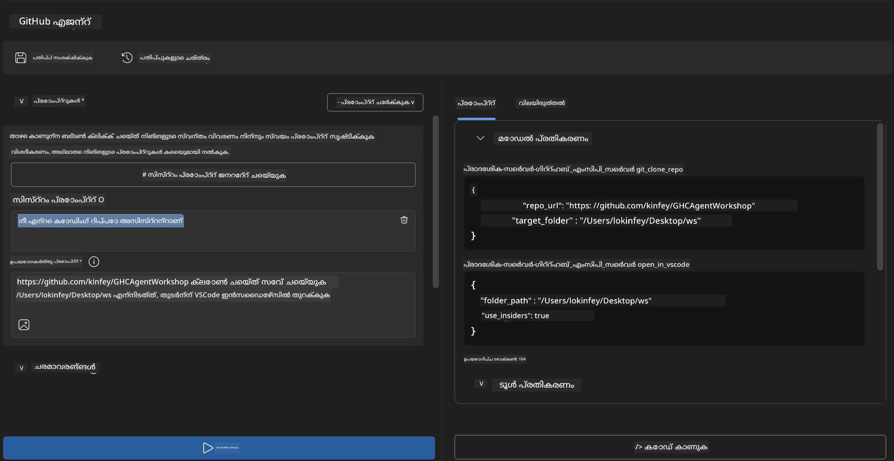
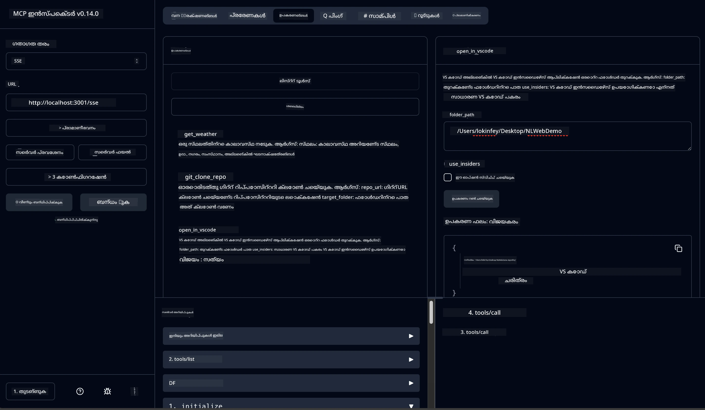

# 🐙 മോഡ്യൂൾ 4: പ്രായോഗിക MCP ഡെവലപ്പ്മെന്റ് - കസ്റ്റം GitHub ക്ലോൺ സെർവർ


> **⚡ ക്വിക്ക് സ്റ്റാർട്ട്:** വെറും 30 മിനിറ്റിനുള്ളിൽ GitHub റിപോസിറ്ററി ക്ലോണിംഗ് സ്വയമാറ്റവും VS Code ഇന്റഗ്രേഷനും ഓട്ടോമേറ്റുചെയ്ത ഒരു പ്രൊഡക്ഷൻ റെഡീ MCP സെർവർ നിർമ്മിക്കുക!

## 🎯 പഠന ലക്ഷ്യങ്ങൾ

ഈ ലാബ് അവസാനിക്കുമ്പോൾ നിങ്ങൾക്ക് കഴിയും:

- ✅ യാഥാർത്ഥ്യ ഡെവലപ്പ്മെന്റ് വർക്ക്‌ഫ്ലോകൾക്കായുള്ള കസ്റ്റം MCP സെർവർ സൃഷ്ടിക്കുക
- ✅ MCP മുഖേൻ GitHub റിപോസിറ്ററി ക്ലോണിംഗ് പ്രവർത്തനം നടപ്പിലാക്കുക
- ✅ കസ്റ്റം MCP സെർവർ VS Code, Agent Builder എന്നിവയുമായി ഇന്റഗ്രേറ്റ് ചെയ്യുക
- ✅ GitHub Copilot Agent Mode കസ്റ്റം MCP ടൂളുകളോടൊപ്പം ഉപയോഗിക്കുക
- ✅ പ്രൊഡക്ഷൻ എൻവർൺമെന്റുകളിൽ കസ്റ്റം MCP സെർവർ ടെസ്റ്റ് ചെയ്ത് ഡിപ്പ്ലോയ് ചെയ്യുക

## 📋 മുൻഅവശ്യകതകൾ

- ലാബ് 1-3 (MCP അടിസ്ഥാനം, ഉയർന്ന ഡെവലപ്പ്മെന്റ്) പൂർത്തിയാക്കിയിരിക്കുന്നത്
- GitHub Copilot സബ്സ്ക്രിപ്ഷൻ ([സൗജന്യ സൈൻഅപ്പ് ലഭ്യമാണ്](https://github.com/github-copilot/signup))
- AI Toolkit, GitHub Copilot എക്സ്റ്റൻഷനുകൾ ഉൾപ്പെടുന്ന VS Code
- ഇൻസ്റ്റാൾ ചെയ്ത് കോൺഫിഗർ ചെയ്ത Git CLI

## 🏗️ പദ്ധതി അവലോകനം

### **യാഥാർത്ഥ്യ ഡെവലപ്പ്മെന്റ് വെല്ലുവിളി**
ഡെവലപ്പർമാരായി നമ്മൾ പലപ്പോഴായി GitHub റിപോസിറ്ററികൾ ക്ലോൺ ചെയ്ത് അവ VS Code അല്ലെങ്കിൽ VS Code Insiders ൽ തുറക്കും. ഈ മാനുവൽ പ്രക്രിയയിൽ ചുമതലയുണ്ട്:
1. ടെർമിനൽ/കമാൻഡ് പ്രോംപ്റ്റ് തുറക്കൽ
2. ആവശ്യമായ ഡയറക്ടറിയിലേക്ക് പോകൽ
3. `git clone` കമാൻഡ് നടപ്പിലാക്കൽ
4. ക്ലോൺ ചെയ്ത ഡയറക്ടറിയിൽ VS Code ഓപ്പൺചെയ്യൽ

**നമ്മുടെ MCP പരിഹാരം ഈ മുഴുവൻ പ്രക്രിയയെ ഒരു ബുദ്ധിമുട്ടിൽ ഉള്ള കമാൻഡിൽ ക്രമീകരിക്കുന്നു!**

### **നിങ്ങൾ സൃഷ്ടിക്കുന്നത്**
ഒരു **GitHub Clone MCP Server** (`git_mcp_server`) താഴെപ്പറയുന്നവ നൽകുന്നു:

| സവിശേഷത | വിവരണം | ഗുണം |
|---------|-------------|---------|
| 🔄 **സ്മാർട്ട് റിപോസിറ്ററി ക്ലോണിംഗ്** | GitHub റിപോസിറ്ററികൾ പരിശോധിച്ച് ക്ലോൺ ചെയ്യുക | സ്വയമാറ്റപ്പെട്ട പിശക് പരിശോധിക്കൽ |
| 📁 **ബുദ്ധിമുട്ടുള്ള ഡയറക്ടറി മാനേജ്മെന്റ്** | സുരക്ഷിതമായി ഡയറക്ടറികൾ പരിശോധിച്ച് സൃഷ്ടിക്കുക | മേൽവിലക്ക് തടയൽ |
| 🚀 **ക്രോസ് പ്ലാറ്റ്ഫോം VS Code ഇന്റഗ്രേഷൻ** | പ്രോജക്റ്റുകൾ VS Code/Insiders ൽ തുറക്കുക | തറവാട് തെറ്റാതെ പ്രവർത്തനം |
| 🛡️ **ദൃഢമായ പിശക് കൈകാര്യം ചെയ്യൽ** | നെറ്റ്‌വർക്കിംഗും അനുമതിയും പാത്ത് പ്രശ്‌നങ്ങളും കൈകാര്യം ചെയ്യുക | പ്രൊഡക്ഷൻ റെഡീ വിശ്വാസ്യത |

---

## 📖 ഘട്ടം-ഘട്ടം നടപ്പാക്കൽ

### ഘട്ടം 1: Agent Builderയിൽ GitHub ഏജന്റ് സൃഷ്ടിക്കുക

1. AI Toolkit എക്സ്റ്റൻഷൻ വഴി **Agent Builder** എളുപ്പത്തിൽ ആരംഭിക്കുക
2. താഴെപ്പറയുന്ന കോൺഫിഗറേഷനിൽ **പുതിയ ഏജന്റ് സൃഷ്ടിക്കുക**:
   ```
   Agent Name: GitHubAgent
   ```

3. **കസ്റ്റം MCP സെർവർ തുടങ്ങുക:**
   - **Tools** → **Add Tool** → **MCP Server** എന്നവയിൽ പ്രവേശിക്കുക
   - **"Create A new MCP Server"** തിരഞ്ഞെടുക്കുക
   - പരമാവധി സൌകര്യമാർന്ന **Python ടെംപ്ലേറ്റ്** തിരഞ്ഞെടുക്കുക
   - **സെർവർ നാമം:** `git_mcp_server`

### ഘട്ടം 2: GitHub Copilot Agent Mode ക്രമീകരിക്കുക

1. VS Code ൽ GitHub Copilot തുറക്കുക (Ctrl/Cmd + Shift + P → "GitHub Copilot: Open")
2. Copilot ഇന്റർഫേസിൽ **Agent മോഡൽ തിരഞ്ഞെടുക്കുക**
3. വസ്തുതാപരമായ ഗവേഷണശേഷി വർദ്ധിപ്പിക്കാൻ **Claude 3.7 മോഡൽ തിരഞ്ഞെടുക്കുക**
4. ടൂൾ ആക്സസ് ലഭിക്കാൻ **MCP ഇന്റഗ്രേഷൻ സജീവമാക്കുക**

> **💡 പ്രൊ ടിപ്:** Claude 3.7 ഡെവലപ്പ്മെൻ്റ് വർക്ക്‌ഫ്ലോകളും പിശക് കൈകാര്യം ചെയ്യലും മികച്ച മനസിലാക്കൽ നൽകുന്നു.

### ഘട്ടം 3: പ്രധാന MCP സെർവർ പ്രവർത്തനം നടപ്പിലാക്കുക

**GitHub Copilot Agent Mode ഉപയോഗിച്ച് താഴെ കൊടുത്ത വിശദമായ പ്രോംപ്റ്റ് ഉപയോഗിക്കുക:**

```
Create two MCP tools with the following comprehensive requirements:

🔧 TOOL A: clone_repository
Requirements:
- Clone any GitHub repository to a specified local folder
- Return the absolute path of the successfully cloned project
- Implement comprehensive validation:
  ✓ Check if target directory already exists (return error if exists)
  ✓ Validate GitHub URL format (https://github.com/user/repo)
  ✓ Verify git command availability (prompt installation if missing)
  ✓ Handle network connectivity issues
  ✓ Provide clear error messages for all failure scenarios

🚀 TOOL B: open_in_vscode
Requirements:
- Open specified folder in VS Code or VS Code Insiders
- Cross-platform compatibility (Windows/Linux/macOS)
- Use direct application launch (not terminal commands)
- Auto-detect available VS Code installations
- Handle cases where VS Code is not installed
- Provide user-friendly error messages

Additional Requirements:
- Follow MCP 1.9.3 best practices
- Include proper type hints and documentation
- Implement logging for debugging purposes
- Add input validation for all parameters
- Include comprehensive error handling
```

### ഘട്ടം 4: നിങ്ങളുടെ MCP സെർവർ ടെസ്റ്റ് ചെയ്യുക

#### 4a. Agent Builder ൽ ടെസ്റ്റ്

1. Agent Builder ൽ ഡീബഗ് കോൺഫിഗറേഷൻ ആരംഭിക്കുക
2. നിങ്ങളുടെ ഏജന്റിനെ ഈ സിസ്റ്റം പ്രോംപ്റ്റിൽ ക്രമീകരിക്കുക:

```
SYSTEM_PROMPT:
You are my intelligent coding repository assistant. You help developers efficiently clone GitHub repositories and set up their development environment. Always provide clear feedback about operations and handle errors gracefully.
```

3. യഥാർത്ഥ ഉപയോക്തൃ സാഹചര്യമാസങ്ങളോടെ ടെസ്റ്റ് ചെയ്യുക:

```
USER_PROMPT EXAMPLES:

Scenario : Basic Clone and Open
"Clone {Your GitHub Repo link such as https://github.com/kinfey/GHCAgentWorkshop
 } and save to {The global path you specify}, then open it with VS Code Insiders"
```



**പ്രതീക്ഷിക്കപ്പെട്ട ഫലങ്ങൾ:**
- ✅ പാത സ്ഥിരീകരണത്തോടെ വിജയകരമായി ക്ലോൺ ചെയ്യുക
- ✅ ഓട്ടോമാറ്റിക് VS Code ആരംഭിക്കൽ
- ✅ അസാധുവായ സാഹചര്യങ്ങൾക്ക് পরিষ্কার പിശക് സന്ദേശങ്ങൾ
- ✅ അതിരുകൾക്കുള്ള ശൃംഖലയുടെ ശരിയായ കൈകാര്യം

#### 4b. MCP ഇൻസ്‌പെക്ടറിലും ടെസ്റ്റ് ചെയ്യുക




---


**🎉 അഭിനന്ദനങ്ങൾ!** യാഥാർത്ഥ്യ ഡെവലപ്പ്മെന്റ് വർക്ക്‌ഫ്ലോ വെല്ലുവിളികൾ പരിഹരിക്കുന്ന പ്രായോഗികവും പ്രൊഡക്ഷൻ റെഡിയും ആയ MCP സെർവർ വിജയകരമായി നിർമ്മിച്ചു. നിങ്ങളുടെ കസ്റ്റം GitHub ക്ലോൺ സെർവർ ഡെവലപ്പർ ഉത്പാദനക്ഷമത വർദ്ധിപ്പിക്കുന്ന MCP ശക്തി പകർന്നു നൽകുന്നു.

### 🏆 നേടിയ പാലുകൾ:
- ✅ **MCP ഡെവലപ്പർ** - കസ്റ്റം MCP സെർവർ സൃഷ്ടിച്ചു
- ✅ **വർക്ക്‌ഫ്ലോ ഓട്ടോമേറ്റർ** - ഡെവലപ്പ്മെന്റ് പ്രക്രിയകൾ ലളിതമാക്കി  
- ✅ **ഇന്റഗ്രേഷൻ വിദഗ്‌ധൻ** - വിവിധ ഡെവലപ്പ്മെന്റ് ടൂളുകൾ ബന്ധിപ്പിച്ചു
- ✅ **പ്രൊഡക്ഷൻ റെഡീ** - ഡിപ്പ്ലോയ് ചെയ്യാവുന്ന പരിഹാരങ്ങൾ നിർമ്മിച്ചു

---

## 🎓 വർക്ക്ഷോപ്പ് പൂർത്തിയാക്കൽ: Model Context Protocol-നോടുള്ള നിങ്ങളുടെ യാത്ര

**പ്രിയ വർക്ക്ഷോപ്പ് പങ്കാളി,**

Model Context Protocol വർക്ക്ഷോപ്പിലെ നാലു മോഡ്യൂളുകളും പൂർത്തിയാക്കിയതിന് അഭിനന്ദനങ്ങൾ! അടിസ്ഥാന AI Toolkit ആശയങ്ങൾ മനസിലാക്കുന്നതിൽ നിന്നും യാഥാർത്ഥ്യ ഡെവലപ്പ്മെന്റ് വെല്ലുവിളികൾ പരിഹരിക്കുന്ന പ്രൊഡക്ഷൻ റെഡി MCP സെർവർ നിർമ്മിക്കലിലേക്ക് നിങ്ങൾ വലിയൊരു വഴി വന്നിരിക്കുന്നു.

### 🚀 നിങ്ങളുടെ പഠന പാത സൂക്ഷ്മം:

**[Module 1](../lab1/README.md)**: AI Toolkit അടിസ്ഥാനങ്ങൾ, മോഡൽ പരിശോധന, നിങ്ങളുടെ ആദ്യ AI ഏജന്റ് സൃഷ്ടിക്കൽ പഠിച്ചിരിക്കുന്നു.

**[Module 2](../lab2/README.md)**: MCP ആർക്കിടെക്ചർ, Playwright MCP ഇന്റഗ്രേഷൻ, ആദ്യ ബ്രൗസർ ഓട്ടോമേഷൻ ഏജന്റ് നിർമ്മാണം.

**[Module 3](../lab3/README.md)**: വിപുലമായ കസ്റ്റം MCP സെർവർ ഡെവലപ്പ്മെന്റ്, Weather MCP സെർവർ, ഡീബഗിങ് ടൂളുകൾ പരിചയം.

**[Module 4](../lab4/README.md)**: യാഥാർത്ഥ്യ GitHub റിപോസിറ്ററി വർക്ക്‌ഫ്ലോ ഓട്ടോമേഷൻ ടൂൾ സൃഷ്ടിക്കുന്നതിന് തങ്ങളെ പ്രയോഗിച്ചു.

### 🌟 നിങ്ങൾ അതിമേഴ്സ്സിച്ചു:

- ✅ **AI Toolkit പരിസ്ഥിതി**: മോഡലുകൾ, ഏജന്റുകൾ, ഇന്റഗ്രേഷൻ മാതൃകകൾ
- ✅ **MCP ആർക്കിടെക്ചർ**: ക്ലയന്റ്-സെർവർ ഡിസൈൻ, ട്രാൻസ്പോർട്ട് പ്രോട്ടോകോളുകൾ, സുരക്ഷ
- ✅ **ഡെവലപ്പർ ടൂളുകൾ**: പ്ലേഗ്രൗണ്ടിൽ നിന്ന് ഇൻസ്‌പെക്ടറിലേക്ക്, പ്രൊഡക്ഷൻ ഡിപ്പ്ലോയ്മെൻസ് വരെ
- ✅ **കസ്റ്റം ഡെവലപ്പ്മെന്റ്**: സ്വന്തം MCP സെർവർ നിർമ്മാണം, പരിശോധന, ഡിപ്പ്ലോയ്‌മെന്റ്
- ✅ **പ്രായോഗിക പ്രയോഗങ്ങൾ**: യാഥാർത്ഥ്യ വർക്ക്‌ഫ്ലോ ആയുധങ്ങൾ AI ഉപയോഗിച്ച് പരിഹരിക്കൽ

### 🔮 നിങ്ങളുടെ അടുത്ത പടികൾ:

1. **നിങ്ങളുടെ സ്വന്തം MCP സെർവർ നിർമ്മിക്കുക**: ഈ കഴിവുകൾ ഉപയോഗിച്ച് നിങ്ങളുടെ അപൂർവ വർക്ക്‌ഫ്ലോകൾ സ്വയമാറ്റിക്കുക
2. **MCP കമ്മ്യൂണിറ്റിയിൽ ചേരുക**: നിങ്ങൾ സൃഷ്ടിച്ചതുപങ്കിടുകയും മറ്റുള്ളവരിൽ നിന്നു പഠിക്കുകയും ചെയ്യുക
3. **വിപുലമായ ഇന്റഗ്രേഷൻ പരീക്ഷിക്കുക**: MCP സെർവർ എന്റർപ്രൈസ് സിസ്റ്റങ്ങളുമായി ബന്ധിപ്പിക്കുക
4. **ഓപ്പൺ സോഴ്സ് സഹായിക്കുക**: MCP ടൂളിംഗ്, ഡോക്യുമെന്റേഷൻ മെച്ചപ്പെടുത്തൽ സഹായിക്കുക

ഈ വർക്ക്ഷോപ്പ് തുടക്കം മാത്രമാണ്. Model Context Protocol പരിസ്ഥിതി വേഗത്തിൽ വികസിക്കുന്നു, നിങ്ങൾ ഇപ്പോൾ AI-നിർഭര ഡെവലപ്പ്മെന്റ് ടൂൾസിന്റെ മുൻപന്തിയിലാണ്.

**പങ്കെടുക്കുകയും പഠിക്കാൻ സന്നദ്ധരായിരുന്നതിനും നന്ദി!**

ഈ വർക്ക്ഷോപ്പ് പുതിയ ആശയങ്ങൾ ഉണർത്തി, നിങ്ങളുടെ ഡെവലപ്പ്മെന്റ് യാത്രയിൽ AI ഉപകരണങ്ങളുമായി എങ്ങനെ ബന്ധിപ്പിക്കാമെന്ന് മാറ്റിവരുത്തും എന്ന് പ്രതീക്ഷിക്കുന്നു.

**സുഖകരമായ കോഡിംഗ്!**

---

## അടുത്തത്

മോഡ്യൂൾ 10-ലെ എല്ലാ ലാബുകളും പൂർത്തിയാക്കിയതിന് അഭിനന്ദനങ്ങൾ!

- തിരിച്ചു പോകുക: [Module 10 Overview](../README.md)
- തുടരണം: [Module 11: MCP Server Hands-On Labs](../../11-MCPServerHandsOnLabs/README.md)

---

<!-- CO-OP TRANSLATOR DISCLAIMER START -->
**വിശകലനം**:  
ഈ ഡോക്യുമെന്റ് AI ഭാഷാന്തര സേവനം [Co-op Translator](https://github.com/Azure/co-op-translator) ഉപയോഗിച്ച് വിവര്‍ത്തനം ചെയ്തതാണ്. നാം സത്യം പാലിക്കാന്‍ ശ്രമിക്കുന്നുവെങ്കിലും, യന്ത്രവത്‌കരിച്ച വിവര്‍ത്തനങ്ങളില്‍ പിശകുകള്‍ അല്ലെങ്കില്‍ അശുദ്ധികള്‍ ഉണ്ടായേക്കാമെന്ന് ദയവായി മനസിലാക്കുക. അസല്‍ ഡോക്യുമെന്റ് അതിന്റെ സ്വന്തം ഭാഷയില്‍ അധികാരപരമായ സ്രോതസ്സായി കരുതപ്പെടണം. നിര്‍ണ്ണായകമായ വിവരങ്ങള്‍ക്കായി, പ്രൊഫഷണല്‍ മനുഷ്യ വിവര്‍ത്തനം ശുപാര്‍ശ ചെയ്യുന്നു. ഈ വിവര്‍ത്തനത്തിന്റെ ഉപയോഗത്തില്‍ നിന്നുണ്ടാകുന്ന ഏതൊരു തെറ്റിദ്ധാരണയ്ക്കോ തെറ്റ് വ്യാഖ്യാനത്തിനോ നാം ഉത്തരവാദികളല്ല.
<!-- CO-OP TRANSLATOR DISCLAIMER END -->