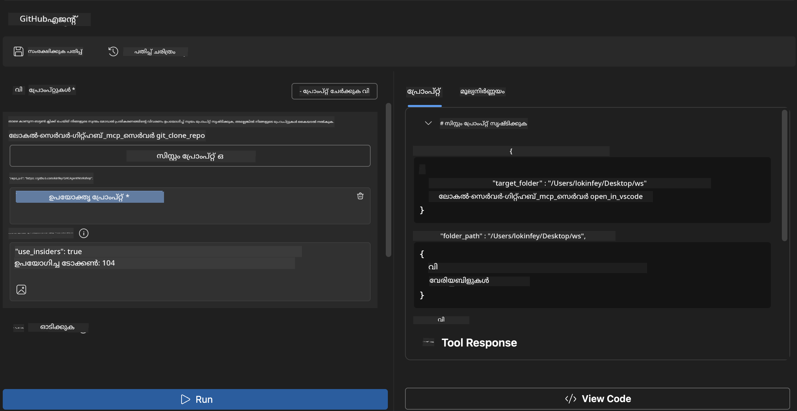
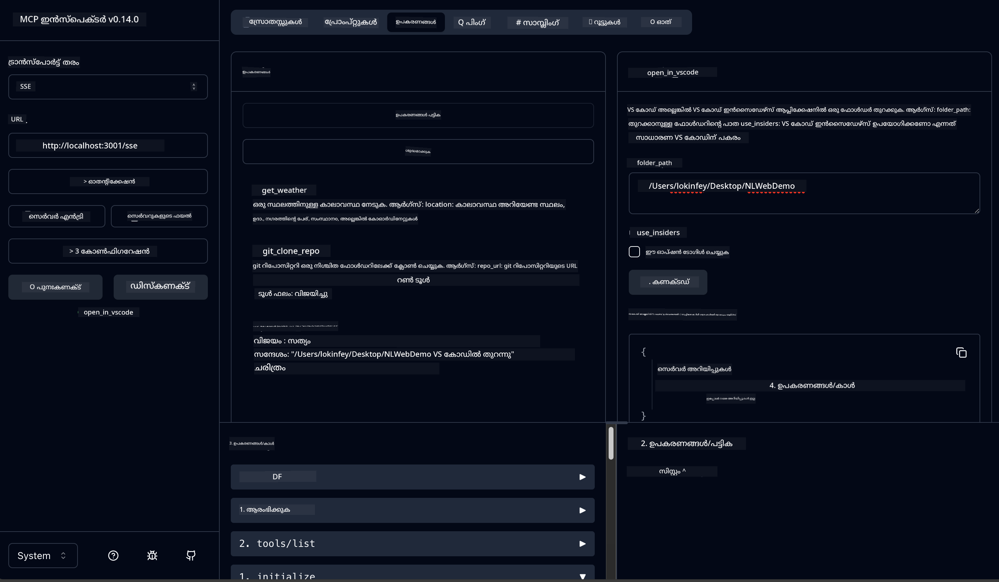

<!--
CO_OP_TRANSLATOR_METADATA:
{
  "original_hash": "f83bc722dc758efffd68667d6a1db470",
  "translation_date": "2025-12-11T16:53:01+00:00",
  "source_file": "10-StreamliningAIWorkflowsBuildingAnMCPServerWithAIToolkit/lab4/README.md",
  "language_code": "ml"
}
-->
# 🐙 Module 4: പ്രായോഗിക MCP വികസനം - കസ്റ്റം GitHub ക്ലോൺ സെർവർ


> **⚡ വേഗത്തിലുള്ള ആരംഭം:** GitHub റിപോസിറ്ററി ക്ലോണിംഗ് സ്വയം പ്രവർത്തിപ്പിക്കുകയും VS Code ഇന്റഗ്രേഷൻ 30 മിനിറ്റിൽ നിർമ്മിക്കുന്ന പ്രൊഡക്ഷൻ-സജ്ജ MCP സെർവർ നിർമ്മിക്കുക!

## 🎯 പഠന ലക്ഷ്യങ്ങൾ

ഈ ലാബിന്റെ അവസാനം, നിങ്ങൾക്ക് കഴിയും:

- ✅ യഥാർത്ഥ ലോക വികസന പ്രവാഹങ്ങൾക്ക് കസ്റ്റം MCP സെർവർ സൃഷ്ടിക്കുക
- ✅ MCP വഴി GitHub റിപോസിറ്ററി ക്ലോണിംഗ് ഫംഗ്ഷണാലിറ്റി നടപ്പിലാക്കുക
- ✅ കസ്റ്റം MCP സെർവറുകൾ VS Code, Agent Builder എന്നിവയുമായി ഇന്റഗ്രേറ്റ് ചെയ്യുക
- ✅ GitHub Copilot Agent Mode കസ്റ്റം MCP ടൂളുകളുമായി ഉപയോഗിക്കുക
- ✅ പ്രൊഡക്ഷൻ പരിസ്ഥിതികളിൽ കസ്റ്റം MCP സെർവറുകൾ ടെസ്റ്റ് ചെയ്ത് ഡിപ്ലോയ് ചെയ്യുക

## 📋 മുൻകൂട്ടി ആവശ്യങ്ങൾ

- ലാബുകൾ 1-3 (MCP അടിസ്ഥാനങ്ങൾ, ഉയർന്ന തല വികസനം) പൂർത്തിയാക്കിയിരിക്കണം
- GitHub Copilot സബ്സ്ക്രിപ്ഷൻ ([സൗജന്യ സൈൻഅപ്പ് ലഭ്യമാണ്](https://github.com/github-copilot/signup))
- AI Toolkit, GitHub Copilot എക്സ്റ്റൻഷനുകളുള്ള VS Code
- Git CLI ഇൻസ്റ്റാൾ ചെയ്ത് കോൺഫിഗർ ചെയ്തിരിക്കണം

## 🏗️ പ്രോജക്ട് അവലോകനം

### **യഥാർത്ഥ ലോക വികസന വെല്ലുവിളി**
ഡെവലപ്പർമാരായി, GitHub ഉപയോഗിച്ച് റിപോസിറ്ററികൾ ക്ലോൺ ചെയ്ത് VS Code അല്ലെങ്കിൽ VS Code Insiders-ൽ തുറക്കുന്നത് സാധാരണമാണ്. ഈ മാനുവൽ പ്രക്രിയയിൽ ഉൾപ്പെടുന്നത്:
1. ടെർമിനൽ/കമാൻഡ് പ്രോംപ്റ്റ് തുറക്കൽ
2. ആവശ്യമായ ഡയറക്ടറിയിലേക്ക് നാവിഗേറ്റ് ചെയ്യൽ
3. `git clone` കമാൻഡ് റൺ ചെയ്യൽ
4. ക്ലോൺ ചെയ്ത ഡയറക്ടറിയിൽ VS Code തുറക്കൽ

**നമ്മുടെ MCP പരിഹാരം ഇതെല്ലാം ഒരു ബുദ്ധിമുട്ടില്ലാത്ത കമാൻഡിൽ സംയോജിപ്പിക്കുന്നു!**

### **നിങ്ങൾ നിർമ്മിക്കുന്നതു**
**GitHub Clone MCP Server** (`git_mcp_server`) നൽകുന്നത്:

| സവിശേഷത | വിവരണം | ഗുണം |
|---------|-------------|---------|
| 🔄 **സ്മാർട്ട് റിപോസിറ്ററി ക്ലോണിംഗ്** | GitHub റിപോസിറ്ററികൾ സാധുത പരിശോധിച്ച് ക്ലോൺ ചെയ്യുക | ഓട്ടോമേറ്റഡ് പിശക് പരിശോധന |
| 📁 **ബുദ്ധിമുട്ടില്ലാത്ത ഡയറക്ടറി മാനേജ്മെന്റ്** | ഡയറക്ടറികൾ സുരക്ഷിതമായി പരിശോധിച്ച് സൃഷ്ടിക്കുക | ഒതുക്കം തടയുന്നു |
| 🚀 **ക്രോസ്-പ്ലാറ്റ്ഫോം VS Code ഇന്റഗ്രേഷൻ** | പ്രോജക്ടുകൾ VS Code/Insiders-ൽ തുറക്കുക | സുതാര്യമായ പ്രവാഹം |
| 🛡️ **ദൃഢമായ പിശക് കൈകാര്യം** | നെറ്റ്‌വർക്ക്, അനുമതി, പാത പ്രശ്നങ്ങൾ കൈകാര്യം ചെയ്യുക | പ്രൊഡക്ഷൻ-സജ്ജ വിശ്വാസ്യത |

---

## 📖 ഘട്ടം ഘട്ടമായി നടപ്പാക്കൽ

### ഘട്ടം 1: Agent Builder-ൽ GitHub ഏജന്റ് സൃഷ്ടിക്കുക

1. AI Toolkit എക്സ്റ്റൻഷൻ വഴി **Agent Builder** ആരംഭിക്കുക
2. താഴെ കാണുന്ന കോൺഫിഗറേഷൻ ഉപയോഗിച്ച് **പുതിയ ഏജന്റ് സൃഷ്ടിക്കുക:**
   ```
   Agent Name: GitHubAgent
   ```

3. **കസ്റ്റം MCP സെർവർ ആരംഭിക്കുക:**
   - **Tools** → **Add Tool** → **MCP Server** എന്ന വഴി പോകുക
   - **"Create A new MCP Server"** തിരഞ്ഞെടുക്കുക
   - പരമാവധി സൗകര്യത്തിനായി **Python ടെംപ്ലേറ്റ്** തിരഞ്ഞെടുക്കുക
   - **സെർവർ നാമം:** `git_mcp_server`

### ഘട്ടം 2: GitHub Copilot Agent Mode കോൺഫിഗർ ചെയ്യുക

1. VS Code-ൽ GitHub Copilot തുറക്കുക (Ctrl/Cmd + Shift + P → "GitHub Copilot: Open")
2. Copilot ഇന്റർഫേസിൽ **Agent Model** തിരഞ്ഞെടുക്കുക
3. മെച്ചപ്പെട്ട വിവേകശേഷിയുള്ള **Claude 3.7 മോഡൽ** തിരഞ്ഞെടുക്കുക
4. ടൂൾ ആക്സസ് ലഭിക്കാൻ **MCP ഇന്റഗ്രേഷൻ** സജീവമാക്കുക

> **💡 പ്രൊ ടിപ്പ്:** Claude 3.7 വികസന പ്രവാഹങ്ങളും പിശക് കൈകാര്യം ചെയ്യലും മെച്ചപ്പെട്ട രീതിയിൽ മനസ്സിലാക്കുന്നു.

### ഘട്ടം 3: കോർ MCP സെർവർ ഫംഗ്ഷണാലിറ്റി നടപ്പിലാക്കുക

**GitHub Copilot Agent Mode ഉപയോഗിച്ച് താഴെ കാണുന്ന വിശദമായ പ്രോംപ്റ്റ് ഉപയോഗിക്കുക:**

```
Create two MCP tools with the following comprehensive requirements:

🔧 TOOL A: clone_repository
Requirements:
- Clone any GitHub repository to a specified local folder
- Return the absolute path of the successfully cloned project
- Implement comprehensive validation:
  ✓ Check if target directory already exists (return error if exists)
  ✓ Validate GitHub URL format (https://github.com/user/repo)
  ✓ Verify git command availability (prompt installation if missing)
  ✓ Handle network connectivity issues
  ✓ Provide clear error messages for all failure scenarios

🚀 TOOL B: open_in_vscode
Requirements:
- Open specified folder in VS Code or VS Code Insiders
- Cross-platform compatibility (Windows/Linux/macOS)
- Use direct application launch (not terminal commands)
- Auto-detect available VS Code installations
- Handle cases where VS Code is not installed
- Provide user-friendly error messages

Additional Requirements:
- Follow MCP 1.9.3 best practices
- Include proper type hints and documentation
- Implement logging for debugging purposes
- Add input validation for all parameters
- Include comprehensive error handling
```

### ഘട്ടം 4: നിങ്ങളുടെ MCP സെർവർ ടെസ്റ്റ് ചെയ്യുക

#### 4a. Agent Builder-ൽ ടെസ്റ്റ് ചെയ്യുക

1. Agent Builder-ന്റെ ഡീബഗ് കോൺഫിഗറേഷൻ ആരംഭിക്കുക
2. ഈ സിസ്റ്റം പ്രോംപ്റ്റ് ഉപയോഗിച്ച് ഏജന്റ് കോൺഫിഗർ ചെയ്യുക:

```
SYSTEM_PROMPT:
You are my intelligent coding repository assistant. You help developers efficiently clone GitHub repositories and set up their development environment. Always provide clear feedback about operations and handle errors gracefully.
```

3. യാഥാർത്ഥ്യപരമായ ഉപയോക്തൃ സാഹചര്യങ്ങളുമായി ടെസ്റ്റ് ചെയ്യുക:

```
USER_PROMPT EXAMPLES:

Scenario : Basic Clone and Open
"Clone {Your GitHub Repo link such as https://github.com/kinfey/GHCAgentWorkshop
 } and save to {The global path you specify}, then open it with VS Code Insiders"
```



**പ്രതീക്ഷിക്കുന്ന ഫലങ്ങൾ:**
- ✅ പാത സ്ഥിരീകരണത്തോടെ വിജയകരമായ ക്ലോണിംഗ്
- ✅ സ്വയം പ്രവർത്തിക്കുന്ന VS Code ആരംഭിക്കൽ
- ✅ അസാധുവായ സാഹചര്യങ്ങൾക്ക് വ്യക്തമായ പിശക് സന്ദേശങ്ങൾ
- ✅ അതിരുകൾക്കുള്ള ശരിയായ കൈകാര്യം

#### 4b. MCP ഇൻസ്പെക്ടറിൽ ടെസ്റ്റ് ചെയ്യുക




---


**🎉 അഭിനന്ദനങ്ങൾ!** നിങ്ങൾ യഥാർത്ഥ വികസന പ്രവാഹ വെല്ലുവിളികൾ പരിഹരിക്കുന്ന പ്രായോഗിക, പ്രൊഡക്ഷൻ-സജ്ജ MCP സെർവർ വിജയകരമായി സൃഷ്ടിച്ചു. നിങ്ങളുടെ കസ്റ്റം GitHub ക്ലോൺ സെർവർ MCP-യുടെ ശക്തി പ്രദർശിപ്പിക്കുന്നു, ഡെവലപ്പർ ഉൽപാദകത്വം ഓട്ടോമേറ്റുചെയ്യാനും മെച്ചപ്പെടുത്താനും.

### 🏆 നേടിയതുകൾ:
- ✅ **MCP ഡെവലപ്പർ** - കസ്റ്റം MCP സെർവർ സൃഷ്ടിച്ചു
- ✅ **പ്രവാഹ ഓട്ടോമേറ്റർ** - വികസന പ്രക്രിയകൾ ലളിതമാക്കി  
- ✅ **ഇന്റഗ്രേഷൻ വിദഗ്ധൻ** - പല വികസന ടൂളുകളും ബന്ധിപ്പിച്ചു
- ✅ **പ്രൊഡക്ഷൻ റെഡി** - ഡിപ്ലോയബിൾ പരിഹാരങ്ങൾ നിർമ്മിച്ചു

---

## 🎓 വർക്ക്‌ഷോപ്പ് പൂർത്തീകരണം: Model Context Protocol-നൊപ്പം നിങ്ങളുടെ യാത്ര

**പ്രിയ വർക്ക്‌ഷോപ്പ് പങ്കാളി,**

Model Context Protocol വർക്ക്‌ഷോപ്പിന്റെ നാല് മോട്യൂളുകളും പൂർത്തിയാക്കിയതിന് അഭിനന്ദനങ്ങൾ! അടിസ്ഥാന AI Toolkit ആശയങ്ങൾ മനസ്സിലാക്കുന്നതിൽ നിന്നു യഥാർത്ഥ ലോക വികസന വെല്ലുവിളികൾ പരിഹരിക്കുന്ന പ്രൊഡക്ഷൻ-സജ്ജ MCP സെർവറുകൾ നിർമ്മിക്കുന്നതുവരെ നീണ്ട വഴി കടന്നുവന്നു.

### 🚀 നിങ്ങളുടെ പഠന പാത സംഗ്രഹം:

**[Module 1](../lab1/README.md)**: AI Toolkit അടിസ്ഥാനങ്ങൾ, മോഡൽ ടെസ്റ്റിംഗ്, ആദ്യ AI ഏജന്റ് സൃഷ്ടിക്കൽ പഠിച്ചു.

**[Module 2](../lab2/README.md)**: MCP ആർക്കിടെക്ചർ, Playwright MCP ഇന്റഗ്രേഷൻ, ആദ്യ ബ്രൗസർ ഓട്ടോമേഷൻ ഏജന്റ് നിർമ്മിച്ചു.

**[Module 3](../lab3/README.md)**: കസ്റ്റം MCP സെർവർ വികസനം, Weather MCP സെർവർ, ഡീബഗിംഗ് ടൂളുകൾ കൈകാര്യം ചെയ്തു.

**[Module 4](../lab4/README.md)**: യഥാർത്ഥ GitHub റിപോസിറ്ററി പ്രവാഹ ഓട്ടോമേഷൻ ടൂൾ നിർമ്മിക്കാൻ പഠിച്ചു.

### 🌟 നിങ്ങൾ കൈവരിച്ചത്:

- ✅ **AI Toolkit പരിസ്ഥിതി**: മോഡലുകൾ, ഏജന്റുകൾ, ഇന്റഗ്രേഷൻ മാതൃകകൾ
- ✅ **MCP ആർക്കിടെക്ചർ**: ക്ലയന്റ്-സെർവർ ഡിസൈൻ, ട്രാൻസ്പോർട്ട് പ്രോട്ടോകോളുകൾ, സുരക്ഷ
- ✅ **ഡെവലപ്പർ ടൂളുകൾ**: പ്ലേഗ്രൗണ്ട് മുതൽ ഇൻസ്പെക്ടർ വരെ, പ്രൊഡക്ഷൻ ഡിപ്ലോയ്മെന്റ് വരെ
- ✅ **കസ്റ്റം വികസനം**: MCP സെർവറുകൾ നിർമ്മിക്കൽ, ടെസ്റ്റിംഗ്, ഡിപ്ലോയ്മെന്റ്
- ✅ **പ്രായോഗിക പ്രയോഗങ്ങൾ**: AI ഉപയോഗിച്ച് യഥാർത്ഥ പ്രവാഹ വെല്ലുവിളികൾ പരിഹരിക്കൽ

### 🔮 നിങ്ങളുടെ അടുത്ത ചുവടുകൾ:

1. **സ്വന്തം MCP സെർവർ നിർമ്മിക്കുക**: നിങ്ങളുടെ പ്രത്യേക പ്രവാഹങ്ങൾ ഓട്ടോമേറ്റ് ചെയ്യാൻ ഈ കഴിവുകൾ പ്രയോഗിക്കുക
2. **MCP കമ്മ്യൂണിറ്റിയിൽ ചേരുക**: നിങ്ങളുടെ സൃഷ്ടികൾ പങ്കുവെച്ച് മറ്റുള്ളവരിൽ നിന്ന് പഠിക്കുക
3. **ഉയർന്ന തല ഇന്റഗ്രേഷൻ അന്വേഷിക്കുക**: MCP സെർവറുകൾ എന്റർപ്രൈസ് സിസ്റ്റങ്ങളുമായി ബന്ധിപ്പിക്കുക
4. **ഓപ്പൺ സോഴ്‌സ് സംഭാവനകൾ നൽകുക**: MCP ടൂളിംഗ്, ഡോക്യുമെന്റേഷൻ മെച്ചപ്പെടുത്താൻ സഹായിക്കുക

ഈ വർക്ക്‌ഷോപ്പ് തുടക്കമാണ്. Model Context Protocol പരിസ്ഥിതി വേഗത്തിൽ വികസിക്കുന്നു, നിങ്ങൾ ഇപ്പോൾ AI-ചാലിത വികസന ടൂളുകളുടെ മുന്നണിയിൽ നിൽക്കാൻ സജ്ജമാണ്.

**പങ്കെടുത്തതിന്, പഠനത്തിന് നന്ദി!**

ഈ വർക്ക്‌ഷോപ്പ് നിങ്ങളുടെ വികസന യാത്രയിൽ AI ടൂളുകളുമായി എങ്ങനെ പ്രവർത്തിക്കാമെന്ന് മാറ്റം വരുത്തുന്ന ആശയങ്ങൾ ഉണർത്തിയിരിക്കുമെന്ന് ഞങ്ങൾ പ്രതീക്ഷിക്കുന്നു.

**സന്തോഷകരമായ കോഡിംഗ്!**

---

---

<!-- CO-OP TRANSLATOR DISCLAIMER START -->
**അസൂയാ**:  
ഈ രേഖ AI വിവർത്തന സേവനം [Co-op Translator](https://github.com/Azure/co-op-translator) ഉപയോഗിച്ച് വിവർത്തനം ചെയ്തതാണ്. നാം കൃത്യതയ്ക്ക് ശ്രമിച്ചിട്ടുണ്ടെങ്കിലും, സ്വയം പ്രവർത്തിക്കുന്ന വിവർത്തനങ്ങളിൽ പിശകുകൾ അല്ലെങ്കിൽ തെറ്റുകൾ ഉണ്ടാകാമെന്ന് ദയവായി ശ്രദ്ധിക്കുക. അതിന്റെ മാതൃഭാഷയിലുള്ള യഥാർത്ഥ രേഖയാണ് പ്രാമാണികമായ ഉറവിടം എന്ന് പരിഗണിക്കേണ്ടതാണ്. നിർണായകമായ വിവരങ്ങൾക്ക്, പ്രൊഫഷണൽ മനുഷ്യ വിവർത്തനം ശുപാർശ ചെയ്യപ്പെടുന്നു. ഈ വിവർത്തനം ഉപയോഗിക്കുന്നതിൽ നിന്നുണ്ടാകുന്ന ഏതെങ്കിലും തെറ്റിദ്ധാരണകൾക്കോ തെറ്റായ വ്യാഖ്യാനങ്ങൾക്കോ ഞങ്ങൾ ഉത്തരവാദികളല്ല.
<!-- CO-OP TRANSLATOR DISCLAIMER END -->