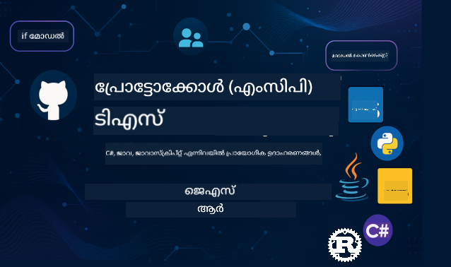

<!--
CO_OP_TRANSLATOR_METADATA:
{
  "original_hash": "db1c632975cfde89e42f01af57f7e4a8",
  "translation_date": "2025-12-11T09:10:31+00:00",
  "source_file": "README.md",
  "language_code": "ml"
}
-->
 

ഈ വിഭവങ്ങൾ ഉപയോഗിച്ച് ആരംഭിക്കാൻ ഈ ഘട്ടങ്ങൾ പിന്തുടരുക:
1. **റിപ്പോസിറ്ററി ഫോർക്ക് ചെയ്യുക**: ക്ലിക്ക് ചെയ്യുക 
2. **റിപ്പോസിറ്ററി ക്ലോൺ ചെയ്യുക**:   `git clone https://github.com/microsoft/mcp-for-beginners.git`
3. **ചേരുക** 

### 🌐 ബഹുഭാഷാ പിന്തുണ

#### GitHub ആക്ഷൻ വഴി പിന്തുണ (സ്വയം പ്രവർത്തിക്കുന്നതും എപ്പോഴും പുതുക്കപ്പെട്ടതും)

<!-- CO-OP TRANSLATOR LANGUAGES TABLE START -->
[Arabic](../ar/README.md) | [Bengali](../bn/README.md) | [Bulgarian](../bg/README.md) | [Burmese (Myanmar)](../my/README.md) | [Chinese (Simplified)](../zh/README.md) | [Chinese (Traditional, Hong Kong)](../hk/README.md) | [Chinese (Traditional, Macau)](../mo/README.md) | [Chinese (Traditional, Taiwan)](../tw/README.md) | [Croatian](../hr/README.md) | [Czech](../cs/README.md) | [Danish](../da/README.md) | [Dutch](../nl/README.md) | [Estonian](../et/README.md) | [Finnish](../fi/README.md) | [French](../fr/README.md) | [German](../de/README.md) | [Greek](../el/README.md) | [Hebrew](../he/README.md) | [Hindi](../hi/README.md) | [Hungarian](../hu/README.md) | [Indonesian](../id/README.md) | [Italian](../it/README.md) | [Japanese](../ja/README.md) | [Korean](../ko/README.md) | [Lithuanian](../lt/README.md) | [Malay](../ms/README.md) | [Marathi](../mr/README.md) | [Nepali](../ne/README.md) | [Norwegian](../no/README.md) | [Persian (Farsi)](../fa/README.md) | [Polish](../pl/README.md) | [Portuguese (Brazil)](../br/README.md) | [Portuguese (Portugal)](../pt/README.md) | [Punjabi (Gurmukhi)](../pa/README.md) | [Romanian](../ro/README.md) | [Russian](../ru/README.md) | [Serbian (Cyrillic)](../sr/README.md) | [Slovak](../sk/README.md) | [Slovenian](../sl/README.md) | [Spanish](../es/README.md) | [Swahili](../sw/README.md) | [Swedish](../sv/README.md) | [Tagalog (Filipino)](../tl/README.md) | [Tamil](../ta/README.md) | [Thai](../th/README.md) | [Turkish](../tr/README.md) | [Ukrainian](../uk/README.md) | [Urdu](../ur/README.md) | [Vietnamese](../vi/README.md)
<!-- CO-OP TRANSLATOR LANGUAGES TABLE END -->

# 🚀 മോഡൽ കോൺടെക്സ്റ്റ് പ്രോട്ടോക്കോൾ (MCP) തുടക്കക്കാർക്കുള്ള പാഠ്യപദ്ധതി

## **C#, Java, JavaScript, Rust, Python, TypeScript എന്നിവയിൽ കൈകൊണ്ട് കോഡ് ഉദാഹരണങ്ങളോടെ MCP പഠിക്കുക**

## 🧠 മോഡൽ കോൺടെക്സ്റ്റ് പ്രോട്ടോക്കോൾ പാഠ്യപദ്ധതിയുടെ അവലോകനം
മോഡൽ കോൺടെക്സ്റ്റ് പ്രോട്ടോക്കോളിലേക്ക് നിങ്ങളുടെ യാത്രയ്ക്ക് സ്വാഗതം! എഐ ആപ്ലിക്കേഷനുകൾ വിവിധ ഉപകരണങ്ങളുമായി സേവനങ്ങളുമായി എങ്ങനെ ആശയവിനിമയം നടത്തുന്നു എന്ന് നിങ്ങൾ ഒരിക്കലും ആലോചിച്ചിട്ടുണ്ടെങ്കിൽ, ഡെവലപ്പർമാർ ബുദ്ധിമുട്ടുള്ള സിസ്റ്റങ്ങൾ നിർമ്മിക്കുന്ന വിധം മാറ്റിമറിക്കുന്ന മനോഹരമായ പരിഹാരം നിങ്ങൾ കണ്ടെത്താൻ പോകുകയാണ്.

MCP-നെ എഐ ആപ്ലിക്കേഷനുകൾക്കുള്ള സർവത്രം ഉപയോഗിക്കാവുന്ന ഭാഷാന്തരമായി കരുതുക - USB പോർട്ടുകൾ നിങ്ങളുടെ കമ്പ്യൂട്ടറിലേക്ക് ഏതൊരു ഉപകരണവും കണക്ട് ചെയ്യാൻ അനുവദിക്കുന്നതുപോലെ, MCP എഐ മോഡലുകൾക്ക് ഏതൊരു ഉപകരണം അല്ലെങ്കിൽ സേവനവുമായി സ്റ്റാൻഡേർഡൈസ്ഡ് രീതിയിൽ കണക്ട് ചെയ്യാൻ അനുവദിക്കുന്നു. നിങ്ങൾ നിങ്ങളുടെ ആദ്യ ചാറ്റ്ബോട്ട് നിർമ്മിക്കുകയാണോ അല്ലെങ്കിൽ സങ്കീർണ്ണമായ എഐ വർക്ക്‌ഫ്ലോകളിൽ പ്രവർത്തിക്കുകയാണോ, MCP മനസ്സിലാക്കുന്നത് കൂടുതൽ കഴിവുള്ള, കൂടുതൽ ഫ്ലെക്സിബിൾ ആപ്ലിക്കേഷനുകൾ സൃഷ്ടിക്കാൻ നിങ്ങളെ സഹായിക്കും.

ഈ പാഠ്യപദ്ധതി നിങ്ങളുടെ പഠനയാത്രയ്ക്ക് ക്ഷമയോടെയും പരിചരണത്തോടെയും രൂപകൽപ്പന ചെയ്തതാണ്. നിങ്ങൾക്ക് അറിയാമായ ലളിതമായ ആശയങ്ങളിൽ നിന്ന് ആരംഭിച്ച് നിങ്ങളുടെ ഇഷ്ടപ്പെട്ട പ്രോഗ്രാമിംഗ് ഭാഷയിൽ കൈകൊണ്ട് പരിശീലനം വഴി നിങ്ങളുടെ വിദഗ്ധത ക്രമാതീതമായി വികസിപ്പിക്കും. ഓരോ ഘട്ടവും വ്യക്തമായ വിശദീകരണങ്ങൾ, പ്രായോഗിക ഉദാഹരണങ്ങൾ, കൂടാതെ ധാരാളം പ്രോത്സാഹനവും ഉൾക്കൊള്ളുന്നു.

ഈ യാത്ര പൂർത്തിയാക്കിയപ്പോൾ, നിങ്ങൾക്ക് നിങ്ങളുടെ സ്വന്തം MCP സർവറുകൾ നിർമ്മിക്കാൻ, അവയെ പ്രശസ്ത എഐ പ്ലാറ്റ്ഫോമുകളുമായി സംയോജിപ്പിക്കാൻ, ഈ സാങ്കേതികവിദ്യ എഐ വികസനത്തിന്റെ ഭാവി എങ്ങനെ രൂപപ്പെടുത്തുന്നു എന്ന് മനസ്സിലാക്കാൻ ആത്മവിശ്വാസം ഉണ്ടാകും. ഈ രസകരമായ സാഹസികത ഒരുമിച്ച് ആരംഭിക്കാം!

### ഔദ്യോഗിക ഡോക്യുമെന്റേഷൻ, സ്പെസിഫിക്കേഷനുകൾ

നിങ്ങളുടെ മനസ്സിലാക്കലും വളരുമ്പോൾ ഈ വിഭവങ്ങൾ കൂടുതൽ മൂല്യമേകും, എന്നാൽ എല്ലാം ഉടൻ വായിക്കണമെന്ന് സമ്മർദ്ദം അനുഭവിക്കേണ്ട. നിങ്ങൾക്ക് ഏറ്റവും കൂടുതൽ താൽപ്പര്യമുള്ള മേഖലകളിൽ നിന്ന് ആരംഭിക്കുക!
- 📘 [MCP ഡോക്യുമെന്റേഷൻ](https://modelcontextprotocol.io/) – ഘട്ടം ഘട്ടമായി ട്യൂട്ടോറിയലുകളും ഉപയോക്തൃ മാർഗ്ഗനിർദേശങ്ങളും ലഭിക്കുന്ന നിങ്ങളുടെ പ്രധാന വിഭവം. ഡോക്യുമെന്റേഷൻ തുടക്കക്കാർക്കായി എഴുതപ്പെട്ടതാണ്, നിങ്ങൾക്ക് നിങ്ങളുടെ താളത്തിൽ പിന്തുടരാവുന്ന വ്യക്തമായ ഉദാഹരണങ്ങൾ നൽകുന്നു.
- 📜 [MCP സ്പെസിഫിക്കേഷൻ](https://modelcontextprotocol.io/docs/) – ഇത് നിങ്ങളുടെ സമഗ്ര റഫറൻസ് മാനുവലായി കരുതുക. പാഠ്യപദ്ധതി വഴി പ്രവർത്തിക്കുമ്പോൾ, നിങ്ങൾക്ക് പ്രത്യേക വിശദാംശങ്ങൾ പരിശോധിക്കാൻ, ഉയർന്ന തലത്തിലുള്ള സവിശേഷതകൾ അന്വേഷിക്കാൻ ഇവിടെ തിരിച്ചുവരേണ്ടി വരും.
- 📜 [അസൽ MCP സ്പെസിഫിക്കേഷൻ](https://spec.modelcontextprotocol.io/) – ഉയർന്ന തലത്തിലുള്ള നടപ്പാക്കലുകൾക്കായി സഹായകമായ അധിക സാങ്കേതിക വിശദാംശങ്ങൾ ഇതിൽ ഉൾക്കൊള്ളുന്നു. നിങ്ങൾക്ക് ആവശ്യമുള്ളപ്പോൾ ഇത് ഉപയോഗിക്കാം, തുടക്കത്തിൽ ഇതിനെക്കുറിച്ച് ആശങ്കപ്പെടേണ്ട.
- 🧑‍💻 [MCP GitHub റിപോസിറ്ററി](https://github.com/modelcontextprotocol) – ഇവിടെ നിങ്ങൾക്ക് SDKകൾ, ഉപകരണങ്ങൾ, വിവിധ പ്രോഗ്രാമിംഗ് ഭാഷകളിലെ കോഡ് സാമ്പിളുകൾ ലഭിക്കും. പ്രായോഗിക ഉദാഹരണങ്ങളും ഉപയോഗിക്കാൻ തയ്യാറായ ഘടകങ്ങളും നിറഞ്ഞ ഒരു നിധിയാണ് ഇത്.
- 🌐 [MCP കമ്മ്യൂണിറ്റി](https://github.com/orgs/modelcontextprotocol/discussions) – MCP-യെക്കുറിച്ച് പഠിക്കുന്നവരും പരിചയസമ്പന്നരായ ഡെവലപ്പർമാരും ചേർന്ന് ചർച്ചകൾ നടത്തുന്ന ഒരു പിന്തുണയുള്ള സമൂഹം. ചോദ്യങ്ങൾ സ്വാഗതം ചെയ്യപ്പെടുന്ന, അറിവ് സ്വതന്ത്രമായി പങ്കുവെക്കുന്ന ഒരു സമൂഹമാണ് ഇത്.
  
## പഠനലക്ഷ്യങ്ങൾ

ഈ പാഠ്യപദ്ധതി അവസാനിക്കുമ്പോൾ, നിങ്ങളുടെ പുതിയ കഴിവുകളെക്കുറിച്ച് ആത്മവിശ്വാസവും ആവേശവും അനുഭവിക്കും. നിങ്ങൾ നേടുന്ന കാര്യങ്ങൾ:

• **MCP അടിസ്ഥാനങ്ങൾ മനസ്സിലാക്കുക**: മോഡൽ കോൺടെക്സ്റ്റ് പ്രോട്ടോക്കോൾ എന്താണെന്ന്, എഐ ആപ്ലിക്കേഷനുകൾ എങ്ങനെ ചേർന്ന് പ്രവർത്തിക്കുന്നു എന്നതിൽ ഇത് എങ്ങനെ വിപ്ലവകരമാണ് എന്നതും ഉദാഹരണങ്ങളോടും ഉപമകളോടും കൂടി നിങ്ങൾക്ക് മനസ്സിലാകും.

• **നിങ്ങളുടെ ആദ്യ MCP സർവർ നിർമ്മിക്കുക**: നിങ്ങളുടെ ഇഷ്ടപ്പെട്ട പ്രോഗ്രാമിംഗ് ഭാഷയിൽ പ്രവർത്തനക്ഷമമായ MCP സർവർ നിർമ്മിക്കാം, ലളിതമായ ഉദാഹരണങ്ങളിൽ നിന്ന് ആരംഭിച്ച് ക്രമാതീതമായി കഴിവുകൾ വികസിപ്പിക്കുക.

• **എഐ മോഡലുകൾ യഥാർത്ഥ ഉപകരണങ്ങളുമായി ബന്ധിപ്പിക്കുക**: എഐ മോഡലുകളും യഥാർത്ഥ സേവനങ്ങളും തമ്മിലുള്ള ഇടവേള പൂരിപ്പിക്കുന്ന വിധം പഠിക്കുക, നിങ്ങളുടെ ആപ്ലിക്കേഷനുകൾക്ക് ശക്തമായ പുതിയ കഴിവുകൾ നൽകുക.

• **സുരക്ഷാ മികച്ച രീതികൾ നടപ്പിലാക്കുക**: നിങ്ങളുടെ MCP നടപ്പാക്കലുകൾ സുരക്ഷിതമാക്കാൻ എങ്ങനെ എന്നത് മനസ്സിലാക്കുക, നിങ്ങളുടെ ആപ്ലിക്കേഷനുകളെയും ഉപയോക്താക്കളെയും സംരക്ഷിക്കുക.

• **ആത്മവിശ്വാസത്തോടെ വിന്യസിക്കുക**: വികസനത്തിൽ നിന്നു പ്രൊഡക്ഷനിലേക്ക് MCP പ്രോജക്ടുകൾ എങ്ങനെ കൊണ്ടുപോകാമെന്ന് അറിയുക, യാഥാർത്ഥ്യത്തിൽ പ്രവർത്തിക്കുന്ന പ്രായോഗിക വിന്യാസ തന്ത്രങ്ങൾ ഉപയോഗിക്കുക.

• **MCP കമ്മ്യൂണിറ്റിയിൽ ചേരുക**: എഐ ആപ്ലിക്കേഷൻ വികസനത്തിന്റെ ഭാവി രൂപപ്പെടുത്തുന്ന വളരുന്ന ഡെവലപ്പർമാരുടെ സമൂഹത്തിന്റെ ഭാഗമാകുക.

## അടിസ്ഥാന പശ്ചാത്തലം

MCP-യുടെ പ്രത്യേകതകളിലേക്ക് കടക്കുന്നതിന് മുമ്പ്, ചില അടിസ്ഥാന ആശയങ്ങളിൽ നിങ്ങൾക്ക് ആശ്വാസം ഉണ്ടാകണമെന്ന് ഉറപ്പാക്കാം. ഈ മേഖലകളിൽ നിങ്ങൾ വിദഗ്ധനല്ലെങ്കിൽ ആശങ്കപ്പെടേണ്ട, നാം ആവശ്യമായ എല്ലാം വിശദീകരിക്കും!

### പ്രോട്ടോക്കോളുകൾ മനസ്സിലാക്കുക (അടിസ്ഥാനങ്ങൾ)

ഒരു പ്രോട്ടോക്കോൾ ഒരു സംഭാഷണത്തിനുള്ള നിയമങ്ങളുപോലെയാണ്. നിങ്ങൾ ഒരു സുഹൃത്തിനോട് ഫോൺ ചെയ്യുമ്പോൾ, നിങ്ങൾ രണ്ടുപേരും "ഹലോ" എന്ന് പറയണം, സംസാരിക്കാൻ തവണകൾ എടുക്കണം, അവസാനത്തിൽ "ഗുഡ്‌ബൈ" എന്ന് പറയണം എന്നറിയാം. കമ്പ്യൂട്ടർ പ്രോഗ്രാമുകൾക്കും സമാന നിയമങ്ങൾ വേണം ഫലപ്രദമായി ആശയവിനിമയം നടത്താൻ.

MCP ഒരു പ്രോട്ടോക്കോൾ ആണ് - എഐ മോഡലുകളും ആപ്ലിക്കേഷനുകളും ഉപകരണങ്ങളുമായി സേവനങ്ങളുമായി ഫലപ്രദമായ "സംഭാഷണങ്ങൾ" നടത്താൻ സഹായിക്കുന്ന അംഗീകൃത നിയമങ്ങളുടെ സമാഹാരം. മനുഷ്യരുടെ ആശയവിനിമയം സുഗമമാക്കുന്ന സംഭാഷണ നിയമങ്ങൾ പോലെയാണ് MCP എഐ ആപ്ലിക്കേഷൻ ആശയവിനിമയം കൂടുതൽ വിശ്വസനീയവും ശക്തവുമാക്കുന്നു.

### ക്ലയന്റ്-സർവർ ബന്ധങ്ങൾ (പ്രോഗ്രാമുകൾ എങ്ങനെ ചേർന്ന് പ്രവർത്തിക്കുന്നു)

നിങ്ങൾ ദിവസവും ക്ലയന്റ്-സർവർ ബന്ധങ്ങൾ ഉപയോഗിക്കുന്നു! വെബ് ബ്രൗസർ (ക്ലയന്റ്) ഉപയോഗിച്ച് ഒരു വെബ്‌സൈറ്റ് സന്ദർശിക്കുമ്പോൾ, പേജ് ഉള്ളടക്കം അയക്കുന്ന വെബ് സർവറുമായി നിങ്ങൾ കണക്ട് ചെയ്യുന്നു. ബ്രൗസർ വിവരങ്ങൾ ചോദിക്കാൻ അറിയാം, സർവർ മറുപടി നൽകാൻ അറിയാം.

MCP-യിൽ സമാനമായ ബന്ധം ഉണ്ട്: എഐ മോഡലുകൾ ക്ലയന്റുകളായി പ്രവർത്തിച്ച് വിവരങ്ങൾ അല്ലെങ്കിൽ പ്രവർത്തനങ്ങൾ അഭ്യർത്ഥിക്കുന്നു, MCP സർവർകൾ ആ കഴിവുകൾ നൽകുന്നു. ഇത് എഐക്ക് നിർദ്ദിഷ്ട പ്രവർത്തനങ്ങൾ ചെയ്യാൻ ചോദിക്കാവുന്ന സഹായിയായ ഒരു അസിസ്റ്റന്റിനെപ്പോലെ ആണ്.

### സ്റ്റാൻഡേർഡൈസേഷൻ എന്തുകൊണ്ട് പ്രധാനമാണ് (വസ്തുക്കൾ ചേർന്ന് പ്രവർത്തിക്കാൻ)

ഓരോ കാർ നിർമ്മാതാവും വ്യത്യസ്ത ആകൃതിയിലുള്ള പെട്രോൾ പമ്പുകൾ ഉപയോഗിച്ചിരുന്നെങ്കിൽ - ഓരോ കാറിനും വ്യത്യസ്ത അഡാപ്റ്റർ വേണം! സ്റ്റാൻഡേർഡൈസേഷൻ സാധാരണ സമീപനങ്ങളിൽ ഒത്തുചേരലാണ്, അതിലൂടെ വസ്തുക്കൾ ചേർന്ന് പ്രവർത്തിക്കുന്നു.

MCP എഐ ആപ്ലിക്കേഷനുകൾക്കായി ഈ സ്റ്റാൻഡേർഡൈസേഷൻ നൽകുന്നു. ഓരോ എഐ മോഡലും ഓരോ ഉപകരണത്തോടും പ്രവർത്തിക്കാൻ കസ്റ്റം കോഡ് ആവശ്യമില്ലാതെ MCP അവയ്ക്ക് ആശയവിനിമയം നടത്താനുള്ള സർവത്രം ഉപയോഗിക്കാവുന്ന മാർഗം സൃഷ്ടിക്കുന്നു. ഇതിലൂടെ ഡെവലപ്പർമാർ ഒരിക്കൽ ഉപകരണങ്ങൾ നിർമ്മിച്ച് പല എഐ സിസ്റ്റങ്ങളുമായി പ്രവർത്തിക്കാം.

## 🧭 നിങ്ങളുടെ പഠനപാതയുടെ അവലോകനം

നിങ്ങളുടെ MCP യാത്ര ആത്മവിശ്വാസവും കഴിവുകളും ക്രമാതീതമായി വികസിപ്പിക്കാൻ സൂക്ഷ്മമായി രൂപകൽപ്പന ചെയ്തതാണ്. ഓരോ ഘട്ടവും പുതിയ ആശയങ്ങൾ പരിചയപ്പെടുത്തുമ്പോൾ മുമ്പ് പഠിച്ചവയെ ശക്തിപ്പെടുത്തും.

### 🌱 അടിസ്ഥാന ഘട്ടം: അടിസ്ഥാനങ്ങൾ മനസ്സിലാക്കൽ (മൊഡ്യൂളുകൾ 0-2)

ഇവിടെ നിങ്ങളുടെ സാഹസികത ആരംഭിക്കുന്നു! പരിചിതമായ ഉപമകളും ലളിതമായ ഉദാഹരണങ്ങളും ഉപയോഗിച്ച് MCP ആശയങ്ങൾ പരിചയപ്പെടുത്തും. MCP എന്താണെന്ന്, അത് എന്തുകൊണ്ട് ഉണ്ട്, എഐ വികസനത്തിന്റെ വലിയ ലോകത്ത് എങ്ങനെ പൊരുത്തപ്പെടുന്നു എന്നത് നിങ്ങൾക്ക് മനസ്സിലാകും.

• **മൊഡ്യൂൾ 0 - MCP പരിചയം**: MCP എന്താണെന്ന്, ആധുനിക എഐ ആപ്ലിക്കേഷനുകൾക്കായി ഇത് എന്തുകൊണ്ട് അത്യന്താപേക്ഷിതമാണെന്ന് പരിശോധിച്ച് തുടങ്ങും. MCP പ്രവർത്തിക്കുന്ന യഥാർത്ഥ ഉദാഹരണങ്ങൾ കാണുകയും ഡെവലപ്പർമാർ നേരിടുന്ന സാധാരണ പ്രശ്നങ്ങൾ എങ്ങനെ പരിഹരിക്കുന്നു എന്ന് മനസ്സിലാക്കുകയും ചെയ്യും.

• **മൊഡ്യൂൾ 1 - പ്രധാന ആശയങ്ങൾ വിശദീകരണം**: MCP-യുടെ അടിസ്ഥാന ഘടകങ്ങൾ ഇവിടെ പഠിക്കും. ഈ ആശയങ്ങൾ സ്വാഭാവികവും മനസ്സിലാക്കാൻ എളുപ്പവുമായിരിക്കാനുള്ളതിനായി ധാരാളം ഉപമകളും ദൃശ്യ ഉദാഹരണങ്ങളും ഉപയോഗിക്കും.

• **മൊഡ്യൂൾ 2 - MCP-യിലെ സുരക്ഷ**: സുരക്ഷ ഭീതിയുണ്ടാക്കുന്ന കാര്യമാകാം, പക്ഷേ MCP-യിൽ ഉൾപ്പെടുത്തിയിരിക്കുന്ന സുരക്ഷാ സവിശേഷതകളും നിങ്ങളുടെ ആപ്ലിക്കേഷനുകൾ ആരംഭത്തിൽ തന്നെ സംരക്ഷിക്കുന്ന മികച്ച രീതികളും നാം കാണിക്കും.

### 🔨 നിർമ്മാണ ഘട്ടം: നിങ്ങളുടെ ആദ്യ നടപ്പാക്കലുകൾ സൃഷ്ടിക്കൽ (മൊഡ്യൂൾ 3)

ഇപ്പോൾ യഥാർത്ഥ രസകരമായ ഭാഗം തുടങ്ങുന്നു! നിങ്ങൾക്ക് MCP സർവർകളും ക്ലയന്റുകളും കൈകൊണ്ട് നിർമ്മിക്കുന്ന അനുഭവം ലഭിക്കും. ആശങ്കപ്പെടേണ്ട, ലളിതമായി ആരംഭിച്ച് ഓരോ ഘട്ടവും നാം നിങ്ങളെ നയിക്കും.

ഈ മൊഡ്യൂളിൽ നിങ്ങളുടെ ഇഷ്ടപ്പെട്ട പ്രോഗ്രാമിംഗ് ഭാഷയിൽ പരിശീലനം നൽകുന്ന നിരവധി കൈകൊണ്ട് മാർഗ്ഗനിർദേശങ്ങൾ ഉൾക്കൊള്ളുന്നു. നിങ്ങളുടെ ആദ്യ MCP സർവർ നിർമ്മിക്കുകയും അതുമായി കണക്ട് ചെയ്യാൻ ക്ലയന്റ് നിർമ്മിക്കുകയും പ്രശസ്ത ഡെവലപ്പ്മെന്റ് ഉപകരണങ്ങളായ VS Code പോലുള്ളവയുമായി സംയോജിപ്പിക്കുകയും ചെയ്യും.

ഓരോ മാർഗ്ഗനിർദേശവും പൂർണ്ണമായ കോഡ് ഉദാഹരണങ്ങൾ, പ്രശ്നപരിഹാര നിർദ്ദേശങ്ങൾ, പ്രത്യേക ഡിസൈൻ തിരഞ്ഞെടുപ്പുകൾ എന്തുകൊണ്ടാണ് ചെയ്യുന്നത് എന്ന വിശദീകരണങ്ങൾ ഉൾക്കൊള്ളുന്നു. ഈ ഘട്ടം പൂർത്തിയാക്കിയപ്പോൾ, നിങ്ങൾക്ക് അഭിമാനിക്കാവുന്ന പ്രവർത്തനക്ഷമമായ MCP നടപ്പാക്ക
അവസാന ഘട്ടം MCP സമൂഹത്തിൽ ചേരാനും നിങ്ങൾക്ക് ഏറ്റവും ഇഷ്ടമുള്ള മേഖലകളിൽ വിദഗ്ധത നേടാനും കേന്ദ്രീകരിക്കുന്നു. നിങ്ങൾക്ക് ഓപ്പൺ-സോഴ്‌സ് MCP പ്രോജക്റ്റുകളിൽ സംഭാവന ചെയ്യുന്നത്, ആധുനിക ഓതന്റിക്കേഷൻ പാറ്റേണുകൾ നടപ്പിലാക്കുന്നത്, സമഗ്രമായ ഡാറ്റാബേസ്-ഇന്റഗ്രേറ്റഡ് പരിഹാരങ്ങൾ നിർമ്മിക്കുന്നത് എന്നിവ പഠിക്കാം.

മൊഡ്യൂൾ 11 പ്രത്യേക ശ്രദ്ധയ്ക്ക് അർഹമാണ് - ഇത് 13 ലാബുകളുള്ള സമ്പൂർണ ഹാൻഡ്‌സ്-ഓൺ പഠന പാതയാണ്, പോസ്റ്റ്ഗ്രെഎസ്‌ക്യുഎൽ ഇന്റഗ്രേഷനോടുകൂടിയ പ്രൊഡക്ഷൻ-റെഡി MCP സെർവറുകൾ നിർമ്മിക്കാൻ പഠിപ്പിക്കുന്നു. നിങ്ങൾ പഠിച്ച എല്ലാ കാര്യങ്ങളും ഒന്നിച്ച് കൊണ്ടുവരുന്ന ഒരു ക്യാപ്സ്റ്റോൺ പ്രോജക്റ്റ് പോലെയാണ് ഇത്!

### 📚 സമ്പൂർണ പാഠ്യക്രമ ഘടന

| Module | വിഷയം | വിവരണം | ലിങ്ക് |
|--------|-------|-------------|------|
| **Module 1-3: അടിസ്ഥാനങ്ങൾ** | | | |
| 00 | MCP പരിചയം | മോഡൽ കോൺടെക്സ്റ്റ് പ്രോട്ടോക്കോൾയുടെ അവലോകനം, AI പൈപ്പ്ലൈനുകളിൽ അതിന്റെ പ്രാധാന്യം | [കൂടുതൽ വായിക്കുക](./00-Introduction/README.md) |
| 01 | കോർ ആശയങ്ങൾ വിശദീകരണം | MCP കോർ ആശയങ്ങളുടെ ആഴത്തിലുള്ള പഠനം | [കൂടുതൽ വായിക്കുക](./01-CoreConcepts/README.md) |
| 02 | MCP-യിലെ സുരക്ഷ | സുരക്ഷാ ഭീഷണികളും മികച്ച പ്രാക്ടീസുകളും | [കൂടുതൽ വായിക്കുക](./02-Security/README.md) |
| 03 | MCP ആരംഭിക്കൽ | പരിസ്ഥിതി ക്രമീകരണം, അടിസ്ഥാന സെർവറുകൾ/ക്ലയന്റുകൾ, ഇന്റഗ്രേഷൻ | [കൂടുതൽ വായിക്കുക](./03-GettingStarted/README.md) |
| **Module 3: നിങ്ങളുടെ ആദ്യ സെർവർ & ക്ലയന്റ് നിർമ്മാണം** | | | |
| 3.1 | ആദ്യ സെർവർ | നിങ്ങളുടെ ആദ്യ MCP സെർവർ സൃഷ്ടിക്കുക | [ഗൈഡ്](./03-GettingStarted/01-first-server/README.md) |
| 3.2 | ആദ്യ ക്ലയന്റ് | അടിസ്ഥാന MCP ക്ലയന്റ് വികസിപ്പിക്കുക | [ഗൈഡ്](./03-GettingStarted/02-client/README.md) |
| 3.3 | LLM ഉള്ള ക്ലയന്റ് | വലിയ ഭാഷാ മോഡലുകൾ ഇന്റഗ്രേറ്റ് ചെയ്യുക | [ഗൈഡ്](./03-GettingStarted/03-llm-client/README.md) |
| 3.4 | VS കോഡ് ഇന്റഗ്രേഷൻ | MCP സെർവറുകൾ VS കോഡിൽ ഉപയോഗിക്കുക | [ഗൈഡ്](./03-GettingStarted/04-vscode/README.md) |
| 3.5 | stdio സെർവർ | stdio ട്രാൻസ്പോർട്ട് ഉപയോഗിച്ച് സെർവറുകൾ സൃഷ്ടിക്കുക | [ഗൈഡ്](./03-GettingStarted/05-stdio-server/README.md) |
| 3.6 | HTTP സ്ട്രീമിംഗ് | MCP-യിൽ HTTP സ്ട്രീമിംഗ് നടപ്പിലാക്കുക | [ഗൈഡ്](./03-GettingStarted/06-http-streaming/README.md) |
| 3.7 | AI ടൂൾകിറ്റ് | MCP-യുമായി AI ടൂൾകിറ്റ് ഉപയോഗിക്കുക | [ഗൈഡ്](./03-GettingStarted/07-aitk/README.md) |
| 3.8 | ടെസ്റ്റിംഗ് | നിങ്ങളുടെ MCP സെർവർ നടപ്പാക്കൽ പരിശോധിക്കുക | [ഗൈഡ്](./03-GettingStarted/08-testing/README.md) |
| 3.9 | ഡിപ്ലോയ്മെന്റ് | MCP സെർവറുകൾ പ്രൊഡക്ഷനിലേക്ക് ഡിപ്ലോയ് ചെയ്യുക | [ഗൈഡ്](./03-GettingStarted/09-deployment/README.md) |
| 3.10 | ആധുനിക സെർവർ ഉപയോഗം | ആധുനിക ഫീച്ചറുകൾ ഉപയോഗിച്ച് മെച്ചപ്പെട്ട ആർക്കിടെക്ചർ | [ഗൈഡ്](./03-GettingStarted/10-advanced/README.md) |
| 3.11 | ലളിതമായ ഓതന്റിക്കേഷൻ | തുടക്കത്തിൽ നിന്ന് ഓതന്റിക്കേഷൻ, RBAC പഠിപ്പിക്കുന്ന അധ്യായം | [ഗൈഡ്](./03-GettingStarted/11-simple-auth/README.md) |
| **Module 4-5: പ്രായോഗികവും ആധുനികവും** | | | |
| 04 | പ്രായോഗിക നടപ്പാക്കൽ | SDKകൾ, ഡീബഗിംഗ്, ടെസ്റ്റിംഗ്, പുനരുപയോഗയോഗ്യമായ പ്രോംപ്റ്റ് ടെംപ്ലേറ്റുകൾ | [കൂടുതൽ വായിക്കുക](./04-PracticalImplementation/README.md) |
| 05 | MCP-യിലെ ആധുനിക വിഷയങ്ങൾ | മൾട്ടി-മോഡൽ AI, സ്കെയിലിംഗ്, എന്റർപ്രൈസ് ഉപയോഗം | [കൂടുതൽ വായിക്കുക](./05-AdvancedTopics/README.md) |
| 5.1 | അസ്യൂർ ഇന്റഗ്രേഷൻ | MCP അസ്യൂറുമായി ഇന്റഗ്രേറ്റ് ചെയ്യൽ | [ഗൈഡ്](./05-AdvancedTopics/mcp-integration/README.md) |
| 5.2 | മൾട്ടി-മോഡാലിറ്റി | പല മോഡാലിറ്റികളുമായി പ്രവർത്തിക്കൽ | [ഗൈഡ്](./05-AdvancedTopics/mcp-multi-modality/README.md) |
| 5.3 | OAuth2 ഡെമോ | OAuth2 ഓതന്റിക്കേഷൻ നടപ്പിലാക്കുക | [ഗൈഡ്](./05-AdvancedTopics/mcp-oauth2-demo/README.md) |
| 5.4 | റൂട്ട് കോൺടെക്സ്റ്റുകൾ | റൂട്ട് കോൺടെക്സ്റ്റുകൾ മനസ്സിലാക്കുകയും നടപ്പിലാക്കുകയും ചെയ്യുക | [ഗൈഡ്](./05-AdvancedTopics/mcp-root-contexts/README.md) |
| 5.5 | റൂട്ടിംഗ് | MCP റൂട്ടിംഗ് തന്ത്രങ്ങൾ | [ഗൈഡ്](./05-AdvancedTopics/mcp-routing/README.md) |
| 5.6 | സാമ്പ്ലിംഗ് | MCP-യിലെ സാമ്പ്ലിംഗ് സാങ്കേതികവിദ്യകൾ | [ഗൈഡ്](./05-AdvancedTopics/mcp-sampling/README.md) |
| 5.7 | സ്കെയിലിംഗ് | MCP നടപ്പാക്കലുകൾ സ്കെയിൽ ചെയ്യുക | [ഗൈഡ്](./05-AdvancedTopics/mcp-scaling/README.md) |
| 5.8 | സുരക്ഷ | ആധുനിക സുരക്ഷാ പരിഗണനകൾ | [ഗൈഡ്](./05-AdvancedTopics/mcp-security/README.md) |
| 5.9 | വെബ് സെർച്ച് | വെബ് സെർച്ച് കഴിവുകൾ നടപ്പിലാക്കുക | [ഗൈഡ്](./05-AdvancedTopics/web-search-mcp/README.md) |
| 5.10 | റിയൽടൈം സ്ട്രീമിംഗ് | റിയൽടൈം സ്ട്രീമിംഗ് ഫംഗ്ഷണാലിറ്റി നിർമ്മിക്കുക | [ഗൈഡ്](./05-AdvancedTopics/mcp-realtimestreaming/README.md) |
| 5.11 | റിയൽടൈം സെർച്ച് | റിയൽടൈം സെർച്ച് നടപ്പിലാക്കുക | [ഗൈഡ്](./05-AdvancedTopics/mcp-realtimesearch/README.md) |
| 5.12 | Entra ID ഓതന്റിക്കേഷൻ | Microsoft Entra ID ഉപയോഗിച്ച് ഓതന്റിക്കേഷൻ | [ഗൈഡ്](./05-AdvancedTopics/mcp-security-entra/README.md) |
| 5.13 | ഫൗണ്ടറി ഇന്റഗ്രേഷൻ | അസ്യൂർ AI ഫൗണ്ടറിയുമായി ഇന്റഗ്രേറ്റ് ചെയ്യുക | [ഗൈഡ്](./05-AdvancedTopics/mcp-foundry-agent-integration/README.md) |
| 5.14 | കോൺടെക്സ്റ്റ് എഞ്ചിനീയറിംഗ് | ഫലപ്രദമായ കോൺടെക്സ്റ്റ് എഞ്ചിനീയറിംഗ് സാങ്കേതികവിദ്യകൾ | [ഗൈഡ്](./05-AdvancedTopics/mcp-contextengineering/README.md) |
| 5.15 | MCP കസ്റ്റം ട്രാൻസ്പോർട്ട് | കസ്റ്റം ട്രാൻസ്പോർട്ട് നടപ്പാക്കലുകൾ | [ഗൈഡ്](./05-AdvancedTopics/mcp-transport/README.md) |
| **Module 6-10: സമൂഹവും മികച്ച പ്രാക്ടീസുകളും** | | | |
| 06 | സമൂഹ സംഭാവനകൾ | MCP ഇക്കോസിസ്റ്റത്തിലേക്ക് സംഭാവന ചെയ്യുന്നത് എങ്ങനെ | [ഗൈഡ്](./06-CommunityContributions/README.md) |
| 07 | പ്രാരംഭ സ്വീകരണത്തിൽ നിന്നുള്ള洞察ങ്ങൾ | യാഥാർത്ഥ്യ നടപ്പാക്കൽ കഥകൾ | [ഗൈഡ്](./07-LessonsFromEarlyAdoption/README.md) |
| 08 | MCP-ക്കുള്ള മികച്ച പ്രാക്ടീസുകൾ | പ്രകടനം, ഫാൾട്ട്-ടോളറൻസ്, പ്രതിരോധം | [ഗൈഡ്](./08-BestPractices/README.md) |
| 09 | MCP കേസ് സ്റ്റഡികൾ | പ്രായോഗിക നടപ്പാക്കൽ ഉദാഹരണങ്ങൾ | [ഗൈഡ്](./09-CaseStudy/README.md) |
| 10 | ഹാൻഡ്‌സ്-ഓൺ വർക്ക്‌ഷോപ്പ് | AI ടൂൾകിറ്റുമായി MCP സെർവർ നിർമ്മാണം | [ലാബ്](./10-StreamliningAIWorkflowsBuildingAnMCPServerWithAIToolkit/README.md) |
| **Module 11: MCP സെർവർ ഹാൻഡ്‌സ് ഓൺ ലാബ്** | | | |
| 11 | MCP സെർവർ ഡാറ്റാബേസ് ഇന്റഗ്രേഷൻ | പോസ്റ്റ്ഗ്രെഎസ്‌ക്യുഎൽ ഇന്റഗ്രേഷനുള്ള സമഗ്രമായ 13-ലാബ് ഹാൻഡ്‌സ്-ഓൺ പഠന പാത | [ലാബുകൾ](./11-MCPServerHandsOnLabs/README.md) |
| 11.1 | പരിചയം | ഡാറ്റാബേസ് ഇന്റഗ്രേഷനും റീട്ടെയിൽ അനലിറ്റിക്സും ഉൾപ്പെടുന്ന MCP അവലോകനം | [ലാബ് 00](./11-MCPServerHandsOnLabs/00-Introduction/README.md) |
| 11.2 | കോർ ആർക്കിടെക്ചർ | MCP സെർവർ ആർക്കിടെക്ചർ, ഡാറ്റാബേസ് ലെയറുകൾ, സുരക്ഷാ പാറ്റേണുകൾ മനസ്സിലാക്കൽ | [ലാബ് 01](./11-MCPServerHandsOnLabs/01-Architecture/README.md) |
| 11.3 | സുരക്ഷ & മൾട്ടി-ടെനൻസി | റോ ലെവൽ സുരക്ഷ, ഓതന്റിക്കേഷൻ, മൾട്ടി-ടെനന്റ് ഡാറ്റ ആക്‌സസ് | [ലാബ് 02](./11-MCPServerHandsOnLabs/02-Security/README.md) |
| 11.4 | പരിസ്ഥിതി ക്രമീകരണം | ഡെവലപ്പ്മെന്റ് പരിസ്ഥിതി ക്രമീകരിക്കൽ, ഡോക്കർ, അസ്യൂർ റിസോഴ്‌സുകൾ | [ലാബ് 03](./11-MCPServerHandsOnLabs/03-Setup/README.md) |
| 11.5 | ഡാറ്റാബേസ് ഡിസൈൻ | പോസ്റ്റ്ഗ്രെഎസ്‌ക്യുഎൽ ക്രമീകരണം, റീട്ടെയിൽ സ്കീമ ഡിസൈൻ, സാമ്പിൾ ഡാറ്റ | [ലാബ് 04](./11-MCPServerHandsOnLabs/04-Database/README.md) |
| 11.6 | MCP സെർവർ നടപ്പാക്കൽ | ഡാറ്റാബേസ് ഇന്റഗ്രേഷനോടുകൂടിയ ഫാസ്റ്റ് MCP സെർവർ നിർമ്മാണം | [ലാബ് 05](./11-MCPServerHandsOnLabs/05-MCP-Server/README.md) |
| 11.7 | ടൂൾ വികസനം | ഡാറ്റാബേസ് ക്വറി ടൂളുകളും സ്കീമ ഇൻട്രോസ്പെക്ഷനും സൃഷ്ടിക്കൽ | [ലാബ് 06](./11-MCPServerHandsOnLabs/06-Tools/README.md) |
| 11.8 | സെമാന്റിക് സെർച്ച് | അസ്യൂർ ഓപ്പൺഎഐയും pgvector-ഉം ഉപയോഗിച്ച് വെക്ടർ എംബെഡ്ഡിംഗുകൾ നടപ്പിലാക്കൽ | [ലാബ് 07](./11-MCPServerHandsOnLabs/07-Semantic-Search/README.md) |
| 11.9 | ടെസ്റ്റിംഗ് & ഡീബഗിംഗ് | ടെസ്റ്റിംഗ് തന്ത്രങ്ങൾ, ഡീബഗിംഗ് ടൂളുകൾ, സാധുത പരിശോധന | [ലാബ് 08](./11-MCPServerHandsOnLabs/08-Testing/README.md) |
| 11.10 | VS കോഡ് ഇന്റഗ്രേഷൻ | VS കോഡ് MCP ഇന്റഗ്രേഷൻ ക്രമീകരണവും AI ചാറ്റ് ഉപയോഗവും | [ലാബ് 09](./11-MCPServerHandsOnLabs/09-VS-Code/README.md) |
| 11.11 | ഡിപ്ലോയ്മെന്റ് തന്ത്രങ്ങൾ | ഡോക്കർ ഡിപ്ലോയ്മെന്റ്, അസ്യൂർ കണ്ടെയ്‌നർ ആപ്പുകൾ, സ്കെയിലിംഗ് പരിഗണനകൾ | [ലാബ് 10](./11-MCPServerHandsOnLabs/10-Deployment/README.md) |
| 11.12 | മോണിറ്ററിംഗ് | ആപ്ലിക്കേഷൻ ഇൻസൈറ്റ്സ്, ലോഗിംഗ്, പ്രകടന നിരീക്ഷണം | [ലാബ് 11](./11-MCPServerHandsOnLabs/11-Monitoring/README.md) |
| 11.13 | മികച്ച പ്രാക്ടീസുകൾ | പ്രകടന മെച്ചപ്പെടുത്തൽ, സുരക്ഷ ശക്തിപ്പെടുത്തൽ, പ്രൊഡക്ഷൻ ടിപ്പുകൾ | [ലാബ് 12](./11-MCPServerHandsOnLabs/12-Best-Practices/README.md) |

### 💻 സാമ്പിൾ കോഡ് പ്രോജക്റ്റുകൾ

MCP പഠനത്തിലെ ഏറ്റവും രസകരമായ ഭാഗങ്ങളിൽ ഒന്നാണ് നിങ്ങളുടെ കോഡ് കഴിവുകൾ ക്രമാതീതമായി വികസിക്കുന്നത് കാണുക. ഞങ്ങൾ കോഡ് ഉദാഹരണങ്ങൾ ലളിതമായി ആരംഭിച്ച് നിങ്ങളുടെ മനസ്സിലാക്കൽ ആഴമാകുമ്പോൾ കൂടുതൽ സങ്കീർണ്ണമാക്കാൻ രൂപകൽപ്പന ചെയ്തിട്ടുണ്ട്. ഇവിടെ ഞങ്ങൾ ആശയങ്ങൾ പരിചയപ്പെടുത്തുന്നത് എങ്ങനെ എന്നതാണ് - മനസ്സിലാക്കാൻ എളുപ്പമുള്ള, എന്നാൽ യഥാർത്ഥ MCP സിദ്ധാന്തങ്ങൾ പ്രദർശിപ്പിക്കുന്ന കോഡ്, ഇത് ഈ കോഡ് എന്ത് ചെയ്യുന്നു എന്നതല്ല, ഇത് എങ്ങനെ ഘടിപ്പിച്ചിരിക്കുന്നു, വലിയ MCP ആപ്ലിക്കേഷനുകളിൽ എങ്ങനെ പൊരുത്തപ്പെടുന്നു എന്നതും നിങ്ങൾക്ക് മനസ്സിലാകും.

#### അടിസ്ഥാന MCP കാൽക്കുലേറ്റർ സാമ്പിളുകൾ

| ഭാഷ | വിവരണം | ലിങ്ക് |
|----------|-------------|------|
| C# | MCP സെർവർ ഉദാഹരണം | [കോഡ് കാണുക](./03-GettingStarted/samples/csharp/README.md) |
| ജാവ | MCP കാൽക്കുലേറ്റർ | [കോഡ് കാണുക](./03-GettingStarted/samples/java/calculator/README.md) |
| ജാവാസ്ക്രിപ്റ്റ് | MCP ഡെമോ | [കോഡ് കാണുക](./03-GettingStarted/samples/javascript/README.md) |
| പൈതൺ | MCP സെർവർ | [കോഡ് കാണുക](../../03-GettingStarted/samples/python/mcp_calculator_server.py) |
| ടൈപ്പ്സ്ക്രിപ്റ്റ് | MCP ഉദാഹരണം | [കോഡ് കാണുക](./03-GettingStarted/samples/typescript/README.md) |
| റസ്റ്റ് | MCP ഉദാഹരണം | [കോഡ് കാണുക](./03-GettingStarted/samples/rust/README.md) |

#### ആധുനിക MCP നടപ്പാക്കലുകൾ

| ഭാഷ | വിവരണം | ലിങ്ക് |
|----------|-------------|------|
| C# | ആധുനിക സാമ്പിൾ | [കോഡ് കാണുക](./04-PracticalImplementation/samples/csharp/README.md) |
| ജാവ (സ്പ്രിംഗ് ഉപയോഗിച്ച്) | കണ്ടെയ്‌നർ ആപ്പ് ഉദാഹരണം | [കോഡ് കാണുക](./04-PracticalImplementation/samples/java/containerapp/README.md) |
| ജാവാസ്ക്രിപ്റ്റ് | ആധുനിക സാമ്പിൾ | [കോഡ് കാണുക](./04-PracticalImplementation/samples/javascript/README.md) |
| പൈതൺ | സങ്കീർണ്ണ നടപ്പാക്കൽ | [കോഡ് കാണുക](../../04-PracticalImplementation/samples/python/READMEmd) |
| ടൈപ്പ്സ്ക്രിപ്റ്റ് | കണ്ടെയ്‌നർ സാമ്പിൾ | [കോഡ് കാണുക](./04-PracticalImplementation/samples/typescript/README.md) |

## 🎯 MCP പഠനത്തിന് ആവശ്യമായ മുൻപരിചയം

ഈ പാഠ്യക്രമത്തിൽ നിന്ന് പരമാവധി പ്രയോജനം നേടാൻ, നിങ്ങൾക്കുണ്ടാകേണ്ടത്:

- താഴെപ്പറയുന്ന ഭാഷകളിൽ ഏതെങ്കിലും ഒന്ന് അടിസ്ഥാനപരമായി അറിയുക: C#, ജാവ, ജാവാസ്ക്രിപ്റ്റ്, പൈതൺ, ടൈപ്പ്സ്ക്രിപ്റ്റ്
- ക്ലയന്റ്-സെർവർ മോഡൽ, APIകൾ മനസ്സിലാക്കൽ
- REST, HTTP ആശയങ്ങളിൽ പരിചയം
- (ഐച്ഛികം) AI/ML ആശയങ്ങളിൽ പശ്ചാത്തലം

- പിന്തുണയ്ക്കായി നമ്മുടെ സമൂഹ ചർച്ചകളിൽ ചേരുക

## 📚 പഠന ഗൈഡ് & വിഭവങ്ങൾ

ഈ റിപോസിറ്ററിയിൽ നിങ്ങൾക്ക് സഹായകമായ നിരവധി വിഭവങ്ങൾ ഉൾപ്പെടുത്തിയിട്ടുണ്ട്:

### പഠന ഗൈഡ്

സമ്പൂർണമായ [പഠന ഗൈഡ്](./study_guide.md) ലഭ്യമാണ്, ഇത് ഈ റിപോസിറ്ററി എഫക്റ്റീവായി നാവിഗേറ്റ് ചെയ്യാൻ സഹായിക്കും. ഈ ദൃശ്യ പാഠ്യക്രമ മാപ്പ് എല്ലാ വിഷയങ്ങളും എങ്ങനെ ബന്ധിപ്പിച്ചിരിക്കുന്നുവെന്ന് കാണിക്കുകയും സാമ്പിൾ പ്രോജക്റ്റുകൾ എങ്ങനെ ഉപയോഗിക്കാമെന്ന് മാർഗ്ഗനിർദ്ദേശം നൽകുകയും ചെയ്യുന്നു. വലിയ ചിത്രം കാണാൻ ഇഷ്ടപ്പെടുന്ന ദൃശ്യ പഠനാർത്ഥികൾക്ക് ഇത് പ്രത്യേകമായി സഹായകരമാണ്.

ഗൈഡിൽ ഉൾപ്പെടുന്നു:
- എല്ലാ വിഷയങ്ങളും ഉൾപ്പെടുത്തിയ ദൃശ്യ പാഠ്യക്രമ മാപ്പ്
- ഓരോ റിപോസിറ്ററി വിഭാഗത്തിന്റെ വിശദമായ വിഭജനം
- സാമ്പിൾ പ്രോജക്റ്റുകൾ എങ്ങനെ ഉപയോഗിക്കാമെന്ന് മാർഗ്ഗ
നിങ്ങൾക്ക് ഞങ്ങളുടെ ഇവന്റ് പേജിൽ രജിസ്റ്റർ ചെയ്ത് MCP ഡെവ് ഡെയ്‌സ് കാണാം: https://aka.ms/mcpdevdays.

#### [ദിവസം 1: MCP ഉൽപാദകത്വം, ഡെവ് ടൂളുകൾ, & കമ്മ്യൂണിറ്റി:](https://developer.microsoft.com/en-us/reactor/series/S-1563/)

ഡെവലപ്പർമാരെ അവരുടെ ഡെവലപ്പർ വർക്ക്‌ഫ്ലോയിൽ MCP ഉപയോഗിക്കാൻ പ്രേരിപ്പിക്കുകയും അത്ഭുതകരമായ MCP കമ്മ്യൂണിറ്റിയെ ആഘോഷിക്കുകയും ചെയ്യുന്നതാണ് ഇതിന്റെ ലക്ഷ്യം. മൈക്രോസോഫ്റ്റുമായി സഹകരിച്ച് തുറന്ന, വിപുലീകരിക്കാവുന്ന MCP ഇക്കോസിസ്റ്റം രൂപപ്പെടുത്തുന്നതിൽ എങ്ങനെ സഹകരിക്കുന്നുവെന്ന് കാണാൻ ആർകേഡ്, ബ്ലോക്ക്, ഒക്ട, നീയോൺ തുടങ്ങിയ കമ്മ്യൂണിറ്റി അംഗങ്ങളും പങ്കാളികളും ഞങ്ങളോടൊപ്പം ഉണ്ടാകും. VS കോഡ്, വിസ്വൽ സ്റ്റുഡിയോ, GitHub കോപൈലറ്റ്, ജനപ്രിയ കമ്മ്യൂണിറ്റി ടൂളുകൾ എന്നിവയിലൂടെയുള്ള യാഥാർത്ഥ്യ ഡെമോകൾ
പ്രായോഗികവും സാന്ദർഭികവുമായ ഡെവ് വർക്ക്‌ഫ്ലോകൾ
കമ്മ്യൂണിറ്റി നയിക്കുന്ന സെഷനുകളും洞洞洞洞洞洞洞洞洞洞洞洞洞洞洞洞洞洞洞洞洞洞洞洞洞洞洞洞洞洞洞洞洞洞洞洞洞洞洞洞洞洞洞洞洞洞洞洞洞洞洞洞洞洞洞洞洞洞洞洞洞洞洞洞洞洞洞洞洞洞洞洞洞洞洞洞洞洞洞洞洞洞洞洞洞洞洞洞洞洞洞洞洞洞洞洞洞洞洞洞洞洞洞洞洞洞洞洞洞洞洞洞洞洞洞洞洞洞洞洞洞洞洞洞洞洞洞洞洞洞洞洞洞洞洞洞洞洞洞洞洞洞洞洞洞洞洞洞洞洞洞洞洞洞洞洞洞洞洞洞洞洞洞洞洞洞洞洞洞洞洞洞洞洞洞洞洞洞洞洞洞洞洞洞洞洞洞洞洞洞洞洞洞洞洞洞洞洞洞洞洞洞洞洞洞洞洞洞洞洞洞洞洞洞洞洞洞洞洞洞洞洞洞洞洞洞洞洞洞洞洞洞洞洞洞洞洞洞洞洞洞洞洞洞洞洞洞洞洞洞洞洞洞洞洞洞洞洞洞洞洞洞洞洞洞洞洞洞洞洞洞洞洞洞洞洞洞洞洞洞洞洞洞洞洞洞洞洞洞洞洞洞洞洞洞洞洞洞洞洞洞洞洞洞洞洞洞洞洞洞洞洞洞洞洞洞洞洞洞洞洞洞洞洞洞洞洞洞洞洞洞洞洞洞洞洞洞洞洞洞洞洞洞洞洞洞洞洞洞洞洞洞洞洞洞洞洞洞洞洞洞洞洞洞洞洞洞洞洞洞洞洞洞洞洞洞洞洞洞洞洞洞洞洞洞洞洞洞洞洞洞洞洞洞洞洞洞洞洞洞洞洞洞洞洞洞洞洞洞洞洞洞洞洞洞洞洞洞洞洞洞洞洞洞洞洞洞洞洞洞洞洞洞洞洞洞洞洞洞洞洞洞洞洞洞洞洞洞洞洞洞洞洞洞洞洞洞洞洞洞洞洞洞洞洞洞洞洞洞洞洞洞洞洞洞洞洞洞洞洞洞洞洞洞洞洞洞洞洞洞洞洞洞洞洞洞洞洞洞洞洞洞洞洞洞洞洞洞洞洞洞洞洞洞洞洞洞洞洞洞洞洞洞洞洞洞洞洞洞洞洞洞洞洞洞洞洞洞洞洞洞洞洞洞洞洞洞洞洞洞洞洞洞洞洞洞洞洞洞洞洞洞洞洞洞洞洞洞洞洞洞洞洞洞洞洞洞洞洞洞洞洞洞洞洞洞洞洞洞洞洞洞洞洞洞洞洞洞洞洞洞洞洞洞洞洞洞洞洞洞洞洞洞洞洞洞洞洞洞洞洞洞洞洞洞洞洞洞洞洞洞洞洞洞洞洞洞洞洞洞洞洞洞洞洞洞洞洞洞洞洞洞洞洞洞洞洞洞洞洞洞洞洞洞洞洞洞洞洞洞洞洞洞洞洞洞洞洞洞洞洞洞洞洞洞洞洞洞洞洞洞洞洞洞洞洞洞洞洞洞洞洞洞洞洞洞洞洞洞洞洞洞洞洞洞洞洞洞洞洞洞洞洞洞洞洞洞洞洞洞洞洞洞洞洞洞洞洞洞洞洞洞洞洞洞洞洞洞洞洞洞洞洞洞洞洞洞洞洞洞洞洞洞洞洞洞洞洞洞洞洞洞洞洞洞洞洞洞洞洞洞洞洞洞洞洞洞洞洞洞洞洞洞洞洞洞洞洞洞洞洞洞洞洞洞洞洞洞洞洞洞洞洞洞洞洞洞洞洞洞洞洞洞洞洞洞洞洞洞洞洞洞洞洞洞洞洞洞洞洞洞洞洞洞洞洞洞洞洞洞洞洞洞洞洞洞洞洞洞洞洞洞洞洞洞洞洞洞洞洞洞洞洞洞洞洞洞洞洞洞洞洞洞洞洞洞洞洞洞洞洞洞洞洞洞洞洞洞洞洞洞洞洞洞洞洞洞洞洞洞洞洞洞洞洞洞洞洞洞洞洞洞洞洞洞洞洞洞洞洞洞洞洞洞洞洞洞洞洞洞洞洞洞洞洞洞洞洞洞洞洞洞洞洞洞洞洞洞洞洞洞洞洞洞洞洞洞洞洞洞洞洞洞洞洞洞洞洞洞洞洞洞洞洞洞洞洞洞洞洞洞洞洞洞洞洞洞洞洞洞洞洞洞洞洞洞洞洞洞洞洞洞洞洞洞洞洞洞洞洞洞洞洞洞洞洞洞洞洞洞洞洞洞洞洞洞洞洞洞洞洞洞洞洞洞洞洞洞洞洞洞洞洞洞洞洞洞洞洞洞洞洞洞洞洞洞洞洞洞洞洞洞洞洞洞洞洞洞洞洞洞洞洞洞洞洞洞洞洞洞洞洞洞洞洞洞洞洞洞洞洞洞洞洞洞洞洞洞洞洞洞洞洞洞洞洞洞洞洞洞洞洞洞洞洞洞洞洞洞洞洞洞洞洞洞洞洞洞洞洞洞洞洞洞洞洞洞洞洞洞洞洞洞洞洞洞洞洞洞洞洞洞洞洞洞洞洞洞洞洞洞洞洞洞洞洞洞洞洞洞洞洞洞洞洞洞洞洞洞洞洞洞洞洞洞洞洞洞洞洞洞洞洞洞洞洞洞洞洞洞洞洞洞洞洞洞洞洞洞洞洞洞洞洞洞洞洞洞洞洞洞洞洞洞洞洞洞洞洞洞洞洞洞洞洞洞洞洞洞洞洞洞洞洞洞洞洞洞洞洞洞洞洞洞洞洞洞洞洞洞洞洞洞洞洞洞洞洞洞洞洞洞洞洞洞洞洞洞洞洞洞洞洞洞洞洞洞洞洞洞洞洞洞洞洞洞洞洞洞洞洞洞洞洞洞洞洞洞洞洞洞洞洞洞洞洞洞洞洞洞洞洞洞洞洞洞洞洞洞洞洞洞洞洞洞洞洞洞洞洞洞洞洞洞洞洞洞洞洞洞洞洞洞洞洞洞洞洞洞洞洞洞洞洞洞洞洞洞洞洞洞洞洞洞洞洞洞洞洞洞洞洞洞洞洞洞洞洞洞洞洞洞洞洞洞洞洞洞洞洞洞洞洞洞洞洞洞洞洞洞洞洞洞洞洞洞洞洞洞洞洞洞洞洞洞洞洞洞洞洞洞洞洞洞洞洞洞洞洞洞洞洞洞洞洞洞洞洞洞洞洞洞洞洞洞洞洞洞洞洞洞洞洞洞洞洞洞洞洞洞洞洞洞洞洞洞洞洞洞洞洞洞洞洞洞洞洞洞洞洞洞洞洞洞洞洞洞洞洞洞洞洞洞洞洞洞洞洞洞洞洞洞洞洞洞洞洞洞洞洞洞洞洞洞洞洞洞洞洞洞洞洞洞洞洞洞洞洞洞洞洞洞洞洞洞洞洞洞洞洞洞洞洞洞洞洞洞洞洞洞洞洞洞洞洞洞洞洞洞洞洞洞洞洞洞洞洞洞洞洞洞洞洞洞洞洞洞洞洞洞洞洞洞洞洞洞洞洞洞洞洞洞洞洞洞洞洞洞洞洞洞洞洞洞洞洞洞洞洞洞洞洞洞洞洞洞洞洞洞洞洞洞洞洞洞洞洞洞洞洞洞洞洞洞洞洞洞洞洞洞洞洞洞洞洞洞洞洞洞洞洞洞洞洞洞洞洞洞洞洞洞洞洞洞洞洞洞洞洞洞洞洞洞洞洞洞洞洞洞洞洞洞洞洞洞洞洞洞洞洞洞洞洞洞洞洞洞洞洞洞洞洞洞洞洞洞洞洞洞洞洞洞洞洞洞洞洞洞洞洞洞洞洞洞洞洞洞洞洞洞洞洞洞洞洞洞洞洞洞洞洞洞洞洞洞洞洞洞洞洞洞洞洞洞洞洞洞洞洞洞洞洞洞洞洞洞洞洞洞洞洞洞洞洞洞洞洞洞洞洞洞洞洞洞洞洞洞洞洞洞洞洞洞洞洞洞洞洞洞洞洞洞洞洞洞洞洞洞洞洞洞洞洞洞洞洞洞洞洞洞洞洞洞洞洞洞洞洞洞洞洞洞洞洞洞洞洞洞洞洞洞洞洞洞洞洞洞洞洞洞洞洞洞洞洞洞洞洞洞洞洞洞洞洞洞洞洞洞洞洞洞洞洞洞洞洞洞洞洞洞洞洞洞洞洞洞洞洞洞洞洞洞洞洞洞洞洞洞洞洞洞洞洞洞洞洞洞洞洞洞洞洞洞洞洞洞洞洞洞洞洞洞洞洞洞洞洞洞洞洞洞洞洞洞洞洞洞洞洞洞洞洞洞洞洞洞洞洞洞洞洞洞洞洞洞洞洞洞洞洞洞洞洞洞洞洞洞洞洞洞洞洞洞洞洞洞洞洞洞洞洞洞洞洞洞洞洞洞洞洞洞洞洞洞洞洞洞洞洞洞洞洞洞洞洞洞洞洞洞洞洞洞洞洞洞洞洞洞洞洞洞洞洞洞洞洞洞洞洞洞洞洞洞洞洞洞洞洞洞洞洞洞洞洞洞洞洞洞洞洞洞洞洞洞洞洞洞洞洞洞洞洞洞洞洞洞洞洞洞洞洞洞洞洞洞洞洞洞洞洞洞洞洞洞洞洞洞洞洞洞洞洞洞洞洞洞洞洞洞洞洞洞洞洞洞洞洞洞洞洞洞洞洞洞洞洞洞洞洞洞洞洞洞洞洞洞洞洞洞洞洞洞洞洞洞洞洞洞洞洞洞洞洞洞洞洞洞洞洞洞洞洞洞洞洞洞洞洞洞洞洞洞洞洞洞洞洞洞洞洞洞洞洞洞洞洞洞洞洞洞洞洞洞洞洞洞洞洞洞洞洞洞洞洞洞洞洞洞洞洞洞洞洞洞洞洞洞洞洞洞洞洞洞洞洞洞洞洞洞洞洞洞洞洞洞洞洞洞洞洞洞洞洞洞洞洞洞洞洞洞洞洞洞洞洞洞洞洞洞洞洞洞洞洞洞洞洞洞洞洞洞洞洞洞洞洞洞洞洞洞洞洞洞洞洞洞洞洞洞洞洞洞洞洞洞洞洞洞洞洞洞洞洞洞洞洞洞洞洞洞洞洞洞洞洞洞洞洞洞洞洞洞洞洞洞洞洞洞洞洞洞洞洞洞洞洞洞洞洞洞洞洞洞洞洞洞洞洞洞洞洞洞洞洞洞洞洞洞洞洞洞洞洞洞洞洞洞洞洞洞洞洞洞洞洞洞洞洞洞洞洞洞洞洞洞洞洞洞洞洞洞洞洞洞洞洞洞洞洞洞洞洞洞洞洞洞洞洞洞洞洞洞洞洞洞洞洞洞洞洞洞洞洞洞洞洞洞洞洞洞洞洞洞洞洞洞洞洞洞洞洞洞洞洞洞洞洞洞洞洞洞洞洞洞洞洞洞洞洞洞洞洞洞洞洞洞洞洞洞洞洞洞洞洞洞洞洞洞洞洞洞洞洞洞洞洞洞洞洞洞洞洞洞洞洞洞洞洞洞洞洞洞洞洞洞洞洞洞洞洞洞洞洞洞洞洞洞洞洞洞洞洞洞洞洞洞洞洞洞洞洞洞洞洞洞洞洞洞洞洞洞洞洞洞洞洞洞洞洞洞洞洞洞洞洞洞洞洞洞洞洞洞洞洞洞洞洞洞洞洞洞洞洞洞洞洞洞洞洞洞洞洞洞洞洞洞洞洞洞洞洞洞洞洞洞洞洞洞洞洞洞洞洞洞洞洞洞洞洞洞洞洞洞洞洞洞洞洞洞洞洞洞洞洞洞洞洞洞洞洞洞洞洞洞洞洞洞洞洞洞洞洞洞洞洞洞洞洞洞洞洞洞洞洞洞洞洞洞洞洞洞洞洞洞洞洞洞洞洞洞洞洞洞洞洞洞洞洞洞洞洞洞洞洞洞洞洞洞洞洞洞洞洞洞洞洞洞洞洞洞洞洞洞洞洞洞洞洞洞洞洞洞洞洞洞洞洞洞洞洞洞洞洞洞洞洞洞洞洞洞洞洞洞洞洞洞洞洞洞洞洞洞洞洞洞洞洞洞洞洞洞洞洞洞洞洞洞洞洞洞洞洞洞洞洞洞洞洞洞洞洞洞洞洞洞洞洞洞洞洞洞洞洞洞洞洞洞洞洞洞洞洞洞洞洞洞洞洞洞洞洞洞洞洞洞洞洞洞洞洞洞洞洞洞洞洞洞洞洞洞洞洞洞洞洞洞洞洞洞洞洞洞洞洞洞洞洞洞洞洞洞洞洞洞洞洞洞洞洞洞洞洞洞洞洞洞洞洞洞洞洞洞洞洞洞洞洞洞洞洞洞洞洞洞洞洞洞洞洞洞洞洞洞洞洞洞洞洞洞洞洞洞洞洞洞洞洞洞洞洞洞洞洞洞洞洞洞洞洞洞洞洞洞洞洞洞洞洞洞洞洞洞洞洞洞洞洞洞洞洞洞洞洞洞洞洞洞洞洞洞洞洞洞洞洞洞洞洞洞洞洞洞洞洞洞洞洞洞洞洞洞洞洞洞洞洞洞洞洞洞洞洞洞洞洞洞洞洞洞洞洞洞洞洞洞洞洞洞洞洞洞洞洞洞洞洞洞洞洞洞洞洞洞洞洞洞洞洞洞洞洞洞洞洞洞洞洞洞洞洞洞洞洞洞洞洞洞洞洞洞洞洞洞洞洞洞洞洞洞洞洞洞洞洞洞洞洞洞洞洞洞洞洞洞洞洞洞洞洞洞洞洞洞洞洞洞洞洞洞洞洞洞洞洞洞洞洞洞洞洞洞洞洞洞洞洞洞洞洞洞洞洞洞洞洞洞洞洞洞洞洞洞洞洞洞洞洞洞洞洞洞洞洞洞洞洞洞洞洞洞洞洞洞洞洞洞洞洞洞洞洞洞洞洞洞洞洞洞洞洞洞洞洞洞洞洞洞洞洞洞洞洞洞洞洞洞洞洞洞洞洞洞洞洞洞洞洞洞洞洞洞洞洞洞洞洞洞洞洞洞洞洞洞洞洞洞洞洞洞洞洞洞洞洞洞洞洞洞洞洞洞洞洞洞洞洞洞洞洞洞洞洞洞洞洞洞洞洞洞洞洞洞洞洞洞洞洞洞洞洞洞洞洞洞洞洞洞洞洞洞洞洞洞洞洞洞洞洞洞洞洞洞洞洞洞洞洞洞洞洞洞洞洞洞洞洞洞洞洞洞洞洞洞洞洞洞洞洞洞洞洞洞洞洞洞洞洞洞洞洞洞洞洞洞洞洞洞洞洞洞洞洞洞洞洞洞洞洞洞洞洞洞洞洞洞洞洞洞洞洞洞洞洞洞洞洞洞洞洞洞洞洞洞洞洞洞洞洞洞洞洞洞洞洞洞洞洞洞洞洞洞洞洞洞洞洞洞洞洞洞洞洞洞洞洞洞洞洞洞洞洞洞洞洞洞洞洞洞洞洞洞洞洞洞洞洞洞洞洞洞洞洞洞洞洞洞洞洞洞洞洞洞洞洞洞洞洞洞洞洞洞洞洞洞洞洞洞洞洞洞洞洞洞洞洞洞洞洞洞洞洞洞洞洞洞洞洞洞洞洞洞洞洞洞洞洞洞洞洞洞洞洞洞洞洞洞洞洞洞洞洞洞洞洞洞洞洞洞洞洞洞洞洞洞洞洞洞洞洞洞洞洞洞洞洞洞洞洞洞洞洞洞洞洞洞洞洞洞洞洞洞洞洞洞洞洞洞洞洞洞洞洞洞洞洞洞洞洞洞洞洞洞洞洞洞洞洞洞洞洞洞洞洞洞洞洞洞洞洞洞洞洞洞洞洞洞洞洞洞洞洞洞洞洞洞洞洞洞洞洞洞洞洞洞洞洞洞洞洞洞洞洞洞洞洞洞洞洞洞洞洞洞洞洞洞洞洞洞洞洞洞洞洞洞洞洞洞洞洞洞洞洞洞洞洞洞洞洞洞洞洞洞洞洞洞洞洞洞洞洞洞洞洞洞洞洞洞洞洞洞洞洞洞洞洞洞洞洞洞洞洞洞洞洞洞洞洞洞洞洞洞洞洞洞洞洞洞洞洞洞洞洞洞洞洞洞洞洞洞洞洞洞洞洞洞洞洞洞洞洞洞洞洞洞洞洞洞洞洞洞洞洞洞洞洞洞洞洞洞洞洞洞洞洞洞洞洞洞洞洞洞洞洞洞洞洞洞洞洞洞洞洞洞洞洞洞洞洞洞洞洞洞洞洞洞洞洞洞洞洞洞洞洞洞洞洞洞洞洞洞洞洞洞洞洞洞洞洞洞洞洞洞洞洞洞洞洞洞洞洞洞洞洞洞洞洞洞洞洞洞洞洞洞洞洞洞洞洞洞洞洞洞洞洞洞洞洞洞洞

<!-- CO-OP TRANSLATOR OTHER COURSES END -->

---

<!-- CO-OP TRANSLATOR DISCLAIMER START -->
**അസൂയാ**:  
ഈ രേഖ AI വിവർത്തന സേവനം [Co-op Translator](https://github.com/Azure/co-op-translator) ഉപയോഗിച്ച് വിവർത്തനം ചെയ്തതാണ്. നാം കൃത്യതയ്ക്ക് ശ്രമിച്ചിട്ടുണ്ടെങ്കിലും, സ്വയം പ്രവർത്തിക്കുന്ന വിവർത്തനങ്ങളിൽ പിശകുകൾ അല്ലെങ്കിൽ തെറ്റുകൾ ഉണ്ടാകാമെന്ന് ദയവായി ശ്രദ്ധിക്കുക. അതിന്റെ മാതൃഭാഷയിലുള്ള യഥാർത്ഥ രേഖ അധികാരപരമായ ഉറവിടമായി കണക്കാക്കപ്പെടണം. നിർണായക വിവരങ്ങൾക്ക്, പ്രൊഫഷണൽ മനുഷ്യ വിവർത്തനം ശുപാർശ ചെയ്യപ്പെടുന്നു. ഈ വിവർത്തനം ഉപയോഗിക്കുന്നതിൽ നിന്നുണ്ടാകുന്ന ഏതെങ്കിലും തെറ്റിദ്ധാരണകൾക്കോ തെറ്റായ വ്യാഖ്യാനങ്ങൾക്കോ ഞങ്ങൾ ഉത്തരവാദികളല്ല.
<!-- CO-OP TRANSLATOR DISCLAIMER END -->