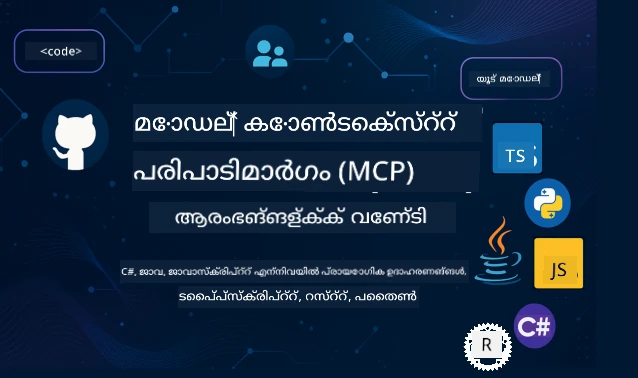

 

[](https://GitHub.com/microsoft/mcp-for-beginners/graphs/contributors)
[](https://GitHub.com/microsoft/mcp-for-beginners/issues)
[](https://GitHub.com/microsoft/mcp-for-beginners/pulls)
[](http://makeapullrequest.com)

[](https://GitHub.com/microsoft/mcp-for-beginners/watchers)
[](https://GitHub.com/microsoft/mcp-for-beginners/fork)
[](https://GitHub.com/microsoft/mcp-for-beginners/stargazers)


[](https://discord.gg/nTYy5BXMWG)

ഈ റിസോഴ്സുകൾ ഉപയോഗിച്ച് തുടങ്ങാൻ ഈ ക്രമങ്ങളുമായി തുടരുക:
1. **റിപ്പോസിറ്ററി ഫോർക്ക് ചെയ്യുക**: ക്ലിക്ക് ചെയ്യുക [](https://GitHub.com/microsoft/mcp-for-beginners/fork)
2. **റിപ്പോസിറ്ററി ക്ലോൺ ചെയ്യുക**:   `git clone https://github.com/microsoft/mcp-for-beginners.git`
3. **ചേരുക** [](https://discord.gg/nTYy5BXMWG)


### 🌐 ബഹുസ്വര പിന്തുണ

#### GitHub പ്രവർത്തനത്തിലൂടെ പിന്തുണ (സ്വയംക്രമീകരിതവും എപ്പോഴും അപ്‌ഡേറ്റായും)

<!-- CO-OP TRANSLATOR LANGUAGES TABLE START -->
[Arabic](../ar/README.md) | [Bengali](../bn/README.md) | [Bulgarian](../bg/README.md) | [Burmese (Myanmar)](../my/README.md) | [Chinese (Simplified)](../zh-CN/README.md) | [Chinese (Traditional, Hong Kong)](../zh-HK/README.md) | [Chinese (Traditional, Macau)](../zh-MO/README.md) | [Chinese (Traditional, Taiwan)](../zh-TW/README.md) | [Croatian](../hr/README.md) | [Czech](../cs/README.md) | [Danish](../da/README.md) | [Dutch](../nl/README.md) | [Estonian](../et/README.md) | [Finnish](../fi/README.md) | [French](../fr/README.md) | [German](../de/README.md) | [Greek](../el/README.md) | [Hebrew](../he/README.md) | [Hindi](../hi/README.md) | [Hungarian](../hu/README.md) | [Indonesian](../id/README.md) | [Italian](../it/README.md) | [Japanese](../ja/README.md) | [Kannada](../kn/README.md) | [Korean](../ko/README.md) | [Lithuanian](../lt/README.md) | [Malay](../ms/README.md) | [Malayalam](./README.md) | [Marathi](../mr/README.md) | [Nepali](../ne/README.md) | [Nigerian Pidgin](../pcm/README.md) | [Norwegian](../no/README.md) | [Persian (Farsi)](../fa/README.md) | [Polish](../pl/README.md) | [Portuguese (Brazil)](../pt-BR/README.md) | [Portuguese (Portugal)](../pt-PT/README.md) | [Punjabi (Gurmukhi)](../pa/README.md) | [Romanian](../ro/README.md) | [Russian](../ru/README.md) | [Serbian (Cyrillic)](../sr/README.md) | [Slovak](../sk/README.md) | [Slovenian](../sl/README.md) | [Spanish](../es/README.md) | [Swahili](../sw/README.md) | [Swedish](../sv/README.md) | [Tagalog (Filipino)](../tl/README.md) | [Tamil](../ta/README.md) | [Telugu](../te/README.md) | [Thai](../th/README.md) | [Turkish](../tr/README.md) | [Ukrainian](../uk/README.md) | [Urdu](../ur/README.md) | [Vietnamese](../vi/README.md)

> **പ്രാദേശികമായി ക്ലോൺ ചെയ്യാനാഗ്രഹിക്കുകയാണോ?**
>
> ഈ റിപോസിറ്ററിയിൽ 50-ത്തിലധികം ഭാഷാ തർജ്ജമകൾ ഉൾക്കൊള്ളുന്നു, ഇത് ഡൗൺലോഡ് വലുപ്പം ഗണ്യമായി വർദ്ധിപ്പിക്കും. തർജ്ജമകൾ കൂടാതെ ക്ലോൺ ചെയ്യാൻ sparse checkout ഉപയോഗിക്കുക:
>
> **Bash / macOS / Linux:**
> ```bash
> git clone --filter=blob:none --sparse https://github.com/microsoft/mcp-for-beginners.git
> cd mcp-for-beginners
> git sparse-checkout set --no-cone '/*' '!translations' '!translated_images'
> ```
>
> **CMD (Windows):**
> ```cmd
> git clone --filter=blob:none --sparse https://github.com/microsoft/mcp-for-beginners.git
> cd mcp-for-beginners
> git sparse-checkout set --no-cone "/*" "!translations" "!translated_images"
> ```
>
> ഇത് നിങ്ങൾക്കു കോഴ്‌സ് പൂർത്തിയാക്കാൻ ആവശ്യമായ എല്ലാം വേഗത്തിൽ ഡൗൺലോഡ് ചെയ്യാൻ സഹായിക്കും.
<!-- CO-OP TRANSLATOR LANGUAGES TABLE END -->

# 🚀 മോഡൽ കോൺടെക്സ്റ്റ് പ്രോട്ടോക്കോൾ (MCP) ആരംഭക്കാർക്കുള്ള പാഠ്യപദ്ധതി

## **C#, Java, JavaScript, Rust, Python, TypeScript എന്നിവയിൽ കൈയേറ്റ കോഡ് ഉദാഹരണങ്ങളോടെ MCP പഠിക്കുക**

## 🧠 മോഡൽ കോൺടെക്സ്റ്റ് പ്രോട്ടോക്കോൾ പാഠ്യപദ്ധതിയുടെ അവലോകനം
മോഡൽ കോൺടെക്സ്റ്റ് പ്രോട്ടോക്കോൾ എന്ന നിങ്ങളുടെ യാത്രയിൽ സ്വാഗതം! എഐ പ്രവർത്തനങ്ങൾ എങ്ങനെ വ്യത്യസ്ത ഉപകരണങ്ങൾക്കും സേവനങ്ങൾക്കും ബന്ധപ്പെടുന്നു എന്ന് നിങ്ങൾ ഒരിക്കല്‍ പോലും ആലോചിച്ചിട്ടുണ്ടെങ്കിൽ, ഇപ്പോൾ വികസകർക്കുഎങ്ങനെ ബുദ്ധിമുട്ടുള്ള സംവിധാനങ്ങൾ നിർമ്മിക്കുന്നതിൽ MCP എങ്ങനെ വിപ്ലവം സൃഷ്ടിക്കുന്നുവെന്ന് അറിയാനുള്ള അവസരം നിങ്ങൾക്കുണ്ട്.

MCPയെ ഒരു സാര്‍വത്രിക പരിവർത്തകമായി കണ്ടു നോക്കുക — USB പോർട്ടുകൾ നിങ്ങൾക്ക് ഏതൊരു ഉപകരണവും കമ്പ്യൂട്ടറിലേക്കും ബന്ധിപ്പിക്കാൻ അനുവദിക്കുന്നതുപോലെ, MCP AI മോഡലുകൾ ഏതൊരു ഉപകരണമോ സേവനമോ മാനദണ്ഡമനുസരിച്ച് ബന്ധിപ്പിക്കാൻ അനുവദിക്കുന്നു. നിങ്ങൾ ആദ്യ ചാറ്റ്‌ബോട്ട് നിർമ്മിക്കുകയാണോ, 아니면 സങ്കീർണ്ണ AI വർക്ക്ഫ്ലോകളിൽ ജോലി ചെയ്യുകയാണോ, MCP മനസ്സിലാക്കുന്നത് നിങ്ങൾക്ക് കൂടുതൽ ശാക്ത്യമായും വലുതും വരുത്തുന്ന ആപ്ലിക്കേഷനുകൾ സൃഷ്ടിക്കാൻ സഹായിക്കും.

ഈ പാഠ്യപദ്ധതി നിങ്ങളുടെ പഠനയാത്രയ്ക്ക് സഹനത്തോടെ രൂപകൽപ്പന ചെയ്തിട്ടുള്ളതാണ്. നിങ്ങൾക്ക് മെച്ചമായി അറിയാവുന്ന ലളിത ആശയങ്ങളിൽനിന്ന് ആരംഭിച്ച്, നിങ്ങളുടെ ഇഷ്ടപ്പെട്ട പ്രോഗ്രാമിംഗ് ഭാഷയിൽ കൈയേറ്റ പ്രായോഗികപരിശീലനങ്ങളിലൂടെ ধീർജ്യം കൊണ്ട് കഴിവുകൾ വികസിപ്പിക്കാം. ഓരോ പടിയിലും വസ്‌തുത്വ വിശദീകരണങ്ങളും പ്രായോഗിക ഉദാഹരണങ്ങളും പ്രോത്സാഹനവും ഉൾക്കൊള്ളിച്ചിരിക്കുന്നു.

ഈ യാത്ര പൂർത്തിയാക്കിയപ്പോള്‍, നിങ്ങൾക്ക് താങ്കളുടെ സ്വന്തം MCP സെർവറുകൾ നിർമ്മിക്കാൻ, പ്രചാരത്തിലുള്ള AI പ്ലാറ്റ്ഫോമുകളുമായി സംയോജിപ്പിക്കാൻ, ഈ സാങ്കേതികവിദ്യ എങ്ങനെ AI വികസനത്തിന്റെ ഭാവി പരിഷ്‌ക്കരിക്കുകയാണ് എന്ന് മനസ്സിലാക്കാൻ ആത്മവിശ്വാസം ഉണ്ടാകും. ഈ രസകരമായ സാഹസം ഒരുമിച്ച് തുടങ്ങാം!

### ഔദ്യോഗിക ഡോക്യുമെന്റേഷൻ ഒപ്പം പ്രത്യേകതകൾ

ഈ പാഠ്യപദ്ധതി **MCP Specification 2025-11-25** (ഏറ്റവും പുതിയ സ്ഥിരം പതിപ്പ്) ലോടനുസൃതമാണു്. MCP സ്പെസിഫിക്കേഷൻ തീയതി അടിസ്ഥാനമാക്കി പതിപ്പുകൾ (YYYY-MM-DD ഫോർമാറ്റ്) നിയന്ത്രിക്കുന്നത് ഉറപ്പാക്കുന്നു.

ഈ വിഭവങ്ങൾ നിങ്ങളുടെ ധാരണ വർദ്ധിക്കുന്നതിനൊപ്പം വിലപ്പെട്ടവയാകും, പക്ഷേ എല്ലാം ഉടനെ വായിക്കണമെന്നും സമ്മർദ്ദം വേണ്ട. ഏറ്റവും കൂടുതൽ താൽപ്പര്യമുള്ള മേഖലകളിൽ നിന്ന് ആരംഭിക്കുക!
- 📘 [MCP ഡോക്യുമെന്റേഷൻ](https://modelcontextprotocol.io/) –ഘട്ടം ഘട്ടമായുള്ള ട്യൂട്ടോറിയലുകളും ഉപയോക്തൃ मार्गദർശകങ്ങളും ഈ സ്രോതസ്സിൽ ലഭ്യമാണ്. തുടക്കക്കാരെ മുൻനിർത്തി എഴുതപ്പെട്ട ഡോക്യുമെന്റേഷനിൽ നിങ്ങൾക്ക് എളുപ്പത്തിൽ പിന്തുടരാവുന്ന ഉദാഹരണങ്ങൾ അടങ്ങിയിട്ടുണ്ട്.
- 📜 [MCP സ്പെസിഫിക്കേഷൻ](https://modelcontextprotocol.io/specification/2025-11-25) – ഇത് നിങ്ങളുടെ സമഗ്രമായ റഫറൻസ് മാനുവലിന് തുല്യം. പഠനം നീണ്ടുപോകുമ്പോൾ, നിങ്ങൾ പ്രത്യേക വിവരങ്ങൾ അറിയാനും പുരോഗമിത സവിശേഷതകൾ അന്വേഷിക്കാനും ഇവിടെ തിരിച്ചുവരാനാകും.
- 📜 [MCP സ്പെസിഫിക്കേഷൻ പതിപ്പുകൾ](https://modelcontextprotocol.io/specification/versioning) – പ്രോട്ടോക്കോൾ പതിപ്പ് ചരിത്രം, MCP തീയതി ഫോർമാറ്റ് ഉപയോഗിച്ച് പതിപ്പുകൾ എങ്ങനെ കൈകാര്യം ചെയ്യുന്നു എന്നതു് ഇതിൽ ഉണ്ട്.
- 🧑‍💻 [MCP GitHub റിപോസിറ്ററി](https://github.com/modelcontextprotocol) – നിബന്ധനകൾ, ഉപകരണങ്ങൾ, വിവിധ പ്രോഗ്രാമിംഗ് ഭാഷകളിലുള്ള കോഡ് സാമ്പിളുകൾ ഇവിടെയാണ്. ഉപകാരപ്രദമായ ഉദാഹരണങ്ങളും ഉപയോഗിക്കാൻ തയ്യാറായ ഘടകങ്ങളും നിറഞ്ഞ ഒരു ഖസാനമാണിത്.
- 🌐 [MCP കമ്മ്യൂണിറ്റി](https://github.com/orgs/modelcontextprotocol/discussions) – MCPയെക്കുറിച്ചുള്ള ചോദ്യങ്ങൾക്കും അനുഭവങ്ങളെക്കും പങ്കുവെച്ചുകൊണ്ടുള്ള വിദ്യാർഥികളും സമർദ്ദം ഉള്ള ഡവലപ്പർമാരും ചേർന്ന് ഉള്ള സുഹൃദ് സമൂഹത്തിൽ ചേരാം.

## പഠനലക്ഷ്യങ്ങൾ

ഈ പാഠ്യപദ്ധതി പൂർത്തിയായപ്പോൾ, പുതിയ കഴിവുകളോടുള്ള ആത്മവിശ്വാസവും ഉത്സാഹവുമുണ്ടാവും. ഇതാ നിങ്ങൾ പ്രാപിക്കേണ്ടത്:

• **MCP മേധാവിത്വം മനസ്സിലാക്കുക**: മോഡൽ കോൺടെക്സ്റ്റ് പ്രോട്ടോക്കോൾ എന്താണെന്ന്, AI ആപ്ലിക്കേഷനുകൾ തമ്മിൽ എങ്ങനെ സംയോജിപ്പിക്കുന്നുവെന്ന് സുഖമായി താരതമ്യംകളും ഉദാഹരണങ്ങളും ഉപയോഗിച്ച് നിങ്ങൾ മനസ്സിലാക്കും.

• **നിങ്ങളുടെ ആദ്യ MCP സെർവർ നിർമ്മിക്കുക**: നിങ്ങളുടെ ഇഷ്ടപ്പെട്ട പ്രോഗ്രാമിംഗ് ഭാഷയിൽ ഒരു പ്രവർത്തനക്ഷമമായ MCP സെർവർ സൃഷ്ടിക്കാന്‍ തുടക്കം കുറിക്കും, ലളിതമായ ഉദാഹരണങ്ങളിൽ നിന്ന് കഴിവുകൾ മെച്ചപ്പെടുത്തും.

• **AI മോഡലുകൾ യഥാർത്ഥ ഉപകരണങ്ങളുമായി ബന്ധിപ്പിക്കുക**: AI മോഡലുകളും യഥാർത്ഥ സേവനങ്ങളും തമ്മിലുള്ള ഇടവേള പൂരിപ്പിക്കുന്ന വിധം 학습ം.

• **സുരക്ഷ ഏറ്റവും നല്ല രീതിയിൽ നടപ്പാക്കുക**: MCP നടപ്പിലാക്കലുകൾ സുരക്ഷിതമാക്കാൻ വികാരം പിടിച്ച്‌, നിങ്ങളുടെ ആപ്ലിക്കേഷനുകളെയും ഉപയോക്താക്കളെയും സംരക്ഷിക്കാൻ അനുയോജ്യമായ മാർഗ്ഗങ്ങൾ പരിചയപ്പെടുക.

• **വിശ്വാസത്തോടെ ഡിപ്പ്ലോയ് ചെയ്യുക**: വികസനത്തിൽ നിന്നു നിർമ്മാണത്തിലേക്ക് MCP പ്രോജക്ടുകൾ എങ്ങനെ മാറ്റാം എന്നുള്ള പ്രായോഗിക തന്ത്രങ്ങൾ അറിഞ്ഞുകൊള്ളുക.

• **MCP സമൂഹത്തിൽ ചേരുക**: AI ആപ്ലിക്കേഷൻ വികസന ഭാവിയെ രൂപപ്പെടുത്തുന്ന വളരുന്ന ഡവലപ്പർമാരുടെ സമൂഹത്തിൽ ഭാഗമാകുക. 

## അടിസ്ഥാന Prelude

MCP പ്രത്യേകതകളിലേക്ക് കടങ്ങുന്നതിന് മുമ്പ് ചില അടിസ്ഥാന ആശയങ്ങളിൽ നിങ്ങൾക്ക് ആശ്വാസം ഉണ്ടാക്കാം. ഈ മേഖലകളിൽ നിവേദനം എങ്കിലും അവധി വേണ്ട - നാം ഉചിതമായ മുഴുവൻ വിശദീകരണവുമായി സഹായിക്കാം!

### പ്രോട്ടോകോളുകൾ (അടിസ്ഥാനം) മനസ്സിലാക്കുക

ദ്വയസംവാദത്തിന്റെ നിയമങ്ങൾ പോലെ പ്രോട്ടോക്കോൾ കരുതുക. ഒരു സുഹൃത്തിനെ വിളിക്കുമ്പോൾ നിങ്ങളുടെ രണ്ടു പേർക്കും "ഹലോ" എന്ന് പറയണം, മറുവശത്ത് സംസാരിക്കാൻ തിരുവശം വേണം, അവസാനം "വിട" പറയണം. കമ്പ്യൂട്ടർ പ്രോഗ്രാമുകൾക്കും സമാന നിയമങ്ങൾ communication-ന് ആവശ്യമാണ്.

MCP ഒരു പ്രോട്ടോക്കോൾ ആണ് - AI മോഡലുകളും ആപ്ലിക്കേഷനുകളും ഉപകരണങ്ങളുമായി ഉൽപാദകമായ "സംവാദം" നടത്താൻ പരസ്പരം അംഗീകരിച്ച നിയമങ്ങൾ. മനുഷ്യ സംവാദ മാർഗ നിർദ്ദേശങ്ങൾക്കുള്ള സമാനമായി, MCP AI ആപ്ലിക്കേഷൻ ആശയവിനിമയം കാര്യക്ഷമവും ശക്തവുമാക്കുന്നു.

### 客户端-服务器 সম্পর্কങ്ങൾ (പ്രോഗ്രാമുകൾ തമ്മിൽ പ്രവർത്തിക്കുന്ന വിധം)

നിങ്ങൾ ഇതിനകം Client-server ബന്ധത്തിലൂടെ ദിവസേന പ്രവർത്തിക്കുന്നു! വെബ് ബ്രൗസർ (client) വഴി ഒരു വെബ്‌സൈറ്റ് സന്ദർശിക്കുമ്പോൾ, വെബ് സെർവർ നിങ്ങൾക്ക് പേജ് ഉള്ളടക്കം നൽകുന്നു. ബ്രൗസർ വിവരങ്ങൾ ചോദിക്കാനും സെർവർ മറുപടി നൽകാനും അറിയുന്നു.

MCPയിൽ, ആകാരണമാണ്: AI മോഡലുകൾ client ആയി പ്രവർത്തിച്ച് വിവരങ്ങൾ/പ്രവർത്തനങ്ങൾ അഭ്യർത്ഥിക്കുന്നു, MCP സെർവറുകൾ ഈ കഴിവുകൾ നൽകുന്നു. AIക്ക് വഹിക്കാനുള്ള സഹായി പോലെ (server) ഇവ പ്രവർത്തിക്കുന്നു.

### സ്റ്റാൻഡർഡൈസേഷൻ എന്തുകൊണ്ടാണ് പ്രധാന്യം? (വസ്തുക്കൾ ഒന്നിച്ച് പ്രവർത്തിക്കേണ്ടത്)

ഒരു കാറിനും മറ്റൊന്നും വ്യത്യസ്ത ആകൃതിയിലുള്ള പെട്രോൾ പമ്പ് ഉപയോഗിച്ചിരുന്നെങ്കിൽ, ഓരോ കാറിനും വ്യത്യസ്ത അഡാപ്റ്റർ വേണം! സ്റ്റാൻഡർഡൈസേഷൻ സാധനങ്ങൾ പ്രയാസമില്ലാതെ പ്രവർത്തിക്കുന്നതിനായി പൊതുസമരസത്വം ഉറപ്പാക്കുന്നു.

MCP AI ആപ്ലിക്കേഷനുകളുടെ സ്റ്റാൻഡർഡൈസേഷൻ നൽകുന്നു. ഓരോ AI മോഡലിനും വ്യത്യസ്ത ഉപകരണം പ്രവർത്തിപ്പിക്കാൻ പ്രത്യേക കോഡ് വേണമെന്നില്ല, MCP അവക്ക് പരസ്പരം ബന്ധപ്പെടാനുള്ള സർവസാധാരണ മാർഗം സൃഷ്ടിക്കുന്നു. ഇത് വികസകർക്ക് ഒരിക്കൽ ഉപകരണം നിർമ്മിച്ച് ഒരിക്കൽ ആയിരം വ്യത്യസ്ത AI സംവിധാനങ്ങൾക്കൊപ്പം പ്രവർത്തിക്കാനുള്ള കഴിവ് നൽകുന്നു.

## 🧭 നിങ്ങളുടെ പഠനപഥത്തിന്റെ അവലോകനം

നിങ്ങളുടെ MCP യാത്ര ആത്മവിശ്വാസം വർദ്ധിപ്പിച്ച് നൈപുണ്യങ്ങൾ കൃത്യമായി വളർത്തുന്നതിനു പരിച്ഛേദമായ ഘടനയിൽ രൂപകൽപ്പന ചെയ്തിരിക്കുന്നു. ഓരോഘട്ടവും പുതിയ കാഴ്ചപ്പാടുകളും മുൻപേ പഠിച്ചതിന്റെ ശക്തികളും നൽകുന്നു.

### 🌱 അടിസ്ഥാന ഘട്ടം: അടിസ്ഥാനങ്ങള്‍ മനസ്സിലാക്കല്‍ (മൊഡ്യൂളുകൾ 0-2)

ഇവിടെ നിങ്ങളുടെ സാഹസം ആരംഭിക്കുന്നു! MCP ആശയങ്ങളെ പരിചിതമായ താരതമ്യങ്ങളും ലളിതമായ ഉദാഹരണങ്ങളും ഉപയോഗിച്ച് അവതരിപ്പിക്കും. MCP എന്താണെന്നും അത് എന്തുകൊണ്ട് ആവശ്യമാണ് എന്നും എങ്ങനെ AI വികസന ലോകത്ത് സ്ഥാനം പിടിച്ചുവെന്ന് മനസ്സിലാകും.

• **മൊഡ്യൂൾ 0 - MCPക്ക് പരിചയം**: MCP എന്തെന്ന് വിശദമായി അന്വേഷിച്ച്, ആധുനಿಕ AI ആപ്ലിക്കേഷനുകളിൽ MCP എങ്ങനെ പ്രയോജനപ്പെടുന്നു എന്ന് കാണിക്കും. വികസകർ നേരിടുന്ന സാധാരണ പ്രശ്നങ്ങൾ MCP എങ്ങനെ പരിഹരിക്കുന്നു എന്നതു് കാണിക്കപ്പെടും.

• **മൊഡ്യൂൾ 1 - പ്രധാന ആശയങ്ങൾ വിശദീകരണം**: MCPയുടെ അന്തസ്സ് അറിയാൻ അനേകം താരതമ്യങ്ങളും ദൃശ്യരൂപങ്ങളുമടക്കം ഉപയോഗിച്ച് അടിസ്ഥാന ഘടകങ്ങൾ പഠിക്കും.

• **മൊഡ്യൂൾ 2 - MCP-യിലെ സുരക്ഷ**: സുരക്ഷ ഭীতি പര қиынമായി തോന്നാം, പക്ഷേ MCPയിലെ പുറപ്പെടുന്ന സുരക്ഷാ സവിശേഷതകളും മികച്ച നടപ്പാക്കലും വിശദീകരിക്കും.

### 🔨 നിർമ്മാണ ഘട്ടം: നിങ്ങളുടെ ആദ്യ നടപ്പാക്കലുകൾ (മൊഡ്യൂൾ 3)

ഇப்போது സത്യമായ രസം തുടങ്ങുന്നു! യഥാർത്ഥ MCP സെർവർമാരും ക്ലയന്റുകളുമുണ്ടാക്കുന്നതിൽ കൈപറ്റാനുദ്ദേശിക്കുന്ന മാർഗം. ചിന്തിക്കേണ്ട കാര്യമില്ല - ലളിതമായി ആരംഭിച്ച് ഓരോ പടിയിലും നാം നേതൃത്വം നൽകും.
ഈ മോഡ്യൂളിൽ നിങ്ങൾ തിരഞ്ഞെടുക്കുന്ന പ്രോഗ്രാമിംഗ് ഭാഷയിൽ പ്രായോഗികമായി അഭ്യാസം നടത്താൻ അനുവദിക്കുന്ന നിരവധി ഹാൻഡ്-ഓൺ ഗൈഡുകളാണ് ഉൾക്കൊള്ളിച്ചിരിക്കുന്നത്. നിങ്ങളുടെ ആദ്യ സർവർ നിർമ്മിച്ച്, അതുമായി കണക്ട് ചെയ്യാനുള്ള ക്ലയന്റ് ഉണ്ടാക്കി, VS കോഡ് പോലുള്ള പ്രശസ്ത വികസന ഉപകരണങ്ങളുമായി ഇന്റഗ്രേഷൻ നടത്തും.

ഓരോ ഗൈഡിലും പൂർത്തിയായ കോഡ് ഉദാഹരണങ്ങൾ, സംശയപരിഹാര നിർദ്ദേശങ്ങൾ, നിർദ്ദിഷ്ട ഡിസൈൻ തിരഞ്ഞെടുപ്പുകൾ എന്തുകൊണ്ട് നടത്തിയതാണെന്നുള്ള വിശദീകരണങ്ങൾ ഉൾക്കൊള്ളിച്ചിരിക്കുന്നു. ഈ തലത്തിന്റ അവസാനത്തോടെ, നിങ്ങൾക്ക് അഭിമാനിക്കാവുന്ന പ്രവർത്തനക്ഷമമായ MCP ഇംപ്ലിമെൻറേഷനുകൾ ഉണ്ടാകും!

### 🚀 വളരുന്ന ഘട്ടം: ഉയർന്നിരിയ്ക്കുന്ന ആശയങ്ങളും യാഥാർത്ഥ്യ പ്രയോഗവും (മോഡ്യൂളുകൾ 4-5)

അടിസ്ഥാനങ്ങൾ കൈവശം വച്ചതിനുവേണ്ടി, നിങ്ങൾ കൂടുതൽ സങ്കീർണ്ണമായ MCP സവിശേഷതകൾ പരിശോധിക്കാനായി തയ്യാറായി. പ്രായോഗിക ഇംപ്ലിമെൻറേഷൻ തന്ത്രങ്ങൾ, ഡീബഗ്ഗിങ് സാങ്കേതിക വിദ്യകൾ, മൾട്ടി-മോഡൽ AI ഇന്റഗ്രേഷൻ പോലുള്ള ഉയർന്ന തലവിഷയങ്ങൾ ഉൾപ്പെടുന്നതിനെക്കുറിച്ച് നമ്മൾ ആശയവിനിമയം നടത്തും.

നിങ്ങൾക്ക് MCP ഇംപ്ലിമെൻറേഷനുകൾ പ്രൊഡക്ഷനായി സ്കെയിൽ ചെയ്യാനും ഏഴ്യൂർ പോലുള്ള ക്ലൗഡ് പ്ലാറ്റ്ഫോമുകളുമായി ഇന്റഗ്രേറ്റ് ചെയ്യാനും പഠിക്കാം. ഈ മോഡ്യൂളുകൾ യഥാർത്ഥ ലോക ആവശ്യങ്ങൾ കൈകാര്യം ചെയ്യാനുള്ള MCP സൊല്യൂഷനുകൾ നിർമ്മിക്കാൻ നിങ്ങളെ പിന്തുണയ്ക്കും.

### 🌟 കൃത്യതാ ഘട്ടം: സമൂഹവും പ്രത്യേകതകളും (മോഡ്യൂളുകൾ 6-11)

അവസാന ഘട്ടം MCP സമൂഹത്തിൽ ചേർന്ന് നിങ്ങൾക്ക് ഏറ്റവും ഇഷ്ടപ്പെട്ട മേഖലകളിൽ വൈദഗ്ധ്യം നേടുന്നതിൽ കേന്ദ്രീകരിക്കുന്നു. തുറന്ന സ്രോതസ് MCP പ്രോജക്ടുകളിൽ എങ്ങനെ സംഭാവന നൽകാമെന്നു പഠിക്കാനായി, ഉയർന്ന തലത്തിലെ സ്ഥിരീകരണ സാമ്പത്തിക മാതൃകകൾ നടപ്പിലാക്കുകയും സമഗ്ര ഡാറ്റാബേസ് ഇന്റഗ്രേറ്റഡ് സൊല്യൂഷനുകൾ നിർമ്മിക്കുകയും ചെയ്യുക.

മോഡ്യൂλ 11 പ്രത്യേക പരാമർശത്തിന് അർഹമാണ് - അത് 13 ലാബുകളുടെ ഹാൻഡ്-ഓൺ പഠന പാതയാണ്, പോസ്റ്റ്‌ഗ്രെഎസ്‌ക്യു‌എൽ ഇന്റഗ്രേഷനോടെ പ്രൊഡക്ഷൻ-റെഡിയായ MCP സർവറുകൾ നിർമ്മിക്കാൻ പഠിപ്പിക്കുന്നതാണ്. ഇത് നിങ്ങൾ പഠിച്ചതെല്ലാം ഒരുമിപ്പിക്കുന്ന ഒരു കാപ്‌സ്റ്റോൺ പ്രോജക്ട് പോലെയാണ്!

### 📚 സമ്പൂർണ്ണ പാഠ്യവിഷയം ഘടന

| മൊഡ്യൂൾ | വിഷയം | വിവരണം | ലിങ്ക് |
|--------|-------|-------------|------|
| **മോഡ്യൂൾ 0-3: അടിസ്ഥാനങ്ങൾ** | | | |
| 00 | MCP പരിചയം | മോഡൽ_Context_ പ്രോട്ടോക്കോളിന്റെ അവലോകനം, AI പൈപ്പ്ലൈനുകളിലെ അതിന്റെ പ്രാധാന്യം | [Read more](./00-Introduction/README.md) |
| 01 | കോർ ആശയങ്ങൾ വിശദീകരിക്കുന്നു | MCP കോർ ആശയങ്ങളുടെ ആഴമായ അന്വേഷണം | [Read more](./01-CoreConcepts/README.md) |
| 02 | MCP-യിൽ സുരക്ഷ | സുരക്ഷാ ഭീഷണികളും ഏറ്റവും മികച്ച പ്രാക്ടീസുകളും | [Read more](./02-Security/README.md) |
| 03 | MCP ആരംഭിക്കുന്നത് | പരിസര ക്രമീകരണം, അടിസ്ഥാന സർവറുകളും ക്ലയന്റുകളും, ഇന്റഗ്രേഷൻ | [Read more](./03-GettingStarted/README.md) |
| **മോഡ്യൂൾ 3: നിങ്ങളുടെ ആദ്യ സർവർ & ക്ലയന്റ് നിർമ്മാണം** | | | |
| 3.1 | ആദ്യ സർവർ | നിങ്ങളുടെ ആദ്യ MCP സർവർ സൃഷ്ടിക്കുക | [Guide](./03-GettingStarted/01-first-server/README.md) |
| 3.2 | ആദ്യ ക്ലയന്റ് | ഒരു അടിസ്ഥാന MCP ക്ലയന്റ് വികസിപ്പിക്കുക | [Guide](./03-GettingStarted/02-client/README.md) |
| 3.3 | LLM ഉള്ള ക്ലയന്റ് | വലുതായ ഭാഷാ മോഡലുകൾ ഇന്റഗ്രേറ്റ് ചെയ്യുക | [Guide](./03-GettingStarted/03-llm-client/README.md) |
| 3.4 | VS കോഡ് ഇന്റഗ്രേഷൻ | MCP സർവർങ്ങൾ VS കോഡിൽ ഉപയോഗിക്കുക | [Guide](./03-GettingStarted/04-vscode/README.md) |
| 3.5 | stdio സർവർ | stdio ട്രാൻസ്പോർട്ട് ഉപയോഗിച്ച് സർവർ നിർമ്മിക്കുക | [Guide](./03-GettingStarted/05-stdio-server/README.md) |
| 3.6 | HTTP സ്ട്രീമിംഗ് | MCP-യിലേക്ക് HTTP സ്ട്രീമിംഗ് നടപ്പാക്കുക | [Guide](./03-GettingStarted/06-http-streaming/README.md) |
| 3.7 | AI ടൂൾകിറ്റ് | MCP-യുമായി AI ടൂൾകിറ്റ് ഉപയോഗിക്കുക | [Guide](./03-GettingStarted/07-aitk/README.md) |
| 3.8 | ടെസ്റ്റിംഗ് | നിങ്ങളുടെ MCP സർവർ ഇംപ്ലിമെൻറേഷൻ ടെസ്റ്റ് ചെയ്യുക | [Guide](./03-GettingStarted/08-testing/README.md) |
| 3.9 | വിന്യാസം | MCP സർവർ പ്രൊഡക്ഷനിലേക്ക് വിന്യസിക്കുക | [Guide](./03-GettingStarted/09-deployment/README.md) |
| 3.10 | ഉയർന്ന തലത്തിലുള്ള സർവർ ഉപയോഗം | ഉയർന്ന സവിശേഷതകൾക്കും മെച്ചപ്പെട്ട നിർമ്മാണത്തിനും വെച്ച്/server ഉപയോഗിക്കുക | [Guide](./03-GettingStarted/10-advanced/README.md) |
| 3.11 | ലളിതമായ പാസ്‌വേഡ് | പ്രാരംഭം മുതൽ പാസ്‌വേഡും RBAC-നും കാണിക്കുന്ന അഭ്യാസം | [Guide](./03-GettingStarted/11-simple-auth/README.md) |
| 3.12 | MCP ഹോസ്റ്റുകൾ | ക്ലോഡ് ഡെസ്ക്ടോപ്പ്, കർസർ, ക്ലൈൻ, മറ്റു MCP ഹോസ്റ്റുകൾ ക്രമീകരിക്കുക | [Guide](./03-GettingStarted/12-mcp-hosts/README.md) |
| 3.13 | MCP ഇൻസ്പെക്ടർ | ഇൻസ്പെക്ടർ ഉപകരണം ഉപയോഗിച്ച് MCP സർവർ ഡീബഗ്, ടെസ്റ്റ് ചെയ്യുക | [Guide](./03-GettingStarted/13-mcp-inspector/README.md) |
| **മോഡ്യൂൾ 4-5: പ്രായോഗികവും ഉയര്‍ന്നതുമായ ആശയങ്ങൾ** | | | |
| 04 | പ്രായോഗിക ഇംപ്ലിമെൻറേഷൻ | SDKകൾ, ഡീബഗ്ഗിങ്, ടെസ്റ്റിംഗ്, പുനരുപയോഗം ചെയ്യാവുന്ന പ്രോംപ്റ്റ് ടെംപ്ലേറ്റുകൾ | [Read more](./04-PracticalImplementation/README.md) |
| 4.1 | പേജിനേഷൻ | കറസർ അടിസ്ഥാനത്തിലുള്ള വലിയ ഫലസെറ്റുകൾ കൈകാര്യം ചെയ്യുക | [Guide](./04-PracticalImplementation/pagination/README.md) |
| 05 | MCP ൽ ഉയർന്ന തല വിഷയങ്ങൾ | മൾട്ടി-മോഡൽ AI, സ്കെയ്ലിംഗ്, എന്റർപ്രൈസ് ഉപയോഗം | [Read more](./05-AdvancedTopics/README.md) |
| 5.1 | ഏഴ്യൂർ ഇന്റഗ്രേഷൻ | MCP-ന്റെ ഏഴ്യൂർ ഇന്റഗ്രേഷൻ | [Guide](./05-AdvancedTopics/mcp-integration/README.md) |
| 5.2 | മൾട്ടി-മോഡാലിറ്റി | പല മോഡാലിറ്റികളുമായുള്ള പ്രവർത്തനം | [Guide](./05-AdvancedTopics/mcp-multi-modality/README.md) |
| 5.3 | OAuth2 ഡെമോ | OAuth2 അംഗീകാരം നടപ്പാക്കുക | [Guide](./05-AdvancedTopics/mcp-oauth2-demo/README.md) |
| 5.4 | റൂട്ട് കണ്ടെക്സ്റ്റുകൾ | റൂട്ട് കണ്ടെക്സ്റ്റുകൾ മനസ്സിലാക്കി നടപ്പാക്കുക | [Guide](./05-AdvancedTopics/mcp-root-contexts/README.md) |
| 5.5 | റൂട്ടിംഗ് | MCP റൂട്ടിംഗ് തന്ത്രങ്ങൾ | [Guide](./05-AdvancedTopics/mcp-routing/README.md) |
| 5.6 | സാമ്പ്ലിംഗ് | MCP-യിലെ സാമ്പ്ലിംഗ് സാങ്കേതികവിദ്യകൾ | [Guide](./05-AdvancedTopics/mcp-sampling/README.md) |
| 5.7 | സ്കെയ്ലിംഗ് | MCP ഇംപ്ലിമെൻറേഷനുകൾ സ്കെയിൽ ചെയ്യുക | [Guide](./05-AdvancedTopics/mcp-scaling/README.md) |
| 5.8 | സുരക്ഷ | ഉയർന്ന തല സുരക്ഷാ പരിഗണനകൾ | [Guide](./05-AdvancedTopics/mcp-security/README.md) |
| 5.9 | വെബ് സെർച്ചി | വെബ് സെർച്ചി കഴിവുകൾ നടപ്പാക്കുക | [Guide](./05-AdvancedTopics/web-search-mcp/README.md) |
| 5.10 | റിയൽടൈം സ്ട്രീമിംഗ് | റിയൽടൈം സ്ട്രീമിംഗ് ഫംഗ്ഷണാലിറ്റി നിർമ്മിക്കുക | [Guide](./05-AdvancedTopics/mcp-realtimestreaming/README.md) |
| 5.11 | റിയൽടൈം സെർച്ചി | റിയൽടൈം സെർച്ചി നടപ്പാക്കുക | [Guide](./05-AdvancedTopics/mcp-realtimesearch/README.md) |
| 5.12 | എൻട്ര ID അംഗീകാരമുള്ളത് | മൈക്രോസോഫ്റ്റ് എൻട്ര ID ഉപയോഗിച്ച് അംഗീകാരം | [Guide](./05-AdvancedTopics/mcp-security-entra/README.md) |
| 5.13 | ഫൗണ്ട്രി ഇന്റഗ്രേഷൻ | ഏഴ്യൂർ AI ഫൗണ്ട്രിയുമായി ഇന്റഗ്രേറ്റ് ചെയ്യുക | [Guide](./05-AdvancedTopics/mcp-foundry-agent-integration/README.md) |
| 5.14 | കണ്ടെക്സ്റ്റ് എൻജിനീയറിംഗ് | ഫലപ്രദമായ കണ്ടെക്സ്റ്റ് എൻജിനീയറിങ്ങിനുള്ള സാങ്കേതിക വിദ്യകൾ | [Guide](./05-AdvancedTopics/mcp-contextengineering/README.md) |
| 5.15 | MCP കസ്റ്റം ട്രാൻസ്പോർട്ട് | കസ്റ്റം ട്രാൻസ്പോർട്ട് ഇംപ്ലിമെൻറേഷനുകൾ | [Guide](./05-AdvancedTopics/mcp-transport/README.md) |
| 5.16 | പ്രോട്ടോക്കോൾ സവിശേഷതകൾ | പുരോഗതി അറിയിപ്പുകൾ, റദ്ദാക്കൽ, റിസോഴ്‌സ് ടെംപ്ലേറ്റുകൾ | [Guide](./05-AdvancedTopics/mcp-protocol-features/README.md) |
| **മോഡ്യൂൾ 6-10: സമൂഹവും മികച്ച പ്രാക്ടീസുകളും** | | | |
| 06 | സമൂഹ സംഭാവനകൾ | MCP പരിസ്ഥിതിയിലേക്ക് എങ്ങനെ സംഭാവനകൾ നടത്താം | [Guide](./06-CommunityContributions/README.md) |
| 07 | ആദ്യ സ്വീകരണത്തിലൂടെ ഉൾക്കാഴ്ചകൾ | യാഥാർത്ഥ്യാനുഭവ കഥകൾ | [Guide](./07-LessonsfromEarlyAdoption/README.md) |
| 08 | MCP-ന്റെ മികച്ച പ്രാക്ടീസുകൾ | പ്രകടനം, ദോഷ പ്രതിരോധം, ശേഷിപ്പു | [Guide](./08-BestPractices/README.md) |
| 09 | MCP കേസ് പഠനങ്ങൾ | പ്രായോഗിക ഇംപ്ലിമെൻറേഷൻ ഉദാഹരണങ്ങൾ | [Guide](./09-CaseStudy/README.md) |
| 10 | ഹാൻഡ്-ഓൺ സർക്കാർ ശിൽപശാല | AI ടൂൾകിട്ടുമായി MCP സർവർ നിർമ്മാണം | [Lab](./10-StreamliningAIWorkflowsBuildingAnMCPServerWithAIToolkit/README.md) |
| **മോഡ്യൂൾ 11: MCP സെർവർ ഹാൻഡ്-ഓൺ ലാബ്** | | | |
| 11 | MCP സെർവർ ഡാറ്റാബേസ് ഇന്റഗ്രേഷൻ | പോസ്റ്റ്‌ഗ്രെഎസ്‌ക്യു‌എൽ ഇന്റഗ്രേഷനോടുകൂടിയ സമഗ്ര 13-ലാബ് ഹാൻഡ്-ഓൺ പഠന പാത | [Labs](./11-MCPServerHandsOnLabs/README.md) |
| 11.1 | പരിചയം | ഡാറ്റാബേസ് ഇന്റഗ്രേഷൻ ഉള്ള MCP അവലോകനം, റീട്ടെയിൽ അനലിറ്റിക്സ് ഉപയോഗ കേസ് | [Lab 00](./11-MCPServerHandsOnLabs/00-Introduction/README.md) |
| 11.2 | കോർ ആർക്കിടെക്ചർ | MCP സർവർ ആർക്കിടെക്ചർ, ഡാറ്റാബേസ് ലെയറുകൾ, സുരക്ഷ മാതൃകകൾ മനസ്സിലാക്കൽ | [Lab 01](./11-MCPServerHandsOnLabs/01-Architecture/README.md) |
| 11.3 | സുരക്ഷ & മൾട്ടി-ടെനൻസി | റേ ലെവൽ സുരക്ഷ, അംഗീകാരം, മൾട്ടി-ടെനൻറ് ഡാറ്റ ആക്‌സസ് | [Lab 02](./11-MCPServerHandsOnLabs/02-Security/README.md) |
| 11.4 | പരിസര ക്രമീകരണം | വികസന പരിസരം, ഡോക്കർ, ഏഴ്യൂർ വിഭവങ്ങൾ ക്രമീകരിക്കൽ | [Lab 03](./11-MCPServerHandsOnLabs/03-Setup/README.md) |
| 11.5 | ഡാറ്റാബേസ് ഡിസൈൻ | പോസ്റ്റ്‌ഗ്രെഎസ്‌ക്യു‌എൽ ക്രമീകരണം, റീട്ടെയിൽ സ്കീമ ഡിസൈൻ, സാമ്പിൾ ഡാറ്റ | [Lab 04](./11-MCPServerHandsOnLabs/04-Database/README.md) |
| 11.6 | MCP സർവർ ഇംപ്ലിമെൻറേഷൻ | ഡാറ്റാബേസ് ഇന്റഗ്രേഷനോടെ ഫാസ്റ്റ് MCP സർവർ നിർമ്മാണം | [Lab 05](./11-MCPServerHandsOnLabs/05-MCP-Server/README.md) |
| 11.7 | ഉപകരണം വികസനം | ഡാറ്റാബേസ് ക്വറി ഉപകരണങ്ങൾ, സ്കീമ നിരീക്ഷണം നിർമ്മിക്കൽ | [Lab 06](./11-MCPServerHandsOnLabs/06-Tools/README.md) |
| 11.8 | സെമാന്റിക് സെർച്ചി | ഏഴ്യൂർ ഓപ്പൺ AI, പിജീവ്‌ചെക്ടർ ഉപയോഗിച്ച് വെക്ടർ എംബെഡ്ഡിങുകൾ നടപ്പാക്കൽ | [Lab 07](./11-MCPServerHandsOnLabs/07-Semantic-Search/README.md) |
| 11.9 | ടെസ്റ്റിംഗ് & ഡീബഗ്ഗിങ് | ടെസ്റ്റിംഗ് തന്ത്രങ്ങൾ, ഡീബഗ്ഗിങ് ഉപകരണങ്ങൾ, പരിശോധനാ സമീപനങ്ങൾ | [Lab 08](./11-MCPServerHandsOnLabs/08-Testing/README.md) |
| 11.10 | VS കോഡ് ഇന്റഗ്രേഷൻ | VS കോഡ് MCP ഇന്റഗ്രേഷൻ, AI ചാറ്റ് ഉപയോഗ ക്രമീകരണം | [Lab 09](./11-MCPServerHandsOnLabs/09-VS-Code/README.md) |
| 11.11 | വിന്യാസ തന്ത്രങ്ങൾ | ഡോക്കർ വിന്യാസം, ഏഴ്യൂർ കന്റെയ്‌നർ ആപ്പുകൾ, സ്കെയ്ലിംഗ് പരിഗണനകൾ | [Lab 10](./11-MCPServerHandsOnLabs/10-Deployment/README.md) |
| 11.12 | നിരീക്ഷണം | അപ്ലിക്കേഷൻ ഇൻസൈറ്റ്‌സ്, ലോഗ്, പ്രകടന നിരീക്ഷണം | [Lab 11](./11-MCPServerHandsOnLabs/11-Monitoring/README.md) |
| 11.13 | മികച്ച പ്രാക്ടീസുകൾ | പ്രകടന മെച്ചപ്പെടുത്തൽ, സുരക്ഷയുടെ ശക്തപ്പെടുത്തൽ, പ്രൊഡക്ഷൻ ടിപ്പുകൾ | [Lab 12](./11-MCPServerHandsOnLabs/12-Best-Practices/README.md) |

### 💻 സാമ്പിൾ കോഡ് പ്രോജക്റ്റുകൾ

MCP പഠനത്തിലെ ഏറ്റവും രസകരമായ ഭാഗങ്ങളിൽ ഒന്നായുള്ളത് നിങ്ങളുടെ കോഡ് കഴിവുകൾ ക്രമികമായി വികസിക്കുന്നത് കാണുക എന്നതാണ്. നാം നിർമ്മിച്ച കോഡ് ഉദാഹരണങ്ങൾ ലളിതമായി ആരംഭിച്ച് അല്ലെങ്കിൽ സങ്കീർണ്ണമായി വളരുന്ന രീതിയിൽ രൂപകൽപ്പന ചെയ്തിരിക്കുന്നു. ഈ കോഡുകൾ എന്താണെന്ന് മാത്രമല്ല, അത് ഈ വിധത്തിലുള്ള ഘടനയിൽ തീർന്നത് എന്തുകൊണ്ടുള്ളതും, വലിയ MCP ആപ്ലിക്കേഷനുകളിൽ അത് എങ്ങനെ പൊരുത്തപ്പെടുന്നുവെന്ന് നിങ്ങൾക്ക് മനസ്സിലാക്കാൻ ഈ കോഡുകൾ സഹായിക്കും.

#### അടിസ്ഥാന MCP കാൽക്കുലേറ്റർ സാമ്പിൾസ്

| ഭാഷ | വിവരണം | ലിങ്ക് |
|----------|-------------|------|
| C# | MCP സർവർ ഉദാഹരണം | [View Code](./03-GettingStarted/samples/csharp/README.md) |
| ജാവ | MCP കാൽക്കുലേറ്റർ | [View Code](./03-GettingStarted/samples/java/calculator/README.md) |
| ജാവാസ്ക്രിപ്റ്റ് | MCP ഡെമോ | [View Code](./03-GettingStarted/samples/javascript/README.md) |
| പൈഥൺ | MCP സർവർ | [View Code](../../03-GettingStarted/samples/python/mcp_calculator_server.py) |
| ടൈപ്പ്‌സ്‌ക്രിപ്റ്റ് | MCP ഉദാഹരണം | [View Code](./03-GettingStarted/samples/typescript/README.md) |
| റസ്റ്റ് | MCP ഉദാഹരണം | [View Code](./03-GettingStarted/samples/rust/README.md) |

#### ഉയർന്ന MCP ഇംപ്ലിമെൻറേഷനുകൾ

| ഭാഷ | വിവരണം | ലിങ്ക് |
|----------|-------------|------|
| C# | ഉയർന്ന തല ഉദാഹരണം | [View Code](./04-PracticalImplementation/samples/csharp/README.md) |
| സ്പ്രിംഗ് ജാവ | കൺടെയ്‌നർ ആപ്പ് ഉദാഹരണം | [View Code](./04-PracticalImplementation/samples/java/containerapp/README.md) |
| ജാവാസ്ക്രിപ്റ്റ് | ഉയർന്ന തല ഉദാഹരണം | [View Code](./04-PracticalImplementation/samples/javascript/README.md) |
| പൈഥൺ | ജടിലമായ ഇംപ്ലിമെൻറേഷൻ | [View Code](./04-PracticalImplementation/samples/python/README.md) |
| ടൈപ്പ്‌സ്‌ക്രിപ്റ്റ് | കൺടെയ്‌നർ സാമ്പിൾ | [View Code](./04-PracticalImplementation/samples/typescript/README.md) |


## 🎯 MCP പഠനത്തിനുള്ള മുൻപത്തുകൾ

ഈ പാഠപ്പദ്ധതിയിൽ നിന്ന് പരമാവധി പ്രയോജനം നേടാൻ, നിങ്ങൾക്ക് ഉണ്ടായിരിക്കേണ്ടത്:

- C#, ജാവ, ജാവാസ്ക്രിപ്റ്റ്, പൈഥൺ, ടൈപ്പ്‌സ്‌ക്രിപ്റ്റ് എന്നിവയിൽ ഏതെങ്കിലും ഒരു ഭാഷയിൽ അടിസ്ഥാന പ്രോഗ്രാമിംഗ് പരിജ്ഞാനം
- ക്ലയന്റ്-സർവർ മോഡൽ, API-കളുടെ അവബോധം
- REST, HTTP ആശയങ്ങളിൽ പരിചയം
- (ഐച്ഛികം) AI/ML ആശയങ്ങളിൽ പിന്‍ഭൂമി

- നമ്മുടെ സമൂഹ ചർച്ചകളിൽ പങ്കെടുത്ത് പിന്തുണ നേടൽ

## 📚 പഠന മാർഗ്ഗദർശി & ഉറവിടങ്ങൾ

ഈ റിപ്പോസിറ്ററിയിൽ നിങ്ങൾക്ക് സന്ധ്യനിനിധായി സഹായിക്കുന്ന നിരവധി ഉറവിടങ്ങളുണ്ട്:

### പഠന മാർഗ്ഗദർശി
ഒരു വിപുലമായ [സ്റ്റഡി ഗൈഡ്](./study_guide.md) ഈ രിപോസിറ്ററി ഫലപ്രദമായി നാവിഗേറ്റ് ചെയ്യാൻ സഹായിക്കുന്നതിനായി ലഭ്യമാണ്. ഈ ദൃശ്യ പഠനപദ്ധതി മാപ്പ് എല്ലാ വിഷയങ്ങളും എങ്ങനെ ബന്ധിപ്പിക്കപ്പെടുന്നു എന്ന് കാണിക്കുന്നു കൂടാതെ സാമ്പിൾ പ്രോജക്റ്റുകൾ ഫലപ്രദമായി ഉപയോഗിക്കുന്നതിനുള്ള മാർഗ്ഗനിർദ്ദേശവും നൽകുന്നു. നിങ്ങൾ ഉൾകാഴ്ചയുടെ മേധാവിയാണ് എങ്കിൽ ഇത് വിശേഷാൽ സഹായകാരിയാണ്, കാരണം നിങ്ങൾക്ക് വലിയ പടം കാണാൻ ഇഷ്ടമാണ്.

ഈ ഗൈഡ് ഉൾക്കൊള്ളുന്നു:
- മുഴുവൻ വിഷയങ്ങൾ ഉൾപ്പെടുത്തിയ ദൃശ്യ പഠനപദ്ധതി മാപ്പ്
- ഓരോ രിപോസിറ്ററി വിഭാഗത്തിന്റെ വിശദമായ വിശകലനം
- സാമ്പിൾ പ്രോജക്റ്റുകൾ എങ്ങനെ ഉപയോഗിക്കാമെന്ന് മാർഗ്ഗനിർദ്ദേശം
- വ്യത്യസ്ത കൌശലനിലകൾക്കായി ശുപാർശ ചെയ്യുന്ന പഠന മാർഗങ്ങൾ
- നിങ്ങളുടെ പഠന യാത്രക്ക് അനുയോജ്യമായ അധിക സ്രോതസ്സുകൾ

### മാറ്റചരിത്രം

പഠന സാമഗ്രികളുടെ എല്ലാ പ്രധാന അപ്‌ഡേറ്റുകളെ പിന്തുടരുന്നതിന് ഞങ്ങൾ ഒരു വിശദമായ [മാറ്റചരിത്രം](./changelog.md) പരിപാലിക്കുന്നു, അതിലൂടെ ഏറ്റവും പുതിയ മെച്ചപ്പെടുത്തലുകളും ചേർക്കലുകളും അറിയാം.
- പുതിയ ഉള്ളടക്ക ചേർക്കലുകൾ
- ഘടനാപരമായ മാറ്റങ്ങൾ
- സവിശേഷത മെച്ചപ്പെടുത്തലുകൾ
- ഡോക്യുമെന്റേഷൻ അപ്‌ഡേറ്റുകൾ

## 🛠️ ഈ പഠനപദ്ധതി ഫലപ്രദമായി ഉപയോഗിക്കാൻ

ഈ ഗൈഡിലെ ഓരോ പാഠവും ഉൾക്കൊള്ളുന്നു:

1. MCP ആശയങ്ങളുടെ വ്യക്തമായ വിശദീകരണങ്ങൾ  
2. ഒന്നിലധികം ഭാഷകളിലെ ലൈവ് കോഡ് ഉദാഹരണങ്ങൾ  
3. യഥാർത്ഥ MCP ആപ്ലിക്കേഷനുകൾ നിർമ്മിക്കാനുള്ള അഭ്യാസങ്ങൾ  
4. മുൻഗണനയുള്ള പഠനാർഥികൾക്കായുള്ള അധിക സ്രോതസ്സുകൾ

### C# ഉപയോഗിച്ച് MCP പഠിക്കാം - ട്യൂട്ടോറിയൽ പരമ്പര
മോഡൽ കണ്ടക്സ്റ്റ് പ്രോട്ടോക്കോൾ (MCP) എന്ന അത്യാധുനിക കൂട്ടിചേരൽ ചട്ടം പരിചയപ്പെടുത്താൻ തയ്യാറെടുക്കാം, ഇത് AI മോഡലുകളും ക്ലയന്റ് ആപ്ലിക്കേഷനുകളും തമ്മിലുള്ള ഒത്തുചേരലുകൾ സ്റ്റാൻഡറഡൈസ് ചെയ്യുന്നു. ഈ തുടക്കക്കാർക്കായുള്ള ക്ലാസിലൂടെ MCP പരിചയപ്പെടുത്തി നിങ്ങളുടെ ആദ്യ MCP സെർവർ സൃഷ്ടിക്കാൻ ഗൈഡ് ചെയ്യുന്നതാണ്.
#### C#: [https://aka.ms/letslearnmcp-csharp](https://aka.ms/letslearnmcp-csharp)
#### Java: [https://aka.ms/letslearnmcp-java](https://aka.ms/letslearnmcp-java)
#### JavaScript: [https://aka.ms/letslearnmcp-javascript](https://aka.ms/letslearnmcp-javascript)
#### Python: [https://aka.ms/letslearnmcp-python](https://aka.ms/letslearnmcp-python)

## 🎓 നിങ്ങളുടെ MCP യാത്ര ആരംഭിക്കുന്നു

അഭിനന്ദനങ്ങൾ! പ്രോഗ്രാമിംഗ് കഴിവുകൾ വർദ്ധിപ്പിക്കുകയും AI വികസനത്തിന്റെ അത്യാധുനികരംഗത്തേക്ക് നിങ്ങൾക്കെണ്ണപ്പെടുന്നതിനുള്ള ഈ തൈര്യം നിറഞ്ഞ യാത്രയുടെ ആദ്യ ചുവട് നിങ്ങൾ വെച്ചിരിക്കുന്നു.

### നിങ്ങൾ ഇതിനകം കൈവിട്ടത്

ഈ പരിചയം വായിച്ച് നിങ്ങളുടെ MCP അറിവിന്റെ അടിസ്ഥാനസാഹിത്യം നിർമ്മിക്കുന്നത് ആരംഭിച്ചിരിക്കുന്നു. MCP എന്താണ്, അത് എന്തുകൊണ്ട് പ്രധാനമാണെന്നും, ഈ പഠനപദ്ധതി നിങ്ങളുടെ പഠന യാത്ര എങ്ങനെ പിന്തുണയ്ക്കുമെന്നും നിങ്ങൾക്ക് മനസിലായി. ഇത് ഒരു വലിയ നേട്ടമാണ്, ഈ സുപ്രധാന സാങ്കേതികവിദ്യയിൽ നിങ്ങളുടെ വിദഗ്ദ്ധതയുടെ തുടക്കമാണിത്.

### മുന്നെത്തേണ്ട സാഹസിക യാത്ര

മോഡ്യൂളുകൾ മുന്നോട്ടുപോകുമ്പോൾ, ഓരോ വിദഗ്ദ്ധനും തുടക്കക്കാരനായിരുന്നു എന്നും ഓർക്കുക. ഇപ്പോൾ നിങ്ങൾക്കു സങ്കീർണമായി തോന്നാവുന്ന ആശയങ്ങൾ അഭ്യാസം നടപ്പാക്കുകയും ഉപയോഗപ്പെടുത്തുകയും ചെയ്തല്ലാതെ നിശ്ചിതമായി സ്വാഭാവികമാകും. ഓരോ ചെറു പടിയിലൂടെ ശക്തമായ കഴിവുകൾ നിർമ്മിക്കപ്പെടുകയും അതു നിങ്ങളുടെ വികസന കരിയറിനിടയിൽ സഹായകമാവുകയും ചെയ്യും.

### നിങ്ങളുടെ പിന്തുണാ ശൃംഖല

MCP-ൽ താൽപര്യമുള്ള പഠനാർത്ഥികളുടെയും വിദഗ്ദ്ധരുടെയും സമുദായത്തിലേക്ക് നിങ്ങളെ സ്വാഗതം ചെയ്യുന്നു, അവരും മറ്റുള്ളവരുടെ വിജയം ഉറപ്പാക്കാൻ ഉത്സാഹമാണുള്ളത്. കോഡിങ്ങ് വെല്ലുവിളിയിൽ കുടുങ്ങിയോ വലിയ കണ്ടെത്തൽ പങ്കുവെക്കാൻ ആഗ്രഹമുണ്ടോ, ഈ സമൂഹം നിങ്ങളുടെ യാത്രയ്ക്ക് പിന്തുണ നൽകാൻ ഇവിടെ ഉണ്ടാകുന്നു.

AI ആപ്ലിക്കേഷനുകൾ നിർമ്മിക്കുന്നതിനായുള്ള ചോദ്യങ്ങളുണ്ടെങ്കിൽ, fellow learners ഉം പരിചയസമ്പന്നരായ ഡെവലപ്പർമാരുമായി MCP സംബന്ധിച്ച വിവാദങ്ങളിലേക്ക് ചേർക്കുക. ചോദ്യങ്ങൾ സ്വാഗതം ചെയ്യപ്പെടുന്നും അറിവ് സ്വതന്ത്രമായി പങ്കുവെയ്ക്കപ്പെടുന്നതുമായ ഒരു സഹായകരമായ സമൂഹമാണിത്.

[](https://discord.gg/nTYy5BXMWG)

ഉത്പന്നപ്രതികരണങ്ങൾക്കോ പിഴവുകൾക്കോ വേണ്ടി സന്ദർശിക്കുക:

[](https://aka.ms/foundry/forum)

### തുടങ്ങാന് തയ്യാറാണോ?

നിങ്ങളുടെ MCP സാഹസിക യാത്ര ഇപ്പോൾ ആരംഭിക്കുന്നു! ആദ്യ MCP അനുഭവങ്ങൾക്കായി Module 0-ൽ തുടങ്ങുക, അല്ലെങ്കിൽ നിങ്ങൾ നിർമ്മിക്കാനിരിക്കുന്നതു കാണാൻ സാമ്പിൾ പ്രോജക്റ്റുകൾ ഗവേഷിക്കുക. ഓർക്കുക - ഓരോ വിദഗ്ദ്ധനും ഇപ്പോഴുള്ളിടത്തോളം എത്താൻ വരെ തുടക്കക്കാരനായിരുന്നു, സഹനവും അഭ്യാസവും മൂലം നിങ്ങൾ ചെയ്യാൻ സാധിക്കുന്നതിൽ വളരെ ആഹ്ലാദിപ്പിക്കും.

മോഡൽ കണ്ടക്സ്റ്റ് പ്രോട്ടോക്കോൾ വികസന ലോകത്തിലേക്ക് സ്വാഗതം. നമുക്ക് ഒന്നിച്ച് അത്ഭുതകരമായ ഒരു കാര്യം സൃഷ്ടിക്കാം!

## 🤝 പഠന സമുദായത്തിലേക്ക് സംഭാവന

ഈ പഠനപദ്ധതി നിങ്ങളുടെ പോലെയുള്ള അഭ്യാസാർത്ഥികളിൽനിന്നും സംഭാവനകളിലൂടെ ശക്തിപ്പെടുന്നു! ഒരു টাইപ്പോ ശരിയാക്കുന്നതായാലോ, കൂടുതൽ വ്യക്തമായ വിശദീകരണം നിർദ്ദേശിക്കുകയോ, ഒരു പുതിയ ഉദാഹരണം ചേർക്കുകയോ ചെയ്യണേൽ, നിങ്ങളുടെ സംഭാവനകൾ മറ്റ് തുടക്കക്കാർക്ക് വിജയിക്കാനാണ് സഹായിക്കുന്നത്.

കോഡ് സാമ്പിളുകൾ സംഭാവനചെയ്തതിന് Microsoft Valued Professional [Shivam Goyal](https://www.linkedin.com/in/shivam2003/) നു നന്ദി.

സംഭാവനാ പ്രക്രിയ അഭിമുഖീകരിക്കാൻ സുഗമവും സഹായകരവുമാണ്. മിക്ക സംഭാവനകൾക്കും Contributor License Agreement (CLA) ആവശ്യമുണ്ടു, എന്നാൽ ഓട്ടോമേറ്റഡ് ഉപകരണങ്ങൾ നിങ്ങൾക്ക് സുഗമമായി പ്രക്രിയ പൂർണ്ണമാക്കാൻ സഹായിക്കും.

## 📜 ഓപ്പൺ സോഴ്സ് പഠനം

മുഴുവൻ പഠനപദ്ധതിയും MIT [LICENSE](../../LICENSE) എന്ന ലൈസൻസിന് കീഴിൽ ലഭ്യമാണ്, അതിനർത്ഥം നിങ്ങൾക്ക് ഇത് സ്വതന്ത്രമായി ഉപയോഗിക്കാനും, പരിഷ്കരിക്കാനും, പങ്കുവെക്കാനും കഴിയും. ഇത് MCP അറിവ് എല്ലായിടത്തും ഡെവലപ്പർമാർക്ക് ലഭ്യമാക്കാനുള്ള നമ്മുടെ മിഷനിനും പിന്തുണയാണ്.

## 🤝 സംഭാവനാ മാർഗ്ഗരേഖകൾ

ഈ പ്രോജക്റ്റ് സംഭാവനകളും നിർദേശങ്ങളും സ്വാഗതം ചെയ്യുന്നു. മിക്ക സംഭാവനകൾ Contributor License Agreement (CLA) യിൽ നിങ്ങൾക്ക് അവകാശങ്ങളുള്ളതും യഥാർത്ഥത്തിൽ നമ്മുടെ കമ്പ്യൂട്ടിംഗിനെ അനുവദിക്കുന്നതും സ്ഥിരീകരിക്കുന്നതിനായി ഒപ്പു വെയ്ക്കണമെന്നാണ്. വിശദാംശങ്ങൾക്ക് <https://cla.opensource.microsoft.com> സന്ദർശിക്കുക.

പുൾ റിക്വസ്റ്റ് സമർപ്പിക്കുമ്പോൾ CLA ബോട്ട് CLA നൽകേണ്ടതുണ്ടോ എന്ന് സ്വയം അറിയിക്കും, പുൾ റിക്വസ്റ്റ്_STATUS_ പരിശോദനയും കമന്റും ഉൾപ്പെടെ അനുസരിച്ച് അലങ്കരിക്കും. ബോട്ടിന്റെ നിർദ്ദേശങ്ങൾ പിന്തുടരുക. ഒരിക്കൽ മാത്രം നിങ്ങൾ ഇതു നടത്തണം, എല്ലാ രിപോസിറ്ററികളിലും നമ്മുടെ CLA പ്രയോഗിക്കുന്നവയിൽ.

ഈ പ്രോജക്റ്റ് [Microsoft Open Source Code of Conduct](https://opensource.microsoft.com/codeofconduct/) സ്വീകരിച്ചിരിക്കുന്നു. കൂടുതൽ വിവരങ്ങൾക്ക് [Code of Conduct FAQ](https://opensource.microsoft.com/codeofconduct/faq/) കാണുക അല്ലെങ്കിൽ [opencode@microsoft.com](mailto:opencode@microsoft.com) ബന്ധപ്പെടുക.

---

*നിങ്ങളുടെ MCP യാത്ര ആരംഭിക്കാൻ തയ്യാറാണോ? [Module 00 - Introduction to MCP](./00-Introduction/README.md) നിന്ന് ആരംഭിച്ച് മോഡൽ കണ്ടക്സ്റ്റ് പ്രോട്ടോക്കോൾ വികസന ലോകത്തിലേക്ക് നിങ്ങളുടെ ആദ്യപടികൾ എടുക്കൂ!*


## 🎒 മറ്റ് കോഴ്സുകൾ
ഞങ്ങളുടെ ടീം മറ്റു കോഴ്സുകളും ഉത്പാദിപ്പിക്കുന്നു! പരിശോധിക്കുക:

<!-- CO-OP TRANSLATOR OTHER COURSES START -->
### LangChain
[](https://aka.ms/langchain4j-for-beginners)
[](https://aka.ms/langchainjs-for-beginners?WT.mc_id=m365-94501-dwahlin)
[](https://github.com/microsoft/langchain-for-beginners?WT.mc_id=m365-94501-dwahlin)
---

### Azure / Edge / MCP / Agents
[](https://github.com/microsoft/AZD-for-beginners?WT.mc_id=academic-105485-koreyst)
[](https://github.com/microsoft/edgeai-for-beginners?WT.mc_id=academic-105485-koreyst)
[](https://github.com/microsoft/mcp-for-beginners?WT.mc_id=academic-105485-koreyst)
[](https://github.com/microsoft/ai-agents-for-beginners?WT.mc_id=academic-105485-koreyst)

---
 
### Generative AI Series
[](https://github.com/microsoft/generative-ai-for-beginners?WT.mc_id=academic-105485-koreyst)
[-9333EA?style=for-the-badge&labelColor=E5E7EB&color=9333EA)](https://github.com/microsoft/Generative-AI-for-beginners-dotnet?WT.mc_id=academic-105485-koreyst)
[-C084FC?style=for-the-badge&labelColor=E5E7EB&color=C084FC)](https://github.com/microsoft/generative-ai-for-beginners-java?WT.mc_id=academic-105485-koreyst)
[-E879F9?style=for-the-badge&labelColor=E5E7EB&color=E879F9)](https://github.com/microsoft/generative-ai-with-javascript?WT.mc_id=academic-105485-koreyst)

---
 
### Core Learning
[](https://aka.ms/ml-beginners?WT.mc_id=academic-105485-koreyst)
[](https://aka.ms/datascience-beginners?WT.mc_id=academic-105485-koreyst)
[](https://aka.ms/ai-beginners?WT.mc_id=academic-105485-koreyst)
[](https://github.com/microsoft/Security-101?WT.mc_id=academic-96948-sayoung)
[](https://aka.ms/webdev-beginners?WT.mc_id=academic-105485-koreyst)
[](https://aka.ms/iot-beginners?WT.mc_id=academic-105485-koreyst)
[](https://github.com/microsoft/xr-development-for-beginners?WT.mc_id=academic-105485-koreyst)

---
 
### Copilot Series
[](https://aka.ms/GitHubCopilotAI?WT.mc_id=academic-105485-koreyst)
[](https://github.com/microsoft/mastering-github-copilot-for-dotnet-csharp-developers?WT.mc_id=academic-105485-koreyst)
[](https://github.com/microsoft/CopilotAdventures?WT.mc_id=academic-105485-koreyst)
<!-- CO-OP TRANSLATOR OTHER COURSES END -->

---

<!-- CO-OP TRANSLATOR DISCLAIMER START -->
**ഹിതബോധകം**:  
ഈ രേഖ [Co-op Translator](https://github.com/Azure/co-op-translator) എന്ന AI ഭാഷാന്തര സേവനം ഉപയോഗിച്ച് പരിഭാഷപ്പെടുത്തിയതാണ്. നാം ശരിയായ പരിഭാഷ നൽകാൻ ശ്രമിക്കുന്നുവെങ്കിലും, സ്വയമേവ ജോലികൾ ചെയ്ത ഭാഷാന്തരങ്ങളിൽ പിഴവുകളും ചുളിവുകളും ഉണ്ടാകാമെന്ന് ദയവായി അറിഞ്ഞിരിക്കുക. അതിന്റെ മാതൃഭാഷയിലാണ് പ്രമാണ രേഖയെ അനധികൃതമാക്കേണ്ടത്. അത്യാവശ്യ വിവരങ്ങൾക്ക്, പ്രൊഫഷണൽ മനുഷ്യ പരിഭാഷ നിർദ്ദേശിക്കപ്പെടുന്നു. ഈ പരിഭാഷ ഉപയോഗിക്കുന്നതിൽ നിന്നുണ്ടാകുന്ന ഏത് തെറ്റിദ്ധാരണകൾക്കും അല്ലെങ്കിൽ തെറ്റായ വ്യാഖ്യാനങ്ങൾക്കുമായി ഞങ്ങൾ ഉത്തരവാദിത്വം ഏറ്റെടുക്കുന്നില്ല.
<!-- CO-OP TRANSLATOR DISCLAIMER END -->