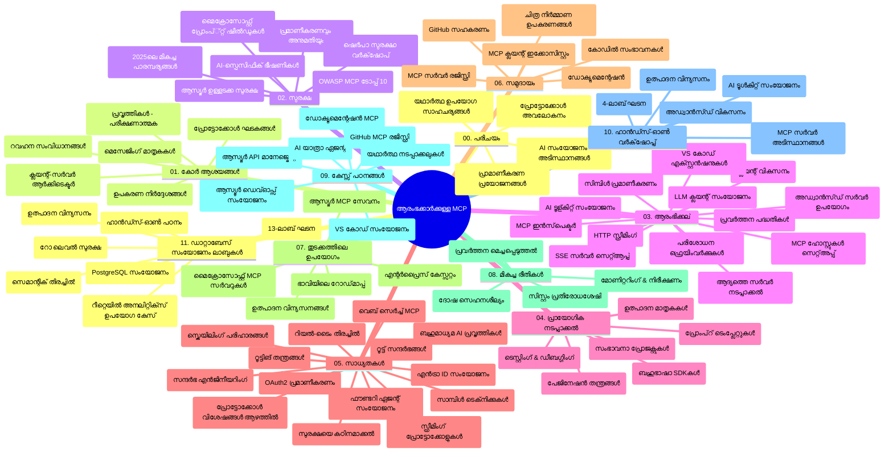

# മോഡൽ കോൺടെകスト് പ്രോട്ടോകോൾ (MCP) ആരംഭക്കാർക്ക് - പഠന ഗൈഡ്

ഈ പഠന ഗൈഡ് "മോഡൽ കോൺടെകスト് പ്രോട്ടോകോൾ (MCP) ആരംഭക്കാർക്ക്" കോഴ്സിന്റെ സ്വഭാവവും ഉള്ളടക്കവും സംഗ്രഹിക്കുന്നു. റെപ്പോസിറ്ററി ദക്ഷിണമായി നയിക്കുന്നതിന് ഈ ഗൈഡ് ഉപയോഗിച്ച് ലഭ്യമായ വസ്തുക്കളിൽ പരമാവധി പ്രയോജനം എടുക്കുക.

## റെപ്പോസിറ്ററി അവലോകനം

മോഡൽ കോൺടെകスト് പ്രോട്ടോകോൾ (MCP) AI മോഡലുകളും ക്ലൈന്റ് ആപ്ലിക്കേഷനും തമ്മിലുള്ള ഇടപെടലുകൾക്കുള്ള ഒരു സ്റ്റാൻഡേർഡൈസ്ഡ് ഫ്രെയിംവർക്ക് ആണ്. ആദ്യം Anthropic ഒരുക്കിയ ഇത് ഇപ്പോള്‍ ഔദ്യോഗിക GitHub സംഘടന മുഖേന വ്യാപക MCP കമ്മ്യൂണിറ്റി പരിപാലിക്കുന്നു. AI ഡെവലപ്പർമാർക്ക്, സിസ്റ്റം ആർക്കിടെക്ചർമാർക്ക്, സോഫ്‌റ്റ്‌വെയർ എഞ്ചിനിയർമാർക്കായി C#, Java, JavaScript, Python, TypeScript ഭാഷകളിൽ കൈയിലെഴുത്ത് കോഡ് ഉദാഹരണങ്ങളോടെ സമഗ്രമായ കറിക്കുലം ഈ റെപ്പോസിറ്ററിയിൽ ലഭ്യമാണ്.

## ദൃശ്യ കറിക്കുലം മാപ്പ്

## റെപ്പോസിറ്ററി ഘടന

MCP-യുടെ വ്യത്യസ്ത аспектകൾക്ക് ശ്രദ്ധ പുലർത്തുന്ന പതിനൊന്ന് പ്രധാന വിഭാഗങ്ങളിലായി റെപ്പോസിറ്ററി ക്രമീകരിച്ചിരിക്കുന്നു:

1. **പരിചയം (00-Introduction/)**
   - മോഡൽ കോൺടെകスト് പ്രോട്ടോകോളിന്റെ അവലോകനം
   - AI പൈപ്പ്‌ലൈനുകളിൽ സ്റ്റാൻഡേർഡൈസേഷന്റെ പ്രാധാന്യം
   - പ്രായോഗിക ഉപയോക്തൃകേസുകളും ആനുകൂല്യങ്ങളും

2. **പ്രധാന ആശയങ്ങൾ (01-CoreConcepts/)**
   - ക്ലൈന്റ്-സർവർ ആർക്കിടെക്ചർ
   - പ്രോട്ടോകോൾ പ്രധാന ഘടകങ്ങൾ
   - MCP-യിലെ മെസേജിംഗ് പാറ്റേണുകൾ

3. **സുരക്ഷ (02-Security/)**
   - MCP-അടിസ്ഥാനത്തിലുള്ള സിസ്റ്റങ്ങളിലെ സുരക്ഷാ ഭീഷണികൾ
   - ആവിഷ്കാരങ്ങൾ സുരക്ഷിതമാക്കാനുള്ള മികച്ച രീതികൾ
   - ഓതന്റിക്കേഷൻ, അനുമതി തന്ത്രങ്ങൾ
   - **സമഗ്ര സുരക്ഷാ പ്രമാണങ്ങൾ**:
     - MCP Security Best Practices 2025
     - Azure Content Safety Implementation Guide
     - MCP Security Controls and Techniques
     - MCP Best Practices Quick Reference
   - **പ്രധാന സുരക്ഷാ വിഷകലാപങ്ങൾ**:
     - പ്രോംപ്റ്റ് ഇന്‍ജക്ഷൻ, ടൂൾ വിഷബാധാക്രമണങ്ങൾ
     - സെഷൻ ഹൈജാക്കിംഗ്, കടന്ന കല്പ്പുള്ള ഡെപ്യൂട്ടി പ്രശ്നങ്ങൾ
     - ടോക്കൻ പാസ്റ്റ്‌തുര്‍ ഉപയോഗത്തിലെ പ്രതിരോധങ്ങള്‍
     - അധികാനുമതികളും ആക്സസ് നിയന്ത്രണവും
     - AI ഘടകങ്ങളുടെ വിതരണ ശൃംഖല സുരക്ഷ
     - മൈക്രോസോഫ്റ്റ് പ്രോംപ്റ്റ് ഷീല്ഡുകൾ ഇന്റഗ്രേഷൻ

4. **പ്രാരംഭം (03-GettingStarted/)**
   - പരിസ്ഥിതി ക്രമീകരണവും സെറ്റപ്പും
   - അടിസ്ഥാന MCP സർവർ-ക്ലൈന്റ് സൃഷ്ടി
   - നിലവിലുള്ള അപ്ലിക്കേഷനുകളുമായി ഇന്റഗ്രേഷൻ
   - ഇതിൽ ഉൾപ്പെടുന്നു:
     - ആദ്യ സർവർ ആവിഷ്കാരം
     - ക്ലൈന്റ് ഡെവലപ്പ്മെന്റ്
     - LLM ക്ലൈന്റ് ഇന്റഗ്രേഷൻ
     - VS കോഡ് ഇന്റഗ്രേഷൻ
     - സർവർ സന്റ് ഇവന്റുകൾ (SSE) സർവർ
     - അഡ്വാൻസ്ഡ് സർവർ ഉപയോഗം
     - HTTP സ്ട്രീമിംഗ്
     - AI ടൂള്കിറ്റ് ഇന്റഗ്രേഷൻ
     - ടെസ്റ്റിംഗ് തന്ത്രങ്ങൾ
     - ഡിപ്ലോയ്മെന്റ് മാർഗ്ഗനിർദ്ദേശങ്ങൾ

5. **പ്രായോഗിക ആവിഷ്കാരം (04-PracticalImplementation/)**
   - വിവിധ പ്രോഗ്രാമിംഗ് ഭാഷകളിൽ SDKകൾ ഉപയോഗിക്കല്‍
   - ഡീബഗ്ഗിംഗ്, ടെസ്റ്റിംഗ്, സാധൂകരിക്കൽ
   - പുനരുപയോഗ യോഗ്യമായ പ്രോംപ്റ്റ് ടെംപ്ലേറ്റുകളും വർക്‌ഫ്ലോകളും സൃഷ്ടിക്കൽ
   - ഉദാഹരണ പ്രോജക്ടുകൾ

6. **ഉയർന്ന തല വിഷയങ്ങൾ (05-AdvancedTopics/)**
   - കോൺടെകസ്റ്റിന് എഞ്ചിനീയറിംഗ് ടെക്നിക്കുകൾ
   - ഫൗണ്ട്രി ഏജന്റ് ഇന്റഗ്രേഷൻ
   - മൾട്ടി-മോഡൽ AI വർക്‌ഫ്ലോകൾ
   - OAuth2 ഓതന്റിക്കേഷൻ ഡെമോകൾ
   - റിയൽ-ടൈം സെർച്ച് കഴിവുകൾ
   - റിയൽ-ടൈം സ്ട്രീമിംഗ്
   - റൂട്ട് കോൺടെകസ്റ്റുകൾ നടപ്പാക്കൽ
   - റൂട്ടിംഗ് തന്ത്രങ്ങൾ
   - സാമ്പ്ലിംഗ് സൂക്ഷ്മതകൾ
   - സ്കെയിലിംഗ് സമീപനങ്ങൾ
   - സുരക്ഷാ പരിഗണനകൾ
   - Entra ID സുരക്ഷാ ഇന്റഗ്രേഷൻ
   - വെബ് സെർച്ച് ഇന്റഗ്രേഷൻ

7. **കമ്മ്യൂണിറ്റി സംഭാവനകൾ (06-CommunityContributions/)**
   - കോഡ്, ഡോക്യുമെന്റേഷൻ സംഭാവനം ചെയ്യുന്നതെങ്ങനെ
   - GitHub വഴി സഹകരണം
   - കമ്മ്യൂണിറ്റി ചാലകങ്ങളുടെയും പ്രതികരണങ്ങളുടെയും വേഗത
   - വിവിധ MCP ക്ലൈന്റുകൾ ഉപയോഗിക്കൽ (Claude Desktop, Cline, VSCode)
   - ചിത്രജനന അടങ്ങിയ ജനപ്രിയ MCP സർവറുകളുമായി പ്രവർത്തനം

8. **ആദ്യ അളവെടുപ്പ് പഠനങ്ങൾ (07-LessonsfromEarlyAdoption/)**
   - യഥാർത്ഥ ആവിഷ്കാരങ്ങളും വിജയകഥകളും
   - MCP-അടിസ്ഥാനമാക്കിയ പരിഹാരങ്ങൾ നിർമ്മിക്കുകയും ഡിപ്ലോയ്ചെയ്യുകയും ചെയ്യൽ
   - പ്രവണതകളും ഭാവി റോഡ്‌മേപ്പും
   - **Microsoft MCP സെർവർ ഗൈഡ്**: 10 ഉൽപ്പന്നയോഗ്യ മൈക്രോസോഫ്റ്റ് MCP സർവറുകളുടെ സമഗ്ര മാർഗ്ഗനിർദ്ദേശം:
     - Microsoft Learn Docs MCP Server
     - Azure MCP Server (15 ലധികം പ്രത്യേക കണക്റ്ററുകൾ)
     - GitHub MCP Server
     - Azure DevOps MCP Server
     - MarkItDown MCP Server
     - SQL Server MCP Server
     - Playwright MCP Server
     - Dev Box MCP Server
     - Azure AI Foundry MCP Server
     - Microsoft 365 Agents Toolkit MCP Server

9. **മികച്ച ആചാരങ്ങൾ (08-BestPractices/)**
   - പ്രകടന മെച്ചപ്പെടുത്തലും ഓപ്റ്റിമൈസേഷനും
   - പരാജയ-പ്രതിരോധിയായ MCP സിസ്റ്റങ്ങൾ രൂപകൽപ്പന ചെയ്യൽ
   - ടെസ്റ്റിംഗും പ്രതിരോധന തന്ത്രങ്ങളും

10. **കേസ് സ്റ്റഡികൾ (09-CaseStudy/)**
    - MCP വൈവിധ്യം പ്രദർശിപ്പിക്കുന്ന **ഏഴ് സമഗ്ര കേസുകൾ**:
    - **Azure AI ട്രാവൽ ഏജന്റുകൾ**: Azure OpenAI, AI Search ഉപയോഗിച്ചുള്ള മൾട്ടി ഏജന്റ് ഓർക്കസ്റ്റ്രേഷൻ
    - **Azure DevOps ഇന്റഗ്രേഷൻ**: YouTube ഡേറ്റ അപ്ഡേറ്റുകളുമായി വർക്ക്‌ഫ്ലോ പ്രോസസുകൾ ഓട്ടോമേഷൻ
    - **റിയൽ-ടൈം ഡോക്യുമെന്റേഷൻ റിട്ട്രീവൽ**: Python കൺസോൾ ക്ലൈന്റ് HTTP സ്ട്രീമിംഗ് ഉപയോഗിച്ച്
    - **ഇന്ററാക്ടീവ് സ്റ്റഡി പ്ലാൻ ജനറേറ്റർ**: Chainlit വെബ് അപ്ലിക്കേഷൻ, സംഭാഷണ AI ഉം
    - **എഡിറ്ററിൽ തന്നെ ഡോക്യുമെന്റേഷൻ**: GitHub Copilot വർക്‌ഫ്ലോകളുമായി VS കോഡ് ഇന്റഗ്രേഷൻ
    - **Azure API മാനേജ്മെന്റ്**: MCP സർവർ സൃഷ്ടിക്കാനുള്ള എന്റർപ്രൈസ് API ഇന്റഗ്രേഷൻ
    - **GitHub MCP രജിസ്ട്രി**: ഇക്കോസിസ്റ്റം ഡെവലപ്‌മെന്റ്, ഏജന്റിക് ഇന്റഗ്രേഷൻ പ്ലാറ്റ്ഫോം
    - എന്റർപ്രൈസ് ഇന്റഗ്രേഷൻ, ഡവലപ്പർ ഉൽപ്പാദനക്ഷമത, ഇക്കോസിസ്റ്റം വികസനം ഉൾപ്പെടുന്ന ആവിഷ്കാര ഉദാഹരണങ്ങൾ

11. **ഹാൻഡ്സ്-ഓൺ വർക്‌ഷോപ്പ് (10-StreamliningAIWorkflowsBuildingAnMCPServerWithAIToolkit/)**
    - MCP യും AI ടൂള്ക്കിറ്റും സംയോജിപ്പിച്ച സമഗ്ര ഹാൻഡ്സ്-ഓൺ വർക്‌ഷോപ്പ്
    - AI മോഡലുകളെയും യഥാർത്ഥ ലോക ഉപകരണങ്ങളേയും ബന്ധിപ്പിക്കുന്ന ബുദ്ധിമുട്ടില്ലാത്ത അപ്ലിക്കേഷനുകൾ നിർമ്മിക്കൽ
    - അടിസ്ഥാനങ്ങൾ, കസ്റ്റം സർവർ വികസനം, ഉൽപ്പന്ന ഡിപ്ലോയ്മെന്റ് സ്ട്രാറ്റജികൾ ഉൾപ്പെടുന്ന പ്രായോഗിക ഘടകങ്ങൾ
    - **ലാബ് ഘടന**:
      - ലാബ് 1: MCP സർവർ അടിസ്ഥാനങ്ങൾ
      - ലാബ് 2: അഡ്വാൻസ്ഡ് MCP സർവർ വികസനം
      - ലാബ് 3: AI ടൂള്കിറ്റ് ഇന്റഗ്രേഷൻ
      - ലാബ് 4: ഉൽപ്പന്ന ഡിപ്ലോയ്മെൻറ്, സ്കെയിലിംഗ്
    - ഘട്ടം ഘട്ടമായി നിർദ്ദേശങ്ങളോടെയുള്ള ലാബ് അധിംബന്ധപരിപാഠം

12. **MCP സർവർ ഡാറ്റാബേസ് ഇന്റഗ്രേഷൻ ലാബുകൾ (11-MCPServerHandsOnLabs/)**
    - PostgreSQL ഇന്റഗ്രേഷനോടൊപ്പം ഉൽപ്പന്നയോഗ്യ MCP സർവറുകൾ നിർമ്മിക്കാനുള്ള **13-ലാബ് സമഗ്ര പഠന പാത**
    - Zava Retail ഉപയോക്തൃകേസുപയോഗിച്ച് യഥാർത്ഥ റീട്ടെയിൽ അനലിറ്റിക്‌സ് ആവിഷ്കാരം
    - റോ ലെവൽ സെക്യൂരിറ്റി (RLS), സെമാന്റിക് സെർച്ച്, മൾട്ടീ-ടെനന്റ് ഡാറ്റ ആക്സസ് പോലുള്ള എന്റർപ്രൈസ് ഗ്രേഡ് പാറ്റേണുകൾ
    - **സമ്പൂർണ ലാബ് ഘടന**:
      - **ലാബുകൾ 00-03: അടിസ്ഥാനങ്ങൾ** - പരിചയം, ആർക്കിടെക്ചർ, സുരക്ഷ, പരിസ്ഥിതി ക്രമീകരണം
      - **ലാബുകൾ 04-06: MCP സർവർ നിർമ്മാണം** - ഡാറ്റാബേസ് രൂപകൽപ്പന, MCP സർവർ ആവിഷ്കാരം, ടൂൾ വികസനം
      - **ലാബുകൾ 07-09: ഉയർന്ന സവിശേഷതകൾ** - സെമാന്റിക് സെർച്ച്, ടെസ്റ്റിംഗ് & ഡീബഗ്ഗിംഗ്, VS കോഡ് ഇന്റഗ്രേഷൻ
      - **ലാബുകൾ 10-12: ഉൽപ്പന്നമെങ്കിലും മികച്ച ആചാരങ്ങൾ** - ഡിപ്ലോയ്മെന്റ്, നിരീക്ഷണം, ഓപ്റ്റിമൈസേഷൻ
    - **വിദ്യാഭ്യാസ അമിതികൾ**: FastMCP ഫ്രെയിംവർക്ക്, PostgreSQL, Azure OpenAI, Azure Container Apps, Application Insights
    - **അധ്യയന ഫലങ്ങൾ**: ഉൽപ്പന്നയോഗ്യ MCP സർവറുകൾ, ഡാറ്റാബേസ് ഇന്റഗ്രേഷൻ പാറ്റേണുകൾ, AI-സൗഹൃദ അനലിറ്റിക്സ്, എന്റർപ്രൈസ് സുരക്ഷ

## അധിക რესോഴ്‌സുകൾ

റെപ്പോസിറ്ററിയിൽ സഹായിക്കുന്ന വിഭവങ്ങൾ ഉൾപ്പെടുന്നു:

- **ഇമേജ് ഫോൾഡർ**: കോഴ്സ് മുഴുവൻ ഉപയോഗിക്കുന്ന രേഖചിത്രങ്ങളും ഡയഗ്രാമുകളും
- **ഭാഷാന്തരം**: ഡോക്യുമെന്റേഷൻ സ്വയംഭാഷാന്തരം മുഖാന്തിരം ബഹുഭാഷാ പിന്തുണ
- **ഔദ്യോഗിക MCP വിഭവങ്ങൾ**:
  - [MCP Documentation](https://modelcontextprotocol.io/)
  - [MCP Specification](https://spec.modelcontextprotocol.io/)
  - [MCP GitHub Repository](https://github.com/modelcontextprotocol)

## ഈ റെപ്പോസിറ്ററി എങ്ങനെയാണ് ഉപയോഗിക്കാൻ

1. **കടന്നുപോകുന്ന പഠനം**: താളുകളെ അനുക്രമം പാലിച്ച് (00 മുതൽ 11 വരെ) പഠിക്കുക.
2. **ഭാഷാനുയോജിത ലക്ഷ്യം**: താങ്കളുടെ ഇഷ്ടപ്രകാരം ഒരു പ്രോഗ്രാമിംഗ് ഭാഷയിൽ ഉദാഹരണങ്ങൾ പരിശോധിക്കുക.
3. **പ്രയോഗാത്മക ആവിഷ്കാരം**: "Getting Started" വിഭാഗത്തിൽ നിന്നാരംഭിച്ച് ആദ്യ MCP സർവർ-ക്ലൈന്റ് സൃഷ്ടി നടത്തുക.
4. **അഡ്വാൻസ്ഡ് ആവിശ്കാരം**: അടിസ്ഥാനങ്ങൾ മനസ്സിലാക്കിയ ശേഷം ഉയർന്ന തല വിഷയങ്ങളിൽ പ്രവേശിക്കുക.
5. **കമ്മ്യൂണിറ്റി പങ്കാളിത്തം**: GitHub ചർച്ചകളും Discord ചാനലുകളും മുഖേന MCP കമ്മ്യൂണിറ്റിയിൽ ചേർന്നു വിദഗ്ധരെയും മറ്റു ഡെവലപ്പർമാരെയും കണ്ടെത്തുക.

## MCP ക്ലയന്റുകളും ഉപകരണങ്ങളും

കറിക്കുലം വിവിധ MCP ക്ലയന്റുകളും ഉപകരണങ്ങളും ഉൾക്കൊണ്ടിരിക്കുന്നു:

1. **ഔദ്യോഗിക ക്ലയന്റുകൾ**:
   - Visual Studio Code 
   - MCP Visual Studio Code-ൽ
   - Claude Desktop
   - Claude VSCode-ൽ
   - Claude API

2. **കമ്മ്യൂണിറ്റി ക്ലയന്റുകൾ**:
   - Cline (ടെർമിനൽ അടിസ്ഥാനമാക്കി)
   - Cursor (കോഡ് എഡിറ്റർ)
   - ChatMCP
   - Windsurf

3. **MCP മാനേജ്മെന്റ് ടൂളുകൾ**:
   - MCP CLI
   - MCP Manager
   - MCP Linker
   - MCP Router

## ജനപ്രിയ MCP സർവറുകൾ

നിരവധി MCP സർവറുകൾ പെരുമഴയായി അവതരിപ്പിക്കുന്നു:

1. **മൈക്രോസോഫ്റ്റ് ഔദ്യോഗിക MCP സർവറുകൾ**:
   - Microsoft Learn Docs MCP Server
   - Azure MCP Server (15+ പ്രത്യേക കണക്റ്ററുകൾ)
   - GitHub MCP Server
   - Azure DevOps MCP Server
   - MarkItDown MCP Server
   - SQL Server MCP Server
   - Playwright MCP Server
   - Dev Box MCP Server
   - Azure AI Foundry MCP Server
   - Microsoft 365 Agents Toolkit MCP Server

2. **ഔദ്യോഗിക റഫറൻസ് സർവറുകൾ**:
   - Filesystem
   - Fetch
   - Memory
   - Sequential Thinking

3. **ചിത്രജനനം**:
   - Azure OpenAI DALL-E 3
   - Stable Diffusion WebUI
   - Replicate

4. **വികസന ഉപകരണങ്ങൾ**:
   - Git MCP
   - Terminal Control
   - Code Assistant

5. **വിശേഷ സർവറുകൾ**:
   - Salesforce
   - Microsoft Teams
   - Jira & Confluence

## സംയോജനം

ഈ റെപ്പോസിറ്ററി കമ്മ്യൂണിറ്റിയുടെ സംഭാവനകൾക്ക് തുറന്നതാണ്. MCP ഇക്കോസിസ്റ്റത്തിലേക്ക് ഫലപ്രദമായി സംഭാവനം ചെയ്യുന്നതിനുള്ള മാർഗ്ഗനിർദ്ദേശങ്ങൾക്കായി കമ്മ്യൂണിറ്റി സംഭാവനകൾ സെക്ഷൻ കാണുക.

----

*ഈ പഠന ഗൈഡ് ഫെബ്രുവരി 5, 2026-ന് അവസാനമായി പുതുക്കിയതാണ്, MCP സ്പെസിഫിക്കേഷൻ 2025-11-25-ന് അനുസരിച്ചും ആ തീയതി അടിസ്ഥാനമാക്കിയുള്ള റെപ്പോസിറ്ററിയുടെ അവലോകനവും ഉൾപ്പെടുത്തുന്നു. ഈ തീയതിക്ക് ശേഷം റെപ്പോസിറ്ററി ഉള്ളടക്കം പുതുക്കപ്പെടാൻ സാധ്യതയുണ്ട്.*

---

<!-- CO-OP TRANSLATOR DISCLAIMER START -->
**കൃത്യനിർദ്ദേശം**:
ഈ രേഖ AI പരിഭാഷാ സേവനം [Co-op Translator](https://github.com/Azure/co-op-translator) ഉപയോഗിച്ച് പരിഭാഷ ചെയ്തതാണ്. ഞങ്ങൾ നിശ്ചിതത്വത്തിന് ശ്രമിക്കുന്ന പക്ഷം, സ്വയം തലവര താരതമയങ്ങൾ പിശകുകൾ അല്ലെങ്കിൽ തെറ്റുകൾ ഉൾക്കൊള്ളാവുന്നുണ്ട്. രേഖയുടെ ജനനം ഭാഷയിലെ മൗലിക രേഖ ഔദ്യോഗിക ഉറവിടമായി കണക്കാക്കപ്പെടണം. പ്രധാനപ്പെട്ട വിവരങ്ങൾക്കായി, പ്രൊഫഷണൽ മനുഷ്യ പരിഭാഷ ശുപാർശ ചെയ്യപ്പെടുന്നു. ഈ പരിഭാഷ ഉപയോഗിച്ചാൽ ഉണ്ടാകുന്ന ഏതെങ്കിലും തെറ്റിദ്ധാരണകൾക്കും വ്യാഖ്യാനപിഴച്ചുകൾക്കും ഞങ്ങൾ ഉത്തരവാദികൾ അല്ല.
<!-- CO-OP TRANSLATOR DISCLAIMER END -->