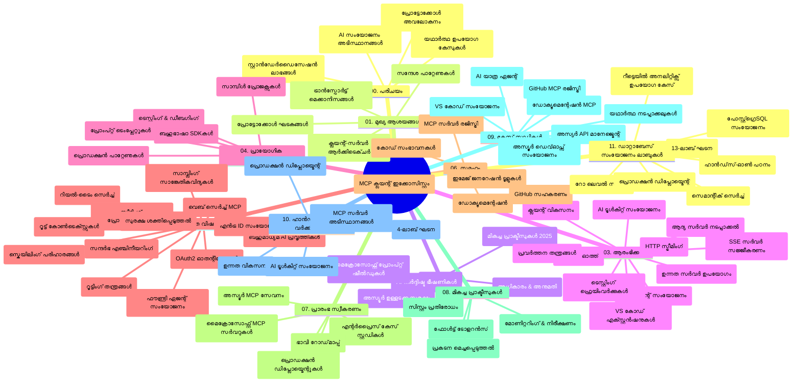

<!--
CO_OP_TRANSLATOR_METADATA:
{
  "original_hash": "af27b0acfae6caa134d9701453884df8",
  "translation_date": "2025-12-11T09:33:16+00:00",
  "source_file": "study_guide.md",
  "language_code": "ml"
}
-->
# മോഡൽ കോൺടെക്സ്റ്റ് പ്രോട്ടോക്കോൾ (MCP) ആരംഭക്കാർക്കായി - പഠന ഗൈഡ്

ഈ പഠന ഗൈഡ് "മോഡൽ കോൺടെക്സ്റ്റ് പ്രോട്ടോക്കോൾ (MCP) ആരംഭക്കാർക്കായി" പാഠ്യപദ്ധതിയുടെ റിപോസിറ്ററി ഘടനയും ഉള്ളടക്കവും അവലോകനം ചെയ്യുന്നു. റിപോസിറ്ററി ഫലപ്രദമായി നാവിഗേറ്റ് ചെയ്യാനും ലഭ്യമായ വിഭവങ്ങൾ പരമാവധി ഉപയോഗപ്പെടുത്താനും ഈ ഗൈഡ് ഉപയോഗിക്കുക.

## റിപോസിറ്ററി അവലോകനം

മോഡൽ കോൺടെക്സ്റ്റ് പ്രോട്ടോക്കോൾ (MCP) AI മോഡലുകളും ക്ലയന്റ് ആപ്ലിക്കേഷനുകളും തമ്മിലുള്ള ഇടപെടലുകൾക്കുള്ള ഒരു സ്റ്റാൻഡേർഡൈസ്ഡ് ഫ്രെയിംവർക്ക് ആണ്. ആദ്യം Anthropic നിർമ്മിച്ച MCP ഇപ്പോൾ ഔദ്യോഗിക GitHub സംഘടനയിലൂടെ MCP സമൂഹം പരിപാലിക്കുന്നു. ഈ റിപോസിറ്ററി C#, Java, JavaScript, Python, TypeScript എന്നിവയിൽ ഹാൻഡ്‌സ്-ഓൺ കോഡ് ഉദാഹരണങ്ങളോടുകൂടിയ സമഗ്ര പാഠ്യപദ്ധതി നൽകുന്നു, AI ഡെവലപ്പർമാർക്കും സിസ്റ്റം ആർക്കിടെക്റ്റുമാർക്കും സോഫ്റ്റ്വെയർ എഞ്ചിനീയർമാർക്കും അനുയോജ്യമാണ്.

## ദൃശ്യ പാഠ്യപദ്ധതി മാപ്പ്

## റിപോസിറ്ററി ഘടന

റിപോസിറ്ററി പതിനൊന്ന് പ്രധാന വിഭാഗങ്ങളായി ക്രമീകരിച്ചിരിക്കുന്നു, ഓരോന്നും MCP-യുടെ വ്യത്യസ്ത വശങ്ങളെ കേന്ദ്രീകരിക്കുന്നു:

1. **പരിചയം (00-Introduction/)**
   - മോഡൽ കോൺടെക്സ്റ്റ് പ്രോട്ടോക്കോൾ അവലോകനം
   - AI പൈപ്പ്ലൈനുകളിൽ സ്റ്റാൻഡേർഡൈസേഷൻ എന്തുകൊണ്ട് പ്രധാനമാണ്
   - പ്രായോഗിക ഉപയോഗ കേസുകളും ലാഭങ്ങളും

2. **പ്രധാന ആശയങ്ങൾ (01-CoreConcepts/)**
   - ക്ലയന്റ്-സർവർ ആർക്കിടെക്ചർ
   - പ്രധാന പ്രോട്ടോക്കോൾ ഘടകങ്ങൾ
   - MCP-യിലെ മെസേജിംഗ് പാറ്റേണുകൾ

3. **സുരക്ഷ (02-Security/)**
   - MCP അടിസ്ഥാനമാക്കിയുള്ള സിസ്റ്റങ്ങളിൽ സുരക്ഷാ ഭീഷണികൾ
   - സുരക്ഷ ഉറപ്പാക്കാനുള്ള മികച്ച പ്രാക്ടീസുകൾ
   - ഓതന്റിക്കേഷൻ, ഓതറൈസേഷൻ തന്ത്രങ്ങൾ
   - **സമഗ്ര സുരക്ഷാ ഡോക്യുമെന്റേഷൻ**:
     - MCP Security Best Practices 2025
     - Azure Content Safety Implementation Guide
     - MCP Security Controls and Techniques
     - MCP Best Practices Quick Reference
   - **പ്രധാന സുരക്ഷാ വിഷയങ്ങൾ**:
     - പ്രോംപ്റ്റ് ഇൻജക്ഷൻ, ടൂൾ വിഷബാധാക്രമണങ്ങൾ
     - സെഷൻ ഹൈജാക്കിംഗ്, കൺഫ്യൂസ്ഡ് ഡെപ്യൂട്ടി പ്രശ്നങ്ങൾ
     - ടോക്കൺ പാസ്സ്ത്രൂ ദുർബലതകൾ
     - അധികാരങ്ങൾ, ആക്‌സസ് നിയന്ത്രണം
     - AI ഘടകങ്ങളുടെ സപ്ലൈ ചെയിൻ സുരക്ഷ
     - Microsoft Prompt Shields സംയോജനം

4. **ആരംഭം (03-GettingStarted/)**
   - പരിസ്ഥിതി സജ്ജീകരണവും കോൺഫിഗറേഷനും
   - അടിസ്ഥാന MCP സർവറുകളും ക്ലയന്റുകളും സൃഷ്ടിക്കൽ
   - നിലവിലുള്ള ആപ്ലിക്കേഷനുകളുമായി ഇന്റഗ്രേഷൻ
   - ഉൾപ്പെടുന്ന വിഭാഗങ്ങൾ:
     - ആദ്യ സർവർ നടപ്പാക്കൽ
     - ക്ലയന്റ് ഡെവലപ്പ്മെന്റ്
     - LLM ക്ലയന്റ് ഇന്റഗ്രേഷൻ
     - VS Code ഇന്റഗ്രേഷൻ
     - Server-Sent Events (SSE) സർവർ
     - അഡ്വാൻസ്ഡ് സർവർ ഉപയോഗം
     - HTTP സ്ട്രീമിംഗ്
     - AI ടൂൾകിറ്റ് ഇന്റഗ്രേഷൻ
     - ടെസ്റ്റിംഗ് തന്ത്രങ്ങൾ
     - ഡിപ്ലോയ്മെന്റ് മാർഗ്ഗനിർദ്ദേശങ്ങൾ

5. **പ്രായോഗിക നടപ്പാക്കൽ (04-PracticalImplementation/)**
   - വിവിധ പ്രോഗ്രാമിംഗ് ഭാഷകളിൽ SDK ഉപയോഗിക്കൽ
   - ഡീബഗ്ഗിംഗ്, ടെസ്റ്റിംഗ്, വാലിഡേഷൻ സാങ്കേതികതകൾ
   - പുനരുപയോഗയോഗ്യമായ പ്രോംപ്റ്റ് ടെംപ്ലേറ്റുകളും വർക്ക്‌ഫ്ലോകളും രൂപകൽപ്പന
   - നടപ്പാക്കൽ ഉദാഹരണങ്ങളോടുള്ള സാമ്പിൾ പ്രോജക്ടുകൾ

6. **അഡ്വാൻസ്ഡ് വിഷയങ്ങൾ (05-AdvancedTopics/)**
   - കോൺടെക്സ്റ്റ് എഞ്ചിനീയറിംഗ് സാങ്കേതികതകൾ
   - ഫൗണ്ട്രി ഏജന്റ് ഇന്റഗ്രേഷൻ
   - മൾട്ടി-മോഡൽ AI വർക്ക്‌ഫ്ലോകൾ
   - OAuth2 ഓതന്റിക്കേഷൻ ഡെമോകൾ
   - റിയൽ-ടൈം സെർച്ച് കഴിവുകൾ
   - റിയൽ-ടൈം സ്ട്രീമിംഗ്
   - റൂട്ട് കോൺടെക്സ്റ്റുകൾ നടപ്പാക്കൽ
   - റൂട്ടിംഗ് തന്ത്രങ്ങൾ
   - സാമ്പ്ലിംഗ് സാങ്കേതികതകൾ
   - സ്കെയിലിംഗ് സമീപനങ്ങൾ
   - സുരക്ഷാ പരിഗണനകൾ
   - Entra ID സുരക്ഷാ ഇന്റഗ്രേഷൻ
   - വെബ് സെർച്ച് ഇന്റഗ്രേഷൻ

7. **സമൂഹ സംഭാവനകൾ (06-CommunityContributions/)**
   - കോഡ്, ഡോക്യുമെന്റേഷൻ സംഭാവന ചെയ്യുന്നത് എങ്ങനെ
   - GitHub വഴി സഹകരണം
   - സമൂഹം നയിക്കുന്ന മെച്ചപ്പെടുത്തലുകളും ഫീഡ്ബാക്കും
   - വിവിധ MCP ക്ലയന്റുകൾ ഉപയോഗിക്കൽ (Claude Desktop, Cline, VSCode)
   - ഇമേജ് ജനറേഷൻ ഉൾപ്പെടെയുള്ള പ്രശസ്ത MCP സർവറുകളുമായി പ്രവർത്തനം

8. **ആദ്യ സ്വീകരണത്തിൽ നിന്നുള്ള പാഠങ്ങൾ (07-LessonsfromEarlyAdoption/)**
   - യഥാർത്ഥ നടപ്പാക്കലുകളും വിജയകഥകളും
   - MCP അടിസ്ഥാനമാക്കിയുള്ള പരിഹാരങ്ങൾ നിർമ്മിക്കുകയും ഡിപ്ലോയ് ചെയ്യുകയും ചെയ്യൽ
   - ട്രെൻഡുകളും ഭാവി റോഡ്‌മാപ്പും
   - **Microsoft MCP സർവറുകൾ ഗൈഡ്**: 10 പ്രൊഡക്ഷൻ-റെഡി Microsoft MCP സർവറുകളുടെ സമഗ്ര ഗൈഡ്:
     - Microsoft Learn Docs MCP Server
     - Azure MCP Server (15+ പ്രത്യേക കണക്ടറുകൾ)
     - GitHub MCP Server
     - Azure DevOps MCP Server
     - MarkItDown MCP Server
     - SQL Server MCP Server
     - Playwright MCP Server
     - Dev Box MCP Server
     - Azure AI Foundry MCP Server
     - Microsoft 365 Agents Toolkit MCP Server

9. **മികച്ച പ്രാക്ടീസുകൾ (08-BestPractices/)**
   - പ്രകടന ട്യൂണിംഗ്, ഓപ്റ്റിമൈസേഷൻ
   - ഫാൾട്ട്-ടോളറന്റ് MCP സിസ്റ്റങ്ങൾ രൂപകൽപ്പന
   - ടെസ്റ്റിംഗ്, റിസിലിയൻസ് തന്ത്രങ്ങൾ

10. **കേസ് സ്റ്റഡികൾ (09-CaseStudy/)**
    - MCP വൈവിധ്യമാർന്ന സാഹചര്യങ്ങളിൽ പ്രയോഗം കാണിക്കുന്ന **ഏഴ് സമഗ്ര കേസ് സ്റ്റഡികൾ**:
    - **Azure AI ട്രാവൽ ഏജന്റുകൾ**: Azure OpenAI, AI Search ഉപയോഗിച്ചുള്ള മൾട്ടി-ഏജന്റ് ഓർക്കസ്ട്രേഷൻ
    - **Azure DevOps ഇന്റഗ്രേഷൻ**: YouTube ഡാറ്റ അപ്‌ഡേറ്റുകളോടെ വർക്ക്‌ഫ്ലോ പ്രക്രിയകൾ ഓട്ടോമേഷൻ
    - **റിയൽ-ടൈം ഡോക്യുമെന്റേഷൻ റിട്രീവൽ**: Python കൺസോൾ ക്ലയന്റ്, HTTP സ്ട്രീമിംഗ്
    - **ഇന്ററാക്ടീവ് സ്റ്റഡി പ്ലാൻ ജനറേറ്റർ**: Chainlit വെബ് ആപ്പ്, സംഭാഷണ AI
    - **എഡിറ്ററിൽ ഡോക്യുമെന്റേഷൻ**: VS Code ഇന്റഗ്രേഷൻ, GitHub Copilot വർക്ക്‌ഫ്ലോകൾ
    - **Azure API മാനേജ്മെന്റ്**: MCP സർവർ സൃഷ്ടിക്കപ്പെട്ട എന്റർപ്രൈസ് API ഇന്റഗ്രേഷൻ
    - **GitHub MCP രജിസ്ട്രി**: ഇക്കോസിസ്റ്റം വികസനം, ഏജന്റിക് ഇന്റഗ്രേഷൻ പ്ലാറ്റ്ഫോം
    - എന്റർപ്രൈസ് ഇന്റഗ്രേഷൻ, ഡെവലപ്പർ ഉൽപാദകത്വം, ഇക്കോസിസ്റ്റം വികസനം ഉൾപ്പെടുന്ന നടപ്പാക്കൽ ഉദാഹരണങ്ങൾ

11. **ഹാൻഡ്‌സ്-ഓൺ വർക്ക്‌ഷോപ്പ് (10-StreamliningAIWorkflowsBuildingAnMCPServerWithAIToolkit/)**
    - MCP, AI ടൂൾകിറ്റ് സംയോജിപ്പിച്ച സമഗ്ര ഹാൻഡ്‌സ്-ഓൺ വർക്ക്‌ഷോപ്പ്
    - AI മോഡലുകളും യഥാർത്ഥ ലോക ടൂളുകളും ബന്ധിപ്പിക്കുന്ന ബുദ്ധിമുട്ടുള്ള ആപ്ലിക്കേഷനുകൾ നിർമ്മിക്കൽ
    - അടിസ്ഥാനങ്ങൾ, കസ്റ്റം സർവർ ഡെവലപ്പ്മെന്റ്, പ്രൊഡക്ഷൻ ഡിപ്ലോയ്മെന്റ് തന്ത്രങ്ങൾ ഉൾപ്പെടുന്ന പ്രായോഗിക മോഡ്യൂളുകൾ
    - **ലാബ് ഘടന**:
      - ലാബ് 1: MCP സർവർ അടിസ്ഥാനങ്ങൾ
      - ലാബ് 2: അഡ്വാൻസ്ഡ് MCP സർവർ ഡെവലപ്പ്മെന്റ്
      - ലാബ് 3: AI ടൂൾകിറ്റ് ഇന്റഗ്രേഷൻ
      - ലാബ് 4: പ്രൊഡക്ഷൻ ഡിപ്ലോയ്മെന്റ്, സ്കെയിലിംഗ്
    - ലാബ് അടിസ്ഥാന പഠന സമീപനം, ഘട്ടം ഘട്ടമായ നിർദ്ദേശങ്ങൾ

12. **MCP സർവർ ഡാറ്റാബേസ് ഇന്റഗ്രേഷൻ ലാബുകൾ (11-MCPServerHandsOnLabs/)**
    - പ്രൊഡക്ഷൻ-റെഡി MCP സർവറുകൾ PostgreSQL ഇന്റഗ്രേഷനോടുകൂടി നിർമ്മിക്കുന്ന **13-ലാബ് സമഗ്ര പഠന പാത**
    - Zava Retail ഉപയോഗിച്ച് യഥാർത്ഥ റീട്ടെയിൽ അനലിറ്റിക്സ് നടപ്പാക്കൽ
    - എന്റർപ്രൈസ്-ഗ്രേഡ് പാറ്റേണുകൾ: Row Level Security (RLS), സെമാന്റിക് സെർച്ച്, മൾട്ടി-ടെനന്റ് ഡാറ്റ ആക്‌സസ്
    - **പൂർണ്ണ ലാബ് ഘടന**:
      - **ലാബുകൾ 00-03: അടിസ്ഥാനങ്ങൾ** - പരിചയം, ആർക്കിടെക്ചർ, സുരക്ഷ, പരിസ്ഥിതി സജ്ജീകരണം
      - **ലാബുകൾ 04-06: MCP സർവർ നിർമ്മാണം** - ഡാറ്റാബേസ് ഡിസൈൻ, MCP സർവർ നടപ്പാക്കൽ, ടൂൾ ഡെവലപ്പ്മെന്റ്
      - **ലാബുകൾ 07-09: അഡ്വാൻസ്ഡ് ഫീച്ചറുകൾ** - സെമാന്റിക് സെർച്ച്, ടെസ്റ്റിംഗ് & ഡീബഗ്ഗിംഗ്, VS Code ഇന്റഗ്രേഷൻ
      - **ലാബുകൾ 10-12: പ്രൊഡക്ഷൻ & മികച്ച പ്രാക്ടീസുകൾ** - ഡിപ്ലോയ്മെന്റ്, മോണിറ്ററിംഗ്, ഓപ്റ്റിമൈസേഷൻ
    - **സാങ്കേതികവിദ്യകൾ**: FastMCP ഫ്രെയിംവർക്ക്, PostgreSQL, Azure OpenAI, Azure Container Apps, Application Insights
    - **പഠന ഫലങ്ങൾ**: പ്രൊഡക്ഷൻ-റെഡി MCP സർവറുകൾ, ഡാറ്റാബേസ് ഇന്റഗ്രേഷൻ പാറ്റേണുകൾ, AI-ചാലിത അനലിറ്റിക്സ്, എന്റർപ്രൈസ് സുരക്ഷ

## അധിക വിഭവങ്ങൾ

റിപോസിറ്ററിയിൽ പിന്തുണയുള്ള വിഭവങ്ങൾ ഉൾപ്പെടുന്നു:

- **Images ഫോൾഡർ**: പാഠ്യപദ്ധതിയിൽ ഉപയോഗിച്ചിരിക്കുന്ന ഡയഗ്രാമുകളും ചിത്രീകരണങ്ങളും
- **ഭാഷാന്തരങ്ങൾ**: ഡോക്യുമെന്റേഷന്റെ സ്വയംഭാഷാന്തരങ്ങളോടുകൂടിയ ബഹുഭാഷാ പിന്തുണ
- **ഔദ്യോഗിക MCP വിഭവങ്ങൾ**:
  - [MCP Documentation](https://modelcontextprotocol.io/)
  - [MCP Specification](https://spec.modelcontextprotocol.io/)
  - [MCP GitHub Repository](https://github.com/modelcontextprotocol)

## ഈ റിപോസിറ്ററി എങ്ങനെ ഉപയോഗിക്കാം

1. **ക്രമാനുസൃത പഠനം**: ഘടകങ്ങൾ (00 മുതൽ 11 വരെ) ക്രമത്തിൽ പിന്തുടരുക, ഘടനാപരമായ പഠനാനുഭവത്തിനായി.
2. **ഭാഷാ-നിർദിഷ്ട ശ്രദ്ധ**: നിങ്ങൾക്ക് ഇഷ്ടമുള്ള പ്രോഗ്രാമിംഗ് ഭാഷയിൽ നടപ്പാക്കലുകൾ കാണാൻ സാമ്പിൾ ഡയറക്ടറികൾ പരിശോധിക്കുക.
3. **പ്രായോഗിക നടപ്പാക്കൽ**: "Getting Started" വിഭാഗം ഉപയോഗിച്ച് പരിസ്ഥിതി സജ്ജീകരിച്ച് ആദ്യ MCP സർവർ, ക്ലയന്റ് സൃഷ്ടിക്കുക.
4. **അഡ്വാൻസ്ഡ് പഠനം**: അടിസ്ഥാനങ്ങൾ മനസ്സിലാക്കിയ ശേഷം, അഡ്വാൻസ്ഡ് വിഷയങ്ങളിൽ പ്രവേശിച്ച് അറിവ് വിപുലീകരിക്കുക.
5. **സമൂഹ പങ്കാളിത്തം**: GitHub ചർച്ചകളും Discord ചാനലുകളും വഴി MCP സമൂഹത്തിൽ ചേരുക, വിദഗ്ധരും സഹ ഡെവലപ്പർമാരുമായി ബന്ധപ്പെടുക.

## MCP ക്ലയന്റുകളും ടൂളുകളും

പാഠ്യപദ്ധതി വിവിധ MCP ക്ലയന്റുകളും ടൂളുകളും ഉൾക്കൊള്ളുന്നു:

1. **ഔദ്യോഗിക ക്ലയന്റുകൾ**:
   - Visual Studio Code
   - MCP in Visual Studio Code
   - Claude Desktop
   - Claude in VSCode
   - Claude API

2. **സമൂഹ ക്ലയന്റുകൾ**:
   - Cline (ടെർമിനൽ അടിസ്ഥാനമാക്കി)
   - Cursor (കോഡ് എഡിറ്റർ)
   - ChatMCP
   - Windsurf

3. **MCP മാനേജ്മെന്റ് ടൂളുകൾ**:
   - MCP CLI
   - MCP Manager
   - MCP Linker
   - MCP Router

## പ്രശസ്ത MCP സർവറുകൾ

റിപോസിറ്ററി വിവിധ MCP സർവറുകൾ പരിചയപ്പെടുത്തുന്നു, ഉൾപ്പെടെ:

1. **ഔദ്യോഗിക Microsoft MCP സർവറുകൾ**:
   - Microsoft Learn Docs MCP Server
   - Azure MCP Server (15+ പ്രത്യേക കണക്ടറുകൾ)
   - GitHub MCP Server
   - Azure DevOps MCP Server
   - MarkItDown MCP Server
   - SQL Server MCP Server
   - Playwright MCP Server
   - Dev Box MCP Server
   - Azure AI Foundry MCP Server
   - Microsoft 365 Agents Toolkit MCP Server

2. **ഔദ്യോഗിക റഫറൻസ് സർവറുകൾ**:
   - Filesystem
   - Fetch
   - Memory
   - Sequential Thinking

3. **ഇമേജ് ജനറേഷൻ**:
   - Azure OpenAI DALL-E 3
   - Stable Diffusion WebUI
   - Replicate

4. **ഡെവലപ്പ്മെന്റ് ടൂളുകൾ**:
   - Git MCP
   - Terminal Control
   - Code Assistant

5. **പ്രത്യേക സർവറുകൾ**:
   - Salesforce
   - Microsoft Teams
   - Jira & Confluence

## സംഭാവന ചെയ്യൽ

ഈ റിപോസിറ്ററി സമൂഹത്തിൽ നിന്നുള്ള സംഭാവനകൾ സ്വാഗതം ചെയ്യുന്നു. MCP ഇക്കോസിസ്റ്റത്തിലേക്ക് ഫലപ്രദമായി സംഭാവന ചെയ്യുന്നതിന് Community Contributions വിഭാഗം കാണുക.

----

*ഈ പഠന ഗൈഡ് 2025 ഒക്ടോബർ 6-ന് അപ്ഡേറ്റ് ചെയ്തതാണ്, ആ തീയതിയിലെ റിപോസിറ്ററി അവലോകനം നൽകുന്നു. ആ തീയതിക്ക് ശേഷം റിപോസിറ്ററി ഉള്ളടക്കം അപ്ഡേറ്റ് ചെയ്യപ്പെടാം.*

---

<!-- CO-OP TRANSLATOR DISCLAIMER START -->
**അസൂയാ**:  
ഈ രേഖ AI വിവർത്തന സേവനം [Co-op Translator](https://github.com/Azure/co-op-translator) ഉപയോഗിച്ച് വിവർത്തനം ചെയ്തതാണ്. നാം കൃത്യതയ്ക്ക് ശ്രമിച്ചിട്ടുണ്ടെങ്കിലും, സ്വയം പ്രവർത്തിക്കുന്ന വിവർത്തനങ്ങളിൽ പിശകുകൾ അല്ലെങ്കിൽ തെറ്റുകൾ ഉണ്ടാകാമെന്ന് ദയവായി ശ്രദ്ധിക്കുക. അതിന്റെ മാതൃഭാഷയിലുള്ള യഥാർത്ഥ രേഖ അധികാരപരമായ ഉറവിടമായി കണക്കാക്കപ്പെടണം. നിർണായക വിവരങ്ങൾക്ക്, പ്രൊഫഷണൽ മനുഷ്യ വിവർത്തനം ശുപാർശ ചെയ്യപ്പെടുന്നു. ഈ വിവർത്തനം ഉപയോഗിക്കുന്നതിൽ നിന്നുണ്ടാകുന്ന ഏതെങ്കിലും തെറ്റിദ്ധാരണകൾക്കോ തെറ്റായ വ്യാഖ്യാനങ്ങൾക്കോ ഞങ്ങൾ ഉത്തരവാദികളല്ല.
<!-- CO-OP TRANSLATOR DISCLAIMER END -->